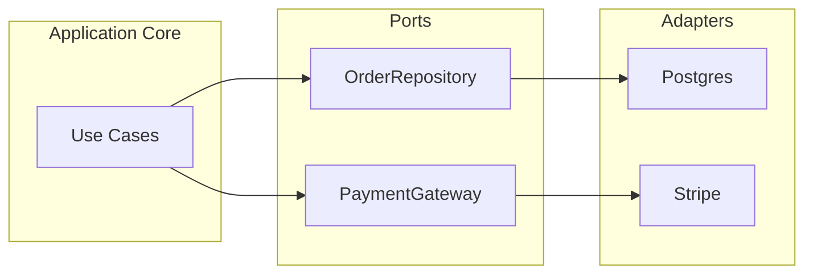
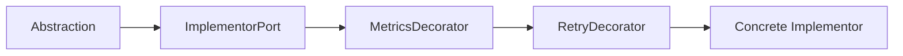
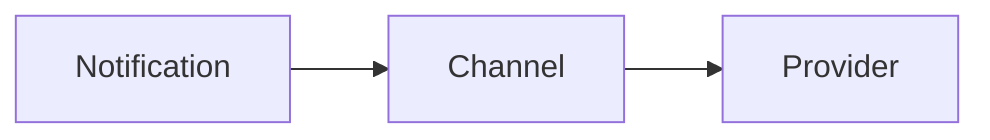

# Bridge — Senior Level

> **Source:** [refactoring.guru/design-patterns/bridge](https://refactoring.guru/design-patterns/bridge)
> **Prerequisite:** [Middle](middle.md)

---

## Table of Contents

1. [Introduction](#introduction)
2. [Architectural Patterns Around Bridge](#architectural-patterns-around-bridge)
3. [Performance Considerations](#performance-considerations)
4. [Concurrency Deep Dive](#concurrency-deep-dive)
5. [Testability Strategies](#testability-strategies)
6. [When Bridge Becomes a Problem](#when-bridge-becomes-a-problem)
7. [Code Examples — Advanced](#code-examples--advanced)
8. [Real-World Architectures](#real-world-architectures)
9. [Pros & Cons at Scale](#pros--cons-at-scale)
10. [Trade-off Analysis Matrix](#trade-off-analysis-matrix)
11. [Migration Patterns](#migration-patterns)
12. [Diagrams](#diagrams)
13. [Related Topics](#related-topics)

---

## Introduction

> Focus: **At scale, what breaks? What earns its keep?**

Bridge in toy code is "shapes × renderers." In production it's "every long-lived system that has multiple orthogonal concerns." The senior question isn't "do I write a Bridge?" — it's **"which axes am I splitting on, and what is the cost when those axes turn out to be coupled?"**

At the senior level Bridge dissolves into:

- **Hexagonal Architecture** — the application core is one hierarchy; ports/adapters are the other.
- **Plug-in systems** — the host is the abstraction; plug-ins are implementors.
- **Multi-tenant SaaS** — domain logic × tenant configuration.
- **Cross-platform / cross-cloud** — domain × infrastructure backend.

Every one is "Bridge, scaled up."

---

## Architectural Patterns Around Bridge

### 1. Hexagonal (Ports and Adapters)

```
Application Core (Use Cases) ←──port──→ Adapter (Postgres / Redis / S3 / HTTP)
     ▲                                    ▲
     └──── Refined Abstractions ──────────┘
```

The application core is the abstraction; ports are the implementor interface; adapters are concrete implementors. Bridge at the architectural scale.

### 2. Plug-in / Extension systems

VSCode, Jenkins, browser extensions: **the host** is the abstraction; **the plug-in** is a concrete implementor of a public API. Adding plug-ins doesn't change the host; adding host features doesn't break old plug-ins (with backward-compat).

### 3. Multi-tenant SaaS

`OrderProcessor` × `TenantPolicy`: same abstraction, per-tenant implementor for tax rules, currency, language. Run-time composition by tenant ID.

### 4. Strategy stack

When the implementor itself is composed of mini-strategies (a `PaymentChannel` that's actually `Stripe + Retry + Metrics`), Bridge merges with the Decorator stack discussed in Adapter — you have **Bridge with decorated implementors**.

---

## Performance Considerations

### Per-call cost

A bridge call adds:
- One **field load** (the implementor reference).
- One **virtual / interface dispatch** to the implementor.

JVM: after JIT inline-cache warmup with a monomorphic site, the dispatch becomes free. Go: ~3 ns per call. Python: ~50–150 ns per call. In normal application code, **Bridge overhead is unmeasurable.**

### When it does matter

- **Hot inner loops over millions of items.** A renderer called per pixel is a different problem than one called per frame.
- **Megamorphic implementor sites.** If 5 different renderers feed the same call site, the JVM's inline cache fails — every call goes through the full vtable. Mitigation: process in batches grouped by implementor.
- **Allocations.** If the abstraction allocates per call to translate to implementor inputs, that's GC pressure. Pre-size collections, reuse buffers.

### Batched implementors

If the implementor supports `renderAll(shapes)`, the abstraction should call it as a batch — not loop over a per-item method. Same lesson as Adapter: don't hide batching behind a per-item abstraction.

---

## Concurrency Deep Dive

### Stateless implementors

Easiest case. Many abstractions can share one implementor without locking. Strive for this: pure functions that translate input to output.

### Stateful implementors

A `Renderer` that caches glyph metrics, an `Storage` with a connection pool, a `Logger` with a buffer — all are stateful. Decisions to make:

- **One implementor shared by many abstractions.** Implementor must be thread-safe (locks, concurrent collections, immutability).
- **One implementor per abstraction.** No cross-instance contention; potentially more memory.
- **Pool of implementors.** Like a database connection pool — managed externally.

### Cross-bridge synchronization

If the abstraction's call sequence has invariants (e.g., `begin → emit → emit → commit`), the implementor must honor them — single-threaded, or with locks scoped to a session. The bridge interface should make these invariants explicit (typestate, builder, or session object).

### Cancellation / context

Like Adapter: pass `Context` (Go) or `CancelToken` (Java/.NET) through the bridge so the implementor can short-circuit when the abstraction's caller cancels.

---

## Testability Strategies

### Fakes per side

A **recording implementor** captures calls so the abstraction's tests can assert "we called `renderCircle(5)` then `renderCircle(7)`." Avoids brittle mocks.

### Fakes for the abstraction

Less common, but useful when testing implementor reuse. A trivial abstraction that just calls `renderCircle(1)` lets you exercise the implementor in isolation.

### Property-based tests on the contract

The implementor interface defines a contract (e.g., "after `save(x)`, `load(x.id) == x`"). Run the same property tests against every concrete implementor. If the in-memory implementor passes and Postgres fails, you know it's a Postgres-specific bug.

### Visual / golden tests

For renderers, compare output bytes against a stored golden file. Catches subtle regressions when you add new abstractions or implementors.

---

## When Bridge Becomes a Problem

### Symptom 1 — Implementor interface keeps growing

You add `setStrokeWidth`, then `setShadow`, then `setFilter`. The interface bloats; only one implementor uses each. **Fix:** Interface segregation. Split into `BasicRenderer`, `StyledRenderer`, `EffectsRenderer`. Each abstraction declares which it needs.

### Symptom 2 — Implementor leaks through abstraction's API

`shape.draw()` returns a `RasterPixmap` from the raster renderer. Now clients depend on the implementor type. **Fix:** translate at the bridge — return abstraction-level types only.

### Symptom 3 — Changes ripple through both sides

Every Shape change forces a Renderer change. The dimensions weren't orthogonal. **Fix:** rethink the cut. Maybe the second axis was illusory.

### Symptom 4 — Combinatorial state explosion in implementors

Each implementor has internal flags `(if vector and antialiased and ...)`. The implementor itself has become a class explosion. **Fix:** apply Bridge again *inside* the implementor.

### Symptom 5 — Runtime swap is rare

You configured the bridge "in case we need to swap" and never did. The cost stayed; the benefit never materialized. **Fix:** be honest — collapse the bridge to a single class. Re-introduce it only when the second implementor actually arrives.

---

## Code Examples — Advanced

### Bridge + Decorator on the implementor

```go
// Implementor
type PaymentChannel interface {
    Charge(ctx context.Context, amount Money) (Receipt, error)
}

// Concrete implementor: thin Stripe call
type stripeChannel struct{ client *stripe.Client }
func (s *stripeChannel) Charge(ctx context.Context, a Money) (Receipt, error) { /* ... */ }

// Decorator on the implementor: retry
type retryingChannel struct{ inner PaymentChannel; backoff Backoff }
func (r *retryingChannel) Charge(ctx context.Context, a Money) (Receipt, error) { /* ... */ }

// Decorator: metrics
type metricsChannel struct{ inner PaymentChannel; m Metrics }
func (m *metricsChannel) Charge(ctx context.Context, a Money) (Receipt, error) { /* ... */ }

// Abstraction: a use-case
type Checkout struct{ channel PaymentChannel }

func (c *Checkout) Pay(ctx context.Context, cart Cart) (Receipt, error) {
    return c.channel.Charge(ctx, cart.Total())
}

// Wiring
ch := &metricsChannel{inner: &retryingChannel{inner: &stripeChannel{client: cli}}}
checkout := &Checkout{channel: ch}
```

The abstraction (`Checkout`) doesn't know about retries or metrics. They wrap the implementor.

### Three-hierarchy nested Bridge (Java)

```java
// Outer Bridge: Notification × Channel
public abstract class Notification { protected final Channel channel; ... }

// Channel itself is an Abstraction over Provider
public abstract class Channel {
    protected final Provider provider;
    protected Channel(Provider p) { this.provider = p; }
    public abstract void send(String to, String subject, String body);
}

public final class EmailChannel extends Channel {
    public EmailChannel(Provider p) { super(p); }
    @Override public void send(String to, String subject, String body) {
        provider.deliver(new Envelope(to, subject + "\n\n" + body));
    }
}

public final class SmsChannel extends Channel {
    public SmsChannel(Provider p) { super(p); }
    @Override public void send(String to, String _ignored, String body) {
        provider.deliver(new Envelope(to, body));
    }
}

// Provider implementor
public interface Provider { void deliver(Envelope e); }
public final class MailgunProvider implements Provider { ... }
public final class TwilioProvider implements Provider { ... }
public final class FcmProvider implements Provider { ... }
```

Three orthogonal concerns: the kind of notification (welcome, receipt), the channel (email, sms), the provider (mailgun, twilio). Two bridge edges, three layers.

### Hexagonal layout (Java)

```
src/main/java/com/acme/orders/
  domain/                  ← entities, value objects, no I/O
  application/             ← use cases (the abstractions)
    PlaceOrder.java
    CancelOrder.java
  ports/                   ← implementor interfaces
    OrderRepository.java
    PaymentGateway.java
    EventPublisher.java
  adapters/                ← concrete implementors
    persistence/
      PostgresOrderRepository.java
      InMemoryOrderRepository.java
    payments/
      StripePaymentGateway.java
    events/
      KafkaEventPublisher.java
```

`PlaceOrder` is the abstraction; the three ports are implementor interfaces. Adapters are concrete implementors. The whole architecture is one giant Bridge.

---

## Real-World Architectures

### A — Multi-cloud storage abstraction

A startup runs on AWS today. Tomorrow they want GCP for compliance. They define `BlobStore` and write `S3Adapter`, `GcsAdapter`, `LocalFsAdapter`. Years later, when AWS prices spike, switching is one config flag. Bridge across the cloud axis.

### B — Per-tenant rule engine

A tax SaaS has `TaxCalculator` (the abstraction) and `JurisdictionRules` (the implementor) — one rules implementor per state/country. Adding Mexico is one class. Adding a new calculation type (luxury surcharge) is one class. The tenant ID picks the implementor at runtime.

### C — Cross-platform UI toolkit

React Native, Flutter, MAUI: domain widgets (Button, List, Form) × platform renderers (iOS, Android, Web). Without Bridge there'd be 100+ classes. With it, `n + m` per platform/widget.

### D — Database driver standards

JDBC and ODBC are Bridge at industry scale: `Connection`/`Statement`/`ResultSet` are the abstractions; per-database drivers are the concrete implementors. New databases plug in without changing application code.

---

## Pros & Cons at Scale

### Pros (at scale)

- **Independent release cadence.** Renderer team ships a Vulkan backend without coordinating with the Shape team.
- **Lower coordination cost across teams.** Each owns one side of the bridge.
- **Configuration-driven combinations.** YAML/JSON wires implementors per environment, tenant, or feature flag.
- **Test isolation.** Fake implementors enable fast, network-free tests.
- **Compliance boundaries.** PCI-DSS / GDPR scope often aligns with a bridge cut.

### Cons (at scale)

- **Interface drift.** Two interfaces evolve; one of them eventually leaks vendor specifics.
- **Reader confusion.** People mistake Bridge for Adapter or Strategy and "fix" the wrong thing.
- **Locked into a cut.** The two dimensions you split on become permanent. Re-cutting later is invasive.
- **Lowest common denominator.** Implementor interface only exposes what every implementor can do; vendor-specific power is hidden.
- **Indirection for distributed tracing.** More spans through the call graph.

---

## Trade-off Analysis Matrix

| Concern | Plain inheritance | Strategy (single slot) | Bridge (two hierarchies) | Hexagonal (system-scale Bridge) |
|---|---|---|---|---|
| **Setup cost** | Lowest | Low | Medium | High |
| **Class explosion risk** | High (N×M) | None | None | None |
| **Run-time composition** | None | Yes | Yes | Yes |
| **Suitable scale** | A few cells | Single algorithm slot | One module / library | Whole system |
| **Test isolation** | Hard | Good | Good | Best |
| **Cross-team boundary** | Bad | OK | Good | Designed for it |
| **Reader cognitive load** | Lowest | Low | Medium | High (needs onboarding) |

---

## Migration Patterns

### Pattern 1 — From class explosion to Bridge

You inherit a codebase with 30 cross-product classes. Steps:
1. List all classes; identify the two dimensions.
2. Extract the implementor interface from one dimension's varying behavior.
3. Replace each cross-product class with `new A(new B())` factory calls.
4. Migrate call sites.
5. Delete the old subclasses.

### Pattern 2 — From Strategy to Bridge

You have a `Repository` with a `StorageStrategy` field. Over time, `Repository` itself develops variants (`UserRepository`, `OrderRepository`). The `StorageStrategy` is shared. You now have a Bridge — name it, document it.

### Pattern 3 — From Bridge to Hexagonal

A library-internal Bridge becomes the architectural seam of an entire service. Promote interfaces to top-level packages, add tests at the boundary, add a port-conformance test suite. Bridge → Hexagonal is mostly a renaming and a tightening of conventions.

### Pattern 4 — Collapsing a Bridge

The second implementor never materialized in 3 years. The bridge is dead weight. Steps: inline the implementor methods into the abstraction, delete the interface, simplify the constructor. Do this confidently — over-engineering reversal is almost always cheaper than the original engineering.

---

## Diagrams

### Hexagonal architecture (Bridge at scale)



### Bridge with decorated implementor



### Three-hierarchy chain



---

## Related Topics

- **System-scale Bridge:** Hexagonal Architecture (Cockburn), Onion (Palermo), Clean (Martin).
- **Pattern siblings:** Adapter (reactive), Strategy (single-slot), State (state-driven implementor swap), Mediator (when implementors must coordinate).
- **Testing:** contract tests across implementors, golden tests for visual implementors, property-based tests on invariants.
- **Next:** [Professional Level](professional.md) — JVM/Go internals, JIT inlining for two-hop dispatch, allocation analysis, microbenchmarks.

---

[← Back to Bridge folder](.) · [↑ Structural Patterns](../README.md) · [↑↑ Roadmap Home](../../../README.md)

**Next:** [Bridge — Professional Level](professional.md)
