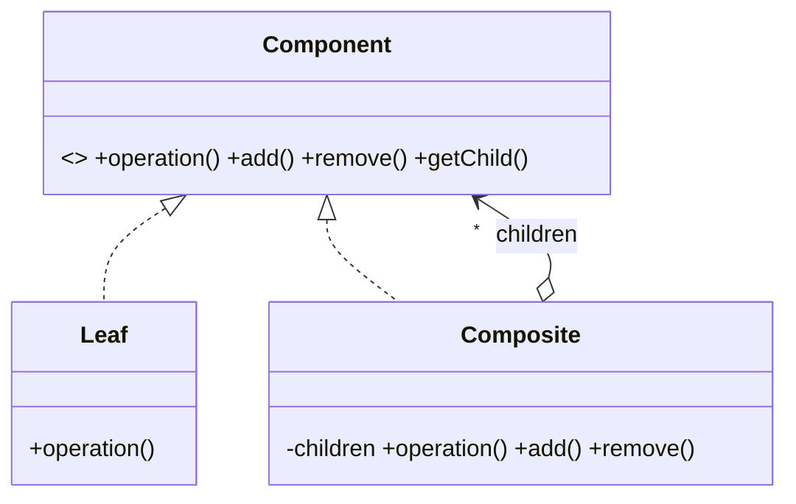
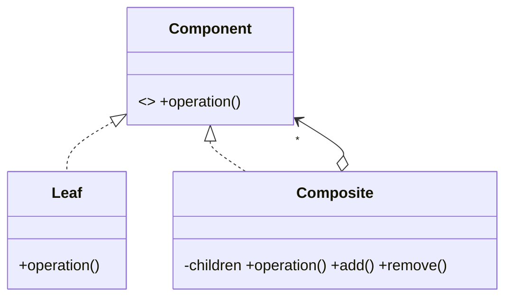
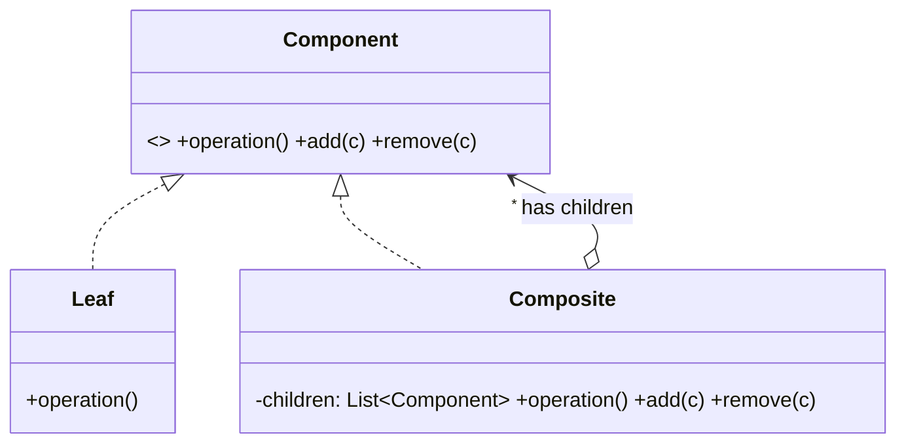
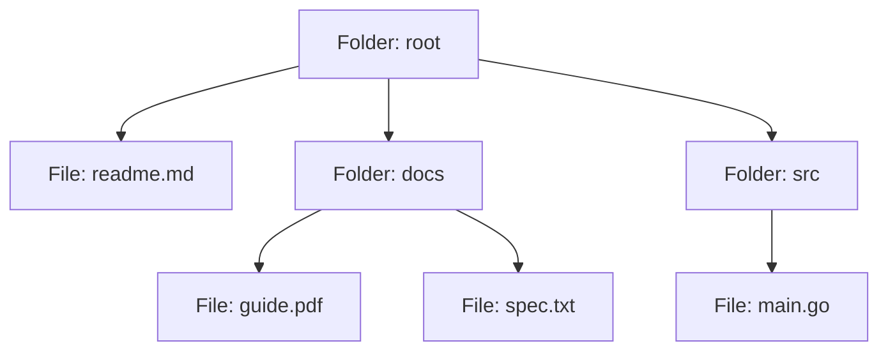
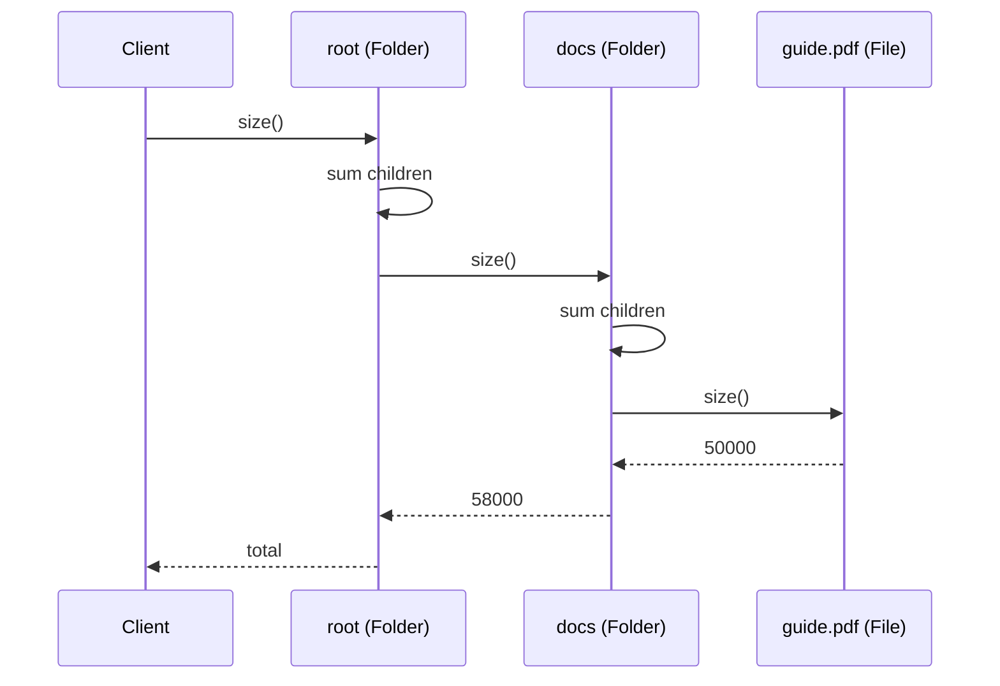

# Composite — Junior Level

> **Source:** [refactoring.guru/design-patterns/composite](https://refactoring.guru/design-patterns/composite)
> **Category:** [Structural](../README.md) — *"Explain how to assemble objects and classes into larger structures, while keeping these structures flexible and efficient."*

---

## Table of Contents

1. [Introduction](#introduction)
2. [Prerequisites](#prerequisites)
3. [Glossary](#glossary)
4. [Core Concepts](#core-concepts)
5. [Real-World Analogies](#real-world-analogies)
6. [Mental Models](#mental-models)
7. [Pros & Cons](#pros--cons)
8. [Use Cases](#use-cases)
9. [Code Examples](#code-examples)
10. [Coding Patterns](#coding-patterns)
11. [Clean Code](#clean-code)
12. [Best Practices](#best-practices)
13. [Edge Cases & Pitfalls](#edge-cases--pitfalls)
14. [Common Mistakes](#common-mistakes)
15. [Tricky Points](#tricky-points)
16. [Test Yourself](#test-yourself)
17. [Tricky Questions](#tricky-questions)
18. [Cheat Sheet](#cheat-sheet)
19. [Summary](#summary)
20. [What You Can Build](#what-you-can-build)
21. [Further Reading](#further-reading)
22. [Related Topics](#related-topics)
23. [Diagrams & Visual Aids](#diagrams--visual-aids)

---

## Introduction

> Focus: **What is it?** and **How to use it?**

**Composite** is a structural design pattern that lets you compose objects into **tree structures** and treat them — both individual leaves and whole branches — through the **same interface**. The classic example: a file system, where a file and a folder share the same operations (`size()`, `delete()`, `rename()`), even though folders contain other items.

Imagine you're building an order system. An order has line items, but a line item could itself be a *bundle* of products. You want `order.totalPrice()` to work the same regardless of nesting. Composite says: define one `OrderComponent` interface, make `Product` and `Bundle` both implement it, and let the bundle hold a list of components.

In one sentence: *"Treat one and many uniformly."*

This is the pattern that makes recursion natural in OO code. Whenever you find yourself writing code that says "if it's a leaf, do X; if it's a group, recurse" with a giant `if` chain, Composite is asking to be invited.

---

## Prerequisites

What you should know before reading this:

- **Required:** Basic OOP — interfaces, polymorphism, recursion.
- **Required:** Comfort with tree data structures (root → children → grandchildren).
- **Required:** Understanding of "is-a" vs "has-a" relationships. A Folder *is* a FileSystemItem; it *has* FileSystemItems inside.
- **Helpful:** A bit of recursion practice. Composite operations recurse naturally.

---

## Glossary

| Term | Definition |
|------|-----------|
| **Component** | The common interface for both leaves and composites. |
| **Leaf** | A primitive object with no children (e.g., `File`). |
| **Composite** | A node that contains children — both leaves and other composites (e.g., `Folder`). |
| **Client** | Code that uses Components. Doesn't know whether it's holding a leaf or a composite. |
| **Tree** | The whole nested structure. |
| **Recursive operation** | An operation defined on Component that the Composite forwards to children. |

---

## Core Concepts

### 1. Uniform Interface

The whole point: clients call `component.operation()` without checking type. A `File` returns its size; a `Folder` adds up children's sizes. Both look the same to the caller.

### 2. Recursive Structure

Composites contain Components. Components include Composites. This recursion is what makes the tree.

```
Folder
├── File
├── Folder
│   ├── File
│   └── File
└── File
```

### 3. Polymorphic Operations

Operations on the tree become recursive method calls. `delete()` on a folder deletes all children, then the folder itself.

---

## Real-World Analogies

| Concept | Analogy |
|---------|--------|
| **Component** | A "thing in a backpack" — could be a single item or another small bag. |
| **Leaf** | A pencil — no contents. Asking "how heavy?" returns the pencil's weight. |
| **Composite** | A pencil case — contains pencils and other cases. Asking "how heavy?" sums all contents. |
| **Tree** | A corporate org chart — every employee has the same `getName()`, but managers also have direct reports. |

The classical refactoring.guru example is **a box of products**: a box has products and smaller boxes; the price of the box is the sum of all products' prices, recursively.

---

## Mental Models

**The intuition:** Picture a tree. Every node, whether a single thing or a container, supports the same operations. The container's implementation says "do this for me, then ask each of my children to do it for themselves." Recursion handles depth automatically.

**Why this model helps:** It dissolves the "single vs many" distinction at the API. The client writes one loop, one method call, no conditionals.

**Visualization:**

```
            Component (interface)
                  ▲
        ┌─────────┼─────────┐
        │                   │
       Leaf             Composite ──► children: List<Component>
        │                   │
   atomic op       for child in children:
                       child.op()
```

---

## Pros & Cons

| Pros | Cons |
|------|------|
| Treats trees uniformly — no special cases for leaves vs composites | Adds complexity if your data isn't really tree-shaped |
| Adding new component types is easy | Hard to restrict the tree (e.g., "folders only contain files" — losses uniformity) |
| Recursive operations naturally work at any depth | Easy to introduce cycles → infinite recursion |
| Open/Closed: new node types don't change client code | Some operations don't fit (a folder's `read()` doesn't make sense like a file's) |
| Clean separation of structure and behavior | Memory: every node is an object with a list pointer |

### When to use:
- The data is genuinely a tree (file system, GUI hierarchies, AST, org charts)
- You want clients to operate on any node uniformly
- Operations are naturally recursive (size, render, find, validate)

### When NOT to use:
- The structure is flat (a list)
- Different node types need very different operations (forced uniformity hurts)
- The tree is performance-critical (Composite has overhead vs flat arrays)

---

## Use Cases

Real-world places where Composite is commonly applied:

- **File systems** — File / Folder / Symlink
- **GUI hierarchies** — Widget / Panel / Window (a panel contains widgets and other panels)
- **Document structure** — Paragraph / Section / Chapter / Document
- **AST and parse trees** — Expression / BinaryOp / FunctionCall
- **Organization charts** — Employee / Manager (a manager is an employee with reports)
- **Geographic hierarchies** — Country / Region / City
- **Menu systems** — MenuItem / Submenu
- **Bill of Materials (BOM)** — Part / Assembly (assemblies contain parts and sub-assemblies)

---

## Code Examples

### Go

Go's interfaces and slices make Composite natural.

```go
package main

import "fmt"

// Component.
type FsItem interface {
	Name() string
	Size() int64
	Print(indent string)
}

// Leaf.
type File struct {
	name string
	size int64
}

func (f *File) Name() string { return f.name }
func (f *File) Size() int64  { return f.size }
func (f *File) Print(indent string) {
	fmt.Printf("%s- %s (%d bytes)\n", indent, f.name, f.size)
}

// Composite.
type Folder struct {
	name     string
	children []FsItem
}

func (d *Folder) Name() string { return d.name }
func (d *Folder) Size() int64 {
	var total int64
	for _, c := range d.children {
		total += c.Size()
	}
	return total
}
func (d *Folder) Print(indent string) {
	fmt.Printf("%s+ %s/ (%d bytes)\n", indent, d.name, d.Size())
	for _, c := range d.children {
		c.Print(indent + "  ")
	}
}
func (d *Folder) Add(item FsItem) { d.children = append(d.children, item) }

func main() {
	root := &Folder{name: "root"}
	root.Add(&File{name: "readme.md", size: 1024})

	docs := &Folder{name: "docs"}
	docs.Add(&File{name: "guide.pdf", size: 50000})
	docs.Add(&File{name: "spec.txt", size: 8000})
	root.Add(docs)

	root.Print("")
	fmt.Printf("\nTotal: %d bytes\n", root.Size())
}
```

**What it does:** Both `File` and `Folder` implement `FsItem`. `Folder.Size()` recurses; `File.Size()` returns its own size.

**How to run:** `go run main.go`

---

### Java

```java
public interface FsItem {
    String name();
    long size();
    void print(String indent);
}

public final class File implements FsItem {
    private final String name;
    private final long size;
    public File(String name, long size) { this.name = name; this.size = size; }
    public String name() { return name; }
    public long size() { return size; }
    public void print(String indent) {
        System.out.printf("%s- %s (%d bytes)%n", indent, name, size);
    }
}

public final class Folder implements FsItem {
    private final String name;
    private final List<FsItem> children = new ArrayList<>();

    public Folder(String name) { this.name = name; }
    public String name() { return name; }

    public long size() {
        return children.stream().mapToLong(FsItem::size).sum();
    }

    public void print(String indent) {
        System.out.printf("%s+ %s/ (%d bytes)%n", indent, name, size());
        children.forEach(c -> c.print(indent + "  "));
    }

    public void add(FsItem item) { children.add(item); }
    public boolean remove(FsItem item) { return children.remove(item); }
    public List<FsItem> children() { return Collections.unmodifiableList(children); }
}

public class Demo {
    public static void main(String[] args) {
        Folder root = new Folder("root");
        root.add(new File("readme.md", 1024));

        Folder docs = new Folder("docs");
        docs.add(new File("guide.pdf", 50_000));
        docs.add(new File("spec.txt", 8_000));
        root.add(docs);

        root.print("");
        System.out.printf("%nTotal: %d bytes%n", root.size());
    }
}
```

**What it does:** Same recursive sizing.

**How to run:** `javac *.java && java Demo`

> **Trade-off note:** I returned `unmodifiableList(children)` to prevent the client from mutating the folder's internal list. This matters in production.

---

### Python

```python
from abc import ABC, abstractmethod
from typing import List


class FsItem(ABC):
    @abstractmethod
    def name(self) -> str: ...

    @abstractmethod
    def size(self) -> int: ...

    @abstractmethod
    def print(self, indent: str = "") -> None: ...


class File(FsItem):
    def __init__(self, name: str, size: int):
        self._name, self._size = name, size

    def name(self) -> str: return self._name
    def size(self) -> int: return self._size
    def print(self, indent: str = "") -> None:
        print(f"{indent}- {self._name} ({self._size} bytes)")


class Folder(FsItem):
    def __init__(self, name: str):
        self._name = name
        self._children: List[FsItem] = []

    def name(self) -> str: return self._name
    def size(self) -> int: return sum(c.size() for c in self._children)
    def print(self, indent: str = "") -> None:
        print(f"{indent}+ {self._name}/ ({self.size()} bytes)")
        for c in self._children:
            c.print(indent + "  ")

    def add(self, item: FsItem) -> None: self._children.append(item)
    def remove(self, item: FsItem) -> None: self._children.remove(item)


if __name__ == "__main__":
    root = Folder("root")
    root.add(File("readme.md", 1024))
    docs = Folder("docs")
    docs.add(File("guide.pdf", 50_000))
    docs.add(File("spec.txt", 8_000))
    root.add(docs)

    root.print()
    print(f"\nTotal: {root.size()} bytes")
```

**What it does:** Same tree, same recursion.

**How to run:** `python3 main.py`

---

## Coding Patterns

### Pattern 1: Transparent Composite

**Intent:** All operations live on the Component interface. Leaves and composites both implement them. Clients are blissfully ignorant.



**Trade-off:** `add()` and `remove()` show up on the Leaf interface too. Calling them on a leaf either no-ops or throws. Trades type safety for client uniformity.

---

### Pattern 2: Safe Composite

**Intent:** Only Composite has child management methods. Leaves don't pretend to support `add()`.



**Trade-off:** Client code must check the type if it wants to add. The trade is type safety for client convenience.

> **GoF guidance:** prefer Transparent if uniformity matters; Safe if you can't tolerate runtime errors on misused methods.

---

### Pattern 3: Composite with Visitor

**Intent:** Operations that don't belong on Component itself (e.g., serialization to JSON) are implemented as a Visitor that traverses the tree. Keeps the Component interface lean.

```python
class FsVisitor(ABC):
    @abstractmethod
    def visit_file(self, f: File) -> None: ...
    @abstractmethod
    def visit_folder(self, d: Folder) -> None: ...

class File(FsItem):
    def accept(self, v: FsVisitor): v.visit_file(self)
class Folder(FsItem):
    def accept(self, v: FsVisitor):
        v.visit_folder(self)
        for c in self._children: c.accept(v)
```

**Remember:** Visitor (separate pattern) is the natural extension when the Component interface starts to bloat.

---

## Clean Code

### Naming

The convention is `<thing>` for both leaf and composite, with the *interface* being the role: `FsItem`, `Component`, `Element`. Avoid splitting names like `FileLeaf` / `FolderComposite` — the leaf/composite distinction is internal.

```java
// ❌ Bad — exposes implementation
public interface FsLeafOrComposite { ... }

// ✅ Clean
public interface FsItem { ... }
```

### Children list ownership

Don't expose the internal mutable list:

```java
// ❌ Bad — clients can mutate the folder
public List<FsItem> children() { return children; }

// ✅ Clean
public List<FsItem> children() { return Collections.unmodifiableList(children); }
```

---

## Best Practices

1. **Make leaves immutable when possible.** They have no children, so nothing should change.
2. **Validate against cycles.** A folder containing itself causes infinite recursion. Either prevent on `add()` or detect on traversal.
3. **Keep the Component interface small.** Methods that only make sense for one side (`open()` for files, `iterate()` for folders) shouldn't be there.
4. **Document parent / root semantics.** Does Component know its parent? Whose responsibility is it to maintain that link?
5. **Be explicit about ordering.** If the tree's children order matters (rendering, file listings), document the contract.
6. **Use Visitor for cross-cutting operations.** Don't bolt every new operation onto Component.

---

## Edge Cases & Pitfalls

- **Cycles:** if a Composite can be added to itself or to one of its descendants, traversal loops forever. Always check.
- **Shared subtrees:** the same Component as a child of two parents — possible, but mutations from one parent affect "both" trees. Decide whether your structure allows this.
- **Empty composites:** `Folder.size()` should return 0, not throw. Handle empty children list cleanly.
- **Deep trees:** recursive `print()` can blow the stack on a 100k-depth tree. For huge trees, iterative traversal with an explicit stack.
- **Concurrent modification:** if the tree is shared, iterating while another thread adds/removes children corrupts state.
- **Operations that don't belong:** `read()` on a file makes sense; on a folder it doesn't. Avoid forcing the same operation set.

---

## Common Mistakes

1. **Type checks in client code.**

   ```python
   if isinstance(item, Folder):
       for c in item.children: ...
   else:
       item.do_something()
   ```
   This defeats the whole purpose. Push the operation into the interface.

2. **Mutable shared internal list.**

   ```java
   public List<FsItem> children() { return children; }   // mutable!
   ```

3. **Forgetting to handle recursion termination.** A `delete()` on a Composite must either delete each child (recurse) or delegate to the OS — be explicit.

4. **Component interface bloated with leaf-only or composite-only methods.** Apply Interface Segregation or Visitor.

5. **No cycle protection.** Production system grinds to a halt because someone made a folder its own parent.

---

## Tricky Points

- **Composite vs Decorator.** Decorator wraps **one** target with extra behavior; Composite wraps **many** children with the same operation. Both build trees, but Composite's tree is multi-branch; Decorator's is a chain.
- **Composite vs Iterator.** Composite is the structure; Iterator is the traversal. They compose: a Composite tree with a depth-first iterator gives you `for item in tree:`.
- **Leaf with internal children?** If a "leaf" can sometimes have one nested item, it's not a leaf — it's a degenerate Composite. Be honest about the structure.
- **Operations vs structure.** Composite is mostly about structure. Visitor handles operations that don't belong on Component.

---

## Test Yourself

1. What problem does Composite solve?
2. Name the three roles.
3. What's the difference between Transparent and Safe Composite?
4. Why is recursion natural in this pattern?
5. Give three examples from real software.
6. Why are cycles a danger?
7. When should you NOT use Composite?

<details><summary>Answers</summary>

1. Treating individual objects and groups uniformly so clients write recursive code without type checks.
2. **Component**, **Leaf**, **Composite**.
3. Transparent puts `add`/`remove` on Component (uniform but unsafe for leaves). Safe keeps them only on Composite (typesafe but client must distinguish).
4. Composite operations forward to children, which may themselves be composites — the call recurses naturally.
5. File systems, GUI hierarchies, ASTs (also: org charts, document structure, BOM).
6. They cause infinite recursion in traversal and operations.
7. Flat data, when uniformity is forced and unnatural, or when tree depth would blow the stack.

</details>

---

## Tricky Questions

> **"Isn't Composite just a tree?"**

The tree is the data structure; Composite is the *pattern* that makes it work polymorphically. The pattern's contribution is the shared interface: clients don't care whether they hold a leaf or a composite. A plain tree without a polymorphic interface is just data.

> **"How is Composite different from inheritance with a list field?"**

Inheritance gives you the same code; Composite is what we *call* it when we use it specifically to treat one and many uniformly through a common interface. Naming clarifies intent and design.

> **"Should Composite track parent pointers?"**

Optional. Some operations (depth-first navigation up, "is this in tree X?") need parent links. They cost: invariants to maintain, easy to corrupt. Add when you need them, not preemptively.

---

## Cheat Sheet

```go
// GO
type Component interface { Op() Result }
type Leaf struct{}
func (Leaf) Op() Result { return ... }
type Composite struct{ children []Component }
func (c Composite) Op() Result {
    var r Result
    for _, ch := range c.children { r = r.Combine(ch.Op()) }
    return r
}
```

```java
// JAVA
interface Component { Result op(); }
class Leaf implements Component { public Result op() { ... } }
class Composite implements Component {
    private final List<Component> children = new ArrayList<>();
    public Result op() {
        return children.stream().map(Component::op).reduce(Result.empty(), Result::combine);
    }
    public void add(Component c) { children.add(c); }
}
```

```python
# PYTHON
class Component(ABC):
    @abstractmethod
    def op(self): ...

class Leaf(Component):
    def op(self): return ...

class Composite(Component):
    def __init__(self): self._children = []
    def op(self): return reduce(combine, (c.op() for c in self._children), empty)
    def add(self, c): self._children.append(c)
```

---

## Summary

- **Composite** = treat one and many uniformly through a shared interface.
- Three roles: **Component**, **Leaf**, **Composite**.
- The Composite holds children, which can themselves be Composites — making the tree.
- Recursive operations: a method on Composite forwards to each child.
- Watch for: cycles, deep trees, leaf-only or composite-only methods polluting Component.
- Sibling pattern: **Iterator** for traversal, **Visitor** for operations that don't fit on Component.

If your data forms a tree and clients shouldn't care whether they're holding a leaf or a branch, Composite is the pattern.

---

## What You Can Build

- **Mini file system** — File, Folder, recursive size and print.
- **Document outline** — Section, Subsection, Paragraph; render to text or HTML.
- **GUI tree** — Widget, Panel, Window; recursive rendering and event dispatch.
- **Expression tree calculator** — Number, BinaryOp; evaluate recursively.
- **Org chart** — Employee, Manager (which has reports); count head-count, find highest paid.

---

## Further Reading

- **refactoring.guru source page:** [refactoring.guru/design-patterns/composite](https://refactoring.guru/design-patterns/composite)
- **GoF book:** *Design Patterns*, p. 163 (Composite)
- **JDK examples:** `java.awt.Container` → `Component` (Swing/AWT widget tree).
- **DOM:** the W3C DOM is a textbook Composite — `Node`, `Element`, `Document`.

---

## Related Topics

- **Next level:** [Composite — Middle Level](middle.md) — production patterns, immutable trees, parent pointers, performance.
- **Compared with:** [Decorator](../04-decorator/junior.md) — single chain vs multi-branch tree.
- **Naturally combined with:** Iterator (traversal), Visitor (operations).

---

## Diagrams & Visual Aids

### Class Diagram (Transparent)



### Tree Structure



### Recursion Pattern



---

[← Back to Composite folder](.) · [↑ Structural Patterns](../README.md) · [↑↑ Roadmap Home](../../../README.md)

**Next:** [Composite — Middle Level](middle.md)
