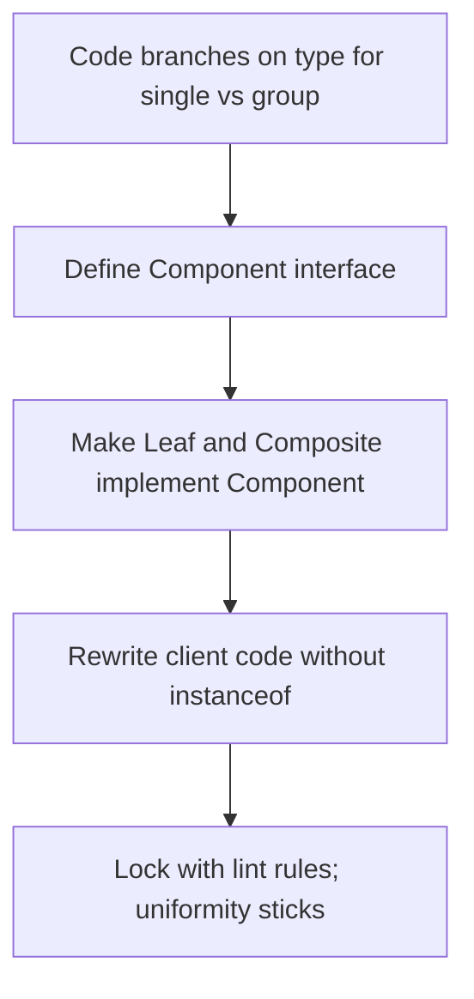
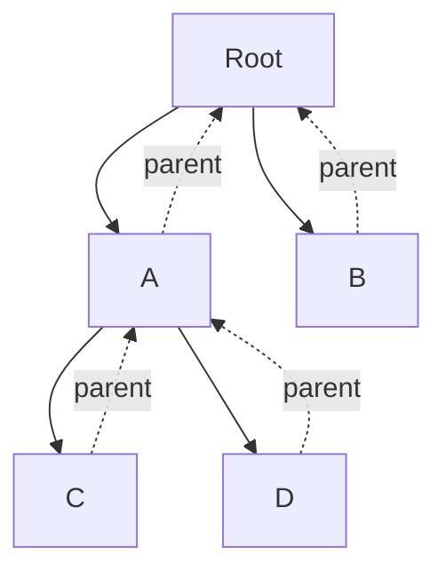

# Composite — Middle Level

> **Source:** [refactoring.guru/design-patterns/composite](https://refactoring.guru/design-patterns/composite)
> **Prerequisite:** [Junior](junior.md)

---

## Table of Contents

1. [Introduction](#introduction)
2. [When to Use Composite](#when-to-use-composite)
3. [When NOT to Use Composite](#when-not-to-use-composite)
4. [Real-World Cases](#real-world-cases)
5. [Code Examples — Production-Grade](#code-examples--production-grade)
6. [Parent Pointers](#parent-pointers)
7. [Cycle Detection](#cycle-detection)
8. [Immutable Trees](#immutable-trees)
9. [Trade-offs](#trade-offs)
10. [Alternatives Comparison](#alternatives-comparison)
11. [Refactoring to Composite](#refactoring-to-composite)
12. [Pros & Cons (Deeper)](#pros--cons-deeper)
13. [Edge Cases](#edge-cases)
14. [Tricky Points](#tricky-points)
15. [Best Practices](#best-practices)
16. [Tasks (Practice)](#tasks-practice)
17. [Summary](#summary)
18. [Related Topics](#related-topics)
19. [Diagrams](#diagrams)

---

## Introduction

> Focus: **When to use it?** and **Why?**

You already know Composite is "treat one and many uniformly." At the middle level, the harder questions are:

- **When does forced uniformity help, and when does it hurt?**
- **Should I use Transparent or Safe Composite?**
- **How do I keep the Component interface from bloating into 30 methods?**
- **What about cycles, parent pointers, deep trees, and concurrent modifications?**

This document focuses on the **decisions** that turn a textbook Composite into one that survives a year of production.

---

## When to Use Composite

Use Composite when **all** of these are true:

1. **The data is naturally tree-shaped.** Files/folders, GUI hierarchies, ASTs, BOMs — not just "a list with some grouping."
2. **Clients want to operate on any node uniformly.** No special cases for leaves vs branches in the calling code.
3. **Operations are recursive in nature.** Sum, render, search, validate — they make sense at every depth.
4. **You expect new node types over time.** Adding `Symlink` to a file system Component shouldn't ripple through clients.
5. **The Component interface is reasonably small.** Three to seven methods, not thirty.

If any one is false, look harder before reaching for Composite.

### Triggers

- "We have files and folders and they need the same operations" → Composite.
- "An order item could be a single product or a bundle of products" → Composite.
- "The UI is a tree of nested widgets that all support `render()` and `dispatch_event()`" → Composite.
- "A directory traversal that handles symlinks, files, and folders the same way" → Composite (likely with Visitor for richer ops).

---

## When NOT to Use Composite

- **The data is flat.** A list of orders is not a tree; don't fake one.
- **Operations diverge wildly.** If only 1 of 5 operations makes sense for both leaves and composites, you're forcing uniformity.
- **The tree won't grow.** A 2-level structure (Order → LineItem) without sub-bundling: a list field is enough.
- **Performance is critical and the tree is huge.** Iterating an array of structs (data-oriented design) beats virtual dispatch through Component.
- **You'd be writing a god-Component.** Component with `add()`, `remove()`, `read()`, `write()`, `accept()`, `style()`, ... is no longer a clean abstraction.

### Smell: Composite that grew

You started with `File` and `Folder`. A year later, `FsItem` has `read()`, `write()`, `chmod()`, `getInode()`, `mountPoint()`, `nfsLock()`. Half are no-ops on folders, half are no-ops on files. **Apply Visitor.** The interface should expose only what *all* nodes truly support.

---

## Real-World Cases

### Case 1 — File system with size, find, walk

A backup utility lists, sizes, filters, and walks a directory tree. With Composite + Visitor:

```
FsItem.size() → recursive sum
FsItem.find(predicate) → recursive collection
FsVisitor.walk(item) → external operation
```

Adding a new node type (compressed archive that *contains* files) is one class.

### Case 2 — Document outline (CMS)

A wiki: `Document` contains `Section` contains `Subsection` contains `Paragraph`. Composite shines for:
- Word count (recursive sum).
- Render-to-HTML (recursive output).
- Find by anchor (recursive search).
- Permissions (each section can be visible/hidden).

### Case 3 — UI widget tree (game/desktop)

`Container` (window, panel, scrollbox) contains widgets and other containers. Operations:
- Render (recursive draw).
- Hit testing (which widget is at coordinates X,Y? — recursive descent).
- Layout (recursive size negotiation).

This is exactly what Java's AWT/Swing did with `Component` and `Container`.

### Case 4 — AST (compiler)

Source code → tokens → AST. Each AST node is a Component:

```
BinaryOp(+) ─→ Number(2)
            └→ FunctionCall(f) ─→ Variable(x)
                                └→ Number(3)
```

Operations: `evaluate()`, `prettyPrint()`, `typeCheck()`. Most use Visitor because operations vary widely.

### Case 5 — Bill of Materials (BOM)

A car: 30,000 parts arranged hierarchically (engine → cylinder block → cylinder → piston). `Part.cost()` returns its own price; `Assembly.cost()` recurses. Add a new sub-assembly in 1 class.

---

## Code Examples — Production-Grade

### Example A — File system with parent pointers and cycle protection (Java)

```java
public abstract class FsItem {
    private final String name;
    private FsItem parent;            // optional — null for root

    protected FsItem(String name) { this.name = name; }
    public String name() { return name; }
    public FsItem parent() { return parent; }
    void setParent(FsItem parent) { this.parent = parent; }

    public String path() {
        if (parent == null) return name;
        return parent.path() + "/" + name;
    }

    public abstract long size();
}

public final class File extends FsItem {
    private final long size;
    public File(String name, long size) { super(name); this.size = size; }
    public long size() { return size; }
}

public final class Folder extends FsItem {
    private final List<FsItem> children = new ArrayList<>();

    public Folder(String name) { super(name); }

    public long size() {
        return children.stream().mapToLong(FsItem::size).sum();
    }

    public void add(FsItem item) {
        // Cycle protection.
        for (FsItem cur = this; cur != null; cur = cur.parent()) {
            if (cur == item) {
                throw new IllegalArgumentException("cycle: " + item.path());
            }
        }
        // Detach from old parent (move semantics).
        if (item.parent() instanceof Folder old) old.children.remove(item);
        item.setParent(this);
        children.add(item);
    }

    public boolean remove(FsItem item) {
        if (children.remove(item)) {
            item.setParent(null);
            return true;
        }
        return false;
    }

    public List<FsItem> children() { return Collections.unmodifiableList(children); }
}
```

What this gets right:
- Cycle protection on `add`.
- Move semantics: an item can only have one parent.
- `path()` walks parent chain — correct after a move.
- Internal list is encapsulated.

### Example B — Iterative traversal for deep trees (Go)

Recursive traversal blows the stack on deep nests. Use an explicit stack:

```go
func WalkAll(root FsItem, visit func(FsItem)) {
    stack := []FsItem{root}
    for len(stack) > 0 {
        n := len(stack) - 1
        cur := stack[n]
        stack = stack[:n]
        visit(cur)
        if d, ok := cur.(*Folder); ok {
            for i := len(d.children) - 1; i >= 0; i-- {
                stack = append(stack, d.children[i])   // reverse for left-to-right order
            }
        }
    }
}
```

Use this when you might encounter pathological depth (e.g., a 100k-deep CI cache, malicious zip bombs, etc.).

### Example C — Document outline with Visitor (Python)

```python
from abc import ABC, abstractmethod


class DocVisitor(ABC):
    @abstractmethod
    def visit_paragraph(self, p): ...
    @abstractmethod
    def visit_section(self, s): ...
    @abstractmethod
    def visit_document(self, d): ...


class DocItem(ABC):
    @abstractmethod
    def accept(self, v: DocVisitor) -> None: ...


class Paragraph(DocItem):
    def __init__(self, text: str): self.text = text
    def accept(self, v): v.visit_paragraph(self)


class Section(DocItem):
    def __init__(self, title: str):
        self.title = title
        self.children: list[DocItem] = []
    def accept(self, v):
        v.visit_section(self)
        for c in self.children: c.accept(v)


class Document(DocItem):
    def __init__(self):
        self.children: list[DocItem] = []
    def accept(self, v):
        v.visit_document(self)
        for c in self.children: c.accept(v)


class WordCounter(DocVisitor):
    def __init__(self): self.count = 0
    def visit_paragraph(self, p): self.count += len(p.text.split())
    def visit_section(self, s): pass
    def visit_document(self, d): pass


class HtmlRenderer(DocVisitor):
    def __init__(self): self.out: list[str] = []
    def visit_paragraph(self, p): self.out.append(f"<p>{p.text}</p>")
    def visit_section(self, s): self.out.append(f"<h2>{s.title}</h2>")
    def visit_document(self, d): self.out.append("<article>")
```

Composite + Visitor lets you add new operations (`WordCounter`, `HtmlRenderer`, `SearchIndexer`) without changing the structure classes.

---

## Parent Pointers

Some operations need to walk *up*: "what's the full path?", "is this descendant of X?", "find the next sibling."

**Decision:** add parent pointers if you need them; skip otherwise.

**Cost:**
- One extra reference per node.
- Invariants to maintain: every `add` sets parent; every `remove` clears it.
- Cycle risk: `parent.children` containing parent's ancestor.

**Best practice:** make `setParent` package-private (Java) or `_set_parent` (Python convention) so only the Composite owning the children calls it.

---

## Cycle Detection

A cycle (A → B → A or A → A) breaks every recursive operation. Two prevention strategies:

### Strategy 1: Detect on add

When adding `item` to `composite`, walk up `composite`'s ancestor chain. If you find `item`, throw.

```java
for (FsItem cur = this; cur != null; cur = cur.parent()) {
    if (cur == item) throw new IllegalArgumentException("cycle");
}
```

O(depth) per add; safe.

### Strategy 2: Detect on traversal

Carry a `Set<Component> visited` during traversal; bail out if you re-encounter a node. Tolerates DAG-like structures (shared subtrees).

### Strategy 3: Use immutability

If trees are immutable, you can't add a parent into one of its descendants — cycles become structurally impossible.

---

## Immutable Trees

Mutable trees are a constant source of bugs (concurrent modification, accidental sharing, parent invariants). Immutable variants:

```java
public abstract class FsItem {
    public abstract long size();
}

public final class File extends FsItem {
    private final String name;
    private final long size;
    public File(String n, long s) { this.name = n; this.size = s; }
    public long size() { return size; }
}

public final class Folder extends FsItem {
    private final String name;
    private final List<FsItem> children;   // immutable

    public Folder(String name, List<FsItem> children) {
        this.name = name;
        this.children = List.copyOf(children);
    }

    public long size() { return children.stream().mapToLong(FsItem::size).sum(); }

    // "Mutations" return new trees (persistent / functional style).
    public Folder withAdded(FsItem item) {
        var next = new ArrayList<>(children);
        next.add(item);
        return new Folder(name, next);
    }

    public Folder without(FsItem item) {
        var next = new ArrayList<>(children);
        next.remove(item);
        return new Folder(name, next);
    }
}
```

**Pros:** Thread-safe by construction. No invariants to break. Cycles structurally impossible.
**Cons:** Mutation costs O(depth) (need to rebuild path from root).
**Pattern combo:** persistent data structures (Clojure, Scala `immutable`) make this efficient via structural sharing.

---

## Trade-offs

| Trade-off | Pay | Get |
|---|---|---|
| Add a Component interface | A small abstraction layer | Uniform client code |
| Composite holds a children list | Memory + indirection per node | Recursive operations work naturally |
| Visitor for operations | Boilerplate per visitor | Clean Component interface |
| Parent pointers | Invariants to maintain | Upward navigation cheap |
| Immutable tree | Allocations on mutation | Thread-safety, no broken invariants |
| Cycle detection | Per-op cost | Safety from infinite recursion |

The biggest hidden cost is **interface bloat** — Component growing methods to satisfy every operation.

---

## Alternatives Comparison

| Alternative | Use when | Trade-off |
|---|---|---|
| **Plain list / array** | Flat data | Simpler, can't recurse |
| **Recursive type without Component** | Single concrete type | Less polymorphic, often fine for small cases |
| **Visitor on plain hierarchy** | Operations vary; structure is stable | Adds Visitor classes |
| **Iterator** | You only need traversal | No polymorphic operations |
| **Tagged union (sum type)** | Closed set of node types, exhaustive matching | No polymorphism, but compiler-checked |

---

## Refactoring to Composite

A common path: code branches on type to handle "single" vs "group" cases. Steps to refactor:

### Step 1 — Identify the operations done at every level

`size()`, `delete()`, `render()`. These are Component candidates.

### Step 2 — Define the Component interface

Choose Transparent or Safe. Decide whether `add`/`remove` are on Component.

### Step 3 — Make leaf and composite types implement Component

Existing `Product` becomes a Leaf; new `Bundle` becomes a Composite.

### Step 4 — Rewrite branching client code

```python
# Before:
if isinstance(item, Bundle):
    total = sum(child.price() for child in item.items)
else:
    total = item.price()

# After:
total = item.price()   # works for both
```

### Step 5 — Migrate one call site at a time

Each PR small. Tests stay green.

### Step 6 — Lock the Component interface

Add lint rules: no `instanceof` against Leaf or Composite outside the structure module. Forces uniformity to stick.

---

## Pros & Cons (Deeper)

### Pros (revisited)

- **Uniformity at the API.** Clients write recursive code without conditionals.
- **Open/Closed.** Adding `Symlink` doesn't change clients.
- **Tree depth doesn't matter to clients.** Operations work at any depth.
- **Naturally combines with Iterator and Visitor.** A rich ecosystem of patterns.

### Cons (revisited)

- **Forced uniformity hurts when operations don't fit both sides.**
- **Cycle danger.** Always design for cycles; don't assume.
- **Stack depth.** Recursion blows on deep trees; iterative needed at scale.
- **Memory overhead.** Each node is an object. Huge trees may benefit from data-oriented designs.
- **Concurrency.** Mutable trees + multi-threading = pain. Immutable trees solve, but cost allocations.

---

## Edge Cases

### 1. Empty composite

`Folder.size()` on an empty folder should return 0. Don't throw, don't return -1.

### 2. Singleton subtree shared between parents

```java
File shared = new File("a", 100);
folderA.add(shared);
folderB.add(shared);   // valid? Or move?
```

Decide and document. "Move" semantics (each item has one parent) avoids bugs but rules out shared sub-trees. "Share" allows it but mutations affect "both" parents.

### 3. Lazy children loading

A folder reading `children` on first access (lazy `readdir`) avoids pre-loading huge trees. Cache result; invalidate on mutation.

### 4. Order-sensitive children

If children order matters (UI: rendering order; file listings: alphabetical), document the contract. Some Composites need a `Comparator`.

### 5. Heterogeneous children with shared interface

Mixing wildly different node types under one Component sometimes leads to an LCD (lowest common denominator) interface. Use Interface Segregation: split Component into capability subgroups.

### 6. Persistent operations (DB)

If "add" must persist to a DB, the Composite layer leaks I/O. Consider keeping in-memory tree separate from persistence; sync via repository pattern.

---

## Tricky Points

- **Children list type matters.** `ArrayList`/`slice`/`list` is fine for small/medium trees; for high-fan-out + frequent insert/delete, consider `LinkedHashSet` or other structures.
- **Equality.** What does `folder1.equals(folder2)` mean? Same name? Same children recursively? Same identity? Pick a definition and stick to it.
- **Hashing.** A `HashMap` keyed on Component is dangerous if children mutate — hash changes silently. Either use identity hashing or freeze children before hashing.
- **Path uniqueness.** A `path()` walking parent links is O(depth). For frequent path lookups, cache (and invalidate on parent change).

---

## Best Practices

1. **Decide Transparent vs Safe early.** Don't switch later — it ripples through clients.
2. **Encapsulate the children list.** Read-only views or move semantics.
3. **Detect cycles on `add`.** Production systems break in nasty ways otherwise.
4. **Use Visitor for cross-cutting operations.** Don't bloat Component.
5. **Prefer immutability when feasible.** Especially with concurrency.
6. **Iterative traversal for unbounded depth.** Recursion is fine for a few hundred levels; iterative is mandatory for tens of thousands.
7. **Test trees with structural fixtures.** A "deep tree", "wide tree", "empty composite", "single leaf" suite catches regressions.

---

## Tasks (Practice)

1. Refactor a `Bundle` price calculator that branches on `isinstance` into a Composite with `price()`.
2. Add cycle detection to a folder-tree implementation; write a test that confirms an attempted cycle throws.
3. Convert a recursive `walk()` to iterative for a tree of depth 100,000.
4. Implement a `WordCount` Visitor for a document outline.
5. Make a previously-mutable tree immutable; measure the performance hit on a tree of 10k nodes.

---

## Summary

- Use Composite when data is genuinely tree-shaped, operations recurse, and clients shouldn't care about leaf vs branch.
- Pick **Transparent** for client uniformity; **Safe** for type-checked correctness.
- Watch out for **cycles**, **stack depth**, and **interface bloat**.
- Combine with **Visitor** for cross-cutting ops, **Iterator** for traversal, **immutability** for thread-safety.
- The big wins: open/closed for new node types, recursive operations without conditionals, clean APIs.

---

## Related Topics

- **Next:** [Senior Level](senior.md) — DOM as Composite at scale, performance, distributed trees.
- **Compared with:** [Decorator](../04-decorator/junior.md), Iterator, Visitor.
- **Architectural:** Tree-structured ASTs (compilers), DOM (browsers), scene graphs (game engines).

---

## Diagrams

### Refactoring path



### Tree with parent pointers



### Immutable mutation

```mermaid
flowchart LR
    Old[Folder v1] -->|withAdded(x)| New[Folder v2]
    Old --> Same[unchanged children]
    New --> Same
    New --> X[new x]
```

---

[← Back to Composite folder](.) · [↑ Structural Patterns](../README.md) · [↑↑ Roadmap Home](../../../README.md)

**Next:** [Composite — Senior Level](senior.md)
