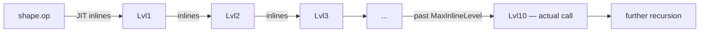
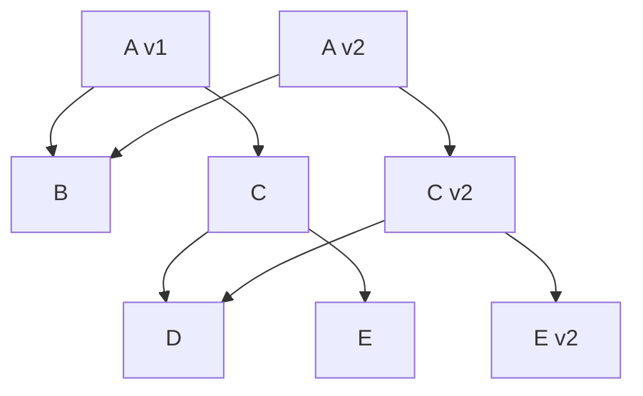

# Composite — Professional Level

> **Source:** [refactoring.guru/design-patterns/composite](https://refactoring.guru/design-patterns/composite)
> **Prerequisite:** [Senior](senior.md)

---

## Table of Contents

1. [Introduction](#introduction)
2. [Memory Layout of a Composite Tree](#memory-layout-of-a-composite-tree)
3. [Stack Depth and Recursion](#stack-depth-and-recursion)
4. [JVM: Recursive Virtual Calls and JIT](#jvm-recursive-virtual-calls-and-jit)
5. [Go: Stack Growth and Iterative Traversal](#go-stack-growth-and-iterative-traversal)
6. [CPython: Recursion Limit and Bytecode Cost](#cpython-recursion-limit-and-bytecode-cost)
7. [Cache Behavior in Tree Traversal](#cache-behavior-in-tree-traversal)
8. [GC and Tree Lifetime](#gc-and-tree-lifetime)
9. [Microbenchmark Anatomy](#microbenchmark-anatomy)
10. [Cross-Language Comparison](#cross-language-comparison)
11. [Persistent Data Structures](#persistent-data-structures)
12. [Diagrams](#diagrams)
13. [Related Topics](#related-topics)

---

## Introduction

A Composite tree at the professional level is examined for what the *runtime* makes of it: how nodes lay out in memory, how recursion behaves on each language stack, what the JIT can do with recursive virtual calls, and where the inevitable performance cliffs are.

For domains like browsers, compilers, and game engines, these answers determine whether Composite is a friend or a tax.

---

## Memory Layout of a Composite Tree

A typical composite node has:
- The component's own fields (name, attributes).
- A reference to a children container (often a list).
- Optionally, a parent pointer.

JVM (compressed OOPs) folder example:

```
+0   header (12)
+12  name (4)             ← String reference
+16  parent (4)
+20  children (4)         ← ArrayList reference
+24  cachedSize (8)       ← long
+32
```

Plus the `ArrayList` itself (24 bytes header + 16-slot Object[] = ~88 bytes initial), plus each `Object[]` slot (4 bytes per child).

Per node: ~32 bytes; per child slot: 4 bytes. A million-node tree: ~32 MB just for nodes (plus list backing arrays).

In Go, no headers — a folder struct is `~40 bytes` (name string + parent ptr + slice header + cache). Slices have one header (24 bytes) + the backing array.

In CPython, every node is a heavy object (~232 bytes minimum). A million-node Python tree pushes well past 200 MB.

**Practical:** for million-node domains, language choice matters. Browsers and game engines use C++ specifically because Python or Java memory pressure would be prohibitive.

---

## Stack Depth and Recursion

Recursive traversal `function visit(node) { visit(child) for child in node.children; }` consumes one stack frame per depth level.

| Runtime | Default stack | Frames before overflow |
|---|---|---|
| **JVM (default)** | 512 KB | ~10,000-50,000 frames |
| **Go (goroutine)** | 8 KB initial, grows to 1 GB | ~100,000 (with growth) |
| **CPython** | 1 MB OS stack + Python recursion limit (default 1000) | 1,000 by default |
| **Node.js** | ~1 MB | ~10,000 |

Pathologically deep trees hit limits surprisingly fast. Defenses:

1. **Iterative traversal with explicit stack.** Heap-allocated; growable.
2. **Bound the depth.** Refuse to ingest trees above N levels.
3. **Tail-call optimization.** Some languages (Scala, Kotlin) optimize specific patterns; not Java/Python.
4. **Increase recursion limit (Python).** `sys.setrecursionlimit(10000)` — but you also need OS stack room.

For user-controlled trees (parsing JSON, archive files, untrusted XML), **always** assume an attacker will send a 1M-deep tree.

---

## JVM: Recursive Virtual Calls and JIT

Every `child.size()` call dispatches virtually to `File.size()` or `Folder.size()`. After warmup at a monomorphic site (only one concrete subclass seen), HotSpot inlines the call. **Recursive calls inline up to a configurable depth** (`MaxInlineLevel`, default 9). Past that, recursion stays as a real call.

For Composite, this means:

- Shallow trees (≤9 deep): JIT can inline the recursion completely in hot paths. Excellent.
- Deep trees: per-call overhead becomes a real factor.
- Megamorphic site (mixed types): inline cache fails; every call hits vtable.

### Tail-call elimination?

The JVM does **not** generally eliminate tail calls. Recursive Composite traversal blows the stack at depth ≥ ~20k frames. Iterative traversal is mandatory for deep trees.

### Sealed types and CHA

Java 17's `sealed` interfaces let HotSpot prove the closed set of subtypes, enabling more aggressive devirtualization. Use them for stable Composite hierarchies.

---

## Go: Stack Growth and Iterative Traversal

Go's goroutine stacks start at 8 KB and grow. Recursion is "free" until you hit ~1 GB virtual stack (which kills the process).

**However**, each frame on a growing stack triggers stack-grow checks. For tight recursive loops, iterative traversal is measurably faster (~1.5-2× in micro-benchmarks).

Interface dispatch: ~3 ns per call. For a 1M-node tree, that's 3 ms just in dispatch — invisible vs disk I/O, perceptible vs in-memory work.

### Inlining

Go's compiler is conservative about inlining recursive functions and interface calls. Don't expect the optimizer to flatten Composite traversal.

### Pointer chasing

Each child is a heap pointer. For a fan-out-heavy tree, prefetching helps; for a deep linear tree, every level is a cache miss.

---

## CPython: Recursion Limit and Bytecode Cost

CPython is the most stack-constrained common runtime. `sys.getrecursionlimit() == 1000` by default. Recursive Composite traversal of a deep tree triggers `RecursionError`.

Per-call cost: ~150-300 ns. For a 1M-node tree, recursion is ~200 ms — dominant for in-memory work.

**Always** use iterative traversal for production Python Composite with unbounded depth.

```python
def walk(root):
    stack = [root]
    while stack:
        n = stack.pop()
        yield n
        for c in reversed(getattr(n, "children", [])):
            stack.append(c)
```

This avoids the recursion limit entirely.

### Memory

Python objects are heavy. A million `dict`-backed nodes: ~200+ MB. Use `__slots__` to drop per-instance dict (drops to ~50-80 MB):

```python
class Folder:
    __slots__ = ("name", "children", "_cached_size")
    def __init__(self, name): ...
```

---

## Cache Behavior in Tree Traversal

Modern CPUs prefetch sequential memory. Recursive tree traversal jumps to wherever each child object lives — often scattered across the heap. Cache misses dominate.

**Mitigations:**

1. **Arena allocation.** Allocate all nodes from a contiguous block. Subsequent walks have decent prefetch behavior.
2. **Pre-order / level-order rewriting.** Flatten the tree to an array; traverse the array. Loses pointer structure but cache-friendly.
3. **DOD (data-oriented design).** Separate node data into struct-of-arrays. Process by attribute, not by node.

These mitigations matter at million-node scale; below ~10k nodes, the cache misses are fine.

---

## GC and Tree Lifetime

A Composite tree is a strongly connected reference graph; the whole thing is alive as long as the root is reachable. Implications:

- **Whole-tree retention.** A small leak of the root retains every descendant.
- **Promotion to old gen.** Long-lived trees survive minor GCs and live in the old generation. Old-gen collection is more expensive per GB.
- **Children list churn.** `add`/`remove` on a child list creates short-lived `Object[]` instances when resizing — minor-GC traffic.

Detached subtrees become unreachable atomically when their root is removed. No cleanup needed; GC handles it.

CPython's reference counting destroys a removed subtree immediately — predictable, but cumulative CPU cost equals the destroyed node count.

---

## Microbenchmark Anatomy

A correct microbenchmark compares recursive vs iterative traversal at varying depths and fan-outs.

### Java JMH

```java
@State(Scope.Benchmark)
public class CompositeBench {
    Folder shallow = build(8, 4);   // depth 8, fanout 4 = ~87k nodes
    Folder deep    = buildDeep(20_000);   // depth 20k

    @Benchmark public long sumRecursive(Blackhole bh) {
        return shallow.size();   // safe: depth fits stack
    }

    @Benchmark public long sumIterative(Blackhole bh) {
        long total = 0;
        Deque<FsItem> stack = new ArrayDeque<>();
        stack.push(shallow);
        while (!stack.isEmpty()) {
            FsItem n = stack.pop();
            if (n instanceof Folder f) for (var c : f.children()) stack.push(c);
            else total += n.size();
        }
        return total;
    }
}
```

Expected: similar throughput on shallow trees (JIT inlines well). On deep trees, recursive crashes; iterative survives.

### Go

```go
func BenchmarkRecursive(b *testing.B) {
    root := buildShallow(8, 4)
    b.ResetTimer()
    for i := 0; i < b.N; i++ { _ = root.Size() }
}

func BenchmarkIterative(b *testing.B) {
    root := buildShallow(8, 4)
    b.ResetTimer()
    for i := 0; i < b.N; i++ {
        total := int64(0)
        stack := []FsItem{root}
        for len(stack) > 0 {
            n := stack[len(stack)-1]
            stack = stack[:len(stack)-1]
            if d, ok := n.(*Folder); ok { stack = append(stack, d.children...) }
            else { total += n.Size() }
        }
        _ = total
    }
}
```

Iterative is usually ~1.5× faster on Go for deep trees.

### Pitfalls

- **Dead-code elimination.** Always consume the result.
- **GC noise.** Build the tree outside the benchmark loop.
- **Warmup.** JIT needs cycles to specialize.
- **Single tree shape.** Real workloads have varying shapes; benchmark several.

---

## Cross-Language Comparison

| Concern | Java (HotSpot) | Go | Python (3.11+) |
|---|---|---|---|
| **Per-node dispatch cost (warm)** | ~0-2 ns | ~3 ns | ~50-150 ns |
| **Recursion stack depth (default)** | ~10-50k | ~100k+ (growable) | ~1k |
| **Tail-call elim** | No | No | No |
| **Memory per node** | ~30-50 bytes | ~30-40 bytes | ~150-250 bytes |
| **Inlining recursive calls** | Up to 9 levels | No | No |

---

## Persistent Data Structures

For immutable Composite trees, naive copy-on-modify is O(depth). Persistent data structures (Clojure, Scala `immutable.Map`, Immer) achieve O(log N) via **structural sharing**: the new tree shares unchanged subtrees with the old.

```
old:        new:
  A           A'
 / \         / \
B   C  →    B   C'
   /\          /\
  D  E        D  E'  (E was modified)
```

`B`, `C`, `D` are the same objects in memory. Only the path from root to the modified leaf is rebuilt.

**When to use persistent data structures:**
- Highly concurrent reads.
- Time-travel / undo / versioning.
- Functional-style reasoning desired.

Trade: more allocations than mutation, but cheap O(log N) per change with structural sharing.

---

## Diagrams

### JVM inlining limit



### Cache behavior

```
Heap (scattered nodes):
  [Folder A] @0x1000        ← cache miss
       child →
  [Folder B] @0x4080         ← cache miss
       child →
  [File C]   @0x9100         ← cache miss
```

Each node access typically misses; arena allocation helps prefetch.

### Persistent tree mutation



`B` and `D` are shared.

---

## Related Topics

- **JVM internals:** `MaxInlineLevel`, `-XX:+PrintInlining`, sealed types (Java 17+).
- **Go internals:** stack growth, iterative traversal patterns.
- **CPython internals:** recursion limit, `__slots__`, `dis` for bytecode inspection.
- **Persistent data structures:** Clojure rationale, Hickey's "Are We There Yet?" talk; Immer (JS); Scala collections.
- **Profiling:** flame graphs over Composite traversals; allocation profilers.
- **Next:** [Interview](interview.md), [Tasks](tasks.md), [Find the Bug](find-bug.md), [Optimize](optimize.md).

---

[← Back to Composite folder](.) · [↑ Structural Patterns](../README.md) · [↑↑ Roadmap Home](../../../README.md)

**Next:** [Composite — Interview Preparation](interview.md)
