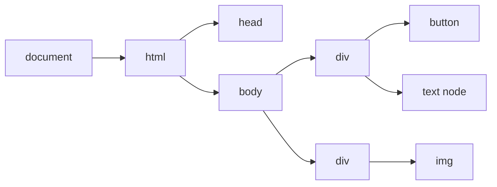
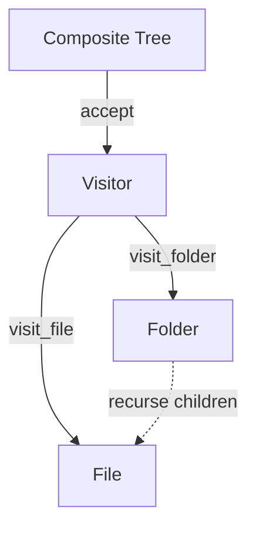
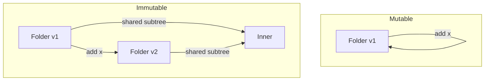

# Composite — Senior Level

> **Source:** [refactoring.guru/design-patterns/composite](https://refactoring.guru/design-patterns/composite)
> **Prerequisite:** [Middle](middle.md)

---

## Table of Contents

1. [Introduction](#introduction)
2. [Composite at Architectural Scale](#composite-at-architectural-scale)
3. [Performance Considerations](#performance-considerations)
4. [Concurrency Deep Dive](#concurrency-deep-dive)
5. [Testability Strategies](#testability-strategies)
6. [When Composite Becomes a Problem](#when-composite-becomes-a-problem)
7. [Code Examples — Advanced](#code-examples--advanced)
8. [Real-World Architectures](#real-world-architectures)
9. [Pros & Cons at Scale](#pros--cons-at-scale)
10. [Trade-off Analysis Matrix](#trade-off-analysis-matrix)
11. [Migration Patterns](#migration-patterns)
12. [Diagrams](#diagrams)
13. [Related Topics](#related-topics)

---

## Introduction

> Focus: **At scale, what breaks? What earns its keep?**

In toy code Composite is "files and folders." In production it's "the DOM," "the Swing widget tree," "the Mongo aggregation pipeline AST," "the Kubernetes resource graph." The senior question isn't "do I write a Composite?" — it's **"how does this tree behave under millions of nodes, deep nesting, concurrent reads, and partial failures?"**

At scale, Composite is no longer just a polymorphic interface — it's a system with allocation profiles, cache behavior, traversal patterns, and consistency models.

---

## Composite at Architectural Scale

### 1. The DOM

Browsers literally implement Composite. `Node` is the Component, `Element` and `Text` are concrete types, `Element` holds children. Every operation (`querySelectorAll`, `getElementsByClassName`, layout, paint) is recursive over the tree. Performance matters at this scale: real engines flatten hot operations into iterative passes.

### 2. Scene graphs (game engines)

A Unity / Unreal scene is a Composite tree of `GameObject` / `Actor`. Operations: render culling, physics broadphase, animation update — all recursive. ECS (Entity Component System) is partially a *rejection* of Composite for performance — replacing virtual dispatch with data-oriented arrays.

### 3. AST in compilers and query planners

GCC, LLVM, V8, PostgreSQL planners — all build trees of operations and rewrite them. Visitors transform; passes optimize. The Component interface stays small (`evaluate`, `accept`); behaviors live in Visitors.

### 4. Workflow / pipeline engines

Airflow DAGs, GitHub Actions composite actions, Kubernetes resource graphs. Each "step" or "resource" can recursively contain sub-steps. Composite at infrastructure scale.

### 5. Aggregation hierarchies (BI / OLAP)

Roll up sales by `Region → Country → State → City`. Each level is a Composite that knows how to aggregate from below.

---

## Performance Considerations

### Per-call cost

Composite typically costs:
- One **virtual dispatch** per node visited.
- One **list iteration** per Composite visited.

For most domains (UI rendering tens-of-thousands of nodes, file system scanning) this is fine. The expensive operations are the *work* per node, not the dispatch.

### When it matters

- **Millions of nodes.** A scene graph with 1M sprites — virtual dispatch cost adds up. Consider data-oriented refactor.
- **Hot recursive paths.** Layout/paint loops that run 60 fps × 100k nodes need to be flat. Engines convert Composite traversals to iterative passes that fit in cache.
- **Random access by ID.** A linear search of a 1M-tree is O(n). Add a side index (`Map<Id, Component>`).

### Memoization

For idempotent recursive operations (e.g., `size()` of an immutable folder), memoize the result on the Composite. Invalidate on mutation.

```java
public final class Folder extends FsItem {
    private long cachedSize = -1L;

    public long size() {
        if (cachedSize < 0) {
            cachedSize = children.stream().mapToLong(FsItem::size).sum();
        }
        return cachedSize;
    }

    public void add(FsItem item) {
        children.add(item);
        invalidateUp();
    }

    private void invalidateUp() {
        cachedSize = -1L;
        if (parent() instanceof Folder p) p.invalidateUp();
    }
}
```

---

## Concurrency Deep Dive

### Mutable trees + threads = pain

Iterating a `List<Component>` while another thread mutates it throws `ConcurrentModificationException` (Java) or worse. Strategies:

1. **Snapshot on read.** `List.copyOf(children)` before iterating. Safe but allocates.
2. **Concurrent collections.** `CopyOnWriteArrayList` for read-heavy trees.
3. **Read-write locks.** Coarse-grained around the whole tree.
4. **Immutable trees.** Replace mutation with new-tree construction; readers always see a consistent view.
5. **Locking subtree.** Each Composite has its own lock; expensive to compose correctly.

### The DOM's choice

Browsers go single-threaded (the JS event loop) precisely because a concurrent mutable tree is a nightmare. Web Workers operate on separate trees and communicate by message.

### Distributed Composite

A Composite spread across processes (e.g., a hierarchical service registry) requires consensus on mutations. Treat as a distributed-systems problem; CAP applies.

---

## Testability Strategies

### Structural fixtures

Reusable builder helpers:

```java
Folder root = folder("root",
    file("readme.md", 1024),
    folder("docs",
        file("guide.pdf", 50_000),
        file("spec.txt", 8_000)
    )
);
```

Tests read like the tree. Use a small DSL or factory methods.

### Property-based tests

Invariants that hold for any valid tree:
- `tree.size() == sum(leaf.size() for leaf in tree)`
- `walk(tree) yields every node exactly once`
- `tree.copy() == tree`

QuickCheck-style frameworks (Hypothesis, jqwik, gopter) are great for Composite.

### Visitor-based assertions

Use a recording Visitor in tests that captures the call sequence. Verify the order matches expectations.

### Approval / golden tests

For trees that render to text/HTML/JSON, snapshot the output. Subtle structural changes show up as diffs in CI.

### Cycle and corruption tests

Programmatically attempt to build cycles; assert they fail. Pre-load corrupted state from disk; assert defensive code handles it.

---

## When Composite Becomes a Problem

### Symptom 1 — Component interface has 30 methods

The pattern is being abused as the Lego board for every operation. **Fix:** apply Visitor; move ops out.

### Symptom 2 — Half the methods no-op on one type

Folders have a `read()` that returns null. Files have `addChild()` that throws. **Fix:** Interface Segregation. Split into `Readable`, `Container`, `Sized`. Each node implements what it actually supports.

### Symptom 3 — Performance dies on huge trees

Million-node scene graph; per-frame iteration thrashes cache. **Fix:** denormalize. Keep the Composite for high-level operations; for hot paths, iterate flat arrays.

### Symptom 4 — Cycles in production

A real bug leaked a cycle, traversal hung. **Fix:** add defensive cycle detection in *both* `add` and traversal. Safety net.

### Symptom 5 — Concurrency CMEs

Tree mutated while iterated. **Fix:** snapshot on read, or move to immutable trees, or single-thread mutations.

### Symptom 6 — Equality / hashing breaks

A `HashMap<Folder, ...>` corrupts after children change. **Fix:** identity hashing only, or freeze children before hashing.

---

## Code Examples — Advanced

### Composite + Iterator (Go)

```go
// A depth-first iterator that doesn't recurse.
type Iter struct{ stack []FsItem }

func NewIter(root FsItem) *Iter {
    return &Iter{stack: []FsItem{root}}
}

func (it *Iter) Next() (FsItem, bool) {
    n := len(it.stack)
    if n == 0 { return nil, false }
    cur := it.stack[n-1]
    it.stack = it.stack[:n-1]
    if d, ok := cur.(*Folder); ok {
        for i := len(d.children) - 1; i >= 0; i-- {
            it.stack = append(it.stack, d.children[i])
        }
    }
    return cur, true
}

// Usage:
for it := NewIter(root); ; {
    node, ok := it.Next()
    if !ok { break }
    visit(node)
}
```

Iteration without stack-overflow risk on deep trees.

### Composite + Visitor + Type-segregated Components (Java)

```java
public sealed interface FsItem permits File, Folder, Symlink {
    String name();
    void accept(FsVisitor v);
}

public final class File implements FsItem { ... }
public final class Folder implements FsItem {
    private final List<FsItem> children = new ArrayList<>();
    public void accept(FsVisitor v) {
        v.visitFolder(this);
        for (var c : children) c.accept(v);
    }
}
public final class Symlink implements FsItem {
    private final FsItem target;
    public void accept(FsVisitor v) { v.visitSymlink(this); }
}

public interface FsVisitor {
    void visitFile(File f);
    void visitFolder(Folder d);
    void visitSymlink(Symlink s);
}
```

`sealed` (Java 17) gives exhaustive matching — the compiler enforces visitor coverage.

### Distributed Composite (sketch)

A service registry where each "service" is a Composite of "instances":

```
Service ── Cluster ── Instance
```

Operations like `healthScore(service)` aggregate from instances up. Implementation:
- Local cache of the tree per node.
- Mutations propagate via gossip or pub-sub.
- Reads serve from local cache; writes go to a coordinator.

The Composite pattern survives; consistency is the new hard problem.

---

## Real-World Architectures

### A — Browser DOM

`Node` is Composite. ~10M nodes per page in worst-case applications. Engines use:
- C++ pointers + vtable dispatch (cheap).
- Many cached side-indexes (by ID, class name, computed style).
- Iterative layout/paint passes (no recursion in the inner loop).
- Detached/attached subtrees re-using the same Composite contract.

### B — Swing / AWT

`Component` is the Composite root. `Container` extends `Component`, holds children. Modern advice: don't deep-nest Swing trees beyond a few thousand widgets — render performance suffers.

### C — PostgreSQL planner

A SQL query becomes a tree of plan nodes (`SeqScan`, `IndexScan`, `HashJoin`). Each has the same `ExecutorRun` interface. Optimizer rewrites the tree using Visitor-style passes.

### D — Kubernetes resources

A `Deployment` controls a `ReplicaSet` controls `Pods`. Conceptually a Composite where each level is a controller. The control plane reconciles by walking the tree and adjusting children.

### E — Game scene graphs

Unity's `GameObject` hierarchy is Composite. Modern engines bypass it for hot paths via ECS — Composite for editing/structure, ECS for runtime updates.

---

## Pros & Cons at Scale

### Pros (at scale)

- **Uniform API across vastly different node types.**
- **Open/closed.** Adding `WebSocketComponent` to a UI tree doesn't change layout code.
- **Visitor-based extensibility.** New operations (export, indexing, audit) without touching node classes.
- **Match for many real-world hierarchies.** File systems, DOMs, ASTs, BOMs, org charts.

### Cons (at scale)

- **Performance ceiling.** Virtual dispatch and pointer chasing are slow per node. Hot loops need data-oriented redesign.
- **Memory.** Each node = an object. Million-node trees need sharing or flat layouts.
- **Concurrency.** Mutable trees are dangerous; immutable ones cost allocations.
- **Consistency.** Distributed Composite enters distributed-systems territory.
- **Debugging.** Deeply nested trees are hard to visualize and step through.

---

## Trade-off Analysis Matrix

| Concern | Plain list | Composite (mutable) | Composite (immutable) | Data-oriented (no Composite) |
|---|---|---|---|---|
| **Setup cost** | Lowest | Medium | Medium | High |
| **Recursion natural** | No | Yes | Yes | Manual |
| **Thread safety** | Easy | Hard | Easy | Easy |
| **Mutation cost** | O(1) | O(1) local | O(depth) | O(1) |
| **Cache friendliness** | High (flat) | Low (pointer chasing) | Low | Highest |
| **Million-node OK** | Yes | Marginal | Marginal | Yes |
| **Code clarity** | High | High | Medium | Lower |

---

## Migration Patterns

### Pattern 1 — From `instanceof` chain to Composite

Code with `if (item is X) ... else if (item is Y) ...` that always handles every type. Lift the operation onto Component; delete branches.

### Pattern 2 — From recursive to iterative

A Composite that survives deep nests needs iterative traversal. Replace recursion in hot/risky paths with explicit-stack iteration. Keep recursion in non-critical helpers (printing, debugging).

### Pattern 3 — From mutable to immutable

A constant source of bugs (parent invariants, concurrent mutations) can be eliminated by going immutable. Migrate one operation at a time: each mutator returns a new tree. Existing code calling `tree.add(x)` becomes `tree = tree.withAdded(x)`.

### Pattern 4 — From Composite to ECS / data-oriented

When performance demands. Keep Composite for editor/structure code; use a flat array of components in the runtime hot loop. Two views, one source of truth.

### Pattern 5 — Adding Visitor

Operations multiply (export to JSON, render HTML, validate, audit). Pull them out of Component into Visitors. Component stays small.

---

## Diagrams

### Browser DOM at scale



### Composite + Visitor



### Mutable vs immutable mutation



---

## Related Topics

- **System-scale Composite:** DOM, Swing/AWT, scene graphs, AST, K8s resources.
- **Pattern siblings:** Iterator (traversal), Visitor (operations), Decorator (single-target wrapping), Flyweight (sharing leaf instances).
- **Functional cousins:** persistent data structures, structural sharing, recursive sum types.
- **Next:** [Professional Level](professional.md) — JIT inlining of recursive virtual calls, allocation behavior, deep-tree benchmarks.

---

[← Back to Composite folder](.) · [↑ Structural Patterns](../README.md) · [↑↑ Roadmap Home](../../../README.md)

**Next:** [Composite — Professional Level](professional.md)
