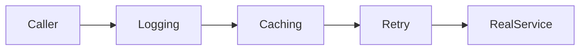
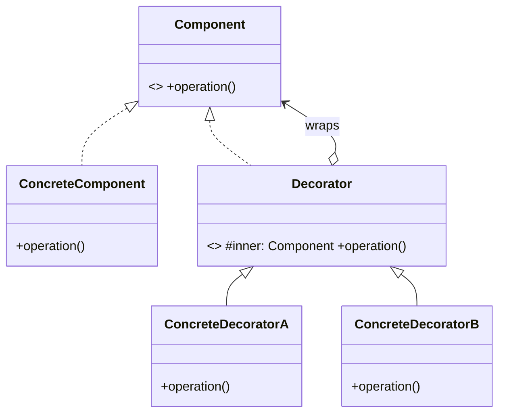
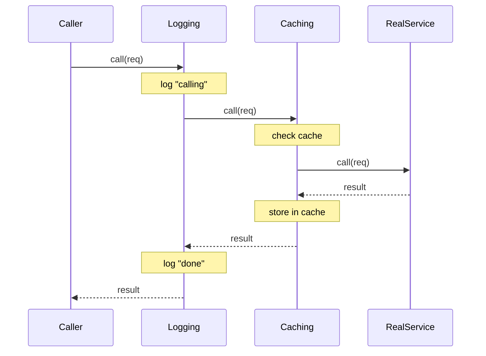

# Decorator — Junior Level

> **Source:** [refactoring.guru/design-patterns/decorator](https://refactoring.guru/design-patterns/decorator)
> **Category:** [Structural](../README.md) — *"Explain how to assemble objects and classes into larger structures, while keeping these structures flexible and efficient."*

---

## Table of Contents

1. [Introduction](#introduction)
2. [Prerequisites](#prerequisites)
3. [Glossary](#glossary)
4. [Core Concepts](#core-concepts)
5. [Real-World Analogies](#real-world-analogies)
6. [Mental Models](#mental-models)
7. [Pros & Cons](#pros--cons)
8. [Use Cases](#use-cases)
9. [Code Examples](#code-examples)
10. [Coding Patterns](#coding-patterns)
11. [Clean Code](#clean-code)
12. [Best Practices](#best-practices)
13. [Edge Cases & Pitfalls](#edge-cases--pitfalls)
14. [Common Mistakes](#common-mistakes)
15. [Tricky Points](#tricky-points)
16. [Test Yourself](#test-yourself)
17. [Tricky Questions](#tricky-questions)
18. [Cheat Sheet](#cheat-sheet)
19. [Summary](#summary)
20. [What You Can Build](#what-you-can-build)
21. [Further Reading](#further-reading)
22. [Related Topics](#related-topics)
23. [Diagrams & Visual Aids](#diagrams--visual-aids)

---

## Introduction

> Focus: **What is it?** and **How to use it?**

**Decorator** is a structural design pattern that lets you attach new behaviors to objects by placing them inside special **wrapper** objects that contain those behaviors. The wrapper looks like the wrapped object — same interface — so callers can keep using it as if nothing changed.

Imagine you bought a coffee. You can drink it black, but you can also add milk, sugar, and a cinnamon shake. Each addition wraps the previous: `cinnamon(sugar(milk(coffee)))`. Each step costs more and tastes different. The coffee shop didn't write `MilkSugarCinnamonCoffee` as a class — they composed three small wrappers.

In one sentence: *"Add behavior to an object by wrapping it in another that has the same interface."*

The pattern's signature trait is **stacking**: many decorators chained around one target. Each layer adds a slice of behavior — caching, logging, retry, validation, encryption — without modifying the original class.

---

## Prerequisites

What you should know before reading this:

- **Required:** Basic OOP — interfaces, classes, polymorphism.
- **Required:** Composition over inheritance. Decorator is the canonical "favor composition" pattern.
- **Required:** Same-interface implementation. The wrapper *is-a* what it wraps.
- **Helpful:** Familiarity with at least one middleware-style framework (Express, Django middleware, Spring filters) — those are Decorator stacks.

---

## Glossary

| Term | Definition |
|------|-----------|
| **Component** | The shared interface for the target and its decorators. |
| **Concrete Component** | The original object that does the actual work (e.g., `PlainCoffee`). |
| **Decorator** | The base class that holds the wrapped Component and forwards calls. |
| **Concrete Decorator** | A specific wrapper that adds behavior (e.g., `Milk`, `Sugar`). |
| **Stack / chain** | Multiple decorators wrapping the same Component. |
| **Pass-through** | A decorator method that just delegates without adding behavior. |
| **Interception** | The act of running code before/after the wrapped call. |

---

## Core Concepts

### 1. Same Interface

Both the original and the decorator implement the *same* interface. To callers, they're indistinguishable.

```java
Coffee c = new PlainCoffee();
Coffee with_milk = new Milk(c);
// "with_milk" is still a Coffee — same methods.
```

### 2. Composition, Not Inheritance

Instead of `MilkCoffee extends PlainCoffee`, the decorator *holds* a `Coffee` and adds to its behavior. This avoids the class explosion of every combination.

### 3. Stackable

Decorators wrap each other. Each layer can:
- Run code *before* delegating.
- Modify the input.
- Delegate to the wrapped object.
- Modify or replace the output.
- Run code *after* delegating.

### 4. Run-Time Composition

You build the chain at run-time, not at compile time. Different requests can have different decorations.

---

## Real-World Analogies

| Concept | Analogy |
|---------|--------|
| **Component** | A coffee — the basic thing you start with. |
| **Concrete Component** | Black coffee — the unmodified version. |
| **Decorator** | An "add-on" — milk, sugar, syrup. Each is a coffee + something. |
| **Stacked decorators** | A burger: bun → patty → cheese → bacon → sauce → bun. Each layer adds taste; the result is still "a burger" you eat the same way. |
| **Run-time composition** | Ordering at the counter — you decide which add-ons each time. |

The classical analogy is **Russian dolls (matryoshka)**: each doll wraps the next; opening one reveals another that looks like it but smaller. The interface ("a doll") stays the same; the contents get richer.

---

## Mental Models

**The intuition:** Picture a function call traveling through a tunnel of layers. At each layer, the call can be intercepted on the way in, modified, sent deeper, then intercepted again on the way back out. The innermost layer is the original object.

**Why this model helps:** It maps directly to **middleware** in web frameworks. Every HTTP request flows through logger → auth → CORS → handler → CORS → auth → logger. That's a Decorator chain in real life.

**Visualization:**

```
       Caller
         │
         ▼
   ┌─────────────┐  Logger decorator
   │ before(req) │
   │   ┌─────────┴───┐  Auth decorator
   │   │ before(req) │
   │   │   ┌─────────┴───┐  Real handler
   │   │   │ handle(req) │
   │   │   └─────────┬───┘
   │   │  after(res)  │
   │   └─────────────┘
   │  after(res)      │
   └─────────────────┘
         │
         ▼
       Caller
```

---

## Pros & Cons

| Pros | Cons |
|------|------|
| Add behavior at runtime, no subclass needed | Many small classes can be hard to navigate |
| Combine behaviors freely (`A(B(C(x)))`) | Order matters — different stack orders give different results |
| Open/Closed: new behaviors don't change the original | Debugging is hard — stack traces have many wrapper frames |
| Single Responsibility per decorator | Equality and identity are tricky (two equivalent stacks aren't `==`) |
| Replaces subclass-explosion combinations | Removing one decorator from a deep stack can be awkward |

### When to use:
- You want to add features at runtime to specific instances
- You want to mix and match behaviors per call site
- You'd otherwise need many subclasses (`LoggedRetryingMeteredService`)
- You're building middleware

### When NOT to use:
- The behavior is universal — just put it in the class
- The chain is fixed and the order never varies — a single class is simpler
- You'd need to break the interface contract — that's not Decorator anymore

---

## Use Cases

Real-world places where Decorator is commonly applied:

- **HTTP middleware** — Express, Django, ASP.NET MVC, Spring filters
- **I/O streams** — Java's `BufferedInputStream(GZIPInputStream(FileInputStream))`
- **GUI components** — borders, scrollbars, shadows added to widgets
- **Caching, retries, metrics** — wrapping a service interface
- **Authorization** — `@Authenticated` decorators in Python, `@Secured` in Spring
- **Logging** — wrap a repository to log every call
- **Compression / encryption** — wrap a stream to gzip + encrypt
- **Validation** — wrap a parser to validate then forward

---

## Code Examples

### Go

Go has no inheritance, but interfaces + struct fields make Decorator natural.

```go
package main

import "fmt"

// Component.
type Coffee interface {
	Cost() int
	Description() string
}

// Concrete Component.
type PlainCoffee struct{}

func (PlainCoffee) Cost() int           { return 30 }
func (PlainCoffee) Description() string { return "coffee" }

// Decorator: Milk.
type Milk struct{ inner Coffee }

func (m Milk) Cost() int           { return m.inner.Cost() + 10 }
func (m Milk) Description() string { return m.inner.Description() + " + milk" }

// Decorator: Sugar.
type Sugar struct{ inner Coffee }

func (s Sugar) Cost() int           { return s.inner.Cost() + 5 }
func (s Sugar) Description() string { return s.inner.Description() + " + sugar" }

func main() {
	var c Coffee = PlainCoffee{}
	c = Milk{inner: c}
	c = Sugar{inner: c}

	fmt.Printf("%s: %d cents\n", c.Description(), c.Cost())
	// coffee + milk + sugar: 45 cents
}
```

**What it does:** Each decorator wraps the previous. `Cost()` and `Description()` recurse outward.

**How to run:** `go run main.go`

---

### Java

Java's classical Decorator uses an abstract decorator base.

```java
public interface Coffee {
    int cost();
    String description();
}

public final class PlainCoffee implements Coffee {
    public int cost() { return 30; }
    public String description() { return "coffee"; }
}

// Abstract decorator.
public abstract class CoffeeDecorator implements Coffee {
    protected final Coffee inner;
    protected CoffeeDecorator(Coffee inner) { this.inner = inner; }
}

public class Milk extends CoffeeDecorator {
    public Milk(Coffee inner) { super(inner); }
    public int cost() { return inner.cost() + 10; }
    public String description() { return inner.description() + " + milk"; }
}

public class Sugar extends CoffeeDecorator {
    public Sugar(Coffee inner) { super(inner); }
    public int cost() { return inner.cost() + 5; }
    public String description() { return inner.description() + " + sugar"; }
}

public class Demo {
    public static void main(String[] args) {
        Coffee c = new Sugar(new Milk(new PlainCoffee()));
        System.out.printf("%s: %d cents%n", c.description(), c.cost());
    }
}
```

**What it does:** Same logic. The abstract `CoffeeDecorator` factors out the `inner` field and the constructor.

**How to run:** `javac *.java && java Demo`

> **Note:** The abstract base class is *idiomatic* but optional. Each decorator could implement `Coffee` directly. The abstract base reduces boilerplate when you have many decorators.

---

### Python

Python has duck typing — no need for explicit interfaces. The pattern is the same shape.

```python
from typing import Protocol


class Coffee(Protocol):
    def cost(self) -> int: ...
    def description(self) -> str: ...


class PlainCoffee:
    def cost(self) -> int: return 30
    def description(self) -> str: return "coffee"


class Milk:
    def __init__(self, inner: Coffee):
        self._inner = inner
    def cost(self) -> int: return self._inner.cost() + 10
    def description(self) -> str: return self._inner.description() + " + milk"


class Sugar:
    def __init__(self, inner: Coffee):
        self._inner = inner
    def cost(self) -> int: return self._inner.cost() + 5
    def description(self) -> str: return self._inner.description() + " + sugar"


if __name__ == "__main__":
    c: Coffee = Sugar(Milk(PlainCoffee()))
    print(f"{c.description()}: {c.cost()} cents")
```

**What it does:** Same coffee chain.

**How to run:** `python3 main.py`

> **Note:** Python's `@decorator` syntax (e.g., `@functools.cache`) is a *function* decorator, related but distinct. The OO Decorator pattern wraps *objects*; Python decorators wrap *callables*. They share intent: "wrap and add behavior."

---

## Coding Patterns

### Pattern 1: Stack of Decorators

**Intent:** Wrap a Concrete Component with several decorators in sequence.

```java
new Logging(new Caching(new RetryDecorator(new RealService())))
```

**Diagram:**



**Order matters:** `Logging(Caching(...))` logs every call (including cache hits); `Caching(Logging(...))` logs only cache misses.

---

### Pattern 2: Decorator with Parameters

**Intent:** A decorator with its own configuration.

```java
public class RateLimiter implements ApiClient {
    private final ApiClient inner;
    private final int permitsPerSecond;
    private final RateLimiter limiter;

    public RateLimiter(ApiClient inner, int permitsPerSecond) {
        this.inner = inner;
        this.permitsPerSecond = permitsPerSecond;
        this.limiter = RateLimiter.create(permitsPerSecond);
    }

    public Response call(Request r) {
        limiter.acquire();
        return inner.call(r);
    }
}
```

**Remember:** Decorators are normal classes — they take whatever construction parameters they need.

---

### Pattern 3: Pure Decorator (no state)

**Intent:** A decorator that adds behavior without holding state of its own.

```python
class Logging:
    def __init__(self, inner): self._inner = inner
    def call(self, req):
        print(f"calling with {req}")
        return self._inner.call(req)
```

**Remember:** Stateless decorators are reusable across many wrappings; stateful decorators (caches, counters) need careful lifecycle management.

---

## Clean Code

### Naming

The convention is `<Behavior>` (a noun-ish name) for the decorator class.

```java
// ❌ Bad — unclear
public class CoffeeWithExtras implements Coffee { ... }
public class WrapperA implements Coffee { ... }

// ✅ Clean
public class Milk implements Coffee { ... }
public class Sugar implements Coffee { ... }
```

```go
// ❌ Bad
type CoffeeDecorator struct{ inner Coffee }   // generic name doesn't say what it does

// ✅ Clean
type Milk struct{ inner Coffee }
```

### Wrapped field

Make it `final` (Java), unexported (Go), private (Python). Don't let clients bypass the decorator.

```java
// ❌ Bad — exposes the wrapped object
public Coffee inner;

// ✅ Clean
private final Coffee inner;
```

---

## Best Practices

1. **Keep each decorator small.** One behavior per decorator. Composition handles the combinations.
2. **Use the same interface as the wrapped object.** Anything else is no longer Decorator.
3. **Be explicit about order.** Document expected wrapping order if it matters.
4. **Inject the wrapped object via constructor.** Don't construct it inside.
5. **Don't expose the wrapped object.** It defeats the pattern's encapsulation.
6. **Stateful decorators need thread-safety.** Caches, counters, and rate limiters often share instances.

---

## Edge Cases & Pitfalls

- **Order matters.** Different orderings of the same decorators produce different behavior.
- **Identity vs equivalence.** `new Milk(c) != new Milk(c)` — two stacks aren't equal even if equivalent. Don't rely on `==`.
- **Deep stacks.** 10 layers of decorators = 10 frames in stack traces. Debugging gets harder.
- **Side effects on call.** A logging decorator that throws spoils the call. Decorators must not break the inner contract unless intentional.
- **Decorator that doesn't follow the interface.** Adding new methods on top: clients calling them directly couple to the decorator class, defeating polymorphism.
- **Heavy decorators in tight loops.** Each level adds dispatch cost; stacking 5 thin decorators on a hot path is measurable.

---

## Common Mistakes

1. **Subclassing the Concrete Component instead of decorating.**

   ```java
   // ❌ Class explosion
   class CoffeeWithMilk extends PlainCoffee { ... }
   class CoffeeWithMilkAndSugar extends PlainCoffee { ... }
   ```

2. **Adding new public methods on the decorator.**

   ```java
   // ❌ Now clients depend on Milk specifically.
   public class Milk implements Coffee {
       public void milkSpecificMethod() { ... }
   }
   ```
   If you need new methods, redesign the interface.

3. **Mutating the wrapped object.** A decorator should add behavior *around* the wrapped object, not change its state behind its back.

4. **Decorators with shared mutable state.**

   ```java
   public class RequestCounter implements Service {
       private static int count = 0;   // ❌ shared across all instances
   }
   ```

5. **Stack so deep it's unrealistic.** If your `getUser()` call traverses 12 decorators, something is wrong with your architecture.

---

## Tricky Points

- **Decorator vs Composite.** Both build trees. Composite has *many* children per node and treats them uniformly. Decorator wraps *one* inner object and adds behavior. Different intents.
- **Decorator vs Adapter.** Adapter changes the interface; Decorator preserves it.
- **Decorator vs Proxy.** Proxy controls access (lazy load, caching, security); Decorator adds behavior. The line is blurry — many real-world wrappers do both.
- **Function decorators (Python `@`)** are a related concept: wrap a callable with a callable. Same intent, different scope.

---

## Test Yourself

1. What's the headline of the Decorator pattern?
2. Why does the decorator implement the same interface as the Component?
3. What happens if you change the order of decorators in a stack?
4. What's the difference between Decorator and Composite?
5. What's the difference between Decorator and Adapter?
6. Give three real examples.
7. When should you NOT use Decorator?

<details><summary>Answers</summary>

1. Add behavior to an object at runtime by wrapping it.
2. So callers can use the decorated object identically to the original; polymorphism keeps the API uniform.
3. Different orderings produce different behavior. `Logging(Caching(svc))` logs everything; `Caching(Logging(svc))` only logs cache misses.
4. Decorator wraps one target with extra behavior; Composite holds many children and treats them uniformly.
5. Adapter changes the interface; Decorator preserves it.
6. Java I/O streams (`BufferedReader`, `GZIPInputStream`), HTTP middleware, retry/cache/log wrappers around services.
7. When the behavior is universal (just put it in the class), when the chain is fixed and order never varies, when you'd need to break the interface contract.

</details>

---

## Tricky Questions

> **"Isn't Decorator just Adapter that doesn't change the interface?"**

No — they have different intents. Adapter exists because two interfaces don't match; you write it to retrofit. Decorator exists to add behavior to an object that already speaks the right interface. Both wrap, but for different reasons.

> **"How is Decorator different from middleware?"**

It's not — middleware *is* Decorator. Express, Django, Rack, ASP.NET MVC pipelines: each layer wraps the next handler. The pattern is the same; the framework names it differently.

> **"What's the difference between Python's `@decorator` and the Decorator pattern?"**

Python's `@` decorates a *function* with another function (a "higher-order function"). The OO Decorator pattern wraps an *object* with another object that has the same interface. Same intent (adding behavior), different artifacts.

---

## Cheat Sheet

```go
// GO
type Component interface { Op() Result }
type Real struct{}
func (Real) Op() Result { return ... }
type Deco struct{ inner Component }
func (d Deco) Op() Result {
    // before
    r := d.inner.Op()
    // after
    return r
}
```

```java
// JAVA
interface Component { Result op(); }
class Real implements Component { public Result op() { ... } }
class Deco implements Component {
    private final Component inner;
    Deco(Component i) { this.inner = i; }
    public Result op() {
        // before
        Result r = inner.op();
        // after
        return r;
    }
}
```

```python
# PYTHON
class Real:
    def op(self): return ...

class Deco:
    def __init__(self, inner): self._inner = inner
    def op(self):
        # before
        r = self._inner.op()
        # after
        return r
```

---

## Summary

- **Decorator** = wrap an object in another that has the same interface, to add behavior at runtime.
- Three roles: **Component**, **Concrete Component**, **Decorator** (with subclasses for each behavior).
- Decorators can be **stacked**; each layer adds a slice of functionality.
- The wrapped object stays untouched; new behavior is opt-in.
- Order matters; debug carefully; don't expose the wrapped field.

If you find yourself writing `MilkSugarCinnamonCoffee`, stop. Stack three small decorators instead.

---

## What You Can Build

- **Coffee shop simulator** — `PlainCoffee` + `Milk`, `Sugar`, `Cinnamon`, `Foam`.
- **Console writer** — wrap with `Timestamp`, `Color`, `JsonFormat`.
- **API client** — wrap with `Retry`, `Cache`, `RateLimiter`, `Metrics`, `Auth`.
- **Logger** — wrap with `Filter`, `EnrichWithRequestId`, `Buffer`.
- **HTTP middleware chain** — log → auth → cors → handler.

---

## Further Reading

- **refactoring.guru source page:** [refactoring.guru/design-patterns/decorator](https://refactoring.guru/design-patterns/decorator)
- **GoF book:** *Design Patterns*, p. 175 (Decorator)
- **JDK example:** `java.io` — `BufferedInputStream(GZIPInputStream(FileInputStream))` is a textbook Decorator stack.
- **Express middleware:** [expressjs.com/en/guide/using-middleware.html](https://expressjs.com/en/guide/using-middleware.html) — pattern in production form.
- **Python function decorators:** [PEP 318](https://peps.python.org/pep-0318/).

---

## Related Topics

- **Next level:** [Decorator — Middle Level](middle.md) — production patterns, ordering, conditional decoration, performance.
- **Compared with:** [Adapter](../01-adapter/junior.md), [Proxy](../07-proxy/junior.md), [Composite](../03-composite/junior.md).
- **Architectural cousin:** middleware pipelines, AOP (aspect-oriented programming).

---

## Diagrams & Visual Aids

### Class Diagram



### Stack of Decorators


### Sequence Diagram



---

[← Back to Decorator folder](.) · [↑ Structural Patterns](../README.md) · [↑↑ Roadmap Home](../../../README.md)

**Next:** [Decorator — Middle Level](middle.md)
