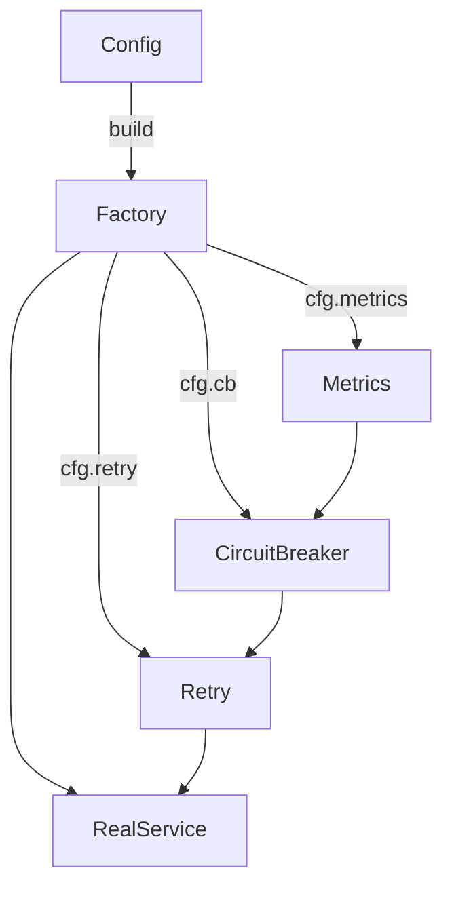
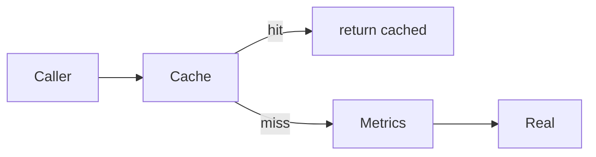
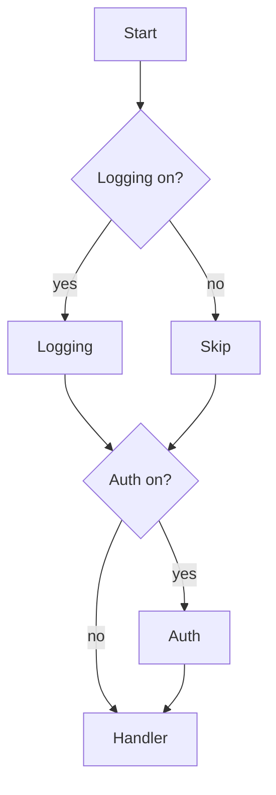

# Decorator — Middle Level

> **Source:** [refactoring.guru/design-patterns/decorator](https://refactoring.guru/design-patterns/decorator)
> **Prerequisite:** [Junior](junior.md)

---

## Table of Contents

1. [Introduction](#introduction)
2. [When to Use Decorator](#when-to-use-decorator)
3. [When NOT to Use Decorator](#when-not-to-use-decorator)
4. [Real-World Cases](#real-world-cases)
5. [Code Examples — Production-Grade](#code-examples--production-grade)
6. [Decorator Order](#decorator-order)
7. [Conditional Decoration](#conditional-decoration)
8. [Building Stacks Cleanly](#building-stacks-cleanly)
9. [Trade-offs](#trade-offs)
10. [Alternatives Comparison](#alternatives-comparison)
11. [Refactoring to Decorator](#refactoring-to-decorator)
12. [Pros & Cons (Deeper)](#pros--cons-deeper)
13. [Edge Cases](#edge-cases)
14. [Tricky Points](#tricky-points)
15. [Best Practices](#best-practices)
16. [Tasks (Practice)](#tasks-practice)
17. [Summary](#summary)
18. [Related Topics](#related-topics)
19. [Diagrams](#diagrams)

---

## Introduction

> Focus: **When to use it?** and **Why?**

You already know Decorator is "wrap an object to add behavior." At the middle level, the harder questions are:

- **When does decoration pay for itself, and when is it ceremony?**
- **How do I keep the stack readable?**
- **What about ordering, conditional decoration, and stack-overflow risk on deep stacks?**

This document focuses on **decisions and patterns** that turn textbook Decorator into something usable in production.

---

## When to Use Decorator

Use Decorator when **all** of these are true:

1. **The behavior to add is orthogonal to the wrapped object.** Caching, logging, retry, validation — they don't care about the *details* of the underlying call.
2. **You want to combine behaviors freely.** Different call sites need different combinations.
3. **You can preserve the interface.** Same methods in, same methods out.
4. **The Concrete Component is a stable abstraction.** You're not constantly changing the Component interface.
5. **You expect more than one decorator over time.** A single decorator-of-one is just a wrapper class — fine, but doesn't earn the "pattern" label.

If even one is missing, reach for a different tool (subclass, plain helper, Strategy).

### Triggers

- "I need to add retry to all my API calls."
- "Some endpoints need rate limiting; others don't."
- "Logging should be on/off via config, not in every service."
- "Caching is per-instance, not always-on."

---

## When NOT to Use Decorator

- **The behavior is universal.** If every call should be logged, just log inside the class. No decoration needed.
- **The chain order is fixed and never varies.** A single specialized class is more readable.
- **You'd need to break the interface.** Adding methods that aren't on the Component breaks polymorphism.
- **The wrapped object's state is what matters.** Decorators add behavior *around* an object; if your goal is to wrap state, use Builder/Composite/Adapter instead.
- **The performance cost is real.** Each decorator adds dispatch overhead. Hot inner loops might not afford 5 layers.

### Smell: decorator that does too much

If your "decorator" does authentication, retry, *and* metrics in one class — split it. Each decorator should add one slice of behavior. Otherwise you've just written a god-wrapper.

---

## Real-World Cases

### Case 1 — HTTP middleware

Express, Django, Spring's `Filter`, ASP.NET MVC pipelines. Each request flows through a chain:

```
RequestLogging → RequestId → CORS → Auth → RateLimit → Handler
```

Each layer can short-circuit (e.g., Auth rejects with 401), modify the request (RequestId adds a header), or modify the response (RequestLogging logs status + duration after the handler returns).

### Case 2 — I/O streams

Java's `java.io` is the textbook Decorator example:

```java
new ObjectInputStream(
    new BufferedInputStream(
        new GZIPInputStream(
            new FileInputStream("data.gz"))))
```

Each layer adds behavior — file reading, gzip decoding, buffering, object deserialization. The interface (`InputStream`) stays the same.

### Case 3 — Service wrappers

```java
PaymentProcessor processor =
    new MetricsProcessor(
        new RetryingProcessor(
            new CircuitBreakerProcessor(
                new StripeAdapter(stripeClient))));
```

Each layer is independently testable. Order matters: metrics outermost ensures all attempts are counted; retry inside cb ensures retries don't trip the breaker.

### Case 4 — Logging enrichment

```python
log = StructuredLogger("svc")
log = WithRequestId(log)
log = WithTraceId(log)
log = WithUserId(log, current_user)
log.info("processing request")
```

Each "with X" decorator adds a context field on every log line.

### Case 5 — Caching layer

```python
repo = PostgresUserRepo(db)
repo = CachingRepo(repo, ttl=60)
repo = MetricsRepo(repo, "user_repo")
```

The repo speaks `UserRepo` interface; each layer adds a concern. Tests use raw `PostgresUserRepo`; prod stacks the layers.

---

## Code Examples — Production-Grade

### Example A — Service with retry, metrics, circuit breaker (Go)

```go
type PaymentProcessor interface {
    Pay(ctx context.Context, req PaymentRequest) (Receipt, error)
}

// Concrete component.
type stripeProcessor struct{ client *stripe.Client }
func (s *stripeProcessor) Pay(ctx context.Context, req PaymentRequest) (Receipt, error) {
    // talks to Stripe
}

// Retry decorator.
type retryProcessor struct {
    inner    PaymentProcessor
    backoff  Backoff
    maxTries int
}

func (r *retryProcessor) Pay(ctx context.Context, req PaymentRequest) (Receipt, error) {
    var lastErr error
    for i := 0; i < r.maxTries; i++ {
        rec, err := r.inner.Pay(ctx, req)
        if err == nil { return rec, nil }
        if !isRetryable(err) { return rec, err }
        lastErr = err
        select {
        case <-time.After(r.backoff.Delay(i)):
        case <-ctx.Done(): return Receipt{}, ctx.Err()
        }
    }
    return Receipt{}, lastErr
}

// Metrics decorator.
type metricsProcessor struct {
    inner   PaymentProcessor
    metrics Metrics
}

func (m *metricsProcessor) Pay(ctx context.Context, req PaymentRequest) (Receipt, error) {
    start := time.Now()
    rec, err := m.inner.Pay(ctx, req)
    m.metrics.RecordLatency("pay", time.Since(start))
    if err != nil { m.metrics.IncErrors("pay") }
    return rec, err
}

// Wiring.
func NewPaymentProcessor(client *stripe.Client, m Metrics) PaymentProcessor {
    return &metricsProcessor{
        inner: &retryProcessor{
            inner:    &stripeProcessor{client: client},
            backoff:  ExponentialBackoff{Base: 100 * time.Millisecond},
            maxTries: 3,
        },
        metrics: m,
    }
}
```

What this gets right:
- Each decorator does one thing.
- Order is intentional: metrics outside (count all attempts), retry inside (retry transient failures).
- Context propagation; no thread leaks on cancellation.

### Example B — HTTP middleware chain (Go)

```go
type Middleware func(http.Handler) http.Handler

func Logging(logger Logger) Middleware {
    return func(next http.Handler) http.Handler {
        return http.HandlerFunc(func(w http.ResponseWriter, r *http.Request) {
            start := time.Now()
            rec := newStatusRecorder(w)
            next.ServeHTTP(rec, r)
            logger.Info("http", "method", r.Method, "path", r.URL.Path,
                        "status", rec.status, "duration", time.Since(start))
        })
    }
}

func RequestID() Middleware {
    return func(next http.Handler) http.Handler {
        return http.HandlerFunc(func(w http.ResponseWriter, r *http.Request) {
            id := uuid.NewString()
            w.Header().Set("X-Request-ID", id)
            r = r.WithContext(context.WithValue(r.Context(), reqIDKey{}, id))
            next.ServeHTTP(w, r)
        })
    }
}

// Compose.
handler := Logging(logger)(RequestID()(realHandler))
```

Or with a small helper:

```go
func Chain(h http.Handler, mw ...Middleware) http.Handler {
    for i := len(mw) - 1; i >= 0; i-- { h = mw[i](h) }
    return h
}

handler := Chain(realHandler, Logging(logger), RequestID(), CORS())
```

### Example C — Stream decorators (Java)

```java
try (var in = new ObjectInputStream(
        new GZIPInputStream(
            new BufferedInputStream(
                new FileInputStream("snapshot.gz"))))) {
    Object snapshot = in.readObject();
}
```

Each decorator handles one concern:
- `FileInputStream` — bytes from disk.
- `BufferedInputStream` — read-ahead.
- `GZIPInputStream` — decompress.
- `ObjectInputStream` — deserialize.

Swapping `FileInputStream` for `SocketInputStream` works without touching other layers.

---

## Decorator Order

Order matters in subtle ways. Common patterns:

### Outer = behavior that wraps everything

`Metrics(Cache(Service))` records latency for both cache hits and misses.

### Inner = behavior that filters traffic

`Cache(Metrics(Service))` records latency only for cache misses (the cache short-circuits before metrics).

### Authentication ordering

```
Logging → Auth → Handler
```

Logging outside auth → log "unauthorized" attempts. Auth outside logging → silent failures.

### Retry vs circuit breaker

```
Metrics → CircuitBreaker → Retry → Service
```

Retry inside CB: retries count toward breaker threshold; breaker can short-circuit a known-bad service. Retry outside CB: breaker opens, retry hits closed breaker → instant fail. Both are valid; document the choice.

### Idempotency

`Retry(NotIdempotentService)` is dangerous — duplicate writes. Either ensure idempotency at the service layer or pass an idempotency key through the retry.

---

## Conditional Decoration

Sometimes you only want certain decorators in certain environments.

### Pattern A — Configuration-driven

```go
func NewProcessor(cfg Config) PaymentProcessor {
    var p PaymentProcessor = &stripeProcessor{client: cfg.StripeClient}
    if cfg.Retry { p = &retryProcessor{inner: p, ...} }
    if cfg.CircuitBreaker { p = &cbProcessor{inner: p, ...} }
    if cfg.Metrics { p = &metricsProcessor{inner: p, ...} }
    return p
}
```

### Pattern B — DI / IoC container

Spring `@Profile`, .NET `Conditional`, Guice modules — wire decorators per environment.

### Pattern C — Feature flags

```python
processor = PostgresUserRepo(db)
if flags.enabled("user_caching"):
    processor = CachingRepo(processor, ttl=60)
```

Toggle decorators at runtime. Useful for A/B tests and rollouts.

---

## Building Stacks Cleanly

The nested-call form gets ugly past 3 layers:

```java
new A(new B(new C(new D(new E(new F(real))))))
```

Cleaner approaches:

### Builder

```java
PaymentProcessor p = ProcessorBuilder.start(new StripeAdapter(client))
    .with(RetryingProcessor::new)
    .with(MetricsProcessor::new)
    .build();
```

### Var-based pipeline

```java
PaymentProcessor p = new StripeAdapter(client);
p = new RetryingProcessor(p, backoff);
p = new MetricsProcessor(p, metrics);
```

Reads top-down. Easier to comment, easier to step through in a debugger.

### Helper combinator (Go)

```go
func Apply(h http.Handler, decorators ...func(http.Handler) http.Handler) http.Handler {
    for i := len(decorators) - 1; i >= 0; i-- { h = decorators[i](h) }
    return h
}
```

---

## Trade-offs

| Trade-off | Pay | Get |
|---|---|---|
| Add small classes | More files | Each behavior independently testable |
| Indirection per layer | One method call per decorator | Open/closed; new behaviors don't change existing code |
| Order matters | Need to think about ordering | Fine-grained control over how behaviors compose |
| Stack-trace depth | Harder debugging | Encapsulation of cross-cutting concerns |
| Constructor wiring | Boilerplate | Run-time composition; per-call site flexibility |

---

## Alternatives Comparison

| Alternative | Use when | Trade-off |
|---|---|---|
| **Subclassing** | One specific combination, fixed forever | Class explosion if combinations grow |
| **Strategy** | One algorithm slot, swap at runtime | Doesn't compose behaviors |
| **Inheritance + super calls** | Behavior is universal | Can't disable per-instance |
| **AOP / annotations** | Cross-cutting concerns at scale | Magic; harder to debug |
| **Function decorators (Python `@`)** | Wrapping callables, not objects | Different artifact, same intent |
| **Middleware framework feature** | HTTP / RPC pipelines | Tied to the framework |

---

## Refactoring to Decorator

A common path: a class accumulates concerns (logging, caching, retry) inside its primary methods. Refactor:

### Step 1 — Identify the orthogonal concerns

What can be removed without changing the *primary* business logic? Logging, metrics, retry, caching are usual suspects.

### Step 2 — Extract one decorator

Move one concern into a wrapper class implementing the same interface.

### Step 3 — Wire it at construction

```java
service = new LoggingService(new RealService());
```

### Step 4 — Verify behavior

Tests should pass. The decorator is transparent.

### Step 5 — Repeat for other concerns

Each concern → its own decorator. The base class shrinks.

### Step 6 — Lock the boundary

Lint rules: domain classes can't import logging frameworks; only decorators can.

---

## Pros & Cons (Deeper)

### Pros (revisited)

- **Independent testability.** Each decorator's tests are tiny.
- **Composition over inheritance.** You build the combinations you need.
- **Single Responsibility.** One concern per decorator.
- **Run-time configuration.** Decorate based on env/config/flags.
- **Reusability.** A `Retry` decorator works around any matching interface.

### Cons (revisited)

- **Many small files.** Navigating a 7-decorator stack takes time.
- **Stack traces.** Stepping through a deep decorator stack in a debugger is tedious.
- **Order is implicit.** A reader has to follow constructor wiring to understand actual behavior.
- **Performance.** Each layer adds dispatch and (sometimes) per-call allocation.
- **Identity confusion.** `processor.equals(decorated_processor)` is false even if behaviorally equivalent.

---

## Edge Cases

### 1. Decorator that throws

A logging decorator that fails to log shouldn't take down the call. Wrap risky decorator code in try/catch where appropriate; document failure semantics.

### 2. Stateful decorator + concurrent access

A `RateLimiter` decorator is shared across goroutines/threads. Its internal state (token bucket) must be thread-safe.

### 3. Lifecycle (close)

If the wrapped object holds resources (`AutoCloseable`), the outer decorator must propagate close:

```java
public class Logging implements Service, AutoCloseable {
    public void close() throws Exception {
        if (inner instanceof AutoCloseable c) c.close();
    }
}
```

### 4. Equals and hashCode

Don't put decorated services in `HashMap` keys. Two equivalent stacks aren't `==`. Use identity-based hashing or a registry by ID.

### 5. Reflection breaking the chain

`obj.getClass()` returns the outermost decorator. Code that branches on type sees only the wrapper. Don't rely on reflection across decorators.

### 6. Async / coroutines

A retry decorator in an async context must `await` properly. Mixing sync and async wrappers is a source of subtle bugs.

---

## Tricky Points

- **Decorator vs Proxy:** Decorator adds behavior; Proxy controls access. A `LazyProxy` that defers construction is a Proxy. A `RetryWrapper` that calls the inner repeatedly is a Decorator. The same class can play both roles in casual usage; precision matters in design discussions.
- **Decorator and the Composite tree:** A node in a Composite tree may itself be a Decorator (e.g., a "shadow" decorator wrapping a UI widget). Both patterns play well together.
- **Wrappers without same interface:** if your "decorator" exposes new methods, it's not a true Decorator — it's just a wrapper class. Clients calling those new methods couple to the concrete decorator.
- **Order and idempotency:** retry around non-idempotent calls without idempotency keys creates duplicate operations. The decorator stack is not magic — it requires the wrapped service to honor contracts.

---

## Best Practices

1. **One concern per decorator.** Keep them small and composable.
2. **Inject the inner via constructor.** Don't construct it inside.
3. **Keep the interface clean.** No new public methods on decorators.
4. **Document expected order.** A factory method that builds the canonical stack is your best teacher.
5. **Make stateful decorators thread-safe.** Caches, counters, rate limiters.
6. **Propagate close/cancellation.** If the wrapped object has lifecycle, the decorator must respect it.
7. **Use Var-style or builder for deep stacks.** Nested constructors past 3 layers become unreadable.

---

## Tasks (Practice)

1. Take a service class with embedded logging and metrics; refactor each into a decorator.
2. Build an HTTP middleware chain with Logging, RequestID, Auth, and a real handler. Assert the order with tests.
3. Implement a `Caching` decorator with TTL; add a test that verifies cache hits and expiration.
4. Wrap a non-idempotent API with `Retry` *correctly* — pass an idempotency key through.
5. Combine `Decorator` with `Composite`: a UI tree where one node is decorated with a shadow effect.

---

## Summary

- Use Decorator when you need run-time composition of orthogonal behaviors over a stable interface.
- Don't use it when the behavior is universal, the chain is fixed, or you need to break the interface.
- Order matters; pick deliberately and document.
- Build stacks cleanly via Var-style or builder; avoid 7-deep `new A(new B(new C(...)))`.
- Each decorator is one class, one concern, independently testable.

---

## Related Topics

- **Next:** [Senior Level](senior.md) — AOP, request pipelines, performance.
- **Compared with:** [Adapter](../01-adapter/junior.md), [Proxy](../07-proxy/junior.md), [Composite](../03-composite/junior.md).
- **Frameworks:** Express, Django, Spring AOP, ASP.NET pipelines.

---

## Diagrams

### Configuration-driven wiring



### Order matters: Cache outside Metrics



### Conditional middleware



---

[← Back to Decorator folder](.) · [↑ Structural Patterns](../README.md) · [↑↑ Roadmap Home](../../../README.md)

**Next:** [Decorator — Senior Level](senior.md)
