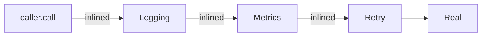
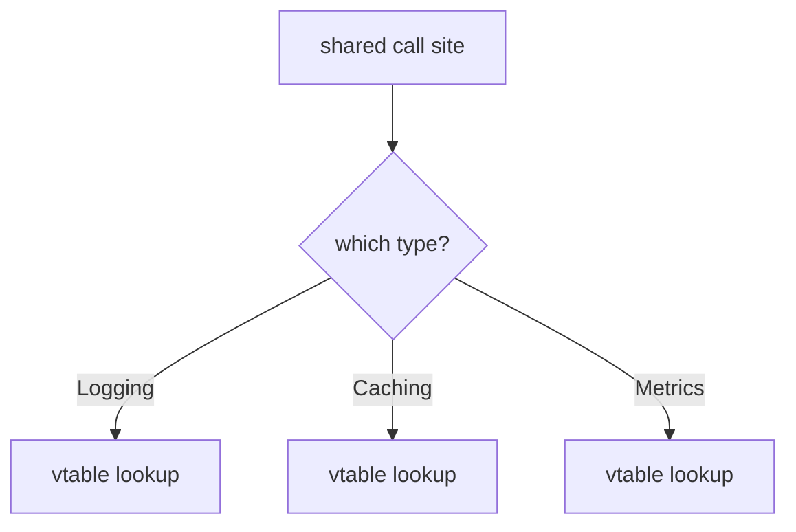

# Decorator — Professional Level

> **Source:** [refactoring.guru/design-patterns/decorator](https://refactoring.guru/design-patterns/decorator)
> **Prerequisite:** [Senior](senior.md)

---

## Table of Contents

1. [Introduction](#introduction)
2. [Memory Layout of a Stack](#memory-layout-of-a-stack)
3. [JVM: Inlining a Decorator Chain](#jvm-inlining-a-decorator-chain)
4. [JVM: Dynamic Proxies and AOP Cost](#jvm-dynamic-proxies-and-aop-cost)
5. [Go: Interface Calls Per Layer](#go-interface-calls-per-layer)
6. [CPython: Attribute Lookup Cost Per Layer](#cpython-attribute-lookup-cost-per-layer)
7. [GC and Per-Call Allocations](#gc-and-per-call-allocations)
8. [Stack Frames and Trace Depth](#stack-frames-and-trace-depth)
9. [Microbenchmark Anatomy](#microbenchmark-anatomy)
10. [Cross-Language Comparison](#cross-language-comparison)
11. [Distributed Decorator Concerns](#distributed-decorator-concerns)
12. [Diagrams](#diagrams)
13. [Related Topics](#related-topics)

---

## Introduction

A Decorator stack at the professional level is examined for what the runtime makes of it: how much of the chain the JIT can erase, what memory each layer costs, and where the inevitable performance cliffs are. For middleware stacks running millions of requests/sec, these answers determine throughput.

---

## Memory Layout of a Stack

Each decorator instance holds:
- The `inner` reference (one pointer).
- Its own state (cache, counter, config).

JVM (compressed OOPs) — a typical 4-decorator stack of small wrappers:

```
RealService:    ~16 bytes (header + few fields)
Decorator A:    ~16 bytes (header + inner ptr)
Decorator B:    ~16 bytes
Decorator C:    ~16 bytes
Decorator D:    ~16 bytes
```

Total: ~80 bytes per request handler. Negligible.

In Go, ~16 bytes per decorator (interface header + pointer). In CPython, each decorator is a regular Python object: ~50-150 bytes minimum.

The stacks are tiny *per request handler*. The danger is per-request allocation: a logging decorator that builds a `Map<String, Object>` per call generates real garbage at 10k QPS.

---

## JVM: Inlining a Decorator Chain

When the call site is monomorphic (always the same decorator stack):

```
caller.process(req)
  → Logging.process(req)         ← inlined
    → Caching.process(req)       ← inlined
      → Retry.process(req)       ← inlined
        → RealService.process(req)
```

HotSpot inlines through `MaxInlineLevel` (default 9) levels. After warmup, a typical 4-decorator stack collapses to a single inlined sequence — zero call overhead.

### What disrupts inlining

- **Megamorphism.** The same call site sees several different decorator types. Inline cache fails.
- **Reflection / dynamic proxy.** `Method.invoke` is a dispatch the JIT can't easily inline.
- **Synchronized blocks** in decorators may impede some optimizations.
- **Excessive depth.** Past `MaxInlineLevel`, the rest of the chain is virtual calls.

### Sealed types (Java 17+)

`sealed` interfaces let HotSpot prove the closed set of implementations. Combined with stable wiring, devirtualization is aggressive.

---

## JVM: Dynamic Proxies and AOP Cost

`@Cacheable`, `@Retryable`, `@Transactional` (Spring AOP) wrap beans in dynamic proxies (`java.lang.reflect.Proxy` or cglib). Each method call:

1. Goes through `InvocationHandler.invoke`.
2. Reflection dispatch: ~30-50 ns extra per call.
3. May allocate `Object[]` for arguments.

For request-scoped code, this is invisible. For inner loops, it's measurable. Spring 5+ improved with cglib subclass proxies (faster than reflection-based) and code generation in some cases.

If a hot path is heavy on AOP-wrapped calls, consider:
- Removing the annotation; explicit decoration.
- Using an annotation processor that generates static decorators at compile time.
- Deferring or batching the call.

---

## Go: Interface Calls Per Layer

Each decorator layer in Go is one interface call: ~3 ns (itab load + indirect call). A 5-layer stack: ~15 ns. The compiler does *not* inline indirect calls; the cost is real (though typically dwarfed by network in HTTP middleware).

### Pointer receivers (again)

Use pointer receivers and pass decorators as pointers; otherwise interface conversion allocates a heap copy.

```go
// ❌ Each conversion allocates.
var p PaymentProcessor = stripeAdapter
var p2 PaymentProcessor = retryAdapter{inner: p}

// ✅ One construction; pointers throughout.
processor := &retryAdapter{inner: &stripeAdapter{client: c}}
```

### Inlining hints

Go's compiler will sometimes inline very small methods. `go build -gcflags='-m=2'` reveals what was inlined. Decorators with non-trivial bodies (logging formatters, metric registry calls) won't inline.

---

## CPython: Attribute Lookup Cost Per Layer

Each layer adds:
1. `LOAD_ATTR inner` — instance dict lookup, ~50 ns.
2. `LOAD_ATTR call` (the inner's method) — type dict lookup, ~50-150 ns.
3. `CALL_METHOD` — frame setup, ~50 ns.

Per layer: 150-300 ns. A 5-layer stack: ~1 μs of pure indirection. For I/O-bound apps, invisible. For numeric inner loops, catastrophic.

CPython 3.11+ adaptive interpreter helps via attribute caching, but the cost remains. Hot Python loops should not have decorator stacks; rewrite in C extension or Numba.

---

## GC and Per-Call Allocations

The decorator instances are long-lived (one per service). The danger is per-call allocations *inside* decorators.

Common offenders:
- A logging decorator that constructs a `Map<String, Object>` of fields per call.
- A retry decorator that allocates a closure / lambda capturing context per attempt.
- A metrics decorator that uses `String.format` (allocates) instead of pre-formatted patterns.

Mitigations:
- Pre-allocate buffers / builders.
- Use object pools for short-lived heavy objects.
- Use lazy / structured logging where appropriate.

---

## Stack Frames and Trace Depth

Each decorator adds one (or more, with try/finally) stack frame. A 7-decorator stack means failure traces have 7 extra frames before reaching the real service. Subjectively this feels noisy; objectively it's a real engineering cost (debugging, log volume, support time).

### Trace filtering

IDEs and APM tools can filter framework frames. Configure your stack-trace patterns to hide pure forwarding frames; the signal stays.

### Self-imposed depth limits

Some teams set a soft limit (e.g., "no more than 5 decorators per service"). Violations require justification. Discipline beats cleanup later.

---

## Microbenchmark Anatomy

### Java JMH

```java
@State(Scope.Benchmark)
public class DecoratorBench {
    Service real = new RealService();
    Service decorated1 = new Logging(real);
    Service decorated5 = new Logging(new Metrics(new Retry(new CB(new Auth(real)))));

    @Benchmark public Result direct(Blackhole bh) {
        return real.call(req);
    }

    @Benchmark public Result oneLayer(Blackhole bh) {
        return decorated1.call(req);
    }

    @Benchmark public Result fiveLayers(Blackhole bh) {
        return decorated5.call(req);
    }
}
```

Expected: warm + monomorphic, all three benchmarks essentially identical (1-2 ns) — JIT inlines 5 layers. Megamorphic site: 5-layer cost increases visibly.

### Go

```go
func BenchmarkOneLayer(b *testing.B)    { /* ... */ }
func BenchmarkFiveLayers(b *testing.B)  { /* ... */ }
```

Expected: 1-layer ~3 ns, 5-layer ~15 ns. Real workloads dominated by inner work.

### Python

```python
import timeit
print(timeit.timeit("d1.call(req)", number=10_000_000))
print(timeit.timeit("d5.call(req)", number=10_000_000))
```

Expected: 1-layer ~150 ns, 5-layer ~750 ns.

### Pitfalls

- **Dead-code elimination.** Use `Blackhole` / accumulator.
- **Cold start.** Warm up enough to reach JIT steady state.
- **Single receiver bias.** Real apps have variety; benchmark mixed if relevant.
- **Synthetic CPU work.** A `RealService` that returns immediately is meaningless; have it do realistic work (check a map, format a string).

---

## Cross-Language Comparison

| Concern | Java (HotSpot) | Go | Python (3.11+) |
|---|---|---|---|
| **Per-layer cost (warm, mono)** | ~0-1 ns (inlined) | ~3 ns | ~150 ns |
| **Inlinable through chain** | Yes (up to MaxInlineLevel=9) | No | No |
| **Megamorphism penalty** | 5-10× | None (always indirect) | None |
| **Per-decorator memory** | ~16-32 bytes | ~16 bytes | ~50-150 bytes |
| **AOP cost** | +30-50 ns per call (dynamic proxy) | N/A (no AOP) | N/A (decorators are explicit) |
| **Boxing in decorator return** | Real concern | None | None |

---

## Distributed Decorator Concerns

When the decorator stack lives in different processes (sidecar, service mesh):

### 1. Network latency dwarfs dispatch

Local decorator overhead is irrelevant when the call goes over the wire.

### 2. Order at the network level

Service mesh filters (Envoy, Istio) execute in a configured order on the wire. Same Decorator semantics; different deployment.

### 3. Idempotency across boundaries

Retry over a network requires idempotency keys, deadlines, jitter. The decorator becomes a contract negotiation: client and server must agree on idempotency semantics.

### 4. Tracing across decorators

Each decorator should add a span if non-trivial work happens. The span tree mirrors the Decorator stack.

### 5. Versioning interceptors

A change to a server-side interceptor (auth schema bump) must be coordinated with all clients. Service mesh deployments give global rollback; in-process decorator changes are deploy-coupled to the service.

---

## Diagrams

### JVM inlining a chain



### Megamorphic call site



### Stack trace depth

```
real.fail()
  retry.call()
  cb.call()
  logging.call()
  caller
```

A 4-layer stack adds 3 forwarding frames before the actual failure.

---

## Related Topics

- **JVM internals:** `MaxInlineLevel`, `-XX:+PrintInlining`, sealed types, dynamic proxies vs cglib.
- **Go internals:** itab caching, indirect call cost, escape analysis.
- **CPython internals:** attribute caching, PEP 659 specialization.
- **AOP performance:** Spring AOP overhead, AspectJ load-time weaving, `Method.invoke` cost.
- **Profiling:** flame graphs to visualize a Decorator stack; identifying the most expensive layer.
- **Next:** [Interview](interview.md), [Tasks](tasks.md), [Find the Bug](find-bug.md), [Optimize](optimize.md).

---

[← Back to Decorator folder](.) · [↑ Structural Patterns](../README.md) · [↑↑ Roadmap Home](../../../README.md)

**Next:** [Decorator — Interview Preparation](interview.md)
