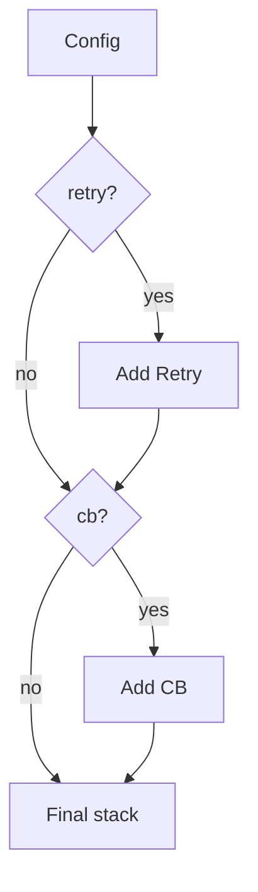
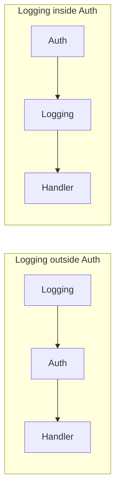

# Decorator — Senior Level

> **Source:** [refactoring.guru/design-patterns/decorator](https://refactoring.guru/design-patterns/decorator)
> **Prerequisite:** [Middle](middle.md)

---

## Table of Contents

1. [Introduction](#introduction)
2. [Decorator at Architectural Scale](#decorator-at-architectural-scale)
3. [Performance Considerations](#performance-considerations)
4. [Concurrency Deep Dive](#concurrency-deep-dive)
5. [Testability Strategies](#testability-strategies)
6. [When Decorator Becomes a Problem](#when-decorator-becomes-a-problem)
7. [Code Examples — Advanced](#code-examples--advanced)
8. [Real-World Architectures](#real-world-architectures)
9. [Pros & Cons at Scale](#pros--cons-at-scale)
10. [Trade-off Analysis Matrix](#trade-off-analysis-matrix)
11. [Migration Patterns](#migration-patterns)
12. [Diagrams](#diagrams)
13. [Related Topics](#related-topics)

---

## Introduction

> Focus: **At scale, what breaks? What earns its keep?**

Decorator in toy code is "Coffee + Milk + Sugar." In production it's "every request flows through 7 middleware layers, each owned by a different team, configured per environment." The senior question isn't "do I write Decorator?" — it's **"how do I keep a 7-layer stack debuggable, observable, and fast?"**

At scale, Decorator dissolves into:

- **AOP (Aspect-Oriented Programming)** — same intent, different artifacts (annotations + bytecode weaving instead of explicit wrapping).
- **HTTP / RPC pipelines** — Express, Spring `Filter`, gRPC interceptors, Envoy filters.
- **Event-stream processors** — Kafka Streams transformations, Akka pipelines.
- **Compiler passes** — each pass decorates the AST with new information.

These are Decorator scaled up; the fundamentals stay.

---

## Decorator at Architectural Scale

### 1. Web request pipelines

Every modern web framework is a Decorator stack:

```
Reverse proxy (TLS, compression)
  → API gateway (auth, rate limit, routing)
    → Application middleware (auth, request-id, CORS, logging)
      → Controller
```

Each layer is independently developed, deployed, and observed. Logging *outside* auth lets ops see all requests, including unauthorized; logging *inside* auth means quieter logs but missed visibility. Pick deliberately.

### 2. AOP (Aspect-Oriented Programming)

Spring AOP, AspectJ, .NET interceptors: the *intent* is Decorator (cross-cutting concerns wrapping business logic), the *implementation* is bytecode weaving or dynamic proxies. The advantage: declarative `@Cacheable` / `@Retryable` annotations vs. explicit wrapping. The disadvantage: magic; harder to debug; "where did this stack trace come from?" is a frequent question.

### 3. gRPC interceptors

```
Client interceptor: add headers, retry, log
Server interceptor: auth, deadline, log, recover from panic
```

Each interceptor wraps the call site. Composition is declarative (registered with the client/server); execution is the Decorator pattern.

### 4. Service mesh (Envoy filters)

A sidecar mesh injects "filters" around every service call: TLS termination, retry, circuit break, observability. The mesh is a *runtime* Decorator stack that doesn't require code changes to the service.

### 5. Stream processing

Kafka Streams `.filter().map().mapValues().peek()`: each transformer is a Decorator on the stream. Same shape, different domain.

### 6. Compiler passes

A compiler is a chain of decorators: lex → parse → resolve names → type-check → optimize → emit. Each pass takes a partially-decorated AST and adds annotations.

---

## Performance Considerations

### Per-call cost

Each decorator adds:
- One **virtual / interface dispatch**.
- One **field load** (the inner reference).
- Possibly **before/after work**.

JVM: warm + monomorphic = inlined to zero overhead. Go: ~3 ns/layer. Python: ~50-150 ns/layer. For most request-scoped code, even a 7-layer stack is invisible (network dominates).

### When it matters

- **Inner loops over millions of items.** A `Logging(Validating(Counting(Number)))` chain in a hot loop kills throughput.
- **Mega-deep stacks.** 30 layers of dynamic proxies (common in over-instrumented Java apps) start to show up in profiles.
- **Allocation-heavy decorators.** A logging decorator that builds a `Map<String, Object>` per call generates GC pressure.

### Inlining and devirtualization

JVM HotSpot can inline through several monomorphic decorators. After inline-cache warmup, `metrics.pay() → retry.pay() → stripe.pay()` may be flattened to a single direct call sequence. Sealed types (Java 17) help.

Go: each layer is an indirect call; not inlined. Python: each layer is an attribute lookup + call.

---

## Concurrency Deep Dive

### Stateless decorators

Logging, metrics, retry (without state across calls) — safe to share across goroutines/threads. Construct once, share.

### Stateful decorators

Caches, rate limiters, circuit breakers, request-counters — must be thread-safe. Use atomic ops, concurrent collections, or locks. Watch for contention: a global lock in a `RateLimiter` decorator becomes a bottleneck at scale.

### Per-request decorators

Some decorators logically scope to one request (a `RequestContext` accumulator). They're constructed per call. Build cheaply; don't allocate megabytes per request.

### Async / coroutines

A retry decorator in async code must `await` properly. Don't mix sync wrapper with async inner; the runtime can't bridge it. Match the concurrency model of the wrapped object.

### Cancellation propagation

Like Adapter and Bridge: `Context` (Go), `CancellationToken` (.NET), `CompletableFuture` cancel chain. Each decorator must propagate cancellation; ignoring it leaks goroutines/threads.

---

## Testability Strategies

### Test each decorator in isolation

Build the decorator with a **fake or mock** of the wrapped interface. Assert the decorator's specific behavior:

```java
class LoggingDecoratorTest {
    @Test void logsBeforeAndAfter() {
        var inner = mock(Service.class);
        var logger = mock(Logger.class);
        var decorated = new LoggingDecorator(inner, logger);

        decorated.call(req);

        verify(logger).info(eq("calling"), any());
        verify(inner).call(req);
        verify(logger).info(eq("done"), any());
    }
}
```

### Integration test the stack

Build the actual production stack with a fake at the bottom. Assert end-to-end behavior. Catches order bugs.

### Test that order matters

Build two stacks with different orderings; assert different observable behavior. Documents the order requirement.

### Recording fakes

A fake `Service` that records every call. Decorators can be exercised against it; the recorded sequence is the assertion.

---

## When Decorator Becomes a Problem

### Symptom 1 — 15-layer stack of "instrumentation"

Auth, logging, metrics, tracing, rate limit, retry, circuit break, idempotency, dedup, audit, validation, ... Each well-meaning. Together: every method call is a hot path through 15 frames. Profile shows surprising overhead.

**Fix:** consolidate. Several decorators can collapse into one (e.g., a single "Observability" decorator that does logging + metrics + tracing in one call).

### Symptom 2 — Unclear order

A new engineer needs to add a decorator. Where in the stack does it go? **Document.** A factory method `buildPaymentProcessor(Config)` with named layers explains itself.

### Symptom 3 — Hidden state

Every layer holds its own state; debugging requires inspecting all 7 fields. **Fix:** log the wrapping configuration at startup; expose a `chain()` method on each decorator for runtime introspection.

### Symptom 4 — Decorator throws unexpectedly

A logging decorator that fails to log throws, breaking the call. **Fix:** decorators should not break the inner contract unless intentional. Catch internal failures.

### Symptom 5 — Mega-deep stack traces

A failure in the wrapped service shows 30 frames. Half are decorator forwarding. **Fix:** if the same decorator is repeated (sometimes a misconfiguration), find and remove. Otherwise, accept and use stack-trace filtering tools.

### Symptom 6 — Identity lost

`logger.equals(otherLogger)` returns false even for equivalent decorations. Hash-based collections fail. **Fix:** don't put decorated objects in keys. Use IDs.

---

## Code Examples — Advanced

### Idempotency-aware retry decorator (Java)

```java
public final class IdempotentRetry implements PaymentProcessor {
    private final PaymentProcessor inner;
    private final int maxTries;
    private final Backoff backoff;

    public IdempotentRetry(PaymentProcessor inner, int maxTries, Backoff backoff) {
        this.inner = inner;
        this.maxTries = maxTries;
        this.backoff = backoff;
    }

    @Override
    public Receipt pay(PaymentRequest req) throws PaymentException {
        // Generate idempotency key once per logical attempt.
        String key = req.idempotencyKey() != null
            ? req.idempotencyKey()
            : UUID.randomUUID().toString();

        Throwable last = null;
        for (int i = 0; i < maxTries; i++) {
            try {
                return inner.pay(req.withIdempotencyKey(key));
            } catch (TransientException e) {
                last = e;
                sleepInterruptible(backoff.delay(i));
            }
        }
        throw new PaymentException("retries exhausted", last);
    }
}
```

The decorator generates an idempotency key once and passes it to the inner on every retry. The inner service must honor it.

### Async context-propagating decorator (Go)

```go
type tracedProcessor struct{ inner PaymentProcessor; tracer Tracer }

func (t *tracedProcessor) Pay(ctx context.Context, req PaymentRequest) (Receipt, error) {
    span, ctx := t.tracer.StartSpan(ctx, "payment.pay")
    defer span.End()
    span.SetAttribute("amount", req.AmountMinor)

    rec, err := t.inner.Pay(ctx, req)
    if err != nil {
        span.SetStatus(codes.Error, err.Error())
    } else {
        span.SetAttribute("receipt", rec.ID)
    }
    return rec, err
}
```

Carries trace context through the chain; sub-spans nest naturally.

### Conditional decorator (Python)

```python
def maybe_decorate(processor: PaymentProcessor, decorator_class, condition: bool, **kwargs):
    if condition:
        return decorator_class(processor, **kwargs)
    return processor


def build_processor(cfg) -> PaymentProcessor:
    p = StripeProcessor(cfg.stripe_client)
    p = maybe_decorate(p, RetryProcessor, cfg.retry_enabled, max_tries=cfg.max_tries)
    p = maybe_decorate(p, CircuitBreakerProcessor, cfg.cb_enabled, threshold=cfg.cb_threshold)
    p = MetricsProcessor(p, cfg.metrics)   # always on
    return p
```

Per-environment composition; pure config-driven.

### Per-request decorator (Java Spring-like)

```java
public class RequestScopedAuditingProcessor implements PaymentProcessor {
    private final PaymentProcessor inner;
    private final AuditLog auditLog;
    private final RequestContext requestContext;

    public RequestScopedAuditingProcessor(PaymentProcessor inner, AuditLog auditLog, RequestContext rc) {
        this.inner = inner;
        this.auditLog = auditLog;
        this.requestContext = rc;
    }

    @Override
    public Receipt pay(PaymentRequest req) {
        Receipt rec = inner.pay(req);
        auditLog.record(requestContext.userId(), "payment.pay", req.amount(), rec.id());
        return rec;
    }
}
```

Constructed per request via DI; the auditing is request-scoped.

---

## Real-World Architectures

### A — Express middleware

```js
app.use(logger());
app.use(requestId());
app.use(cors());
app.use(auth());
app.use("/api", apiRouter);
```

Each `use` registers a Decorator-style middleware. Order in code = order at runtime.

### B — Spring `@Cacheable`, `@Retryable`, `@Transactional`

Spring AOP wraps annotated methods at runtime via dynamic proxies. The annotation declares the decorator; the framework constructs the chain.

### C — gRPC interceptor chain

```go
opts := []grpc.UnaryServerInterceptor{
    loggingInterceptor,
    authInterceptor,
    tracingInterceptor,
    recoverInterceptor,
}
server := grpc.NewServer(grpc.ChainUnaryInterceptor(opts...))
```

Each interceptor is a Decorator. Order matters; documentation matters more.

### D — Java I/O streams

The classic. `ObjectInputStream(GZIPInputStream(BufferedInputStream(FileInputStream)))` works at any scale because each layer is correctly stateless or per-stream.

### E — Compiler optimization passes

LLVM, GCC: each pass takes the IR and transforms it. The IR's interface stays the same; passes are stacked Decorators. Order and idempotency matter; passes are tested in isolation and in pipelines.

### F — Database driver layers

JDBC + connection pool + retry + metrics + transaction-aware: every JDBC connection used in a Spring app is decorated half a dozen times. Tracing typically shows the chain in a span tree.

---

## Pros & Cons at Scale

### Pros (at scale)

- **Independent ownership.** Logging team, auth team, tracing team — each owns their decorator without coordinating.
- **Configuration per environment.** Same code, different stacks for dev/staging/prod.
- **Testability of cross-cutting concerns.** Each decorator unit-tested.
- **Replaceable framework boundaries.** Switch logger, retry library, metrics — only one decorator changes.

### Cons (at scale)

- **Stack-trace depth.** A 7-decorator stack means failure traces have 7 extra frames. Tooling helps but doesn't eliminate.
- **Performance of deep stacks.** Even fast layers add up.
- **Order is implicit.** Reading the wiring is required to understand actual behavior.
- **Identity/equality.** Equivalent stacks aren't equal; can't be used as map keys naively.
- **Misconfiguration risk.** A decorator missing from one environment but not another causes mysterious bugs.

---

## Trade-off Analysis Matrix

| Concern | No decorators | Few decorators (≤3) | Many (5+) | AOP / dynamic proxies |
|---|---|---|---|---|
| **Code clarity** | Highest | High | Medium | Low (magic) |
| **Independent testability** | Low | Good | Best | Best |
| **Run-time composition** | None | Yes | Yes | Yes |
| **Stack trace depth** | Shallow | Medium | Deep | Deep + obscure |
| **Performance ceiling** | Highest | High | Medium | Medium |
| **Suitable for** | Trivial code | Most apps | Pipelines / middleware | Large enterprise apps |

---

## Migration Patterns

### Pattern 1 — Extract decorator from inline code

A class with logging/metrics/retry in every method. Extract one concern at a time into a wrapper. Existing tests stay green; the class shrinks.

### Pattern 2 — Migrate from inheritance to decoration

A class hierarchy with `LoggedRetryingService extends RetryingService extends RealService`. Replace with `Logging(Retrying(Real))`. Easier to mix and match; single-responsibility per class.

### Pattern 3 — Adopt AOP for cross-cutting concerns

When 30 services need the same `@Retryable` behavior, declarative AOP can replace 30 manual decorators. Trade explicit code for declarative annotations + framework magic.

### Pattern 4 — Consolidate duplicate decorators

Two decorators (`Logging`, `Metrics`) that always appear together can become one (`Observability`) for a small clarity win — at the cost of less granular control. Trade-off; pick deliberately.

### Pattern 5 — Move from middleware to decorator (or vice versa)

A framework-specific middleware can be ported to a generic Decorator (no longer tied to that framework). Or the inverse: hand-rolled decorators consolidated into framework middleware for consistency.

---

## Diagrams

### gRPC interceptor chain


### Conditional configuration



### Order matters



`LogOutside`: logs unauthorized attempts. `LogInside`: misses them.

---

## Related Topics

- **System-scale Decorator:** middleware pipelines, AOP, gRPC interceptors, service mesh, compiler passes.
- **Pattern siblings:** Adapter (interface change), Proxy (access control), Composite (tree of nodes).
- **AOP frameworks:** Spring AOP, AspectJ, .NET interceptors, dynamic proxies in JDK / cglib.
- **Testing:** unit-test each decorator; integration-test the stack; document order with a factory function.
- **Next:** [Professional Level](professional.md) — JIT inlining of decorator stacks, allocation per layer, microbenchmarks.

---

[← Back to Decorator folder](.) · [↑ Structural Patterns](../README.md) · [↑↑ Roadmap Home](../../../README.md)

**Next:** [Decorator — Professional Level](professional.md)
