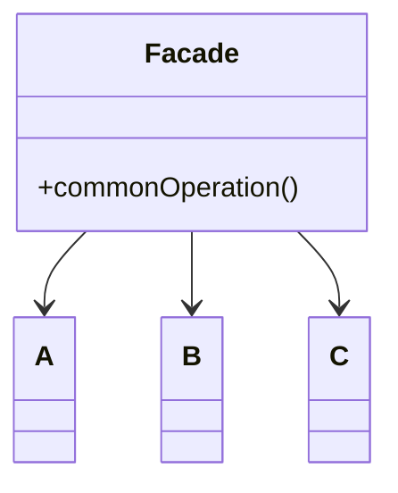
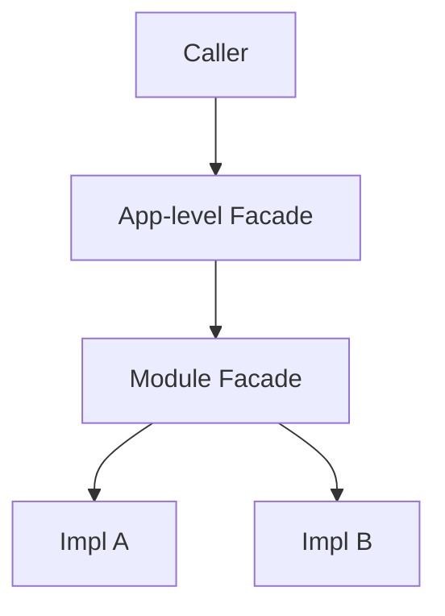
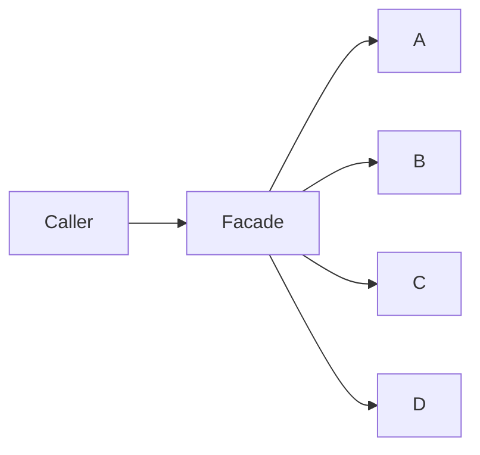
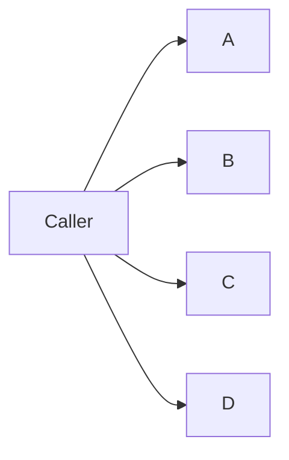
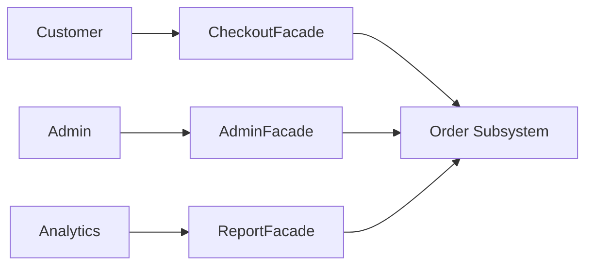

# Facade — Junior Level

> **Source:** [refactoring.guru/design-patterns/facade](https://refactoring.guru/design-patterns/facade)
> **Category:** [Structural](../README.md) — *"Explain how to assemble objects and classes into larger structures, while keeping these structures flexible and efficient."*

---

## Table of Contents

1. [Introduction](#introduction)
2. [Prerequisites](#prerequisites)
3. [Glossary](#glossary)
4. [Core Concepts](#core-concepts)
5. [Real-World Analogies](#real-world-analogies)
6. [Mental Models](#mental-models)
7. [Pros & Cons](#pros--cons)
8. [Use Cases](#use-cases)
9. [Code Examples](#code-examples)
10. [Coding Patterns](#coding-patterns)
11. [Clean Code](#clean-code)
12. [Best Practices](#best-practices)
13. [Edge Cases & Pitfalls](#edge-cases--pitfalls)
14. [Common Mistakes](#common-mistakes)
15. [Tricky Points](#tricky-points)
16. [Test Yourself](#test-yourself)
17. [Tricky Questions](#tricky-questions)
18. [Cheat Sheet](#cheat-sheet)
19. [Summary](#summary)
20. [What You Can Build](#what-you-can-build)
21. [Further Reading](#further-reading)
22. [Related Topics](#related-topics)
23. [Diagrams & Visual Aids](#diagrams--visual-aids)

---

## Introduction

> Focus: **What is it?** and **How to use it?**

**Facade** is a structural design pattern that provides a **simplified interface** to a complex subsystem. It hides the moving parts behind one or two well-named methods so callers can do the common things without learning every nut and bolt of the underlying code.

Imagine you want to play a movie at home. The full process is: turn on the receiver, set its input, turn on the TV, switch HDMI, dim the lights, lower the projector screen, start the streaming app, navigate to the movie, hit play. Or — you press one button on the universal remote that says "Watch a Movie" and everything happens. That button is a Facade.

In one sentence: *"One door to a complicated house — bring in callers through there, not through every window."*

You'll write Facades naturally without thinking about them: "let's put all this orchestration into a single `OrderService` method." That's the pattern. Naming it explicitly helps you reason about *where* simplification belongs and *what* you're hiding.

---

## Prerequisites

What you should know before reading this:

- **Required:** Basic OOP — classes, methods, dependency injection.
- **Required:** Familiarity with the idea of "subsystems" — code modules with their own internal complexity.
- **Helpful:** Some exposure to messy third-party APIs that take 12 setup calls before they let you do anything.
- **Helpful:** A sense of the difference between *internal* APIs (used by the team) and *external* APIs (used by everyone else).

---

## Glossary

| Term | Definition |
|------|-----------|
| **Subsystem** | A set of cohesive classes that together provide some capability (e.g., video playback). |
| **Facade** | A class that exposes a small, focused API delegating to the subsystem. |
| **Simple Facade** | One class wrapping one or many subsystem classes. |
| **Layered Facade** | Facade over a Facade — typical at architectural boundaries. |
| **API surface** | The set of publicly callable methods. |
| **Client** | Code that uses the Facade and benefits from the simplification. |

---

## Core Concepts

### 1. Hide complexity, keep capability

The Facade exposes the **common, easy** operations. The full subsystem stays available for power users who need finer control. You don't *delete* complexity; you give it a calm front door.

### 2. One Facade, one purpose

A Facade isn't "everything in this module." It's a focused entry point: "play a movie", "place an order", "send an email with the right defaults." If your Facade has 30 methods, it's not simplifying anything.

### 3. Composition

The Facade *holds* references to subsystem classes (or constructs them). It doesn't inherit from them.

### 4. Caller talks only to the Facade

The whole point: callers stop knowing about `Receiver`, `Tv`, `Projector` directly. They depend on `HomeTheaterFacade.watchMovie()`.

---

## Real-World Analogies

| Concept | Analogy |
|---------|--------|
| **Facade** | The receptionist at a clinic — you tell them "I need a check-up." They know which doctor, which form, which room. You don't navigate the building. |
| **Subsystem** | The clinic itself — many specialists, equipment, schedules. Reachable, but you'd be lost without the receptionist. |
| **Simple operation** | "I want a coffee" → barista takes care of the espresso machine, milk steamer, syrup pumps. |
| **Power user** | A coffee enthusiast who knows the machine — the receptionist or barista lets them through if asked. |

The classical refactoring.guru analogy: **calling a customer-support line**. You don't navigate the company; you tell the agent what you need; they orchestrate the right department. The phone number is the facade.

---

## Mental Models

**The intuition:** Picture a room with many tools. Without a Facade, every visitor must learn each tool. With a Facade, there's a craftsperson at the door: "I need a chair." They pick the right tools and bring you a chair. You learn one verb; they handle the rest.

**Why this model helps:** It puts simplification *next to* the complexity it hides. The subsystem can grow; as long as the Facade keeps its small surface, callers don't notice.

**Visualization:**

```
            Caller
              │
              ▼
        ┌───────────┐
        │  Facade   │  ← single entry point
        └─────┬─────┘
              │ orchestrates
              ▼
   ┌──────────────────────────┐
   │   Subsystem (many parts) │
   │ ┌──┐ ┌──┐ ┌──┐ ┌──┐     │
   │ │A │ │B │ │C │ │D │     │
   │ └──┘ └──┘ └──┘ └──┘     │
   └──────────────────────────┘
```

---

## Pros & Cons

| Pros | Cons |
|------|------|
| Hides complexity behind a small API | Can become a god class if not scoped |
| Callers don't depend on subsystem internals | One more layer to maintain |
| Easier to swap or evolve the subsystem | Can hide too much — power users get stuck |
| Good place to put cross-cutting policy (defaults, retries, logging) | Risk of duplicate orchestration if multiple Facades emerge |
| Single point for instrumentation | Can encourage callers to bypass it for "just one method" |

### When to use:
- Your subsystem has many parts and most callers only need a small slice
- You want to decouple your code from a third-party library's API surface
- You want one place to enforce defaults and policy (timeouts, retries, validation)
- You want to give a "starter kit" experience to new users of an internal module

### When NOT to use:
- The subsystem is already small and easy to use — extra layer is just ceremony
- Every caller needs different combinations — Facade can't simplify what's actually varied
- You'd be duplicating an existing language/framework abstraction

---

## Use Cases

Real-world places where Facade is commonly applied:

- **High-level SDK methods** — `aws.S3.uploadFile(...)` hides the multipart, retries, signing
- **Service layers** — `OrderService.placeOrder(...)` orchestrates inventory, pricing, payment, notification
- **HomeTheater / Smart Home** — "watch movie", "good night" routines
- **Compiler frontends** — `Compiler.compile(source)` hides lexer, parser, optimizer, codegen
- **Library wrappers** — `requests.get(url)` is a Facade over urllib3, sockets, TLS
- **CLI commands** — `git pull` is a Facade over `git fetch && git merge`
- **DSL helpers** — Spring `JdbcTemplate.queryForObject` over the JDBC verbosity

---

## Code Examples

### Go

A home theater example.

```go
package main

import "fmt"

// Subsystem classes.
type Receiver struct{}
func (Receiver) On()                   { fmt.Println("receiver: on") }
func (Receiver) SetInput(input string) { fmt.Println("receiver: input =", input) }
func (Receiver) SetVolume(vol int)     { fmt.Println("receiver: volume =", vol) }
func (Receiver) Off()                  { fmt.Println("receiver: off") }

type TV struct{}
func (TV) On()                  { fmt.Println("tv: on") }
func (TV) SetSource(s string)   { fmt.Println("tv: source =", s) }
func (TV) Off()                 { fmt.Println("tv: off") }

type Lights struct{}
func (Lights) Dim(level int) { fmt.Println("lights: dim", level) }
func (Lights) On()           { fmt.Println("lights: on") }

// Facade.
type HomeTheaterFacade struct {
	receiver Receiver
	tv       TV
	lights   Lights
}

func (h HomeTheaterFacade) WatchMovie() {
	fmt.Println("=== watch movie ===")
	h.lights.Dim(20)
	h.tv.On()
	h.tv.SetSource("HDMI1")
	h.receiver.On()
	h.receiver.SetInput("HDMI1")
	h.receiver.SetVolume(50)
	fmt.Println("enjoy!")
}

func (h HomeTheaterFacade) EndMovie() {
	fmt.Println("=== end movie ===")
	h.receiver.Off()
	h.tv.Off()
	h.lights.On()
}

func main() {
	h := HomeTheaterFacade{}
	h.WatchMovie()
	h.EndMovie()
}
```

**What it does:** `WatchMovie` orchestrates four classes; the caller only knows the Facade. Subsystem classes are still available for power users.

**How to run:** `go run main.go`

---

### Java

```java
public class Receiver {
    public void on()                { System.out.println("receiver: on"); }
    public void setInput(String s)  { System.out.println("receiver: input " + s); }
    public void setVolume(int v)    { System.out.println("receiver: vol " + v); }
    public void off()               { System.out.println("receiver: off"); }
}

public class TV {
    public void on()                { System.out.println("tv: on"); }
    public void setSource(String s) { System.out.println("tv: source " + s); }
    public void off()               { System.out.println("tv: off"); }
}

public class Lights {
    public void dim(int level)      { System.out.println("lights: dim " + level); }
    public void on()                { System.out.println("lights: on"); }
}

public class HomeTheaterFacade {
    private final Receiver receiver;
    private final TV tv;
    private final Lights lights;

    public HomeTheaterFacade(Receiver r, TV t, Lights l) {
        this.receiver = r; this.tv = t; this.lights = l;
    }

    public void watchMovie() {
        System.out.println("=== watch movie ===");
        lights.dim(20);
        tv.on(); tv.setSource("HDMI1");
        receiver.on(); receiver.setInput("HDMI1"); receiver.setVolume(50);
    }

    public void endMovie() {
        System.out.println("=== end movie ===");
        receiver.off(); tv.off(); lights.on();
    }
}

public class Demo {
    public static void main(String[] args) {
        var fac = new HomeTheaterFacade(new Receiver(), new TV(), new Lights());
        fac.watchMovie();
        fac.endMovie();
    }
}
```

**What it does:** Same orchestration. Constructor injection makes it testable.

**How to run:** `javac *.java && java Demo`

> **Note:** Subsystem classes stay public — power users can call them directly. The Facade is the *recommended* path, not the *only* path.

---

### Python

```python
class Receiver:
    def on(self):                print("receiver: on")
    def set_input(self, s: str): print(f"receiver: input {s}")
    def set_volume(self, v: int):print(f"receiver: vol {v}")
    def off(self):               print("receiver: off")


class TV:
    def on(self):                print("tv: on")
    def set_source(self, s: str):print(f"tv: source {s}")
    def off(self):               print("tv: off")


class Lights:
    def dim(self, level: int): print(f"lights: dim {level}")
    def on(self):              print("lights: on")


class HomeTheaterFacade:
    def __init__(self, receiver: Receiver, tv: TV, lights: Lights):
        self._receiver = receiver
        self._tv = tv
        self._lights = lights

    def watch_movie(self) -> None:
        print("=== watch movie ===")
        self._lights.dim(20)
        self._tv.on(); self._tv.set_source("HDMI1")
        self._receiver.on(); self._receiver.set_input("HDMI1"); self._receiver.set_volume(50)

    def end_movie(self) -> None:
        print("=== end movie ===")
        self._receiver.off(); self._tv.off(); self._lights.on()


if __name__ == "__main__":
    fac = HomeTheaterFacade(Receiver(), TV(), Lights())
    fac.watch_movie()
    fac.end_movie()
```

**What it does:** Same. Python's `requests.get(url)` is a Facade over urllib3 + sockets — exact same pattern.

**How to run:** `python3 main.py`

---

## Coding Patterns

### Pattern 1: Simple Facade

**Intent:** One class, one or two flagship methods.



**When to use:** Most cases. Don't make it more complex than needed.

---

### Pattern 2: Multiple Facades for One Subsystem

**Intent:** Different audiences need different starter kits.

For example, an `OrderService` might have:
- `CustomerCheckoutFacade` — for the storefront API.
- `AdminOrderFacade` — for the operations console (refunds, reissue).
- `AnalyticsOrderFacade` — for read-only reporting.

Each Facade exposes a focused slice of operations.

---

### Pattern 3: Facade Over Facades (Layered)

**Intent:** Big systems have layers; each layer can have its own Facade.



A monorepo's "Order" team might expose `OrderFacade`. A "Logistics" team might expose `LogisticsFacade`. The customer-facing site has its own facade that orchestrates the two.

---

## Clean Code

### Naming

The convention is `<Domain>Service`, `<Domain>Manager`, `<Domain>Facade`, or task-named: `Checkout`, `HomeTheater`. Avoid generic names like `Helper`.

```java
// ❌ Bad — vague
public class HelperClass { ... }
public class CommonOps { ... }

// ✅ Clean
public class OrderService { ... }
public class HomeTheaterFacade { ... }
```

### Method names

Use **task-oriented** verbs. Don't expose subsystem internals through naming.

```java
// ❌ Bad — leaks subsystem
public void turnOnTvAndReceiverAndDim() { ... }

// ✅ Clean — describes the user's goal
public void watchMovie() { ... }
```

---

## Best Practices

1. **Keep the Facade small.** A god-class with 30 methods isn't a Facade — it's a service that needs splitting.
2. **Inject subsystem dependencies.** Don't construct them inside the Facade; that ruins testability.
3. **Don't expose subsystem types in your API.** A return type of `tv.RemoteSignal` couples callers to the subsystem.
4. **Document defaults.** A Facade often picks default values (volume = 50). Make those explicit.
5. **Allow opt-out.** Power users may need direct access; keep the subsystem reachable.
6. **One Facade per task.** Don't lump every operation under one class.

---

## Edge Cases & Pitfalls

- **Half-finished orchestration:** the Facade calls 4 of 5 needed steps. The 5th is the user's responsibility — and they don't know about it. Document or include.
- **Hidden errors:** the Facade swallows a subsystem error to keep things "simple." Now failures are invisible; debugging is hell.
- **Hidden coupling:** the Facade depends on a specific order of steps. Reordering breaks the world. Document or guard.
- **Defaults that bite:** a default volume of 50 is great until the customer's hearing aid amplifies. Defaults should be sensible *and* overridable.
- **Performance footgun:** the Facade calls a subsystem operation N times because a parameter wasn't tuned. Hot paths benefit from a "raw" path.
- **Test pollution:** a Facade that constructs its own subsystem can't be tested without the real subsystem. Inject everything.

---

## Common Mistakes

1. **God-class Facade.** 30 methods, 15 dependencies, "the OrderService."

   ```java
   // ❌
   public class OrderService {
       public void placeOrder(...);
       public void cancelOrder(...);
       public void issueRefund(...);
       public void exportInvoice(...);
       public void recalculateInventory(...);
       // ... 25 more methods
   }
   ```
   Split per task / audience.

2. **Facade exposing subsystem types.**

   ```java
   // ❌ Caller now depends on stripe.Charge
   public stripe.Charge processPayment(...) { ... }
   ```

3. **Forgetting the subsystem stays public.** A Facade *adds* a path; it doesn't *remove* others. If the subsystem is intentionally internal, encapsulate at module/package level too.

4. **Putting business logic in the Facade.** A Facade orchestrates; it doesn't decide pricing. If your Facade has a `calculateDiscount` branch, the logic belongs in a domain object.

5. **Not testing the Facade.** "It's just delegation" — until orchestration order matters, defaults matter, and a regression slips in.

---

## Tricky Points

- **Facade vs Adapter.** Facade simplifies a *complex subsystem* with a *new* API. Adapter retrofits *one* class to a *different* expected API. Different problems, similar shape.
- **Facade vs Mediator.** Mediator coordinates between objects so they don't talk directly to each other (focuses on object interaction). Facade simplifies access from outside (focuses on entry point).
- **Facade vs Service Layer.** A Service Layer is essentially a collection of Facades. The pattern names the *unit*; the layer names the *position*.
- **Facade vs Singleton.** Some Facades are singletons (one shared entry point). The two patterns combine; they're not the same.

---

## Test Yourself

1. What problem does Facade solve?
2. How is Facade different from Adapter?
3. Does using Facade hide the subsystem completely?
4. What's a god-class Facade and why is it bad?
5. Give a real-world example of Facade in software you use.
6. Why should the Facade not return subsystem types?
7. When should you NOT use Facade?

<details><summary>Answers</summary>

1. Hides the complexity of a subsystem behind one focused entry point so callers don't have to learn it all.
2. Facade simplifies a complex subsystem with a new API. Adapter retrofits a single class to fit a different expected API.
3. No — power users can still talk to the subsystem directly. The Facade *adds* a path.
4. A Facade with too many methods/responsibilities — it stops simplifying anything; it's just a service collecting everything.
5. `requests.get(url)` (Python), `aws.S3.uploadFile(...)` (AWS SDK), `git pull` (CLI).
6. Returning subsystem types couples callers to the internal API; you lose the simplification benefit.
7. When the subsystem is already small/simple, when callers need varied combinations, when you'd duplicate an existing abstraction.

</details>

---

## Tricky Questions

> **"Isn't every service class a Facade?"**

Many are, in essence. The pattern names *what* the class is doing — providing a simplified entry point to a subsystem. Naming it explicitly helps reviewers ask "is this Facade too big?" and "is the simplification real?".

> **"How is Facade different from a class that just calls others?"**

Intent. Facade exists to *simplify* (hide complexity for the caller's benefit). A class that calls others might be doing many things — Mediator, Strategy, Composite, Service Layer. The shape can be similar; the name signals intent.

> **"What if my Facade keeps growing?"**

Split. By task ("watch movie" vs "play music"), by audience (customer vs admin), or by subsystem aspect (read vs write). A Facade with 25 methods is failing to simplify; smaller, focused Facades work better.

---

## Cheat Sheet

```go
// GO
type Facade struct{ a A; b B; c C }
func (f Facade) DoTask() { f.a.x(); f.b.y(); f.c.z() }
```

```java
// JAVA
public class Facade {
    private final A a; private final B b; private final C c;
    public Facade(A a, B b, C c) { this.a=a; this.b=b; this.c=c; }
    public void doTask() { a.x(); b.y(); c.z(); }
}
```

```python
# PYTHON
class Facade:
    def __init__(self, a, b, c): self._a, self._b, self._c = a, b, c
    def do_task(self): self._a.x(); self._b.y(); self._c.z()
```

---

## Summary

- **Facade** = a simplified entry point to a complex subsystem.
- Caller only sees the Facade; subsystem stays accessible to power users.
- Keep it focused — one task or audience per Facade.
- Inject subsystem dependencies; don't expose subsystem types in the API.
- Service layers are collections of Facades; naming the unit helps you keep each one honest.

If your code says "do X but I have to call 5 things in this order to do it," wrap those 5 calls in a Facade method. Future-you will thank present-you.

---

## What You Can Build

- **Home-theater controller** — "watch movie", "stop", "good night".
- **Order placement service** — orchestrate inventory + pricing + payment + email.
- **CLI wrapper** — your team's `deploy` command that orchestrates `build`, `push`, `migrate`, `restart`.
- **Test fixture builder** — one method that builds a complete test scenario across many factories.
- **3rd-party SDK wrapper** — give your team a single function for the common case.

---

## Further Reading

- **refactoring.guru source page:** [refactoring.guru/design-patterns/facade](https://refactoring.guru/design-patterns/facade)
- **GoF book:** *Design Patterns*, p. 185 (Facade)
- **Spring `JdbcTemplate`:** Facade over JDBC — read its source.
- **AWS SDK high-level clients:** `aws.S3.uploadFile()` is a Facade over multipart, retries, signing.
- **Martin Fowler — Service Layer:** [martinfowler.com/eaaCatalog/serviceLayer.html](https://martinfowler.com/eaaCatalog/serviceLayer.html).

---

## Related Topics

- **Next level:** [Facade — Middle Level](middle.md) — multiple facades, layered facades, when to split.
- **Compared with:** [Adapter](../01-adapter/junior.md), Mediator, Service Layer.
- **Architectural cousins:** API Gateway (Facade for distributed systems), Backend-for-Frontend (BFF).

---

## Diagrams & Visual Aids

### Facade hides subsystem



Caller talks to Facade only.

### Without Facade (worse)



Caller knows every part — couples to subsystem internals.

### Multiple Facades for different audiences



---

[← Back to Facade folder](.) · [↑ Structural Patterns](../README.md) · [↑↑ Roadmap Home](../../../README.md)

**Next:** [Facade — Middle Level](middle.md)
