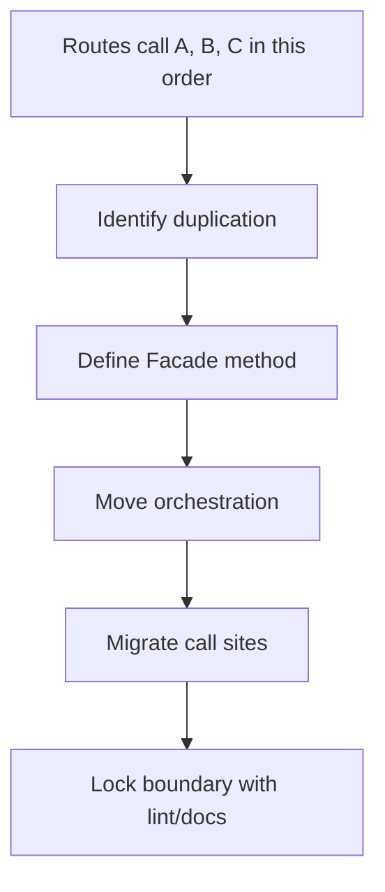
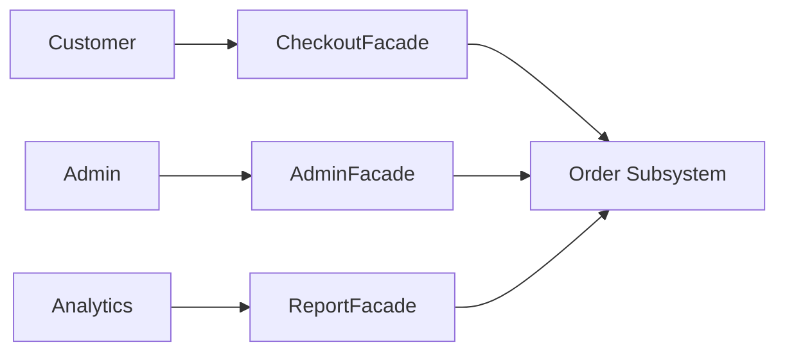
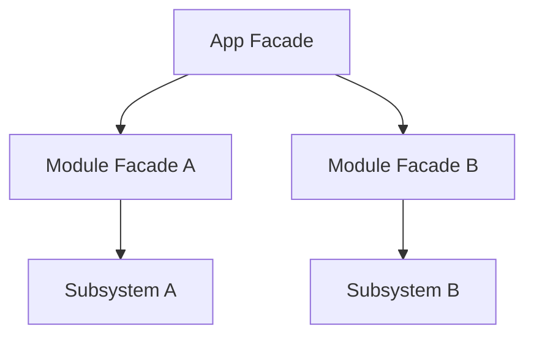

# Facade — Middle Level

> **Source:** [refactoring.guru/design-patterns/facade](https://refactoring.guru/design-patterns/facade)
> **Prerequisite:** [Junior](junior.md)

---

## Table of Contents

1. [Introduction](#introduction)
2. [When to Use Facade](#when-to-use-facade)
3. [When NOT to Use Facade](#when-not-to-use-facade)
4. [Real-World Cases](#real-world-cases)
5. [Code Examples — Production-Grade](#code-examples--production-grade)
6. [Multiple Facades for One Subsystem](#multiple-facades-for-one-subsystem)
7. [Facade as a Stable API Surface](#facade-as-a-stable-api-surface)
8. [Trade-offs](#trade-offs)
9. [Alternatives Comparison](#alternatives-comparison)
10. [Refactoring to Facade](#refactoring-to-facade)
11. [Pros & Cons (Deeper)](#pros--cons-deeper)
12. [Edge Cases](#edge-cases)
13. [Tricky Points](#tricky-points)
14. [Best Practices](#best-practices)
15. [Tasks (Practice)](#tasks-practice)
16. [Summary](#summary)
17. [Related Topics](#related-topics)
18. [Diagrams](#diagrams)

---

## Introduction

> Focus: **When to use it?** and **Why?**

You already know Facade is "a simple front for complex stuff." At the middle level, the harder questions are:

- **When does the simplification really earn its keep?**
- **How do I keep a Facade focused instead of letting it grow into a god class?**
- **What about multiple audiences, layered systems, and stable API contracts?**

This document focuses on **decisions and patterns** that turn a textbook Facade into something that survives a year of production.

---

## When to Use Facade

Use Facade when **all** of these are true:

1. **The subsystem has real complexity.** Many classes, an awkward API, or an order-sensitive sequence.
2. **There's a clear "common case."** 80% of callers do the same thing; 20% need full power.
3. **Coupling to internals is a known cost.** Callers spread across the codebase will couple to *whatever* you expose.
4. **You can name the use case.** "Place an order", "watch a movie", "deploy the app." If you can't name it, you can't simplify it.
5. **You expect the subsystem to evolve.** A stable Facade lets the subsystem change underneath.

If even one is missing, you might just need a helper function or two — not a named pattern.

### Triggers

- "The team keeps writing the same 5 lines together." → wrap them.
- "We're integrating a third-party SDK; let's not couple our domain to its types." → wrap them.
- "Onboarding takes hours because nobody understands which classes to use." → write a Facade and a docstring.
- "We need a single place to enforce defaults / observability / retries on this subsystem." → that's a Facade with a side benefit.

---

## When NOT to Use Facade

- **The subsystem is already simple.** A 2-method class doesn't need a Facade.
- **Every caller does something different.** A Facade for "any order operation" simplifies nothing.
- **You'd duplicate the framework's abstractions.** Spring already gives you a service layer; don't write a Facade-around-Spring's-Facade.
- **You're using Facade to hide *bugs*.** "Calling X without Y crashes" — fix Y, don't paper over it.
- **The Facade would be a passthrough.** If your Facade method is a single-line delegate, just expose the original.

### Smell: god-class Facade

You started with `placeOrder`. Two years later, the same class has `cancelOrder`, `refundOrder`, `exportInvoice`, `recalculateInventory`, `notifyMarketing`. **Split it.** Per task or per audience. A Facade with 30 methods stops being a Facade.

---

## Real-World Cases

### Case 1 — `OrderService.placeOrder`

A typical e-commerce sequence: validate → reserve inventory → calculate price (taxes, discounts) → charge → confirm inventory → enqueue email → log event. Without a Facade, every UI route does this orchestration. With a Facade, the route says `orderService.placeOrder(cartId, paymentMethod)` and goes home.

The Facade also picks defaults (idempotency key generation, currency, fraud-check threshold). Power users — like a backend admin tool that wants to skip fraud checks for a B2B import — call the underlying steps individually.

### Case 2 — `requests` (Python)

`requests.get(url)` is a Facade over urllib3, sockets, TLS, redirects, encoding detection. Most users call `.get()`, `.post()` — done. Power users dig into `Session`, mounted adapters, custom protocol handlers. The simplification is real: 90% of HTTP code becomes one line.

### Case 3 — `aws.S3.uploadFile`

Multipart upload, retries, signing, content-type detection, ETag verification — a real subsystem. The high-level method does the right thing for files of any size. Power users use `multipart_create`, `multipart_upload_part`, `multipart_complete` for streaming or pre-signed URLs.

### Case 4 — `git pull`

`git pull = git fetch && git merge`. A 2-step orchestration. Behind it, defaults: which remote, which branch, fast-forward vs merge commit. Sometimes default behavior surprises users — but the simplification is overwhelmingly worth it.

### Case 5 — Compiler frontends

`gcc hello.c -o hello` is a Facade over preprocess → compile → assemble → link → strip. Each step is reachable (`-E`, `-c`, etc.) but most users never need them.

---

## Code Examples — Production-Grade

### Example A — Order placement Facade (Java)

```java
public final class OrderService {
    private final InventoryService inventory;
    private final PricingEngine pricing;
    private final PaymentProcessor payments;
    private final NotificationGateway notifications;
    private final OrderRepository orders;
    private final Clock clock;
    private final Logger log;

    public OrderService(InventoryService inv, PricingEngine pr, PaymentProcessor pay,
                         NotificationGateway not, OrderRepository ord, Clock clock, Logger log) {
        this.inventory = inv; this.pricing = pr; this.payments = pay;
        this.notifications = not; this.orders = ord; this.clock = clock; this.log = log;
    }

    public Order placeOrder(PlaceOrderCommand cmd) throws OrderException {
        log.info("placeOrder", "userId", cmd.userId(), "cartId", cmd.cartId());

        // Validate inventory.
        var reservations = inventory.reserve(cmd.items());

        try {
            // Calculate price (taxes, discounts).
            var quote = pricing.quote(cmd.items(), cmd.userId(), cmd.shippingAddress());

            // Charge.
            var receipt = payments.charge(cmd.userId(), quote.total(), cmd.paymentMethod(),
                                          UUID.randomUUID().toString());

            // Persist.
            var order = new Order(orders.nextId(), cmd.userId(), cmd.items(), quote, receipt, clock.instant());
            orders.save(order);

            // Confirm reservations (commit).
            inventory.confirm(reservations);

            // Notify (best-effort, async).
            notifications.sendOrderConfirmation(order);

            return order;
        } catch (Exception e) {
            // Rollback the reservation.
            inventory.cancel(reservations);
            throw e;
        }
    }
}
```

What this gets right:
- Single-purpose method (`placeOrder`).
- Subsystem injected via constructor — testable.
- Defaults made explicit (idempotency key generation).
- Error rollback path (cancel reservation on failure).

### Example B — `requests` style Facade (Python)

```python
import urllib3
from typing import Optional


class HttpFacade:
    def __init__(self):
        self._pool = urllib3.PoolManager(retries=urllib3.Retry(total=3, backoff_factor=0.3))

    def get(self, url: str, params: Optional[dict] = None, timeout: int = 30) -> dict:
        if params:
            url += "?" + urllib3.request.urlencode(params)
        r = self._pool.request("GET", url, timeout=timeout)
        if r.status >= 400:
            raise HttpError(f"GET {url} -> {r.status}")
        return self._decode(r)

    def post(self, url: str, json_body: dict, timeout: int = 30) -> dict:
        import json
        r = self._pool.request("POST", url,
                              body=json.dumps(json_body).encode(),
                              headers={"Content-Type": "application/json"},
                              timeout=timeout)
        if r.status >= 400:
            raise HttpError(f"POST {url} -> {r.status}")
        return self._decode(r)

    def _decode(self, r):
        ct = r.headers.get("content-type", "").lower()
        if "json" in ct:
            return json.loads(r.data.decode())
        return r.data.decode()


http = HttpFacade()
data = http.get("https://api.example.com/users", params={"limit": 10})
```

The Facade hides connection pooling, retries, content-type negotiation, and encoding. Power users can still construct their own `PoolManager`.

### Example C — Layered Facade (Go)

```go
// Module-level facade for the payment subsystem.
type PaymentService struct {
    stripe    *stripe.Client
    fraud     *FraudDetector
    metrics   Metrics
}

func (p *PaymentService) Charge(ctx context.Context, req ChargeRequest) (Receipt, error) {
    if err := p.fraud.CheckFraud(req); err != nil { return Receipt{}, err }
    return p.stripe.Charges.Create(ctx, req.toStripeParams())
}

// App-level facade orchestrates multiple subsystem facades.
type Checkout struct {
    inventory *InventoryService
    payments  *PaymentService
    orders    *OrderService
}

func (c *Checkout) PlaceOrder(ctx context.Context, cart Cart) (*Order, error) {
    if err := c.inventory.Reserve(ctx, cart.Items); err != nil { return nil, err }
    receipt, err := c.payments.Charge(ctx, ChargeRequest{Amount: cart.Total()})
    if err != nil { c.inventory.Cancel(ctx, cart.Items); return nil, err }
    return c.orders.Persist(ctx, cart, receipt)
}
```

Each layer is a Facade. The application talks to `Checkout`; `Checkout` talks to module Facades; module Facades talk to subsystems.

---

## Multiple Facades for One Subsystem

Different audiences need different starter kits. One subsystem, multiple Facades.

### Example: Order subsystem

- **`CustomerCheckoutFacade`** — `placeOrder`, `cancelOrder`, `viewOrders`. Used by the storefront.
- **`AdminOrderFacade`** — `issueRefund`, `reissueOrder`, `forceCancel`. Used by ops.
- **`AnalyticsOrderFacade`** — read-only aggregations. Used by reporting.

Each Facade exposes a focused slice. The underlying `OrderRepository`, `RefundService`, etc. are shared.

### Why this matters

- Surface area per audience stays small.
- Permissions can be enforced at the Facade level (admin Facade checks role).
- Tests are smaller; each Facade tests its own narrow API.

---

## Facade as a Stable API Surface

A Facade is often the **versioned, supported API** for a module or library. Internals can change freely; the Facade's signature is the contract.

### Patterns

- Mark internal classes with `@Internal` (Java) / `internal` (Kotlin/.NET) / lowercase (Go) — the Facade is the only stable, public path.
- Document which methods are *guaranteed*; others are "may change."
- Version the Facade (`OrderApiV1`, `OrderApiV2`) when breaking changes are needed.

### Side benefits

- Centralized observability (logging, metrics) at the Facade.
- Centralized policy (timeouts, retries, validation).
- Single place to enforce auth/permission rules.

---

## Trade-offs

| Trade-off | Pay | Get |
|---|---|---|
| Add a Facade class | One more file, one more layer | Callers don't depend on subsystem internals |
| Some duplication of method signatures | Boilerplate | Stable, focused API |
| Defaults | One specific choice baked in | Clean common case |
| Subsystem still public | Power users can bypass | Flexibility for advanced needs |
| Errors become Facade-shaped | Translation work | Domain-friendly error types |

---

## Alternatives Comparison

| Alternative | Use when | Trade-off |
|---|---|---|
| **Just expose subsystem** | Subsystem is small/simple | More coupling; no central place for policy |
| **Helper functions** | One or two needed shortcuts | Less structure than a class; fine for small needs |
| **Service Layer (collection of Facades)** | Many domains | Layered organization across the app |
| **API Gateway** | Distributed systems | Facade across processes |
| **Adapter** | Retrofitting one class | Different intent; not a subsystem simplification |
| **Mediator** | Coordinating object interactions | Different intent; objects-talking, not entry point |

---

## Refactoring to Facade

A common path: code repeats the same orchestration in many places. Steps to refactor:

### Step 1 — Find the duplication

`grep` for the subsystem method names. Multiple places call them in the same order? Candidate.

### Step 2 — Define a focused method

`OrderService.placeOrder(cmd)`. Signature based on what callers actually need, not what the subsystem exposes.

### Step 3 — Move the orchestration

Copy the duplicated lines into the Facade method. Inject subsystem dependencies via constructor.

### Step 4 — Migrate one call site at a time

Each PR small; keep tests green.

### Step 5 — Delete the duplicated orchestration

Once all callers use the Facade, the original orchestration is dead code — remove.

### Step 6 — Lock the boundary

Lint or document: "use `OrderService.placeOrder`; don't call subsystem directly without a reason."

---

## Pros & Cons (Deeper)

### Pros (revisited)

- **Reduced coupling.** Caller depends on the Facade, not on the subsystem.
- **Onboarding speed.** New engineers learn the Facade; the subsystem is detail.
- **Single point of policy.** Defaults, observability, error translation — all in one place.
- **Stable contract.** Internals can evolve independently.
- **Easy testing.** Mock the Facade; the subsystem doesn't need to be touched.

### Cons (revisited)

- **God-class risk.** Without discipline, Facades collect responsibility.
- **Indirection.** One more layer between caller and reality.
- **Hidden behavior.** Defaults aren't visible; surprising bugs come from "what does this method actually do?"
- **Bypass temptation.** Subsystem still public; some callers go around the Facade.
- **Over-abstraction.** Wrapping a simple subsystem in a Facade adds friction without benefit.

---

## Edge Cases

### 1. Partial success

`placeOrder` charges the card but the email fails. Did the order succeed? Document semantics: "order is committed; email retried asynchronously" or whatever your team decides.

### 2. Default that bites

`uploadFile` defaults to public-read ACL → security incident. Defaults must be sane *and* documented *and* overridable.

### 3. Callers want a sub-step

A user wants to "validate but not charge." The Facade's `placeOrder` does both. Either: add a `validateOrder` method, or expose the validator as a sub-Facade. Don't force them to copy logic.

### 4. Long-running operation

`placeOrder` blocks on email send. Most callers don't need to wait. Either: queue the email and return immediately, or expose a non-blocking variant.

### 5. Subsystem leaks errors

The Facade catches `StripeException` but not `IOException`. The exception escapes and surprises callers. **Catch and translate** all subsystem errors at the Facade boundary.

### 6. Subsystem grows new methods

Power users want them. The Facade can either expose them (growing) or keep them visible at the lower level. Decide; don't accumulate without thought.

---

## Tricky Points

- **Facade doesn't own the subsystem.** It's just a recommended path. Power users can bypass; that's fine.
- **Where does the business logic go?** Not in the Facade. The Facade *orchestrates*; the subsystem *decides*. If your Facade has `if amount > threshold then ...`, that policy belongs in a domain object.
- **Observability at the Facade.** Logging, metrics, tracing all naturally live here. But not error swallowing — errors should propagate (after translation).
- **Versioning.** A Facade with breaking changes needs the same versioning discipline as a public API.

---

## Best Practices

1. **Keep it focused.** One Facade per task or audience; max ~10 methods.
2. **Inject dependencies.** Constructor over field access.
3. **Define your own error types.** Don't let subsystem exceptions leak.
4. **Document defaults.** Inline comments or method-level docs.
5. **Allow opt-out.** Don't make the Facade the only path unless the subsystem is genuinely internal.
6. **Add observability here.** Logging + metrics + tracing at the Facade keep the rest of the code clean.
7. **Test it.** Even "just delegation" deserves tests — orchestration order and defaults matter.

---

## Tasks (Practice)

1. Take a pile of orchestration duplicated across routes; extract a Facade method. Migrate at least 3 call sites.
2. Build two Facades over the same subsystem for two audiences (e.g., `CustomerOrderFacade` and `AdminOrderFacade`).
3. Wrap a third-party SDK (HTTP, S3, payment) in a domain Facade. Translate errors; document defaults.
4. Write tests for a Facade method that asserts orchestration order with mock subsystems.
5. Add observability (logging, tracing) to a Facade without changing its signature; verify a request shows the right span tree.

---

## Summary

- Use Facade when subsystem complexity is real, the common case is identifiable, and coupling to internals is a known cost.
- Don't use it for trivial subsystems or fully-varied callers.
- Keep it focused; consider multiple Facades for different audiences.
- It's a great place for defaults, observability, and error translation — but not for business logic.
- Subsystem stays public; Facade is a recommended path, not the only path.

---

## Related Topics

- **Next:** [Senior Level](senior.md) — Service Layer, API Gateway, BFF, performance, distributed Facades.
- **Compared with:** [Adapter](../01-adapter/junior.md), Mediator, Service Layer.
- **Architectural cousins:** API Gateway, Backend-for-Frontend.

---

## Diagrams

### Refactoring to Facade



### Multiple Facades, one subsystem



### Layered Facades



---

[← Back to Facade folder](.) · [↑ Structural Patterns](../README.md) · [↑↑ Roadmap Home](../../../README.md)

**Next:** [Facade — Senior Level](senior.md)
