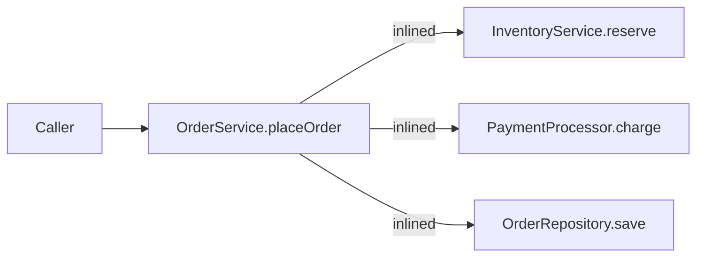
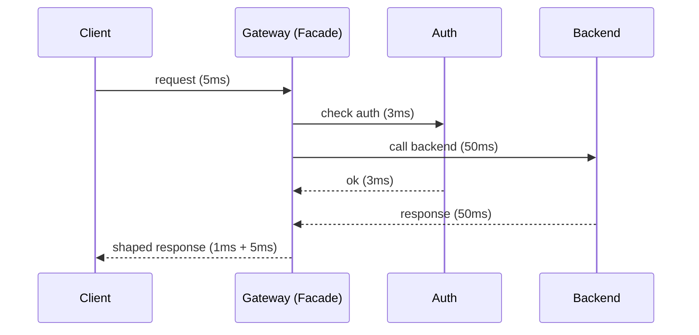

# Facade — Professional Level

> **Source:** [refactoring.guru/design-patterns/facade](https://refactoring.guru/design-patterns/facade)
> **Prerequisite:** [Senior](senior.md)

---

## Table of Contents

1. [Introduction](#introduction)
2. [Memory Layout of a Facade](#memory-layout-of-a-facade)
3. [JVM: Inlining Through a Facade](#jvm-inlining-through-a-facade)
4. [Async Orchestration Cost](#async-orchestration-cost)
5. [DTO Allocation at the Boundary](#dto-allocation-at-the-boundary)
6. [Facade as a Hot Path](#facade-as-a-hot-path)
7. [Distributed Facade Latency Math](#distributed-facade-latency-math)
8. [Connection Pooling and Resource Sharing](#connection-pooling-and-resource-sharing)
9. [Microbenchmark Anatomy](#microbenchmark-anatomy)
10. [Cross-Language Comparison](#cross-language-comparison)
11. [Saga and Compensation Cost](#saga-and-compensation-cost)
12. [Diagrams](#diagrams)
13. [Related Topics](#related-topics)

---

## Introduction

A Facade at the professional level is examined for what the runtime makes of it: the per-call overhead of the indirection, the cost of allocating DTOs at the boundary, the latency of distributed orchestrations, and the runtime patterns that make Facades fast at scale.

Most Facades pay no measurable cost in business-logic apps. The exceptions — high-throughput SDKs, API gateways, and inner-loop Facades — are where this document focuses.

---

## Memory Layout of a Facade

A typical Facade holds N references to subsystem services:

```java
public final class OrderService {
    private final InventoryService inventory;     // 4 bytes (compressed oop)
    private final PaymentProcessor payments;      // 4
    private final NotificationGateway notifications;  // 4
    private final OrderRepository orders;         // 4
    private final Clock clock;                    // 4
    private final Logger log;                     // 4
}
```

JVM (compressed OOPs): 12 bytes header + 6 × 4 = 36 bytes, padded to 40. Negligible per-instance.

In Go: ~48 bytes (6 pointer fields). In CPython: ~150-200 bytes (instance dict).

**Practical takeaway:** Facade instances are tiny. Application memory is dominated by domain entities and request data, not Facade instances.

---

## JVM: Inlining Through a Facade

When a caller invokes `orderService.placeOrder(cmd)`, HotSpot dispatches once. After warmup at a monomorphic site, the call inlines:

```java
// Source:
order = orderService.placeOrder(cmd);

// After JIT (concept):
// inlined OrderService.placeOrder body, which inlines:
// - InventoryService.reserve (also inlined if monomorphic)
// - PaymentProcessor.charge (more complex; may not inline through async boundary)
// - OrderRepository.save (DB call; not inlinable past JDBC)
```

The Facade itself is invisible after inlining — the JIT collapses the method calls into a single sequence.

### Inlining limits

`MaxInlineLevel` (default 9) caps recursion. A Facade calling subsystems that themselves call other Facades can reach the limit. Past it, calls remain virtual.

### Megamorphism

If a single call site sees multiple Facade types (rare), inline cache fails. But Facades are usually one-per-domain, so megamorphism is uncommon.

### Devirtualization

Marking the Facade `final` or making subsystem dependencies `final` helps CHA aggressively devirtualize. Sealed interfaces (Java 17+) are even better.

---

## Async Orchestration Cost

A Facade that fans out to N services in parallel:

```java
CompletableFuture<A> a = supplyAsync(this::callA, executor);
CompletableFuture<B> b = supplyAsync(this::callB, executor);
CompletableFuture<C> c = supplyAsync(this::callC, executor);
return allOf(a, b, c).thenApply(_ -> combine(a.join(), b.join(), c.join()));
```

Cost breakdown:
- 3 × thread-pool dispatch: ~1-5 μs each.
- Future creation + completion: ~500 ns each.
- `allOf` + `thenApply`: ~1 μs.

Total overhead: ~5-15 μs. For a Facade with sub-millisecond inner work, this is significant. For a Facade calling 100 ms remote services, invisible.

**Heuristic:** parallelize when the inner work > 1 ms each. Below that, sequential is faster (no thread-pool dispatch).

---

## DTO Allocation at the Boundary

A Facade often translates between domain and external types:

```java
public OrderResponseDto placeOrder(PlaceOrderRequest req) {
    PlaceOrderCommand cmd = mapToCommand(req);   // allocates Command
    Order order = inner.place(cmd);
    return mapToDto(order);                       // allocates DTO
}
```

Two allocations per call. At 10k QPS: 20k DTOs/sec to GC. Mitigate with:
- Records / value types where possible.
- Object pools for very hot paths.
- Lazy mapping: pass references, materialize only what's read.

For a typical CRUD app, the cost is invisible. For an inner-loop Facade in a tight pipeline, profile and optimize.

---

## Facade as a Hot Path

Some Facades sit on hot paths: SDK clients, ORM repositories, library entry points. They're called millions of times per second per process. Considerations:

### Avoid lock contention

A Facade holding a single shared lock (logger, cache, registry) can serialize all calls. Use lock-free data structures, sharded locks, or thread-local stash.

### Avoid synchronization in defaults

If the default behavior calls a clock or random number generator, that's a syscall or a contended mutex. Use cached time (per request) or per-thread RNG.

### Pre-compute static dependencies

A Facade that builds a `Pattern` regex per call is wasting time. Compile once, store as a `static final` field.

### Inline-friendly code

Small methods, monomorphic call sites, no reflection. The JIT will inline; you'll get zero overhead.

---

## Distributed Facade Latency Math

An API Gateway Facade in production:

```
Client → Gateway (5 ms)
  Gateway → Auth (3 ms) (parallel with route lookup)
  Gateway → Backend (50 ms)
  Gateway → Response shaping (1 ms)
Client ← Gateway (5 ms)
```

Total: ~64 ms. The Gateway adds ~10 ms (auth + shaping); the rest is backend + network.

Optimizations:
- **Cache auth decisions** for short windows (1-10s): drop 3 ms per request.
- **Async fan-out** for aggregation endpoints: max instead of sum.
- **Connection pooling**: TLS handshake is expensive; reuse connections.
- **HTTP/2 or gRPC** between gateway and backends: lower per-request overhead.
- **Co-locate**: gateway and backends in same data center.

A 10 ms savings × 100M requests/day = 1M seconds of latency saved daily. Worth pursuing at scale.

---

## Connection Pooling and Resource Sharing

A Facade often holds long-lived resources:
- Database connection pools.
- HTTP client pools (connection keep-alive).
- Thread pools.

Best practices:
- **One pool per backend.** A pool per request is wasted setup.
- **Size pools deliberately.** Too small → contention. Too large → wasted memory + connection-level overhead.
- **Monitor utilization.** Saturation tells you pool is too small; idle tells you pool is too large.
- **Graceful shutdown.** A Facade that holds pools should drain on shutdown.

---

## Microbenchmark Anatomy

### Java JMH

```java
@State(Scope.Benchmark)
public class FacadeBench {
    OrderService svc = wireup();
    PlaceOrderCommand cmd = sampleCmd();

    @Benchmark public Order benchPlaceOrder(Blackhole bh) {
        return svc.placeOrder(cmd);
    }
}
```

Expected: throughput depends on what the subsystem does. A Facade calling in-memory mocks: 100ns – 1μs per call. A Facade calling a real DB: dominated by DB latency.

The Facade itself is rarely the bottleneck.

### Pitfalls

- **Realistic subsystems.** Mocks return instantly; production subsystems take ms. Benchmark with realistic mocks.
- **Don't test the wiring.** Construct services once, outside `@Setup` if possible.
- **Measure realistic load.** Single-thread benchmarks miss contention; multi-threaded benchmarks reveal it.

---

## Cross-Language Comparison

| Concern | Java (HotSpot) | Go | Python (3.11+) |
|---|---|---|---|
| **Per-call dispatch** | ~0-1 ns (inlined) | ~3 ns | ~150 ns |
| **Async fan-out cost** | ~1-5 μs per future | ~1 μs per goroutine | ~50 μs per asyncio task |
| **DTO allocation** | ~50 ns / object | ~30 ns / struct | ~500 ns / dict |
| **Facade memory** | ~40 bytes | ~50 bytes | ~150-200 bytes |

For request-scoped code, all three are fine. For inner loops, language matters.

---

## Saga and Compensation Cost

When a Facade orchestrates a distributed transaction, failure handling has real cost:

```
placeOrder:
  reserve_inventory   ← may fail
  charge_card         ← may fail (compensate: cancel reservation)
  send_email          ← may fail (compensate: refund charge?)
```

Compensation patterns:
- **Synchronous compensation:** facade tries; if step N fails, run rollback steps N-1, N-2, ..., 1. Simple but slow (failures take 2× the latency).
- **Async compensation (saga orchestrator):** facade publishes "OrderRequested"; an orchestrator handles each step and compensations. Decoupled but complex.
- **Outbox pattern:** facade writes intent atomically to DB; an async processor handles the rest. Reliable; introduces latency.

Cost considerations:
- Each compensation step has its own latency budget.
- Idempotency is required throughout (compensations must be safe to retry).
- Observability is critical — failed sagas need to be visible in dashboards.

For most applications, synchronous Facade with try/catch + manual compensation is enough. Sagas are needed when failures across services must be handled robustly at scale.

---

## Diagrams

### JVM inlines a Facade chain



### Async fan-out vs sequential

```
sequential:  A — 100ms — B — 100ms — C — 100ms — total 300ms
parallel:    A
             B  ⎫
             C  ⎬ all in 100ms — total 100ms
```

### Distributed Facade latency



---

## Related Topics

- **JVM internals:** inline caches, CHA, escape analysis (already covered in Adapter and Composite Professional).
- **Async / concurrency:** CompletableFuture, Project Loom (virtual threads), Go goroutines, asyncio.
- **Distributed patterns:** Saga, Outbox, Compensating transactions, Idempotency keys.
- **Profiling:** flame graphs over a Facade with realistic load.
- **Observability:** distributed tracing (Jaeger, OpenTelemetry), metrics at Facade boundaries.
- **Next:** [Interview](interview.md), [Tasks](tasks.md), [Find the Bug](find-bug.md), [Optimize](optimize.md).

---

[← Back to Facade folder](.) · [↑ Structural Patterns](../README.md) · [↑↑ Roadmap Home](../../../README.md)

**Next:** [Facade — Interview Preparation](interview.md)
