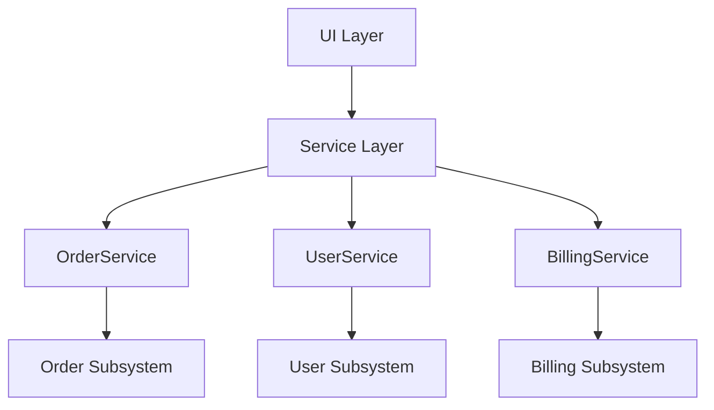
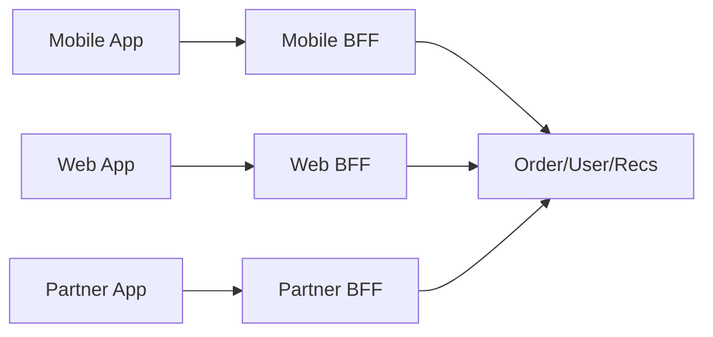
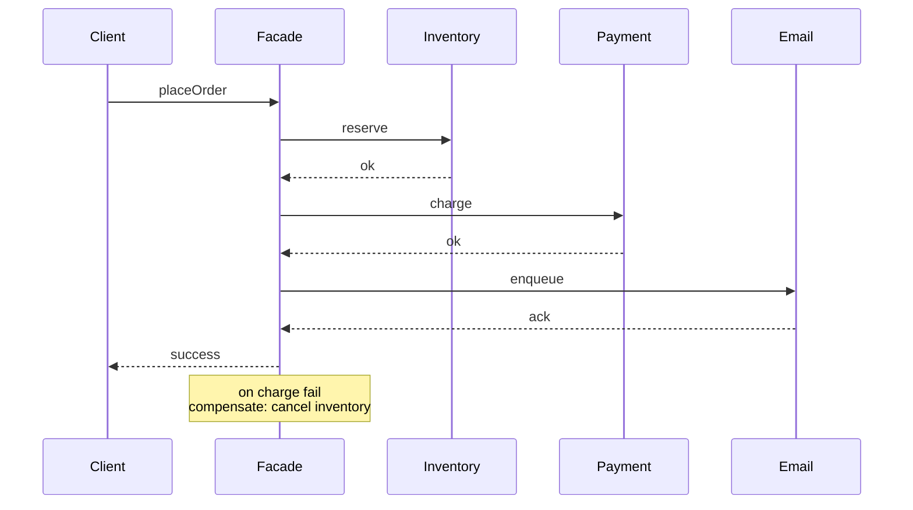

# Facade — Senior Level

> **Source:** [refactoring.guru/design-patterns/facade](https://refactoring.guru/design-patterns/facade)
> **Prerequisite:** [Middle](middle.md)

---

## Table of Contents

1. [Introduction](#introduction)
2. [Facade at Architectural Scale](#facade-at-architectural-scale)
3. [Performance Considerations](#performance-considerations)
4. [Concurrency Deep Dive](#concurrency-deep-dive)
5. [Testability Strategies](#testability-strategies)
6. [When Facade Becomes a Problem](#when-facade-becomes-a-problem)
7. [Code Examples — Advanced](#code-examples--advanced)
8. [Real-World Architectures](#real-world-architectures)
9. [Pros & Cons at Scale](#pros--cons-at-scale)
10. [Trade-off Analysis Matrix](#trade-off-analysis-matrix)
11. [Migration Patterns](#migration-patterns)
12. [Diagrams](#diagrams)
13. [Related Topics](#related-topics)

---

## Introduction

> Focus: **At scale, what breaks? What earns its keep?**

In toy code Facade is "watchMovie() turns on the TV." In production it's "API Gateway," "Backend-for-Frontend," "Service Layer," "Public SDK." The senior question isn't "do I write a Facade?" — it's **"where do I draw the API surface so it stays small while the system grows?"**

At scale Facade dissolves into:

- **API Gateway / BFF** — process-level Facade routing across many services.
- **Service Layer** — application-level collection of domain Facades.
- **Public SDKs** — Facade as a contract with external developers.
- **CLI tools** — `git`, `kubectl`, `aws` are Facades with subcommands.

These are Facade scaled up; the fundamentals stay.

---

## Facade at Architectural Scale

### 1. API Gateway

A single HTTP endpoint fronts a sea of microservices. The gateway:
- Routes by path.
- Authenticates.
- Rate limits.
- Translates protocols (REST → gRPC).
- Aggregates calls (dashboard endpoint that calls 5 services).

The pattern is Facade: simplify a complex distributed subsystem. The deployment artifact is a service (Envoy, Kong, Apigee). The intent is identical to a class-level Facade.

### 2. Backend-for-Frontend (BFF)

Different clients (mobile, web, partner) need different shapes. Each gets its own Facade:

```
Mobile BFF  →  Order, User, Recommendations, Promotions services
Web BFF     →  Order, User, Recommendations, Promotions services
Partner BFF →  Order, User services (read-only, signed payloads)
```

Same subsystem; three Facades; clean per-client APIs.

### 3. Public SDK

`aws-sdk` exposes a small, friendly API: `s3.upload(...)`, `dynamo.put(...)`. Underneath: signing, retries, multipart, pagination. The SDK is a Facade with strict backward-compatibility rules.

### 4. CLI tools

`kubectl get pods` is a Facade over the Kubernetes API. `git pull` over `git fetch && git merge`. Subcommands are sub-Facades; flags expose the underlying operations for power users.

### 5. Service Layer

A Java/Spring app has `@Service`-annotated classes — `OrderService`, `UserService`, `BillingService`. Each is a Facade over its domain. The collection of services is the application-level Facade for the persistence/event tier.

### 6. Domain-Driven Design's Application Layer

DDD splits the system into Domain (entities, aggregates), Application (use cases / Facades), and Infrastructure (DB, queue, third-party). The Application layer is a collection of Facades; each use case is one method.

---

## Performance Considerations

### Per-call cost

A Facade call is just one extra method invocation. JVM warm: free. Go: ~3 ns. Python: ~150 ns. For request-scoped operations the cost is invisible.

### When it matters

- **API Gateway with deserialization.** Each request goes through the gateway's parsing, auth check, routing. Per-request cost can be 1-5 ms. Multiply by traffic.
- **Long synchronous Facades.** `placeOrder` calls 7 services serially? Latency is the sum. Mitigate with concurrency or by splitting into a write-and-async-events pattern.
- **Facade allocations.** Building DTOs at the Facade boundary allocates. For 100k QPS, watch GC.

### Concurrency in Facades

A Facade often needs to call N subsystem services in parallel:

```java
CompletableFuture<Inventory> inv = inventoryService.checkAsync(items);
CompletableFuture<Quote> quote = pricingService.quoteAsync(items, user);
CompletableFuture<FraudScore> fraud = fraudService.checkAsync(user, ip);

return CompletableFuture.allOf(inv, quote, fraud)
    .thenApply(_ -> new OrderQuote(inv.join(), quote.join(), fraud.join()));
```

Latency = max of three, not sum. Big win at scale.

### Caching at the Facade

The Facade is the right place to cache:
- It knows the *use case*; granular caching makes sense.
- It owns the dependencies, so invalidation is easier.

Don't cache *inside* a subsystem service if the cache would be specific to a use case — push the cache up to the Facade.

---

## Concurrency Deep Dive

### Stateless Facade

Most Facades are stateless — they hold subsystem references. Safe to share across threads.

### Stateful Facade

Some Facades hold caches, request counters, or rate limiters. Must be thread-safe.

### Per-request Facade

In some frameworks (Spring with request-scoped beans), a Facade can be per-request — naturally thread-safe (one thread per request) but constructed often. Watch the cost.

### Backpressure

A Facade that fans out to N services without bounded concurrency can DOS its own backends. Use a semaphore or bounded executor.

### Deadlines and cancellation

A Facade should propagate the request deadline. If the user has 1 second left, all subsystem calls should respect it. In Go, `context.Context`. In .NET, `CancellationToken`. In Java, `CompletableFuture.orTimeout`.

### Saga / compensating transactions

When a Facade's orchestration spans multiple writes (charge card, reserve inventory, send email), failure midway needs rollback or compensation. Patterns:
- **Synchronous compensation:** if step N fails, undo steps 1..N-1.
- **Saga (distributed):** each step has a compensating action; orchestrator runs them on failure.
- **Outbox + events:** Facade writes intent + outbox; an async worker actually processes and emits events.

These cross from Facade pattern into distributed-systems patterns; the Facade is just where the orchestration starts.

---

## Testability Strategies

### Mock subsystem dependencies

A Facade's tests usually mock its dependencies. Assert orchestration order, error handling, defaults.

```java
@Test void placeOrder_chargesAfterReservingInventory() {
    var inv = mock(InventoryService.class);
    var pay = mock(PaymentProcessor.class);
    var svc = new OrderService(inv, pay, ...);
    svc.placeOrder(cmd);
    var inOrder = inOrder(inv, pay);
    inOrder.verify(inv).reserve(any());
    inOrder.verify(pay).charge(any(), any(), any(), any());
}
```

### Integration tests with real subsystems

A "full-stack" test exercises real subsystems (or in-memory equivalents). Catches integration bugs that mocks miss.

### Contract tests

If the Facade is a public API, contract tests verify backward compatibility across versions.

### Failure-injection tests

What happens if subsystem A fails? B times out? C returns malformed data? Inject failures and verify the Facade behaves sanely (rollback, error mapping, retry).

---

## When Facade Becomes a Problem

### Symptom 1 — God class

A Facade with 30 methods. **Fix:** split by audience or task.

### Symptom 2 — Hidden behavior surprises users

"Why did `placeOrder` send an email I didn't ask for?" **Fix:** make defaults explicit; document side effects; consider exposing a minimal variant.

### Symptom 3 — Callers bypass the Facade

A "shortcut" caller goes directly to the subsystem because the Facade was missing a method. **Fix:** add the method; or accept that the subsystem is an OK alternative path; or enforce the boundary with linting.

### Symptom 4 — Facade can't be tested

Subsystem dependencies are constructed inside; tests can't substitute. **Fix:** inject dependencies via constructor.

### Symptom 5 — Performance tax

A Facade with serial calls when parallelization is safe. **Fix:** introduce async/await/CompletableFuture; measure latency drop.

### Symptom 6 — Backward-compat break

A Facade method's signature changed; old callers broke. **Fix:** version Facades (`OrderApiV1`, `OrderApiV2`); deprecation cycle; migration guide.

---

## Code Examples — Advanced

### Parallel orchestration in Facade (Java)

```java
public final class OrderQuoteService {
    private final InventoryService inventory;
    private final PricingEngine pricing;
    private final FraudService fraud;
    private final Executor executor;

    public OrderQuote quote(QuoteCommand cmd) {
        var inv   = supplyAsync(() -> inventory.check(cmd.items()), executor);
        var price = supplyAsync(() -> pricing.quote(cmd.items(), cmd.user()), executor);
        var risk  = supplyAsync(() -> fraud.score(cmd.user(), cmd.ip()), executor);

        return allOf(inv, price, risk)
            .thenApply(_ -> new OrderQuote(inv.join(), price.join(), risk.join()))
            .orTimeout(2, SECONDS)
            .exceptionally(t -> { throw new QuoteUnavailable(t); })
            .join();
    }
}
```

Latency = max(inv, price, risk) instead of sum.

### Facade with idempotency + observability (Go)

```go
type CheckoutFacade struct {
    inv     InventoryService
    pay     PaymentService
    orders  OrderRepository
    log     Logger
    metrics Metrics
}

func (c *CheckoutFacade) PlaceOrder(ctx context.Context, cmd PlaceOrderCommand) (*Order, error) {
    span, ctx := tracer.StartSpan(ctx, "checkout.place_order")
    defer span.End()
    span.SetAttribute("user_id", cmd.UserID)

    start := time.Now()
    defer func() { c.metrics.RecordLatency("checkout.place_order", time.Since(start)) }()

    if cmd.IdempotencyKey == "" {
        cmd.IdempotencyKey = uuid.NewString()
    }

    if order, found := c.orders.GetByIdempotencyKey(ctx, cmd.IdempotencyKey); found {
        c.log.Info("returning idempotent result", "key", cmd.IdempotencyKey)
        return order, nil
    }

    reservation, err := c.inv.Reserve(ctx, cmd.Items)
    if err != nil { return nil, err }

    receipt, err := c.pay.Charge(ctx, cmd.UserID, cmd.Total, cmd.IdempotencyKey)
    if err != nil { c.inv.Cancel(ctx, reservation); return nil, err }

    return c.orders.Save(ctx, &Order{...})
}
```

Defaults, observability, idempotency, error rollback — all at the Facade.

### BFF Facade (TypeScript / Node)

```ts
class MobileBff {
    constructor(
        private orders: OrderClient,
        private user: UserClient,
        private recs: RecsClient,
    ) {}

    async homepage(userId: string): Promise<HomepageDto> {
        const [profile, recentOrders, recommendations] = await Promise.all([
            this.user.profile(userId),
            this.orders.recent(userId, 5),
            this.recs.forUser(userId, 10),
        ]);
        return {
            displayName: profile.name,
            recentOrderIds: recentOrders.map(o => o.id),
            recommended: recommendations.map(r => ({ id: r.id, title: r.title })),
        };
    }
}
```

The mobile homepage is a single endpoint; the BFF aggregates 3 services and shapes the response.

---

## Real-World Architectures

### A — `git` CLI

`git` is a Facade hierarchy. Top-level commands are sub-Facades; each invokes the underlying plumbing (`git-fetch`, `git-merge`, `git-write-tree`). Power users access plumbing for scripts and tooling.

### B — Spring Boot

Spring's `@Service` layer is a collection of Facades over `@Repository` (data access) and `@Component` (infrastructure). Annotations declare layering; the architecture is implicitly Facade-based.

### C — gRPC services

A gRPC service is a Facade with strongly-typed messages. `BookingService.Reserve` orchestrates internal modules; the proto contract is the Facade's API.

### D — AWS SDK

The high-level SDK clients (`AmazonS3Client`, `DynamoDbMapper`) are Facades. Underneath, low-level clients (`AmazonS3LowLevelClient`) are still available for power users. The high-level Facade adds retries, multipart, pagination, ergonomic types.

### E — Kubernetes API

`kubectl` is a Facade over the K8s API. Each subcommand (`get`, `apply`, `rollout`) is a sub-Facade. Scripts use `kubectl` for ergonomics; controllers use the API directly for performance and richness.

### F — Stripe Checkout

Stripe's `Checkout.Session.create()` is a Facade over the full payment flow (PaymentIntent + webhook + redirect URLs). Stripe maintains the lower-level API for businesses that need fine-grained control.

---

## Pros & Cons at Scale

### Pros (at scale)

- **API surface stability.** Subsystem evolves; Facade is the contract.
- **Independent team ownership.** Each Facade has a single owner.
- **Centralized policy.** Auth, rate limit, observability, defaults — all at the Facade.
- **Backward-compat enforcement.** Versioned Facades let you ship breaking changes safely.
- **Routing flexibility.** Same Facade can fan out to different backends per environment / tenant / experiment.

### Cons (at scale)

- **Bottleneck risk.** A single Facade fronting heavy traffic needs scaling considerations.
- **Latency tax.** Each layer adds milliseconds in distributed systems; sum across hops.
- **Coordination overhead.** Multiple Facades over one subsystem can drift in semantics.
- **Compatibility vault.** Once published, the Facade is hard to change.
- **Hidden complexity.** A simple API can hide expensive operations; users misuse without realizing.

---

## Trade-off Analysis Matrix

| Concern | No Facade (raw subsystem) | Class-level Facade | Service Layer | API Gateway / BFF |
|---|---|---|---|---|
| **Setup cost** | Lowest | Low | Medium | High |
| **Coupling** | Maximum | Reduced | Reduced | Minimal cross-team |
| **Onboarding speed** | Slow | Fast | Fast | Fast (with docs) |
| **Performance ceiling** | Highest | High | High | Lower (network hops) |
| **Versioning** | Hard | Easy (in-process) | Easy | Required (HTTP versions) |
| **Suitable for** | Trivial code | Single module | Application | Distributed system / public API |

---

## Migration Patterns

### Pattern 1 — From scattered orchestration to Facade

Same orchestration sequence appears in 6 places. Extract one Facade method; migrate one call site per PR. After all sites use the Facade, delete the duplicated code.

### Pattern 2 — From in-process Facade to API Gateway

A monolith Facade `OrderService` → an extracted microservice `order-svc` with the same logical interface. The Facade's signature becomes a gRPC contract. Migration is internal to the monolith; the public API stays.

### Pattern 3 — Splitting a god Facade

A `OrderService` with 30 methods → multiple Facades by audience. Identify clusters; create new classes; move methods. Migrate callers; delete the old class.

### Pattern 4 — From Facade to BFF

A web app and a mobile app share a Facade but need different response shapes. Introduce two BFFs (separate services); migrate clients; deprecate the shared Facade.

### Pattern 5 — Versioning a Facade

Need to ship a breaking change. Create `OrderApiV2` alongside `OrderApiV1`. Both call the same underlying subsystem. Migrate clients gradually. Deprecate V1 with a sunset date.

---

## Diagrams

### Service layer (collection of Facades)



### BFF pattern



### Saga in a Facade



---

## Related Topics

- **System-scale Facade:** API Gateway, BFF, Service Layer, public SDKs.
- **DDD:** Application Layer is a collection of Facades.
- **Pattern siblings:** Adapter (interface change), Mediator (object coordination), Service (often a Facade).
- **Distributed patterns:** Saga, Outbox, Compensating Transactions — what Facades grow into.
- **Next:** [Professional Level](professional.md) — performance, instrumentation cost, JIT, network hops.

---

[← Back to Facade folder](.) · [↑ Structural Patterns](../README.md) · [↑↑ Roadmap Home](../../../README.md)

**Next:** [Facade — Professional Level](professional.md)
