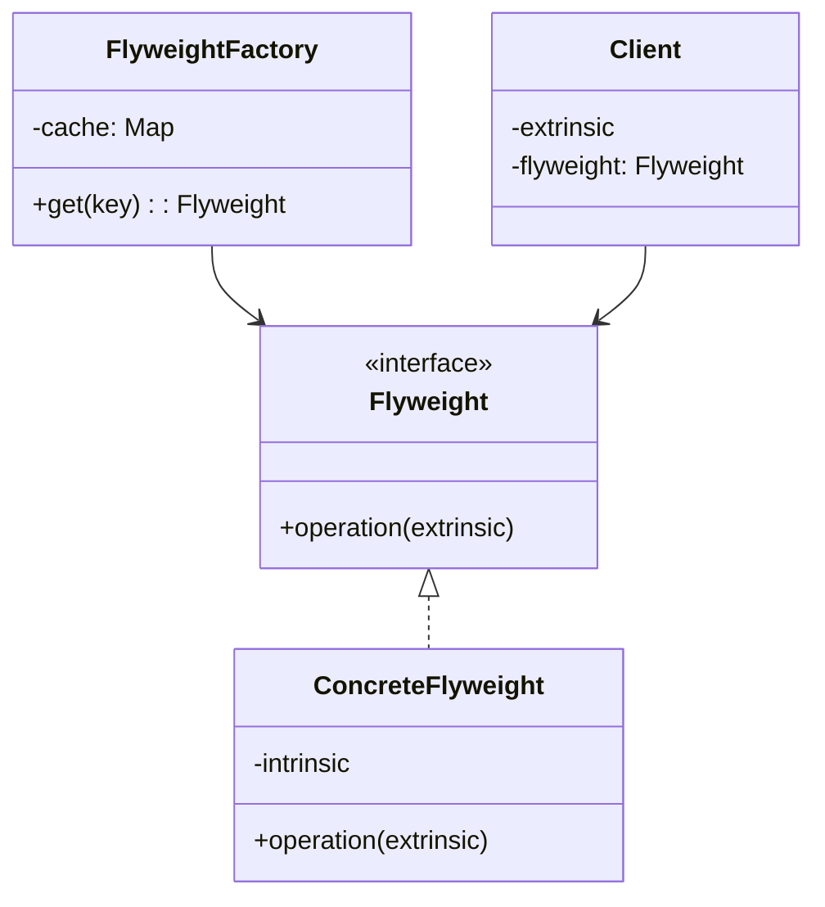
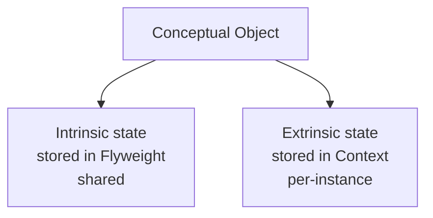
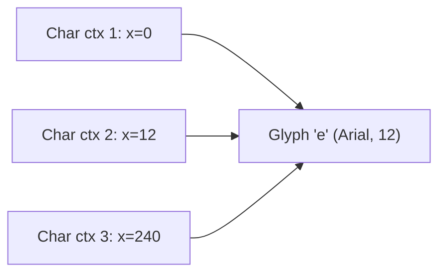
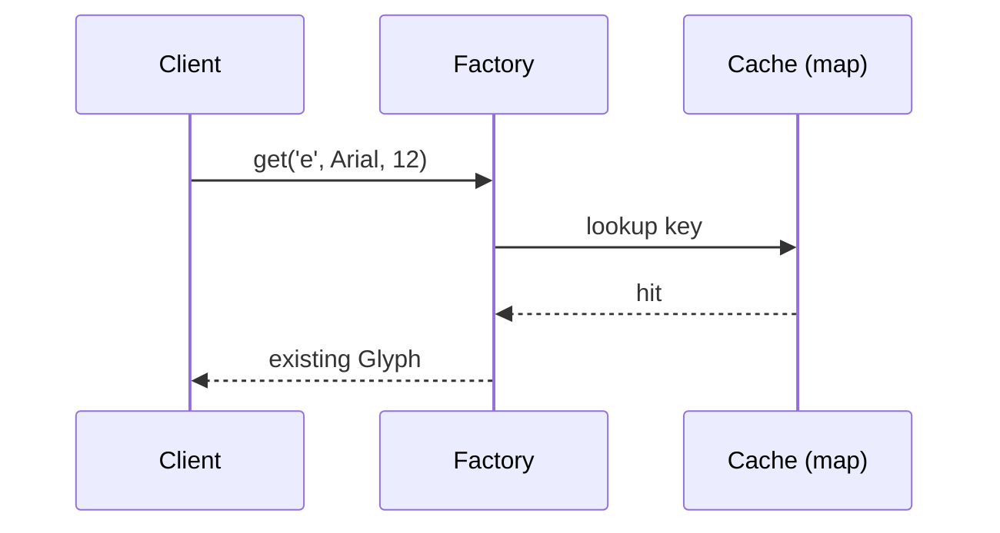

# Flyweight — Junior Level

> **Source:** [refactoring.guru/design-patterns/flyweight](https://refactoring.guru/design-patterns/flyweight)
> **Category:** [Structural](../README.md) — *"Explain how to assemble objects and classes into larger structures, while keeping these structures flexible and efficient."*

---

## Table of Contents

1. [Introduction](#introduction)
2. [Prerequisites](#prerequisites)
3. [Glossary](#glossary)
4. [Core Concepts](#core-concepts)
5. [Real-World Analogies](#real-world-analogies)
6. [Mental Models](#mental-models)
7. [Pros & Cons](#pros--cons)
8. [Use Cases](#use-cases)
9. [Code Examples](#code-examples)
10. [Coding Patterns](#coding-patterns)
11. [Clean Code](#clean-code)
12. [Best Practices](#best-practices)
13. [Edge Cases & Pitfalls](#edge-cases--pitfalls)
14. [Common Mistakes](#common-mistakes)
15. [Tricky Points](#tricky-points)
16. [Test Yourself](#test-yourself)
17. [Tricky Questions](#tricky-questions)
18. [Cheat Sheet](#cheat-sheet)
19. [Summary](#summary)
20. [What You Can Build](#what-you-can-build)
21. [Further Reading](#further-reading)
22. [Related Topics](#related-topics)
23. [Diagrams & Visual Aids](#diagrams--visual-aids)

---

## Introduction

> Focus: **What is it?** and **How to use it?**

**Flyweight** is a structural design pattern that lets you fit more objects into the available amount of RAM by **sharing common parts** of state between multiple objects instead of keeping all of the data in each object.

Imagine a text editor. A document with 100,000 characters could allocate 100,000 `Glyph` objects, each storing its character, font, size, color, x/y position. That's wasteful: most of those 100,000 glyphs are the letter 'e' in size-12 black Arial. Their *intrinsic* state (which character + style) is identical; only the *extrinsic* state (position) differs per occurrence. Flyweight says: store one `'e'+Arial+12+black` glyph and *reference* it from all 30,000 places that need it; store position separately.

In one sentence: *"Don't duplicate the parts that don't change — share them."*

You'll meet Flyweight in places where you have *millions* of similar objects: text engines, game sprites, particle systems, network packet headers, NLP token tables. The pattern is overkill for "thousands"; it earns its name at "millions."

---

## Prerequisites

What you should know before reading this:

- **Required:** Basic OOP — classes, fields, method calls.
- **Required:** Notion of memory: allocation, references, object overhead.
- **Required:** A sense of mutability vs immutability — flyweights are typically immutable.
- **Helpful:** Familiarity with `HashMap` / `dict` — flyweights are usually stored in a registry.
- **Helpful:** Some experience with profiling memory (heap dumps, allocation profilers) — that's where flyweights pay off.

---

## Glossary

| Term | Definition |
|------|-----------|
| **Flyweight** | A shared object that holds intrinsic state. |
| **Intrinsic state** | Data that's the same across many uses (font, character, color). Stored in the flyweight. |
| **Extrinsic state** | Data that varies per use (position, size, opacity). Stored *outside* the flyweight, passed in. |
| **Flyweight Factory** | A registry that returns existing flyweights or creates new ones. Keys by intrinsic state. |
| **Context** | The object that holds extrinsic state and a reference to a flyweight. |
| **Pooling** | A related but distinct concept — reusing instances to avoid allocation; not necessarily about sharing identical state. |

---

## Core Concepts

### 1. Split state in two

The first move: identify what's **intrinsic** (same in many places) and what's **extrinsic** (different per place). Glyph: char + font + style is intrinsic; position is extrinsic.

### 2. Share the intrinsic part

Instead of N copies of `('e', Arial, 12, black)`, keep **one** and reference it. The factory ensures the same flyweight is returned for the same intrinsic key.

### 3. Pass extrinsic state per call

Methods on the flyweight take extrinsic state as parameters: `glyph.draw(x, y)`. The flyweight doesn't know its position; the caller provides it.

### 4. Immutability matters

A flyweight is shared by many. If one user mutates it, every user sees the change. Make flyweights **immutable** — that's how sharing stays safe.

---

## Real-World Analogies

| Concept | Analogy |
|---------|--------|
| **Flyweight** | A library — one copy of a book on the shelf, many readers. The book's *contents* are intrinsic (shared); each reader's *bookmark* is extrinsic. |
| **Intrinsic state** | The recipe in a cookbook — same for everyone. |
| **Extrinsic state** | What's in your pantry today — yours alone. |
| **Factory** | A reception desk — "yes, we have a copy of *Don Quixote*; here it is." |
| **Mutability** | If readers wrote in the book, future readers would be confused. So everyone reads, no one writes. |

The classical refactoring.guru example is a forest: 500 million tree instances would crash a game; but most trees share `species + texture + mesh`. Make a flyweight for each species; each tree (extrinsic) only stores `(x, y, scale, rotation)` and a reference to the flyweight.

---

## Mental Models

**The intuition:** You're putting a sticker on a wall. Every sticker shows the same picture. Instead of printing the picture 1000 times, print it once and stick *references* to it everywhere — the picture is the flyweight; each location is the context.

**Why this model helps:** It reframes memory usage as "one big shared piece + small per-instance metadata." Once you see that split, you can apply the pattern wherever data has natural duplication.

**Visualization:**

```
Intrinsic (shared):
  ┌─────────────┐
  │ Glyph 'e'   │
  │ Arial 12pt  │
  │ Black       │
  └──────┬──────┘
         │
         │ referenced from many contexts
         │
   ┌─────┴──────────────────────┐
   ▼     ▼     ▼     ▼     ▼    ▼
  ctx1  ctx2  ctx3  ctx4  ctx5  ctx6
   x=0   x=12  x=24  x=36  x=48 ...
```

---

## Pros & Cons

| Pros | Cons |
|------|------|
| Massive memory savings when many objects share state | Code complexity — split intrinsic/extrinsic, factory |
| Fewer GC roots (fewer objects) | Mutability danger if you forget immutability |
| Cache-friendly when flyweights live close in memory | Extrinsic state must be passed every call |
| Enables huge object counts that wouldn't fit otherwise | Premature optimization for small object counts |
| Decouples "what" (flyweight) from "where" (extrinsic) | Easy to confuse with object pooling |

### When to use:
- You have *thousands to millions* of objects with overlapping state
- Memory is the bottleneck (heap dump dominated by one type of object)
- Most fields are common; only a few vary per instance
- The varying fields are cheap to pass (position, ID, small index)

### When NOT to use:
- You have hundreds of objects — savings are tiny, complexity is real
- Most state varies per instance (no real sharing possible)
- The objects are mutable and shared mutation is required
- You're confusing "share state" with "reuse instances" — see Object Pool

---

## Use Cases

Real-world places where Flyweight is commonly applied:

- **Text engines:** glyphs in a font (one Glyph per (char, font, size); position is per call)
- **Game sprites / particles:** millions of trees, bullets, leaves — each shares mesh + texture
- **Document trees:** elements in HTML/PDF often share style; CSS reflects this implicitly
- **NLP tokenization:** a few thousand unique tokens shared across millions of positions
- **Java's `Integer.valueOf`:** auto-boxed integers in [-128, 127] are flyweights (cached, shared)
- **String interning:** `String.intern()` is Flyweight for strings
- **Network packet headers:** shared header templates with per-packet payload

---

## Code Examples

### Go

A simple text-rendering example.

```go
package main

import "fmt"

// Flyweight — intrinsic state.
type Glyph struct {
	char rune
	font string
	size int
}

func (g *Glyph) Draw(x, y int) {
	fmt.Printf("draw %q [%s %dpt] at (%d,%d)\n", g.char, g.font, g.size, x, y)
}

// Flyweight Factory.
type GlyphFactory struct {
	cache map[string]*Glyph
}

func NewGlyphFactory() *GlyphFactory {
	return &GlyphFactory{cache: map[string]*Glyph{}}
}

func (f *GlyphFactory) Get(char rune, font string, size int) *Glyph {
	key := fmt.Sprintf("%c|%s|%d", char, font, size)
	if g, ok := f.cache[key]; ok {
		return g
	}
	g := &Glyph{char: char, font: font, size: size}
	f.cache[key] = g
	return g
}

// Context — extrinsic state (position) + reference to flyweight.
type Char struct {
	glyph *Glyph
	x, y  int
}

func main() {
	factory := NewGlyphFactory()
	chars := []Char{
		{glyph: factory.Get('h', "Arial", 12), x: 0, y: 0},
		{glyph: factory.Get('e', "Arial", 12), x: 8, y: 0},
		{glyph: factory.Get('l', "Arial", 12), x: 16, y: 0},
		{glyph: factory.Get('l', "Arial", 12), x: 24, y: 0},   // reuses 'l'
		{glyph: factory.Get('o', "Arial", 12), x: 32, y: 0},
	}
	for _, c := range chars { c.glyph.Draw(c.x, c.y) }
	fmt.Println("flyweights created:", len(factory.cache))   // 4 (h e l o)
}
```

**What it does:** 5 characters, 4 unique flyweights (the second `l` reuses the first). At scale (a 100k-char document), you'd have ~80 flyweights for ASCII, not 100k.

**How to run:** `go run main.go`

---

### Java

Java's `Integer.valueOf` is a built-in Flyweight; for ints in [-128, 127], it caches.

A custom example — sharing color objects:

```java
public final class Color {
    private final int r, g, b;

    private Color(int r, int g, int b) { this.r = r; this.g = g; this.b = b; }

    public int r() { return r; }
    public int g() { return g; }
    public int b() { return b; }
}

public final class ColorFactory {
    private static final Map<String, Color> cache = new ConcurrentHashMap<>();

    public static Color of(int r, int g, int b) {
        String key = r + "," + g + "," + b;
        return cache.computeIfAbsent(key, k -> new Color(r, g, b));
    }

    public static int cacheSize() { return cache.size(); }
}

public class Demo {
    public static void main(String[] args) {
        Color a = ColorFactory.of(255, 0, 0);
        Color b = ColorFactory.of(255, 0, 0);
        System.out.println(a == b);                    // true (same instance!)
        System.out.println(ColorFactory.cacheSize());  // 1
    }
}
```

**What it does:** The factory ensures one `Color(255,0,0)` instance, reused.

**How to run:** `javac *.java && java Demo`

> **Trade-off note:** The cache grows unbounded by default. For colors that's fine (small key space). For larger spaces, consider an LRU or weak-reference cache.

---

### Python

```python
class Glyph:
    """Flyweight — intrinsic state."""
    __slots__ = ("char", "font", "size")

    def __init__(self, char: str, font: str, size: int):
        self.char, self.font, self.size = char, font, size

    def draw(self, x: int, y: int):
        print(f"draw {self.char!r} [{self.font} {self.size}pt] at ({x},{y})")


class GlyphFactory:
    def __init__(self):
        self._cache: dict[tuple[str, str, int], Glyph] = {}

    def get(self, char: str, font: str, size: int) -> Glyph:
        key = (char, font, size)
        g = self._cache.get(key)
        if g is None:
            g = Glyph(char, font, size)
            self._cache[key] = g
        return g

    @property
    def size(self) -> int:
        return len(self._cache)


# Usage.
factory = GlyphFactory()
text = "hello"
chars = [(factory.get(c, "Arial", 12), i * 8, 0) for i, c in enumerate(text)]
for glyph, x, y in chars:
    glyph.draw(x, y)
print(f"unique flyweights: {factory.size}")   # 4
```

**What it does:** Same logic. `__slots__` reduces per-glyph memory in Python.

**How to run:** `python3 main.py`

---

## Coding Patterns

### Pattern 1: Flyweight + Factory

**Intent:** The factory caches by key; clients always go through it.



---

### Pattern 2: Intrinsic-only Flyweight

**Intent:** The flyweight has *only* intrinsic state, with **no** methods that take extrinsic. Extrinsic lives on the context.

```python
class Tree:
    __slots__ = ("species", "color", "texture")
    # all intrinsic

class TreeInstance:
    __slots__ = ("tree", "x", "y", "scale")
    # 'tree' is flyweight reference; rest is extrinsic
```

**Trade-off:** clean separation, but every operation needs both flyweight and extrinsic to be passed in.

---

### Pattern 3: Method-passes Flyweight

**Intent:** Methods on the flyweight take extrinsic as parameters.

```java
public class Tree {
    public void draw(Canvas c, int x, int y, double scale) {
        // uses intrinsic (this) + extrinsic (x, y, scale)
    }
}
```

**Trade-off:** API ergonomics — caller must always provide extrinsic.

---

## Clean Code

### Naming

The flyweight class is named for what it represents (e.g., `Glyph`, `Color`, `Tree`). The factory adds the suffix `Factory` or `Pool`.

```java
// ❌ Bad — generic
public class FlyweightThing { ... }
public class CacheManager { ... }

// ✅ Clean
public class Glyph { ... }
public class GlyphFactory { ... }
```

### Immutability

Make flyweights **final / frozen**. Java: `final` class with `final` fields. Python: `__slots__` + no setters. Go: unexported fields, no setters.

```java
// ❌ Bad — can be mutated
public class Glyph {
    public char c;
    public String font;
    public int size;
}

// ✅ Clean
public final class Glyph {
    private final char c;
    private final String font;
    private final int size;
    public Glyph(char c, String font, int size) { ... }
    // accessors only — no setters
}
```

---

## Best Practices

1. **Make flyweights immutable.** If shared by many, mutation breaks everyone.
2. **Use a factory.** Don't let callers `new Glyph(...)` directly; route through the factory to enforce sharing.
3. **Identify intrinsic vs extrinsic explicitly.** A bug here ruins the savings or correctness.
4. **Bound the cache** for high-cardinality keys (LRU, weak references). Unbounded caches *grow* memory while you're trying to *save* memory.
5. **Profile before applying.** Heap dump dominated by one type? Look at the breakdown of fields. The pattern earns its name only when sharing is real.
6. **Be skeptical of toy uses.** "Flyweight for 100 colors" is fine but rarely justifies the indirection.

---

## Edge Cases & Pitfalls

- **Mutability danger:** if a flyweight has a setter, calling it from one user changes behavior for every other user. Strict immutability — no exceptions.
- **Identity vs equality:** with sharing, `==` (identity) is true for "same intrinsic state." This is a *feature* (test for sharing) but be careful — don't confuse callers expecting `equals` semantics.
- **High-cardinality keys:** caching a flyweight for every unique input grows the cache unboundedly. Bound it.
- **Equality across factory boundaries:** two factories produce different `Glyph('e', Arial, 12)` instances. If you cross factory boundaries, sharing breaks.
- **Concurrent factory access:** the cache must be thread-safe (`ConcurrentHashMap`, `sync.Map`, lock).
- **Memory measurement:** if you're not measuring with a profiler, you can't claim you saved memory. JVM/Go object headers, padding, and pointer overhead vary; always measure.

---

## Common Mistakes

1. **Mutable flyweights.**

   ```java
   // ❌ Disaster — every user changes shared state
   public class Glyph {
       public Color color;     // settable
   }
   ```

2. **Bypassing the factory.**

   ```java
   // ❌ Defeats sharing
   var g1 = new Glyph('e', "Arial", 12);
   var g2 = new Glyph('e', "Arial", 12);   // two instances!
   ```
   Force callers to use the factory.

3. **Premature flyweight.**

   ```java
   // 100 instances total. The pattern's overhead exceeds the savings.
   public class Setting { ... }
   ```

4. **Mixing intrinsic and extrinsic.**

   ```java
   // ❌ Position is extrinsic — shouldn't be in the flyweight
   public class Glyph {
       private final char c;
       private final int x, y;   // wrong layer
   }
   ```

5. **Unbounded factory cache.** Sharing flyweights means more memory savings if used; but if you cache 50M unique flyweights when you only ever see them once each, you've made things worse.

---

## Tricky Points

- **Flyweight vs Singleton.** Singleton: exactly one instance globally. Flyweight: many instances, each shared by many users with the same intrinsic key.
- **Flyweight vs Object Pool.** Object Pool reuses instances (often mutable, life-cycle managed). Flyweight shares immutable instances. Object Pool is about avoiding allocation; Flyweight is about reducing total memory.
- **Flyweight is invisible to callers** by design. They use the flyweight as if it were any other object; the sharing is implementation detail.
- **The factory is critical.** Without it, no sharing — just duplication.

---

## Test Yourself

1. What problem does Flyweight solve?
2. Define intrinsic and extrinsic state with examples.
3. Why must flyweights be immutable?
4. What's the role of the factory?
5. When should you NOT use Flyweight?
6. How does Flyweight differ from Object Pool?
7. Give a real-world software example.

<details><summary>Answers</summary>

1. Reduces memory when many objects share common state, by storing the shared parts once and referencing them.
2. Intrinsic = doesn't change across uses (font, character). Extrinsic = changes per use (position).
3. Shared mutation breaks every user; immutability keeps sharing safe.
4. To return existing flyweights for a key, or create and cache new ones — enforces sharing.
5. When you have few objects, when most state varies per instance, or when objects are mutable + need independent state.
6. Pool reuses *instances*; Flyweight shares *intrinsic state*. Pool typically holds mutable objects with lifecycles.
7. Java's `Integer.valueOf` for [-128, 127], `String.intern()`, glyph rendering in text engines, sprite/particle systems in games.

</details>

---

## Tricky Questions

> **"Isn't Flyweight just caching?"**

A factory cache is part of Flyweight, but the pattern is more than caching. The split into intrinsic + extrinsic and the systematic sharing is the design. Plain caching might keep the same large object once; Flyweight ensures *many small references* to one shared state.

> **"Why do we make flyweights immutable instead of using copy-on-write?"**

Copy-on-write would defeat the purpose: if a 1M-shared flyweight is mutated, all million users either see the change or have to copy. Mutation in shared state is always a bug or a major design hazard. Immutability is simpler and safer.

> **"How do I know if Flyweight is helping?"**

Profile. Heap dump before and after. If the flyweight type's instance count drops from millions to thousands, you saved real memory. If it stays the same, the keys aren't shared and the pattern isn't earning its complexity.

---

## Cheat Sheet

```go
// GO
type Flyweight struct{ /* intrinsic */ }
func (f *Flyweight) Op(extrinsic ...) { ... }

var cache = map[K]*Flyweight{}
var mu sync.Mutex

func Get(k K) *Flyweight {
    mu.Lock(); defer mu.Unlock()
    if v, ok := cache[k]; ok { return v }
    v := &Flyweight{...}
    cache[k] = v
    return v
}
```

```java
// JAVA
public final class Flyweight { /* immutable intrinsic */ }
public final class FlyweightFactory {
    private static final Map<K, Flyweight> cache = new ConcurrentHashMap<>();
    public static Flyweight get(K key) {
        return cache.computeIfAbsent(key, k -> new Flyweight(...));
    }
}
```

```python
# PYTHON
class Flyweight:
    __slots__ = ("intrinsic",)

class Factory:
    _cache: dict = {}

    @classmethod
    def get(cls, key):
        f = cls._cache.get(key)
        if f is None:
            f = Flyweight(...)
            cls._cache[key] = f
        return f
```

---

## Summary

- **Flyweight** = share immutable intrinsic state across many uses; pass extrinsic state per call.
- Three roles: **Flyweight** (intrinsic), **Factory** (cache), **Context** (extrinsic + reference).
- Immutability is non-negotiable for shared flyweights.
- Earns its name when you have *millions* of similar objects; overkill at *thousands*.
- Watch the cache size — unbounded caches defeat the purpose.

If your heap dump shows millions of small, similar objects, Flyweight is one of the top tools to consider.

---

## What You Can Build

- **Text editor with glyph sharing** — measure heap before and after.
- **Forest renderer** — 1M trees sharing 5 species flyweights.
- **NLP tokenizer** — millions of token references to a vocabulary of 30k.
- **Color palette** — shared color flyweights for charting.
- **Particle system** — particles sharing mesh / texture flyweights.

---

## Further Reading

- **refactoring.guru source page:** [refactoring.guru/design-patterns/flyweight](https://refactoring.guru/design-patterns/flyweight)
- **GoF book:** *Design Patterns*, p. 195 (Flyweight)
- **Java's `Integer.valueOf` source:** explore the `IntegerCache`.
- **Python `sys.intern()`:** docs on string interning.
- **JVM internals on object headers:** Aleksey Shipilëv's "JVM Anatomy Park" — understand what an "extra object" actually costs.

---

## Related Topics

- **Next level:** [Flyweight — Middle Level](middle.md) — production caches, weak references, profiling.
- **Compared with:** [Object Pool](https://refactoring.guru/object-pool), [Singleton](../../01-creational/05-singleton/junior.md).
- **Often combined with:** Composite (shared leaves in a tree), Factory (gateway to flyweights).

---

## Diagrams & Visual Aids

### State split



### Sharing diagram



### Factory call



---

[← Back to Flyweight folder](.) · [↑ Structural Patterns](../README.md) · [↑↑ Roadmap Home](../../../README.md)

**Next:** [Flyweight — Middle Level](middle.md)
