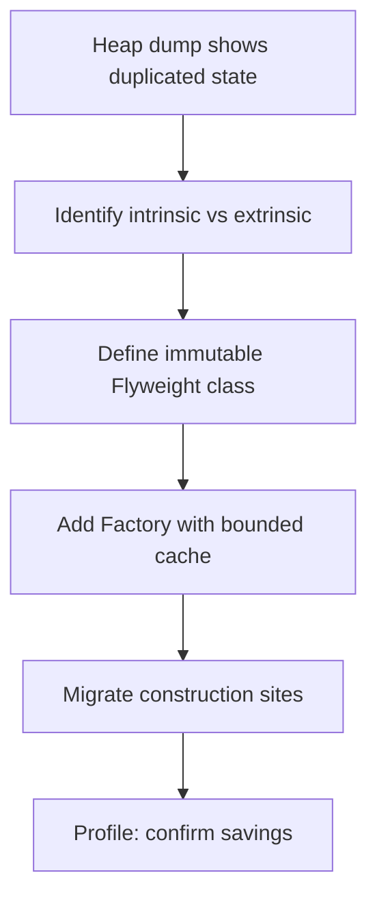
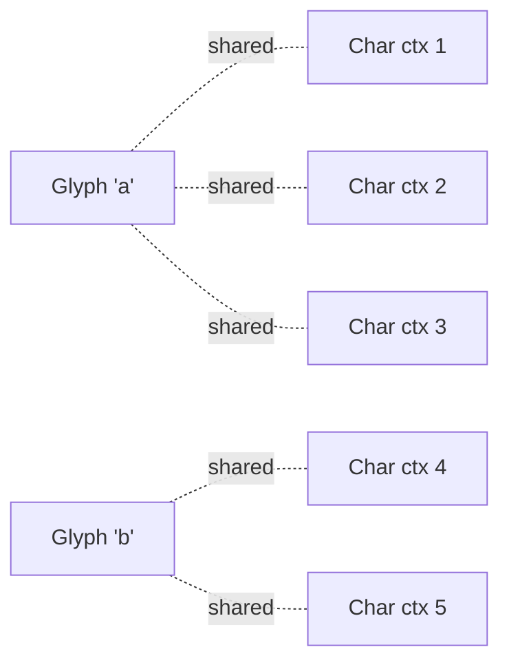
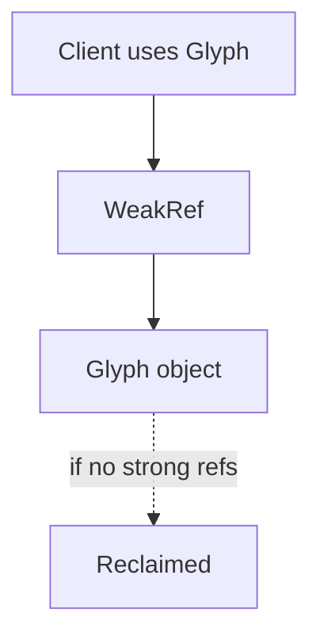

# Flyweight — Middle Level

> **Source:** [refactoring.guru/design-patterns/flyweight](https://refactoring.guru/design-patterns/flyweight)
> **Prerequisite:** [Junior](junior.md)

---

## Table of Contents

1. [Introduction](#introduction)
2. [When to Use Flyweight](#when-to-use-flyweight)
3. [When NOT to Use Flyweight](#when-not-to-use-flyweight)
4. [Real-World Cases](#real-world-cases)
5. [Code Examples — Production-Grade](#code-examples--production-grade)
6. [Bounding the Cache](#bounding-the-cache)
7. [Weak References and Cleanup](#weak-references-and-cleanup)
8. [Trade-offs](#trade-offs)
9. [Alternatives Comparison](#alternatives-comparison)
10. [Refactoring to Flyweight](#refactoring-to-flyweight)
11. [Pros & Cons (Deeper)](#pros--cons-deeper)
12. [Edge Cases](#edge-cases)
13. [Tricky Points](#tricky-points)
14. [Best Practices](#best-practices)
15. [Tasks (Practice)](#tasks-practice)
16. [Summary](#summary)
17. [Related Topics](#related-topics)
18. [Diagrams](#diagrams)

---

## Introduction

> Focus: **When to use it?** and **Why?**

You already know Flyweight is "share intrinsic state, pass extrinsic state." At the middle level the harder questions are:

- **When does Flyweight pay off, and when is it ceremony?**
- **How do I bound the cache so I don't trade one memory leak for another?**
- **What about weak references, hash distribution, and concurrency?**
- **How do I refactor a memory-heavy program into Flyweight without breaking anything?**

This document focuses on the **decisions** that turn textbook Flyweight into a production-ready optimization.

---

## When to Use Flyweight

Use Flyweight when **all** of these are true:

1. **Objects are numerous.** Tens of thousands at minimum; usually millions.
2. **Most fields overlap across instances.** A heap dump shows the same field values repeating.
3. **A natural intrinsic/extrinsic split exists.** You can identify what stays constant vs varies.
4. **Mutability isn't required for the intrinsic parts.** They can be immutable.
5. **The savings beat the complexity.** Profile *before* and *after*; calculate the win.

If even one is missing, look elsewhere first.

### Triggers

- "Heap dump shows 50M `Color` objects, but only ~200 unique values."
- "Each `Token` has the same 5 strings repeated; only its position varies."
- "Game scene has 100k trees; players' machines OOM."
- "Server caches 30M JSON-parsed objects; most have identical templates."

---

## When NOT to Use Flyweight

- **Few objects.** A handful of instances doesn't justify the indirection.
- **Mostly varying state.** If 80% of fields are unique, sharing isn't there.
- **Mutable shared state required.** Flyweight depends on immutability.
- **The "savings" are illusory.** Object headers, hash table overhead, factory cost — sometimes the pattern adds more than it saves.
- **Premature optimization.** Don't introduce Flyweight before measuring the problem.

### Smell: Flyweight cache that grows unbounded

You introduced Flyweight to save memory, but the factory's cache grows forever as new keys appear. **Bound the cache** (LRU, weak references, time-based expiration). An unbounded factory cache *adds* memory pressure.

---

## Real-World Cases

### Case 1 — Java's Integer cache

`Integer.valueOf(42)` returns a cached instance for values in [-128, 127]. Outside that range, it allocates fresh. Why this range? Empirical: most loop counters and small constants fall here. The cache is bounded by design — at most 256 instances regardless of how many times you call.

### Case 2 — String interning

`"hello".intern()` returns a canonical instance from the JVM-level string table. Every "hello" literal in code is the same object. Saves significant memory in apps with many duplicated strings (e.g., parsing JSON keys, log lines).

### Case 3 — Game forest

Open-world game with 1M trees. Each tree's mesh + texture (intrinsic) takes ~20 KB. Without Flyweight: 20 GB. With Flyweight + 5 species: 100 KB shared + (1M × 32 bytes per `TreeInstance` for position/scale) = ~32 MB. **600× memory savings.**

### Case 4 — Glyph cache in text engines

Browsers, IDEs, and PDF renderers use Flyweight for glyph rasterization. Each (font, size, character) combination is rasterized once; subsequent uses reference the bitmap. Without this, opening a 50k-word document would re-rasterize the letter 'e' 5,000 times.

### Case 5 — Particle systems

A particle effect with 50,000 sparks. Each spark has the same texture, mesh, color (intrinsic) but different position, velocity, age (extrinsic). Flyweight is the standard implementation.

### Case 6 — Token tables in NLP

A model's vocabulary is 30k unique tokens. A document with 1M words → 1M positions, 30k unique flyweights. The position-token map is small; the token strings are shared.

---

## Code Examples — Production-Grade

### Example A — Bounded LRU flyweight cache (Java)

```java
public final class GlyphFactory {
    private final int maxSize;
    private final LinkedHashMap<Key, Glyph> cache;

    public GlyphFactory(int maxSize) {
        this.maxSize = maxSize;
        this.cache = new LinkedHashMap<>(maxSize * 4 / 3, 0.75f, true) {
            @Override
            protected boolean removeEldestEntry(Map.Entry<Key, Glyph> eldest) {
                return size() > GlyphFactory.this.maxSize;
            }
        };
    }

    public synchronized Glyph get(char c, String font, int size) {
        var key = new Key(c, font, size);
        return cache.computeIfAbsent(key, k -> new Glyph(c, font, size));
    }

    record Key(char c, String font, int size) {}
}
```

LRU eviction prevents unbounded growth. For multi-threaded contexts, prefer Caffeine or Guava's `Cache` (lock-free).

### Example B — Concurrent factory (Go)

```go
type GlyphFactory struct {
    mu    sync.RWMutex
    cache map[GlyphKey]*Glyph
}

type GlyphKey struct {
    char rune
    font string
    size int
}

func (f *GlyphFactory) Get(char rune, font string, size int) *Glyph {
    key := GlyphKey{char, font, size}
    f.mu.RLock()
    if g, ok := f.cache[key]; ok {
        f.mu.RUnlock()
        return g
    }
    f.mu.RUnlock()

    f.mu.Lock()
    defer f.mu.Unlock()
    // Double-check after acquiring write lock.
    if g, ok := f.cache[key]; ok {
        return g
    }
    g := &Glyph{char: char, font: font, size: size}
    f.cache[key] = g
    return g
}
```

Read-write lock minimizes contention on the read-heavy path.

### Example C — Tree forest with Flyweight + Composite (Python)

```python
from dataclasses import dataclass
from typing import Dict


@dataclass(frozen=True)   # immutable
class TreeKind:
    """Flyweight — intrinsic."""
    species: str
    color: str
    texture: str


class TreeKindFactory:
    _cache: Dict[tuple, TreeKind] = {}

    @classmethod
    def get(cls, species: str, color: str, texture: str) -> TreeKind:
        key = (species, color, texture)
        if key not in cls._cache:
            cls._cache[key] = TreeKind(species, color, texture)
        return cls._cache[key]


class Tree:
    """Context — extrinsic + flyweight reference."""
    __slots__ = ("kind", "x", "y", "scale")

    def __init__(self, kind: TreeKind, x: float, y: float, scale: float):
        self.kind, self.x, self.y, self.scale = kind, x, y, scale


class Forest:
    def __init__(self):
        self._trees: list[Tree] = []

    def plant(self, species: str, color: str, texture: str, x: float, y: float, scale: float):
        kind = TreeKindFactory.get(species, color, texture)
        self._trees.append(Tree(kind, x, y, scale))

    def __len__(self): return len(self._trees)


forest = Forest()
for x in range(1000):
    for y in range(1000):
        forest.plant("oak", "green", "bark1", x * 5, y * 5, 1.0)

# 1M trees, 1 TreeKind shared.
print(f"trees: {len(forest)}, unique kinds: {len(TreeKindFactory._cache)}")
# trees: 1000000, unique kinds: 1
```

The forest example. With `__slots__`, Python's `Tree` is ~56 bytes; 1M trees ≈ 56 MB plus 1 shared `TreeKind`. Without Flyweight: each `Tree` would own (species, color, texture) → 3× more memory.

---

## Bounding the Cache

An unbounded factory cache turns a memory optimization into a memory leak. Strategies:

### LRU bound

When the cache exceeds size, evict least-recently-used. Good for "small working set, occasional outliers."

### Time-based expiration

Evict after N seconds. Good for "values stale over time" — but irrelevant for true Flyweight (values don't change).

### Weak references

Hold flyweights via `WeakReference` (Java), `weakref.WeakValueDictionary` (Python). When no client references a flyweight, GC reclaims it. The cache stays as small as the active working set.

### Bounded key space

If keys are known to be small (e.g., 256 colors, all lowercase ASCII), the cache is naturally bounded. Java's `Integer` cache works because the range is fixed.

---

## Weak References and Cleanup

```java
public final class WeakGlyphFactory {
    private final Map<Key, WeakReference<Glyph>> cache = new ConcurrentHashMap<>();

    public Glyph get(char c, String font, int size) {
        var key = new Key(c, font, size);
        var ref = cache.get(key);
        if (ref != null) {
            var g = ref.get();
            if (g != null) return g;
            cache.remove(key, ref);
        }
        var fresh = new Glyph(c, font, size);
        cache.put(key, new WeakReference<>(fresh));
        return fresh;
    }
}
```

Pros: cache size matches working set automatically.
Cons: GC may reclaim a flyweight you'd reuse soon — slight churn.

For Python, `weakref.WeakValueDictionary` does this automatically.

For Go, weak refs aren't built-in (Go 1.24+ added `weak.Pointer`). Until then, manual lifecycle management (e.g., explicit `Release()`).

---

## Trade-offs

| Trade-off | Pay | Get |
|---|---|---|
| Add Flyweight + Factory | More code | Fewer instances, less memory |
| Immutability | Must redesign mutable types | Safe sharing |
| Per-call extrinsic params | API gets verbose | Per-instance state stays small |
| Cache bookkeeping | Lookup cost on each access | Not allocating duplicate instances |
| Hash key design | Need to think about equality + hashing | Correct sharing |

---

## Alternatives Comparison

| Alternative | Use when | Trade-off |
|---|---|---|
| **No Flyweight** | Few objects, mostly unique state | Simpler; larger memory if scale grows |
| **String interning** | Just for strings | JVM/runtime native; no per-call factory |
| **Object Pool** | Mutable objects, lifecycle reuse | Different intent; not memory-sharing |
| **Singleton** | Truly one global instance | Different intent; no per-key sharing |
| **Compact data layout** | Numerical / fixed-size data | Don't even allocate objects (use primitive arrays) |
| **Off-heap storage** | Massive datasets | Use mmap or arenas; may displace Flyweight entirely |

---

## Refactoring to Flyweight

A common path: a heap profiler shows 30M `Token` instances dominating heap, but only 30k unique values.

### Step 1 — Confirm the savings opportunity

Heap dump → group by class → look for high count. Verify with grep / inspection that fields repeat.

### Step 2 — Identify intrinsic vs extrinsic

What field stays the same across instances of `Token`? In NLP: text, type, language. What varies? Position in source, parent reference.

### Step 3 — Define the Flyweight

`TokenKind`: only intrinsic fields. Make it immutable (record / frozen dataclass / final class).

### Step 4 — Define the Context

`TokenInstance`: extrinsic fields plus a `TokenKind` reference. Replace original `Token` usages.

### Step 5 — Add the Factory

`TokenKindFactory.get(text, type, language)` returns shared instances. Bound the cache if needed.

### Step 6 — Migrate construction

Replace `new Token(...)` with `new TokenInstance(factory.get(...), pos, parent)`.

### Step 7 — Verify the win

New heap dump. `TokenKind` count: ≤ 30k. `TokenInstance` count: ~30M. Total memory: dropped significantly.

---

## Pros & Cons (Deeper)

### Pros (revisited)

- **Massive memory savings** at scale.
- **Fewer GC roots** when flyweights live long.
- **Better cache locality** if flyweights are co-located in memory.
- **Enables previously impossible scales** (1M trees, 50k particles).

### Cons (revisited)

- **Code complexity** — split, factory, immutability discipline.
- **Cache management** — bounded? Weak? When to evict?
- **Concurrency** — factory needs thread-safety.
- **Equality / identity** — sharing means `==` is true for "same intrinsic"; surprising for some.
- **Profiling required** — cannot guess the win; must measure.

---

## Edge Cases

### 1. Hash collisions in the factory

If your `Key` has a poor `hashCode` / `__hash__`, the factory's hashmap degrades. Verify `Key` distributes well. Java records and frozen dataclasses generate decent default hash; custom keys need attention.

### 2. Flyweight that holds a reference

If a flyweight holds a reference to another object (e.g., a font loader), that reference is shared. Make sure the held object is itself thread-safe and immutable (or shareable).

### 3. Equality semantics

Clients used to `tokenA.equals(tokenB)` checking value equality. With Flyweight, `tokenA == tokenB` is true when they share. This is an *upgrade* (cheap identity check) but may surprise readers who assumed `equals` was needed.

### 4. Factory across process boundaries

In a distributed system, two processes have separate factories. They produce *different* `Token` instances for the same key. Sharing breaks at the boundary. Consider serialization carefully.

### 5. Cache pressure under load

Sudden burst of unique keys can pump the cache to its limit. LRU evicts; the next request re-allocates. If the burst recurs frequently, the cache misses constantly. Measure miss rate; size the cache to the working set.

### 6. Subclass overhead

If your flyweight is a class with subclasses, the factory must handle each subclass appropriately. Often simpler: one `Glyph` class with a discriminator field.

---

## Tricky Points

- **Flyweight isn't always memory savings.** If your "intrinsic" state is small (a few primitives), the object header overhead might exceed the benefit. Measure.
- **Identity-based testing is a feature.** Once flyweights are shared, `a == b` ⇔ "same intrinsic state." Tests can use this for fast equality checks.
- **The factory is a global by nature.** That's fine for Flyweight (the data is the same anyway), but be aware that test isolation may need to clear the factory between tests.
- **Mutability in the *context* is fine.** Only the *flyweight* must be immutable. The context (with extrinsic state) can mutate freely.

---

## Best Practices

1. **Profile first.** Don't apply without measuring.
2. **Make flyweights immutable.** Final fields, no setters, frozen.
3. **Use a factory always.** Direct construction defeats sharing.
4. **Bound the cache** for high-cardinality keys.
5. **Make the Key hashable and equal-by-value.** Use records / dataclasses where available.
6. **Concurrent-safe factory.** `ConcurrentHashMap`, `sync.Map`, or RWLock.
7. **Test sharing.** A test that calls `factory.get(...)` twice and asserts identity confirms the design.
8. **Document intrinsic/extrinsic split.** A class doc that says "extrinsic: position, scale" guides future contributors.

---

## Tasks (Practice)

1. Take a class with 1M instances and a heap profiler showing field duplication. Identify intrinsic; extract a flyweight.
2. Build a bounded LRU `GlyphFactory`. Test that it evicts the right entry.
3. Implement a weak-reference factory. Verify GC reclaims flyweights when no clients reference them.
4. Compare memory before/after Flyweight on a synthetic workload (1M tokens, 30k unique). Show the savings.
5. Build a thread-safe factory. Stress-test with concurrent goroutines/threads; assert no duplicate instances.

---

## Summary

- Use Flyweight when objects are numerous, fields overlap heavily, mutability isn't required, and savings beat complexity.
- Don't use it for small object counts or mostly-unique state.
- Bound the cache; consider weak references for working-set sizing.
- The factory is critical: route all construction through it.
- Profile before and after — savings should be measured, not assumed.

---

## Related Topics

- **Next:** [Senior Level](senior.md) — JVM string table, `Integer.valueOf`, profiling, distributed flyweight.
- **Compared with:** Object Pool, Singleton, String interning.
- **Often combined with:** Composite (shared leaves), Factory (gateway).

---

## Diagrams

### Refactoring path



### Shared flyweight



### Weak-ref factory



---

[← Back to Flyweight folder](.) · [↑ Structural Patterns](../README.md) · [↑↑ Roadmap Home](../../../README.md)

**Next:** [Flyweight — Senior Level](senior.md)
