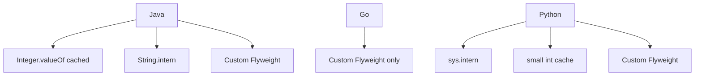

# Flyweight — Professional Level

> **Source:** [refactoring.guru/design-patterns/flyweight](https://refactoring.guru/design-patterns/flyweight)
> **Prerequisite:** [Senior](senior.md)

---

## Table of Contents

1. [Introduction](#introduction)
2. [Object Header Cost](#object-header-cost)
3. [JVM: String Interning Internals](#jvm-string-interning-internals)
4. [JVM: `Integer.valueOf` Cache](#jvm-integervalueof-cache)
5. [Go: Memory Layout and Sharing](#go-memory-layout-and-sharing)
6. [CPython: `sys.intern` and Object Headers](#cpython-sysintern-and-object-headers)
7. [Cache-Friendly Layout](#cache-friendly-layout)
8. [Allocation Profiling](#allocation-profiling)
9. [Microbenchmark Anatomy](#microbenchmark-anatomy)
10. [Cross-Language Comparison](#cross-language-comparison)
11. [Off-Heap and Beyond](#off-heap-and-beyond)
12. [Diagrams](#diagrams)
13. [Related Topics](#related-topics)

---

## Introduction

A Flyweight at the professional level is examined for what it costs and what it saves at the runtime level: object headers, hash table overhead, GC behavior, cache lines, and the runtime-provided flyweight features (string interning, integer cache).

This is where "saves memory" becomes a quantitative claim, not a hope.

---

## Object Header Cost

Why Flyweight matters: even a "tiny" object isn't free.

| Runtime | Object header | Reference size |
|---|---|---|
| **JVM (compressed OOPs, default)** | 12 bytes | 4 bytes |
| **JVM (uncompressed, large heap)** | 16 bytes | 8 bytes |
| **Go** | 0 bytes (struct) | 8 bytes |
| **CPython** | 16 bytes (`PyObject` base) + 8 (refcount) + 8 (type ptr) | 8 bytes |

A Java `Glyph` with one `char` field:
- Header: 12 bytes.
- char: 2 bytes.
- Padding to align to 8: 2 bytes.
- Total: ~16 bytes.

For *one million* such objects: 16 MB just for the objects, before any data. With Flyweight, that becomes ~16 bytes for one shared instance + 4 bytes per reference × 1M = ~4 MB. **75% memory savings** purely from sharing — and that's a tiny example.

CPython per-object overhead is so high (~150-200 bytes minimum for a class instance) that Flyweight is dramatic. `__slots__` reduces this somewhat.

---

## JVM: String Interning Internals

`String.intern()` puts a string in the JVM's *string table* (a hash table managed by the runtime). Subsequent calls with equal content return the canonical instance.

```java
String a = "hello".intern();
String b = "hello".intern();
assert a == b;   // identity equality
```

Implementation detail: the string table is a fixed-size hash table (default ~60k buckets in modern JVMs; configurable with `-XX:StringTableSize=N`). Hash collisions degrade performance.

### When to use `intern()`

- When you have many duplicate strings as keys in long-lived caches (e.g., parsing JSON keys).
- When string equality checks are hot (`==` on interned strings is one CPU cycle).

### When NOT to use

- Unbounded key spaces (string table fills, performance degrades).
- Short-lived strings (the table doesn't free entries on GC).

Modern JVMs (8+) collect interned strings in the young generation if unreachable elsewhere, but the table itself doesn't shrink. Be cautious.

---

## JVM: `Integer.valueOf` Cache

```java
Integer a = Integer.valueOf(42);
Integer b = Integer.valueOf(42);
assert a == b;   // true — cached

Integer c = Integer.valueOf(200);
Integer d = Integer.valueOf(200);
assert c == d;   // false — outside cache range
```

The cache range defaults to [-128, 127] but can be expanded with `-XX:AutoBoxCacheMax=N`. Used implicitly by autoboxing:

```java
Integer x = 42;          // calls Integer.valueOf(42) — cached
Integer y = 1000;        // calls Integer.valueOf(1000) — fresh
```

This is JVM-level Flyweight: most autoboxed loop counters and small enum-like ints are shared.

---

## Go: Memory Layout and Sharing

Go structs have no header. Two Go programs constructing identical structs allocate two separate instances (no automatic sharing). Flyweight in Go is opt-in: build a factory.

### sync.Pool vs Flyweight

`sync.Pool` reuses object instances (often mutable, with reset). Different from Flyweight (which shares immutable instances).

### Cache locality

Go's flat structs (no header, no padding for type) are cache-friendly when stored in slices. A slice of `*Tree` (pointers to flyweights) chases pointers; a slice of `Tree` (copies) is cache-friendly but defeats Flyweight savings.

For *true* large-scale instancing, store extrinsic state in an array of structs and reference flyweights by index:

```go
type Forest struct {
    species []TreeKind          // flyweight registry
    trees   []TreeInstance      // contiguous, cache-friendly
}

type TreeInstance struct {
    speciesIdx int     // index into species slice
    x, y       float32
    scale      float32
}
```

24 bytes per `TreeInstance`; cache-friendly iteration; flyweight shared by index.

---

## CPython: `sys.intern` and Object Headers

CPython interns short strings automatically (literals, identifier-like strings). For longer strings or runtime-generated keys, use `sys.intern`:

```python
import sys
a = sys.intern(some_runtime_key)
b = sys.intern(other_runtime_key)
if a is b:   # identity check, fast
    ...
```

CPython doesn't auto-intern integers like the JVM does. Small integers (-5 to 256) are pre-allocated as flyweights by CPython internals — but custom classes don't get this treatment.

`__slots__` reduces per-instance memory by 50-100 bytes (no `__dict__`):

```python
class Glyph:
    __slots__ = ("char", "font", "size")
```

For Flyweight, `__slots__` + immutability + factory is the standard combination.

---

## Cache-Friendly Layout

Flyweight saves memory; how that memory is laid out matters for performance.

### Pointer indirection

A `Tree` holding a pointer to its `TreeKind` flyweight introduces one pointer chase per access. For 1M trees iterated per frame: 1M pointer chases — typically OK if `TreeKind`s are small and hot in L1/L2.

### Index-based vs pointer-based

Storing an integer index instead of a pointer (8 bytes → 4 bytes per reference) saves memory and may improve cache density. The factory is then an array, not a hash table.

```go
type Tree struct {
    speciesIdx uint16   // 2 bytes; supports 65k species
    x, y       float32
    scale      float32
}
// Total: 14 bytes; pads to 16
```

### Co-locating flyweights

Allocating all flyweights together (arena) keeps them in one cache region. Subsequent random access is more likely to hit L2/L3.

---

## Allocation Profiling

Before/after measurements are the only honest way to evaluate Flyweight.

### JVM (JFR / async-profiler)

```bash
java -XX:+FlightRecorder -XX:StartFlightRecording=filename=app.jfr,duration=60s ...
```

Open in JMC; look at "Allocation in TLAB" and "Allocation outside TLAB" by class. Counts of `Glyph` should drop after Flyweight applies.

### Go (pprof)

```bash
go test -bench=. -memprofile=mem.out
go tool pprof -alloc_objects mem.out
```

`alloc_objects` shows total allocations. After Flyweight, the count drops; total memory drops too.

### CPython (tracemalloc)

```python
import tracemalloc
tracemalloc.start()
# ... workload ...
snapshot = tracemalloc.take_snapshot()
top_stats = snapshot.statistics("lineno")
for stat in top_stats[:10]:
    print(stat)
```

Counts allocations by line. Lines that *no longer* allocate (because the factory returned a cached instance) shrink.

---

## Microbenchmark Anatomy

### Java JMH

```java
@State(Scope.Benchmark)
public class FlyweightBench {

    GlyphFactory factory = new GlyphFactory();

    @Benchmark public Glyph hot() {
        return factory.get('e', "Arial", 12);   // hot key
    }

    @Benchmark public Glyph fresh() {
        return new Glyph('e', "Arial", 12);     // baseline alloc
    }
}
```

Expected: `hot` lookup ~30-100 ns (hash map). `fresh` allocation ~20-50 ns (TLAB-bumped). Without TLAB, allocation can be slower; with sharing, lookup might lose for tiny objects. **Measure your case.**

### Go

```go
func BenchmarkFactoryGet(b *testing.B) {
    f := &GlyphFactory{cache: map[GlyphKey]*Glyph{}}
    for i := 0; i < b.N; i++ {
        _ = f.Get('e', "Arial", 12)
    }
}

func BenchmarkAllocFresh(b *testing.B) {
    for i := 0; i < b.N; i++ {
        _ = &Glyph{char: 'e', font: "Arial", size: 12}
    }
}
```

Expected: factory ~50 ns (lock + map). Allocation ~30 ns. The savings come from *not* allocating millions of times, not from a single faster get.

### Python

```python
import timeit
print(timeit.timeit("factory.get('e', 'Arial', 12)", setup="...", number=10_000_000))
print(timeit.timeit("Glyph('e', 'Arial', 12)", setup="...", number=10_000_000))
```

Expected: factory ~150 ns. Allocation ~500 ns (Python objects are heavy). Flyweight wins at 3-4× per-call in Python.

---

## Cross-Language Comparison

| Concern | Java (HotSpot) | Go | Python (3.11+) |
|---|---|---|---|
| **Per-instance overhead** | ~16 bytes (header + fields) | 0 bytes header + fields | ~150-200 bytes minimum |
| **Allocation cost** | ~20 ns (TLAB) | ~30 ns | ~500 ns |
| **Factory `get` cost** | ~50 ns (CHM) | ~50 ns (RWLock + map) | ~150 ns (dict) |
| **Memory savings ratio** | 4-10× | 2-3× | 5-10× |
| **Built-in flyweights** | Integer cache, String table | None automatic | sys.intern, small ints |

Python and Java benefit most from explicit Flyweight; Go's flat structs reduce the natural overhead but Flyweight still helps for very large counts.

---

## Off-Heap and Beyond

For *truly* extreme memory: don't allocate Java/Go/Python objects at all.

- **Off-heap (mmap, Chronicle Map, Apache Arrow)** — flyweights live in a memory-mapped buffer. References are offsets. The runtime sees no objects.
- **Compact data layout** — store extrinsic state in primitive arrays (parallel arrays / struct-of-arrays). No object overhead at all.
- **GPU-side** — game engines push flyweight data to VRAM; per-instance to a vertex buffer. Rendering accesses both via shaders.

These cross from Flyweight pattern into systems engineering. The intent (share identical state) is the same; the implementation operates outside the language's object model.

---

## Diagrams

### Java memory layout

```
Per Glyph (without Flyweight):
  +----------+----------+
  | header12 | char2 +pad |  ~ 16 bytes × 1M = 16 MB
  +----------+----------+

With Flyweight (1 shared Glyph):
  16 bytes + 4 bytes × 1M references = ~ 4 MB
```

### CPU cache behavior

```
Without Flyweight:
  [Obj1] [Obj2] [Obj3] ... 1M objects scattered
  Each access can miss cache.

With Flyweight:
  [Shared Glyph 'e']  ← hot in L1/L2
       referenced from 5000 contexts
```

### Built-in vs explicit flyweight



---

## Related Topics

- **JVM internals:** Aleksey Shipilëv — "JVM Anatomy Park" series; `String.intern` performance studies.
- **Go memory layout:** `unsafe.Sizeof`; `pprof` allocation analysis.
- **CPython:** `__slots__`; `sys.intern`; small integer cache; tracemalloc.
- **Off-heap:** Chronicle Map, Apache Arrow, mmap-based data structures.
- **Profiling:** JFR + JMC, async-profiler, pprof, tracemalloc.
- **Next:** [Interview](interview.md), [Tasks](tasks.md), [Find the Bug](find-bug.md), [Optimize](optimize.md).

---

[← Back to Flyweight folder](.) · [↑ Structural Patterns](../README.md) · [↑↑ Roadmap Home](../../../README.md)

**Next:** [Flyweight — Interview Preparation](interview.md)
