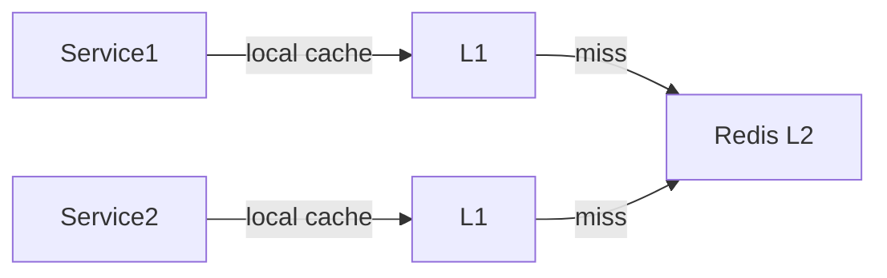

# Flyweight — Senior Level

> **Source:** [refactoring.guru/design-patterns/flyweight](https://refactoring.guru/design-patterns/flyweight)
> **Prerequisite:** [Middle](middle.md)

---

## Table of Contents

1. [Introduction](#introduction)
2. [Flyweight at Architectural Scale](#flyweight-at-architectural-scale)
3. [Performance Considerations](#performance-considerations)
4. [Concurrency Deep Dive](#concurrency-deep-dive)
5. [Testability Strategies](#testability-strategies)
6. [When Flyweight Becomes a Problem](#when-flyweight-becomes-a-problem)
7. [Code Examples — Advanced](#code-examples--advanced)
8. [Real-World Architectures](#real-world-architectures)
9. [Pros & Cons at Scale](#pros--cons-at-scale)
10. [Trade-off Analysis Matrix](#trade-off-analysis-matrix)
11. [Migration Patterns](#migration-patterns)
12. [Diagrams](#diagrams)
13. [Related Topics](#related-topics)

---

## Introduction

> Focus: **At scale, what breaks? What earns its keep?**

In toy code Flyweight is "share Glyphs." In production it's "1M trees in a game scene," "30M tokens in a parsed corpus," "string interning in a long-running JVM." The senior question isn't "do I write Flyweight?" — it's **"is the savings real, the cache stable, the concurrency safe, and the API still ergonomic?"**

At scale, Flyweight intersects with:

- **JIT and runtime caches** — `Integer.valueOf`, `String.intern`, runtime auto-flyweighting.
- **Memory profilers** — heap dump analysis, allocation hotspot identification.
- **Off-heap storage** — when even shared instances aren't compact enough.
- **Distributed caches** — Flyweight can extend beyond a single process.

---

## Flyweight at Architectural Scale

### 1. Game engines

Open-world games store millions of "static" objects (trees, rocks, buildings). Each has shared mesh + texture + material. Engine APIs (Unity's `MaterialPropertyBlock`, Unreal's `InstancedStaticMeshComponent`) expose Flyweight directly: "instance these N entities with shared mesh, varying transforms."

Modern engines push this further with **GPU-driven instancing**: shared mesh data sits in VRAM; per-instance data (transform, color tint) fits in a small array. The Flyweight pattern at the API; instancing at the GPU.

### 2. NLP / tokenization pipelines

A 1B-document corpus shares a vocabulary of ~50k tokens. Rather than store each token's text per occurrence, store the index. The lookup table is shared across the entire corpus.

This is conceptually `vocab[i]` Flyweight: vocab table holds shared strings, document positions hold integer indices.

### 3. Database row storage

Columnar databases (Parquet, ClickHouse) use *dictionary encoding*: low-cardinality columns store a dictionary + indexed values. Flyweight at the storage layer.

### 4. Event sourcing / audit logs

Events have a *type* (intrinsic: schema, version, name) and per-event data (extrinsic: actor, timestamp, payload). Sharing the type metadata across millions of events is Flyweight.

### 5. JVM internals

`String.intern()` and `Integer.valueOf` are JVM-implemented Flyweights. Bytes in the JVM string table are shared across the running JVM. `Boolean.TRUE` and `Boolean.FALSE` are flyweights for primitives.

---

## Performance Considerations

### Lookup cost

A factory `get(key)` is a hash table lookup: O(1) average, but with measurable overhead (~50-100 ns for a `ConcurrentHashMap` lookup in Java). For *hot* paths producing millions of objects per second, the lookup itself can dominate.

Mitigations:
- Cache the flyweight at the construction site (don't look up in inner loops).
- Use a faster hash (perfect hash for known small key spaces).
- Inline the hash check via specialization (e.g., for ASCII glyphs, use an array indexed by char code instead of a hash map).

### Allocation savings

The point of Flyweight: skip allocations of the intrinsic part. Each saved allocation is ~20-50 bytes (Java) / ~30 bytes (Go) / ~150 bytes (Python). At 10M skipped allocations: hundreds of MB of memory and reduced GC pressure.

### CPU cache locality

If flyweights are co-located in memory (e.g., allocated together), accessing them from many contexts is cache-friendly. The opposite — flyweights scattered across the heap — kills locality. Arena allocators help.

### When the lookup is *more* expensive than the allocation

Rare, but possible. If your "intrinsic" state is two ints and the factory is a `ConcurrentHashMap`, a fresh allocation might be cheaper than the lookup. Profile.

---

## Concurrency Deep Dive

### Read-heavy access pattern

Flyweight workloads are read-mostly: lookups dominate, new keys are rare. Optimize for reads.

Java: `ConcurrentHashMap` (lock-free reads). Go: `sync.Map` (similar). Python: GIL gives implicit thread-safety on `dict` but doesn't scale.

### Cache-line sharing

If flyweights are mutated (don't!) or hot fields are written by some path, false sharing can hurt. Pad hot fields, separate by cache line. Rare in Flyweight (where intrinsic is immutable) but real if you bolt mutable counters/metrics onto the flyweight class.

### Factory lock contention

A naïve factory uses `synchronized` everywhere. Under high concurrency, threads queue waiting for the lock — defeating the purpose. Use lock-free maps (`ConcurrentHashMap.computeIfAbsent`, `sync.Map`).

### Concurrent insertion races

Two threads compute `get('e', Arial, 12)` simultaneously, both miss, both create a `Glyph`. Without a check-then-set guard, you've allocated twice (still correct, but wastes the savings momentarily). Use `computeIfAbsent` (Java) or double-check (Go).

---

## Testability Strategies

### Sharing is a fact

Tests can assert sharing: `factory.get(k) == factory.get(k)`. Identity is the test for correct flyweight behavior.

### Memory regression tests

After applying Flyweight, write a benchmark that measures heap usage. CI fails if memory exceeds threshold. Catches regressions where someone bypasses the factory.

### Cache eviction tests

For LRU/weak caches, test that evicted entries can be re-fetched (re-create on demand). Test that under memory pressure, weak refs are reclaimed and re-allocation happens.

### Concurrency tests

Stress-test the factory under contention. Verify: no duplicate instances per key, no exceptions, no deadlocks. Race detector (Go: `-race`) catches issues automatically.

### Benchmark with realistic workloads

Synthetic benchmarks (one shared key, 1M lookups) lie. Use realistic key distributions (Zipf for word frequencies, etc.) to measure cache hit rate.

---

## When Flyweight Becomes a Problem

### Symptom 1 — Cache grows unbounded

A new factor in the key (timestamp, user ID, request ID) introduces effectively-unique keys. Every lookup misses; the cache fills up. **Fix:** review keys; ensure they're truly intrinsic (low cardinality).

### Symptom 2 — Lookup dominates the profile

Profile shows 30% of time in `factory.get`. **Fix:** cache the result in callers; consider specialized lookup (array index) for hot keys.

### Symptom 3 — Lock contention

Concurrent stress reveals the factory's lock as the hot spot. **Fix:** lock-free map; consider partitioning the cache.

### Symptom 4 — Mutability creep

Someone added a setter to the flyweight class. Tests start failing intermittently. **Fix:** lock down the class — final + no setters; review every PR that touches it.

### Symptom 5 — "Saved memory" was illusory

After Flyweight, total memory is the same or higher. Cache table overhead + key objects + factory state outweighs savings. **Fix:** profile with and without; if the win isn't real, remove the abstraction.

### Symptom 6 — Test isolation broken

Static factory cache leaks state between tests. Test order changes results. **Fix:** clear factory in `@BeforeEach` / `setUp` / fixture; or use instance-based factory injected per test.

---

## Code Examples — Advanced

### Lock-free factory with Caffeine (Java)

```java
import com.github.benmanes.caffeine.cache.*;

public final class GlyphFactory {
    private static final LoadingCache<GlyphKey, Glyph> cache =
        Caffeine.newBuilder()
            .maximumSize(10_000)
            .recordStats()
            .build(key -> new Glyph(key.character(), key.font(), key.size()));

    public static Glyph get(char c, String font, int size) {
        return cache.get(new GlyphKey(c, font, size));
    }

    public record GlyphKey(char character, String font, int size) {}
}
```

Caffeine handles concurrency, eviction, stats, and weak references with a clean API.

### Specialized array-backed flyweight (Java)

```java
public final class AsciiGlyphFactory {
    private static final Glyph[] CACHE_ARIAL_12 = new Glyph[128];

    static {
        for (int c = 0; c < 128; c++) {
            CACHE_ARIAL_12[c] = new Glyph((char) c, "Arial", 12);
        }
    }

    public static Glyph get(char c, String font, int size) {
        if (font.equals("Arial") && size == 12 && c < 128) {
            return CACHE_ARIAL_12[c];
        }
        return GlyphFactory.get(c, font, size);   // fall back to general factory
    }
}
```

For the dominant case (ASCII Arial 12), an array index is faster than a hash lookup. Falls back gracefully.

### Distributed flyweight (Redis-backed)

```python
import redis, json


class RemoteFlyweightFactory:
    def __init__(self, redis_url: str, prefix: str):
        self._r = redis.from_url(redis_url)
        self._prefix = prefix
        self._local: dict = {}

    def get(self, key: tuple) -> dict:
        if key in self._local:
            return self._local[key]
        rkey = f"{self._prefix}:{':'.join(str(p) for p in key)}"
        data = self._r.get(rkey)
        if data is not None:
            obj = json.loads(data)
            self._local[key] = obj
            return obj
        # Cache miss everywhere; create and store.
        obj = self._build(key)
        self._r.set(rkey, json.dumps(obj))
        self._local[key] = obj
        return obj

    def _build(self, key: tuple) -> dict:
        # Build the flyweight payload from the key.
        return {"intrinsic": list(key)}
```

Distributed caches make sense for templates / shared metadata across services. Local L1 + remote L2 is the common pattern.

### Off-heap storage (sketch)

For *truly* extreme memory: don't even allocate Java/Python objects. Store flyweights in a memory-mapped file or off-heap arena (Chronicle Map, Apache Arrow). The "object" becomes an offset; access goes through a view. Outside scope of pure Flyweight, but the same idea — share state, minimize per-instance overhead.

---

## Real-World Architectures

### A — Unreal Engine instanced static meshes

A single mesh + material is referenced by N transforms. The engine batches them into one GPU draw call. Same idea as Flyweight; happens at the GPU layer.

### B — ClickHouse dictionary columns

A `LowCardinality(String)` column stores a dictionary of unique values + indexes per row. For columns with high duplication (country, status, category), this is Flyweight at the column-store layer.

### C — JVM string table

`String.intern()` puts strings into a global table (shared across the entire JVM). `String.intern()` returns the canonical instance. Useful for keys in long-lived caches; risky if the key space is unbounded (string table fills up; minor GC pressure).

### D — Web browsers

Browsers use Flyweight for CSS computed styles. Many DOM elements share the same computed style; the browser computes once, references many. Critical for rendering 100k-element pages.

### E — NLP token tables

GPT-style models tokenize input. The vocabulary (50k tokens) is loaded once; sequences of integer IDs reference it. The model's internal embedding lookup is conceptually Flyweight (shared embedding vector per token ID).

---

## Pros & Cons at Scale

### Pros (at scale)

- **Memory savings** that enable previously impossible scales.
- **Reduced GC pressure** (fewer objects → fewer collections, shorter pauses).
- **Better cache locality** when flyweights cluster in memory.
- **Identity-based equality** is fast and meaningful.
- **Testability**: identity assertions are simple and powerful.

### Cons (at scale)

- **Cache management complexity.** Bounded? Weak? Distributed? Each adds operational burden.
- **Lookup overhead.** ~50-100 ns per get; not free.
- **Concurrency design.** Read-heavy workload demands lock-free maps.
- **Mutability discipline.** A single mutable field defeats the pattern.
- **Diagnostic complexity.** "Where did this flyweight come from?" — every reference looks the same.

---

## Trade-off Analysis Matrix

| Concern | No Flyweight | Plain Flyweight | LRU-bounded | Weak-ref | Distributed |
|---|---|---|---|---|---|
| **Memory at scale** | Highest | Lowest | Bounded | Working set | Shared across processes |
| **Lookup cost** | None (alloc) | Hash get | Hash + LRU bookkeeping | Hash + ref check | Network round-trip |
| **Concurrency** | Trivial | Lock-free map | Lock-free map | More complex | Distributed coordination |
| **Cache leak risk** | None | Real | Bounded | None | Service-side |
| **Suitable for** | Few objects | Bounded keys | Mixed cardinality | Variable working set | Cross-service sharing |

---

## Migration Patterns

### Pattern 1 — From OOM crash to Flyweight

Production OOM. Heap dump shows 30M `Token` instances. Apply Flyweight; ship; verify memory drops by 80%.

### Pattern 2 — Lazy retrofit

Add Flyweight without modifying call sites. The factory transparently shares; new construction goes through it. Old call sites that bypass: lint or migrate one by one.

### Pattern 3 — Adding bounding

Initial Flyweight had unbounded cache. Add LRU bound; configure size based on observed working set. Verify no spike in re-allocation.

### Pattern 4 — From in-process to distributed

Single-process Flyweight scaled out: now multiple services share metadata. Wrap with a Redis-backed cache; local cache as L1, distributed as L2.

### Pattern 5 — Flyweight as instancing API

For game engines / VFX, flatten Flyweight + Composite into an instancing API: `renderer.drawInstanced(mesh, transforms[])`. The pattern dissolves into a vectorized call.

---

## Diagrams

### Memory layout

```
Heap:
  ┌────────────────────────┐
  │ Glyph 'e' Arial 12     │  ← 1 instance
  └────────────────────────┘
       ▲ ▲ ▲ ▲ ▲ (referenced from 5,000 places)

  ┌────────────────────────┐
  │ Glyph ' ' Arial 12     │  ← 1 instance
  └────────────────────────┘
       ▲ ▲ ▲ ▲ ▲ (referenced from 8,000 places)
```

### Distributed flyweight (L1+L2)



### Specialized vs general factory

```mermaid
flowchart TD
    Caller --> Specialized{is in fast path?}
    Specialized -->|yes| ArrayLookup[O(1) array index]
    Specialized -->|no| HashFactory[ConcurrentHashMap.get]
```

---

## Related Topics

- **Patterns combined:** Composite (shared leaves), Factory (gateway), Object Pool (often confused).
- **Runtime / language features:** `Integer.valueOf`, `String.intern`, Python `sys.intern`, JS `Symbol.for`.
- **Memory tools:** Java VisualVM, JFR; Go pprof; Python `tracemalloc`, `objgraph`; heap-dump analyzers.
- **Adjacent disciplines:** Dictionary encoding, instanced rendering, embedding lookups.
- **Next:** [Professional Level](professional.md) — JVM string table internals, allocation cost, micro-benchmarks.

---

[← Back to Flyweight folder](.) · [↑ Structural Patterns](../README.md) · [↑↑ Roadmap Home](../../../README.md)

**Next:** [Flyweight — Professional Level](professional.md)
