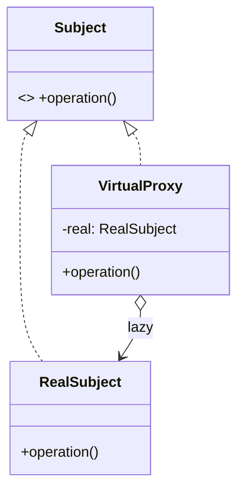
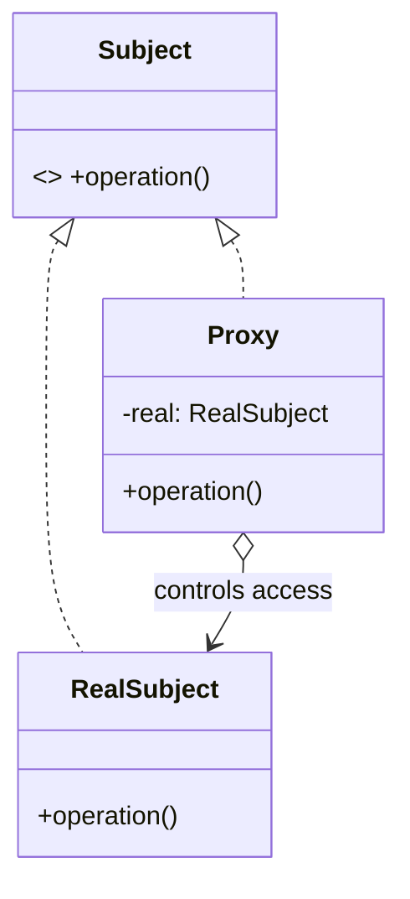
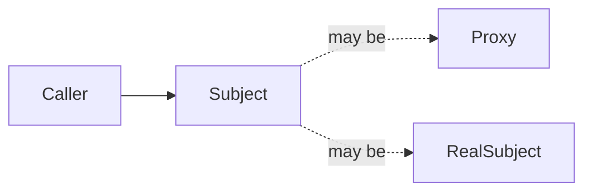

# Proxy — Junior Level

> **Source:** [refactoring.guru/design-patterns/proxy](https://refactoring.guru/design-patterns/proxy)
> **Category:** [Structural](../README.md) — *"Explain how to assemble objects and classes into larger structures, while keeping these structures flexible and efficient."*

---

## Table of Contents

1. [Introduction](#introduction)
2. [Prerequisites](#prerequisites)
3. [Glossary](#glossary)
4. [Core Concepts](#core-concepts)
5. [Real-World Analogies](#real-world-analogies)
6. [Mental Models](#mental-models)
7. [Pros & Cons](#pros--cons)
8. [Use Cases](#use-cases)
9. [Code Examples](#code-examples)
10. [Coding Patterns](#coding-patterns)
11. [Clean Code](#clean-code)
12. [Best Practices](#best-practices)
13. [Edge Cases & Pitfalls](#edge-cases--pitfalls)
14. [Common Mistakes](#common-mistakes)
15. [Tricky Points](#tricky-points)
16. [Test Yourself](#test-yourself)
17. [Tricky Questions](#tricky-questions)
18. [Cheat Sheet](#cheat-sheet)
19. [Summary](#summary)
20. [What You Can Build](#what-you-can-build)
21. [Further Reading](#further-reading)
22. [Related Topics](#related-topics)
23. [Diagrams & Visual Aids](#diagrams--visual-aids)

---

## Introduction

> Focus: **What is it?** and **How to use it?**

**Proxy** is a structural design pattern that provides a **substitute or placeholder** for another object. The proxy **controls access** to the real object — it can decide *whether*, *when*, and *how* the real object handles a request.

Imagine you have a heavy object — a 4K video file, an HTTP service, a database connection. Loading it eagerly costs RAM, network, and time. A proxy lets you act *as if* you have the real object, while quietly:
- Constructing it lazily on first use.
- Caching results so repeated calls are fast.
- Checking permissions before forwarding.
- Logging every call for audit.
- Sending the call across the network as if it were local.

In one sentence: *"Stand in for the real object so you can intercept access to it."*

Proxy is the duct tape of indirection. You use it constantly — JDK dynamic proxies, ORM lazy loading, RPC stubs, smart pointers, virtual filesystems — but most engineers don't name the pattern explicitly.

---

## Prerequisites

What you should know before reading this:

- **Required:** Basic OOP — interfaces, classes, polymorphism.
- **Required:** Composition. The proxy holds a reference to the real subject.
- **Helpful:** Some experience with lazy initialization or caching — they're proxy use cases.
- **Helpful:** A taste of authorization or middleware — also proxy use cases.

---

## Glossary

| Term | Definition |
|------|-----------|
| **Subject** | The interface that both the proxy and the real subject implement. |
| **RealSubject** | The actual object doing the work. |
| **Proxy** | The placeholder. Implements the same interface; forwards (or short-circuits) to RealSubject. |
| **Virtual Proxy** | Defers RealSubject construction until first access (lazy loading). |
| **Protection Proxy** | Checks permissions before forwarding. |
| **Caching Proxy** | Stores results of expensive calls. |
| **Remote Proxy** | Stands in for a RealSubject in another process / machine. |
| **Smart Proxy** | Adds bookkeeping (refcount, locking) around access. |

---

## Core Concepts

### 1. Same Interface

The proxy implements the **same interface** as the RealSubject. Callers interact with both identically — the proxy is interchangeable.

```java
Service s = new RealService();
Service p = new ServiceProxy(realService);
// Both can be passed wherever a Service is expected.
```

### 2. Hold a Reference (or Build One)

The proxy holds — or knows how to build — a reference to the RealSubject. Forwarding usually goes through this reference.

### 3. Control Access

This is the proxy's job: decide whether the RealSubject is invoked, with what arguments, and what to do with the result. The proxy can:
- Forward as-is (transparent proxy).
- Block the call (protection / circuit breaker).
- Substitute a cached result.
- Modify the call (encryption, compression).
- Defer construction (virtual proxy).

### 4. Distinct Intent from Decorator

Both wrap an object with the same interface. **Decorator** adds *behavior* (logging, retry, metrics). **Proxy** adds *control* (lazy init, caching, security, remote access). The line is blurry; the *intent* clarifies which name to use.

---

## Real-World Analogies

| Concept | Analogy |
|---------|--------|
| **Virtual Proxy** | Movie posters in a cinema — you see the title and showtime; the actual movie file isn't loaded until you buy a ticket. |
| **Protection Proxy** | A bouncer at a club — same interface as the door (you walk through), but checks your ID first. |
| **Caching Proxy** | A receipt cache — "you ordered this same coffee 5 minutes ago; here's a copy." |
| **Remote Proxy** | A diplomatic envoy — stands in for the head of state in another country. |
| **Smart Proxy** | A library checkout desk — looks like the book is in your hands, but the system tracks who borrowed it. |

The classical refactoring.guru analogy is a **credit card**: it stands in for cash. The merchant interacts with the card the same way they would with cash, but the card adds protection (PIN), authorization, fraud detection, and the actual money transfer happens elsewhere.

---

## Mental Models

**The intuition:** Picture a security guard between you and a building. The guard wears the same uniform as someone inside (same interface), but their job is to *gate* access — check ID, log who entered, sometimes refuse entry. To you, the guard *is* the door; to the building, the guard is the gatekeeper.

**Why this model helps:** It makes the "control" aspect explicit. Decorator is "I add stuff"; Proxy is "I decide if you get in."

**Visualization:**

```
       Caller
          │
          ▼
   ┌────────────┐
   │   Proxy    │  ← intercepts call
   │ (Subject)  │
   └─────┬──────┘
         │ may or may not forward
         ▼
   ┌────────────┐
   │RealSubject │  ← does the actual work
   │ (Subject)  │
   └────────────┘
```

---

## Pros & Cons

| Pros | Cons |
|------|------|
| Controls access without changing the RealSubject | One more class for every proxied object |
| Enables lazy init, caching, security, remote calls | Indirection makes stack traces longer |
| Open/Closed: add a proxy without modifying RealSubject | Easy to confuse with Decorator (different intent) |
| Makes RealSubject substitutable for tests | Per-call overhead (lookup + dispatch) |
| Can be auto-generated (dynamic proxies, mocking frameworks) | Proxy can become a god class if it does too much |

### When to use:
- The RealSubject is expensive to create — defer it
- You need to log/audit every call to a service
- You need to check permissions before forwarding
- You're calling something across a network (RPC) and want it to look local
- You need to cache deterministic responses

### When NOT to use:
- The behavior you want is "add features", not "control access" — that's Decorator
- The RealSubject is cheap to construct and always needed — no proxy benefit
- You'd be writing 12 layers of proxies for one call — review architecture
- You're using a proxy to hide a bug (e.g., catching all exceptions silently)

---

## Use Cases

Real-world places where Proxy is commonly applied:

- **ORM lazy loading** — Hibernate's lazy-loaded entities, Django's `lazy()` querysets, SQLAlchemy's `lazyload`
- **RPC client stubs** — gRPC client, Java RMI, COM/CORBA
- **HTTP clients** — `requests.Session`, AWS SDK clients (proxies for remote services)
- **Spring AOP / @Cacheable / @Secured** — generated proxies that intercept method calls
- **Mocking libraries** — Mockito, jMock create dynamic proxies for tests
- **Smart pointers** (C++) — `unique_ptr`, `shared_ptr` are proxies for raw pointers
- **Reverse proxies** (nginx, HAProxy) — networking proxies for HTTP
- **Virtual filesystems** — FUSE, archive mounts
- **Lazy iterators** — Python generators, Java `Stream`

---

## Code Examples

### Go

A virtual proxy: load an image only when first viewed.

```go
package main

import "fmt"

// Subject.
type Image interface {
	Display()
}

// RealSubject.
type RealImage struct{ filename string }

func NewRealImage(filename string) *RealImage {
	fmt.Printf("loading %s from disk...\n", filename)
	return &RealImage{filename: filename}
}

func (r *RealImage) Display() {
	fmt.Printf("displaying %s\n", r.filename)
}

// Proxy.
type ImageProxy struct {
	filename string
	real     *RealImage   // lazy: created on first Display
}

func (p *ImageProxy) Display() {
	if p.real == nil {
		p.real = NewRealImage(p.filename)
	}
	p.real.Display()
}

func main() {
	var img Image = &ImageProxy{filename: "huge.png"}
	fmt.Println("proxy created (no load yet)")
	img.Display()    // loads + displays
	img.Display()    // displays (already loaded)
}
```

**What it does:** The proxy looks like an `Image` to the caller, but defers loading the file until `Display()` is first called.

**How to run:** `go run main.go`

---

### Java

A protection proxy: check permission before forwarding.

```java
public interface Document {
    String content();
    void update(String text);
}

public final class RealDocument implements Document {
    private String text;
    public RealDocument(String text) { this.text = text; }
    public String content() { return text; }
    public void update(String text) { this.text = text; }
}

public final class ProtectionProxy implements Document {
    private final Document inner;
    private final User user;

    public ProtectionProxy(Document inner, User user) {
        this.inner = inner;
        this.user = user;
    }

    public String content() { return inner.content(); }   // anyone can read

    public void update(String text) {
        if (!user.hasRole("editor")) {
            throw new SecurityException("not an editor");
        }
        inner.update(text);
    }
}

public class Demo {
    public static void main(String[] args) {
        Document doc = new RealDocument("hello");
        Document protectedDoc = new ProtectionProxy(doc, User.with("alice", "viewer"));
        System.out.println(protectedDoc.content());     // ok
        try {
            protectedDoc.update("evil");                // SecurityException
        } catch (SecurityException e) {
            System.out.println("denied: " + e.getMessage());
        }
    }
}
```

**What it does:** Reads pass through; writes require the editor role.

**How to run:** `javac *.java && java Demo`

> **Note:** Spring's `@PreAuthorize` works exactly like this — generates a protection proxy at runtime.

---

### Python

A caching proxy: cache results of expensive calls.

```python
import time
from typing import Callable


class WeatherService:
    """RealSubject."""
    def get_temperature(self, city: str) -> float:
        # Expensive: simulates an API call.
        time.sleep(1.0)
        return 22.5


class CachingWeatherProxy:
    """Caching Proxy."""
    def __init__(self, inner: WeatherService, ttl_seconds: float = 60):
        self._inner = inner
        self._ttl = ttl_seconds
        self._cache: dict[str, tuple[float, float]] = {}   # city -> (temp, expires_at)

    def get_temperature(self, city: str) -> float:
        now = time.monotonic()
        if city in self._cache:
            temp, expires = self._cache[city]
            if now < expires:
                return temp
        temp = self._inner.get_temperature(city)
        self._cache[city] = (temp, now + self._ttl)
        return temp


if __name__ == "__main__":
    proxy = CachingWeatherProxy(WeatherService(), ttl_seconds=10)
    t0 = time.time()
    proxy.get_temperature("Tashkent")   # 1 second (cache miss)
    proxy.get_temperature("Tashkent")   # ~0 (cache hit)
    print(f"elapsed: {time.time() - t0:.2f}s")
```

**What it does:** First call hits the real service; subsequent calls within TTL hit the cache.

**How to run:** `python3 main.py`

---

## Coding Patterns

### Pattern 1: Virtual Proxy (Lazy Init)

**Intent:** Defer expensive RealSubject construction until first use.



**When:** Loading a 4K texture, opening a DB connection, instantiating a heavy object.

---

### Pattern 2: Protection Proxy

**Intent:** Check permissions before forwarding.

```python
def update(self, text):
    if not self._user.can_edit:
        raise PermissionError()
    self._inner.update(text)
```

**When:** Authorization layers, role-based access, feature flags.

---

### Pattern 3: Caching Proxy

**Intent:** Memoize results of deterministic, expensive calls.

```go
func (p *CachingProxy) Get(key string) (Value, error) {
    if v, ok := p.cache[key]; ok { return v, nil }
    v, err := p.inner.Get(key)
    if err == nil { p.cache[key] = v }
    return v, err
}
```

**When:** Repeated reads with the same input, DB lookups, computed properties.

---

### Pattern 4: Remote Proxy

**Intent:** Make a remote object look local. The proxy serializes calls into network requests.

```java
public class RemoteUserService implements UserService {
    public User getUser(String id) {
        var resp = httpClient.get("/users/" + id);
        return parseUser(resp.body());
    }
}
```

**When:** RPC clients, gRPC stubs, AWS SDK clients.

---

### Pattern 5: Smart Reference

**Intent:** Track usage, manage lifecycle, lock around access.

```cpp
class SharedPtr<T> {
    T* raw;
    Refcount* count;
    // increments count on copy, decrements on dtor; deletes when zero.
};
```

**When:** Memory management (C++), reference counting, lock proxies.

---

## Clean Code

### Naming

The convention is `<Subject>Proxy` or task-named (`CachedUserService`, `LazyDocument`).

```java
// ❌ Bad — generic
public class Wrapper implements UserService { ... }
public class Helper implements UserService { ... }

// ✅ Clean
public class CachedUserService implements UserService { ... }
public class UserServiceProxy implements UserService { ... }
```

### Don't expose internal state

```java
// ❌ Caller can bypass the proxy
public RealSubject getReal() { return real; }

// ✅ Encapsulated
private final RealSubject real;
```

---

## Best Practices

1. **Decide intent first.** Are you adding behavior (Decorator) or controlling access (Proxy)? Name the class for the intent.
2. **Keep the proxy thin.** Caching logic, lazy init, permission checks — that's it. No business logic.
3. **Inject the RealSubject** via constructor; don't construct it inside (unless lazy init is the point).
4. **Match the interface exactly.** Same methods, same exceptions, same semantics — except where access control adds them.
5. **Document the proxy's behavior.** "This caches for 60 seconds" / "this requires `editor` role" — readers shouldn't guess.
6. **For lazy proxies, make initialization thread-safe.** Multiple threads calling `display()` simultaneously could trigger duplicate construction.

---

## Edge Cases & Pitfalls

- **Thread safety in virtual proxies.** Two threads see `real == null`; both construct. Use double-checked locking or `sync.Once` (Go).
- **Cache invalidation in caching proxies.** When does the cached value go stale? TTL? Manual invalidation? Document.
- **Exception semantics.** A protection proxy throws `SecurityException` where the real subject doesn't. Document; design for it.
- **Reference equality.** `proxy.equals(real)` may be false even though they're "the same logical thing." Don't rely on identity.
- **Serialization.** A proxy may not serialize the same way as RealSubject; if it serializes the proxy class, you may break compatibility.
- **Reflection access.** Calling `proxy.getClass()` returns the proxy class, not the real one. Frameworks doing class-based dispatch can be surprised.

---

## Common Mistakes

1. **Confusing Proxy with Decorator.**

   ```java
   // This is Decorator (adds logging behavior), not Proxy.
   public class LoggingService implements Service {
       public Result call(Request r) {
           log.info("calling");
           Result res = inner.call(r);
           log.info("done");
           return res;
       }
   }
   ```
   "Logging" is *behavior*; the call always forwards. Proxy *controls* — it might not forward.

2. **Putting business logic in a proxy.**

   ```java
   // ❌ Tax computation is business logic; doesn't belong in a "proxy".
   public class OrderProxy implements OrderService {
       public Order place(Cart c) {
           if (c.country == "US") c.applyUsTax();
           return inner.place(c);
       }
   }
   ```

3. **Non-thread-safe virtual proxy.**

   ```java
   // ❌ Race condition: two threads can both see real == null.
   public Image display() {
       if (real == null) real = new RealImage(...);
       return real.display();
   }
   ```

4. **Caching proxy with no invalidation.** Stale data forever; eventually wrong answers.

5. **Returning a proxy when callers expected RealSubject.** If callers cast or rely on identity, the proxy breaks them.

---

## Tricky Points

- **Proxy vs Decorator.** Both wrap with the same interface. Proxy *controls access*; Decorator *adds behavior*. Spring's `@Cacheable` is technically a proxy (controls whether the inner call happens); a logging wrapper is a decorator.
- **Proxy vs Adapter.** Adapter changes the interface (different signatures). Proxy preserves it.
- **Proxy vs Facade.** Facade simplifies a *subsystem* (many classes); Proxy stands in for a *single object*.
- **Dynamic vs static proxies.** Static proxies are hand-written classes. Dynamic proxies are runtime-generated (JDK Proxy, cglib, Python `__getattr__`). Same intent; different mechanics.
- **Smart pointers and refcount.** C++ smart pointers are proxies for memory; their `operator->` is the proxy interface.

---

## Test Yourself

1. What problem does Proxy solve?
2. What's the difference between Proxy and Decorator?
3. Name three concrete kinds of Proxy.
4. Why does the proxy implement the same interface as RealSubject?
5. When would a virtual proxy beat constructing the RealSubject directly?
6. Give an example from real software.
7. When should you NOT use Proxy?

<details><summary>Answers</summary>

1. Controls access to a RealSubject — lazy init, caching, security, remote, smart references.
2. Decorator *adds behavior*; Proxy *controls access* (decides whether/when/how the inner is called). Same shape; different intent.
3. Virtual (lazy), Protection (security), Caching, Remote, Smart Reference.
4. So callers can use the proxy interchangeably with RealSubject — polymorphism keeps the API uniform.
5. When RealSubject is expensive to construct and not always used — defer the cost.
6. Hibernate lazy entities, gRPC client stubs, JDK dynamic proxies, Spring `@Cacheable`, Mockito mocks.
7. When the behavior is "add features" (Decorator), when no access control is needed, when you'd write 12 layers, or when you'd hide bugs.

</details>

---

## Tricky Questions

> **"Isn't Proxy just Decorator with a fancy name?"**

Same shape, different intent. A Decorator that logs every call always forwards — its job is to add behavior. A Caching Proxy might *not* call the inner at all (cache hit) — its job is to control whether the call happens. The distinction matters in code review and naming.

> **"Spring's @Cacheable — is that Proxy or Decorator?"**

Proxy. The annotation generates a runtime proxy that decides — based on the cache state — whether to forward to your real method. If the cache hits, the real method isn't called. That's "controlling access," not "adding behavior."

> **"What's a 'transparent proxy'?"**

One that always forwards without modification. From the caller's perspective, it's invisible. Used for instrumentation that doesn't change behavior — but at that point, the line with Decorator is fuzzy.

---

## Cheat Sheet

```go
// GO
type Subject interface { Op() Result }

type Real struct{}
func (r *Real) Op() Result { ... }

type Proxy struct{ inner Subject }
func (p *Proxy) Op() Result {
    // before: lazy init, check, cache lookup
    return p.inner.Op()
    // after: cache store, log
}
```

```java
// JAVA
interface Subject { Result op(); }
class Real implements Subject { public Result op() { ... } }
class Proxy implements Subject {
    private final Subject inner;
    public Proxy(Subject inner) { this.inner = inner; }
    public Result op() {
        // control: maybe forward, maybe not
        return inner.op();
    }
}
```

```python
# PYTHON
class Real:
    def op(self): return ...

class Proxy:
    def __init__(self, inner): self._inner = inner
    def op(self):
        # control
        return self._inner.op()
```

---

## Summary

- **Proxy** = same interface, controls access to a RealSubject.
- Five common kinds: **Virtual**, **Protection**, **Caching**, **Remote**, **Smart Reference**.
- Differs from Decorator by *intent*: control vs add-behavior.
- Use for: lazy loading, security, caching, RPC, lifecycle management.
- Keep proxies thin; one concern per proxy.

If you find yourself thinking "I want to intercept access to this object without changing it," Proxy is the pattern.

---

## What You Can Build

- **Virtual image loader** — proxy that loads images on first display.
- **Protection wrapper** — role-based wrapper around a `Document`.
- **Caching service** — TTL-based cache for an HTTP client.
- **Mock RPC stub** — local stand-in for a remote service in tests.
- **Smart logger** — wraps a logger; rate-limits to N messages/sec.

---

## Further Reading

- **refactoring.guru source page:** [refactoring.guru/design-patterns/proxy](https://refactoring.guru/design-patterns/proxy)
- **GoF book:** *Design Patterns*, p. 207 (Proxy)
- **JDK dynamic proxy:** `java.lang.reflect.Proxy` documentation.
- **Spring AOP / `@Cacheable`:** Spring docs.
- **Hibernate lazy loading:** ORM proxy pattern in production.

---

## Related Topics

- **Next level:** [Proxy — Middle Level](middle.md) — production patterns, dynamic proxies, performance.
- **Compared with:** [Decorator](../04-decorator/junior.md), [Adapter](../01-adapter/junior.md), [Facade](../05-facade/junior.md).
- **Architectural cousins:** AOP, RPC, ORM lazy loading, service mesh.

---

## Diagrams & Visual Aids

### Class diagram



### Caller's view (proxy is invisible)



### Lazy load sequence

```mermaid
sequenceDiagram
    participant C as Caller
    participant P as Proxy
    participant R as RealSubject

    C->>P: operation()
    Note over P: real == null; create
    P->>R: new RealSubject()
    R-->>P: real
    P->>R: real.operation()
    R-->>P: result
    P-->>C: result

    C->>P: operation() again
    Note over P: real != null; reuse
    P->>R: real.operation()
    R-->>P: result
    P-->>C: result
```

---

[← Back to Proxy folder](.) · [↑ Structural Patterns](../README.md) · [↑↑ Roadmap Home](../../../README.md)

**Next:** [Proxy — Middle Level](middle.md)
