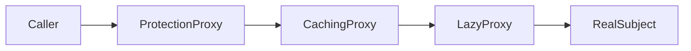
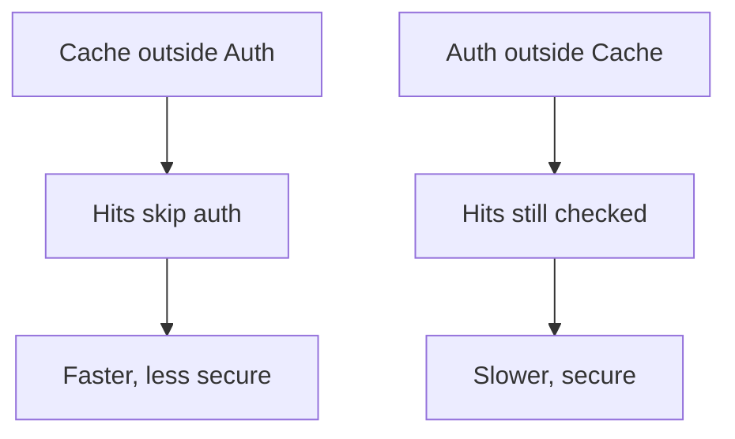
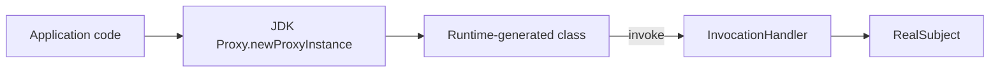

# Proxy — Middle Level

> **Source:** [refactoring.guru/design-patterns/proxy](https://refactoring.guru/design-patterns/proxy)
> **Prerequisite:** [Junior](junior.md)

---

## Table of Contents

1. [Introduction](#introduction)
2. [When to Use Proxy](#when-to-use-proxy)
3. [When NOT to Use Proxy](#when-not-to-use-proxy)
4. [Real-World Cases](#real-world-cases)
5. [Code Examples — Production-Grade](#code-examples--production-grade)
6. [Dynamic Proxies](#dynamic-proxies)
7. [Combining Proxy Types](#combining-proxy-types)
8. [Trade-offs](#trade-offs)
9. [Alternatives Comparison](#alternatives-comparison)
10. [Refactoring to Proxy](#refactoring-to-proxy)
11. [Pros & Cons (Deeper)](#pros--cons-deeper)
12. [Edge Cases](#edge-cases)
13. [Tricky Points](#tricky-points)
14. [Best Practices](#best-practices)
15. [Tasks (Practice)](#tasks-practice)
16. [Summary](#summary)
17. [Related Topics](#related-topics)
18. [Diagrams](#diagrams)

---

## Introduction

> Focus: **When to use it?** and **Why?**

You already know Proxy is "stand-in that controls access." At the middle level the harder questions are:

- **When does each kind (virtual, protection, caching, remote) earn its keep?**
- **How do I choose between Proxy and Decorator?**
- **Static or dynamic proxy?**
- **What about combining several proxy concerns into one stack?**

This document focuses on **decisions and patterns** that turn textbook Proxy into something that survives a year of production.

---

## When to Use Proxy

Use Proxy when **all** of these are true:

1. **You need to *control* access to an object.** Lazy init, caching, security, RPC, lifecycle.
2. **The interface should stay identical.** Callers shouldn't notice the proxy.
3. **The control logic doesn't belong in the RealSubject.** It's a cross-cutting concern.
4. **You want polymorphic substitution.** Tests / dev / prod can use different implementations behind the same interface.
5. **The proxy is the right name for the intent.** If you're "adding behavior", say Decorator.

If even one is missing, look elsewhere first.

### Triggers

- "This object takes 500 ms to construct; we don't always need it." → Virtual Proxy.
- "This call is expensive; results don't change for 60 seconds." → Caching Proxy.
- "Only admins can call this method." → Protection Proxy.
- "This service runs in another data center." → Remote Proxy.
- "We need to track every access to this resource for audit." → Smart Reference Proxy.

---

## When NOT to Use Proxy

- **You want to add behavior, not control access.** That's Decorator.
- **You'd be writing 5 stacked proxies for one call.** Review architecture; consider AOP or fewer concerns.
- **The RealSubject is cheap and always needed.** Virtual proxy is overhead.
- **The cache TTL is so short it's never useful.** Stateful proxies that don't pay off.
- **You're hiding bugs.** A proxy that swallows all errors silently is a bug factory.

### Smell: proxy with too many responsibilities

Your `UserServiceProxy` does lazy init, caching, retry, logging, metrics, and authorization. **Split.** Each concern in its own class. Either: a stack of single-purpose proxies/decorators, or AOP.

---

## Real-World Cases

### Case 1 — ORM lazy loading

Hibernate generates proxy entities. `user.getOrders()` triggers a SQL query the first time; subsequent calls hit the loaded list. The proxy looks like the real entity but defers the database hit.

Common gotcha: lazy loading outside the session = `LazyInitializationException`. The proxy can only fetch when the session is open.

### Case 2 — gRPC client stubs

```
ClientStub.PlaceOrder(request) → serializes → HTTP/2 → server → returns
```

The stub is a remote proxy. Generated from `.proto` files. Calls look local; the network hop is invisible.

### Case 3 — Spring `@Cacheable`

```java
@Cacheable("users")
public User findById(String id) { ... }
```

Spring wraps the bean in a proxy that consults a cache before calling the method. Cache hit → no method invocation. Cache miss → method runs, result cached.

### Case 4 — JDK dynamic proxy in mocking

Mockito generates a dynamic proxy for the interface. `mock.method()` records the call; doesn't run the real method. Same mechanism as `@Cacheable`; different intent.

### Case 5 — Smart pointers (C++)

`std::unique_ptr<T>` proxies access to a raw `T*`. `unique_ptr.get()` returns the raw pointer; `unique_ptr->method()` forwards. The proxy manages lifetime: destructor frees the memory automatically.

### Case 6 — HTTP reverse proxy

nginx in front of a backend: same HTTP interface; nginx adds TLS, caching, rate limiting, routing. The pattern is Proxy at network scale.

---

## Code Examples — Production-Grade

### Example A — Thread-safe virtual proxy (Java)

```java
public final class LazyServiceProxy implements Service {
    private volatile Service real;          // volatile for safe publication
    private final Object lock = new Object();
    private final Supplier<Service> supplier;

    public LazyServiceProxy(Supplier<Service> supplier) {
        this.supplier = supplier;
    }

    private Service real() {
        Service r = real;
        if (r == null) {
            synchronized (lock) {
                r = real;
                if (r == null) {
                    r = supplier.get();
                    real = r;
                }
            }
        }
        return r;
    }

    @Override
    public Result call(Request req) {
        return real().call(req);
    }
}
```

Double-checked locking with `volatile` for thread-safe lazy initialization.

### Example B — Caching proxy with TTL (Go)

```go
type CachingService struct {
    inner Service
    ttl   time.Duration
    mu    sync.RWMutex
    cache map[string]cacheEntry
}

type cacheEntry struct {
    value     Result
    expiresAt time.Time
}

func (c *CachingService) Call(ctx context.Context, key string) (Result, error) {
    c.mu.RLock()
    entry, ok := c.cache[key]
    c.mu.RUnlock()
    if ok && time.Now().Before(entry.expiresAt) {
        return entry.value, nil
    }

    res, err := c.inner.Call(ctx, key)
    if err != nil { return Result{}, err }

    c.mu.Lock()
    c.cache[key] = cacheEntry{res, time.Now().Add(c.ttl)}
    c.mu.Unlock()
    return res, nil
}
```

RW lock optimizes for cache hits; bounded TTL keeps stale entries out.

### Example C — Protection proxy with role-based access (Python)

```python
class ProtectionProxy:
    def __init__(self, real, user, required_role: str):
        self._real = real
        self._user = user
        self._required = required_role

    def __getattr__(self, name):
        attr = getattr(self._real, name)
        if not callable(attr):
            return attr
        def wrapped(*args, **kwargs):
            if self._required not in self._user.roles:
                raise PermissionError(f"need role {self._required!r}")
            return attr(*args, **kwargs)
        return wrapped


# Usage:
real = AdminAPI(...)
proxy = ProtectionProxy(real, user=current_user, required_role="admin")
proxy.delete_user("alice")   # raises if user lacks admin
```

`__getattr__` makes Python proxies trivial. Each method call is intercepted.

### Example D — Remote proxy (gRPC-style)

```python
class RemoteUserService:
    """Stand-in for a UserService running on another machine."""
    def __init__(self, host: str):
        self._channel = grpc.insecure_channel(host)
        self._stub = UserServiceStub(self._channel)

    def get_user(self, id: str) -> User:
        req = GetUserRequest(id=id)
        try:
            resp = self._stub.GetUser(req, timeout=2.0)
            return User(id=resp.id, name=resp.name)
        except grpc.RpcError as e:
            raise UserServiceError(str(e)) from e
```

Translates calls into RPC; translates errors into domain exceptions.

---

## Dynamic Proxies

A *static* proxy is hand-written: one class, one interface. A *dynamic* proxy is generated at runtime — the proxy class doesn't exist at compile time.

### Java JDK dynamic proxy

```java
public class LoggingHandler implements InvocationHandler {
    private final Object real;
    public LoggingHandler(Object real) { this.real = real; }

    @Override
    public Object invoke(Object proxy, Method method, Object[] args) throws Throwable {
        System.out.println("calling " + method.getName());
        return method.invoke(real, args);
    }
}

UserService realSvc = new RealUserService();
UserService proxy = (UserService) Proxy.newProxyInstance(
    UserService.class.getClassLoader(),
    new Class<?>[]{UserService.class},
    new LoggingHandler(realSvc));

proxy.getUser("alice");   // logs and forwards
```

The JDK generates a class implementing `UserService` whose every method goes through `invoke()`.

### Limitations

- Only works for **interfaces** (not concrete classes). For classes, use cglib or Byte Buddy (Spring uses cglib internally).
- Reflection has a per-call cost (~30-50 ns); typically negligible but real.
- Generated class doesn't appear in source — debugging requires understanding.

### Spring AOP

Spring picks JDK Proxy for interfaces and cglib for concrete classes. Annotations like `@Transactional`, `@Cacheable` declare the desired wrapping; Spring builds the proxy.

### Python's `__getattr__`

Python's dynamic proxy is simpler — `__getattr__` is invoked for any unfound attribute access. Mockito-equivalent libraries (`unittest.mock`) use this.

---

## Combining Proxy Types

Real systems often combine concerns:

```java
Service svc =
    new MetricsProxy(
        new LoggingProxy(
            new CachingProxy(
                new ProtectionProxy(
                    new LazyProxy(() -> new RealService(config))
                )
            )
        )
    );
```

Each proxy is one concern. Order matters:
- Protection outside caching: every call checks auth (cache hits still authorized).
- Caching outside protection: cache hits skip auth (faster but possibly insecure).

Pick deliberately and document. (Note: many of these would be Decorators by strict definition; in practice the names are used loosely.)

---

## Trade-offs

| Trade-off | Pay | Get |
|---|---|---|
| Add a proxy class | One extra file, one indirection | Lazy / cached / secured / remote without changing real subject |
| Polymorphism preserved | Need same interface | Substitutable in tests, dev, prod |
| Per-call overhead | Method dispatch + check | Memoized / authorized / lazy result |
| Static or dynamic | Static = simple, dynamic = flexible | Less hand-written code (dynamic) |
| Lifecycle / state | Need thread-safety, eviction | Performance / control benefits |

---

## Alternatives Comparison

| Alternative | Use when | Trade-off |
|---|---|---|
| **Decorator** | Adding behavior, not controlling access | Different intent; same shape |
| **Adapter** | Interface needs change | Different intent |
| **AOP** | Cross-cutting concerns at scale | Magic; harder to debug |
| **Inheritance with hooks** | Behavior is universal | Less flexible than per-instance proxy |
| **Direct implementation** | No control needed | No proxy benefit |
| **Strategy** | Pluggable algorithm, not access control | Different intent |

---

## Refactoring to Proxy

A common path: a class accumulates lazy init / caching / auth checks inside its primary methods. Refactor:

### Step 1 — Identify the access concerns

What can be removed without changing the *primary* behavior? Lazy init, caching, security, remote calls — typical candidates.

### Step 2 — Extract one proxy

Move one concern into a wrapper class implementing the same interface.

### Step 3 — Wire it at construction

```java
service = new CachingProxy(new RealService());
```

### Step 4 — Verify behavior

Tests should pass. The proxy is transparent.

### Step 5 — Repeat for other concerns

Each concern → its own proxy. The base class shrinks.

### Step 6 — Lock the boundary

Lint or document: "use the proxy chain via factory, not the real subject directly."

---

## Pros & Cons (Deeper)

### Pros (revisited)

- **Independent concern.** Each proxy does one thing.
- **Composition over modification.** RealSubject doesn't know it's being proxied.
- **Run-time configuration.** Different proxy stacks per env.
- **Test substitution.** Mock the interface, not the proxy chain.
- **Lifecycle management.** Lazy init, refcount, lock acquisition.

### Cons (revisited)

- **Indirection in stack traces.** Each layer adds a frame.
- **Confusion with Decorator.** Names get used loosely.
- **Per-call overhead.** Dispatch + check; usually negligible.
- **Identity confusion.** `proxy.equals(real)` is false.
- **Reflection-based proxies (Java).** Performance and debugging cost.

---

## Edge Cases

### 1. Thread-safe lazy init

Two threads see `real == null`; both construct. Use double-checked locking, `sync.Once` (Go), or `Lazy<T>` (.NET).

### 2. Cache stampede

100 threads simultaneously miss the cache; 100 trigger the real call. Use single-flight (Go's `singleflight.Group`), Caffeine's `getAll`, or a lock keyed by request.

### 3. Cache invalidation

When does cached data go stale? TTL? Manual `evict()`? Event-driven? Pick and document.

### 4. Stale data after RealSubject mutation

If RealSubject changes (write) but the cache caches reads, the cache is now wrong. Either invalidate on writes (proxy intercepts both) or accept eventual consistency.

### 5. Equality / identity

`proxy.equals(real)` is false. If callers compare or use as map keys, this breaks. Override `equals`/`hashCode` if equivalence-by-content matters.

### 6. Async / coroutines

A caching proxy in async code must `await` properly. Mixing sync and async wrappers breaks subtly.

### 7. Reflection

`real.getClass()` returns the proxy class, not the wrapped class. Frameworks doing reflection-based dispatch can be surprised.

---

## Tricky Points

- **Proxy vs Decorator (again).** Same shape; different intent. In code review, ask: "does this layer *control* whether the inner runs, or *add behavior* around it?"
- **Spring's `@Transactional`** is a proxy — it controls whether/how the method runs (begins/commits transaction, rolls back on exception).
- **Self-invocation in Spring AOP** doesn't trigger the proxy. Calling `this.someMethod()` from inside the same bean bypasses the proxy. Annoying but well-known.
- **Security proxies aren't security itself.** Defense in depth — also enforce permissions in the RealSubject when stakes are high.

---

## Best Practices

1. **Decide intent first.** Decorator or Proxy. Name accordingly.
2. **One concern per proxy.** Composition handles combinations.
3. **Inject the RealSubject** via constructor.
4. **Match the interface exactly** (and exception types).
5. **Document caching/lifetime semantics.** TTL, invalidation, thread-safety.
6. **Make state thread-safe** if shared.
7. **Test the proxy independently** with a mock RealSubject.
8. **Profile dynamic proxy overhead** in hot paths.

---

## Tasks (Practice)

1. Build a thread-safe virtual proxy that loads an image lazily; stress-test with multiple threads.
2. Build a caching proxy with TTL; test cache hits, misses, and expiration.
3. Build a protection proxy enforcing a role; test allowed and denied paths.
4. Use Java's `Proxy.newProxyInstance` to build a logging proxy without writing a class.
5. Refactor a class with embedded lazy init + caching into two stacked proxies.

---

## Summary

- Use Proxy when access control is the intent (lazy, cache, security, remote, lifecycle).
- Don't use it for adding behavior (Decorator) or interface change (Adapter).
- One concern per proxy; compose for multi-concern stacks.
- Static for clarity, dynamic for flexibility (Spring AOP, mocking).
- Watch for thread-safety, cache invalidation, identity confusion.

---

## Related Topics

- **Next:** [Senior Level](senior.md) — RPC, AOP, distributed proxies.
- **Compared with:** [Decorator](../04-decorator/junior.md), [Adapter](../01-adapter/junior.md), [Facade](../05-facade/junior.md).
- **Architectural cousins:** AOP, RPC, ORM lazy loading, service mesh.

---

## Diagrams

### Proxy stack



### Order matters



### Dynamic proxy generation



---

[← Back to Proxy folder](.) · [↑ Structural Patterns](../README.md) · [↑↑ Roadmap Home](../../../README.md)

**Next:** [Proxy — Senior Level](senior.md)
