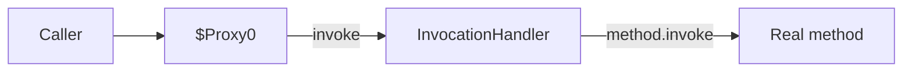

# Proxy — Professional Level

> **Source:** [refactoring.guru/design-patterns/proxy](https://refactoring.guru/design-patterns/proxy)
> **Prerequisite:** [Senior](senior.md)

---

## Table of Contents

1. [Introduction](#introduction)
2. [Static Proxy: JIT Inlining](#static-proxy-jit-inlining)
3. [JDK Dynamic Proxy Internals](#jdk-dynamic-proxy-internals)
4. [Cglib and Byte Buddy](#cglib-and-byte-buddy)
5. [AspectJ vs Spring AOP](#aspectj-vs-spring-aop)
6. [Go Proxies and Allocations](#go-proxies-and-allocations)
7. [Python `__getattr__` Cost](#python-__getattr__-cost)
8. [Thread Safety in Lazy Proxies](#thread-safety-in-lazy-proxies)
9. [Microbenchmark Anatomy](#microbenchmark-anatomy)
10. [Cross-Language Comparison](#cross-language-comparison)
11. [Distributed Proxy Latency](#distributed-proxy-latency)
12. [Diagrams](#diagrams)
13. [Related Topics](#related-topics)

---

## Introduction

A Proxy at the professional level is examined for what the runtime makes of it: how the JIT inlines static proxies, how dynamic proxy mechanisms work and what they cost, and where the inevitable performance cliffs are.

For high-throughput services with heavy AOP, the proxy machinery itself can be measurable. This document quantifies it.

---

## Static Proxy: JIT Inlining

A hand-written static proxy is just a class implementing the same interface. JVM HotSpot can inline its method body when:
- The proxy class is known (monomorphic call site).
- The body is small.

After warmup, a `service.call(req)` through a logging proxy can be inlined to:

```
inlined: log.info("calling")
inlined: real.call(req)
inlined: log.info("done")
```

Zero proxy overhead. This is the baseline expectation for static proxies in Java/Scala.

`final` classes and sealed types help; megamorphic call sites (multiple proxy types at one site) defeat the inline cache.

---

## JDK Dynamic Proxy Internals

`Proxy.newProxyInstance(loader, interfaces, handler)` generates a class:

```
public final class $Proxy0 extends Proxy implements UserService {
    public User getUser(String id) {
        return (User) h.invoke(this, m_getUser, new Object[]{id});
    }
    // ... other methods similarly ...
}
```

Each method:
1. Boxes args into `Object[]`.
2. Calls `InvocationHandler.invoke`.
3. The handler typically uses reflection (`method.invoke(real, args)`) to call the real method.

### Cost breakdown

- **Method dispatch:** ~5 ns (interface call).
- **Object[] allocation:** ~10-20 ns.
- **Boxing primitives:** ~5-10 ns each (cached for small ints; allocated otherwise).
- **`Method.invoke`:** ~30-50 ns (reflection).
- **Total:** ~50-100 ns per call.

For request-scoped code: invisible. For inner loops: measurable.

### Limitations

- Only works for **interfaces**. Concrete classes need cglib.
- The generated class lives in the system class loader; not accessible by reflection in some sandboxed environments.

---

## Cglib and Byte Buddy

Cglib generates a *subclass* of the target (concrete class supported). Byte Buddy is a more modern alternative.

```
public class RealService$$EnhancerByCGLIB extends RealService {
    public User getUser(String id) {
        // intercept: callback.intercept(this, method, args, methodProxy)
    }
}
```

Cost similar to JDK Proxy (~50-100 ns), but slightly faster on common paths because the framework caches `MethodProxy` (avoiding reflection).

### Spring's choice

Spring AOP uses JDK Proxy when the target implements an interface, cglib when the target is a concrete class. Spring 5+ defaults to cglib; same overhead.

### Byte Buddy

Used by Mockito, Hibernate. More flexible than cglib (supports newer JVM features, modular system). Same general performance class.

---

## AspectJ vs Spring AOP

| Aspect | Spring AOP (proxy-based) | AspectJ (weaving) |
|---|---|---|
| **Mechanism** | Runtime dynamic proxy | Bytecode weaving (compile-time or load-time) |
| **Per-call cost** | ~50-100 ns | ~1-5 ns (inlined like normal code) |
| **Self-invocation** | Doesn't trigger proxy | Triggers normally |
| **Setup complexity** | Annotation-driven | Build-time / load-time agent |
| **Debuggability** | Generated proxy class in stack | Modified bytecode |

**Use AspectJ when:**
- Hot paths suffer from Spring AOP overhead.
- Self-invocation is common (in-bean method calls expecting interception).
- You're willing to pay for setup complexity.

**Stick with Spring AOP when:**
- Application is request-scoped; per-call cost is invisible.
- You want simpler builds.
- Self-invocation can be designed around.

---

## Go Proxies and Allocations

Go has no language-level proxy mechanism; every proxy is hand-written. Per-call cost: ~3 ns (interface dispatch).

### Lazy proxy allocation

```go
type LazyService struct {
    once sync.Once
    real Service
    init func() Service
}

func (l *LazyService) Call(req Request) Result {
    l.once.Do(func() { l.real = l.init() })
    return l.real.Call(req)
}
```

`sync.Once` is the canonical thread-safe lazy init. ~5-10 ns overhead after the first call.

### Pointer receivers (again)

Same as Adapter, Bridge, Decorator: use pointer receivers and pass proxies as pointers to avoid per-conversion allocation.

### Allocation in proxy methods

Proxies that allocate per call (e.g., `[]any{args...}` for logging) generate GC pressure. Avoid in hot paths.

---

## Python `__getattr__` Cost

Python's dynamic proxy is `__getattr__`:

```python
class Proxy:
    def __init__(self, real): self._real = real

    def __getattr__(self, name):
        return getattr(self._real, name)
```

Every attribute access on the proxy calls `__getattr__` first if the attribute doesn't exist on the proxy itself. Cost: ~150-300 ns per call (dict lookups + method binding).

For real-world Python code, this is fine. For hot loops, it dominates.

### Optimization: cache the resolved attribute

```python
def __getattr__(self, name):
    attr = getattr(self._real, name)
    setattr(self, name, attr)   # cache on the proxy
    return attr
```

Now subsequent accesses skip `__getattr__`.

### Limitations

- Doesn't intercept **dunder methods** (`__add__`, `__eq__`, etc.) — Python's special method lookup bypasses `__getattr__`. Subclass and override explicitly.
- Doesn't proxy **type checks** — `isinstance(proxy, RealClass)` is False.

---

## Thread Safety in Lazy Proxies

The classic problem: two threads see `real == null`; both construct.

### Java double-checked locking

```java
private volatile Service real;

private Service real() {
    Service r = real;
    if (r == null) {
        synchronized (lock) {
            r = real;
            if (r == null) {
                r = supplier.get();
                real = r;
            }
        }
    }
    return r;
}
```

`volatile` is essential for safe publication.

### Java with `Lazy<T>` library or AtomicReference

```java
private final AtomicReference<Service> real = new AtomicReference<>();

private Service real() {
    Service r = real.get();
    if (r == null) {
        Service fresh = supplier.get();
        if (real.compareAndSet(null, fresh)) {
            return fresh;
        }
        return real.get();   // another thread won; use theirs
    }
    return r;
}
```

Slightly different semantics: `compareAndSet` may construct twice (both threads compute), but only one wins.

### Go's `sync.Once`

```go
var once sync.Once
var real *Service

func get() *Service {
    once.Do(func() { real = newReal() })
    return real
}
```

Equivalent to double-checked locking; idiomatic.

### Python's threading.Lock

```python
class LazyProxy:
    def __init__(self, factory):
        self._factory = factory
        self._real = None
        self._lock = threading.Lock()

    def _get_real(self):
        if self._real is None:
            with self._lock:
                if self._real is None:
                    self._real = self._factory()
        return self._real
```

Note: Python's GIL doesn't make `if x is None: x = ...` atomic. Lock is required.

---

## Microbenchmark Anatomy

### Java JMH: dynamic proxy vs static

```java
@State(Scope.Benchmark)
public class ProxyBench {
    Service real = new RealService();
    Service staticProxy = new StaticProxy(real);
    Service jdkProxy = (Service) Proxy.newProxyInstance(
        Service.class.getClassLoader(),
        new Class<?>[]{Service.class},
        new ForwardingHandler(real));

    @Benchmark public Result benchDirect()  { return real.call(req); }
    @Benchmark public Result benchStatic()  { return staticProxy.call(req); }
    @Benchmark public Result benchDynamic() { return jdkProxy.call(req); }
}
```

Expected: direct ~1 ns (warm). Static ~1 ns (JIT inlines). Dynamic ~50 ns (reflection).

### Go: static proxy

```go
func BenchmarkDirect(b *testing.B) {
    r := &RealService{}
    for i := 0; i < b.N; i++ { r.Call(req) }
}

func BenchmarkProxy(b *testing.B) {
    p := &Proxy{inner: &RealService{}}
    for i := 0; i < b.N; i++ { p.Call(req) }
}
```

Expected: direct ~1 ns. Proxy ~3 ns (interface dispatch).

### Python: `__getattr__`

```python
import timeit
print(timeit.timeit("real.method()", number=10_000_000))      # ~150 ns
print(timeit.timeit("proxy.method()", number=10_000_000))     # ~300 ns
```

Expected: direct ~150 ns. Proxy ~300 ns.

### Pitfalls

- **Dead-code elimination.** Use `Blackhole` or accumulator.
- **Cold start.** Warm up to JIT steady state.
- **Realistic call.** A `real.call()` returning `null` immediately is meaningless.

---

## Cross-Language Comparison

| Concern | Java (HotSpot) | Go | Python (3.11+) |
|---|---|---|---|
| **Static proxy** | ~0-1 ns (inlined) | ~3 ns | ~150 ns |
| **Dynamic proxy** | ~50-100 ns (reflection) | N/A | ~300 ns (`__getattr__`) |
| **AOP overhead** | ~50-100 ns/call (Spring) or 1-5 ns (AspectJ) | N/A | N/A (decorators are explicit) |
| **Lazy init thread-safety** | DCL with volatile | `sync.Once` | `threading.Lock` |
| **Dynamic proxy supports** | Interfaces (JDK), classes (cglib) | None native | Anything (`__getattr__`) |

---

## Distributed Proxy Latency

Service mesh sidecars and remote proxies add network latency:

| Operation | Latency |
|---|---|
| Local function call | ~1 ns |
| Local proxy (static) | ~3 ns |
| Local dynamic proxy (Spring) | ~50 ns |
| Sidecar hop (Envoy, mTLS) | ~1-5 ms |
| Remote proxy (gRPC, same DC) | ~1-10 ms |
| Remote proxy (cross-region) | ~50-200 ms |

A 10-service request graph in a mesh: ~20-100 ms added by proxies alone. Optimize by:
- Reducing service-to-service hops where possible.
- Co-locating services (same AZ).
- Using HTTP/2 or gRPC (lower per-request overhead).
- Removing unnecessary mesh features for ultra-hot paths.

---

## Diagrams

### Static proxy inlined by JIT

```
Source:           JIT (warm):
proxy.call(req)   real.call(req) inlined
  → real.call()
```

### JDK dynamic proxy call



### Service mesh latency stack

```
Total request: ~70 ms
  HTTP parse:        1 ms
  Sidecar mesh:      3 ms
  TLS handshake:     2 ms
  Service:          50 ms
  Sidecar back:      3 ms
  Response build:    1 ms
  Network:          10 ms
```

---

## Related Topics

- **JVM internals:** dynamic proxy class generation; cglib subclass weaving; AspectJ load-time agents.
- **Concurrency:** double-checked locking, `volatile`, memory model, `sync.Once`.
- **Profiling:** identifying proxy overhead in flame graphs (e.g., `InvocationHandler.invoke` showing up).
- **Observability:** trace each proxy as a span; understand the chain.
- **Next:** [Interview](interview.md), [Tasks](tasks.md), [Find the Bug](find-bug.md), [Optimize](optimize.md).

---

[← Back to Proxy folder](.) · [↑ Structural Patterns](../README.md) · [↑↑ Roadmap Home](../../../README.md)

**Next:** [Proxy — Interview Preparation](interview.md)
