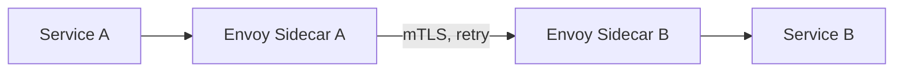

# Proxy — Senior Level

> **Source:** [refactoring.guru/design-patterns/proxy](https://refactoring.guru/design-patterns/proxy)
> **Prerequisite:** [Middle](middle.md)

---

## Table of Contents

1. [Introduction](#introduction)
2. [Proxy at Architectural Scale](#proxy-at-architectural-scale)
3. [Performance Considerations](#performance-considerations)
4. [Concurrency Deep Dive](#concurrency-deep-dive)
5. [Testability Strategies](#testability-strategies)
6. [When Proxy Becomes a Problem](#when-proxy-becomes-a-problem)
7. [Code Examples — Advanced](#code-examples--advanced)
8. [Real-World Architectures](#real-world-architectures)
9. [Pros & Cons at Scale](#pros--cons-at-scale)
10. [Trade-off Analysis Matrix](#trade-off-analysis-matrix)
11. [Migration Patterns](#migration-patterns)
12. [Diagrams](#diagrams)
13. [Related Topics](#related-topics)

---

## Introduction

> Focus: **At scale, what breaks? What earns its keep?**

In toy code Proxy is "lazy load an image." In production it's "every method call goes through 5 layers of dynamic proxies in Spring AOP," "every microservice has a sidecar proxy," "every entity is lazy-loaded by Hibernate." The senior question isn't "do I write Proxy?" — it's **"what's the right granularity, and what's the operational cost of the chosen mechanism?"**

At scale Proxy intersects with:

- **AOP frameworks** — Spring AOP, AspectJ, .NET interceptors.
- **Service meshes** — Envoy, Istio, Linkerd: process-level proxies for service-to-service traffic.
- **API gateways** — nginx, Kong, AWS ALB: proxies at the network edge.
- **ORM** — Hibernate, JPA: lazy-loaded entity proxies.
- **Distributed caches** — Redis client SDKs are remote proxies.

These are Proxy at architectural scale; the fundamentals apply.

---

## Proxy at Architectural Scale

### 1. Service mesh sidecars

Envoy sits next to every service pod. Outgoing calls go through the sidecar; incoming calls arrive via the sidecar. The sidecar handles TLS, retries, circuit breaking, observability — all without modifying service code.

This is Proxy at process level. The "interface" is the network protocol (HTTP, gRPC). The "proxy" is the sidecar.

### 2. Reverse proxies

nginx, HAProxy, AWS ALB. Incoming requests hit the proxy; the proxy applies TLS, rate limiting, routing, caching, and forwards. Same intent as a class-level Proxy: control access to the backend.

### 3. ORM lazy entities

Hibernate's lazy-loaded entities are JDK / cglib proxies. `user.getOrders()` triggers a database query the first time. The proxy looks like the real entity in every other respect.

Hidden complexity: lazy loading outside a session throws `LazyInitializationException`. Tests, migrations, and serialization paths trip over this.

### 4. RPC stubs

gRPC clients, Java RMI, COM/CORBA: all are proxies. The client calls a method; the stub serializes the call, sends it over the network, deserializes the response. Identical interface for callers.

### 5. AOP weaving

Spring AOP, AspectJ, PostSharp. Annotations declare aspects (logging, transactions, security); the framework generates proxies that apply them. Saved boilerplate; added "magic" that obscures behavior.

### 6. Distributed system proxies

Cassandra, Redis, etcd clients are remote proxies. They handle connection pooling, retry, partitioning, failover — all behind the API of "just call this method."

---

## Performance Considerations

### Static proxy

A hand-written proxy class adds:
- One indirection (method dispatch).
- One field load (the inner reference).
- Optional before/after work.

Cost: ~3 ns (Go) / negligible after JVM JIT inlining / ~150 ns (Python). Imperceptible in business code.

### Dynamic proxy (Java)

JDK Proxy or cglib generates a class at runtime. Each call:
- Looks up the method via reflection.
- Calls the `InvocationHandler.invoke`.
- Often boxes/unboxes arguments.

Cost: ~30-100 ns per call (reflection overhead). For request-scoped code, invisible. For inner loops, measurable.

### Service-mesh proxy

Each call traverses the sidecar process: ~1-5 ms added latency (or less, with optimizations). Multiplied across many hops in a microservice graph, real cost.

### Caching proxy gain

A caching proxy's value: real call latency vs cache lookup latency. If the real call is 50 ms and the cache lookup is 50 ns, every hit saves ~1M× over miss. Proxies that don't pay off (low hit rate, fast underlying call) are pure overhead.

---

## Concurrency Deep Dive

### Stateless proxies

Logging, metrics, simple authorization — safe to share. No special concerns.

### Stateful proxies

- **Caching:** the cache must be thread-safe. `ConcurrentHashMap`, Caffeine, sync.Map.
- **Lazy init:** classic double-checked locking with volatile / atomic.
- **Refcount:** atomic ops or RCU.
- **Circuit breaker:** state machine with synchronization.

### Cache stampede

Many threads simultaneously miss the cache for the same key; all trigger the underlying call. Without single-flight, the underlying service is hit N times. Solutions:
- `singleflight.Group` (Go).
- Caffeine's `getAll` with computation.
- Lock keyed by request key.

### Async proxies

A retry/cache proxy in async code must `await` properly. Mixing sync and async wrappers causes deadlocks or unexecuted coroutines.

### Backpressure

Service-mesh proxies need backpressure mechanisms: when the backend is slow, the proxy should reject (with 503) rather than queue indefinitely. Otherwise: cascading failures.

---

## Testability Strategies

### Proxy is itself a test substitute

A test using a mock implementation of `Service` is conceptually using a proxy. The interface is the same; the implementation differs.

### Test the proxy with a mock RealSubject

```java
@Test void cachingProxy_skipsInnerOnHit() {
    Service inner = mock(Service.class);
    when(inner.call("x")).thenReturn("first");
    var proxy = new CachingProxy(inner, Duration.ofMinutes(1));

    assertEquals("first", proxy.call("x"));
    assertEquals("first", proxy.call("x"));
    verify(inner, times(1)).call("x");   // inner called only once
}
```

### Test thread safety

Stress test with concurrent calls; assert no races, no duplicate inner calls.

### Property-based tests for caching

Generate random keys; assert: `proxy.call(k)` always equals `inner.call(k)` (assuming inner is pure). Catches stale cache bugs.

### Integration tests for remote proxies

A gRPC stub needs an integration test against a real server (or a fake one). Catches contract drift.

---

## When Proxy Becomes a Problem

### Symptom 1 — 8 layers of Spring AOP

Every method call goes through transactional proxy, security proxy, cache proxy, retry proxy, metrics proxy, logging proxy, ... Stack traces are unreadable; profiling is hard.

**Fix:** consolidate. Group concerns; reduce layers.

### Symptom 2 — Self-invocation surprises

`this.someMethod()` doesn't trigger the proxy in Spring AOP. Engineer expects `@Transactional`; transaction never starts.

**Fix:** inject self via `@Autowired` (workaround), or rewrite to call across beans, or use `AspectJ` (true bytecode weaving).

### Symptom 3 — Cache stampede in production

100 concurrent users hit the cache at the same time on a cold key. The single backend call becomes 100. Backend overloads.

**Fix:** single-flight; locked computation; soft TTL with refresh-ahead.

### Symptom 4 — Lazy loading exceptions

Hibernate `LazyInitializationException` outside the session. Common in DTO mapping, async tasks, serialization.

**Fix:** eagerly fetch what's needed (`@ManyToOne(fetch = EAGER)` or explicit `JOIN FETCH`); use OpenSessionInView pattern (with caveats); use DTOs that materialize what's needed before leaving the session.

### Symptom 5 — Service mesh latency

Each sidecar hop adds 1-5 ms. A 10-service request graph adds 10-50 ms. SLO violated.

**Fix:** measure each hop; remove unnecessary mesh features; inline-process for ultra-hot paths.

### Symptom 6 — Reflection-based proxy slowness

A high-throughput Java service uses `@Transactional` everywhere. Profiler shows 20% time in dynamic proxy reflection.

**Fix:** use AspectJ load-time weaving (eliminates reflection); or hand-write critical proxies; or restructure the hot path.

---

## Code Examples — Advanced

### Single-flight caching proxy (Go)

```go
import "golang.org/x/sync/singleflight"

type SingleFlightCache struct {
    inner Service
    cache sync.Map
    sf    singleflight.Group
}

func (c *SingleFlightCache) Call(ctx context.Context, key string) (Result, error) {
    if v, ok := c.cache.Load(key); ok { return v.(Result), nil }
    val, err, _ := c.sf.Do(key, func() (any, error) {
        if v, ok := c.cache.Load(key); ok { return v, nil }
        v, err := c.inner.Call(ctx, key)
        if err != nil { return nil, err }
        c.cache.Store(key, v)
        return v, nil
    })
    if err != nil { return Result{}, err }
    return val.(Result), nil
}
```

`sf.Do` ensures only one goroutine computes per key; others wait and share the result. Eliminates cache stampede.

### Refresh-ahead caching proxy (Java)

```java
public final class RefreshAheadCache<K, V> {
    private final Cache<K, V> cache = Caffeine.newBuilder()
        .refreshAfterWrite(Duration.ofMinutes(1))   // async background refresh
        .expireAfterWrite(Duration.ofMinutes(10))   // hard TTL
        .build();

    private final Function<K, V> loader;

    public V get(K key) {
        return cache.get(key, loader);
    }
}
```

Caffeine refreshes entries near expiration in the background; reads always return fast from cache.

### Distributed protection proxy (Python sketch)

```python
class DistributedProtectionProxy:
    """Validates JWT signed by an auth service before forwarding."""
    def __init__(self, inner, public_key):
        self._inner = inner
        self._pk = public_key

    def call(self, token: str, *args, **kwargs):
        try:
            jwt.decode(token, self._pk, algorithms=["RS256"])
        except jwt.InvalidTokenError as e:
            raise PermissionError(str(e))
        return self._inner.call(*args, **kwargs)
```

In a microservice, the proxy validates JWT; the inner is the business logic.

### Bulk-fetching proxy (lazy + N+1 fix)

```python
class BulkFetchProxy:
    """Wraps a service that returns one item at a time; batches N+1 lookups."""
    def __init__(self, inner):
        self._inner = inner
        self._pending: dict[str, asyncio.Future] = {}

    async def get(self, id: str):
        if id in self._pending:
            return await self._pending[id]
        fut: asyncio.Future = asyncio.get_event_loop().create_future()
        self._pending[id] = fut
        # Schedule batch flush.
        asyncio.get_event_loop().call_soon(self._flush)
        return await fut

    async def _flush(self):
        ids, futs = list(self._pending.keys()), list(self._pending.values())
        self._pending.clear()
        results = await self._inner.get_many(ids)
        for f, r in zip(futs, results):
            f.set_result(r)
```

DataLoader pattern — used by GraphQL libraries.

---

## Real-World Architectures

### A — Hibernate / JPA

Lazy-loaded entities are dynamic proxies (cglib). Common pitfall: serializing an entity to JSON triggers all lazy associations → N+1 queries → slow API. Solution: DTOs that explicitly materialize fields.

### B — Spring AOP

`@Transactional`, `@Cacheable`, `@Async`, `@Secured`, `@Retryable` — all generate proxies. The application looks like normal POJO calls; the framework injects behavior. Trade: declarative ergonomics for runtime magic.

### C — Envoy service mesh

Every pod has an Envoy sidecar. Outgoing calls flow through it. Adds: TLS, retry, timeout, circuit break, distributed tracing, mTLS, ACL. The application code is unaware.

### D — gRPC / RPC frameworks

Generated client stubs are remote proxies. Calls look local; the framework handles serialization, connection management, retries.

### E — AWS SDK, Stripe SDK, Google Cloud client libraries

High-level client objects are remote proxies. They abstract HTTP requests, signing, retry, pagination. Underneath: the same wire calls; the proxy makes them ergonomic.

### F — Reverse proxies (nginx)

The proxy takes incoming HTTP, applies policy (rate limit, auth, caching), and forwards to the backend. The backend doesn't know the proxy exists. The Proxy pattern at network scale.

---

## Pros & Cons at Scale

### Pros (at scale)

- **Independent ownership.** Service-mesh sidecars are owned by infra; services by product teams.
- **Configuration-driven behavior.** Different proxies in dev/staging/prod.
- **No code changes for cross-cutting concerns.** Tracing, retries, rate limit applied via mesh.
- **Resilient by default.** Mesh proxies provide retries, timeouts, circuit breakers without per-service implementation.
- **Test substitution.** Tests mock the interface; production uses the real proxy chain.

### Cons (at scale)

- **Stack-trace depth.** AOP / mesh add many layers; debugging is harder.
- **Latency cost.** Each proxy hop adds nanoseconds to milliseconds. At scale, milliseconds add up.
- **Hidden behavior.** Annotations (`@Transactional`, `@Cacheable`) hide what runs and when. New engineers struggle.
- **Reflection overhead.** Dynamic proxies (Spring AOP) have measurable per-call cost.
- **Operational complexity.** A service mesh is itself a system to operate.

---

## Trade-off Analysis Matrix

| Concern | Direct call | Static proxy | Dynamic proxy (Spring AOP) | Service mesh |
|---|---|---|---|---|
| **Setup cost** | Lowest | Low | Medium (annotations + framework) | High (infra) |
| **Per-call overhead** | None | ~1-5 ns | ~30-100 ns | ~1-5 ms |
| **Modify code** | Each concern in service | One per concern | One per concern + annotations | Zero (mesh-level config) |
| **Debuggability** | Highest | High | Medium (hidden classes) | Lower (cross-process) |
| **Cross-cutting at scale** | Hard | Manual composition | Declarative | Universal |
| **Suitable for** | Trivial code | Single concern | Application-wide concerns | Multi-service systems |

---

## Migration Patterns

### Pattern 1 — From inline access control to Proxy

A class with embedded auth checks. Extract a `ProtectionProxy`. Existing tests pass. Auth logic in one place.

### Pattern 2 — From static to dynamic proxy

Many similar proxies (logging, metrics, retry) hand-written. Migrate to AOP — one annotation per concern. Trade clarity for less code.

### Pattern 3 — From in-process proxy to service mesh

Cross-cutting features (TLS, retry) implemented in every service. Move to Envoy / Istio. Services simplify; mesh ops becomes a thing.

### Pattern 4 — Adding lazy loading

A frequently-unused expensive object. Wrap in a virtual proxy; ship; measure boot time improvement. Usually safe to add incrementally.

### Pattern 5 — Removing AOP

A team decides AOP magic causes more confusion than savings. Replace `@Transactional` with explicit `TransactionTemplate.execute(...)`. Ship gradually; tests catch regressions.

---

## Diagrams

### Service mesh



### AOP proxy chain

```mermaid
flowchart LR
    Caller --> Tx[@Transactional proxy]
    Tx --> Sec[@Secured proxy]
    Sec --> Cache[@Cacheable proxy]
    Cache --> Real[Real bean]
```

### Single-flight cache

```mermaid
sequenceDiagram
    participant T1 as Thread 1
    participant T2 as Thread 2
    participant Cache as Cache
    participant Real as RealService

    T1->>Cache: get(k)
    T2->>Cache: get(k)
    Note over Cache: miss; T1 wins single-flight
    Cache->>Real: load(k)
    Real-->>Cache: value
    Cache-->>T1: value
    Cache-->>T2: value (shared)
```

---

## Related Topics

- **System-scale Proxy:** service mesh (Envoy, Istio, Linkerd), API gateway, sidecar pattern.
- **AOP frameworks:** Spring AOP, AspectJ, PostSharp, .NET interceptors.
- **ORM:** Hibernate lazy proxies, Django querysets, SQLAlchemy lazyload.
- **RPC:** gRPC, Thrift, Java RMI, generated stubs.
- **Patterns combined:** Decorator (often confused), Adapter (different intent), Facade (different scope).
- **Next:** [Professional Level](professional.md) — JIT inlining, reflection cost, dynamic proxy internals.

---

[← Back to Proxy folder](.) · [↑ Structural Patterns](../README.md) · [↑↑ Roadmap Home](../../../README.md)

**Next:** [Proxy — Professional Level](professional.md)
