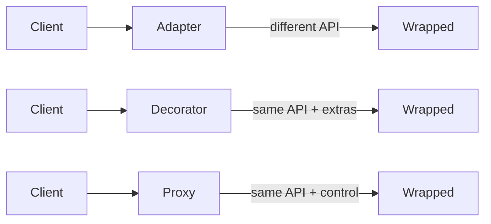
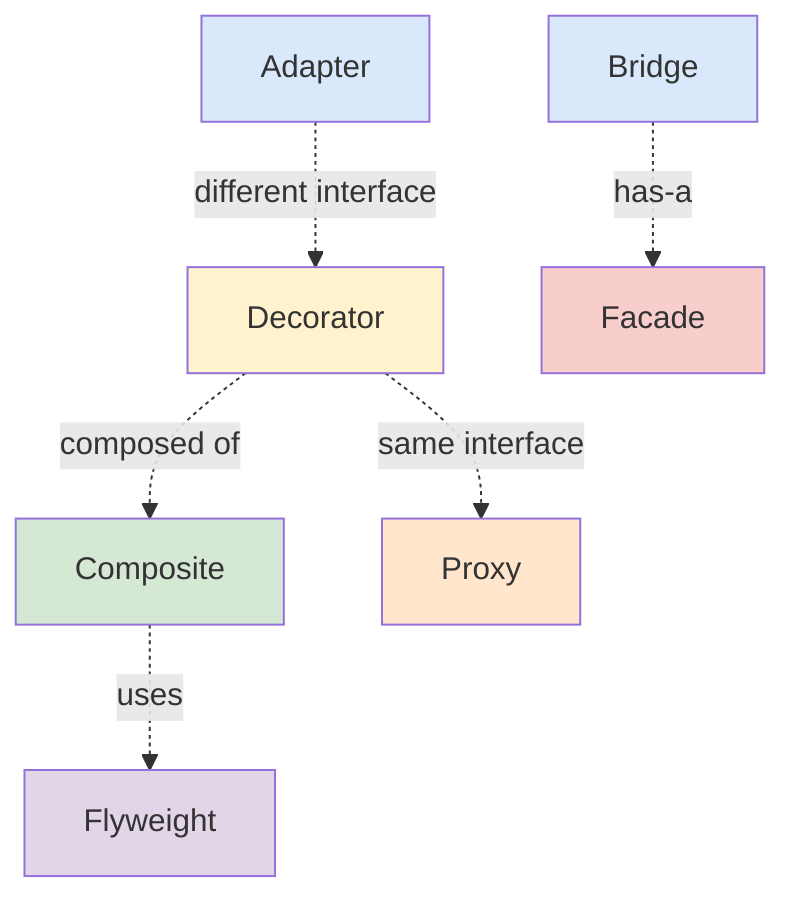

# Structural Patterns

> *"Structural design patterns explain how to assemble objects and classes into larger structures, while keeping these structures flexible and efficient."*

---

## What Are Structural Patterns?

**Structural patterns** are about **composition** — how objects and classes fit together to form bigger units while keeping the resulting structure **flexible**, **efficient**, and **decoupled**.

If creational patterns answer *"who creates the object?"*, structural patterns answer *"how do these objects relate to each other?"*

### The two questions every structural pattern asks

1. **What is the relationship?** — wrapping? bridging? composing? proxying?
2. **What is the visible interface?** — same as the wrapped object? simplified? a new contract?

---

## The 7 Structural Patterns

| Pattern | Intent (one line) | Key Question Answered |
|---|---|---|
| [Adapter](01-adapter/junior.md) | Allows objects with incompatible interfaces to collaborate | "How do I make this old API fit the new contract?" |
| [Bridge](02-bridge/junior.md) | Lets you split a large class or set of closely related classes into two separate hierarchies (abstraction & implementation) | "How do I avoid a 2D class explosion?" |
| [Composite](03-composite/junior.md) | Lets you compose objects into tree structures and work with them as if they were individual objects | "How do I treat one and many uniformly?" |
| [Decorator](04-decorator/junior.md) | Lets you attach new behaviors to objects by placing these objects inside special wrapper objects | "How do I add behavior without subclassing?" |
| [Facade](05-facade/junior.md) | Provides a simplified interface to a library, framework, or any complex set of classes | "How do I hide all this complexity behind one door?" |
| [Flyweight](06-flyweight/junior.md) | Lets you fit more objects into the available amount of RAM by sharing common parts of state | "How do I reduce memory when I have millions of similar objects?" |
| [Proxy](07-proxy/junior.md) | Lets you provide a substitute or placeholder for another object — controls access | "How do I intercept calls (lazy load, cache, security, remote)?" |

---

## When to Use Structural Patterns

Watch for these symptoms in code:

| Symptom | Pattern to consider |
|---|---|
| Two libraries you need to combine have different method names for the same thing | **Adapter** |
| A class hierarchy is exploding combinatorially (NxM subclasses) | **Bridge** |
| You want to treat a single object and a group the same way (e.g., file vs folder) | **Composite** |
| You need to add features at runtime without changing the class | **Decorator** |
| You face a complex system that 90% of users only need 10% of | **Facade** |
| You have millions of small objects and memory is the bottleneck | **Flyweight** |
| Object construction is expensive (lazy load), or you need to log/secure/cache access | **Proxy** |

---

## Comparison Matrix

| Pattern | Visible Interface | Wraps | Adds | Memory cost |
|---|---|---|---|---|
| **Adapter** | Different from adaptee | One adaptee | Translation | Low |
| **Bridge** | Stable abstraction | Implementation hierarchy | Independent variation | Low |
| **Composite** | Component interface | Children | Tree traversal | Linear in items |
| **Decorator** | Same as wrapped | One target | New behavior | Per-decoration |
| **Facade** | Simplified | Many subsystems | Simplification | Low |
| **Flyweight** | Per-flyweight | Shared state | Memory savings | Negative (saves) |
| **Proxy** | Same as wrapped | One real subject | Control / interception | Low |

---

## Critical Contrasts

These patterns are often confused. Knowing the difference is high-value:

### Adapter vs Decorator vs Proxy

All three wrap an object. The difference is **why** and **what interface**:

| | Interface | Why |
|---|---|---|
| **Adapter** | **Different** from wrapped | Make incompatible APIs work together |
| **Decorator** | **Same** as wrapped | Add behavior |
| **Proxy** | **Same** as wrapped | Control access (lazy / cache / security / remote) |

### Composite vs Decorator

Both build object trees, but:
- **Composite** — many children, treated uniformly (file system)
- **Decorator** — exactly one wrapped object, adds responsibility

### Facade vs Adapter

- **Facade** — simplifies a complex subsystem (you control the API)
- **Adapter** — bridges existing incompatible APIs (you don't control either side)

### Bridge vs Adapter

- **Bridge** — designed in *up-front* to allow independent variation
- **Adapter** — applied *after the fact* to retrofit compatibility

---

## Pattern Relationships

---

## Quick Decision Guide

> *"I have an object, but..."*

| Constraint | Pattern |
|---|---|
| ...its interface doesn't match what I need → | **Adapter** |
| ...I want to vary two dimensions independently → | **Bridge** |
| ...I want to treat singles and groups the same → | **Composite** |
| ...I want to add behavior without modifying the class → | **Decorator** |
| ...I want a simple front for a complex thing → | **Facade** |
| ...I have too many copies wasting memory → | **Flyweight** |
| ...I want to intercept calls (lazy/secure/log/remote) → | **Proxy** |

---

## Common Mistakes

1. **Decorator stack too deep** — every decoration is a wrapper; 10 levels = 10 indirections + debugging hell
2. **Facade hiding important error info** — simplification shouldn't mean swallowing errors
3. **Adapter that becomes a translation layer** — if the adapter has business logic, it's mis-named
4. **Proxy for everything** — lazy proxies for cheap objects waste more time than they save
5. **Flyweight when memory isn't the bottleneck** — premature optimization with high complexity cost
6. **Composite without a clear leaf/internal distinction** — leads to runtime type checks

---

## Pattern Files

- [01-adapter/](01-adapter/) — Adapter
- [02-bridge/](02-bridge/) — Bridge
- [03-composite/](03-composite/) — Composite
- [04-decorator/](04-decorator/) — Decorator
- [05-facade/](05-facade/) — Facade
- [06-flyweight/](06-flyweight/) — Flyweight
- [07-proxy/](07-proxy/) — Proxy

[← Back to Design Patterns](../README.md) · [↑ Roadmap Home](../../README.md)
