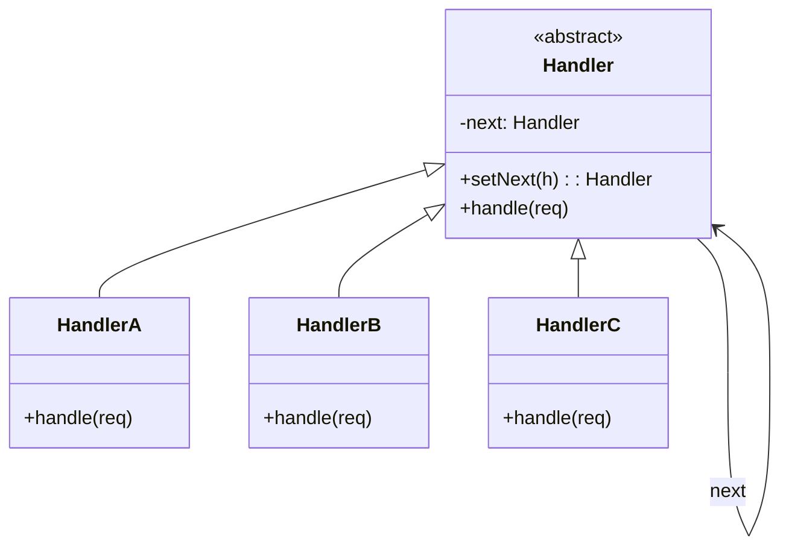
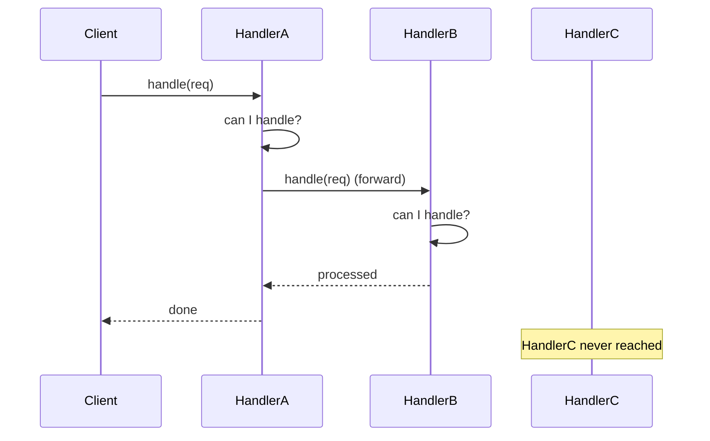
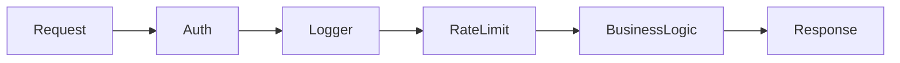

# Chain of Responsibility — Junior Level

> **Source:** [refactoring.guru/design-patterns/chain-of-responsibility](https://refactoring.guru/design-patterns/chain-of-responsibility)

---

## Table of Contents

1. [What is the Chain of Responsibility pattern?](#what-is-the-chain-of-responsibility-pattern)
2. [Real-world analogy](#real-world-analogy)
3. [The problem it solves](#the-problem-it-solves)
4. [Structure](#structure)
5. [Hello-world example (Java)](#hello-world-example-java)
6. [Python example](#python-example)
7. [TypeScript example](#typescript-example)
8. [Common situations](#common-situations)
9. [When NOT to use](#when-not-to-use)
10. [Pros and cons](#pros-and-cons)
11. [Common mistakes](#common-mistakes)
12. [Diagrams](#diagrams)
13. [Mini Glossary](#mini-glossary)
14. [Review questions](#review-questions)

---

## What is the Chain of Responsibility pattern?

**Chain of Responsibility (CoR)** lets you pass a request along a chain of handlers. Each handler decides:
1. **Process the request** itself, OR
2. **Pass it to the next handler** in the chain, OR
3. Both — process *and* forward.

The sender doesn't know which handler will process the request. Handlers don't know who's next — only that they have a next.

The chain is built dynamically. Add, remove, reorder handlers without changing other handlers or the sender.

---

## Real-world analogy

### Customer support escalation

You call tech support:

1. **Level 1 (chatbot):** answers FAQs. Doesn't know your issue → escalates.
2. **Level 2 (junior tech):** tries simple fixes. Can't → escalates.
3. **Level 3 (senior engineer):** deep diagnosis. Resolves or escalates further.
4. **Manager:** handles escalations beyond engineering.

Each level either **handles** the request or **passes** it up. You don't pick who; the chain decides.

### Office approval

Expense approval:

- < $100: Team Lead approves.
- $100–$1000: Manager approves.
- $1000–$10000: Director approves.
- > $10000: VP approves.

Submit to Team Lead. If too big, forwards to Manager. And so on. The submitter doesn't know who'll sign — depends on amount.

---

## The problem it solves

You have a request that requires processing by *one of many* handlers, and:

- The handler shouldn't be hardcoded — different requests go to different handlers.
- The sender shouldn't know which handler runs.
- New handlers should plug in without modifying existing code.
- Multiple handlers may need to process the request (logging + auth + ratelimit + handler).

### Naive approach: big if/else

```java
void process(Request r) {
    if (r.amount < 100) {
        teamLead.approve(r);
    } else if (r.amount < 1000) {
        manager.approve(r);
    } else if (r.amount < 10000) {
        director.approve(r);
    } else {
        vp.approve(r);
    }
}
```

Every new threshold = edit `process`. Tight coupling between sender and handler types. Reordering = code change.

### Chain approach

```java
Handler chain = teamLead.next(manager).next(director).next(vp);
chain.handle(request);
```

Sender just talks to the head. Each handler does its check, processes or forwards. Adding "Senior Director" between Director and VP = `director.next(seniorDirector).next(vp)`.

---

## Structure

```
Handler (interface or abstract class)
    + setNext(handler): Handler
    + handle(request): void

ConcreteHandler1 → handles certain requests, forwards others
ConcreteHandler2 → ...
ConcreteHandler3 → ...

Client builds the chain and sends requests to the head.
```

The chain can be:
- **Linear** — head → A → B → C → tail.
- **Tree** — handler can route to different children based on request.
- **Loop** — careful, can cause infinite forwarding.

Most CoR implementations are linear; trees are routing variants.

---

## Hello-world example (Java)

Approval chain for expense requests.

```java
public abstract class Approver {
    protected Approver next;

    public Approver setNext(Approver next) {
        this.next = next;
        return next;
    }

    public abstract void approve(Request request);
}

public final class TeamLead extends Approver {
    public void approve(Request r) {
        if (r.amount() < 100) {
            System.out.println("TeamLead approved " + r);
        } else if (next != null) {
            next.approve(r);
        }
    }
}

public final class Manager extends Approver {
    public void approve(Request r) {
        if (r.amount() < 1000) {
            System.out.println("Manager approved " + r);
        } else if (next != null) {
            next.approve(r);
        }
    }
}

public final class Director extends Approver {
    public void approve(Request r) {
        if (r.amount() < 10000) {
            System.out.println("Director approved " + r);
        } else if (next != null) {
            next.approve(r);
        }
    }
}

public final class VP extends Approver {
    public void approve(Request r) {
        if (r.amount() < 100000) {
            System.out.println("VP approved " + r);
        } else {
            System.out.println("Rejected: " + r + " too high");
        }
    }
}

public record Request(String item, double amount) {}

public class Demo {
    public static void main(String[] args) {
        Approver lead = new TeamLead();
        lead.setNext(new Manager())
            .setNext(new Director())
            .setNext(new VP());

        lead.approve(new Request("pen", 5));            // TeamLead
        lead.approve(new Request("laptop", 1500));      // Director
        lead.approve(new Request("conference", 30000)); // VP
        lead.approve(new Request("car", 200000));       // Rejected
    }
}
```

**Output:**

```
TeamLead approved Request[item=pen, amount=5.0]
Director approved Request[item=laptop, amount=1500.0]
VP approved Request[item=conference, amount=30000.0]
Rejected: Request[item=car, amount=200000.0] too high
```

Each handler decides locally; chain order determines flow.

---

## Python example

```python
from abc import ABC, abstractmethod


class Handler(ABC):
    def __init__(self):
        self._next: Handler | None = None

    def set_next(self, handler: "Handler") -> "Handler":
        self._next = handler
        return handler

    @abstractmethod
    def handle(self, request) -> None: ...


class AuthHandler(Handler):
    def handle(self, request) -> None:
        if not request.get("token"):
            raise PermissionError("unauthorized")
        if self._next:
            self._next.handle(request)


class LoggingHandler(Handler):
    def handle(self, request) -> None:
        print(f"LOG: {request['method']} {request['url']}")
        if self._next:
            self._next.handle(request)


class RateLimitHandler(Handler):
    def __init__(self, max_per_min: int = 60):
        super().__init__()
        self.max_per_min = max_per_min
        self.calls = []

    def handle(self, request) -> None:
        # ... rate-check logic
        if self._next:
            self._next.handle(request)


class BusinessLogicHandler(Handler):
    def handle(self, request) -> None:
        print(f"Processing: {request}")


# Build chain:
chain = AuthHandler()
chain.set_next(LoggingHandler()).set_next(RateLimitHandler()).set_next(BusinessLogicHandler())

chain.handle({"token": "abc", "method": "GET", "url": "/users"})
```

Standard middleware chain. Each handler does its bit; final one is the actual business logic.

---

## TypeScript example

Functional middleware (more idiomatic in TypeScript / Node.js):

```typescript
type Request = { url: string; method: string; user?: string };
type Next = () => void;
type Middleware = (req: Request, next: Next) => void;

function compose(middlewares: Middleware[]): (req: Request) => void {
    return function handle(req: Request) {
        function dispatch(i: number) {
            const mw = middlewares[i];
            if (!mw) return;
            mw(req, () => dispatch(i + 1));
        }
        dispatch(0);
    };
}

// Middlewares:
const logger: Middleware = (req, next) => {
    console.log(`${req.method} ${req.url}`);
    next();
};

const auth: Middleware = (req, next) => {
    if (!req.user) throw new Error("unauthorized");
    next();
};

const handler: Middleware = (req, _next) => {
    console.log(`processing ${req.url} for ${req.user}`);
    // no next() — terminal
};

// Build pipeline:
const app = compose([logger, auth, handler]);
app({ url: "/users", method: "GET", user: "alice" });
```

Each middleware decides whether to call `next()`. Skipping `next()` short-circuits — request stops there. Express.js, Koa, Connect all use this exact pattern.

---

## Common situations

| Situation | Why CoR helps |
|---|---|
| **HTTP middleware** | Auth, logging, rate-limit, parsing — each a handler |
| **Approval workflows** | Different people approve at different thresholds |
| **Event bubbling** | DOM events propagate up; each parent decides |
| **Logging frameworks** | Logger → Appender chain (file, console, network) |
| **Validation chains** | Each rule checks input; first failure stops |
| **Filter chains** | Servlet filters, security filter chains |
| **Exception handling** | try/catch unwinds; each level decides to handle |
| **Ant compiling** | Each task may run or skip |
| **Spring `HandlerInterceptor`** | preHandle / postHandle / afterCompletion chain |

---

## When NOT to use

- **Single fixed handler always processes.** No need for chain — just call it directly.
- **All handlers must run.** That's a "pipeline" or "Composite", not CoR (where each *may* short-circuit).
- **Complex routing logic.** If the next handler depends on rich state, use a state machine or rule engine.
- **Performance-sensitive hot path.** Chain traversal has overhead per handler; for inner loops, inline.
- **Easy to mis-configure.** A request may fall off the end with nobody handling it. Add a default terminal handler.

**Rule of thumb:** Use CoR when the *set* of possible handlers is dynamic and the request determines which one (or which subset) processes.

---

## Pros and cons

### Pros

- **Decoupled.** Sender doesn't know handlers. Handlers don't know each other beyond `next`.
- **Open/Closed.** Add handlers without modifying existing.
- **Single Responsibility.** Each handler does one job.
- **Flexible composition.** Build different chains at runtime.
- **Skip / short-circuit.** A handler can stop the chain.

### Cons

- **No guarantee of handling.** A request may reach the end without being handled.
- **Hard to debug.** Following a chain through several files is harder than reading a switch.
- **Order-dependent.** Wrong order = wrong behavior. Auth before logging vs after = different leakage.
- **Performance cost.** Each handler is a virtual call. For 10-deep chain × 1M req: noticeable.
- **Hidden coupling.** Handlers may share assumptions about what previous handlers did.

---

## Common mistakes

### Mistake 1: Forgetting to call `next`

```java
class LoggingHandler extends Handler {
    public void handle(Request r) {
        System.out.println("LOG: " + r);
        // forgot: if (next != null) next.handle(r);
    }
}
```

Chain breaks. Logger logs, then nothing. Symptoms: requests "disappear". Always remember `next.handle(r)` *unless* the handler intentionally short-circuits.

### Mistake 2: No terminal handler

```java
chain.setNext(handler1).setNext(handler2);
chain.handle(request);   // request not matched anywhere → silent
```

If no handler matches, request silently dropped. Add a default fallback:

```java
public final class FallbackHandler extends Handler {
    public void handle(Request r) {
        throw new UnhandledRequestException(r);
    }
}
```

Or log it.

### Mistake 3: Cycles in the chain

```java
a.setNext(b);
b.setNext(c);
c.setNext(a);   // cycle
chain.handle(r);   // StackOverflowError
```

Chain should be acyclic. Validate when building.

### Mistake 4: Sharing mutable state across handlers

```java
class CounterHandler extends Handler {
    static int count = 0;
    public void handle(Request r) {
        count++;
        next.handle(r);
    }
}
```

If `count` is shared across requests, race conditions in concurrent code. Use a per-request context or `AtomicInteger`.

### Mistake 5: Tightly-coupled handler order assumptions

```java
class HandlerB extends Handler {
    public void handle(Request r) {
        // assumes HandlerA already validated r.token
        process(r.token);
    }
}
```

If someone reorders the chain, breaks. Document order dependencies, or make each handler self-validate.

---

## Diagrams

### Class diagram



### Request flow



When B handles, it doesn't forward → C is skipped. Chain short-circuits.

### Middleware composition



Each middleware can stop, modify, or pass through.

---

## Mini Glossary

- **Handler** — one node in the chain. Has `handle(request)` and a reference to `next`.
- **Chain** — the linked sequence of handlers.
- **Next** — pointer from one handler to the next.
- **Short-circuit** — when a handler decides not to forward, ending traversal.
- **Terminal handler** — last in chain; either handles or rejects.
- **Pipeline** — variant where every handler runs (no short-circuit).
- **Middleware** — common name for a handler in HTTP frameworks.
- **Sender** — code that submits the request to the chain head.
- **Pass the buck** — colloquial: "I won't handle this — next person."

---

## Review questions

1. **What is the Chain of Responsibility pattern?** A behavioral pattern where a request travels through a chain of handlers; each decides to process or forward.
2. **Why use it?** Decouple sender from handler; allow dynamic assembly of processing steps.
3. **What's the role of `next`?** Reference to the next handler; how the chain is linked.
4. **What does short-circuit mean?** A handler stops the chain by not calling `next`.
5. **What's the risk of forgetting `next`?** Chain breaks; downstream handlers never run.
6. **What's a terminal handler?** A handler that ends the chain — handles, rejects, or logs unhandled.
7. **When is CoR overkill?** Single handler always processes; or all handlers must run (use pipeline).
8. **Real-world examples?** HTTP middleware, approval workflows, Servlet filters, logging appenders, DOM event bubbling.
9. **What's the difference between CoR and Pipeline?** CoR: each handler may stop the chain. Pipeline: all run.
10. **How do you avoid request-falls-off-end?** Add a fallback terminal handler that logs or rejects.

[← Behavioral patterns home](../README.md) · [Middle →](middle.md)
