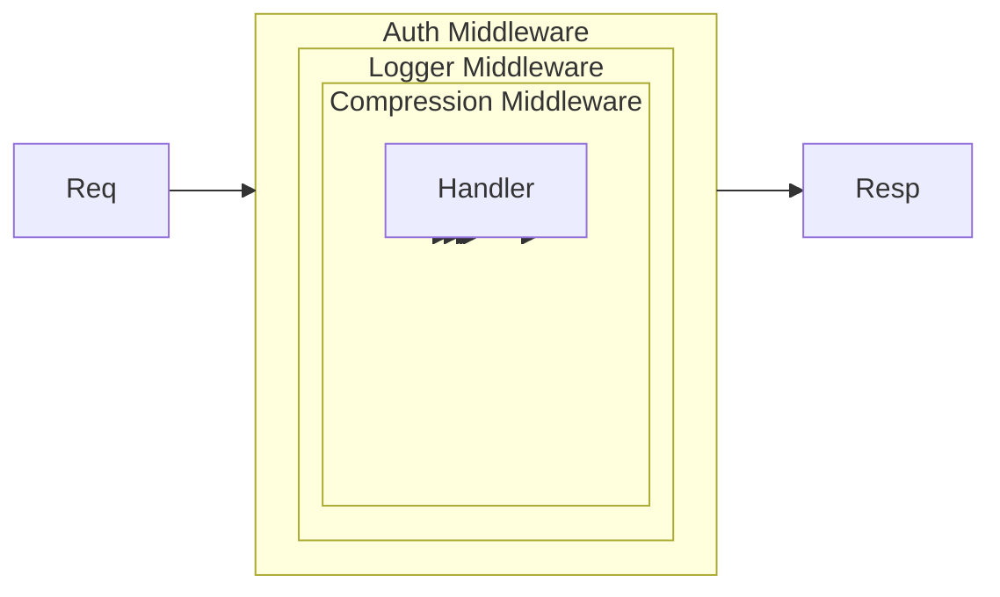
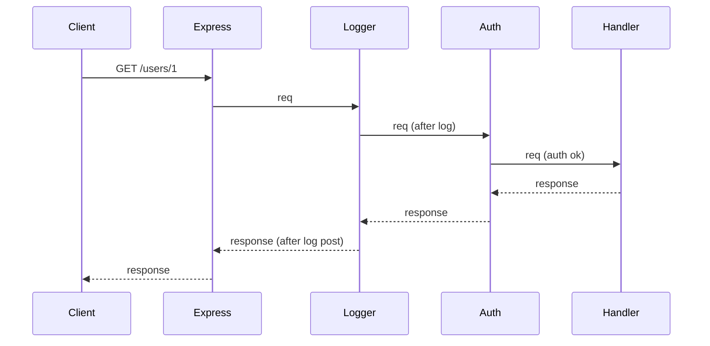
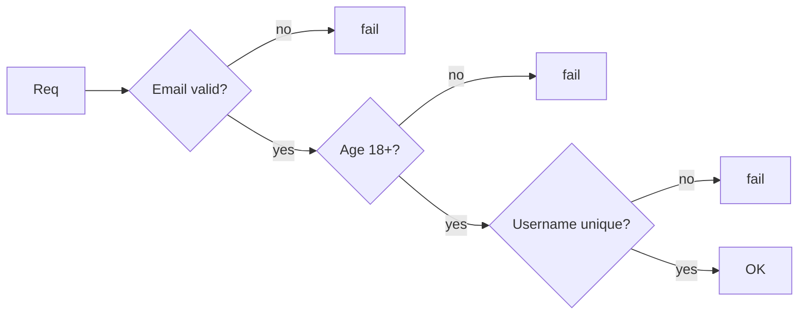

# Chain of Responsibility — Middle Level

> **Source:** [refactoring.guru/design-patterns/chain-of-responsibility](https://refactoring.guru/design-patterns/chain-of-responsibility)
> **Prerequisite:** [Junior](junior.md)

---

## Table of Contents

1. [Beyond hello-world](#beyond-hello-world)
2. [HTTP middleware in Express / Koa](#http-middleware-in-express--koa)
3. [Servlet Filter chain (Java EE)](#servlet-filter-chain-java-ee)
4. [Spring `HandlerInterceptor`](#spring-handlerinterceptor)
5. [Logging appender chain](#logging-appender-chain)
6. [Validation chain (each rule)](#validation-chain-each-rule)
7. [Onion model: pre + post hooks](#onion-model-pre--post-hooks)
8. [Functional middleware (compose)](#functional-middleware-compose)
9. [CoR vs Pipeline: subtle but important](#cor-vs-pipeline-subtle-but-important)
10. [Routing chains: tree variant](#routing-chains-tree-variant)
11. [Async chains (Promises / CompletableFuture)](#async-chains-promises--completablefuture)
12. [Context object passing](#context-object-passing)
13. [Error handling in chains](#error-handling-in-chains)
14. [Common refactorings](#common-refactorings)
15. [Anti-patterns at this level](#anti-patterns-at-this-level)
16. [Diagrams](#diagrams)

---

## Beyond hello-world

Junior level showed expense approval. In real code, CoR appears in:

- **HTTP middleware** — Express, Koa, ASP.NET, Spring filter chains.
- **Servlet Filters** — Java EE's foundation for request preprocessing.
- **Logging frameworks** — Log4j, Logback, SLF4J appender chains.
- **Validation pipelines** — each rule, short-circuit on failure.
- **Compiler driver phases** — preprocess → parse → optimize → emit; each may abort.
- **CDI / Spring AOP interceptor chains** — methods wrapped by interceptors.

Middle-level theme: real frameworks, async chains, context passing, error handling.

---

## HTTP middleware in Express / Koa

### Express.js

```javascript
const express = require("express");
const app = express();

// Middleware: logger
app.use((req, res, next) => {
    console.log(`${req.method} ${req.url}`);
    next();   // forward
});

// Middleware: auth
app.use((req, res, next) => {
    if (!req.headers.authorization) {
        return res.status(401).send("Unauthorized");   // short-circuit
    }
    req.user = decode(req.headers.authorization);
    next();
});

// Route handler (terminal)
app.get("/users/:id", (req, res) => {
    res.json(getUser(req.params.id));
});

app.listen(3000);
```

Each `app.use` adds a handler to the chain. Each handler has `(req, res, next)` — call `next()` to continue, or send a response to short-circuit.

### Koa (with async)

```javascript
const Koa = require("koa");
const app = new Koa();

// Logger
app.use(async (ctx, next) => {
    const start = Date.now();
    await next();   // wait for downstream
    const elapsed = Date.now() - start;
    console.log(`${ctx.method} ${ctx.url} - ${elapsed}ms`);
});

// Response
app.use(async (ctx) => {
    ctx.body = "Hello";
});

app.listen(3000);
```

Koa uses async/await — each middleware can run code *before* and *after* `next()`. This is the **onion model** (covered below).

---

## Servlet Filter chain (Java EE)

```java
@WebFilter("/api/*")
public class AuthFilter implements Filter {
    @Override
    public void doFilter(ServletRequest req, ServletResponse resp, FilterChain chain)
            throws IOException, ServletException {
        HttpServletRequest httpReq = (HttpServletRequest) req;
        String token = httpReq.getHeader("Authorization");
        if (token == null) {
            ((HttpServletResponse) resp).sendError(401);
            return;   // short-circuit
        }
        chain.doFilter(req, resp);   // forward
    }
}

@WebFilter("/api/*")
public class LoggingFilter implements Filter {
    @Override
    public void doFilter(ServletRequest req, ServletResponse resp, FilterChain chain)
            throws IOException, ServletException {
        long start = System.currentTimeMillis();
        try {
            chain.doFilter(req, resp);
        } finally {
            System.out.println(((HttpServletRequest) req).getRequestURI() + " " +
                (System.currentTimeMillis() - start) + "ms");
        }
    }
}
```

Container builds the chain from `@WebFilter` annotations + `web.xml`. Filter order matters; configure with `<filter-mapping>` order.

---

## Spring `HandlerInterceptor`

```java
@Component
public class AuthInterceptor implements HandlerInterceptor {
    @Override
    public boolean preHandle(HttpServletRequest req, HttpServletResponse resp, Object handler) {
        String token = req.getHeader("Authorization");
        if (token == null) {
            resp.setStatus(401);
            return false;   // short-circuit
        }
        return true;        // continue chain
    }

    @Override
    public void postHandle(HttpServletRequest req, HttpServletResponse resp,
                           Object handler, ModelAndView mav) {
        // after handler ran; before view rendered
    }

    @Override
    public void afterCompletion(HttpServletRequest req, HttpServletResponse resp,
                                Object handler, Exception ex) {
        // after view rendered
    }
}

@Configuration
public class WebConfig implements WebMvcConfigurer {
    @Override
    public void addInterceptors(InterceptorRegistry registry) {
        registry.addInterceptor(new AuthInterceptor()).addPathPatterns("/api/**");
        registry.addInterceptor(new LoggingInterceptor());
    }
}
```

Spring's CoR has *three* hooks per interceptor: pre, post, after-completion. Each is a phase. Returning `false` from `preHandle` halts the chain. Real production CoR.

---

## Logging appender chain

```java
public abstract class LogAppender {
    protected LogAppender next;
    protected Level minLevel;

    public LogAppender setNext(LogAppender next) {
        this.next = next;
        return next;
    }

    public void log(LogEntry entry) {
        if (entry.level().compareTo(minLevel) >= 0) {
            write(entry);
        }
        if (next != null) next.log(entry);   // always forward (pipeline-ish)
    }

    protected abstract void write(LogEntry entry);
}

public final class ConsoleAppender extends LogAppender {
    public ConsoleAppender(Level minLevel) { this.minLevel = minLevel; }
    protected void write(LogEntry entry) { System.out.println(entry); }
}

public final class FileAppender extends LogAppender {
    private final PrintWriter out;
    public FileAppender(Level minLevel, String path) throws IOException {
        this.minLevel = minLevel;
        this.out = new PrintWriter(new FileWriter(path, true));
    }
    protected void write(LogEntry entry) { out.println(entry); out.flush(); }
}

public final class NetworkAppender extends LogAppender {
    public NetworkAppender(Level minLevel) { this.minLevel = minLevel; }
    protected void write(LogEntry entry) { /* send to log server */ }
}
```

Setup:

```java
LogAppender chain = new ConsoleAppender(Level.DEBUG);
chain.setNext(new FileAppender(Level.INFO, "app.log"))
     .setNext(new NetworkAppender(Level.ERROR));

chain.log(new LogEntry(Level.INFO, "user logged in"));
// → console writes (≥ DEBUG ✓)
// → file writes (≥ INFO ✓)
// → network skips (< ERROR)
```

Each appender has its threshold. The *forwarding* always happens — this is more "pipeline" than strict CoR. Many logging frameworks combine: each appender filters by level, but all run.

---

## Validation chain (each rule)

```java
public abstract class ValidationRule {
    protected ValidationRule next;
    public ValidationRule setNext(ValidationRule next) { this.next = next; return next; }

    public ValidationResult validate(User u) {
        ValidationResult r = check(u);
        if (!r.isValid()) return r;        // short-circuit on failure
        if (next != null) return next.validate(u);
        return ValidationResult.ok();
    }

    protected abstract ValidationResult check(User u);
}

public final class EmailRule extends ValidationRule {
    protected ValidationResult check(User u) {
        return u.email().contains("@")
            ? ValidationResult.ok()
            : ValidationResult.fail("invalid email");
    }
}

public final class AgeRule extends ValidationRule {
    protected ValidationResult check(User u) {
        return u.age() >= 18
            ? ValidationResult.ok()
            : ValidationResult.fail("must be 18+");
    }
}

public final class UsernameUniqueRule extends ValidationRule {
    private final UserRepo repo;
    public UsernameUniqueRule(UserRepo repo) { this.repo = repo; }
    protected ValidationResult check(User u) {
        return repo.existsByUsername(u.username())
            ? ValidationResult.fail("username taken")
            : ValidationResult.ok();
    }
}

ValidationRule chain = new EmailRule();
chain.setNext(new AgeRule()).setNext(new UsernameUniqueRule(repo));

ValidationResult r = chain.validate(user);
```

Stop on first failure (fail-fast). Or accumulate (collect-all-errors) — different chain semantics, both valid. Choose based on UX (fail-fast for forms? collect-all for batch?).

---

## Onion model: pre + post hooks

A handler can do work **before** AND **after** `next` — wrapping downstream:

```java
public abstract class Middleware {
    protected Middleware next;
    public abstract Response handle(Request req);
}

public class TimingMiddleware extends Middleware {
    public Response handle(Request req) {
        long start = System.currentTimeMillis();
        Response resp = next.handle(req);   // descend
        long elapsed = System.currentTimeMillis() - start;
        System.out.println(req + " " + elapsed + "ms");
        return resp;
    }
}

public class CompressionMiddleware extends Middleware {
    public Response handle(Request req) {
        Response resp = next.handle(req);
        return compress(resp);   // post-process
    }
}
```

Visual: like an onion — each layer wraps the inner. Outer middleware sees the request first AND the response last.

```
Auth (pre) → Logger (pre) → Handler → Logger (post) → Auth (post)
```

This is Koa's model (and Spring's `OncePerRequestFilter`, .NET's HTTP middleware). Most powerful CoR variant.

---

## Functional middleware (compose)

Avoiding inheritance: each middleware is a function.

```typescript
type Handler<Req, Res> = (req: Req) => Promise<Res>;
type Middleware<Req, Res> = (next: Handler<Req, Res>) => Handler<Req, Res>;

function compose<Req, Res>(
    middlewares: Middleware<Req, Res>[],
    terminal: Handler<Req, Res>
): Handler<Req, Res> {
    return middlewares.reduceRight(
        (next, mw) => mw(next),
        terminal
    );
}

// Middlewares:
const logger: Middleware<Request, Response> = (next) => async (req) => {
    console.log("REQ:", req.url);
    const resp = await next(req);
    console.log("RESP:", resp.status);
    return resp;
};

const auth: Middleware<Request, Response> = (next) => async (req) => {
    if (!req.user) throw new Error("unauth");
    return next(req);
};

const handler: Handler<Request, Response> = async (req) => ({
    status: 200,
    body: `hello ${req.user}`,
});

const app = compose([logger, auth], handler);
await app({ url: "/", user: "alice" });
```

Pure functions; no classes. `reduceRight` builds the chain inside-out — terminal first, then wrapped by each middleware in reverse order. Reactive, async, no side effects on the chain itself.

---

## CoR vs Pipeline: subtle but important

| Aspect | Chain of Responsibility | Pipeline |
|---|---|---|
| **Each handler runs?** | Maybe — short-circuits OK | Always — every step runs |
| **Stop on success?** | Yes (typical) | No (each step transforms) |
| **Use case** | Request handling, approval, dispatch | Data transformation, ETL |
| **Returns** | Possibly nothing (handled or not) | Final transformed value |
| **Example** | Servlet Filter | Stream/Optional chain |

**CoR:** "Find someone to handle this." Each step asks "is this for me? if yes, handle. if no, pass."

**Pipeline:** "Transform this through these steps." Each step modifies and passes the result.

Both use the chain structure; semantics differ. Logging appenders are pipeline-flavored (every appender runs); auth filters are pure CoR (auth fail short-circuits).

Validation can go either way:
- **Fail-fast CoR:** stop on first error.
- **Collect-all pipeline:** every rule runs; aggregate errors.

Pick based on requirements.

---

## Routing chains: tree variant

Strict linear chain: A → B → C. But sometimes the next handler depends on the request:

```java
public class RoutingHandler extends Handler {
    private final Map<String, Handler> routes;

    public RoutingHandler(Map<String, Handler> routes) {
        this.routes = routes;
    }

    public void handle(Request r) {
        Handler target = routes.get(r.path());
        if (target != null) target.handle(r);
        else if (next != null) next.handle(r);   // fall through
    }
}
```

Rather than a single `next`, the handler picks from many. This is closer to a **dispatch tree** or **router** — common in URL routing (`Router → controller`).

Express's `app.use(path, handler)` is exactly this: handlers registered with paths; router dispatches.

For CoR purists: chain is linear. Routing variants blur into other patterns (Strategy by key, Composite for hierarchy).

---

## Async chains (Promises / CompletableFuture)

### JavaScript

```javascript
async function asyncChain(req, middlewares) {
    let i = 0;
    async function next() {
        const mw = middlewares[i++];
        if (!mw) return;
        await mw(req, next);
    }
    await next();
}
```

Each middleware can `await` async work before/after `next()`.

### Java with CompletableFuture

```java
public abstract class AsyncHandler {
    protected AsyncHandler next;

    public CompletableFuture<Response> handle(Request req) {
        return processAsync(req)
            .thenCompose(processed ->
                next != null ? next.handle(processed) : CompletableFuture.completedFuture(processed)
            );
    }

    protected abstract CompletableFuture<Request> processAsync(Request req);
}
```

`thenCompose` chains the futures. Each handler returns a `CompletableFuture`; the next is invoked when previous completes. **Beware**: each `thenCompose` allocates a future — for deep chains, GC pressure.

### Reactor / RxJava

```java
Flux<Request> requests = ...;
requests
    .flatMap(authFilter::filter)
    .flatMap(logFilter::filter)
    .flatMap(rateLimitFilter::filter)
    .flatMap(handler::process);
```

Each step is a CoR handler; reactive operator chains them. Backpressure handled by reactive streams.

---

## Context object passing

Often handlers need shared state (e.g., authenticated user, trace ID). Don't store it on handlers (mutable, non-thread-safe). Pass a context:

```java
public final class RequestContext {
    private final Map<String, Object> attrs = new HashMap<>();

    public RequestContext set(String key, Object value) {
        attrs.put(key, value);
        return this;
    }

    public <T> T get(String key) {
        return (T) attrs.get(key);
    }
}

public class AuthHandler extends Handler {
    public void handle(Request req, RequestContext ctx) {
        User u = decodeToken(req.token());
        ctx.set("user", u);   // pass downstream
        if (next != null) next.handle(req, ctx);
    }
}

public class BusinessHandler extends Handler {
    public void handle(Request req, RequestContext ctx) {
        User u = ctx.get("user");
        // use u
    }
}
```

Context is per-request, mutable, scoped. Express's `req` object, Koa's `ctx`, ASP.NET's `HttpContext` all do this.

For **immutable** context (functional style): each handler returns a new context with updates. More allocation, more safety.

---

## Error handling in chains

### Try/catch wrapper

```java
public class ErrorHandlingMiddleware extends Middleware {
    public Response handle(Request req) {
        try {
            return next.handle(req);
        } catch (UnauthorizedException e) {
            return new Response(401, "unauthorized");
        } catch (NotFoundException e) {
            return new Response(404, "not found");
        } catch (Exception e) {
            return new Response(500, "internal error");
        }
    }
}
```

Place this **first** in the chain — catches all downstream exceptions. Express has special "error middlewares" `(err, req, res, next) => ...`.

### Result types

Functional approach: handlers return `Result<Success, Error>`, no exceptions:

```kotlin
sealed class Result<out S, out E> {
    data class Success<S>(val value: S) : Result<S, Nothing>()
    data class Failure<E>(val error: E) : Result<Nothing, E>()
}

fun handle(req: Request, next: (Request) -> Result<Response, Error>): Result<Response, Error> {
    val authResult = authenticate(req)
    return when (authResult) {
        is Failure -> authResult            // short-circuit
        is Success -> next(authResult.value)
    }
}
```

Errors propagate as values. No control-flow surprises. Modern Rust, Scala (`Either`), Kotlin (`Result`) idioms.

---

## Common refactorings

### Refactoring 1: From if/else cascade to CoR

Before:

```java
void process(Request r) {
    if (r.type == AUTH) {
        authProcess(r);
    } else if (r.type == LOG) {
        logProcess(r);
    } else if (r.type == BUSINESS) {
        businessProcess(r);
    }
}
```

Adding a type = edit `process`. Tight coupling.

After:

```java
Handler chain = new AuthHandler();
chain.setNext(new LogHandler()).setNext(new BusinessHandler());
chain.handle(request);
```

Add a handler = `chain.setNext(new NewHandler())`. No core code change.

### Refactoring 2: From CoR to Decorator

If every handler runs (no short-circuit), and they wrap each other (pre + post), that's Decorator over the handler. CoR's onion model = Decorator chain.

The pattern names overlap. Name it for the dominant intent: routing → CoR; wrapping → Decorator.

### Refactoring 3: From CoR to Strategy

If exactly **one** handler always runs based on request type, lookup-by-key (Strategy):

```java
Map<RequestType, Handler> handlers = Map.of(
    RequestType.AUTH, new AuthHandler(),
    RequestType.LOG, new LogHandler()
);
handlers.get(request.type()).handle(request);
```

O(1) dispatch instead of O(N) chain traversal.

### Refactoring 4: Add a Builder for chain construction

```java
Handler chain = ChainBuilder.start()
    .add(new AuthHandler())
    .add(new LogHandler())
    .add(new BusinessHandler())
    .build();
```

Cleaner than nested `setNext` calls.

---

## Anti-patterns at this level

### Anti-pattern 1: Forgotten `next` call

Most common bug. Handler does work, forgets to forward → chain breaks silently.

**Fix:** Code review, lint rules, default to "always forward unless explicitly handled".

### Anti-pattern 2: Order-fragile chains

```java
new TokenDecoderHandler()    // sets req.user
new AuthHandler()            // reads req.user
new BusinessHandler()        // uses req.user
```

If anyone reorders, breaks. Document order, or make handlers self-validating.

### Anti-pattern 3: Mutable shared state on handlers

```java
class CounterHandler extends Handler {
    int count = 0;   // shared across requests
    public void handle(Request r) { count++; next.handle(r); }
}
```

Concurrent requests race. Use per-request context or thread-safe counters.

### Anti-pattern 4: Long chain with rich context coupling

20-handler chain with each reading/writing 10 context keys. Hard to reason about; impossible to test in isolation. Refactor: split into smaller, focused chains.

### Anti-pattern 5: Hidden control flow

```java
class TrickHandler extends Handler {
    public void handle(Request r) {
        if (Math.random() < 0.5) next.handle(r);
        else { /* silent drop */ }
    }
}
```

Probabilistic forwarding obscures debugging. Make decisions explicit.

### Anti-pattern 6: Non-idempotent handlers in retried chains

If your chain is retried (e.g., on transient failure), each handler must be idempotent — running twice yields same effect as once. Otherwise, "log + send email" handler would log twice and email twice.

---

## Diagrams

### Onion (pre + post)



Each layer enters → wraps → exits.

### Express request flow



Onion model in action.

### Validation fail-fast



Each rule short-circuits on failure.

---

[← Junior](junior.md) · [Senior →](senior.md)
