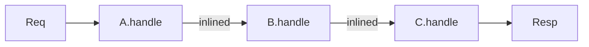
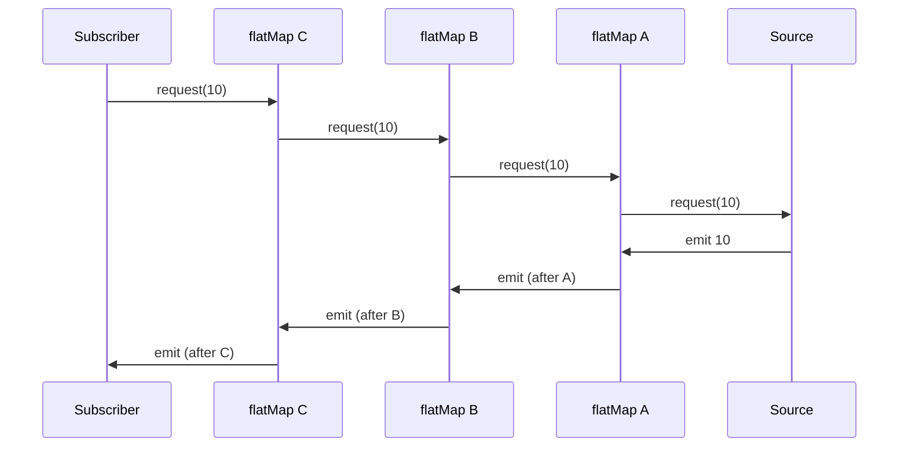
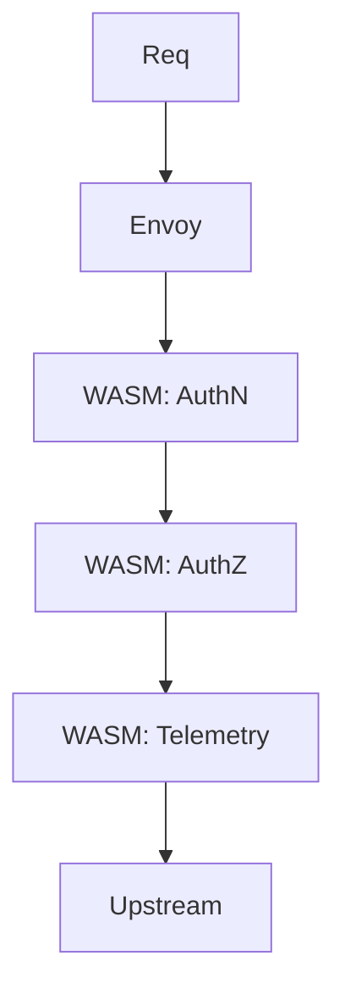

# Chain of Responsibility — Professional Level

> **Source:** [refactoring.guru/design-patterns/chain-of-responsibility](https://refactoring.guru/design-patterns/chain-of-responsibility)
> **Prerequisite:** [Senior](senior.md)

---

## Table of Contents

1. [Introduction](#introduction)
2. [JIT inlining of middleware chains](#jit-inlining-of-middleware-chains)
3. [Stack depth and chain length](#stack-depth-and-chain-length)
4. [Allocation analysis: lambdas vs classes](#allocation-analysis-lambdas-vs-classes)
5. [Reactive backpressure across chain](#reactive-backpressure-across-chain)
6. [WASM filters in Envoy](#wasm-filters-in-envoy)
7. [Hot-path optimization: tail-call style](#hot-path-optimization-tail-call-style)
8. [Per-handler memoization](#per-handler-memoization)
9. [Compile-time chain assembly](#compile-time-chain-assembly)
10. [Async chain internals (CompletableFuture)](#async-chain-internals-completablefuture)
11. [Cross-language comparison](#cross-language-comparison)
12. [Microbenchmark anatomy](#microbenchmark-anatomy)
13. [Diagrams](#diagrams)
14. [Related Topics](#related-topics)

---

## Introduction

At professional level, CoR is examined for what the runtime, compiler, and network make of it. For HTTP middleware at 100K req/s, a 10-handler chain is 1M virtual calls/s — dispatch matters. For service meshes, network hops + chain traversal compound.

This level covers JIT inlining of middleware classes, stack depth limits in deep chains, allocation costs of functional vs OO middlewares, and the internals of reactive / WASM-based chains.

---

## JIT inlining of middleware chains

### Static chain

```java
public abstract class Middleware {
    protected Middleware next;
    public abstract void handle(Request r);
}

public class A extends Middleware {
    public void handle(Request r) { /* ... */ next.handle(r); }
}
public class B extends Middleware { /* ... */ }
public class C extends Middleware { /* ... */ }
```

If JIT sees only one chain shape (A → B → C with the same instances) at the call site, it inlines aggressively. After warmup, dispatch ~zero.

### Dynamic chain

If chain is rebuilt per request (rare but happens), JIT can't inline — call site polymorphic. ~3-5ns per `next.handle` call.

### `final` modifier

Marking handler classes `final` helps JIT skip subclass checks. Spring's `OncePerRequestFilter` is `abstract` — JIT must dispatch.

For internal handlers you control: declare `final`.

### Inlining limits

JVM's `MaxInlineLevel` (default 9) caps inlining depth. A chain of 10+ handlers may exceed this, forcing real calls past depth 9.

Tune for hot paths: `-XX:MaxInlineLevel=15` for very deep middleware chains. Costs JIT compile time and code cache.

---

## Stack depth and chain length

Each `next.handle(r)` is a stack frame. JVM default ~512KB stack ~32K frames at 16B each.

For a 50-handler chain: ~50 frames per request. Fine.
For a 5000-handler chain (extreme): still fine, but unusual.

The risk isn't chain length — it's recursive handlers (handler that processes a tree, calling itself). Combined with chain: tree depth × chain depth. Possible to overflow.

### Tail-call style: avoid stack growth

```java
public void handle(Request r) {
    while (this != null) {
        if (canHandle(r)) {
            doHandle(r);
            return;
        }
        this = this.next;   // not actually possible in Java; conceptual
    }
}
```

In Java, you can't reassign `this`. Solution: a driver loop:

```java
public class ChainRunner {
    public void run(Handler head, Request req) {
        Handler current = head;
        while (current != null) {
            HandleResult r = current.handle(req);
            if (r.shortCircuited()) return;
            current = current.next();
        }
    }
}
```

No recursion → no stack growth regardless of chain length. Trade-off: each handler returns a result (handle vs forward). Slight API change.

---

## Allocation analysis: lambdas vs classes

### OO middleware: per-handler instance

```java
List<Handler> chain = List.of(
    new AuthHandler(),
    new LogHandler(),
    new BusinessHandler()
);
```

3 long-lived objects. No per-request allocation for the chain itself. Per-request: only `Request` and any context.

### Functional middleware: lambdas

```javascript
const chain = compose([logger, auth, business]);
chain(req);
```

Each function might capture variables → closure allocations. If middlewares are pure functions (no captures), reused. If they capture per-request state, per-call allocation.

### Reactor / Mono chains

```java
Mono.just(req)
    .flatMap(this::auth)
    .flatMap(this::log)
    .flatMap(this::business);
```

Each `flatMap` allocates a `MonoFlatMap` instance. For 10-step chain × 100K req/s: 1M allocations/s ≈ ~16MB/s GC pressure. Visible in profiler.

Mitigation: avoid wrapping each in `flatMap` if possible; use `transform` to compose once.

### Cold vs hot

**Cold flux:** subscription triggers chain. Per-subscription allocation.
**Hot flux:** chain assembled once; many subscribers. Lower per-event cost.

For high-throughput backends: prefer hot or pre-assembled flows. Reactor's `Sinks` for hot paths.

---

## Reactive backpressure across chain

```java
Flux<Event> events = source
    .flatMap(e -> filter1.handle(e))
    .flatMap(e -> filter2.handle(e))
    .subscribe(handler);
```

Each `flatMap` defaults to concurrency 256 (Reactor) — if upstream produces faster than downstream consumes, buffers fill. For 5-deep chain: each level buffers up to 256 → 1280 events queued. Memory bound.

### `request(n)` propagation

Each subscriber requests N events. flatMap pulls N from upstream. Backpressure cascades.

### Sinks

```java
Sinks.Many<Event> sink = Sinks.many().multicast().onBackpressureBuffer(1024);
sink.asFlux()
    .flatMap(this::process)
    .subscribe();
```

Bounded buffer; rejects new events when full. Choose buffer policy (drop, error, latest) per flow's semantics.

### Service mesh implications

If service A's response flux is slow, B's request flux backs up. Backpressure must propagate to upstream services (HTTP/2 flow control). Otherwise cascading buffer overflows.

---

## WASM filters in Envoy

Envoy supports WebAssembly filters: write filters in Rust/Go/AssemblyScript, compile to WASM, deploy without Envoy restart.

```rust
// Rust filter
#[no_mangle]
pub extern "C" fn proxy_on_http_request_headers(...) -> Action {
    // CoR step: examine headers, decide to forward / short-circuit
}
```

WASM is sandboxed: filter can't crash Envoy. Hot-deployable: change filter, no restart. Cold start cost: ~ms per first invocation; jit-compiled WASM near-native after.

### Service Mesh Interface (SMI)

CNCF SMI defines policy CRDs (`TrafficSplit`, `TrafficTarget`). Service mesh applies them as filters in the chain.

Whole architecture: declarative policy → control plane → filter config push → data plane (Envoy + WASM) executes.

---

## Hot-path optimization: tail-call style

For inner-loop CoR (e.g., packet processing 1M+ pps):

```c
// C-style tail call (compilers may TCO)
void chain(Packet* p, Filter* current) {
    if (!current) return;
    if (current->process(p)) return;
    chain(p, current->next);   // tail call
}
```

GCC / Clang emit `jmp` instead of `call`. Zero stack growth.

In Java: explicit loop required (no TCO):

```java
Filter current = head;
while (current != null) {
    if (current.process(p)) return;
    current = current.next;
}
```

For 10-deep chain × 1M packets: 10M `process` calls. With JIT inlining: ~10-50ns per packet total chain cost.

### SIMD-friendly chain

Some filters can vectorize: process 16 packets at once. Chain layer handles batching:

```c
void chain_batch(Packet* batch[16], Filter* current) {
    while (current) {
        current->process_batch(batch, 16);
        current = current->next;
    }
}
```

Each filter processes the whole batch. Throughput orders of magnitude higher. DPDK, eBPF use this.

---

## Per-handler memoization

If a handler does expensive work that depends only on input characteristics, memoize:

```java
public class ExpensiveAuthHandler extends Handler {
    private final Cache<String, Boolean> cache = Caffeine.newBuilder()
        .maximumSize(10_000)
        .expireAfterWrite(Duration.ofMinutes(5))
        .build();

    public void handle(Request r) {
        boolean valid = cache.get(r.token(), this::verifyExpensive);
        if (!valid) throw new UnauthorizedException();
        next.handle(r);
    }

    private boolean verifyExpensive(String token) {
        // 50ms RSA signature check, JWT parse, etc.
        return ...;
    }
}
```

Cache hit ratio 99% → expensive verification only on first request per user. Hot path ~100ns, cold path ~50ms.

For JWT specifically: `JwtDecoder.cache(...)` in Spring; built-in.

### Eviction strategy

- **TTL:** sufficient for most.
- **LRU:** memory-bound.
- **TLI** (time-to-idle): keeps active entries; expires inactive.

Choose based on access pattern. Caffeine is the de-facto Java cache library.

---

## Compile-time chain assembly

For maximum performance, assemble the chain at compile/init time, never at runtime:

```java
public class StaticChain {
    private static final Handler PIPELINE;

    static {
        PIPELINE = new AuthHandler();
        ((Handler) PIPELINE).setNext(new LogHandler())
                            .setNext(new BusinessHandler());
    }

    public static void process(Request r) {
        PIPELINE.handle(r);
    }
}
```

JIT sees the chain shape; inlines aggressively. No per-request chain construction.

### Code generation

For chains determined by configuration, generate Java code at build time:

```java
// Generated at build time:
public class GeneratedChain {
    public static void process(Request r) {
        // inlined Auth check
        if (!verify(r.token())) throw new UnauthorizedException();
        // inlined Log
        log.info(r.url());
        // inlined Business
        process(r);
    }
}
```

Annotation processor reads YAML config, emits Java. Maximum performance: zero CoR overhead because the chain is dissolved into linear code.

Used in: ANTLR (parsers from grammar), Dagger (DI), MapStruct (mappers).

---

## Async chain internals (CompletableFuture)

```java
public CompletableFuture<Response> handle(Request req) {
    return validate(req)
        .thenCompose(this::auth)
        .thenCompose(this::log)
        .thenCompose(this::business);
}
```

### Allocation per `thenCompose`

Each call allocates:
- A `CompletableFuture` for the result.
- A `BiCompletion` linking input to output.

For 4-step chain: ~4 future objects + 4 completions ≈ ~200 bytes. At 100K req/s: ~20MB/s GC.

### Thread switching

If async work runs on different executor:

```java
.thenComposeAsync(this::auth, executor)
```

Each call may switch threads → cache invalidation, scheduling overhead. If everything CPU-bound: stay on caller thread (`thenCompose` without Async).

### Project Loom (virtual threads)

Java 21+: virtual threads make async chains rare. Synchronous code is fine because blocking is cheap:

```java
public Response handle(Request req) {
    Request validated = validate(req);
    Request authed = auth(validated);
    Request logged = log(authed);
    return business(logged);   // blocking; but virtual thread scales
}
```

JVM mounts/unmounts virtual threads on carrier threads. 1M concurrent virtual threads cheap. Goodbye `CompletableFuture` for I/O concurrency (mostly).

---

## Cross-language comparison

| Language / Framework | CoR Idiom | Notes |
|---|---|---|
| **Java / Spring** | `OncePerRequestFilter`, `HandlerInterceptor` | `doFilter(req, resp, chain)` style |
| **Java / Servlet** | `Filter` + `FilterChain` | Container-managed |
| **Node.js / Express** | `app.use((req, res, next) => ...)` | Functional CoR |
| **Node.js / Koa** | `async (ctx, next) => ...` | Onion model |
| **Python / Django** | `MIDDLEWARE` list; `__call__` chain | OO + chain |
| **Python / FastAPI** | `app.middleware('http')` decorator | Functional |
| **Go / net/http** | `func(http.Handler) http.Handler` wrapping | Functional |
| **C# / ASP.NET** | `app.Use((context, next) => ...)` | Functional |
| **Rust / Tower** | `Service` trait + `Layer` for wrapping | Functional |
| **Envoy (C++/Rust)** | Filter chain via config | Compiled or WASM |
| **gRPC (any lang)** | `Interceptor` chain | OO |

Two prevailing idioms:
1. **OO chain** (Java, Python): handlers as classes; explicit `next` reference.
2. **Functional chain** (JS/Go/Rust/.NET): handlers as functions returning functions; composition via `compose` / `Use`.

Functional is more popular in newer languages; OO in JEE-style frameworks.

---

## Microbenchmark anatomy

### OO chain dispatch (JMH)

```java
@Benchmark public void chain10(Bench b) {
    b.head.handle(b.req);
}
```

10-handler chain, simple handlers. Numbers (warm JIT):
- Monomorphic chain (same instance shapes): ~30-50ns per req (10 × 3-5ns).
- Polymorphic (varied handler types): ~80-120ns.
- After full inlining: ~10-20ns (if fits MaxInlineLevel).

### Functional chain (lambdas)

```java
@Benchmark public void compose(Bench b) {
    b.composed.accept(b.req);
}
```

If lambdas are non-capturing static fields: same as OO. If capturing per call: +allocation cost.

### Reactor chain

```java
@Benchmark public void reactor(Bench b) {
    Mono.just(b.req)
        .flatMap(b.auth)
        .flatMap(b.log)
        .flatMap(b.business)
        .block();
}
```

~2-5µs per req — flatMap allocations + scheduling overhead. Not for inner-loop usage; for I/O-bound chains, fine.

### Pipelined parallel (DPDK-style C)

For comparison: 10-filter packet processor in C with batched SIMD: ~50 cycles per packet (~15ns at 3.5GHz). Java: ~10× slower for hot paths.

JEE / Spring stacks: dispatch overhead invisible vs business logic (~ms per req).

### Pitfalls

- Benchmark with realistic chain depth (not 1-2 handlers).
- Use `Blackhole.consume` to prevent dead-code elimination.
- Test cold + warm JIT.
- Allocation rate measured separately (`-prof gc`).

---

## Diagrams

### JIT inlining of static chain



JIT collapses the chain into one method body if shape stable.

### Reactor backpressure



`request(n)` propagates upstream; emissions flow downstream.

### WASM filter pipeline



Each WASM module sandboxed; hot-deployable.

---

## Related Topics

- JIT internals
- Reactive backpressure
- Service mesh
- Virtual threads
- Async patterns
- Compile-time codegen

[← Senior](senior.md) · [Interview →](interview.md)
