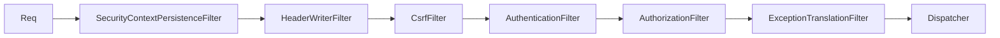
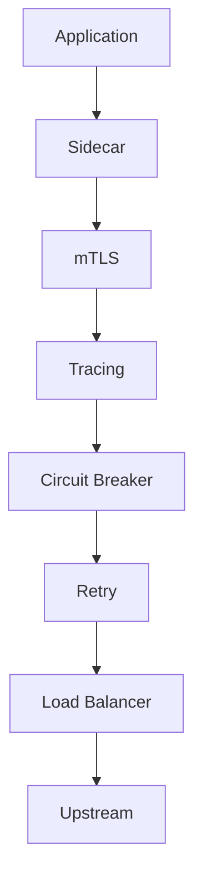
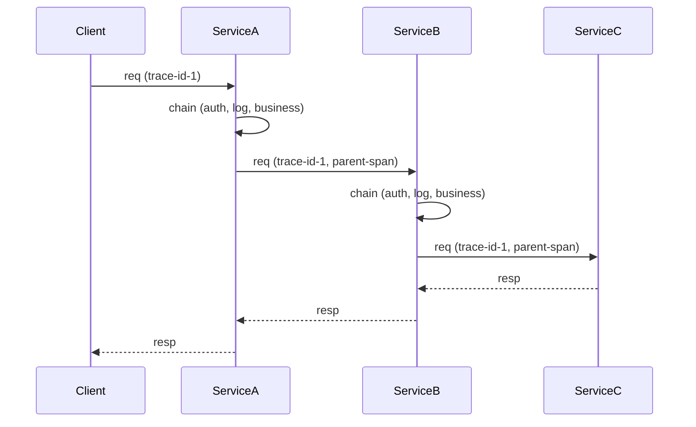

# Chain of Responsibility — Senior Level

> **Source:** [refactoring.guru/design-patterns/chain-of-responsibility](https://refactoring.guru/design-patterns/chain-of-responsibility)
> **Prerequisite:** [Middle](middle.md)

---

## Table of Contents

1. [Production middleware architectures](#production-middleware-architectures)
2. [API Gateway middleware (Kong, Envoy, Istio)](#api-gateway-middleware-kong-envoy-istio)
3. [gRPC interceptor chain](#grpc-interceptor-chain)
4. [Spring Security FilterChainProxy](#spring-security-filterchainproxy)
5. [AOP interception (Spring AOP, AspectJ)](#aop-interception-spring-aop-aspectj)
6. [Distributed CoR: tracing across services](#distributed-cor-tracing-across-services)
7. [Backpressure and async chains](#backpressure-and-async-chains)
8. [Idempotency in retried chains](#idempotency-in-retried-chains)
9. [Circuit breakers in the chain](#circuit-breakers-in-the-chain)
10. [Observability: metrics per handler](#observability-metrics-per-handler)
11. [Testing chains](#testing-chains)
12. [Configuration-driven chains](#configuration-driven-chains)
13. [Hot-swappable handlers](#hot-swappable-handlers)
14. [Security implications](#security-implications)
15. [Diagrams](#diagrams)

---

## Production middleware architectures

A modern HTTP API request hits 10-30 middlewares before reaching business logic:

```
Client → CDN → Load Balancer → API Gateway:
    ├─ TLS termination
    ├─ Auth (JWT validation)
    ├─ Rate limiting
    ├─ IP allow/deny
    ├─ Request transformation
    ├─ Routing
    ├─ Service mesh sidecar:
        ├─ Tracing (W3C Trace Context)
        ├─ Metrics
        ├─ mTLS
        ├─ Circuit breaker
        ├─ Retry
        ├─ Load balancing (per upstream)
    └─ Application:
        ├─ Logging filter
        ├─ Auth interceptor (Spring Security)
        ├─ Authorization (role check)
        ├─ Tenant context
        ├─ DB transaction (start/commit/rollback)
        ├─ Caching
        ├─ Validation
        ├─ Business handler
        └─ Response transform
```

Every layer is CoR. The whole stack is **layered chains within chains**. Each layer's handlers may reorder, swap, or short-circuit independently.

### Key insight

CoR is the **only** scalable way to compose this many independent concerns without giant if-else trees. Each handler does one thing; the chain assembles them.

---

## API Gateway middleware (Kong, Envoy, Istio)

### Kong

Kong's plugins are pure CoR:

```
Plugin Chain (per route):
    auth-key (auth)
    rate-limiting (throttle)
    cors (CORS headers)
    request-transformer (modify req)
    proxy (forward to upstream)
    response-transformer (modify resp)
    response-rate-limiting
    log (post-handle)
```

Each plugin is a Lua module with `access`, `header_filter`, `body_filter`, `log` hooks — onion model with multi-phase hooks.

Plugins configured per-service or globally. Order: weighted (`priority` field). Adding a plugin = config change, no code.

### Envoy

Envoy's filter chain (HTTP):

```
HttpConnectionManager:
    envoy.filters.http.fault
    envoy.filters.http.cors
    envoy.filters.http.jwt_authn
    envoy.filters.http.rbac
    envoy.filters.http.local_ratelimit
    envoy.filters.http.router    ← terminal
```

Each filter is a C++ class with `decodeHeaders / decodeData / decodeTrailers / encodeHeaders / encodeData`. Onion model with bidirectional traversal: decode (request path) and encode (response path).

Performance-critical: ~50ns per filter. C++ implementation; SIMD where applicable.

### Istio (Envoy + control plane)

Istio adds policy enforcement (Mixer, deprecated; now WASM/Rust filters). Service mesh = chain of network-level handlers transparent to the app.

---

## gRPC interceptor chain

```java
// Server interceptor (Java)
public class AuthServerInterceptor implements ServerInterceptor {
    @Override
    public <ReqT, RespT> ServerCall.Listener<ReqT> interceptCall(
            ServerCall<ReqT, RespT> call,
            Metadata headers,
            ServerCallHandler<ReqT, RespT> next) {
        String token = headers.get(Metadata.Key.of("authorization", ASCII_STRING_MARSHALLER));
        if (token == null) {
            call.close(Status.UNAUTHENTICATED, new Metadata());
            return new ServerCall.Listener<>() {};   // empty listener
        }
        return next.startCall(call, headers);   // forward
    }
}

// Build server with chain:
ServerInterceptor authInterceptor = new AuthServerInterceptor();
ServerInterceptor loggingInterceptor = new LoggingServerInterceptor();
ServerInterceptor tracingInterceptor = new TracingServerInterceptor();

Server server = ServerBuilder.forPort(50051)
    .addService(myService)
    .intercept(authInterceptor)
    .intercept(loggingInterceptor)
    .intercept(tracingInterceptor)
    .build();
```

`intercept` wraps in reverse order — interceptors form an onion.

Same pattern in Python (`grpc.aio.ServerInterceptor`), Go (`grpc.UnaryInterceptor` chains), .NET (`Interceptor`). Universal RPC pattern.

---

## Spring Security FilterChainProxy

Spring Security is **the** canonical Java CoR:

```java
@Configuration
@EnableWebSecurity
public class SecurityConfig {
    @Bean
    public SecurityFilterChain filterChain(HttpSecurity http) throws Exception {
        http
            .securityMatcher("/api/**")
            .csrf(c -> c.disable())
            .cors(c -> c.configurationSource(corsConfig()))
            .sessionManagement(s -> s.sessionCreationPolicy(STATELESS))
            .authorizeHttpRequests(a -> a
                .requestMatchers("/api/public/**").permitAll()
                .anyRequest().authenticated()
            )
            .oauth2ResourceServer(o -> o.jwt(j -> j.decoder(jwtDecoder())));
        return http.build();
    }
}
```

Spring assembles ~15 filters into a chain:

```
SecurityContextPersistenceFilter
HeaderWriterFilter
CorsFilter
CsrfFilter
LogoutFilter
BearerTokenAuthenticationFilter
AuthorizationFilter
RequestCacheAwareFilter
SecurityContextHolderAwareRequestFilter
AnonymousAuthenticationFilter
ExceptionTranslationFilter
... (terminal: dispatcher)
```

Order **matters**. Adding `addFilterBefore` / `addFilterAfter` requires understanding the existing chain. Misplacing a filter = vulnerability.

---

## AOP interception (Spring AOP, AspectJ)

Method interception is CoR around a method call:

```java
@Aspect
@Component
public class LoggingAspect {
    @Around("@annotation(Loggable)")
    public Object log(ProceedingJoinPoint pjp) throws Throwable {
        long start = System.currentTimeMillis();
        try {
            return pjp.proceed();   // forward — call next in chain (or actual method)
        } finally {
            log.info("{}: {}ms", pjp.getSignature(), System.currentTimeMillis() - start);
        }
    }
}
```

When multiple aspects target the same method, Spring AOP builds a **chain of `MethodInterceptor`s**:

```
JdkDynamicAopProxy:
    TransactionInterceptor
    CacheInterceptor
    LoggingInterceptor
    SecurityInterceptor
    → real method
```

`pjp.proceed()` invokes the next interceptor; eventually reaches the actual method. Pure CoR.

`@Order` controls position. `@Transactional`, `@Cacheable`, `@PreAuthorize` all interceptors.

---

## Distributed CoR: tracing across services

A request crosses services A → B → C. Tracing context (W3C Trace Context) is propagated through HTTP headers — extending CoR across the network:

```
Client → Service A (chain: trace-extract, auth, log, business, trace-inject)
       → Service B (chain: trace-extract, auth, log, business, trace-inject)
       → Service C (...)
```

Each service's CoR includes a trace propagation handler. The chain extends conceptually through the wire.

**Tools:** OpenTelemetry, Jaeger, Zipkin. Each adds CoR-style middleware to capture spans.

### Async / event-driven

Kafka consumer chain:

```java
KafkaListener:
    deserializer (CoR step 1)
    schema validator (step 2)
    auth check (step 3)
    handler (terminal)
```

Same pattern; different transport. The chain is logical, not physical.

---

## Backpressure and async chains

### Reactor / WebFlux

```java
@Component
public class ReactiveAuthFilter implements WebFilter {
    @Override
    public Mono<Void> filter(ServerWebExchange exchange, WebFilterChain chain) {
        ServerHttpRequest req = exchange.getRequest();
        String token = req.getHeaders().getFirst("Authorization");
        if (token == null) {
            return Mono.error(new UnauthorizedException());
        }
        return chain.filter(exchange);   // forward; returns Mono
    }
}
```

`Mono<Void>` propagates async completion. `chain.filter` returns the downstream's mono. Errors propagate via `Mono.error`.

Backpressure handled by Reactive Streams `request(n)`. If downstream slow, upstream signals demand → no overflow.

### Project Reactor's `WebFilterChain`

The chain itself is a `Flux<Filter>`, applied via `flatMap` over the chain. Spring builds it; user provides individual filters.

---

## Idempotency in retried chains

If your chain may be retried (transient failure, idempotency key), every handler must be idempotent — running twice = same effect as once.

### Bad

```java
class EmailNotifier extends Handler {
    public void handle(Request r) {
        emailService.send(r.email(), "purchased");   // sends every time
        next.handle(r);
    }
}

class PaymentHandler extends Handler {
    public void handle(Request r) {
        chargeCard(r.amount());   // charges every time!
        next.handle(r);
    }
}
```

Retry → email sent twice, card charged twice. Disaster.

### Good

```java
class EmailNotifier extends Handler {
    private final Set<String> sent = new ConcurrentHashSet<>();
    public void handle(Request r) {
        if (sent.add(r.idempotencyKey())) {
            emailService.send(r.email(), "purchased");
        }
        next.handle(r);
    }
}

class PaymentHandler extends Handler {
    public void handle(Request r) {
        // Stripe-style: idempotency key prevents double charge
        chargeCard(r.amount(), r.idempotencyKey());
        next.handle(r);
    }
}
```

Each handler accepts an idempotency key; deduplicates internally. Database-backed for durability.

---

## Circuit breakers in the chain

A circuit breaker handler short-circuits when downstream is failing:

```java
public class CircuitBreakerHandler extends Handler {
    private final CircuitBreaker breaker;

    public Response handle(Request req) {
        if (breaker.isOpen()) {
            return Response.error("service unavailable");   // fast-fail
        }
        try {
            Response resp = next.handle(req);
            breaker.recordSuccess();
            return resp;
        } catch (Exception e) {
            breaker.recordFailure();
            throw e;
        }
    }
}
```

States: closed (forward), open (short-circuit), half-open (test). Resilience4j, Hystrix (deprecated), Polly (.NET) provide ready implementations.

In the chain: circuit breakers wrap *downstream* handlers (especially network calls). Place close to the call site.

---

## Observability: metrics per handler

Each handler should emit metrics (latency, count, errors):

```java
public class MetricsMiddleware extends Middleware {
    private final MeterRegistry registry;
    private final String name;

    public Response handle(Request req) {
        Timer.Sample sample = Timer.start(registry);
        try {
            Response resp = next.handle(req);
            sample.stop(registry.timer(name + ".success"));
            return resp;
        } catch (Exception e) {
            sample.stop(registry.timer(name + ".error", "exception", e.getClass().getSimpleName()));
            throw e;
        }
    }
}
```

Wrap *each* downstream handler with metrics middleware (Decorator + CoR). Or build it into a base class:

```java
public abstract class InstrumentedHandler extends Handler {
    public void handle(Request r) {
        long start = System.nanoTime();
        try {
            doHandle(r);
        } finally {
            metrics.record(getClass().getSimpleName(), System.nanoTime() - start);
        }
        if (next != null) next.handle(r);
    }

    protected abstract void doHandle(Request r);
}
```

Free observability for every handler.

---

## Testing chains

### Test individual handlers in isolation

```java
@Test void authHandler_rejectsNoToken() {
    AuthHandler h = new AuthHandler();
    Handler downstream = mock(Handler.class);
    h.setNext(downstream);

    assertThrows(UnauthorizedException.class, () -> h.handle(new Request(null)));
    verify(downstream, never()).handle(any());   // didn't forward
}

@Test void authHandler_forwardsValidToken() {
    AuthHandler h = new AuthHandler();
    Handler downstream = mock(Handler.class);
    h.setNext(downstream);

    h.handle(new Request("valid-token"));
    verify(downstream).handle(any());   // forwarded
}
```

Mock `next`; verify forwarded or not.

### Integration test the chain

```java
@Test void chain_handlesRequestEndToEnd() {
    Handler chain = ChainBuilder.start()
        .add(new AuthHandler())
        .add(new LoggingHandler(logCapture))
        .add(new BusinessHandler(repo))
        .build();

    chain.handle(new Request("valid-token", "/users/1"));

    assertEquals(1, repo.findUsersCalled());
    assertTrue(logCapture.contains("/users/1"));
}
```

Test the full chain with realistic data. Catches order-dependent bugs.

### Property-based testing for chain order

```java
@Property
void chain_orderIndependent_forCommutative(@ForAll List<Handler> handlers, @ForAll Request req) {
    List<Handler> shuffled = new ArrayList<>(handlers);
    Collections.shuffle(shuffled);

    Response r1 = buildChain(handlers).handle(req);
    Response r2 = buildChain(shuffled).handle(req);

    assertEquals(r1, r2);
}
```

Doesn't always hold (most chains are order-dependent), but useful for verifying order *should* matter.

---

## Configuration-driven chains

Instead of hardcoding chain order in code, declare in YAML/JSON:

```yaml
handlers:
  - type: auth
    config:
      provider: jwt
  - type: rate-limit
    config:
      requests-per-minute: 60
  - type: routing
    config:
      target: business-handler
```

Loader:

```java
public class ChainLoader {
    public Handler load(File config) {
        List<HandlerConfig> configs = parse(config);
        Handler head = null, tail = null;
        for (HandlerConfig c : configs) {
            Handler h = factory.create(c.type(), c.config());
            if (head == null) head = h;
            else tail.setNext(h);
            tail = h;
        }
        return head;
    }
}
```

Reorder by editing YAML. Add new handler types via factory + class registration. Used by Kong, Envoy (xDS), Istio.

---

## Hot-swappable handlers

Production system: change rate-limit handler's config without restart. Wrap handlers in a holder:

```java
public class SwappableHandler extends Handler {
    private final AtomicReference<Handler> impl = new AtomicReference<>();

    public void swap(Handler newImpl) {
        impl.set(newImpl);
    }

    public void handle(Request r) {
        impl.get().handle(r);
        if (next != null) next.handle(r);
    }
}
```

Or use `ApplicationContext.refresh()` (Spring) to reload bean configs. Hot-config tools like Spring Cloud Config + `@RefreshScope` enable this.

---

## Security implications

CoR is security-critical for HTTP/RPC processing. Mistakes:

### 1. Auth filter placed after logging filter

Logger logs sensitive data; if auth fails, the logger has already exposed it. **Auth before logging.**

### 2. Trusting upstream headers

```java
class AuthFilter extends Handler {
    public void handle(Request r) {
        String user = r.header("X-User");   // trusts client header — vulnerability
        ctx.setUser(user);
        next.handle(r);
    }
}
```

If `X-User` comes from the client, attackers spoof it. **Strip security-related headers at gateway.** Set context only after verified token decode.

### 3. Skipping sanitization

If validation handler is skipped or bypassed (e.g., wrong path matcher), unsanitized data reaches business handler. **Default-deny:** every path goes through validation; allow-list specific bypasses.

### 4. Information leakage on errors

```java
class ErrorHandler extends Handler {
    public void handle(Request r) {
        try { next.handle(r); }
        catch (Exception e) {
            response.send("Error: " + e.getMessage());   // leaks DB queries, stack traces
        }
    }
}
```

In production: log details internally; return generic message externally.

### 5. Chain bypasses

```java
@Configuration
class SecurityConfig {
    @Bean
    public SecurityFilterChain api(HttpSecurity http) {
        return http.securityMatcher("/api/**")...build();   // chain only for /api
    }
}

// /admin/users — no chain → no auth → public access!
```

Default-deny: every path needs an explicit chain. Spring 6+ requires this.

---

## Diagrams

### Spring Security FilterChainProxy



15+ filters; reorderable; each with specific concerns.

### Service mesh sidecar



Network-level CoR transparent to the app.

### Chain in distributed system



CoR extends across the network via headers.

---

[← Middle](middle.md) · [Professional →](professional.md)
