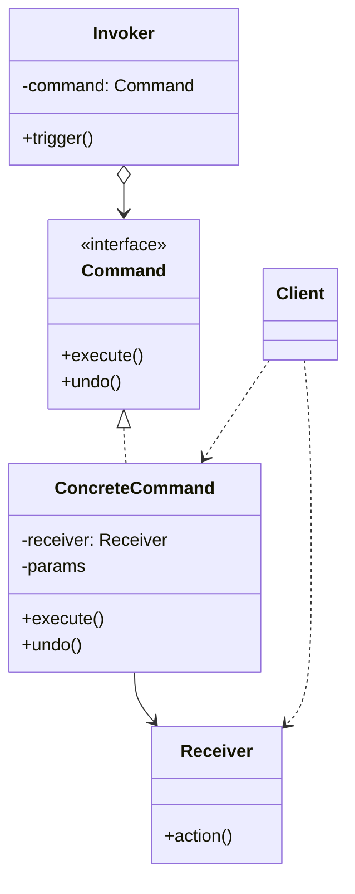
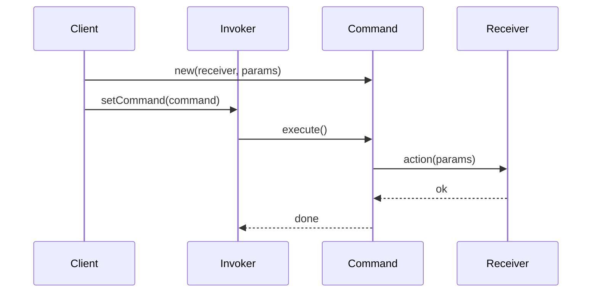

# Command — Junior Level

> **Source:** [refactoring.guru/design-patterns/command](https://refactoring.guru/design-patterns/command)
> **Category:** [Behavioral](../README.md) — *"Concerned with algorithms and the assignment of responsibilities between objects."*

---

## Table of Contents

1. [Introduction](#introduction)
2. [Prerequisites](#prerequisites)
3. [Glossary](#glossary)
4. [Core Concepts](#core-concepts)
5. [Real-World Analogies](#real-world-analogies)
6. [Mental Models](#mental-models)
7. [Pros & Cons](#pros--cons)
8. [Use Cases](#use-cases)
9. [Code Examples](#code-examples)
10. [Coding Patterns](#coding-patterns)
11. [Clean Code](#clean-code)
12. [Best Practices](#best-practices)
13. [Edge Cases & Pitfalls](#edge-cases--pitfalls)
14. [Common Mistakes](#common-mistakes)
15. [Tricky Points](#tricky-points)
16. [Test Yourself](#test-yourself)
17. [Tricky Questions](#tricky-questions)
18. [Cheat Sheet](#cheat-sheet)
19. [Summary](#summary)
20. [What You Can Build](#what-you-can-build)
21. [Further Reading](#further-reading)
22. [Related Topics](#related-topics)
23. [Diagrams & Visual Aids](#diagrams--visual-aids)

---

## Introduction

> Focus: **What is it?** and **How to use it?**

**Command** is a behavioral design pattern that turns a **request** into a **standalone object** containing all information about that request: the receiver, the method to call, and the arguments. Once it's an object, you can queue it, log it, undo it, retry it, or send it across a network.

Imagine a "Save" button. Pressing it executes "save the current document." A naïve approach: the button calls `document.save()` directly. The Command approach: the button doesn't know what `save` is — it holds a `Command` object whose `execute()` method does the saving. Now the same button can do anything — open, print, format — by holding a different command. The same command can be undone by remembering what it changed.

In one sentence: *"Wrap an action in an object so you can treat actions as data."*

Command is the foundation of undo/redo, task queues, transactional pipelines, macro recording, and remote procedure calls. Once an action is an object, you can do everything you can do with objects: store it, transmit it, schedule it, copy it, log it.

---

## Prerequisites

What you should know before reading this:

- **Required:** Basic OOP — interfaces, classes, polymorphism.
- **Required:** Composition. The Invoker holds a Command; the Command holds a Receiver.
- **Helpful:** First-class functions / lambdas — modern Command often degenerates to a closure.
- **Helpful:** Some experience with queues, history stacks, or pipelines — Command is the formal name for what enables them.

---

## Glossary

| Term | Definition |
|------|-----------|
| **Command** | The interface (or function type) describing the action: `execute()` (often plus `undo()`). |
| **Concrete Command** | A specific implementation that holds a Receiver and parameters. |
| **Receiver** | The object that knows how to actually perform the work. |
| **Invoker** | The object that triggers the command — a button, a scheduler, a queue. |
| **Client** | The code that creates the Command and binds it to its Receiver. |
| **Undo / Redo** | Reversing or replaying a Command. Optional but common. |
| **Macro Command** | A Command that wraps a sequence of other Commands. |
| **Idempotent Command** | A Command that can be safely re-executed (same result). |

---

## Core Concepts

### 1. The Action Becomes an Object

The textbook OOP move: instead of writing a method, write a class that *represents* the call.

```java
interface Command {
    void execute();
}

class SaveCommand implements Command {
    private final Document doc;
    public SaveCommand(Document doc) { this.doc = doc; }
    public void execute() { doc.save(); }
}
```

The `SaveCommand` object now *is* the action. You can store it, queue it, log it.

### 2. The Invoker Doesn't Know the Receiver

The button (Invoker) just calls `command.execute()`. It doesn't know whether `execute()` saves a doc or fires missiles. This decoupling is the win.

### 3. The Command Holds Everything It Needs

Receiver, parameters, context — all bundled into the Command object. This is what makes it transmissible: serialize the Command and you've serialized the request.

### 4. Optional `undo()` — Symmetry

```java
interface Command {
    void execute();
    void undo();
}
```

If a Command can describe how to *do* something, it can usually describe how to *un-do* it. That's the foundation of Ctrl+Z.

### 5. Distinct from Strategy

Both encapsulate behavior. **Strategy** is "pick one of several algorithms"; **Command** is "this is a thing-to-do, treat it as a unit." Strategy varies *how*; Command represents *what*.

---

## Real-World Analogies

| Concept | Analogy |
|---------|--------|
| **Command** | A written restaurant order: a complete description of the meal request, signed and dated. |
| **Concrete Command** | "Burger, no onions, well done, table 7." |
| **Receiver** | The chef who knows how to make a burger. |
| **Invoker** | The waiter who delivers orders to the kitchen, schedules them, and pulls them back if a customer changes their mind. |
| **Undo** | Cancelling an order before the chef starts. |
| **Macro** | "I want the lunch combo" — one order, multiple sub-orders. |

The classical refactoring.guru analogy is a **restaurant**: the customer doesn't shout instructions to the chef. They write an order on a slip; the waiter takes it to the kitchen; the chef makes the food. The slip can be queued, archived, modified, or ripped up.

Another good one is **transactions**: a database transaction is a Command. It's executed (commit) or undone (rollback). It's logged (WAL) so it can be replayed. It can be queued and dispatched in parallel.

---

## Mental Models

**The intuition:** Picture a TV remote. Each button has a Command attached. "Volume up" is a Command. "Channel 5" is a Command. The remote doesn't know how the TV works — it just sends Commands. The TV (Receiver) knows how to react. You could record a sequence of Commands to play back — that's a macro.

**Why this model helps:** It separates *who triggers* from *who does* from *what to do*. Three roles, clean separation.

**Visualization:**

```
   Client
     │ creates
     ▼
  ┌──────────┐
  │ Command  │──── holds ────►  Receiver
  │ execute()│                  (knows how)
  └────▲─────┘
       │ calls execute()
       │
   Invoker (button, queue, scheduler)
```

The Invoker triggers the Command; the Command delegates to the Receiver. Three roles; no one knows everything.

---

## Pros & Cons

| Pros | Cons |
|------|------|
| Decouples Invoker from Receiver | One class per action — overhead for trivial calls |
| Enables undo / redo | Need to design state-capture for undo |
| Commands can be queued, logged, transmitted | Each command has a lifecycle to manage |
| Supports macros / composite commands | Not every action makes sense as a Command |
| Makes async / scheduled execution natural | Adds indirection — stack traces longer |
| Open/Closed: new Commands without changing Invoker | Easy to over-engineer for simple cases |

### When to use:
- You need undo / redo
- Commands must be queued, retried, or scheduled
- You want to log what users did (audit trail)
- You're sending requests over a network or process boundary
- You need to compose actions into macros / scripts
- You want a clean transaction or task model

### When NOT to use:
- The action is one line and never changes — direct call is clearer
- There's no need for queuing, undo, logging, or transmission
- The "command" pattern is being added because someone read a book — not because it solves a problem

---

## Use Cases

Real-world places where Command is commonly applied:

- **Undo / redo** — text editors, drawing apps, IDEs.
- **Task queues** — Sidekiq, Celery, Resque, AWS SQS jobs. Each job is a Command.
- **Database transactions** — each statement is a Command; rollback is "undo."
- **CQRS** — Commands write state; Queries read it.
- **GUI buttons / menus** — `JButton.setAction(...)` is Command.
- **Macros / shell scripts** — sequences of Commands.
- **HTTP request handlers** — each request is a Command (serialized over the wire).
- **Game engines** — input replay, action history.
- **Scheduled jobs** — `cron`, `setTimeout`, `ScheduledExecutorService`.
- **Event sourcing** — Commands → Events → State.
- **Network protocols** — RPC: every call is a Command serialized.

---

## Code Examples

### Go

A simple text editor with undo.

```go
package main

import "fmt"

// Receiver.
type Document struct{ content string }

func (d *Document) Append(s string) { d.content += s }
func (d *Document) Print()          { fmt.Println(d.content) }

// Command.
type Command interface {
	Execute()
	Undo()
}

// Concrete Command.
type AppendCommand struct {
	doc  *Document
	text string
}

func (c *AppendCommand) Execute() { c.doc.Append(c.text) }
func (c *AppendCommand) Undo() {
	c.doc.content = c.doc.content[:len(c.doc.content)-len(c.text)]
}

// Invoker.
type Editor struct {
	history []Command
}

func (e *Editor) Run(c Command) {
	c.Execute()
	e.history = append(e.history, c)
}

func (e *Editor) Undo() {
	if len(e.history) == 0 {
		return
	}
	last := e.history[len(e.history)-1]
	last.Undo()
	e.history = e.history[:len(e.history)-1]
}

func main() {
	doc := &Document{}
	editor := &Editor{}

	editor.Run(&AppendCommand{doc, "hello "})
	editor.Run(&AppendCommand{doc, "world!"})
	doc.Print() // hello world!

	editor.Undo()
	doc.Print() // hello

	editor.Undo()
	doc.Print() // (empty)
}
```

**What it does:** Each append is a Command. The editor records history; `Undo()` reverses the last.

**How to run:** `go run main.go`

---

### Java

A remote control with multiple commands.

```java
public interface Command {
    void execute();
}

public final class Light {
    public void turnOn()  { System.out.println("light on"); }
    public void turnOff() { System.out.println("light off"); }
}

public final class LightOnCommand implements Command {
    private final Light light;
    public LightOnCommand(Light light) { this.light = light; }
    public void execute() { light.turnOn(); }
}

public final class LightOffCommand implements Command {
    private final Light light;
    public LightOffCommand(Light light) { this.light = light; }
    public void execute() { light.turnOff(); }
}

public final class RemoteControl {
    private Command slot;
    public void setCommand(Command c) { this.slot = c; }
    public void pressButton() { slot.execute(); }
}

public class Demo {
    public static void main(String[] args) {
        Light light = new Light();
        RemoteControl remote = new RemoteControl();

        remote.setCommand(new LightOnCommand(light));
        remote.pressButton();   // light on

        remote.setCommand(new LightOffCommand(light));
        remote.pressButton();   // light off
    }
}
```

**What it does:** The remote (Invoker) doesn't know what `pressButton` does. The Command does.

**How to run:** `javac *.java && java Demo`

---

### Python

A task queue using callable Commands.

```python
from collections import deque
from typing import Callable, Deque


class TaskQueue:
    """Invoker."""
    def __init__(self) -> None:
        self._queue: Deque[Callable[[], None]] = deque()

    def enqueue(self, task: Callable[[], None]) -> None:
        self._queue.append(task)

    def run_all(self) -> None:
        while self._queue:
            task = self._queue.popleft()
            try:
                task()
            except Exception as e:
                print(f"task failed: {e}")


def send_email(to: str, subject: str) -> None:
    print(f"emailing {to}: {subject}")


def charge_card(amount: float) -> None:
    print(f"charging ${amount}")


if __name__ == "__main__":
    queue = TaskQueue()

    # Each lambda IS a Command — it captures everything it needs.
    queue.enqueue(lambda: send_email("alice@example.com", "Welcome"))
    queue.enqueue(lambda: charge_card(99.99))
    queue.enqueue(lambda: send_email("alice@example.com", "Receipt"))

    queue.run_all()
```

**What it does:** Each callable is a Command. The queue (Invoker) executes them in order.

**How to run:** `python3 main.py`

---

## Coding Patterns

### Pattern 1: Command with `undo`

**Intent:** Capture enough state to reverse the action.

```java
public final class IncrementCommand implements Command {
    private final Counter counter;
    public IncrementCommand(Counter c) { this.counter = c; }
    public void execute() { counter.inc(); }
    public void undo()    { counter.dec(); }
}
```

**When:** Editors, IDEs, drawing apps. Anywhere users expect Ctrl+Z.

---

### Pattern 2: Command with snapshot (Memento-flavored)

**Intent:** When you can't compute the inverse, save the state before and restore on undo.

```java
public final class ReplaceTextCommand implements Command {
    private final Document doc;
    private final String newText;
    private String oldText;

    public ReplaceTextCommand(Document doc, String newText) {
        this.doc = doc;
        this.newText = newText;
    }

    public void execute() { oldText = doc.text(); doc.setText(newText); }
    public void undo()    { doc.setText(oldText); }
}
```

**When:** The action is destructive; the inverse can't be derived from the action alone.

---

### Pattern 3: Macro Command

**Intent:** Compose several commands into one transaction-like unit.

```java
public final class MacroCommand implements Command {
    private final List<Command> commands;
    public MacroCommand(List<Command> cs) { this.commands = cs; }

    public void execute() { for (Command c : commands) c.execute(); }
    public void undo()    {
        // Undo in reverse order.
        for (int i = commands.size() - 1; i >= 0; i--) commands.get(i).undo();
    }
}
```

**When:** Multi-step user actions — "format paragraph" = align + indent + spacing.

---

### Pattern 4: Functional Command

**Intent:** When the language has first-class functions, skip the interface.

```python
queue.enqueue(lambda: ship_order(order_id))
```

A closure *is* a Command. Modern languages favor this for one-shot tasks.

**When:** No `undo` needed. No serialization. Just queue and execute.

---

## Clean Code

- **Name commands as imperatives.** `SaveDocument`, `ChargeCard` — actions, not nouns. (Don't name them `Save` or `Charge`.)
- **Each Command does one thing.** A Command that "saves and emails and logs" is three Commands.
- **Make Commands immutable** when possible. Once created, parameters don't change.
- **Don't put business logic in the Command.** It should *call* the Receiver, not *be* the Receiver.
- **Document undo semantics.** Pure inverse, snapshot-based, or no undo? Be explicit.
- **Idempotent or not?** Especially for queued / network commands, document.

---

## Best Practices

- **Use `undo` only if you actually support it.** Don't write empty `undo()` methods.
- **Parameterize Commands at construction, not at execution.** Once created, the Command should run anywhere.
- **Make Commands serializable** if you'll queue or transmit them.
- **Track Command lifecycle:** created → queued → executing → completed (or failed).
- **For long-running Commands, support cancellation.**
- **Test Commands in isolation** with a fake Receiver.
- **For network Commands, design idempotency.** Retries are inevitable.

---

## Edge Cases & Pitfalls

- **Undo when state has been mutated externally.** "Undo append" is wrong if the doc was edited elsewhere. Either: forbid external edits while history exists, or version-check on undo.
- **Macro with partial failure.** Command 3 of 5 fails. Did you commit the first 2? Roll back? Document.
- **Commands holding stale references.** A Command captures `User` by reference; the user is deleted before execution.
- **Queued Commands and concurrency.** Two threads dequeue and execute the same Command — potential races.
- **Serialization gotchas.** A Command that holds a database connection can't be serialized.
- **Memory growth.** Unbounded undo history is a leak waiting to happen.
- **Action vs result.** Storing a Command isn't the same as storing its outcome. Don't conflate them.

---

## Common Mistakes

1. **Command IS the Receiver.** Putting business logic into the Command, not delegating to the Receiver.
2. **No undo support, but `undo()` exists.** Empty methods that mislead.
3. **Holding mutable references.** Commands should be self-contained snapshots.
4. **Stateful Commands shared across threads.** A Command should be a value, not a global.
5. **Naming as nouns.** `Save` instead of `SaveDocument` — verbs are clearer.
6. **One-line direct calls wrapped in Commands.** Premature abstraction.
7. **Storing Command results inside the Command.** Mutates immutability.

---

## Tricky Points

- **Command vs Strategy** — Both encapsulate behavior. Strategy varies *how* an algorithm works; Command represents *what action to perform*. Strategy is a noun-like role; Command is a verb-like one.
- **Command vs Function** — In modern languages, a function-type variable can be a Command. The pattern still applies; the boilerplate doesn't.
- **Sync vs async** — A Command's `execute()` may return immediately and complete later. Document.
- **Idempotency** — A Command run twice should usually produce the same effect. Especially crucial for network commands. Achieved with idempotency keys.
- **Replay** — In event-sourced systems, Commands are replayed to reconstruct state. They must be deterministic.
- **CQRS** — Commands modify state; Queries return state. Different models. Don't conflate.

---

## Test Yourself

1. What problem does Command solve?
2. Name the four roles in Command (Client, Invoker, Command, Receiver).
3. What's the difference between Command and Strategy?
4. When is `undo` impossible (or impractical)?
5. Why are queued Commands often required to be idempotent?
6. Give 5 real-world examples of Command.
7. What's a Macro Command?

---

## Tricky Questions

- **Q: Can a Command have a result?**
  A: Yes — Commands can return values, but classical Command is fire-and-forget. If you need a result, the pattern blends with Future / Promise.
- **Q: Why are queued commands usually idempotent?**
  A: At-least-once delivery. Network failures, retries, redeploys all cause duplicate execution. Idempotent Commands stay correct.
- **Q: Is a Spring `@Transactional` method a Command?**
  A: Conceptually yes — it's a unit of work with commit/rollback semantics. The pattern is implicit.
- **Q: Can I undo a Command that already failed?**
  A: Tricky. If `execute()` partially completed, you may need to undo whatever ran. Or design Commands to be atomic: all-or-nothing.

---

## Cheat Sheet

| Concept | One-liner |
|---|---|
| Intent | Encapsulate a request as an object |
| Roles | Client, Invoker, Command, Receiver |
| Hot loop | `command.execute()` |
| Sibling | Strategy (algorithm), Memento (state snapshot) |
| Modern form | A function / lambda that captures everything |
| Smell to fix | Direct calls everywhere when you need queue / undo / log |

---

## Summary

Command turns a request into an object. Once it's an object, you can queue, log, undo, retry, or transmit it. The Invoker (button, scheduler, queue) doesn't know what the Command does; the Command knows the Receiver who does.

Three things to remember:
1. **Action becomes an object.** With everything it needs to run.
2. **Three roles, one direction.** Invoker → Command → Receiver.
3. **`undo` is optional.** Add it when you actually support it.

If you find yourself writing custom queue / log / undo logic, Command is what you want.

---

## What You Can Build

- A text editor with undo / redo
- A task queue that enqueues lambdas as commands
- A remote control with hot-swappable button bindings
- A macro recorder that captures user actions
- A request log that lets you replay HTTP requests
- A CQRS write-side that processes commands

---

## Further Reading

- *Design Patterns: Elements of Reusable Object-Oriented Software* (GoF) — original Command chapter
- *Head First Design Patterns*, Chapter 6 — Command
- [refactoring.guru — Command](https://refactoring.guru/design-patterns/command)
- *Patterns of Enterprise Application Architecture* (Fowler) — Unit of Work, Service Layer
- [Martin Fowler — CQRS](https://martinfowler.com/bliki/CQRS.html)

---

## Related Topics

- [Strategy](../08-strategy/junior.md) — algorithm variation, not action wrapping
- [Memento](../05-memento/junior.md) — state snapshots, often used for undo
- [Chain of Responsibility](../01-chain-of-responsibility/junior.md) — for handler chains
- [Event Sourcing](../../../coding-principles/event-sourcing.md) — Commands persisted as events
- [CQRS](../../../coding-principles/cqrs.md) — Commands separated from Queries

---

## Diagrams & Visual Aids

### Class diagram



### Sequence: trigger → execute → receive



### Decision flow

```
              ┌──────────────────────┐
              │ Need to queue, log,  │
              │ undo, or transmit?   │
              └─────────┬────────────┘
                        │ yes
                        ▼
              ┌──────────────────────┐
              │ Action complex enough│
              │ to be its own thing? │
              └─────────┬────────────┘
                        │ yes
                        ▼
                  ──> Use Command
```

[← Back to Behavioral Patterns](../README.md) · [Middle →](middle.md)
