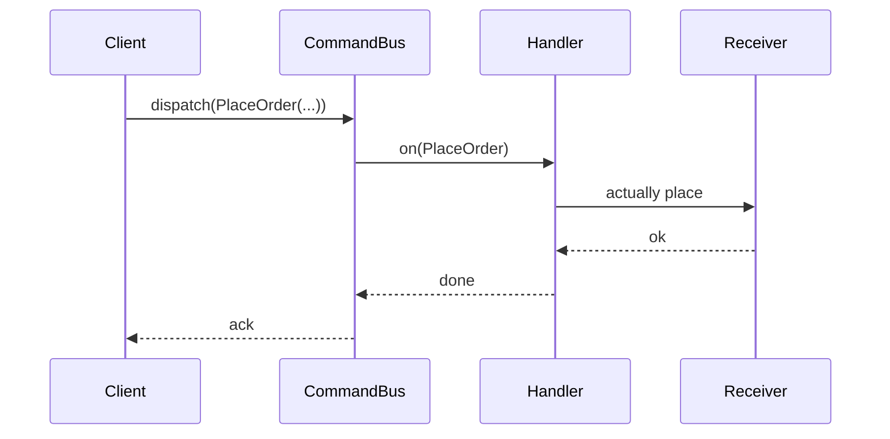
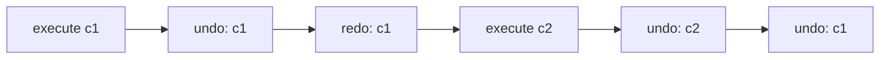

# Command — Middle Level

> **Source:** [refactoring.guru/design-patterns/command](https://refactoring.guru/design-patterns/command)
> **Prerequisite:** [Junior](junior.md)

---

## Table of Contents

1. [Introduction](#introduction)
2. [When to Use Command](#when-to-use-command)
3. [When NOT to Use Command](#when-not-to-use-command)
4. [Real-World Cases](#real-world-cases)
5. [Code Examples — Production-Grade](#code-examples--production-grade)
6. [Undo Strategies](#undo-strategies)
7. [Macro Commands & Transactions](#macro-commands--transactions)
8. [Trade-offs](#trade-offs)
9. [Alternatives Comparison](#alternatives-comparison)
10. [Refactoring to Command](#refactoring-to-command)
11. [Pros & Cons (Deeper)](#pros--cons-deeper)
12. [Edge Cases](#edge-cases)
13. [Tricky Points](#tricky-points)
14. [Best Practices](#best-practices)
15. [Tasks (Practice)](#tasks-practice)
16. [Summary](#summary)
17. [Related Topics](#related-topics)
18. [Diagrams](#diagrams)

---

## Introduction

> Focus: **When to use it?** and **Why?**

You already know Command is "wrap an action in an object." At the middle level the harder questions are:

- **Class or function?** When does each form fit?
- **What's the right granularity?** Per keystroke, per word, per paragraph?
- **How do you implement undo without leaking state?**
- **How do you handle partial failures in macros?**
- **Sync vs async?** Local vs queued?

This document focuses on **decisions and patterns** that turn textbook Command into something that survives a year of production.

---

## When to Use Command

Use Command when **all** of these are true:

1. **The action is meaningful as a thing — not just a function call.** It has identity.
2. **You need to queue, log, undo, retry, or transmit the action.** At least one of these.
3. **The Invoker shouldn't know the Receiver.** Decoupling is the goal.
4. **Actions can be composed or replayed.** Sequences, history, scripts.
5. **You can clearly define a Command's lifecycle.** Created → queued → executing → done / failed.

If most are missing, look elsewhere first.

### Triggers

- "We need Ctrl+Z." → Command.
- "Process this in the background." → Command (queued).
- "Replay user actions for debugging." → Command (logged).
- "Retry on network failure." → Command (idempotent + retried).
- "Execute these 5 actions atomically." → Macro Command.
- "Send the request over a message broker." → Command (serialized).

---

## When NOT to Use Command

- **The action is one line and never changes.** Inline call is clearer.
- **You don't need queueing, undo, logging, or transmission.** Pure overhead.
- **Every Command is one-method, one-receiver, no parameters.** Just call the method.
- **You're using Command because the textbook said so.** Pattern fatigue.

### Smell: anemic command

```java
class SaveCommand implements Command {
    public void execute() { document.save(); }
}
```

If a Command exists *just* to call one method on one Receiver with no parameters and no undo, it's overhead. Use the method directly or a `Runnable`.

---

## Real-World Cases

### Case 1 — IDE / editor undo stacks

VS Code, IntelliJ, Sublime: every edit is a Command pushed to the undo stack. Undo pops and reverses. Redo re-applies. Group small edits into transactional Commands so Ctrl+Z undoes a logical step, not a single character.

### Case 2 — Background job queues

Sidekiq (Ruby), Celery (Python), Resque, AWS SQS:

```python
@celery.task(bind=True, max_retries=5)
def send_welcome_email(self, user_id):
    user = User.get(user_id)
    email_service.send(user.email, "Welcome!")
```

Each task is a Command — serialized to the broker, dequeued by a worker, executed. Retries, dead-letter queues, idempotency are first-class.

### Case 3 — Spring's `@Async`

```java
@Service
class OrderService {
    @Async
    public CompletableFuture<Receipt> place(Order o) { ... }
}
```

The annotated call becomes a Command submitted to an executor. Caller gets a Future.

### Case 4 — `MessageDispatch` in CQRS

A Command bus dispatches Commands to handlers. Each Command is a record (class with data); each handler is the Receiver. Clean separation between intent and implementation.

```java
record PlaceOrder(String orderId, String userId, List<Item> items) {}

@CommandHandler
class PlaceOrderHandler {
    public void on(PlaceOrder cmd) { ... }
}
```

### Case 5 — Database transactions

A SQL transaction is a Command. Each statement is a sub-command. Commit executes; rollback undoes. WAL (write-ahead log) records Commands so they can be replayed after a crash.

### Case 6 — Game engines: input recording

Replay systems record every input as a timestamped Command. Replaying the same Commands deterministically reconstructs the game session. Core to esports replays, AI training, and bug repro.

### Case 7 — Macro recorders

Excel macros, Photoshop actions: a sequence of recorded Commands. Replay with one click.

---

## Code Examples — Production-Grade

### Example A — Editor with grouped undo (Java)

```java
public final class EditorHistory {
    private final Deque<Command> undoStack = new ArrayDeque<>();
    private final Deque<Command> redoStack = new ArrayDeque<>();

    public void execute(Command c) {
        c.execute();
        undoStack.push(c);
        redoStack.clear();   // any new action invalidates redo
    }

    public void undo() {
        if (undoStack.isEmpty()) return;
        Command c = undoStack.pop();
        c.undo();
        redoStack.push(c);
    }

    public void redo() {
        if (redoStack.isEmpty()) return;
        Command c = redoStack.pop();
        c.execute();
        undoStack.push(c);
    }
}
```

Two stacks, simple invariants. Can be wrapped to support grouping ("typing in a row coalesces into one undo").

---

### Example B — Job with retry and idempotency (Python)

```python
import time
import uuid
from typing import Callable


class Job:
    def __init__(self, fn: Callable[[], None], idempotency_key: str | None = None):
        self.id = str(uuid.uuid4())
        self.fn = fn
        self.idempotency_key = idempotency_key or self.id
        self.attempts = 0

    def run(self, max_attempts: int = 5) -> bool:
        while self.attempts < max_attempts:
            self.attempts += 1
            try:
                self.fn()
                return True
            except Exception as e:
                wait = min(60, 2 ** self.attempts)
                print(f"job {self.id} attempt {self.attempts} failed: {e}; retry in {wait}s")
                time.sleep(wait)
        return False
```

Each Job is a Command. Idempotency key allows the Receiver to dedupe across retries.

---

### Example C — Command bus (TypeScript)

```typescript
type CommandHandler<C> = (cmd: C) => Promise<void> | void;

class CommandBus {
    private handlers = new Map<Function, CommandHandler<any>>();

    register<C>(cmdClass: new (...args: any[]) => C, handler: CommandHandler<C>): void {
        this.handlers.set(cmdClass, handler);
    }

    async dispatch<C extends object>(cmd: C): Promise<void> {
        const h = this.handlers.get(cmd.constructor as any);
        if (!h) throw new Error(`no handler for ${cmd.constructor.name}`);
        await h(cmd);
    }
}

class PlaceOrder {
    constructor(public orderId: string, public items: string[]) {}
}

const bus = new CommandBus();
bus.register(PlaceOrder, async (cmd) => {
    console.log(`placing order ${cmd.orderId}`);
});

bus.dispatch(new PlaceOrder("o1", ["item-a", "item-b"]));
```

Type-safe handler dispatch. Ready for queue / logging interceptors.

---

### Example D — Macro Command with rollback on failure

```java
public final class TransactionalMacro implements Command {
    private final List<Command> commands;
    private final List<Command> executed = new ArrayList<>();

    public TransactionalMacro(List<Command> commands) { this.commands = commands; }

    public void execute() {
        try {
            for (Command c : commands) {
                c.execute();
                executed.add(c);
            }
        } catch (Exception e) {
            // Roll back what we did.
            for (int i = executed.size() - 1; i >= 0; i--) {
                try { executed.get(i).undo(); }
                catch (Exception undoErr) { /* log; can't recover further */ }
            }
            throw e;
        }
    }

    public void undo() {
        for (int i = commands.size() - 1; i >= 0; i--) commands.get(i).undo();
    }
}
```

If step 3 of 5 fails, steps 1 and 2 are undone. Steps 4-5 never execute.

---

## Undo Strategies

### 1. Inverse computation

The Command knows how to compute its inverse.

```java
class IncrementCommand {
    public void execute() { counter.inc(); }
    public void undo()    { counter.dec(); }
}
```

Cheap if the inverse is deterministic. Doesn't work if the inverse depends on prior state.

### 2. Memento (snapshot)

Capture state before; restore on undo.

```java
class ReplaceTextCommand {
    private String oldText;
    public void execute() {
        oldText = doc.text();
        doc.setText(newText);
    }
    public void undo() { doc.setText(oldText); }
}
```

Always works; uses memory proportional to state size. Preferred when "undo" is more than a single property change.

### 3. Event sourcing

Don't store snapshots; store events. Undo = rebuild state without the last event.

```
events: [E1, E2, E3, E4]
undo of E4: state = replay(E1, E2, E3)
```

Heavy compute; perfect audit; common in finance, accounting.

### 4. Soft delete + tombstone

Instead of true delete, mark "deleted" with a flag. Undo flips the flag back.

```sql
UPDATE users SET deleted_at = NULL WHERE id = ?;   -- "undo delete"
```

Simple; but stores forever. Common in systems where data is sensitive (audit).

### 5. No undo

Some actions can't be undone — sending an email, charging a card. Provide *compensating* commands instead: `RefundCharge` rather than `UndoCharge`. Honest naming.

---

## Macro Commands & Transactions

A Macro Command is a Composite of Commands. The questions:

### All-or-nothing?

If step 3 fails, do you keep steps 1 and 2? Two answers:

**Saga / compensating transaction**: keep steps 1 and 2; emit `Compensate1`, `Compensate2`.

**True rollback**: undo steps 1 and 2 in reverse order. Requires undo to be reliable.

### Order

Execute in order; undo in reverse order. Always.

### Partial replay

If step 3 fails and is retried, do steps 1-2 re-execute? Idempotency of each sub-command says no — only step 3 retries. Otherwise yes — re-run the macro from start.

### Distributed?

If the macro spans services, you've moved into Saga territory. The pattern is recognizable but the failure modes are deeper.

---

## Trade-offs

| Trade-off | Cost | Benefit |
|---|---|---|
| Class per Command | Boilerplate | Identity, naming, testability |
| Function per Command | Concise | Less ceremony when no undo needed |
| Snapshot for undo | Memory | Universal applicability |
| Inverse computation | Engineering effort | Cheap memory |
| Macro Commands | Complexity | Atomicity / scripting |
| Async / queued Commands | Indirection | Non-blocking execution |

---

## Alternatives Comparison

| Pattern | Use when |
|---|---|
| **Command** | Action needs queuing, undo, logging, transmission |
| **Strategy** | Multiple algorithms picked at runtime |
| **Function / lambda** | One-shot action with no extras |
| **Event** | Notification of past fact (Observer) |
| **Memento** | State snapshot for undo |
| **Saga** | Distributed transaction across services |
| **Workflow engine** | Long-running sequenced commands with persistence |

---

## Refactoring to Command

### Symptom
A method that does several things, with a comment "// TODO: support undo" or "// TODO: queue this."

```java
public void chargeAndShip(Order o) {
    paymentService.charge(o.cents());
    shippingService.create(o);
    notificationService.send(o.customer(), "Shipped!");
}
```

### Steps
1. **Identify the action units.** Each line might be a Command.
2. **Define a `Command` interface.** With `execute()` and (if relevant) `undo()`.
3. **Wrap each action** in a Concrete Command class.
4. **Move the orchestration** to a Macro Command or to an Invoker that runs them in sequence.
5. **Add features:** queue, retry, undo, log.

### After

```java
public void chargeAndShip(Order o) {
    Command macro = new TransactionalMacro(List.of(
        new ChargeCommand(payment, o.cents()),
        new ShipCommand(shipping, o),
        new NotifyCommand(notif, o.customer(), "Shipped!")
    ));
    macro.execute();
}
```

Now you can: log each Command, retry, queue across services, etc.

---

## Pros & Cons (Deeper)

| Pros | Cons |
|---|---|
| **Identity for actions** — name, log, observe | Class explosion if every method becomes a Command |
| **Universal undo / redo machinery** | Undo design is non-trivial |
| **Queue / retry / schedule for free** | Lifecycle to manage |
| **Network-friendly** (serializable) | Serialization gotchas (refs, connections) |
| **Macros + scripting** | Partial-failure recovery is hard |
| **Open/Closed** — new Commands without changing Invoker | Indirection lengthens stack traces |

---

## Edge Cases

### 1. Mutable references in Commands

```java
class SaveCommand {
    private final Document doc;   // shared
    public void execute() { doc.save(); }   // doc may have changed
}
```

If `doc` is shared and mutated, the Command captures the *current state* at execution, not at creation. Document this — sometimes you want a snapshot.

### 2. Long-running Commands

A Command that takes 10 minutes to execute should support cancellation, progress reporting, and time-out. The simple `execute()` interface doesn't suffice; you need `execute(Cancellable)` or similar.

### 3. Concurrency

Two threads executing the same Command instance. If the Command holds mutable state (e.g., `attempts` counter), races. Either synchronize or make it immutable.

### 4. Command result

Classical Command is `void execute()`. If you need a result, blend with Future:

```java
interface Command<R> { R execute(); }
```

Or:

```java
interface Command { CompletableFuture<Result> execute(); }
```

### 5. Schema migration of stored Commands

If Commands are persisted (queue, event log) and you change their fields, deserialization breaks. Versioning or backwards-compatible schemas required.

---

## Tricky Points

### Command vs Method Object

A Command is essentially a Method Object — a class wrapping a method call. The pattern's value is in *what you do with it*: queue, log, undo. If you don't do any of those, it's overhead.

### Command vs Event

Subtle but important:
- **Command**: an *intent* to do something. May be rejected.
- **Event**: a *fact* that happened. Cannot be rejected.

`PlaceOrder` is a Command. `OrderPlaced` is an Event. Lots of CQRS systems get this wrong.

### Command identity

For idempotency and dedup, give each Command an ID. Receivers can check "have I already processed this ID?" before executing. Critical for at-least-once delivery.

### Sync vs async undo

A synchronous Command's `undo()` can run inline. An async Command's undo is more complex — the original Receiver may have already moved on. Document the model.

---

## Best Practices

- **Make Commands immutable.** Once created, no mutation.
- **Document undo semantics** — pure inverse, snapshot, or unsupported.
- **Provide an idempotency key** for queued Commands.
- **Test Commands in isolation** with a fake Receiver.
- **Group user-visible actions** for sane undo (don't undo per-character).
- **Cap undo history.** Unbounded = memory leak.
- **Log Commands for replay.** At minimum, name + parameters + timestamp.
- **Beware deserialization across versions.** Schema-evolve Commands carefully.

---

## Tasks (Practice)

1. **Editor with undo / redo.** Append, delete, and replace; Ctrl+Z, Ctrl+Y.
2. **Task queue with idempotency keys.** Enqueue jobs by key; dedup duplicates.
3. **Macro recorder.** Record, save, replay sequences of actions.
4. **Transactional macro.** Execute or roll back atomically.
5. **Async Command bus.** `dispatch(cmd)` returns a Future.
6. **Command serialization.** Serialize a Command to JSON; deserialize; execute.

(Solutions in [tasks.md](tasks.md).)

---

## Summary

At the middle level, Command is not just "wrap a method." It's:

- **Identity** — actions become things with names, IDs, lifetimes.
- **Reversibility** — undo via inverse, snapshot, or compensating commands.
- **Composability** — macros, transactions, sagas.
- **Transmissibility** — queues, networks, replay logs.
- **Lifecycle** — created → queued → executing → completed / failed.

The win is treating actions as first-class data. The cost is class explosion if applied indiscriminately.

---

## Related Topics

- [Memento](../05-memento/middle.md) — for snapshot-based undo
- [Strategy](../08-strategy/middle.md) — algorithm variation
- [Saga pattern](../../../coding-principles/saga.md) — distributed transactions
- [CQRS](../../../coding-principles/cqrs.md)
- [Event sourcing](../../../coding-principles/event-sourcing.md)

---

## Diagrams

### Command bus



### Undo / redo stacks



[← Junior](junior.md) · [Senior →](senior.md)
