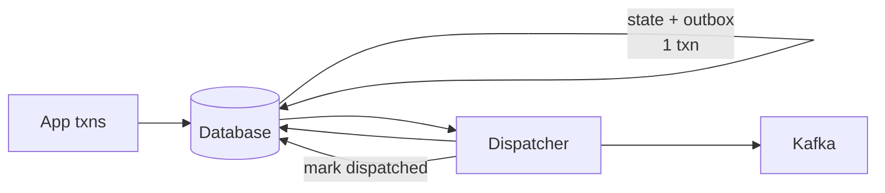
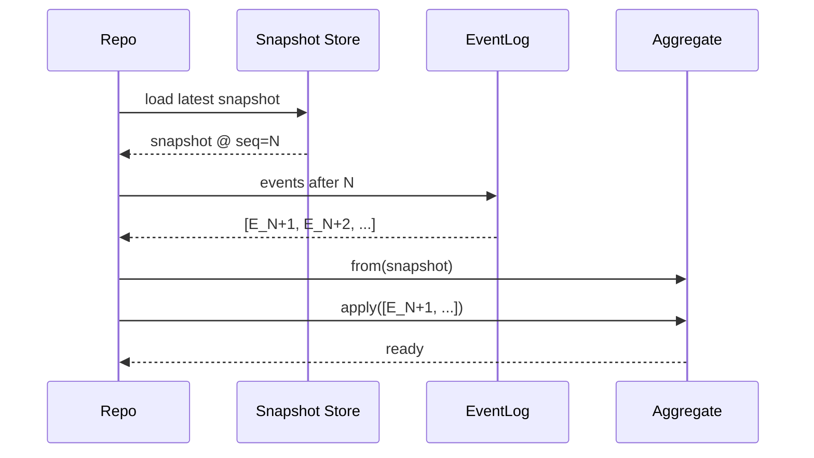

# Command — Professional Level

> **Source:** [refactoring.guru/design-patterns/command](https://refactoring.guru/design-patterns/command)
> **Prerequisite:** [Senior](senior.md)

---

## Table of Contents

1. [Introduction](#introduction)
2. [Serialization Internals](#serialization-internals)
3. [Command Schema Evolution](#command-schema-evolution)
4. [Lock-free Command Dispatch](#lock-free-command-dispatch)
5. [Idempotency Store Design](#idempotency-store-design)
6. [Outbox Performance](#outbox-performance)
7. [Replay Performance](#replay-performance)
8. [Snapshot Strategies](#snapshot-strategies)
9. [Workflow Engine Internals](#workflow-engine-internals)
10. [Cross-Language Comparison](#cross-language-comparison)
11. [Microbenchmark Anatomy](#microbenchmark-anatomy)
12. [Diagrams](#diagrams)
13. [Related Topics](#related-topics)

---

## Introduction

A Command at the professional level is examined for what the runtime makes of it: how it serializes, how dispatch scales, where the cost of idempotency stores lives, and what makes workflow engines and event-sourced systems fast or slow.

For high-throughput systems — payment platforms, exchanges, large e-commerce — the Command machinery itself is the system's spine. This document quantifies it.

---

## Serialization Internals

### JSON

Most Commands serialize to JSON.

```java
record PlaceOrder(String orderId, String userId, List<Item> items) {}
String json = mapper.writeValueAsString(cmd);
```

Pros: human-readable, language-agnostic, schema-flexible.
Cons: text-heavy (~3-5× protobuf), slow to parse.

**Throughput:** Jackson can serialize ~10K simple records/sec on a single thread; deserialize half that.

### Protobuf

```proto
message PlaceOrder {
    string order_id = 1;
    string user_id = 2;
    repeated Item items = 3;
}
```

Pros: compact, fast, schema-versioned.
Cons: requires `.proto` files, less inspectable.

**Throughput:** ~10× faster than JSON for typical Commands.

### Avro / Kryo / others

- **Avro**: schema-required; great for Kafka.
- **Kryo**: very fast for in-process; less interop.
- **MessagePack**: JSON-shape, binary.

Choose by ecosystem. Don't default to JSON if you're sending billions of Commands.

### Cost of reflection

Many JSON libraries use reflection by default. For high-throughput services, generated serializers (Jackson modules, Kotlinx Serialization, dataclasses-json with codegen) can be 2-5× faster.

---

## Command Schema Evolution

### Backward compatibility

A new producer adds a field; old consumers must still parse.

- **JSON**: ignored unknown fields. Compatible by default if consumers tolerate them.
- **Protobuf**: explicit field numbers. New fields ignored by old code.
- **Avro**: schema registry mediates; old + new schemas resolved.

### Forward compatibility

Old producers, new consumers. Consumers must handle missing fields.

```protobuf
message PlaceOrder {
    string order_id = 1;
    optional string promo_code = 5;   // optional → consumers handle absence
}
```

### Removing a field

Only safe after every consumer no longer reads it. Track usage; remove in a later release.

### Renaming a field

Don't. Add the new field; deprecate the old; remove later. Renaming breaks both directions.

### Schema registry

Confluent Schema Registry, Apicurio, AWS Glue Schema Registry. Enforces compatibility on write. Can prevent producers from publishing breaking schemas.

### Tombstones for deletion

In event-sourced systems, deletion is a Command of its own. The original event remains; a `Deleted` event marks it. Don't overwrite history.

---

## Lock-free Command Dispatch

### Hand-off via queue

```java
class Bus {
    private final BlockingQueue<Command> queue = new ArrayBlockingQueue<>(10_000);

    public void dispatch(Command c) { queue.offer(c); }
    public Command take() throws InterruptedException { return queue.take(); }
}
```

Producer enqueues; consumer dequeues. `ArrayBlockingQueue` uses a single ReentrantLock — fine for moderate throughput.

### Disruptor

For ultra-high throughput, the LMAX Disruptor (also useful for Observer) is a lock-free ring buffer. Used in low-latency Command dispatch (trading, payments).

### Multi-producer / single-consumer

A common pattern for event sourcing: many threads issue Commands; a single thread serializes them into the event log. This sidesteps coordination and matches the "single writer" principle.

```
Producers --> Queue --> Single consumer (writer to log)
```

Throughput: bounded by the single consumer's processing rate. Often acceptable since the log append is fast.

---

## Idempotency Store Design

The "have I seen this Command ID?" question scales with Command volume.

### In-memory map (development)

```java
Set<UUID> seen = ConcurrentHashMap.newKeySet();
```

Fine for a single instance; loses data on restart; doesn't scale across instances.

### Redis with TTL

```redis
SET idemp:<key> <result> NX EX 86400
```

`NX` (only if not exists) makes the check atomic. TTL avoids unbounded growth.

### DynamoDB / Cosmos

Conditional writes on partition + sort key. Cross-region replication for durability. Expensive but battle-tested.

### Database table with primary key

```sql
INSERT INTO idempotency_keys (key, result, expires_at) VALUES (...);
-- duplicate → unique constraint violation → already processed
```

Simple, durable, free tier. Less performant than Redis at scale.

### Hybrid

Hot path: Redis. Persistent fallback: DB. If Redis is unavailable, slow but correct.

### Storage cost

Idempotency keys grow with traffic. With 1000 Commands/sec and 24-hour TTL: ~86M keys. At ~100 bytes each: ~9 GB. Plan accordingly.

---

## Outbox Performance

### Polling overhead

A naive outbox polls every 100 ms. For a busy DB, that's frequent index scans.

```sql
SELECT * FROM outbox WHERE dispatched_at IS NULL ORDER BY id LIMIT 100;
```

Optimize:

- Index `(dispatched_at) WHERE dispatched_at IS NULL` (partial index).
- Increase batch size (1000 or more).
- Tune polling interval to traffic.

### Parallel dispatchers

Multiple dispatcher instances can process the outbox. Use `SELECT ... FOR UPDATE SKIP LOCKED` (Postgres) so different workers see different rows.

### CDC instead of polling

Debezium tails the WAL and emits row changes as events. No polling overhead. Higher operational complexity but zero impact on the DB.

### Pruning

Old dispatched rows accumulate. Periodic delete (e.g., older than 7 days). Or archive to cold storage.

---

## Replay Performance

For event-sourced aggregates, loading state means replaying events.

### Naive replay

```
load all events → for each: apply
```

For an aggregate with 100K events, this is slow. 1ms per event = 100 sec.

### Snapshots

```
load latest snapshot @ event N → apply events from N+1 onwards
```

Save a snapshot every 1000 events. Worst-case replay = 1000 events.

### Stream-based replay

For projections (read models), don't load events into memory; stream them and update the projection incrementally. Backpressure-aware.

### Parallel replay

For independent aggregates, replay them in parallel. The event log is partitioned (Kafka style).

---

## Snapshot Strategies

### Synchronous snapshot

After every Nth event, write a snapshot in the same transaction. Slows writes; guarantees freshness.

### Asynchronous snapshot

A separate process replays events and persists snapshots. Eventual freshness; faster writes.

### Snapshot TTL / cleanup

Older snapshots can be deleted; only the most recent is needed for replay. Store all if storage is cheap and time-travel is valued.

### Snapshot format evolution

Snapshots are serialized aggregates. Schema evolution applies — but you can always replay from events, so old snapshots can be discarded if breaking changes happen.

---

## Workflow Engine Internals

### Temporal / Cadence — event history

Every workflow step (Command, activity result, signal) is appended to a history log. The workflow code is *deterministic*; replaying it reconstructs state.

```
History: [Started, ScheduleActivity(Charge), ActivityCompleted(Charge), ...]
```

Worker crashes? Reschedule. Replay history. Continue.

### Activities

Activities are non-deterministic side effects (HTTP calls, DB writes). They're recorded with input + output in the history. Replays use the recorded result.

### Signals & queries

External events to a running workflow. Signals append to history; queries read state without modifying it.

### Sticky cache

Workers cache workflow state in memory. If the workflow is invoked on the same worker, no replay needed. Otherwise, replay from history.

### Throughput

Temporal can process tens of thousands of workflows per second per cluster. Most cost is the persistent history.

---

## Cross-Language Comparison

| Language | Primary Command Mechanism | Notes |
|---|---|---|
| **Java/JVM** | Axon, Spring CommandGateway | Strong CQRS / event-sourcing ecosystems |
| **Kotlin** | Coroutines + sealed classes | Modern; type-safe |
| **C#** | MediatR, MassTransit | First-class CQRS libraries |
| **Go** | Plain functions, channels | Idiomatic; less framework-heavy |
| **Python** | Celery, Dramatiq, RQ | Task queues are the dominant Command mechanism |
| **Rust** | `tokio` channels + `enum` Commands | Type-safe; growing ecosystem |
| **JavaScript/TS** | NestJS CQRS, Bull (Redis), Temporal SDK | NestJS adopts the CQRS lingo |
| **Erlang/Elixir** | Process mailbox messages | Each message is a Command; OTP handles dispatch |

### Key contrasts

- **Erlang's actor model** is Command at language level. Every cast/call is a Command to a process.
- **Go channels** are minimalist Command queues — no built-in retry / persistence.
- **Python task queues** dominate; classes-as-Commands is rare in idiomatic Python.

---

## Microbenchmark Anatomy

### In-process Command dispatch

```java
@State(Scope.Benchmark)
public class CommandBench {
    Bus bus = new Bus();
    Command cmd = new IncrementCommand(counter);

    @Benchmark public void execute() { bus.dispatch(cmd); }
}
```

Numbers: ~50-100 ns per dispatch through a typed bus (handler lookup + reflection-free). Scales with handler count if dispatch isn't typed.

### Queued Command dispatch (Redis)

Network roundtrip: ~200-500 µs LAN. Throughput per producer: ~5K Commands/sec. Scale by sharding.

### Event-sourced write

Append to event log: ~ms (synchronous fsync). Throughput per partition: ~10K events/sec. Multiple partitions for higher throughput.

### Idempotency check (Redis)

GET + SET-NX: ~200 µs. Throughput: 5K-50K/sec depending on Redis sizing.

### JMH pitfalls

- Constant Command instances — JIT might fold dispatch.
- Lambda capture allocation per call — confounds measurements.
- DCE on no-op commands — use `Blackhole.consume`.

---

## Diagrams

### Outbox throughput



### Event-sourced aggregate load



---

## Related Topics

- [Schema evolution](../../../coding-principles/schema-evolution.md)
- [Event sourcing internals](../../../coding-principles/event-sourcing.md)
- [Saga & compensations](../../../coding-principles/saga.md)
- [Workflow engines](../../../infra/workflows.md)
- [Idempotency at scale](../../../coding-principles/idempotency.md)

[← Senior](senior.md) · [Interview →](interview.md)
