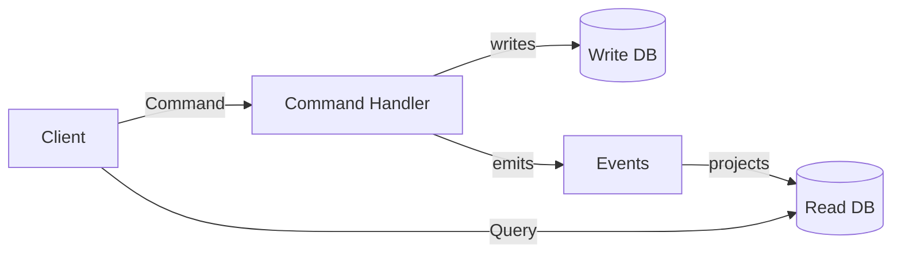
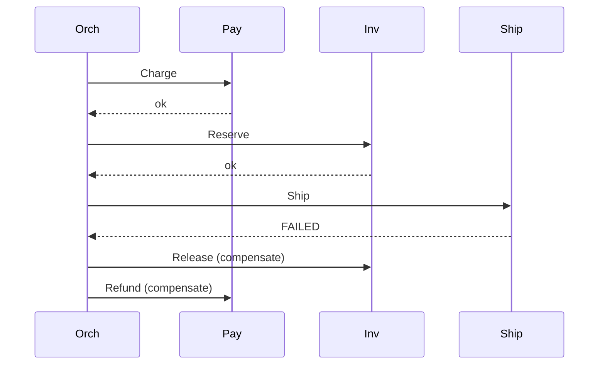

# Command — Senior Level

> **Source:** [refactoring.guru/design-patterns/command](https://refactoring.guru/design-patterns/command)
> **Prerequisite:** [Middle](middle.md)

---

## Table of Contents

1. [Introduction](#introduction)
2. [Command at Architectural Scale](#command-at-architectural-scale)
3. [CQRS Deep Dive](#cqrs-deep-dive)
4. [Event Sourcing & Command Replay](#event-sourcing--command-replay)
5. [Sagas — Distributed Commands](#sagas--distributed-commands)
6. [Idempotency at Scale](#idempotency-at-scale)
7. [Concurrency & Optimistic Locking](#concurrency--optimistic-locking)
8. [Code Examples — Advanced](#code-examples--advanced)
9. [Real-World Architectures](#real-world-architectures)
10. [Pros & Cons at Scale](#pros--cons-at-scale)
11. [Trade-off Analysis Matrix](#trade-off-analysis-matrix)
12. [Migration Patterns](#migration-patterns)
13. [Diagrams](#diagrams)
14. [Related Topics](#related-topics)

---

## Introduction

> Focus: **At scale, what breaks? What earns its keep?**

In toy code Command is "wrap a method." In production it is "every state change in this aggregate is a Command, persisted to a log, replayable for forensic and recovery, idempotent for at-least-once delivery, and orchestrated as a Saga across 5 services." The senior question isn't "do I write Command?" — it's **"how do I bound failures, dedupe duplicates, and reason about correctness across a distributed system of Commands?"**

At scale Command intersects with:

- **CQRS** — Commands modify; Queries read.
- **Event sourcing** — Commands → Events → State.
- **Sagas** — distributed transactions.
- **Outbox** — atomicity between state change and dispatch.
- **Workflow engines** — Temporal, Cadence, AWS Step Functions.

These are Command at architectural scale; the fundamentals apply but operational concerns dominate.

---

## Command at Architectural Scale

### 1. Spring's `CommandGateway` (Axon)

```java
@Service
class OrderService {
    private final CommandGateway gateway;

    public void place(PlaceOrder cmd) {
        gateway.send(cmd);   // routed to a CommandHandler
    }
}

@Aggregate
class OrderAggregate {
    @CommandHandler
    public OrderAggregate(PlaceOrder cmd) {
        apply(new OrderPlaced(cmd.orderId(), cmd.items()));
    }
}
```

A typed Command bus dispatches to handlers (often inside aggregates). Built-in support for retry, deduplication, distributed routing.

### 2. Temporal / Cadence workflows

Workflows are deterministic Commands; activities are non-deterministic side effects.

```python
@workflow.defn
class OrderWorkflow:
    @workflow.run
    async def run(self, order: Order) -> Receipt:
        await workflow.execute_activity(charge_card, order.cents(), schedule_to_close_timeout=...)
        await workflow.execute_activity(ship_order, order, ...)
        return Receipt.ok(order.id())
```

Workflows survive process restarts because their Commands are persisted and replayed.

### 3. Kubernetes — controller pattern

Each controller (Deployment, ReplicaSet, StatefulSet) reconciles desired state by issuing Commands via the API. Every API call is a Command in REST clothing.

### 4. Database WAL

Every write is a Command logged to disk before being applied. On crash, replay the log to reconstruct state. PostgreSQL, MySQL InnoDB, Kafka — all use this. The Command pattern at the lowest layer.

### 5. AWS Lambda / event-driven systems

Each Lambda invocation is a Command: input, function, environment. Idempotent design is essential for retries.

### 6. RPC / gRPC

Every gRPC call is a Command: serialized over the wire, executed remotely, response returned. The framework hides the Command machinery.

---

## CQRS Deep Dive

### Two models

**Command side:**
- Mutates state.
- Often validates business rules.
- Returns success / failure (not data).
- May emit Events.

**Query side:**
- Returns data.
- Read from a denormalized projection.
- No side effects.

### Why split?

- Commands and Queries scale differently. Reads often outpace writes 100:1.
- Different consistency models — Commands need strong consistency; reads can be eventually consistent.
- Different schemas — Commands are normalized; Queries are denormalized for view.
- Evolution — change query model independently from write model.

### Pitfalls

- **Eventual consistency is observable.** "I just placed an order, why isn't it in the list?" — projection lag.
- **Two models = two schemas to maintain.** Worth it only at scale.
- **Command rejection is a UX problem.** Surface validation results clearly.

### When CQRS is overkill

For CRUD apps with simple read patterns, CQRS adds complexity without payoff. Reach for it when:
- Write and read have very different shapes.
- Read scale dwarfs write scale.
- Different domains care about different views of the same data.

---

## Event Sourcing & Command Replay

### The model

```
Command --> Aggregate --> [validates, raises] --> Event --> [persisted]
                                                  |
                                                  └─-> Read model (projection)
```

State is derived from Events. Events are immutable, append-only.

### Replay

```
For each event in event log:
    apply(event) to aggregate
```

Final state = sum of all events. Replay rebuilds state at any point in time.

### Why?

- **Audit by default.** Every change is recorded.
- **Time travel.** "What did this aggregate look like on 2025-06-01?"
- **Easy projections.** New views = new projections; rebuild from history.
- **Debug-friendly.** Reproduce any bug from the event log.

### Costs

- **Storage.** Events accumulate; snapshots needed for fast loads.
- **Schema evolution.** Old events must remain readable.
- **Complexity.** More moving parts than simple CRUD.

### Snapshots

After every N events, save the aggregate state. Loading: load latest snapshot + replay events since.

```
events: [E1, E2, ..., E1000, snapshot@1000, E1001, E1002]
load aggregate: snapshot@1000 + replay(E1001, E1002)
```

### Event vs Command schema

Commands describe intent; Events describe facts. Both are persisted in some systems; only events in others. Be deliberate.

---

## Sagas — Distributed Commands

### Choreography

No central coordinator. Each service emits events; downstream services subscribe and react.

```
Place Order → Charge Card → emit ChargeSucceeded → Ship Order → emit OrderShipped
```

If charge fails: emit `ChargeFailed`; downstream services emit compensations.

Pros: decentralized, resilient.
Cons: hard to follow; many moving parts.

### Orchestration

A central orchestrator (workflow engine) sends Commands sequentially.

```
Orchestrator:
    1. send(ChargeCard); wait
    2. send(ShipOrder); wait
    3. send(NotifyCustomer); wait
    on failure: compensate previous steps
```

Pros: clear logic; centralized retry / observability.
Cons: orchestrator is a critical service.

### Compensating actions

Distributed transactions don't have rollback. You issue a *compensating Command* that undoes (or partially undoes) the effect.

`ChargeCard` → `RefundCharge`
`ReserveInventory` → `ReleaseInventory`

Compensations are Commands too. They must be idempotent.

### Outbox pattern

To atomically mutate state and emit a Command/Event:

```sql
BEGIN;
INSERT INTO orders (...);            -- state change
INSERT INTO outbox (event, payload); -- pending event
COMMIT;
```

A separate dispatcher reads the outbox and publishes. Atomicity at DB level; eventual delivery to broker.

---

## Idempotency at Scale

### Why it matters

Networks fail. Clients retry. Brokers redeliver. Without idempotency, your "send email" becomes "send email 5 times."

### Idempotency keys

Every Command carries a unique ID. The receiver records processed IDs and dedupes.

```java
@PostMapping("/charge")
public Receipt charge(@RequestHeader("Idempotency-Key") String key, ChargeRequest req) {
    if (idempotencyStore.seen(key)) return idempotencyStore.cachedResult(key);
    Receipt r = doCharge(req);
    idempotencyStore.record(key, r);
    return r;
}
```

Stripe, Square, PayPal all expose this API explicitly.

### Idempotent operations

- `INSERT` with primary key: second one fails (good — dedupe).
- `UPDATE WHERE state = X SET state = Y`: only first succeeds; rest no-op.
- `UPSERT`: idempotent by design.
- `DELETE`: idempotent (deleting nothing is fine).
- `SEND EMAIL`: NOT idempotent unless you track sent message IDs.

### TTL on idempotency records

You can't keep keys forever. Common: 24 hours. Trade-off: too short → late retries succeed twice; too long → storage cost.

---

## Concurrency & Optimistic Locking

Two Commands target the same aggregate concurrently.

### Lock-based

Acquire a lock; release after Command completes. Simple but contention-prone.

### Optimistic locking

Each aggregate has a version. Commands include the version they read.

```sql
UPDATE order SET status = 'paid', version = 2 WHERE id = ? AND version = 1;
-- If 0 rows updated, conflict — retry the Command.
```

Used in DDD aggregates, microservices with REST.

### Append-only event log

If state is derived from an event log, and events are appended atomically, conflicts manifest as concurrent appends. Resolve with sequence numbers.

### Idempotent retry on conflict

A failed Command retries with the latest version. Loop until success (or backoff and surface error).

---

## Code Examples — Advanced

### A — Outbox-based Command bus (Java)

```java
@Service
public class OrderService {
    private final JdbcTemplate jdbc;

    @Transactional
    public void place(PlaceOrder cmd) {
        // 1. State change.
        jdbc.update("INSERT INTO orders (...) VALUES (...)", ...);
        // 2. Outbox entry.
        jdbc.update("INSERT INTO outbox (id, event_type, payload) VALUES (?, ?, ?::jsonb)",
            cmd.id(), "OrderPlaced", Json.encode(cmd));
    }
}

@Component
public class OutboxDispatcher {
    @Scheduled(fixedDelay = 100)
    public void drain() {
        var batch = jdbc.query("SELECT * FROM outbox WHERE dispatched_at IS NULL LIMIT 100", ...);
        for (var entry : batch) {
            try {
                broker.publish(entry.eventType(), entry.payload());
                jdbc.update("UPDATE outbox SET dispatched_at = NOW() WHERE id = ?", entry.id());
            } catch (Exception e) { /* retry */ }
        }
    }
}
```

Atomicity: state + outbox in one transaction. Dispatcher reads at-least-once.

---

### B — Saga orchestrator with Temporal (Python)

```python
from temporalio import workflow
from temporalio.exceptions import ApplicationError

@workflow.defn
class OrderSaga:
    @workflow.run
    async def run(self, order: dict) -> dict:
        charged = False
        reserved = False
        try:
            await workflow.execute_activity(charge_card, order, schedule_to_close_timeout=timedelta(minutes=5))
            charged = True
            await workflow.execute_activity(reserve_inventory, order, schedule_to_close_timeout=timedelta(minutes=2))
            reserved = True
            await workflow.execute_activity(ship_order, order, schedule_to_close_timeout=timedelta(minutes=10))
            return {"status": "shipped", "order_id": order["id"]}
        except ApplicationError as e:
            # Compensation in reverse.
            if reserved:
                await workflow.execute_activity(release_inventory, order)
            if charged:
                await workflow.execute_activity(refund_charge, order)
            return {"status": "failed", "error": str(e)}
```

Temporal persists every step. On worker crash, the workflow resumes from the last checkpoint.

---

### C — Idempotency middleware (Express)

```javascript
const seen = new Map();   // production: Redis with TTL

function idempotency(req, res, next) {
    const key = req.headers["idempotency-key"];
    if (!key) return res.status(400).send("missing idempotency-key");

    if (seen.has(key)) {
        const cached = seen.get(key);
        return res.status(cached.status).json(cached.body);
    }

    const origJson = res.json.bind(res);
    res.json = (body) => {
        seen.set(key, { status: res.statusCode, body });
        return origJson(body);
    };
    next();
}

app.post("/charge", idempotency, (req, res) => { ... });
```

Same key returns cached response. Critical for payment APIs.

---

### D — Event-sourced aggregate (Java)

```java
public final class Order {
    private String id;
    private String status;
    private long version;

    private final List<Event> uncommitted = new ArrayList<>();

    public static Order load(List<Event> history) {
        Order o = new Order();
        for (Event e : history) o.apply(e);
        return o;
    }

    public void place(PlaceOrder cmd) {
        if (status != null) throw new IllegalStateException("already placed");
        applyAndStage(new OrderPlaced(cmd.orderId(), cmd.items()));
    }

    public void cancel(CancelOrder cmd) {
        if (!"placed".equals(status)) throw new IllegalStateException("can't cancel");
        applyAndStage(new OrderCancelled(id));
    }

    private void applyAndStage(Event e) {
        apply(e);
        uncommitted.add(e);
    }

    private void apply(Event e) {
        if (e instanceof OrderPlaced p) {
            this.id = p.orderId();
            this.status = "placed";
        } else if (e instanceof OrderCancelled) {
            this.status = "cancelled";
        }
        version++;
    }

    public List<Event> pullUncommitted() {
        var copy = List.copyOf(uncommitted);
        uncommitted.clear();
        return copy;
    }
}
```

Commands cause Events. State derived from Events. Repository persists `pullUncommitted()` and clears them.

---

## Real-World Architectures

### Stripe — payment intents

`PaymentIntent` is a Command represented as a long-lived state machine. Created → confirmed → succeeded (or failed). Idempotency via `Idempotency-Key`. Retries are explicit and tracked.

### GitHub — webhook deliveries

Each webhook delivery is a Command. Retries with exponential backoff. Receivers verify signature; idempotency keys avoid double processing.

### AWS Step Functions

Sagas as a managed service. Each state in the state machine is a Command (Lambda invocation, SQS send, etc.). Failures and retries are first-class.

### Kafka Streams

Each `KStream` operation is a Command pipeline. Stateful operations (joins, aggregations) checkpoint to a state store; replayable.

---

## Pros & Cons at Scale

| Pros | Cons |
|---|---|
| Audit trail for free (Commands logged) | Complexity grows with every Command type |
| Time-travel debugging (replay) | Schema evolution of Commands is hard |
| Distributed coordination via Sagas | Compensating actions are tricky |
| Idempotency naturally fits | Idempotency key storage / TTL is operational tax |
| Eventual consistency observable | UI / UX must surface state ambiguity |
| Outbox solves dual-write problem | Outbox pattern is one more moving part |

---

## Trade-off Analysis Matrix

| Dimension | In-process Command | Queued Command (broker) | Saga (distributed) |
|---|---|---|---|
| **Latency** | µs | ms | seconds-minutes |
| **Durability** | Memory only | Persistent | Persistent |
| **Failure modes** | Process crash | Broker / consumer failure | Many (services, network) |
| **Idempotency** | Often unneeded | Required | Required + compensations |
| **Replay** | No | Yes (reload from broker) | Yes (workflow engine) |
| **Operational cost** | Zero | Medium | High |
| **Observability** | Stack trace | Broker metrics | Distributed tracing required |

---

## Migration Patterns

### Adding a new Command type

1. Define the Command class.
2. Add a handler.
3. Wire into bus / dispatcher.
4. No old callers affected.

### Renaming a Command

1. Add new class with new name; both classes deserialize.
2. Update producers to use new name.
3. After all logs/queues drain, remove old class.

### Splitting a Command

`PlaceOrder` becomes `ReserveItems` + `Charge`. Migration:

1. Keep `PlaceOrder` working.
2. Implement new Commands; have `PlaceOrder` internally dispatch them.
3. Change producers to dispatch the new ones directly.
4. Remove `PlaceOrder` once unused.

### From CRUD to event-sourced

Parallel run: keep CRUD writing as before; add event emission. Build projections that match current read model. Validate parity. Switch reads to projections. Switch writes to event-sourced. Remove CRUD.

---

## Diagrams

### CQRS



### Saga compensation



---

## Related Topics

- [CQRS](../../../coding-principles/cqrs.md)
- [Event sourcing](../../../coding-principles/event-sourcing.md)
- [Saga pattern](../../../coding-principles/saga.md)
- [Outbox pattern](../../../coding-principles/outbox.md)
- [Idempotency](../../../coding-principles/idempotency.md)
- [Workflow engines](../../../infra/workflows.md)

[← Middle](middle.md) · [Professional →](professional.md)
