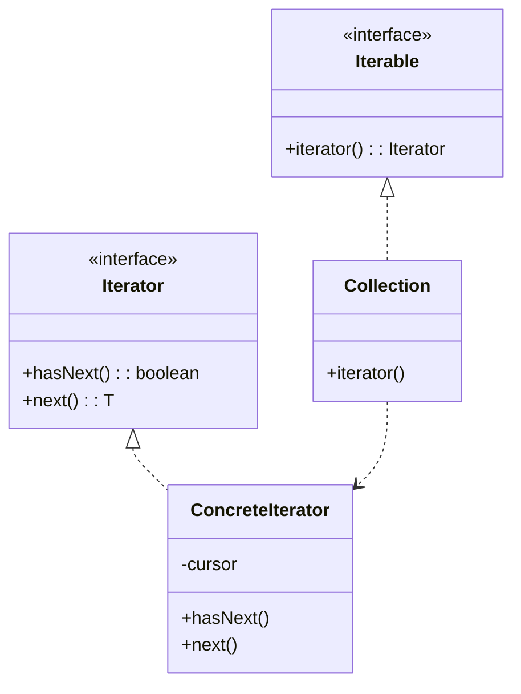
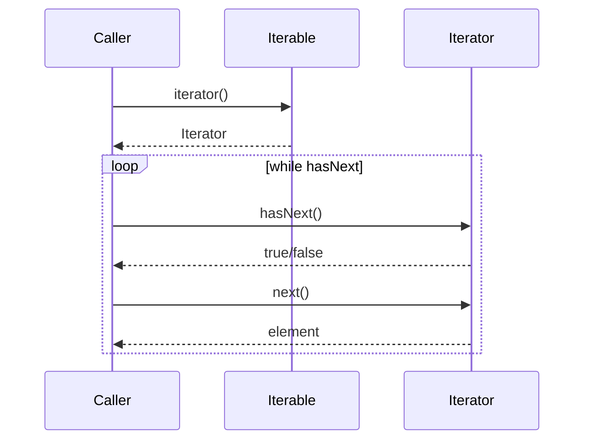

# Iterator — Junior Level

> **Source:** [refactoring.guru/design-patterns/iterator](https://refactoring.guru/design-patterns/iterator)
> **Category:** [Behavioral](../README.md) — *"Concerned with algorithms and the assignment of responsibilities between objects."*

---

## Table of Contents

1. [Introduction](#introduction)
2. [Prerequisites](#prerequisites)
3. [Glossary](#glossary)
4. [Core Concepts](#core-concepts)
5. [Real-World Analogies](#real-world-analogies)
6. [Mental Models](#mental-models)
7. [Pros & Cons](#pros--cons)
8. [Use Cases](#use-cases)
9. [Code Examples](#code-examples)
10. [Coding Patterns](#coding-patterns)
11. [Clean Code](#clean-code)
12. [Best Practices](#best-practices)
13. [Edge Cases & Pitfalls](#edge-cases--pitfalls)
14. [Common Mistakes](#common-mistakes)
15. [Tricky Points](#tricky-points)
16. [Test Yourself](#test-yourself)
17. [Tricky Questions](#tricky-questions)
18. [Cheat Sheet](#cheat-sheet)
19. [Summary](#summary)
20. [What You Can Build](#what-you-can-build)
21. [Further Reading](#further-reading)
22. [Related Topics](#related-topics)
23. [Diagrams & Visual Aids](#diagrams--visual-aids)

---

## Introduction

> Focus: **What is it?** and **How to use it?**

**Iterator** is a behavioral design pattern that lets you **traverse a collection's elements one at a time** without exposing its internal structure (array, linked list, tree, hash map, generator, ...). The collection provides an Iterator; the Iterator answers two questions: "is there more?" and "give me the next one."

Imagine reading a book. You don't care whether the bookstore stocks it on a shelf, in a box, or sorted by author — you just want pages in order. The Iterator is your bookmark: it knows where you are, advances on demand, and stops at the end.

In one sentence: *"Walk through a collection without knowing how it stores its data."*

Iterator is the foundation of `for-each`, generators, streams, and almost every loop you write in modern languages. The pattern was a major insight in the 90s; today it's so baked-in that we forget it's a pattern.

---

## Prerequisites

What you should know before reading this:

- **Required:** Basic OOP — interfaces, classes.
- **Required:** Some familiarity with collections: arrays, lists, sets, maps.
- **Helpful:** Recursive data structures (trees, graphs).
- **Helpful:** Generators / coroutines, if your language has them — modern Iterators are often generators.

---

## Glossary

| Term | Definition |
|------|-----------|
| **Iterator** | The object that walks the collection: typically `hasNext()` + `next()` (or `next()` returning a sentinel). |
| **Iterable** (Collection) | The thing being walked — must produce an Iterator. |
| **Cursor** | The Iterator's internal position. |
| **External iteration** | The caller advances the Iterator: `while (it.hasNext()) { ... it.next() ... }`. |
| **Internal iteration** | The collection drives: `list.forEach(item -> ...)`. |
| **Lazy iteration** | Elements computed on demand, not eagerly. Generators. |
| **Stateful iterator** | Holds position; `next()` advances it. |
| **Stateless iterator** | All state is in the caller; the iterator is just a function. |

---

## Core Concepts

### 1. Same Interface, Many Collections

Every Iterator has the same shape — `hasNext()` and `next()` (or equivalent). The caller never asks "is this an array or a tree?" — just walks.

```java
interface Iterator<T> {
    boolean hasNext();
    T next();
}
```

### 2. The Collection Produces an Iterator

The collection (Iterable) doesn't iterate itself; it returns a fresh Iterator each time someone asks.

```java
interface Iterable<T> {
    Iterator<T> iterator();
}
```

### 3. The Iterator Holds the State

Position, traversal-specific bookkeeping, end-of-collection detection — all inside the Iterator. The collection isn't disturbed.

### 4. Multiple Iterators on One Collection

Each `iterator()` call returns a fresh, independent Iterator. Two callers can walk the same list at different speeds without interfering.

### 5. Decouples Traversal Algorithm from Storage

A tree can be walked depth-first or breadth-first; the *traversal algorithm* lives in the Iterator, not in the tree. Add a new traversal = add a new Iterator type. The tree doesn't change.

---

## Real-World Analogies

| Concept | Analogy |
|---------|--------|
| **Iterator** | A bookmark. Knows where you are; moves forward on demand. |
| **Iterable** | The book. Holds the content; produces bookmarks. |
| **Cursor** | The current page. |
| **External iteration** | You turn pages. |
| **Internal iteration** | A reading machine reads the whole book to you. |

The classical refactoring.guru analogy is a **TV remote**: pressing "next channel" doesn't require knowing the antenna design or the cable layout. The remote (Iterator) just steps you through the channels (collection).

Another good one is a **playlist**: pressing "next" plays the next song. The internal storage (file order, shuffle state, network stream) is hidden behind that one button.

---

## Mental Models

**The intuition:** Picture a fishing line. The Iterator is the line; each `next()` reels in one fish. You never see the lake; you don't know if the fish are at the surface, deep, or scattered. The line gets them one at a time.

**Why this model helps:** It separates *traversal* from *storage*. The collection just stores; the Iterator just walks.

**Visualization:**

```
   Collection                Iterator
   ┌──────────┐             ┌────────┐
   │ [a, b, c]│ <─ position ─┤cursor=1│
   │          │             │        │
   │ iterator() returns ───>│ next() │
   └──────────┘             └────────┘
```

The Iterator points into the collection; advancing it updates the cursor.

---

## Pros & Cons

| Pros | Cons |
|------|------|
| Same loop code works for any collection | Each new collection needs an Iterator implementation |
| Supports multiple, independent traversals | Iterator can become invalid if collection mutates |
| Decouples traversal algorithm from storage | More objects allocated (one per `iterator()`) |
| Lazy evaluation possible (generators) | Iterator state machines can hide bugs |
| Open/Closed: new traversals via new Iterators | Sometimes slower than direct array access |

### When to use:
- Your collection is non-trivial (tree, graph, lazy stream)
- You want callers to use a familiar `for-each` loop
- You need to support multiple traversal orders (DFS, BFS, in-order, level-order)
- You want elements computed lazily (generators, streams)
- You're hiding storage details behind an interface

### When NOT to use:
- The collection is a flat array and direct indexing works fine
- The traversal logic is one specific order; no need for an interface
- The collection is so small that allocating an Iterator wastes more than it saves
- You're using a language where iteration is built-in (Python `for`, Go `range`) — write idiomatic code

---

## Use Cases

Real-world places where Iterator is commonly applied:

- **Standard library collections** — Java `Iterator`, C# `IEnumerator`, Python `__iter__`, JavaScript iterators / generators.
- **Database cursors** — JDBC `ResultSet`, Postgres / MySQL cursor APIs walk huge result sets without loading them.
- **Tree / graph traversals** — DOM walkers, AST visitors, file system walkers (`Files.walk()`).
- **Streams** — Java Streams, RxJava, Reactor — backpressure-aware iterators over async data.
- **Lazy sequences** — Kotlin `sequence { ... }`, Python generators, Haskell lazy lists.
- **Pagination** — Iterators over paged API responses (auto-fetch the next page).
- **Network protocols** — IMAP / FTP file listings, S3 list-objects pagination.
- **File reading** — line-by-line I/O via Iterators.
- **Compiler tools** — token streams, AST iteration.

---

## Code Examples

### Go

A tree iterator using `range` semantics via channels.

```go
package main

import "fmt"

type Node struct {
	Value    int
	Children []*Node
}

// DFS iterator using a generator-style channel.
func (n *Node) DFS() <-chan int {
	out := make(chan int)
	go func() {
		defer close(out)
		var walk func(*Node)
		walk = func(n *Node) {
			out <- n.Value
			for _, c := range n.Children {
				walk(c)
			}
		}
		walk(n)
	}()
	return out
}

func main() {
	root := &Node{1, []*Node{
		{2, []*Node{{4, nil}, {5, nil}}},
		{3, nil},
	}}

	for v := range root.DFS() {
		fmt.Println(v)   // 1 2 4 5 3
	}
}
```

**What it does:** Channels in Go are a generator-flavored Iterator. `range` consumes them like any iterable.

**How to run:** `go run main.go`

> **Note:** Go 1.23+ has explicit iterator support via `iter.Seq[T]`. Channels are the older idiom.

---

### Java

A custom collection with its own Iterator.

```java
import java.util.Iterator;
import java.util.NoSuchElementException;

public final class CircularList<T> implements Iterable<T> {
    private final T[] items;
    private final int size;

    @SafeVarargs
    public CircularList(T... items) {
        this.items = items;
        this.size = items.length;
    }

    @Override
    public Iterator<T> iterator() {
        return new Iterator<>() {
            private int index = 0;
            private int seen = 0;

            @Override
            public boolean hasNext() { return seen < size * 2; }

            @Override
            public T next() {
                if (!hasNext()) throw new NoSuchElementException();
                T value = items[index];
                index = (index + 1) % size;
                seen++;
                return value;
            }
        };
    }

    public static void main(String[] args) {
        CircularList<String> list = new CircularList<>("a", "b", "c");
        for (String s : list) System.out.println(s);   // a b c a b c
    }
}
```

**What it does:** `CircularList` walks twice through its items. The traversal logic lives in the Iterator; `CircularList` just stores.

**How to run:** `javac CircularList.java && java CircularList`

---

### Python

A generator-based Iterator.

```python
from typing import Iterator


def fibonacci(limit: int) -> Iterator[int]:
    a, b = 0, 1
    while a < limit:
        yield a
        a, b = b, a + b


for n in fibonacci(100):
    print(n)
# 0 1 1 2 3 5 8 13 21 34 55 89
```

**What it does:** `yield` makes Python pause and resume the function at each iteration. The whole function is a generator — an Iterator without a class.

**How to run:** `python3 main.py`

Python's `__iter__` and `__next__` protocol formalizes Iterator. Generators are syntactic sugar that produces Iterators.

---

## Coding Patterns

### Pattern 1: Class-based Iterator

**Intent:** Hold position in instance state; `next()` advances.

```python
class Range:
    def __init__(self, n: int) -> None:
        self.n = n

    def __iter__(self):
        self._i = 0
        return self

    def __next__(self):
        if self._i >= self.n:
            raise StopIteration
        v = self._i
        self._i += 1
        return v
```

**When:** State is non-trivial (trees, graphs, multi-step pagination).

---

### Pattern 2: Generator (preferred when available)

**Intent:** `yield` instead of class state. Simpler, lazy.

```python
def range_gen(n: int):
    i = 0
    while i < n:
        yield i
        i += 1
```

**When:** Most cases in modern languages. Less code, lazy by default.

---

### Pattern 3: Multiple Iterators, Multiple Orders

**Intent:** One collection, several traversal orders.

```java
class Tree {
    Iterator<Node> dfs() { /* ... */ }
    Iterator<Node> bfs() { /* ... */ }
}
```

**When:** Trees, graphs. Different operations want different orders.

---

### Pattern 4: External Iterator Loop

**Intent:** Caller drives the iteration explicitly.

```java
Iterator<String> it = list.iterator();
while (it.hasNext()) {
    String s = it.next();
    if (skip(s)) continue;
    if (stop(s)) break;
    process(s);
}
```

**When:** You need fine control: skip, break, peek.

---

### Pattern 5: Internal Iterator (forEach)

**Intent:** Pass a callback to the collection.

```java
list.forEach(s -> process(s));
```

Or stream-style:

```java
list.stream().filter(...).map(...).forEach(...);
```

**When:** Functional style; transformations and pipelines.

---

## Clean Code

- **Make the Iterator interface obvious.** `hasNext()` + `next()`, or implement the language's standard (`Iterable<T>`, `__iter__`).
- **Don't expose collection internals from the Iterator.** Hide the array, the tree, the implementation.
- **Document fail-fast vs fail-safe semantics.** Java's `ConcurrentModificationException` is fail-fast; CopyOnWrite collections are fail-safe.
- **Lazy by default, eager by choice.** A new Iterator should not pre-materialize.
- **One Iterator per traversal pass.** Don't reuse Iterators after exhaustion.

---

## Best Practices

- **Implement the language's idiomatic interface.** Java `Iterator`, Python `__iter__`/`__next__`, JavaScript `[Symbol.iterator]`, C# `IEnumerator`.
- **Generators / coroutines beat hand-written Iterators** when available.
- **Consider the for-each loop UX.** That's what most callers will use.
- **Provide multiple Iterator types if needed.** Don't shoehorn DFS into "the one" Iterator.
- **Stop on exhaustion.** Don't return null; throw `NoSuchElementException` or signal end.
- **Don't mutate the collection during iteration** unless your Iterator explicitly supports it.

---

## Edge Cases & Pitfalls

- **Mutation during iteration.** Adding / removing during traversal often invalidates the Iterator. `ConcurrentModificationException` (Java), or undefined behavior (C++).
- **Infinite Iterators.** Lazy ones can be infinite (`Stream.iterate(0, n -> n + 1)`). Don't `collect` them.
- **One-shot Iterators.** Many Iterators can't restart — they're consumed. Design for this.
- **Concurrency.** Multiple threads iterating the same Iterator usually breaks. Each thread gets its own.
- **Lazy evaluation gotchas.** A Python generator captures variables *at iteration time*, not creation time. Surprises in closures.
- **Nested iteration on the same collection.** Two iterators usually fine; one Iterator used twice is an error.
- **`remove()` semantics in Java's Iterator** — only valid right after `next()`. Often forgotten.

---

## Common Mistakes

1. **Calling `next()` without `hasNext()`.** Throws `NoSuchElementException`.
2. **Reusing an exhausted Iterator.** Won't restart.
3. **Mutating the collection mid-iteration.** Invalidates state.
4. **Building a list eagerly when you could stream.** Memory wasted.
5. **Implementing `Iterator` and `Iterable` on the same class.** Common in Java; only do it for one-shot collections (e.g., `Scanner`).
6. **Forgetting `StopIteration` / end-of-stream signal** in custom Iterators.
7. **Returning `null` for missing values.** Use the protocol's end-signal instead.

---

## Tricky Points

### `Iterator` vs `Iterable`

Different roles:
- **Iterable**: "I can produce iterators." (a list, a tree)
- **Iterator**: "I'm currently walking." (a position-holding object)

A class can be both, but usually shouldn't — Iterables produce fresh Iterators each time. Combining them means you can only iterate once.

### Fail-fast vs fail-safe

- **Fail-fast**: Iterator detects modification and throws. (Java's `ArrayList`, `HashMap`.)
- **Fail-safe**: Iterator works on a snapshot, ignores subsequent modifications. (`CopyOnWriteArrayList`, `ConcurrentHashMap`.)

Pick based on what callers expect.

### Generators are Iterators

In Python, JavaScript, Kotlin, C#: a generator function is an Iterator. The `yield` keyword pauses and resumes. Cleaner than hand-written `__next__`.

### Streams ≠ Iterators (but close)

Java's `Stream` is an Iterator with extra operations (filter, map, reduce). Reactive streams (Reactor, RxJava) are Iterators with backpressure. Same DNA, different ergonomics.

### Cursor pagination

When iterating over an external API, the "next" might be expensive (HTTP call). The Iterator pattern lets you hide pagination — the caller just calls `next()`.

---

## Test Yourself

1. What's the difference between Iterable and Iterator?
2. Why does `iterator()` return a fresh Iterator each call?
3. What's `external` vs `internal` iteration?
4. Why are generators Iterators?
5. What's a fail-fast Iterator? Fail-safe?
6. Give 5 real-world places Iterator is used.
7. Why is mutation during iteration usually a bug?

---

## Tricky Questions

- **Q: If I subclass `ArrayList` and override `iterator()`, what changes?**
  A: All `for-each` loops and any code that calls `iterator()` use your version. Standard Java `Stream` (`.stream()`) usually goes through `Spliterator`; check if you need to override that too.
- **Q: Can two iterators on the same collection see different elements?**
  A: They can if the collection mutates between them. Even fail-safe iterators see snapshots from the moment they were created.
- **Q: What's wrong with `for (int i = 0; i < list.size(); i++) list.remove(i);`?**
  A: Each remove shifts items. You're skipping every other one. Use `Iterator.remove()` or iterate over a copy.
- **Q: Are Streams iterators?**
  A: They're built on Iterators (Spliterator). Streams add laziness, parallelism, and operator chaining. Conceptually iterators with a richer API.

---

## Cheat Sheet

| Concept | One-liner |
|---|---|
| Intent | Walk a collection without exposing its structure |
| Roles | Iterable (produces), Iterator (walks) |
| Hot loop | `while (it.hasNext()) it.next()` |
| Sibling | Visitor (operations across types), Composite (recursive structure) |
| Modern form | Generator function (`yield`), language `for-each` |
| Smell to fix | Direct array indexing of internal storage from outside |

---

## Summary

Iterator hides storage details behind a uniform walking interface. The collection answers "give me an Iterator"; the Iterator answers "is there more? give me the next." Multiple iterators, multiple orders, lazy evaluation — all become natural.

Three things to remember:
1. **Iterable produces; Iterator walks.** Different roles, often different objects.
2. **Each `iterator()` is fresh.** Independent state per traversal.
3. **Generators ARE Iterators.** When the language supports them, they're cleaner.

If you find yourself writing `for (int i = 0; i < internalArray.length; i++)` from outside a collection, Iterator is asking to be born.

---

## What You Can Build

- A binary tree with DFS, BFS, and in-order traversals
- A paginated API client whose Iterator auto-fetches pages
- A line-by-line file reader as a generator
- A CSV parser that yields rows lazily
- A graph walker with cycle detection
- A circular buffer iterator that loops forever

---

## Further Reading

- *Design Patterns: Elements of Reusable Object-Oriented Software* (GoF) — original Iterator chapter
- *Effective Java*, Items 21, 49 — iteration patterns
- [refactoring.guru — Iterator](https://refactoring.guru/design-patterns/iterator)
- *PEP 234 — Iterators* (Python)
- *Java Streams API documentation*

---

## Related Topics

- [Visitor](../10-visitor/junior.md) — operations across a collection's elements
- [Composite](../../02-structural/03-composite/junior.md) — tree-like structures often paired with Iterators
- Generators / Coroutines
- Reactive streams — Iterators with backpressure
- Pagination patterns

---

## Diagrams & Visual Aids

### Class diagram



### Sequence: external iteration



### Decision flow

```
                ┌─────────────────────────┐
                │ Need to walk a          │
                │ non-trivial collection? │
                └──────────┬──────────────┘
                           │ yes
                           ▼
                ┌─────────────────────────┐
                │ Caller shouldn't know   │
                │ internal structure?     │
                └──────────┬──────────────┘
                           │ yes
                           ▼
                ┌─────────────────────────┐
                │ Generators / `range` /  │
                │ language idiom suffice? │
                └──────────┬──────────────┘
                           │ no — use Iterator
                           ▼
                  ──> Implement Iterator
```

[← Back to Behavioral Patterns](../README.md) · [Middle →](middle.md)
