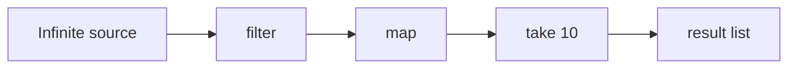
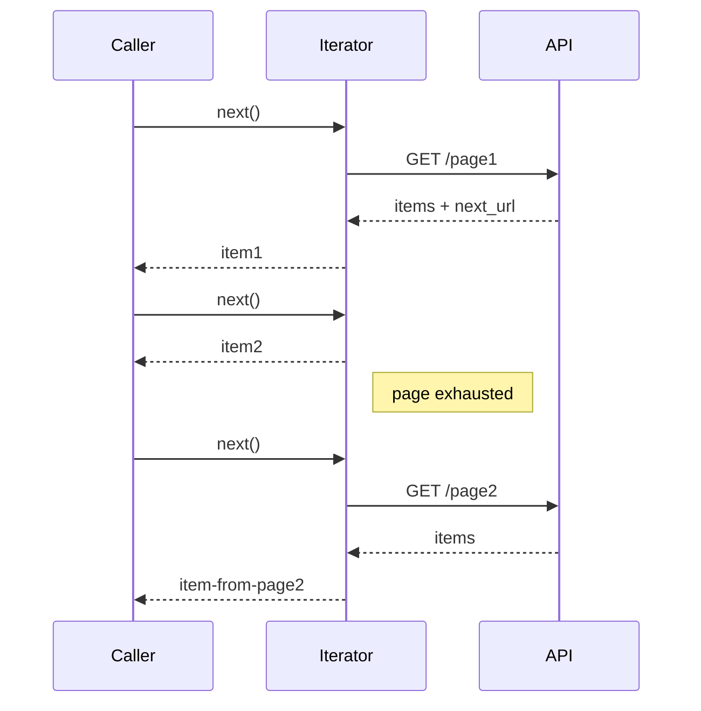

# Iterator — Middle Level

> **Source:** [refactoring.guru/design-patterns/iterator](https://refactoring.guru/design-patterns/iterator)
> **Prerequisite:** [Junior](junior.md)

---

## Table of Contents

1. [Introduction](#introduction)
2. [When to Use Iterator](#when-to-use-iterator)
3. [When NOT to Use Iterator](#when-not-to-use-iterator)
4. [Real-World Cases](#real-world-cases)
5. [Code Examples — Production-Grade](#code-examples--production-grade)
6. [Generators vs Class-based Iterators](#generators-vs-class-based-iterators)
7. [Lazy vs Eager Iteration](#lazy-vs-eager-iteration)
8. [Trade-offs](#trade-offs)
9. [Alternatives Comparison](#alternatives-comparison)
10. [Refactoring to Iterator](#refactoring-to-iterator)
11. [Pros & Cons (Deeper)](#pros--cons-deeper)
12. [Edge Cases](#edge-cases)
13. [Tricky Points](#tricky-points)
14. [Best Practices](#best-practices)
15. [Tasks (Practice)](#tasks-practice)
16. [Summary](#summary)
17. [Related Topics](#related-topics)
18. [Diagrams](#diagrams)

---

## Introduction

> Focus: **When to use it?** and **Why?**

You already know Iterator is "walk a collection without exposing it." At the middle level the harder questions are:

- **Generator or class?** Modern languages let you skip the class.
- **Lazy or eager?** Streaming saves memory but changes semantics.
- **Single-pass or multi-pass?** Some Iterators can't be restarted.
- **Fail-fast or fail-safe?** What happens when the underlying collection mutates?
- **External or internal iteration?** Who drives the loop?

This document focuses on **decisions and patterns** that turn textbook Iterator into something that survives a year of production.

---

## When to Use Iterator

Use Iterator when **all** of these are true:

1. **Your collection is non-trivial.** Trees, graphs, paged APIs, lazy streams — anything where direct indexing doesn't work.
2. **Callers need a uniform interface.** They shouldn't care about your internal storage.
3. **Multiple traversal orders are valuable.** Or might be.
4. **Lazy evaluation matters.** Or you need streaming for memory reasons.
5. **The language supports the idiom.** `for-each`, generators, iterators.

If most are missing, look elsewhere first.

### Triggers

- "Walk all files under this directory recursively." → Iterator (`Files.walk`).
- "Stream rows from this huge query result." → Iterator (cursor-based).
- "Page through all my customers from the API." → Iterator (auto-pagination).
- "DFS or BFS this tree, depending on caller's choice." → multiple Iterators.
- "Traverse this graph without loading it all in memory." → Iterator.

---

## When NOT to Use Iterator

- **The collection is a flat array, called once.** `for (int i = 0; i < arr.length; i++)` is clearer.
- **You only ever traverse in one fixed order.** A method that walks internally is simpler than an Iterator class.
- **The language's idiom doesn't fit.** Don't fight against built-in iteration.
- **The collection is so small that allocation cost dominates.** A 3-element array doesn't need an Iterator class.

### Smell: hand-rolled Iterator when stdlib has one

```java
class CustomIterator {
    int cursor = 0;
    int[] data;
    boolean hasNext() { return cursor < data.length; }
    int next() { return data[cursor++]; }
}
```

Java already has this — use `Iterator<Integer>` over a `List<Integer>`. Reinventing the standard library is rarely a good idea.

---

## Real-World Cases

### Case 1 — Java Stream / `Spliterator`

```java
List<String> names = orders.stream()
    .filter(o -> o.cents() > 100)
    .map(Order::customer)
    .distinct()
    .toList();
```

Streams are built on `Spliterator` — a parallel-friendly Iterator. The pipeline is lazy until terminal operation.

### Case 2 — Database cursors

JDBC `ResultSet` walks a query result without loading all rows into memory:

```java
try (ResultSet rs = stmt.executeQuery("SELECT * FROM orders")) {
    while (rs.next()) {
        process(rs.getString("id"));
    }
}
```

Postgres can stream millions of rows; the JDBC Iterator pages internally.

### Case 3 — File system walk

```java
Files.walk(Path.of("/tmp"))
    .filter(p -> p.toString().endsWith(".log"))
    .forEach(System.out::println);
```

Lazily iterates the directory tree. Stops walking when the stream is closed.

### Case 4 — AWS SDK paginators

```java
ListObjectsV2Iterable response = s3.listObjectsV2Paginator(req);
for (S3Object obj : response.contents()) {
    process(obj);
}
```

The Iterator hides pagination — caller sees a flat sequence; SDK fetches more pages on demand.

### Case 5 — Kotlin sequences

```kotlin
val firstFive = generateSequence(0) { it + 1 }
    .filter { it % 2 == 0 }
    .take(5)
    .toList()   // [0, 2, 4, 6, 8]
```

Lazy by default; no intermediate lists. Composes operators like Streams.

### Case 6 — Python generators / itertools

```python
from itertools import count, islice

evens = (x for x in count() if x % 2 == 0)
print(list(islice(evens, 5)))   # [0, 2, 4, 6, 8]
```

Infinite source, finite take. Everything composes lazily.

### Case 7 — DOM traversal

```javascript
const walker = document.createTreeWalker(
    root, NodeFilter.SHOW_ELEMENT,
    { acceptNode: node => node.tagName === 'P' ? NodeFilter.FILTER_ACCEPT : NodeFilter.FILTER_SKIP }
);
let node;
while (node = walker.nextNode()) { /* ... */ }
```

DOM's Iterator walks elements in document order with filtering.

---

## Code Examples — Production-Grade

### Example A — Auto-paginating API client (Python)

```python
from typing import Iterator
import requests


def list_customers() -> Iterator[dict]:
    url = "https://api.example.com/customers"
    while url:
        resp = requests.get(url, timeout=10)
        resp.raise_for_status()
        body = resp.json()

        for customer in body["data"]:
            yield customer

        url = body.get("next_url")   # None when last page


# Usage:
for c in list_customers():
    if c["plan"] == "enterprise":
        print(c["id"])
        break   # stops fetching pages
```

Caller sees a flat sequence. Pagination is invisible. Stops fetching when consumer breaks.

---

### Example B — Tree iterator with multiple orders (Java)

```java
import java.util.*;

public class Tree<T> implements Iterable<T> {
    private final T value;
    private final List<Tree<T>> children = new ArrayList<>();

    public Tree(T value) { this.value = value; }
    public Tree<T> add(Tree<T> child) { children.add(child); return this; }

    /** DFS iteration. */
    @Override
    public Iterator<T> iterator() { return dfs(); }

    public Iterator<T> dfs() {
        return new Iterator<>() {
            private final Deque<Tree<T>> stack = new ArrayDeque<>(List.of(Tree.this));

            public boolean hasNext() { return !stack.isEmpty(); }

            public T next() {
                if (!hasNext()) throw new NoSuchElementException();
                Tree<T> n = stack.pop();
                for (int i = n.children.size() - 1; i >= 0; i--) stack.push(n.children.get(i));
                return n.value;
            }
        };
    }

    public Iterator<T> bfs() {
        return new Iterator<>() {
            private final Queue<Tree<T>> queue = new ArrayDeque<>(List.of(Tree.this));

            public boolean hasNext() { return !queue.isEmpty(); }

            public T next() {
                if (!hasNext()) throw new NoSuchElementException();
                Tree<T> n = queue.poll();
                queue.addAll(n.children);
                return n.value;
            }
        };
    }
}
```

DFS uses a stack; BFS uses a queue. Both are independent iterators on the same tree.

---

### Example C — Lazy filter (TypeScript with generators)

```typescript
function* filter<T>(source: Iterable<T>, pred: (x: T) => boolean): IterableIterator<T> {
    for (const item of source) {
        if (pred(item)) yield item;
    }
}

function* take<T>(source: Iterable<T>, n: number): IterableIterator<T> {
    let i = 0;
    for (const item of source) {
        if (i++ >= n) return;
        yield item;
    }
}

function* naturals(): IterableIterator<number> {
    let i = 0;
    while (true) yield i++;
}


for (const n of take(filter(naturals(), x => x % 7 === 0), 3)) {
    console.log(n);   // 0 7 14
}
```

Infinite source; lazy filter; finite take. No intermediate arrays.

---

### Example D — Resource-aware iterator (Java)

```java
public final class FileLinesIterator implements Iterator<String>, AutoCloseable {
    private final BufferedReader reader;
    private String nextLine;

    public FileLinesIterator(Path path) throws IOException {
        this.reader = Files.newBufferedReader(path);
        advance();
    }

    private void advance() {
        try { nextLine = reader.readLine(); }
        catch (IOException e) { nextLine = null; }
    }

    public boolean hasNext() { return nextLine != null; }

    public String next() {
        if (nextLine == null) throw new NoSuchElementException();
        String r = nextLine;
        advance();
        return r;
    }

    public void close() throws IOException { reader.close(); }
}
```

Typical pattern: file-backed Iterator. Note `AutoCloseable` for `try-with-resources`.

---

## Generators vs Class-based Iterators

| Aspect | Generator | Class |
|---|---|---|
| **Boilerplate** | Minimal | More |
| **Lazy by default** | Yes | Up to you |
| **State** | Local variables | Instance fields |
| **Composability** | Excellent (yield from, chains) | Manual |
| **Resource cleanup** | `try/finally` inside | `close()` method, `AutoCloseable` |
| **Language support** | Python, JS, Kotlin, C# | Everywhere |

**When to choose generator:**
- Most cases when supported.
- Linear logic with `yield`.
- Lazy by default suits the use case.

**When to choose class:**
- Java pre-21 (no generators in standard form).
- Need explicit lifecycle / `close`.
- Multiple methods on the Iterator (peek, mark, reset).

---

## Lazy vs Eager Iteration

### Eager

```python
data = [transform(x) for x in source]
```

All elements computed up front. List exists in memory.

### Lazy

```python
data = (transform(x) for x in source)
```

Computed on demand. Only one element exists at a time.

### Semantics

```python
data = [x * 2 for x in items if x > 0]   # eager: list
data_lazy = (x * 2 for x in items if x > 0)   # lazy: generator
```

Lazy iterators:
- Don't compute anything until consumed.
- Can be infinite.
- Can fail mid-iteration (lazy raises errors as it sees them).
- Are usually one-shot.

Eager iterators:
- Compute everything up-front.
- Memory cost = full collection.
- Errors raised at construction.
- Can be re-iterated.

---

## Trade-offs

| Trade-off | Cost | Benefit |
|---|---|---|
| Class-based Iterator | Boilerplate | Explicit control, lifecycle |
| Generator | Language-specific | Concise, lazy |
| Lazy iteration | One-shot, late errors | Memory efficient, infinite OK |
| Eager iteration | Memory | Re-iteration, immediate errors |
| External iteration | Loop boilerplate | Skip / break / peek easy |
| Internal iteration | Loop control hidden | Cleaner pipelines |

---

## Alternatives Comparison

| Pattern | Use when |
|---|---|
| **Iterator** | Walk a collection element-by-element |
| **Visitor** | Apply different operations to elements of different types |
| **Composite** | Build a tree-of-objects structure |
| **Stream / Pipeline** | Iterate AND transform |
| **Reactive Stream** | Async + backpressure |
| **Direct indexing** | Flat array, fixed traversal |

---

## Refactoring to Iterator

### Symptom
Code that exposes internal collection storage:

```java
public class Library {
    public List<Book> getBooks() { return books; }   // exposes ArrayList
}

// Caller:
for (int i = 0; i < lib.getBooks().size(); i++) { ... }
```

Callers see the storage type.

### Steps
1. Make the collection `Iterable<Book>`.
2. Return an Iterator from `iterator()`, not the underlying list.
3. Optionally: provide multiple iteration methods (`booksByAuthor()`, `booksByDate()`).
4. Remove or deprecate `getBooks()`.

### After

```java
public class Library implements Iterable<Book> {
    public Iterator<Book> iterator() { return new BookIterator(); }
}

// Caller:
for (Book b : lib) { ... }
```

The internal collection type can change; callers don't notice.

---

## Pros & Cons (Deeper)

| Pros | Cons |
|---|---|
| Storage hidden behind interface | Iterator class per collection type |
| Multiple traversal orders | Stale Iterator if collection mutates |
| Lazy evaluation possible | Generators / streams can be confusing to debug |
| Streams compose naturally | Allocation per `iterator()` call |
| Standard `for-each` ergonomics | Hard to peek / restart |

---

## Edge Cases

### 1. Iterator over a paginated source — partial fetch failure

If page 5 of 10 fails, what state is the Iterator in? Either:
- Throw on the failing `next()`. Caller can retry from current position.
- Buffer and skip the bad page (lossy).
- Fail-fast: state corrupted, Iterator unusable.

Document explicitly.

### 2. Concurrent modification

```java
List<String> list = new ArrayList<>(...);
Iterator<String> it = list.iterator();
list.add("x");   // mutation
it.next();       // ConcurrentModificationException
```

Java's fail-fast iterators detect this. CopyOnWrite collections don't.

### 3. Infinite iterator with finite consumer

```python
for n in count():   # 0, 1, 2, 3, ...
    if n > 100: break
    print(n)
```

Works fine. But if you `list(count())`, it never returns.

### 4. Iterator that wraps a closing resource

If you don't close the file / DB cursor, you leak. Iterators that own resources should be `Closeable` / `AutoCloseable` and used with `try-with-resources`.

### 5. Forking an Iterator

`itertools.tee(it, 2)` — two iterators from one. Both see all elements; an internal buffer holds elements one has seen and the other hasn't. Memory cost equals the lag between consumers.

---

## Tricky Points

### Stateful iterators outside their owner

```java
Iterator<X> it = coll.iterator();
saveItForLater(it);
// ... time passes; collection mutated ...
processWith(it);   // surprises
```

Iterators are *transient state*. Don't store them as long-lived references.

### `remove()` on Java's Iterator

```java
Iterator<X> it = list.iterator();
while (it.hasNext()) {
    if (drop(it.next())) it.remove();   // safe; mutates via iterator
}
```

Direct `list.remove(...)` would throw. The Iterator's `remove` is special — it knows to stay valid.

### Spliterator parallelism

Java 8's `Spliterator` adds `tryAdvance`, `trySplit` for parallel processing. Streams use it transparently. If you implement a custom `Iterable`, also implement `Spliterator` for parallel performance.

### `Iterable<T>` vs `Stream<T>`

Both walk elements. Stream adds operators (filter, map, ...). Iterable is the simpler base. If a method just needs to walk, accept `Iterable<T>`. If it needs transformations, take `Stream<T>` (or accept Iterable and `.stream()` it inside).

---

## Best Practices

- **Use generators when available.** Less boilerplate.
- **Implement `Iterable<T>` so `for-each` works.** Don't make callers call `iterator()` manually.
- **Document fail-fast vs fail-safe** for mutation.
- **Don't expose internal lists directly** — return Iterators.
- **Close resources** when the Iterator owns them.
- **One Iterator per traversal pass.** Don't reuse exhausted Iterators.
- **For huge data, prefer lazy.** Memory matters.
- **For parallel streams, implement `Spliterator`** with sensible characteristics.

---

## Tasks (Practice)

1. **Tree DFS / BFS Iterators.** Same tree, two iteration orders.
2. **Auto-paginating API client.** Iterator hides page boundaries.
3. **File line iterator.** AutoCloseable, lazy.
4. **Filter / map / take generator chain.** Infinite naturals → first 10 primes.
5. **Bidirectional iterator.** `next()` and `prev()`.
6. **Concurrent-safe iterator.** Snapshot at construction.

(Solutions in [tasks.md](tasks.md).)

---

## Summary

At the middle level, Iterator is not just "walk a list." It's:

- **Hide storage** behind a uniform interface.
- **Provide multiple orders** when needed.
- **Lazy by default** for huge / infinite sources.
- **Class or generator** based on language.
- **Resource-aware** when wrapping I/O.

The win is decoupling. The cost is one more class per collection (mitigated by generators).

---

## Related Topics

- [Visitor](../10-visitor/middle.md) — operations across element types
- [Composite](../../02-structural/03-composite/middle.md) — tree structures
- [Reactive streams](../../../infra/reactive.md) — Iterators with backpressure
- [Pagination](../../../infra/pagination.md)
- [Stream API](../../../coding-principles/streams.md)

---

## Diagrams

### Pipeline of lazy iterators



Each step is lazy; nothing happens until `Out` is materialized.

### Auto-paginating Iterator



[← Junior](junior.md) · [Senior →](senior.md)
