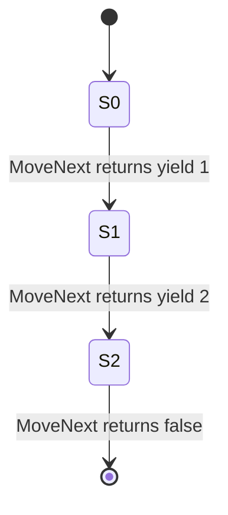
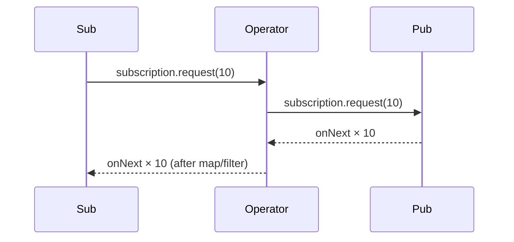
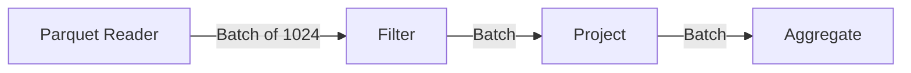

# Iterator — Professional Level

> **Source:** [refactoring.guru/design-patterns/iterator](https://refactoring.guru/design-patterns/iterator)
> **Prerequisite:** [Senior](senior.md)

---

## Table of Contents

1. [Introduction](#introduction)
2. [Generator State Machines](#generator-state-machines)
3. [Java Iterator JIT and Inlining](#java-iterator-jit-and-inlining)
4. [Spliterator Internals](#spliterator-internals)
5. [Coroutine Iterators (Kotlin / Python)](#coroutine-iterators-kotlin--python)
6. [Reactive Streams Internals](#reactive-streams-internals)
7. [Memory Layout & Cache](#memory-layout--cache)
8. [Iteration in Columnar Engines](#iteration-in-columnar-engines)
9. [Cross-Language Comparison](#cross-language-comparison)
10. [Microbenchmark Anatomy](#microbenchmark-anatomy)
11. [Diagrams](#diagrams)
12. [Related Topics](#related-topics)

---

## Introduction

An Iterator at the professional level is examined for what the runtime makes of it: how generators are compiled to state machines, how JITs inline iteration, how reactive frameworks honor backpressure, and where columnar engines sidestep per-row Iteration entirely.

For high-throughput systems — search engines, OLAP, ML pipelines — the Iterator machinery itself can be the bottleneck. This document quantifies it.

---

## Generator State Machines

### Python — frame-saving

A generator function pauses at `yield`. The frame (locals, instruction pointer) is saved. Resumption restores it.

```python
def gen():
    x = 1
    yield x
    x = 2
    yield x
```

Each call to `next()` runs until the next `yield`, saves state, returns. Memory cost: the frame.

### C# — compiler rewrite to a state machine

`IEnumerable` with `yield return` is rewritten by the compiler to a class implementing `IEnumerator`:

```csharp
IEnumerable<int> Numbers() {
    yield return 1;
    yield return 2;
}
// Compiled to:
class _Numbers_Enumerator : IEnumerator<int> {
    int state = 0;
    int current;
    public bool MoveNext() {
        switch (state) {
            case 0: current = 1; state = 1; return true;
            case 1: current = 2; state = 2; return true;
            case 2: return false;
        }
    }
}
```

Zero allocation per iteration after the enumerator is constructed. Compiler magic.

### Kotlin — coroutines and continuations

`sequence { yield(1); yield(2) }` compiles into a continuation-passing-style machine. Each `yield` saves the continuation; `next()` resumes.

### JavaScript — pause/resume engine

Generators are runtime-supported in V8 / SpiderMonkey. Less overhead than equivalent class-based iterators in modern engines.

### Cost

| Approach | Per-`next` cost |
|---|---|
| Python generator | ~100-200 ns (CPython bytecode) |
| C# state machine | ~5-10 ns (compiled native) |
| Kotlin coroutine | ~10-20 ns |
| JavaScript generator | ~30-50 ns |

For business code: irrelevant. For tight inner loops: hand-write the iterator.

---

## Java Iterator JIT and Inlining

### Monomorphic call site

```java
List<Integer> list = new ArrayList<>(...);
for (int x : list) sum += x;   // ArrayList.Itr at this site, always
```

JIT records `ArrayList$Itr` at this call site. Inlines `hasNext` and `next`. The for-each loop becomes equivalent to indexed access.

### Polymorphic / megamorphic

```java
void sum(Iterable<Integer> it) {   // ArrayList? LinkedList? Set?
    for (int x : it) total += x;
}
```

If many `Iterable` types pass through, the call site is megamorphic. `next()` is a vtable dispatch. ~2-3 ns per element instead of ~0.

### Counted loops vs Iterator

```java
for (int i = 0; i < arr.length; i++) sum += arr[i];   // bounds check elimination
for (int x : arr) sum += x;                            // same code generated
```

Both compile to the same native code for arrays. For `List`, the for-each goes through the iterator; modern JITs inline `ArrayList`'s Iterator perfectly.

### Stream cost

```java
list.stream().mapToInt(x -> x).sum();
```

For small lists, slower than indexed loop (allocation of stream pipeline). For large lists with parallelism, faster. Profile before assuming.

---

## Spliterator Internals

### `trySplit` strategy

```java
public Spliterator<T> trySplit() {
    int lo = origin, mid = (lo + fence) >>> 1;
    if (lo >= mid) return null;
    origin = mid;
    return new ArraySpliterator(array, lo, mid, characteristics);
}
```

Halves the range. Recurses until splits become too small. Worker threads each take a piece.

### Sub-sized vs unsized

`SUBSIZED` characteristic: the size of each split is known. Spliterators for `ArrayList` are subsized; for `HashSet`, not.

### Parallel scaling

```java
list.parallelStream().filter(...).count();
```

Underlying `Spliterator.trySplit` divides the work. ForkJoinPool common pool runs the chunks. Speedup approaches `min(cores, list.size() / chunk_size)`.

### Custom Spliterator pitfalls

- Forgetting to update `origin` in `trySplit` → infinite splits.
- Wrong `characteristics()` → optimizer misbehavior.
- `tryAdvance` and `forEachRemaining` inconsistency → lost elements.

---

## Coroutine Iterators (Kotlin / Python)

### Kotlin `Sequence`

```kotlin
val s = sequence {
    var i = 0
    while (true) {
        yield(i)
        i++
    }
}.take(5).toList()
// [0, 1, 2, 3, 4]
```

Cold (re-iterable on each terminal op). Lazy. Zero intermediate collections.

### Kotlin `Flow` (suspending)

```kotlin
val flow: Flow<Int> = flow {
    for (i in 1..5) {
        emit(fetchAsync(i))   // suspends
    }
}
```

Async-aware iteration. Integrates with structured concurrency: cancelling the scope stops the flow.

### Python `async def` generators

```python
async def gen():
    async for item in source:
        yield process(item)
```

Async iteration. The consumer awaits each item. Used in async web servers (FastAPI), database drivers (asyncpg).

### Backpressure in coroutines

`Flow` is naturally backpressured: `emit` suspends until the collector is ready. No buffer needed. Compare to RxJava where backpressure is explicit `request(n)`.

---

## Reactive Streams Internals

### `Subscription.request(n)` mechanics

```java
public void onSubscribe(Subscription s) {
    this.s = s;
    s.request(BUFFER_SIZE);   // initial demand
}
public void onNext(T t) {
    process(t);
    if (++processed % BUFFER_SIZE == 0) {
        s.request(BUFFER_SIZE);   // ask for more
    }
}
```

The subscriber's request signals backpressure. Publishers must NOT emit past the requested count.

### Operator composition

```java
flux.map(...).filter(...).buffer(100).subscribe(...);
```

Each operator is itself a Subscriber to the upstream and a Publisher to the downstream. Requests propagate upstream; emissions propagate downstream.

### `flatMap` + concurrency

```java
flux.flatMap(item -> doAsync(item))
```

Inner publishers run concurrently (default 256). Order is not preserved; use `concatMap` if needed.

### Cost of operators

A Reactor operator is ~50-100 ns of overhead per event (allocation of subscriber, signal handling). For tight pipelines, this adds up. Benchmarks show ~1-5M ops/sec per pipeline.

---

## Memory Layout & Cache

### Array iteration is the gold standard

```java
for (int i = 0; i < arr.length; i++) sum += arr[i];
```

Sequential memory access; the prefetcher loves it. Tens of GB/sec throughput.

### Linked list iteration

```java
for (Node n = head; n != null; n = n.next) sum += n.value;
```

Pointer chasing. Cache miss per element if nodes are randomly placed. ~10-100× slower than array iteration for large lists.

### Iteration cost scaled

| Structure | Sequential cost / element |
|---|---|
| Array | 0.3-1 ns |
| ArrayList (Java) | 0.3-1 ns |
| LinkedList | 30-100 ns |
| HashMap.entrySet() | 5-15 ns |
| TreeSet (BST) | 50-150 ns |

For workloads dominated by iteration, choose array-backed structures.

### Iterator allocation

`ArrayList.iterator()` allocates an `Itr` object (small, short-lived). Modern GCs handle this efficiently.

`Stream` constructs a longer pipeline of objects. For one-shot use, fine; for tight inner loops, prefer indexed access.

---

## Iteration in Columnar Engines

### Row vs columnar

Row-store iteration: `for each row { use row.col_a, row.col_b }`. Cache misses if rows are wide.

Columnar iteration: `for each batch of N values of col_a { ... } for each batch of N values of col_b { ... }`. SIMD-friendly.

### Vectorized operators

Apache Arrow, DuckDB, ClickHouse, Vectorwise process **batches** (1024 rows) at a time. The "iterator" yields a batch, not a row.

```cpp
class BatchIterator {
    Batch next();   // returns 1024 rows at once
};
```

Why? Per-row overhead dominates for narrow operators (filter, project). Batches amortize the cost.

### Arrow's `RecordBatchReader`

```cpp
auto reader = ParquetReader::Open(path);
while (auto batch = reader->ReadNext()) {
    // batch is a RecordBatch with columns; SIMD-friendly
}
```

Reads of millions of rows per second; the Iterator pattern stays — just at batch granularity.

---

## Cross-Language Comparison

| Language | Primary Iterator | Notes |
|---|---|---|
| **Java** | `Iterator<T>`, `Spliterator<T>`, `Stream<T>` | Boilerplate-heavy; streams add power |
| **Kotlin** | Sequence (cold), Flow (async + backpressure) | First-class language support |
| **C#** | `IEnumerator<T>`, LINQ | `yield` rewrites to state machine |
| **Go** | `range` over channels / arrays / slices / maps; 1.23+ `iter.Seq[T]` | Idiomatic; minimal |
| **Rust** | `Iterator` trait, lazy by default | Zero-cost; monomorphized |
| **Python** | `__iter__`, generators | Generators are first-class |
| **JavaScript** | `Symbol.iterator`, generators, async generators | Modern engines optimize |
| **C++** | Iterators (input, forward, bidi, random); ranges | Concepts-based; very fast when simple |

### Key contrasts

- **Rust**: `Iterator` is a trait; generic code monomorphizes — zero cost. `for x in vec` and indexed loops compile to the same code.
- **Go's `range`**: a syntactic construct, not a pattern. Less flexible than Iterator interfaces; more idiomatic.
- **C++ ranges (C++20)**: enable lazy operator chains comparable to streams.

---

## Microbenchmark Anatomy

### Array indexing vs Iterator

```java
@Benchmark public long indexed(IntArray arr) {
    long sum = 0;
    for (int i = 0; i < arr.length; i++) sum += arr.data[i];
    return sum;
}

@Benchmark public long iterator(IntArray arr) {
    long sum = 0;
    for (int x : arr.data) sum += x;
    return sum;
}
```

Numbers: indistinguishable for `int[]` after JIT warmup (~0.3 ns/element). For `Integer[]`, ~1-2 ns/element due to boxing.

### Stream vs loop

```java
@Benchmark public long streamSum(int[] arr) {
    return Arrays.stream(arr).sum();
}

@Benchmark public long loopSum(int[] arr) {
    long s = 0; for (int x : arr) s += x; return s;
}
```

For small arrays (< 1000): loop wins by ~2-5× (stream allocation overhead).
For large arrays with `parallel()`: stream wins by `cores` factor.

### Generator overhead (Python)

```python
def gen():
    for i in range(N): yield i

# vs
list(range(N))
```

Generator: ~150 ns/element. List: ~70 ns/element. Generator's win is memory, not throughput.

### JMH pitfalls

- Forgetting `@State` → recreating data each invocation.
- Sum results unused → DCE removes the loop.
- Constant-size benchmarks → JIT folds.

---

## Diagrams

### Generator state machine (C#)



### Reactive request propagation



### Vectorized iteration



---

## Related Topics

- [Spliterator parallelism](../../../performance/spliterator.md)
- [Reactive Streams spec](../../../infra/reactive.md)
- [Columnar storage](../../../infra/columnar.md)
- [Generator internals](../../../coding-principles/generators.md)
- [JIT inlining](../../../performance/jit-internals.md)

[← Senior](senior.md) · [Interview →](interview.md)
