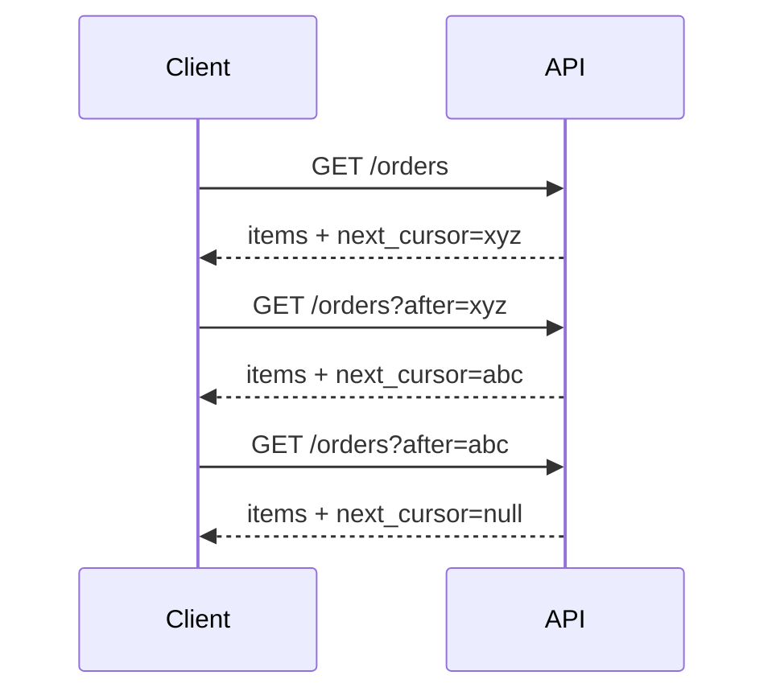
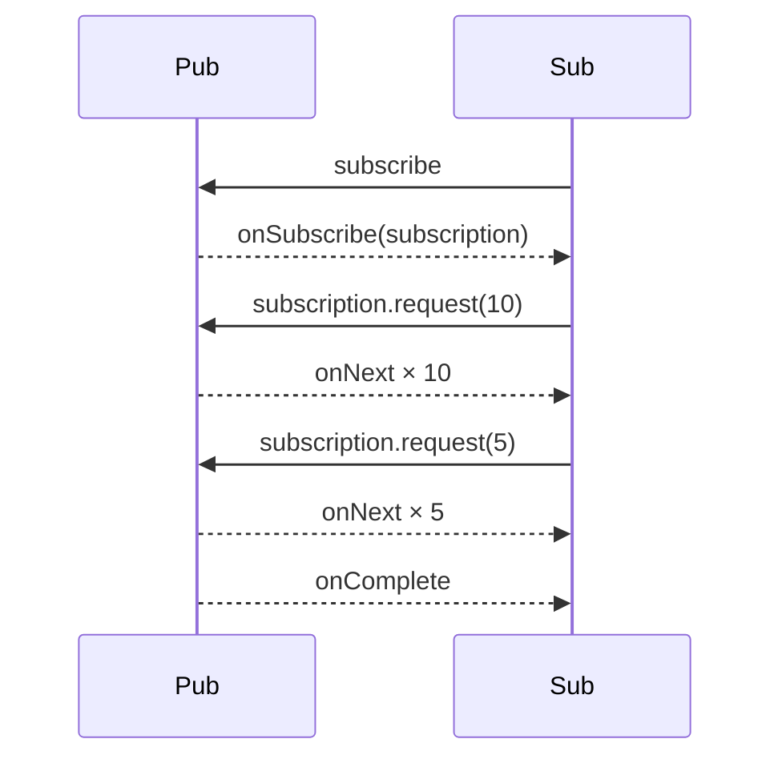

# Iterator — Senior Level

> **Source:** [refactoring.guru/design-patterns/iterator](https://refactoring.guru/design-patterns/iterator)
> **Prerequisite:** [Middle](middle.md)

---

## Table of Contents

1. [Introduction](#introduction)
2. [Iterator at Architectural Scale](#iterator-at-architectural-scale)
3. [Streaming Database Cursors](#streaming-database-cursors)
4. [Reactive Streams & Backpressure](#reactive-streams--backpressure)
5. [Concurrency & Fail-Fast Semantics](#concurrency--fail-fast-semantics)
6. [Spliterator and Parallelism](#spliterator-and-parallelism)
7. [Cursor Pagination at Scale](#cursor-pagination-at-scale)
8. [Code Examples — Advanced](#code-examples--advanced)
9. [Real-World Architectures](#real-world-architectures)
10. [Pros & Cons at Scale](#pros--cons-at-scale)
11. [Trade-off Analysis Matrix](#trade-off-analysis-matrix)
12. [Migration Patterns](#migration-patterns)
13. [Diagrams](#diagrams)
14. [Related Topics](#related-topics)

---

## Introduction

> Focus: **At scale, what breaks? What earns its keep?**

In toy code Iterator is "walk a list." In production it is "stream 100M rows from Postgres without OOM," "page through every S3 object across regions," "consume a Kafka topic with 50 partitions in parallel," "back-pressure-aware data pipeline." The senior question isn't "do I write Iterator?" — it's **"how do I bound memory, recover from failures mid-iteration, and parallelize without losing order or duplicating?"**

At scale Iterator intersects with:

- **Database cursors** — server-side iteration over result sets.
- **Reactive streams** — async + backpressure.
- **Cursor pagination** — stable, efficient page-through over distributed datasets.
- **Spliterator / parallelism** — Java's parallel-friendly iterator.
- **Stream processing** — Kafka Streams, Flink, Spark structured streaming.

These are Iterator at scale. The fundamentals apply but operational concerns dominate.

---

## Iterator at Architectural Scale

### 1. JDBC ResultSet streaming

```java
try (Connection c = ds.getConnection();
     PreparedStatement ps = c.prepareStatement("SELECT * FROM events", ResultSet.TYPE_FORWARD_ONLY, ResultSet.CONCUR_READ_ONLY);
     ResultSet rs = ps.executeQuery()) {
    ps.setFetchSize(1000);     // server-side cursor; pages of 1000
    while (rs.next()) {
        process(rs);
    }
}
```

Postgres / MySQL stream rows server-side. Without this, the driver loads everything into memory.

### 2. Kafka consumer iteration

```java
try (KafkaConsumer<String, byte[]> consumer = new KafkaConsumer<>(props)) {
    consumer.subscribe(List.of("events"));
    while (running) {
        ConsumerRecords<String, byte[]> records = consumer.poll(Duration.ofMillis(100));
        for (var rec : records) process(rec);
        consumer.commitSync();
    }
}
```

The consumer is an Iterator over partitioned, ordered logs. Poll-based with explicit offset commits.

### 3. Reactive iterators (Reactor / RxJava)

```java
Flux.fromIterable(huge)
    .filter(x -> x.score() > 0.5)
    .map(x -> transform(x))
    .buffer(100)
    .subscribe(batch -> store(batch));
```

Iteration with backpressure: subscriber requests N items at a time; publisher honors the request.

### 4. AWS S3 paginators

```java
ListObjectsV2Iterable response = s3.listObjectsV2Paginator(b -> b.bucket("data"));
for (S3Object o : response.contents()) { ... }
```

Iterates billions of objects across distributed storage. Pagination invisible to caller.

### 5. Apache Iceberg / Delta Lake

Table-format scans return Iterators over file-and-row-range pairs. Pushdown predicates and projections happen at iteration time.

### 6. Stream processors

Kafka Streams, Flink, Spark — iteration over time-windowed events with stateful operations. The framework manages checkpointing, exactly-once, and recovery.

---

## Streaming Database Cursors

### The problem

A query returns 100M rows. `SELECT * INTO MEMORY` doesn't fit.

### Cursors

The DB keeps the result set on the server. The client iterates, fetching pages.

```sql
-- Postgres
DECLARE c CURSOR FOR SELECT * FROM events;
FETCH FORWARD 1000 FROM c;
```

Drivers wrap this. JDBC: `setFetchSize`, `TYPE_FORWARD_ONLY`. Python `psycopg2`: `server_side_cursor`.

### Pitfalls

- **Forgetting to close the cursor** — leaks DB resources.
- **Long transactions** — server holds locks / WAL position. Can block VACUUM.
- **Cursor over a table being mutated** — depending on isolation, you may see stale or torn reads.
- **Default fetch size of 1** in some drivers — every row a round trip. Always tune.

### Snapshot vs live

Postgres cursors run inside a transaction; you see a snapshot. Other DBs vary.

For huge analytical queries, prefer columnar formats (Parquet, Arrow) with batch iteration over native cursors.

---

## Reactive Streams & Backpressure

The Reactive Streams JVM spec formalizes Iterators with **request semantics**:

```java
interface Subscription { void request(long n); void cancel(); }
interface Subscriber<T> {
    void onSubscribe(Subscription s);
    void onNext(T t);
    void onError(Throwable t);
    void onComplete();
}
```

Subscriber says "I can handle 10 items"; Publisher emits up to 10. Without this, fast publishers overwhelm slow subscribers.

### Pull-based

```java
public void onSubscribe(Subscription s) { s.request(10); }
public void onNext(T t) { process(t); subscription.request(1); }
```

Steady demand-driven flow. No memory blowup.

### Operators

`map`, `filter`, `flatMap`, `buffer`, `window`, `groupBy`. All preserve the request contract. `flatMap` introduces concurrency carefully.

### Mistake: blocking inside reactive Iterator

```java
flux.map(item -> blockingDbCall(item))   // STALLS the reactor thread
```

Use `subscribeOn(Schedulers.boundedElastic())` or refactor to true async.

---

## Concurrency & Fail-Fast Semantics

### Java's fail-fast

`ArrayList`, `HashMap` iterators check a modification counter; if changed, throw `ConcurrentModificationException`.

```java
List<Integer> list = new ArrayList<>(List.of(1, 2, 3));
for (int x : list) {
    if (x == 2) list.remove(0);   // CME on next iteration
}
```

Best-effort detection, not guaranteed. Better to use the Iterator's own `remove()` method.

### Fail-safe (snapshot)

`CopyOnWriteArrayList`, `ConcurrentHashMap.entrySet()` — iterator works on a snapshot. Doesn't see post-iteration writes; doesn't throw.

### Cost of snapshots

`CopyOnWriteArrayList` doubles memory on every write. Acceptable for read-mostly. For frequently-modified collections, use `ConcurrentHashMap` and accept "weakly consistent" iteration.

### Cross-thread iteration

Iterators are **not** thread-safe by default. Each thread should get its own. Sharing causes races.

```java
// BAD:
Iterator<X> shared = coll.iterator();
threads.forEach(t -> t.submit(() -> { while (shared.hasNext()) shared.next(); }));
```

Even thread-safe collections produce iterators that one thread should drive.

---

## Spliterator and Parallelism

Java 8's `Spliterator` is `Iterator + trySplit`:

```java
public interface Spliterator<T> {
    boolean tryAdvance(Consumer<? super T> action);
    Spliterator<T> trySplit();
    long estimateSize();
    int characteristics();
}
```

`trySplit` divides the iteration into halves for parallel processing. Streams' `parallel()` uses this.

### Characteristics

- `ORDERED` — has defined order.
- `DISTINCT` — no duplicates.
- `SORTED` — natural / comparator order.
- `SIZED` — known total size.
- `NONNULL` — no null elements.
- `IMMUTABLE` — source can't change.
- `CONCURRENT` — concurrent modification doesn't break.

These hint optimizations to the framework.

### Custom Spliterator

For huge custom collections (a 100GB file), implementing `Spliterator` lets `Stream.parallel()` split work across threads.

```java
class ChunkedSpliterator implements Spliterator<Chunk> {
    public Spliterator<Chunk> trySplit() {
        // split this iterator's range in half
    }
    // ...
}
```

---

## Cursor Pagination at Scale

### Offset pagination — the slow path

```sql
SELECT * FROM orders ORDER BY id LIMIT 100 OFFSET 100000;
```

Postgres scans the first 100K rows, then returns the next 100. O(N) for deep pages.

### Cursor pagination — the fast path

```sql
SELECT * FROM orders WHERE id > $last_id ORDER BY id LIMIT 100;
```

The "next URL" carries `$last_id`. Each page is O(log N + page_size). Stable under concurrent inserts.

### Iterator wraps it

```python
def iter_orders():
    cursor = None
    while True:
        url = f"/orders?after={cursor}" if cursor else "/orders"
        page = requests.get(url).json()
        if not page["data"]: return
        yield from page["data"]
        cursor = page.get("next_cursor")
        if not cursor: return
```

Caller sees a flat sequence; cursor-based pagination invisible.

### Pitfalls

- **Tiebreakers**: when ordering by non-unique field, add an ID tiebreaker.
- **Cursor opacity**: encode cursors as opaque strings (e.g., base64) so clients don't construct them.
- **Schema evolution**: changing `ORDER BY` invalidates outstanding cursors.
- **Late inserts**: rows added before the cursor's position are missed.

---

## Code Examples — Advanced

### A — Streaming JDBC iterator (Java)

```java
public final class StreamingRows implements Iterator<Row>, Closeable {
    private final ResultSet rs;
    private final Statement ps;
    private final Connection conn;
    private boolean hasNext;

    public StreamingRows(DataSource ds, String sql) throws SQLException {
        conn = ds.getConnection();
        conn.setAutoCommit(false);   // required for server-side cursors in Postgres
        ps = conn.prepareStatement(sql, ResultSet.TYPE_FORWARD_ONLY, ResultSet.CONCUR_READ_ONLY);
        ps.setFetchSize(1000);
        rs = ((PreparedStatement) ps).executeQuery();
        advance();
    }

    private void advance() {
        try { hasNext = rs.next(); }
        catch (SQLException e) { throw new RuntimeException(e); }
    }

    public boolean hasNext() { return hasNext; }

    public Row next() {
        if (!hasNext) throw new NoSuchElementException();
        Row r = readRow(rs);
        advance();
        return r;
    }

    public void close() throws IOException {
        try { rs.close(); ps.close(); conn.close(); }
        catch (SQLException e) { throw new IOException(e); }
    }

    private Row readRow(ResultSet rs) { /* ... */ return null; }
}
```

Use with `try-with-resources`. Leaks connections otherwise.

---

### B — Backpressure-aware reactive iterator (Reactor)

```java
Flux<Order> stream = Flux.<Order>create(sink -> {
    sink.onRequest(n -> {
        for (int i = 0; i < n; i++) {
            Order o = source.fetchOne();
            if (o == null) { sink.complete(); return; }
            sink.next(o);
        }
    });
});

stream
    .onBackpressureBuffer(10_000, dropped -> log.warn("dropped {}", dropped))
    .subscribe(o -> processSlowly(o));
```

`onRequest` honors subscriber's demand. Buffer absorbs spikes; overflow drops with logging.

---

### C — Parallel split iterator (Java Spliterator)

```java
public final class RangeSpliterator implements Spliterator.OfLong {
    private long current, last;

    public RangeSpliterator(long lo, long hi) { this.current = lo; this.last = hi; }

    public long estimateSize() { return last - current; }

    public int characteristics() {
        return SIZED | SUBSIZED | ORDERED | DISTINCT | SORTED | NONNULL | IMMUTABLE;
    }

    public Comparator<? super Long> getComparator() { return null; }

    public boolean tryAdvance(LongConsumer action) {
        if (current >= last) return false;
        action.accept(current++);
        return true;
    }

    public Spliterator.OfLong trySplit() {
        long mid = (current + last) >>> 1;
        if (mid <= current) return null;
        long lo = current; current = mid;
        return new RangeSpliterator(lo, mid);
    }
}
```

`Stream.parallel()` over this spliterator splits ranges; threads process each half independently.

---

### D — Async iterator with cancellation (Kotlin Flow)

```kotlin
fun pages(): Flow<Customer> = flow {
    var url: String? = "/customers"
    while (url != null) {
        val resp = httpClient.get(url).body<Page>()
        for (c in resp.data) emit(c)   // suspends until consumer requests
        url = resp.next_url
    }
}

// Consumer:
pages()
    .filter { it.plan == "enterprise" }
    .take(10)                  // stop after 10
    .collect { println(it.id) }
```

`take(10)` cancels upstream once 10 items emitted. The HTTP fetcher stops issuing requests.

---

## Real-World Architectures

### Stripe — list API with cursor pagination

```
GET /v1/charges?starting_after=ch_xyz&limit=100
```

Stable, fast, encoded cursors. The Iterator client SDKs auto-paginate — caller sees a flat sequence over millions of charges.

### AWS S3 — `ListObjectsV2`

Continuation tokens; auto-paginating iterators in every SDK. Iteration order is lexicographic by key.

### Kafka — partitioned consumer

Each consumer thread iterates assigned partitions. Order preserved within a partition; across partitions, no global order. Scale: add partitions, add consumers.

### Datadog — log search

Streaming Iterator over time-series log events. Tens of millions per query; cursor-based with cursor TTL.

---

## Pros & Cons at Scale

| Pros | Cons |
|---|---|
| Bounded memory regardless of dataset size | Resource lifecycle complexity |
| Cursor pagination is stable + fast | Cursors need careful schema design |
| Reactive iterators handle backpressure | Backpressure design needs deliberate attention |
| Spliterators enable parallel processing | Implementing a correct Spliterator is non-trivial |
| Standard for-each ergonomics | Mid-iteration failure recovery is hard |

---

## Trade-off Analysis Matrix

| Dimension | Eager list | Streaming Iterator | Reactive Stream |
|---|---|---|---|
| **Memory** | O(N) | O(1) | O(buffer) |
| **Latency to first item** | O(N) | O(1) | O(1) |
| **Re-iteration** | Yes | No (one-shot) | Re-subscribe |
| **Parallelism** | Easy (parallelStream) | Per-iterator-thread | Operators handle |
| **Backpressure** | N/A (all in memory) | Pull (caller pace) | Explicit `request(n)` |
| **Failure recovery** | Easy (retry whole) | Mid-iteration hard | Per-element |
| **Cancellation** | N/A | break | dispose / cancel |

---

## Migration Patterns

### From eager to streaming

```java
// Before:
List<Row> all = repo.findAll();   // OOM on big tables

// After:
try (Stream<Row> stream = repo.streamAll()) {
    stream.forEach(this::process);
}
```

The repository returns a `Stream` backed by a streaming Iterator + cursor.

### From offset to cursor pagination

1. Add `cursor` column / index (often the primary key).
2. Update API: accept `after=<cursor>` instead of `offset=N`.
3. Encode cursors opaquely.
4. Deprecate offset; remove later.

### From sync to reactive

1. Wrap existing Iterator with `Flux.fromIterable`.
2. Replace transformations gradually.
3. Add backpressure operators where appropriate.
4. Run end-to-end load tests for backpressure behavior.

---

## Diagrams

### Cursor pagination



### Reactive backpressure



---

## Related Topics

- Reactive Streams
- Pagination patterns
- Database cursors
- Stream processing
- Spliterator parallelism

[← Middle](middle.md) · [Professional →](professional.md)
