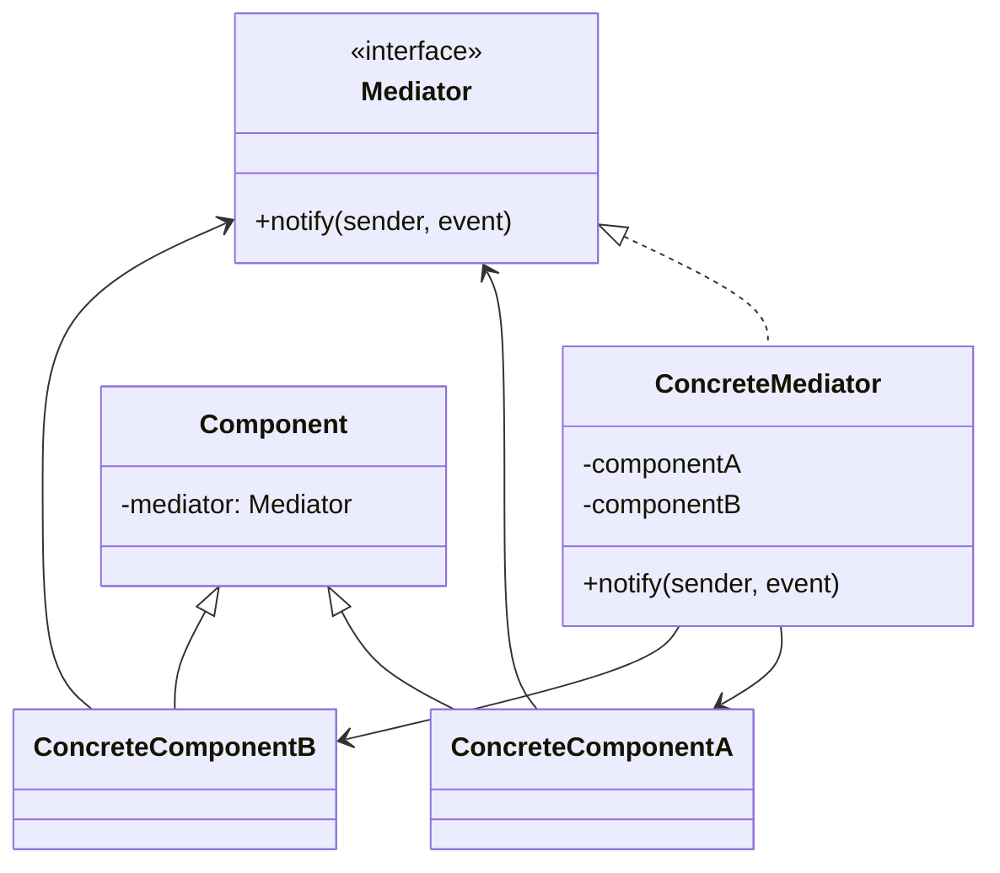
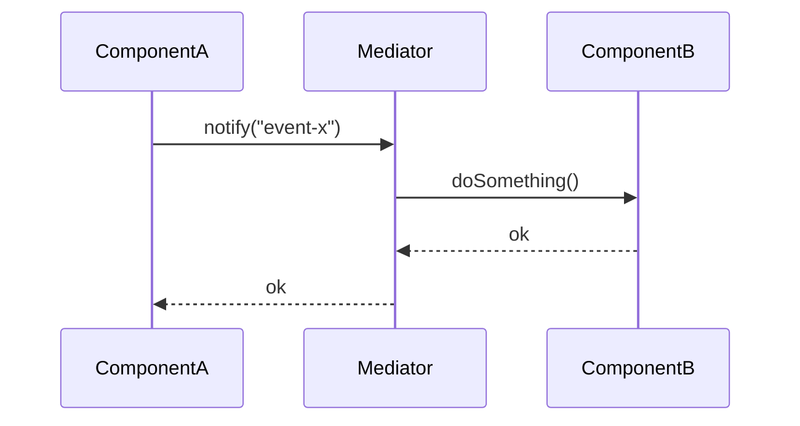

# Mediator — Junior Level

> **Source:** [refactoring.guru/design-patterns/mediator](https://refactoring.guru/design-patterns/mediator)
> **Category:** [Behavioral](../README.md) — *"Concerned with algorithms and the assignment of responsibilities between objects."*

---

## Table of Contents

1. [Introduction](#introduction)
2. [Prerequisites](#prerequisites)
3. [Glossary](#glossary)
4. [Core Concepts](#core-concepts)
5. [Real-World Analogies](#real-world-analogies)
6. [Mental Models](#mental-models)
7. [Pros & Cons](#pros--cons)
8. [Use Cases](#use-cases)
9. [Code Examples](#code-examples)
10. [Coding Patterns](#coding-patterns)
11. [Clean Code](#clean-code)
12. [Best Practices](#best-practices)
13. [Edge Cases & Pitfalls](#edge-cases--pitfalls)
14. [Common Mistakes](#common-mistakes)
15. [Tricky Points](#tricky-points)
16. [Test Yourself](#test-yourself)
17. [Tricky Questions](#tricky-questions)
18. [Cheat Sheet](#cheat-sheet)
19. [Summary](#summary)
20. [What You Can Build](#what-you-can-build)
21. [Further Reading](#further-reading)
22. [Related Topics](#related-topics)
23. [Diagrams & Visual Aids](#diagrams--visual-aids)

---

## Introduction

> Focus: **What is it?** and **How to use it?**

**Mediator** is a behavioral design pattern that turns chaotic many-to-many object interactions into a clean star: every component talks to a **central Mediator**, never to other components directly. The Mediator routes events and decides who reacts.

Imagine an air-traffic control tower at an airport. Pilots don't radio each other; they radio the tower. The tower coordinates: tells one plane to land, another to hold, another to taxi. Without the tower, every pilot would need to know every other pilot's flight plan — chaos. With it, each pilot only knows the tower.

In one sentence: *"Replace N×N peer chatter with N→1 talking to a coordinator."*

Mediator is the antidote to god-objects formed by accident — the slow drift where component A starts calling component B, then C, then D, then references back to A, until the dependency graph looks like a kitchen sink.

---

## Prerequisites

What you should know before reading this:

- **Required:** Basic OOP — interfaces, classes, references.
- **Required:** Composition. Components hold a reference to the Mediator.
- **Helpful:** Some experience with UI dialogs or chat systems — both are textbook Mediator scenarios.
- **Helpful:** A taste of why "tightly coupled" components rot over time — Mediator is the cure.

---

## Glossary

| Term | Definition |
|------|-----------|
| **Mediator** | The interface (or class) that coordinates components. |
| **Concrete Mediator** | The implementation. Knows about all participating Components. |
| **Component** (Colleague) | An object that participates. Holds a reference to its Mediator; calls `notify()` instead of calling siblings. |
| **Notify** | A Component telling the Mediator "I just did X" — the Mediator decides what to do next. |
| **Loose coupling** | Components don't know each other; they only know the Mediator interface. |

---

## Core Concepts

### 1. Components Don't Know Each Other

Each Component holds a reference to the **Mediator**, never to other Components. Adding or removing a Component doesn't ripple through the codebase.

```java
class TextField {
    private Mediator mediator;
    public void onChanged() {
        mediator.notify(this, "changed");
    }
}
```

The `TextField` doesn't know there's a `SubmitButton` listening — only the Mediator does.

### 2. The Mediator Knows All Components

```java
class FormMediator implements Mediator {
    private TextField input;
    private Button submit;
    private Label error;

    public void notify(Component sender, String event) {
        if (sender == input && "changed".equals(event)) {
            submit.setEnabled(input.text().length() > 0);
        }
    }
}
```

The Mediator is the single place where the *interaction logic* lives. Components have local logic only.

### 3. Notify, Not Call

Components don't reach into other Components. They tell the Mediator: "this happened." The Mediator decides who reacts.

```java
input.notify("changed");      // not: input.button.setEnabled(true);
```

### 4. Open/Closed for Components

Adding a new Component means: implement Component, register with Mediator. The other Components don't change. The Mediator updates to handle new interactions.

### 5. Distinct from Observer

Both decouple senders from receivers. **Observer** is one-to-many broadcast (subject doesn't know who listens). **Mediator** is many-to-many through a coordinator (mediator knows all participants and routes specifically).

---

## Real-World Analogies

| Concept | Analogy |
|---------|--------|
| **Mediator** | Air-traffic control tower. Pilots radio it; it directs each. |
| **Component** | Pilot. Knows the tower; doesn't know other pilots' flight plans. |
| **Notify** | "Tower, this is flight 42, requesting landing." |
| **Concrete Mediator** | The duty controller, with the radar map of all aircraft. |

The classical refactoring.guru analogy is a **chat room**: users don't direct-message each other; they post in the room. The room (Mediator) routes messages to participants. The room knows the user list; the users only know the room.

Another good one is a **smart-home hub**: motion sensor → hub → lights + speaker + thermostat. The hub knows all devices; each device knows only the hub.

---

## Mental Models

**The intuition:** Picture a phone exchange in 1920. Without it, you'd need a direct wire to every other phone — N² wires. With the exchange, every phone has one wire (to the exchange), which routes calls. N wires + an operator. The pattern is the same.

**Why this model helps:** It makes the *coupling reduction* explicit. Mediator absorbs the wiring complexity; components stay simple.

**Visualization:**

```
   Without Mediator:                   With Mediator:
   ┌──┐ ↔ ┌──┐ ↔ ┌──┐                ┌──┐    ┌──┐    ┌──┐
   │A │   │B │   │C │                │A │    │B │    │C │
   └──┘ ↔ └──┘ ↔ └──┘                └─┬┘    └─┬┘    └─┬┘
     ↕      ↕      ↕                    └──────┼──────┘
   ┌──┐ ↔ ┌──┐ ↔ ┌──┐                          │
   │D │   │E │   │F │                       ┌──▼──┐
   └──┘ ↔ └──┘ ↔ └──┘                       │ Med │
                                            └──┬──┘
                                               │
                                          (knows all)
```

N×N peer chatter becomes a star.

---

## Pros & Cons

| Pros | Cons |
|------|------|
| Components don't know each other | The Mediator can become a god class |
| Adding/removing components is local | Centralized state can be hard to debug |
| Interaction logic is in one place | Mediator can grow large |
| Components are reusable in other contexts | Performance: indirection through one object |
| Testable: unit-test the Mediator separately | Coupling shifts from peers to Mediator-as-bottleneck |

### When to use:
- Many objects communicate in complex, evolving ways
- Reusing a component is hard because of its dependencies
- Subclassing components just to change interactions is painful
- A UI form has many fields whose state depends on each other
- Microservices need a central coordinator (orchestration pattern)

### When NOT to use:
- The interaction is simple, two components calling each other
- The Mediator is becoming a god class with all logic
- You're building Mediator on top of an already-clean Observer pattern
- The components are independent and don't actually need to interact

---

## Use Cases

Real-world places where Mediator is commonly applied:

- **GUI dialog logic** — fields, buttons, labels coordinated by a dialog controller.
- **Chat rooms** — users post to the room; the room broadcasts.
- **Air-traffic-control / dispatch systems** — central coordinator for autonomous units.
- **Smart-home hubs** — Home Assistant, SmartThings: devices report to hub; hub orchestrates.
- **Workflow engines / orchestrators** — Camunda, Temporal, AWS Step Functions.
- **Event-driven choreography vs orchestration** — Mediator is "orchestration."
- **Game UIs** — HUD coordinates between widgets.
- **MVC controllers** — the controller is a Mediator between view and model.
- **Spring's `ApplicationContext`** — centrally wires beans (related to mediation).

---

## Code Examples

### Go

A simple chat room.

```go
package main

import "fmt"

// Mediator interface.
type Room interface {
	Send(from string, msg string)
	Join(u *User)
}

// Concrete Mediator.
type ChatRoom struct {
	users []*User
}

func (r *ChatRoom) Join(u *User) {
	r.users = append(r.users, u)
	u.room = r
}

func (r *ChatRoom) Send(from, msg string) {
	for _, u := range r.users {
		if u.name != from {
			u.Receive(from, msg)
		}
	}
}

// Component.
type User struct {
	name string
	room Room
}

func (u *User) Say(msg string) {
	u.room.Send(u.name, msg)
}

func (u *User) Receive(from, msg string) {
	fmt.Printf("[%s sees] %s: %s\n", u.name, from, msg)
}

func main() {
	room := &ChatRoom{}
	alice := &User{name: "Alice"}
	bob := &User{name: "Bob"}
	carol := &User{name: "Carol"}

	room.Join(alice)
	room.Join(bob)
	room.Join(carol)

	alice.Say("hi everyone")
	bob.Say("hey Alice")
}
```

**What it does:** Users post to the room; the room delivers to others. Users don't know each other directly.

**How to run:** `go run main.go`

---

### Java

A login dialog where fields coordinate the submit button.

```java
public interface Mediator {
    void notify(Component sender, String event);
}

public abstract class Component {
    protected final Mediator mediator;
    protected Component(Mediator m) { this.mediator = m; }
}

public final class TextField extends Component {
    private String text = "";
    public TextField(Mediator m) { super(m); }
    public String text() { return text; }
    public void setText(String t) {
        text = t;
        mediator.notify(this, "changed");
    }
}

public final class Button extends Component {
    private boolean enabled;
    public Button(Mediator m) { super(m); }
    public void setEnabled(boolean e) { this.enabled = e; }
    public boolean isEnabled() { return enabled; }
}

public final class LoginDialog implements Mediator {
    private TextField username, password;
    private Button submit;

    public LoginDialog() {
        username = new TextField(this);
        password = new TextField(this);
        submit = new Button(this);
        submit.setEnabled(false);
    }

    @Override
    public void notify(Component sender, String event) {
        if ((sender == username || sender == password) && "changed".equals(event)) {
            submit.setEnabled(!username.text().isEmpty() && !password.text().isEmpty());
        }
    }

    public TextField username() { return username; }
    public TextField password() { return password; }
    public Button submit() { return submit; }
}

public class Demo {
    public static void main(String[] args) {
        LoginDialog d = new LoginDialog();
        System.out.println(d.submit().isEnabled());   // false

        d.username().setText("alice");
        System.out.println(d.submit().isEnabled());   // false

        d.password().setText("secret");
        System.out.println(d.submit().isEnabled());   // true
    }
}
```

**What it does:** Submit button enables only when both fields are filled. Fields don't know about each other or the button — the dialog (Mediator) coordinates.

**How to run:** `javac *.java && java Demo`

---

### Python

Smart-home hub with sensors and actuators.

```python
from typing import Protocol


class Hub(Protocol):
    def notify(self, sender: str, event: str) -> None: ...


class MotionSensor:
    def __init__(self, hub: Hub) -> None:
        self._hub = hub

    def detect_motion(self) -> None:
        print("[motion] detected")
        self._hub.notify("motion", "detected")


class Light:
    def __init__(self, hub: Hub) -> None:
        self._hub = hub
        self._on = False

    def turn_on(self) -> None:
        self._on = True
        print("[light] ON")

    def turn_off(self) -> None:
        self._on = False
        print("[light] OFF")


class SmartHome:
    """Mediator."""
    def __init__(self) -> None:
        self.motion = MotionSensor(self)
        self.light = Light(self)

    def notify(self, sender: str, event: str) -> None:
        if sender == "motion" and event == "detected":
            self.light.turn_on()


if __name__ == "__main__":
    home = SmartHome()
    home.motion.detect_motion()   # turns on the light
```

**What it does:** Motion sensor reports to the hub; the hub turns on the light. The sensor and light don't know each other.

**How to run:** `python3 main.py`

---

## Coding Patterns

### Pattern 1: Single-method `notify`

**Intent:** All components call one method on the Mediator with a string/enum event.

```java
mediator.notify(this, "submit-clicked");
```

**Pros:** Simple, uniform.
**Cons:** Stringly typed — typos compile fine; harder to refactor.

**When:** Small Mediators, prototype code.

---

### Pattern 2: Typed methods on the Mediator

**Intent:** The Mediator has a method per event type.

```java
interface DialogMediator {
    void usernameChanged();
    void submitClicked();
}
```

**Pros:** Type-safe; refactorable.
**Cons:** Mediator interface grows with events.

**When:** Production code; clear set of events.

---

### Pattern 3: Mediator as event bus

**Intent:** Components publish events to the Mediator; the Mediator routes to subscribers it knows about.

```java
mediator.publish(new SubmitClicked());
```

This blurs Mediator and Observer. Use Mediator's name when the Mediator is *also* responsible for the interaction logic, not just routing.

**When:** Larger systems where Mediator coordinates Observer chains.

---

### Pattern 4: Hierarchy of Mediators

**Intent:** A complex form has sub-dialogs; each is its own Mediator. A parent Mediator coordinates sub-dialogs.

```
PageMediator
├── HeaderMediator
├── FormMediator
└── FooterMediator
```

**When:** Large UIs; modular orchestration.

---

## Clean Code

- **Name the Mediator after its purpose.** `LoginDialog`, `ChatRoom`, `OrderOrchestrator` — not `Mediator`.
- **Don't put business logic in components** that should be in the Mediator. Components are dumb; the Mediator is smart.
- **Keep `notify()` actions short.** A long Mediator method handling 20 cases is a code smell.
- **Document who owns what.** Components own their state; Mediator owns the *interaction*.
- **Components shouldn't reach into other components** through the Mediator. The Mediator decides; components ask.

---

## Best Practices

- **Use typed events / methods**, not magic strings.
- **Lazy-initialize the Mediator** if components need to register dynamically.
- **Make components reusable.** They should work with any Mediator implementing the interface.
- **Consider event-bus alternative** when interactions are pure broadcast (Observer, not Mediator).
- **Beware god-class**: split a Mediator that grows past ~10 methods.
- **Test the Mediator independently** with stub components.

---

## Edge Cases & Pitfalls

- **Circular notify chains.** A's notify triggers B; B's notify triggers A; infinite loop.
- **Mediator that's also a Component.** Tempting if the Mediator has UI; usually bad — split responsibilities.
- **Adding components mid-flight.** If new components show up at runtime, the Mediator must support registration; document the lifecycle.
- **Component leaks.** Mediator holds strong refs; components can't be GC'd until the Mediator releases.
- **Inflexible coordination.** Mediator hardcodes interactions; supporting variations requires conditionals or strategies.
- **Distributed Mediator.** Cross-process Mediator becomes an orchestration service — same pattern, different infrastructure.

---

## Common Mistakes

1. **Components calling each other directly.** Defeats the pattern; gradually drift.
2. **Mediator becoming a god object.** All logic centralized; refactor.
3. **Mediator as event bus only.** That's Observer; don't call it Mediator unless interaction logic is centralized.
4. **Magic-string events.** Hard to refactor; vulnerable to typos.
5. **Tightly coupling Mediator to a specific Component class.** Defeats reuse.
6. **Forgetting to unregister components.** Memory leak.

---

## Tricky Points

### Mediator vs Observer

| | Mediator | Observer |
|---|---|---|
| **Topology** | Many-to-many through center | One-to-many broadcast |
| **Coordinator's role** | Routes specifically | Just notifies all |
| **Components know** | Only Mediator | Subject (subscribers know it; subject doesn't know them) |
| **Interaction logic** | In Mediator | Distributed across Observers |

In practice, Mediator often *uses* Observer internally (Mediator IS the subject, components are observers). The distinction is intent: routing + coordination (Mediator) vs broadcast notification (Observer).

### Mediator vs Facade

Both centralize. Facade hides complexity of a *subsystem* from the *outside* — clients use the simpler facade. Mediator coordinates internal participants — components talk through it. Facade is about *encapsulation*; Mediator is about *interaction*.

### Mediator becomes a god class

Common drift. Symptoms: 1000-line Mediator, every method is a special case, hard to test. Refactor: split by concern (HeaderMediator, FormMediator, etc.) or extract Strategy / Command for routed actions.

---

## Test Yourself

1. What problem does Mediator solve?
2. Why don't Components know about each other?
3. What's the difference between Mediator and Observer?
4. Give 5 real-world examples of Mediator.
5. What's a god-class risk and how do you avoid it?
6. When is Observer a better choice than Mediator?

---

## Tricky Questions

- **Q: If the Mediator has a method per event, isn't that a god class?**
  A: It can become one. Mitigations: split by domain, use Strategy or Command for action handling, ensure each method is short. The Mediator centralizes *coordination*, not *implementation*.
- **Q: Is MVC's controller a Mediator?**
  A: Often yes — it routes between view and model, decoupling them. Some codebases use that exact term.
- **Q: Can a Mediator have multiple Concrete Mediators for different contexts?**
  A: Yes. The interface stays the same; each Concrete Mediator implements specific interaction logic. Useful for variants of the same UI / workflow.
- **Q: Does Spring's `ApplicationContext` count as Mediator?**
  A: It mediates dependency injection — wiring beans together. Conceptually similar; usually we call it a DI container, not a Mediator. The Mediator pattern formally requires explicit notify-style coordination.

---

## Cheat Sheet

| Concept | One-liner |
|---|---|
| Intent | Centralize many-to-many interactions through a coordinator |
| Roles | Mediator (coordinator), Component (participant) |
| Hot loop | `mediator.notify(this, event)` |
| Sibling | Observer (broadcast), Facade (encapsulation) |
| Smell to fix | N×N peer dependencies between components |

---

## Summary

Mediator turns N×N chatter into a star: every component talks to the Mediator; the Mediator decides who hears what. Components become reusable; coordination logic lives in one place.

Three things to remember:
1. **Components know only the Mediator.** Loose coupling is the win.
2. **The Mediator knows everything.** It's the trade-off.
3. **Watch for god-class drift.** Split when methods proliferate.

If you find yourself adding `if A then B.method()` inside a Component, the Mediator is being asked to be born.

---

## What You Can Build

- A login dialog with cross-field validation
- A chat room with multiple users
- A smart-home hub coordinating sensors and actuators
- A flight-booking workflow coordinator
- A multi-tab UI where tab interactions need orchestration

---

## Further Reading

- *Design Patterns: Elements of Reusable Object-Oriented Software* (GoF) — original Mediator chapter
- [refactoring.guru — Mediator](https://refactoring.guru/design-patterns/mediator)
- *Patterns of Enterprise Application Architecture* (Fowler) — orchestration patterns

---

## Related Topics

- [Observer](../06-observer/junior.md) — broadcast counterpart
- [Facade](../../02-structural/05-facade/junior.md) — different intent, similar centralization
- [Command](../02-command/junior.md) — Mediator often dispatches Commands
- [Saga / orchestration](../../../coding-principles/saga.md) — distributed Mediator
- [MVC / MVVM](../../../coding-principles/mvc.md) — controller as Mediator

---

## Diagrams & Visual Aids

### Class diagram



### Sequence: notify and route



### Decision flow

```
                ┌──────────────────────┐
                │ Multiple components  │
                │ interacting in a web?│
                └─────────┬────────────┘
                          │ yes
                          ▼
                ┌──────────────────────┐
                │ Need centralized     │
                │ interaction logic?   │
                └─────────┬────────────┘
                          │ yes
                          ▼
                ┌──────────────────────┐
                │ Pure broadcast OK?   │
                │ (no specific routing)│
                └─────────┬────────────┘
                          │ no — use Mediator
                          ▼
                  ──> Use Mediator
```

[← Back to Behavioral Patterns](../README.md) · [Middle →](middle.md)
