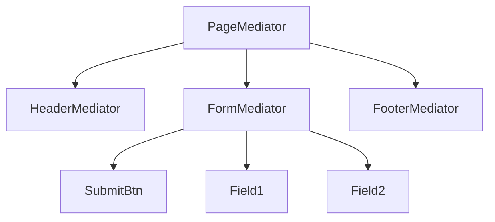
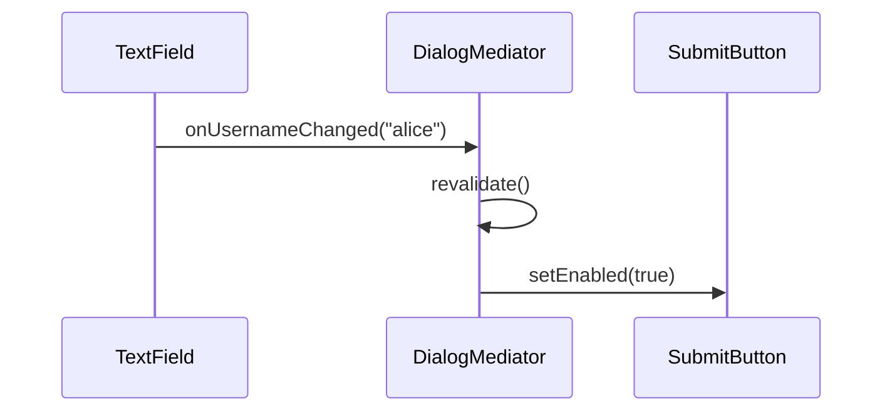

# Mediator — Middle Level

> **Source:** [refactoring.guru/design-patterns/mediator](https://refactoring.guru/design-patterns/mediator)
> **Prerequisite:** [Junior](junior.md)

---

## Table of Contents

1. [Introduction](#introduction)
2. [When to Use Mediator](#when-to-use-mediator)
3. [When NOT to Use Mediator](#when-not-to-use-mediator)
4. [Real-World Cases](#real-world-cases)
5. [Code Examples — Production-Grade](#code-examples--production-grade)
6. [Mediator vs Observer vs Event Bus](#mediator-vs-observer-vs-event-bus)
7. [MVC / MVVM as Mediator](#mvc--mvvm-as-mediator)
8. [Trade-offs](#trade-offs)
9. [Alternatives Comparison](#alternatives-comparison)
10. [Refactoring to Mediator](#refactoring-to-mediator)
11. [Pros & Cons (Deeper)](#pros--cons-deeper)
12. [Edge Cases](#edge-cases)
13. [Tricky Points](#tricky-points)
14. [Best Practices](#best-practices)
15. [Tasks (Practice)](#tasks-practice)
16. [Summary](#summary)
17. [Related Topics](#related-topics)
18. [Diagrams](#diagrams)

---

## Introduction

> Focus: **When to use it?** and **Why?**

You already know Mediator is "centralize many-to-many through a coordinator." At the middle level the harder questions are:

- **Mediator or Observer?** Both decouple; subtle but different.
- **Magic strings, typed methods, or event objects?** Different ergonomics.
- **One Mediator or a hierarchy?** Big systems need the latter.
- **Where does state live?** Components, Mediator, or both?
- **How do you avoid god-class drift?**

This document focuses on **decisions and patterns** that turn textbook Mediator into something that survives a year of production.

---

## When to Use Mediator

Use Mediator when **all** of these are true:

1. **Many components interact in non-trivial ways.** Two components don't need a Mediator.
2. **Reusing components is hard because of their dependencies.** Mediator extracts the wiring.
3. **You expect interactions to evolve.** Centralizing makes change cheap.
4. **The participants are bounded and known.** Mediator works best with a finite, identified component set.
5. **Coordination logic is a domain concern.** You want it in one place, named.

If most are missing, look elsewhere first.

### Triggers

- "This dialog has 12 fields and they all affect each other." → Mediator (DialogController).
- "Workflow: place order → charge card → ship → notify." → Mediator (OrderOrchestrator).
- "Components rendered side-by-side need to coordinate state." → Mediator.
- "Multiple sensors trigger multiple actuators." → Mediator (SmartHomeHub).
- "Microservices need a central orchestration." → Mediator at architectural scale.

---

## When NOT to Use Mediator

- **Two or three components with simple interactions.** Direct calls fine.
- **Pure broadcast** with no specific routing. Use Observer.
- **Components vary across many contexts.** Mediator hardcodes; consider Strategy / dependency injection.
- **The Mediator does so much it has become a god class.** Split it.

### Smell: Mediator-as-god

Your `MainDialog` mediator has 50 methods, 2000 lines, knows about 30 components. That's not a Mediator — that's a god class wearing a Mediator costume. Split by sub-domain (header, form, footer); compose Mediators hierarchically.

---

## Real-World Cases

### Case 1 — UI dialog logic

```typescript
class CheckoutDialog {
    constructor(
        private email: TextField,
        private phone: TextField,
        private address: AddressField,
        private payNow: Button,
    ) {
        email.onChange = () => this.validate();
        phone.onChange = () => this.validate();
        address.onChange = () => this.validate();
    }

    private validate() {
        const valid = isEmail(email.value) && phone.value.length >= 7 && address.isValid();
        payNow.setEnabled(valid);
    }
}
```

The dialog is the Mediator. Fields don't validate each other; they notify the dialog.

### Case 2 — Chat room with rules

A chat room (Mediator) routes messages, but also enforces:
- Rate limits (slow down spammers)
- Word filters
- Mute / kick logic

Components (users) don't know each other. The Mediator centralizes policy.

### Case 3 — Smart-home hub

Home Assistant, SmartThings: motion sensor → hub → lights + thermostat. Devices don't communicate directly. The hub coordinates.

### Case 4 — Workflow orchestrator

```python
class OrderOrchestrator:
    def place(self, order):
        self.payment.charge(order)
        self.inventory.reserve(order)
        self.shipping.dispatch(order)
        self.notification.send(order.customer, "shipped")
```

Each service is a Component; the orchestrator routes calls. Saga = distributed Mediator.

### Case 5 — MVVM ViewModel

In MVVM, the ViewModel mediates between View (UI) and Model (data). View binds to ViewModel; ViewModel exposes commands; Model is updated by the ViewModel. Decouples both directions.

### Case 6 — Game UI (HUD)

A heads-up display has health, score, minimap, inventory, chat. Each can change; some affect others (e.g., low health flashes warning). HUD controller (Mediator) coordinates.

### Case 7 — IDE plugin coordinator

VS Code extensions: file events, language servers, diagnostics, status bars. The extension host mediates between contributing parts. Extensions don't talk directly to each other.

---

## Code Examples — Production-Grade

### Example A — Typed Mediator interface (Java)

```java
public interface DialogMediator {
    void onUsernameChanged(String value);
    void onPasswordChanged(String value);
    void onSubmitClicked();
    void onCancelClicked();
}

public final class LoginDialog implements DialogMediator {
    private final TextField username = new TextField(this, "username");
    private final TextField password = new TextField(this, "password");
    private final Button submit = new Button(this, "submit");
    private final Button cancel = new Button(this, "cancel");

    public void onUsernameChanged(String value) { revalidate(); }
    public void onPasswordChanged(String value) { revalidate(); }

    public void onSubmitClicked() {
        loginService.login(username.value(), password.value());
    }

    public void onCancelClicked() { /* close dialog */ }

    private void revalidate() {
        submit.setEnabled(!username.value().isEmpty() && !password.value().isEmpty());
    }
}
```

Typed methods (no magic strings). Components call specific methods; refactoring is safe.

---

### Example B — Mediator with event objects (TypeScript)

```typescript
type Event =
    | { type: 'usernameChanged'; value: string }
    | { type: 'passwordChanged'; value: string }
    | { type: 'submitClicked' }
    | { type: 'cancelClicked' };

interface Mediator {
    notify(event: Event): void;
}

class LoginDialog implements Mediator {
    notify(event: Event): void {
        switch (event.type) {
            case 'usernameChanged':
            case 'passwordChanged':
                this.revalidate();
                break;
            case 'submitClicked':
                this.submit();
                break;
            case 'cancelClicked':
                this.close();
                break;
        }
    }

    private revalidate() { /* ... */ }
    private submit() { /* ... */ }
    private close() { /* ... */ }
}
```

Discriminated union events. TypeScript exhaustiveness check on `switch`.

---

### Example C — Hierarchical Mediator (Python)

```python
class HeaderMediator:
    def notify(self, sender: str, event: str) -> None:
        if sender == "logo" and event == "clicked":
            self._navigate_home()


class FormMediator:
    def notify(self, sender: str, event: str) -> None:
        if sender == "submit" and event == "clicked":
            self._submit()


class PageMediator:
    """Top-level Mediator coordinating sub-mediators."""
    def __init__(self) -> None:
        self.header = HeaderMediator()
        self.form = FormMediator()

    def notify(self, source: str, event: str, data: dict | None = None) -> None:
        if source == "form" and event == "submitted":
            # form notifies the page; page may show a modal, redirect, etc.
            print("Page: form submitted, redirecting")
```

Sub-mediators handle their slice; the Page mediator coordinates between them.

---

### Example D — Workflow orchestrator (Python)

```python
import asyncio
from dataclasses import dataclass


@dataclass
class Order:
    id: str
    cents: int


class OrderOrchestrator:
    def __init__(self, payment, inventory, shipping, notif):
        self.payment = payment
        self.inventory = inventory
        self.shipping = shipping
        self.notif = notif

    async def place(self, order: Order) -> None:
        try:
            await self.payment.charge(order)
            await self.inventory.reserve(order)
            await self.shipping.dispatch(order)
            await self.notif.email_customer(order, "Order shipped")
        except Exception as e:
            print(f"order {order.id} failed: {e}")
            # compensations
            await self.payment.refund(order)
            await self.inventory.release(order)
            raise
```

Mediator at process level; coordinates async calls; handles compensations.

---

## Mediator vs Observer vs Event Bus

| | Mediator | Observer | Event Bus |
|---|---|---|---|
| **Topology** | Many-to-many through center | One-to-many | Many-to-many through bus |
| **Coordinator's role** | Routes specifically + has logic | Notifies passively | Routes by event type |
| **Components know** | Only Mediator | Subject (push) or nothing (pull) | Only the bus |
| **Coupling reduced** | Components from each other | Subject from observers | Producer from consumers |
| **Use case** | Coordinated UI / workflow | Broadcast events | Decoupled cross-module messaging |

**Rule of thumb:**
- Pure broadcast → Observer.
- Coordinated logic in one place → Mediator.
- Many decoupled producers / consumers across modules → Event Bus.

---

## MVC / MVVM as Mediator

The Controller (MVC) and ViewModel (MVVM) mediate between View and Model.

```
View → Controller → Model
View ← Controller ← Model
```

Same shape. The controller centralizes coordination logic. Reusing the View with a different controller switches behavior; reusing the Model with a different controller changes presentation.

In React terms, custom hooks often play the Mediator role: components subscribe to the hook, which routes state changes and effects.

---

## Trade-offs

| Trade-off | Cost | Benefit |
|---|---|---|
| Centralized coordination | Mediator can grow | One place to read / change interactions |
| Components ignorant of each other | Components less expressive | Independent reuse, isolated tests |
| Typed events | Boilerplate | Refactor-safe, exhaustiveness checks |
| Magic-string events | Concise | Fragile, no compile-time checks |
| Hierarchical Mediators | More moving parts | Bounded responsibility per layer |

---

## Alternatives Comparison

| Pattern | Use when |
|---|---|
| **Mediator** | Centralize many-to-many interactions in one coordinator |
| **Observer** | One-to-many broadcast; subject doesn't know subscribers |
| **Event bus** | Pub/sub across loosely related modules |
| **Facade** | Hide a subsystem from outside callers |
| **Command bus** | Centralized command dispatch |
| **State machine** | Behavior depends on internal state transitions |

---

## Refactoring to Mediator

### Symptom
Components calling each other directly.

```java
class UsernameField {
    public void onChange() {
        if (text.isEmpty() || password.text.isEmpty()) {
            submitButton.setEnabled(false);
        } else {
            submitButton.setEnabled(true);
        }
    }
}
```

`UsernameField` knows about `password` and `submitButton`. Reuse impossible.

### Steps
1. Define a `Mediator` interface with the events you'll route.
2. Make components hold a `Mediator` reference instead of references to siblings.
3. Replace direct calls with `mediator.notify(this, event)`.
4. Implement the Concrete Mediator with the wiring logic.
5. Test: components stand alone; Mediator unit-testable with stub components.

### After

```java
class UsernameField {
    public void onChange() { mediator.onUsernameChanged(text); }
}

class LoginDialog implements Mediator {
    public void onUsernameChanged(String value) { revalidate(); }
}
```

Components are now reusable in any context.

---

## Pros & Cons (Deeper)

| Pros | Cons |
|---|---|
| **Components reusable** in different contexts | Mediator becomes a knowledge concentration |
| **Open/Closed**: add components without touching siblings | Mediator interface grows over time |
| **Testable**: stub components for unit tests | God-class drift if not split |
| **Refactor-safe** with typed events | Magic-string events undo the safety |
| **Coordination logic in one place** | Single point of failure / bottleneck |

---

## Edge Cases

### 1. Cyclic notification

A's notify triggers B; B's notify triggers A. Infinite loop.

**Fix:** detect with a flag; break with state.

```java
private boolean inUpdate;
public void onUsernameChanged(String value) {
    if (inUpdate) return;
    inUpdate = true;
    try { /* update logic */ } finally { inUpdate = false; }
}
```

### 2. Component leaks

Mediator holds strong refs; components can't be GC'd. For long-lived Mediators with short-lived components, use weak refs or explicit unregister.

### 3. Mediator doing too much

Mediator's responsibilities should be coordination, not implementation. If a method is implementing complex business logic, extract a Strategy or Command.

### 4. Threading

Mediator usually runs on one thread (UI thread, request thread). For multi-threaded coordination, synchronize methods or use a single-threaded executor.

### 5. Distributed Mediator

When the Mediator coordinates across processes, you've moved into orchestration / saga territory. Same pattern; different infrastructure (workflow engine, message broker).

---

## Tricky Points

### Mediator vs Observer subtlety

Mediator often *uses* Observer internally: components fire events; the Mediator subscribes. The Mediator pattern is about **who has the coordination logic** — that's the Mediator. Observer is about **decoupled notification** — no one has central logic.

Sometimes the same code can be called either pattern. Use the name that matches your design intent.

### Component identity

The Mediator's `notify(sender, event)` typically takes the Component as `sender`. The Mediator can branch on `sender` to dispatch. Alternative: each Component class has a dedicated method on the Mediator (typed).

Choose based on Mediator size:
- Small Mediator: branch on sender works.
- Large Mediator: typed methods are clearer.

### State ownership

Decide upfront:
- **Component-owned state**: each Component has its data; Mediator queries.
- **Mediator-owned state**: Mediator has the source of truth; Components are views.

Mixing the two is the source of most Mediator confusion.

### Mediator and DI

Sometimes the DI container builds the Mediator and components, wiring them together. The Mediator pattern is preserved; the wiring just happens at config time.

---

## Best Practices

- **Use typed events** (methods or discriminated unions). Magic strings rot.
- **Keep `notify` short.** Delegate to private methods or strategies.
- **One responsibility per Mediator.** If it spans concerns, split.
- **Hierarchy when complexity grows.** Sub-Mediators for sub-domains.
- **Document state ownership.** Component or Mediator — pick.
- **Test the Mediator with stub components.** Mediator logic is the prize.
- **Don't overuse.** Two components rarely need a Mediator.

---

## Tasks (Practice)

1. **Login dialog.** Username, password, submit, cancel. Submit enables only when both fields filled.
2. **Chat room.** Multiple users; rules: rate-limit, word filter.
3. **Smart-home hub.** Motion sensor + light + alarm.
4. **Wizard form.** Multi-step form with state shared across steps.
5. **Order orchestrator.** Saga that calls payment, inventory, shipping; compensates on failure.
6. **Hierarchical Mediator.** Header + content + footer mediators, coordinated by a page mediator.

(Solutions in [tasks.md](tasks.md).)

---

## Summary

At the middle level, Mediator is not just "central coordinator." It's:

- **Typed events** vs magic strings.
- **One Mediator per cohesive domain**, not one per app.
- **Components as values** that coordinate through the Mediator interface.
- **State ownership clearly assigned.**
- **God-class avoidance** by splitting and composing Mediators.

The win is local reasoning: components are independent; coordination is in one named place. The cost is a Mediator that needs care to stay healthy.

---

## Related Topics

- [Observer](../06-observer/middle.md) — broadcast pattern
- [Command](../02-command/middle.md) — Mediator dispatches Commands
- [Facade](../../02-structural/05-facade/middle.md) — encapsulation, not coordination
- Saga / orchestration — distributed Mediator
- MVC / MVVM

---

## Diagrams

### Hierarchical Mediator



### Sequence: typed Mediator method



[← Junior](junior.md) · [Senior →](senior.md)
