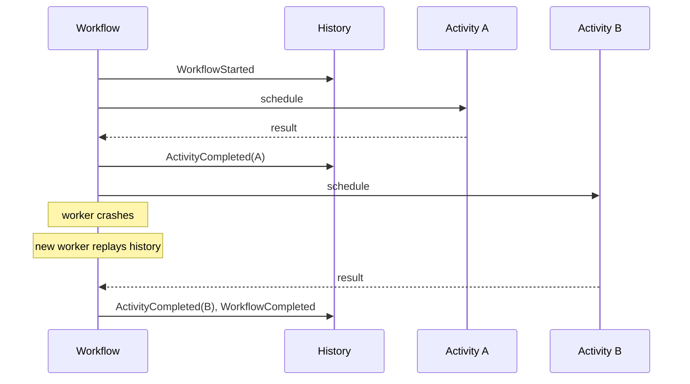
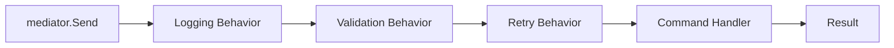

# Mediator — Professional Level

> **Source:** [refactoring.guru/design-patterns/mediator](https://refactoring.guru/design-patterns/mediator)
> **Prerequisite:** [Senior](senior.md)

---

## Table of Contents

1. [Introduction](#introduction)
2. [Workflow Engine Internals](#workflow-engine-internals)
3. [State Persistence Strategies](#state-persistence-strategies)
4. [Mediator Throughput Bottlenecks](#mediator-throughput-bottlenecks)
5. [Distributed Tracing Through Mediators](#distributed-tracing-through-mediators)
6. [Mediator + CQRS](#mediator--cqrs)
7. [Failure Modes & Recovery](#failure-modes--recovery)
8. [Cross-Language Comparison](#cross-language-comparison)
9. [Microbenchmark Anatomy](#microbenchmark-anatomy)
10. [Diagrams](#diagrams)
11. [Related Topics](#related-topics)

---

## Introduction

A Mediator at the professional level is examined for what the runtime makes of it: how workflow engines persist state and replay history, where the throughput bottlenecks live in distributed orchestrators, how tracing maps onto Mediator hierarchies, and how Mediators interact with CQRS and event-sourcing.

For high-throughput systems — payment platforms, real-time orchestration, large microservice meshes — the Mediator's design determines correctness and scalability.

---

## Workflow Engine Internals

### Temporal — event history

Every workflow step appends to an event history:

```
[
  WorkflowStarted(input=...),
  ActivityScheduled(charge_card, ...),
  ActivityCompleted(charge_card, result=...),
  ActivityScheduled(reserve_inventory, ...),
  ...
]
```

The workflow code is **deterministic**. On worker crash, replay the history; the workflow function executes the same code, but past `await` points are filled in from history.

This is Mediator persistence: the workflow IS the Mediator; the history IS its durable state.

### Determinism rules

Workflows must NOT:
- Use random numbers / current time / network I/O directly.
- Depend on external state (env vars, system calls).
- Read shared mutable state.

These are recorded as activities. Activities are non-deterministic; their results are stored.

### Sticky cache

Workers cache workflow state in memory. If the next signal lands on the same worker, no replay needed. Otherwise, replay from history.

### Throughput

Temporal can run hundreds of thousands of workflows per node. Each step is an RPC plus DB write (history append). Cost dominated by activity execution.

---

## State Persistence Strategies

### In-memory (in-process Mediator)

State lives in the Mediator object. Lost on restart. Fine for UI dialogs and ephemeral coordination.

### DB-backed orchestrator

```
orchestrator_state(workflow_id, current_step, ...)
```

Mediator writes state to DB after each step. On restart, load and resume.

Costs: DB write per step; transaction boundaries critical.

### Event-sourced Mediator

The Mediator's state is derived from events. Every coordination action emits an event; replaying events reconstructs state.

```
[OrderStarted, ChargeAttempted, ChargeSucceeded, InventoryReserved, ...]
```

Replay rebuilds state. Snapshots accelerate.

### Workflow engine

Outsource persistence entirely. Engine provides durability, replay, retries.

---

## Mediator Throughput Bottlenecks

### Synchronous Mediator method

```java
public synchronized void notify(Component s, String event) { ... }
```

All requests serialize. Throughput limited to single-thread processing. Acceptable for UI; catastrophic for high-throughput services.

### Async Mediator with executor

```java
public CompletableFuture<Void> notify(Component s, Event e) {
    return CompletableFuture.runAsync(() -> route(s, e), executor);
}
```

Parallel handling of events. State that's accessed must be thread-safe.

### State sharding

Mediator handles many workflows. Each workflow has its own state. Shard by workflow ID; each shard has its own mediator instance / thread.

```
Workflow ID hash → shard → mediator instance
```

Linear scaling with shard count.

### Outsourced Mediator (workflow engine)

Engine handles concurrency, sharding, durability. The "Mediator" is logical; the engine implements it.

---

## Distributed Tracing Through Mediators

### Span hierarchy

Each Mediator notification becomes a span:

```
Span: order_workflow
├── Span: charge_card
├── Span: reserve_inventory
└── Span: ship_order
```

Trace IDs propagated through Component calls. OpenTelemetry, Jaeger, Zipkin all support this.

### Correlation IDs

Even without distributed tracing, propagate a correlation ID:

```python
async def notify(self, sender, event, correlation_id):
    log.info("notify", source=sender, event=event, correlation_id=correlation_id)
```

Logs and metrics tagged with the correlation ID; trivially searchable across services.

### Workflow-level traces

Temporal exposes the full event history. Each step's start/end timestamps create a Gantt-style trace UI.

### Without observability

Mediator failures are mysteries. "Why did this order get stuck?" is unanswerable. Investing in tracing pays off the first time you debug a stuck workflow.

---

## Mediator + CQRS

In CQRS:
- **Commands** mutate state.
- **Queries** read state.

A Mediator can dispatch Commands:

```java
mediator.send(new PlaceOrder(orderId, items));
```

The Mediator routes to the right Command handler. MediatR (.NET) and Spring's `ApplicationEventPublisher` are examples.

### Mediator-as-CommandBus

```csharp
public interface IRequest<TResponse> { }

public class PlaceOrder : IRequest<OrderId> { ... }

mediator.Send<PlaceOrder, OrderId>(new PlaceOrder(...));
```

The Mediator (here MediatR) routes the request to the registered handler. Decouples senders from handlers; centralizes pre/post processing.

### Pipeline behaviors

MediatR supports pipeline behaviors: handlers wrap each request with logging, validation, retries:

```csharp
public class LoggingBehavior<TRequest, TResponse> : IPipelineBehavior<TRequest, TResponse> {
    public async Task<TResponse> Handle(TRequest request, CancellationToken ct, RequestHandlerDelegate<TResponse> next) {
        log.Info("dispatching {Request}", request);
        return await next();
    }
}
```

Pipeline = decorators around the Mediator's dispatch.

---

## Failure Modes & Recovery

### Partial step failure

Mediator started step 2 of 5; step 2 failed. Options:
- **Compensate completed steps.** Saga rollback.
- **Retry step 2.** Idempotent? If yes, retry. If not, escalate.
- **Abandon and alert.** For non-recoverable.

### Mediator crash mid-flow

In-process: state lost. Hopefully tolerable.
DB-backed: load state on restart; resume.
Workflow engine: replay history; resume.

### Component down

Mediator's call to Component fails (network, service down). Retry with backoff; circuit-break after threshold; surface error to caller.

### Timeout

Component takes too long. Mediator must enforce timeouts; otherwise stuck.

```python
result = await asyncio.wait_for(component.do(), timeout=30)
```

Workflow engines enforce per-activity timeouts.

### Cascading failure

Mediator handles 1000 concurrent flows; one Component degrades; flows pile up; Mediator's queue grows. Apply backpressure: reject new flows when capacity exceeded.

---

## Cross-Language Comparison

| Language | Primary Mediator Form | Notes |
|---|---|---|
| **C#** | MediatR (CQRS-style) | Hugely popular; DI-integrated |
| **Java** | Spring `ApplicationEventPublisher`, Axon Framework | Annotation-driven |
| **Kotlin** | Coroutine-based orchestration | Idiomatic with structured concurrency |
| **Go** | Plain functions, channels | Less framework-heavy |
| **Python** | Celery for async; custom orchestrators | Workflow with Prefect / Airflow |
| **Rust** | tokio + state machines | Type-safe orchestration |
| **TypeScript** | NestJS CQRS | Decorator-driven |
| **Erlang/Elixir** | GenServer, supervision trees | Mediator natively in OTP |

### Key contrasts

- **Erlang's OTP**: every GenServer is a Mediator (single-threaded message-driven actor). Supervision trees mediate failure.
- **Workflow engines**: Temporal SDKs across languages. The same workflow can run anywhere.

---

## Microbenchmark Anatomy

### In-process Mediator notify

```java
@Benchmark public void notify(MediatorBench bench) {
    bench.mediator.notify(bench.sender, "event-x");
}
```

Cost: typed method dispatch (~1 ns) + handler body. Negligible for UI.

### DB-backed orchestrator step

Each step: ~5-15 ms (DB write + activity call). Throughput per orchestrator instance: ~100 ops/sec.

### Workflow engine step (Temporal)

Each activity: 5-50 ms (RPC + history persist). Throughput: depends on partition count and worker count.

### MediatR overhead

~µs per dispatch. Pipeline behaviors add ~µs each. Negligible vs network calls.

---

## Diagrams

### Workflow event history



### MediatR pipeline



---

## Related Topics

- Workflow engines internals
- CQRS
- Event sourcing
- Distributed tracing
- Saga compensations

[← Senior](senior.md) · [Interview →](interview.md)
