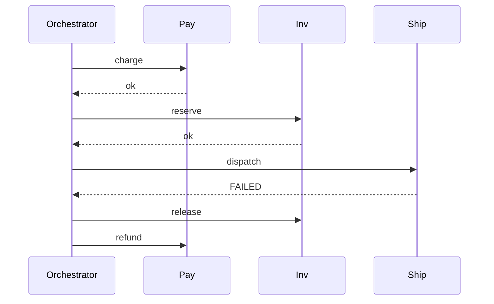
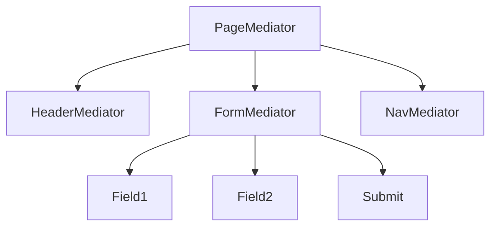

# Mediator — Senior Level

> **Source:** [refactoring.guru/design-patterns/mediator](https://refactoring.guru/design-patterns/mediator)
> **Prerequisite:** [Middle](middle.md)

---

## Table of Contents

1. [Introduction](#introduction)
2. [Mediator at Architectural Scale](#mediator-at-architectural-scale)
3. [Choreography vs Orchestration](#choreography-vs-orchestration)
4. [Distributed Mediators](#distributed-mediators)
5. [Workflow Engines](#workflow-engines)
6. [Concurrency in Mediators](#concurrency-in-mediators)
7. [When Mediator Becomes a Problem](#when-mediator-becomes-a-problem)
8. [Code Examples — Advanced](#code-examples--advanced)
9. [Real-World Architectures](#real-world-architectures)
10. [Pros & Cons at Scale](#pros--cons-at-scale)
11. [Trade-off Analysis Matrix](#trade-off-analysis-matrix)
12. [Migration Patterns](#migration-patterns)
13. [Diagrams](#diagrams)
14. [Related Topics](#related-topics)

---

## Introduction

> Focus: **At scale, what breaks? What earns its keep?**

In toy code Mediator is "central coordinator." In production it is "an order orchestrator coordinating 7 microservices, with retries, compensations, idempotency, and state persistence across worker restarts." The senior question isn't "do I write Mediator?" — it's **"orchestration or choreography? where does the state live? how do we recover from partial failures?"**

At scale Mediator intersects with:

- **Workflow engines** — Temporal, Cadence, Camunda, AWS Step Functions.
- **Saga orchestrators** — explicit central coordinator with compensations.
- **API gateways** — orchestration at the edge.
- **MVC / MVVM controllers** — UI mediation.
- **Spring's `@Transactional` boundaries** — transaction-level coordination.

These are Mediator at architectural scale. The fundamentals apply but the operational concerns dominate.

---

## Mediator at Architectural Scale

### 1. Workflow engines (Temporal)

```python
@workflow.defn
class OrderWorkflow:
    @workflow.run
    async def run(self, order: Order) -> Receipt:
        await workflow.execute_activity(charge_card, order, ...)
        await workflow.execute_activity(reserve_inventory, order, ...)
        await workflow.execute_activity(ship_order, order, ...)
        return Receipt(order.id)
```

The workflow function IS a Mediator. It coordinates activities (Components). Temporal persists every step; on worker crash, replays history to resume.

### 2. Saga orchestrator

A central service receives "place order" and dispatches to participants:

```
OrderSaga: charge → reserve → ship → notify
            └── on failure, compensate in reverse
```

The Saga (Mediator) knows all participants. The participants don't know each other. If you go choreography (event-driven), you've inverted to Observer.

### 3. API gateway with composition

A gateway endpoint composes multiple backend calls:

```
GET /user-profile → mediator:
    fetch user from user-service
    fetch orders from order-service
    fetch preferences from prefs-service
    combine and return
```

The gateway is the Mediator. Backends are Components. New backend = update gateway.

### 4. MVC / MVVM controller

The controller mediates between View (UI) and Model (state). At scale: maintains validation, routing, lifecycle.

### 5. IDE language servers

The LSP server mediates between editors (clients) and language analyzers (servers). One protocol; one mediator per file or workspace.

### 6. Trading systems

Order matching engine: orders come in from many participants; the engine (Mediator) matches them. Each participant doesn't see others' orders directly.

---

## Choreography vs Orchestration

A central architectural decision.

### Choreography

No central coordinator. Each service emits events; downstream services subscribe and react.

```
Place Order → emit OrderPlaced → ChargeService listens, charges, emits ChargeSucceeded
ChargeSucceeded → InventoryService reserves, emits InventoryReserved
InventoryReserved → ShippingService dispatches, emits OrderShipped
```

**Pros:**
- Decentralized; services evolve independently.
- No single point of failure.
- Resilient to partial outages.

**Cons:**
- Hard to follow. "What happens after OrderPlaced?" requires reading every service.
- Compensations harder. Each service must know how to undo on receiving compensation events.
- Debugging across services is painful.

This is **Observer at distributed scale**, not Mediator.

### Orchestration

A central orchestrator dispatches calls.

```python
class OrderOrchestrator:
    async def place(self, order):
        await self.payment.charge(order)
        await self.inventory.reserve(order)
        await self.shipping.dispatch(order)
```

**Pros:**
- Clear flow. The orchestrator IS the workflow.
- Centralized retry / observability / compensation.
- Easier to debug.

**Cons:**
- Orchestrator is a critical service.
- Bottleneck if not designed carefully.
- Can become a god class.

This is **Mediator at distributed scale**.

### Most teams choose orchestration

For non-trivial multi-step business flows, orchestration's clarity outweighs choreography's decentralization. Workflow engines (Temporal, Step Functions) make orchestration robust.

---

## Distributed Mediators

### Workflow engine as Mediator

Temporal / Cadence / Step Functions provide:
- Durable state — workflow survives worker crashes.
- Activity dispatch — the Mediator calls remote services.
- Retries with policy — exponential backoff, max attempts.
- Compensations — explicit on failure.
- Observability — UI showing every step.

The workflow code IS the Mediator. Activities are Components.

### Mediator as a service

You can build your own:
- An `OrderOrchestrator` service exposed via REST.
- It calls `payment-service`, `inventory-service`, `shipping-service`.
- It tracks state in its own DB (or via outbox).

For simple flows, this is fine. For complex flows with retries and compensations, use a workflow engine.

### Shared concerns

Distributed Mediators must handle:
- **Idempotency** — retries hit the same Component twice; Components must be idempotent.
- **State persistence** — partial workflow state survives restarts.
- **Timeouts** — Component calls bound by deadlines.
- **Compensation** — semantic "undo" when a step fails.
- **Observability** — distributed tracing, correlation IDs.

---

## Workflow Engines

### Temporal

```python
@workflow.defn
class CheckoutWorkflow:
    @workflow.run
    async def run(self, cart: Cart) -> str:
        order_id = await workflow.execute_activity(create_order, cart, schedule_to_close_timeout=timedelta(seconds=30))
        try:
            await workflow.execute_activity(charge_card, order_id, schedule_to_close_timeout=timedelta(minutes=5))
        except ApplicationError:
            await workflow.execute_activity(cancel_order, order_id)
            raise
        await workflow.execute_activity(ship_order, order_id)
        return order_id
```

The `@workflow.defn` is a Mediator. Each `execute_activity` calls a Component. Temporal persists history; replays on resume.

### AWS Step Functions

JSON-based state machine. States are Tasks (Lambda calls), Choices (branches), Parallel, Map. Each state is a Component invocation; the state machine is the Mediator.

### Camunda / Zeebe

BPMN-based. Visual workflows; technical participants subscribe to tasks. Excellent for long-running business processes.

### Trade-offs

- **Workflow engine**: durable, observable, retryable. Operational tax — running the engine.
- **Custom orchestrator**: flexible, owns its DB. Tax — implementing retries / state.
- **Choreography**: decentralized. Tax — debugging.

---

## Concurrency in Mediators

### UI Mediator on a single thread

Simplest case. UI thread serializes all events; no race conditions.

### Server Mediator under concurrent requests

Each request has its own Mediator instance? Or shared?

- **Per-request Mediator**: each request gets a fresh Mediator + components. Stateless instances. Most common.
- **Shared Mediator**: one Mediator handles all requests. Must be thread-safe. State per request must live in request-scoped objects.

For most web apps, per-request. For long-lived workflows, the workflow engine handles concurrency.

### Lock granularity

A Mediator that holds a lock during every notification serializes everything. Use:
- Fine-grained locks per concern.
- Lock-free data structures.
- Single-threaded executor per Mediator.

### Reentrant updates

Mediator's `notify` triggers another `notify` on the same Mediator. Risk of deadlock with re-entrant locks. Use re-entrant locks deliberately or restructure to avoid.

---

## When Mediator Becomes a Problem

### 1. God class

Mediator with 50 methods. Refactor by:
- Splitting into sub-Mediators by domain.
- Extracting Strategy or Command for actions.
- Moving state into Components (if Components owned it anyway).

### 2. Tight coupling Component → Mediator

Components know `LoginDialog` instead of `Mediator`. They're not reusable. Make them depend on the interface.

### 3. State scattered

Some state in Components, some in Mediator, no clear ownership. Choose:
- Component-owned, Mediator queries.
- Mediator-owned, Components are views.

### 4. Mediator as a hidden bottleneck

Every action goes through one synchronized method. Throughput collapses. Refactor for parallelism or split.

### 5. Mediator that knows too much

Mediator imports everything; circular dependencies. Use interfaces; depend on abstractions.

### 6. Distributed Mediator failure

Orchestrator service goes down → all workflows stuck. Make it horizontally scalable; persist state externally.

---

## Code Examples — Advanced

### A — Saga orchestrator with compensations (Python)

```python
import asyncio
from dataclasses import dataclass
from typing import Callable, List


@dataclass
class Step:
    name: str
    action: Callable
    compensation: Callable


class Saga:
    def __init__(self, name: str) -> None:
        self.name = name
        self.steps: List[Step] = []

    def add(self, name: str, action: Callable, compensation: Callable) -> None:
        self.steps.append(Step(name, action, compensation))

    async def run(self, ctx: dict) -> None:
        completed: List[Step] = []
        try:
            for step in self.steps:
                await step.action(ctx)
                completed.append(step)
        except Exception as e:
            print(f"[{self.name}] failed at {step.name}: {e}")
            for s in reversed(completed):
                try: await s.compensation(ctx)
                except Exception as ce: print(f"compensation {s.name} failed: {ce}")
            raise


# Usage:
saga = Saga("OrderSaga")
saga.add("charge", charge_action, refund_compensation)
saga.add("reserve", reserve_action, release_compensation)
saga.add("ship", ship_action, recall_compensation)
asyncio.run(saga.run({"order_id": "o1", "amount": 99.99}))
```

Mediator with explicit compensations.

---

### B — Hierarchical Mediator with hot reload (TypeScript)

```typescript
interface Mediator {
    notify(source: string, event: string, data?: unknown): void;
}

class HeaderMediator implements Mediator {
    constructor(private parent: Mediator) {}
    notify(source: string, event: string, data?: unknown): void {
        if (source === 'logo' && event === 'clicked') {
            this.parent.notify('header', 'go-home');
        }
    }
}

class FormMediator implements Mediator {
    constructor(private parent: Mediator) {}
    notify(source: string, event: string, data?: unknown): void {
        if (source === 'submit' && event === 'clicked') {
            this.parent.notify('form', 'submitted', data);
        }
    }
}

class PageMediator implements Mediator {
    private header = new HeaderMediator(this);
    private form = new FormMediator(this);

    notify(source: string, event: string, data?: unknown): void {
        if (source === 'header' && event === 'go-home') {
            this.navigateHome();
        } else if (source === 'form' && event === 'submitted') {
            this.handleSubmit(data);
        }
    }

    private navigateHome() { /* ... */ }
    private handleSubmit(data: unknown) { /* ... */ }
}
```

Sub-mediators report up; the page mediator coordinates across them.

---

### C — Distributed orchestrator with idempotency

```python
class DistributedOrchestrator:
    def __init__(self, payment, inventory, shipping, idempotency_store):
        self.payment = payment
        self.inventory = inventory
        self.shipping = shipping
        self.idempotency = idempotency_store

    async def place(self, order):
        key = f"order:{order.id}"
        if cached := self.idempotency.get(key):
            return cached
        try:
            await self.payment.charge(order, idempotency_key=f"{key}:charge")
            await self.inventory.reserve(order, idempotency_key=f"{key}:reserve")
            await self.shipping.dispatch(order, idempotency_key=f"{key}:ship")
            self.idempotency.put(key, "ok")
            return "ok"
        except Exception as e:
            await self.compensate(order, key)
            raise

    async def compensate(self, order, key):
        # safe-to-call-twice compensations
        await self.shipping.recall(order, idempotency_key=f"{key}:recall")
        await self.inventory.release(order, idempotency_key=f"{key}:release")
        await self.payment.refund(order, idempotency_key=f"{key}:refund")
```

Each Component call carries an idempotency key. Retries are safe.

---

## Real-World Architectures

### Stripe — payment workflow

PaymentIntent state machine: created → confirmed → captured → succeeded. Stripe orchestrates between authentication, fraud checks, capture. The PaymentIntent IS a Mediator's state.

### Uber — trip orchestration

Trip lifecycle: requested → driver-assigned → en-route → in-trip → completed. Uber's backend orchestrates between rider, driver, payment, ratings. Each phase is a Mediator transition.

### Airbnb — booking flow

Booking workflow: pricing → availability check → payment hold → confirmation → calendar update. Airbnb orchestrates between many internal services.

### AWS Step Functions

Visual workflow as a Mediator. Tasks invoke Lambdas. State persists between steps. Used at AWS scale for ETL, ML pipelines, business processes.

---

## Pros & Cons at Scale

| Pros | Cons |
|---|---|
| Centralized coordination = clear flow | Mediator can become a critical bottleneck |
| Easy to add a new step in the workflow | Mediator service deployment is high-stakes |
| Compensations are explicit and named | Service must support compensation semantics |
| Workflow engines provide durability | Operational complexity of running the engine |
| Fits microservice "saga" patterns | Choreography is sometimes more resilient |
| Distributed tracing maps to workflow | Observability requires investment |

---

## Trade-off Analysis Matrix

| Dimension | In-process Mediator | Custom orchestrator | Workflow engine | Choreography |
|---|---|---|---|---|
| **Latency** | µs | ms (network calls) | ms (engine overhead) | ms (event hops) |
| **Durability** | None | Custom | Built-in | Per-service (events) |
| **Observability** | Logs | Custom | Visual + traces | Hard |
| **Failure recovery** | Manual | Manual | Automatic replay | Per-service |
| **Compensation** | Code | Code | Code (with primitives) | Eventual via events |
| **Operational cost** | Zero | Medium | Medium-high | Low (no central) |
| **Debuggability** | Easy | Medium | Easy (UI) | Hard |

---

## Migration Patterns

### From spaghetti to in-process Mediator

1. Identify the components and the events they fire.
2. Write a Mediator interface.
3. Refactor components to call `mediator.notify(...)` instead of siblings.
4. Move interaction logic into the Mediator.
5. Test with stubs.

### From in-process to distributed orchestration

1. Extract the Mediator as a service (HTTP / RPC).
2. Components become Component services.
3. Add idempotency keys to every call.
4. Add state persistence (DB or workflow engine).
5. Add compensations.

### From custom orchestrator to workflow engine

1. Rewrite the orchestrator code as a workflow definition.
2. Move activities (Component calls) into activity functions.
3. Run side-by-side; compare outcomes for parity.
4. Cut over once stable.

### From orchestration to choreography

Rare, but: services start emitting events instead of being called. The orchestrator decommissions. Lose centralized control; gain decentralized resilience.

---

## Diagrams

### Saga orchestrator



### Hierarchical Mediator



---

## Related Topics

- Saga pattern
- Workflow engines
- API gateway
- Event-driven choreography
- Idempotency at scale

[← Middle](middle.md) · [Professional →](professional.md)
