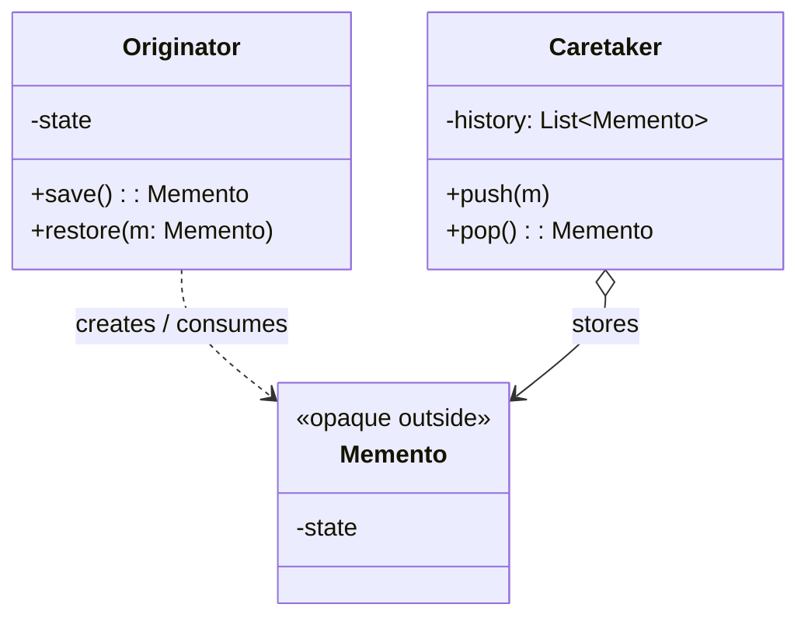
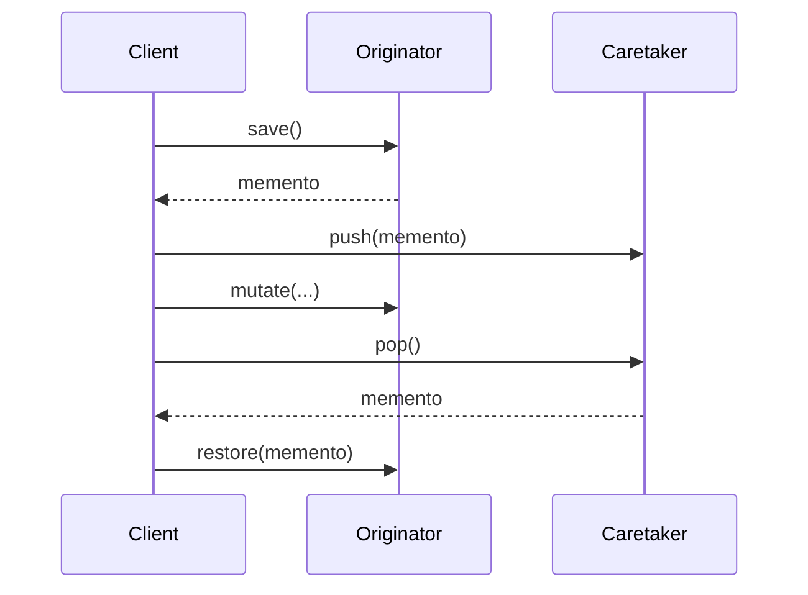

# Memento — Junior Level

> **Source:** [refactoring.guru/design-patterns/memento](https://refactoring.guru/design-patterns/memento)
> **Category:** [Behavioral](../README.md) — *"Concerned with algorithms and the assignment of responsibilities between objects."*

---

## Table of Contents

1. [Introduction](#introduction)
2. [Prerequisites](#prerequisites)
3. [Glossary](#glossary)
4. [Core Concepts](#core-concepts)
5. [Real-World Analogies](#real-world-analogies)
6. [Mental Models](#mental-models)
7. [Pros & Cons](#pros--cons)
8. [Use Cases](#use-cases)
9. [Code Examples](#code-examples)
10. [Coding Patterns](#coding-patterns)
11. [Clean Code](#clean-code)
12. [Best Practices](#best-practices)
13. [Edge Cases & Pitfalls](#edge-cases--pitfalls)
14. [Common Mistakes](#common-mistakes)
15. [Tricky Points](#tricky-points)
16. [Test Yourself](#test-yourself)
17. [Tricky Questions](#tricky-questions)
18. [Cheat Sheet](#cheat-sheet)
19. [Summary](#summary)
20. [What You Can Build](#what-you-can-build)
21. [Further Reading](#further-reading)
22. [Related Topics](#related-topics)
23. [Diagrams & Visual Aids](#diagrams--visual-aids)

---

## Introduction

> Focus: **What is it?** and **How to use it?**

**Memento** is a behavioral design pattern that lets you **capture an object's internal state** so it can be **restored later**, without exposing the internals to anyone else. The captured snapshot is the **Memento**; the object that produces and consumes it is the **Originator**; the code that holds Mementos but doesn't peek at their contents is the **Caretaker**.

Imagine an editor with Ctrl+Z. Each undoable change captures a snapshot of the document; pressing Ctrl+Z restores it. The history stack holds these snapshots, but doesn't read them — it just hands them back to the document for restore.

In one sentence: *"Save the state. Restore it later. Don't break encapsulation in the process."*

Memento is the foundation of undo/redo, save games, savepoints, transaction rollbacks, and any system where you need to *go back in time* on an object's state.

---

## Prerequisites

What you should know before reading this:

- **Required:** Basic OOP — classes, encapsulation.
- **Required:** Composition. The Originator holds and restores Mementos.
- **Helpful:** Some familiarity with Command pattern — Memento is often paired with it.
- **Helpful:** Serialization concepts — many Mementos are essentially serialized state.

---

## Glossary

| Term | Definition |
|------|-----------|
| **Originator** | The object whose state we want to save. Produces Mementos and accepts Mementos for restore. |
| **Memento** | An opaque snapshot of the Originator's state. Other code can hold it but not read it. |
| **Caretaker** | The code that stores and retrieves Mementos. Doesn't peek at their contents. |
| **Snapshot** | Synonym for Memento — the captured state. |
| **Encapsulation boundary** | The line between "what's exposed" and "what's internal." Memento preserves it. |

---

## Core Concepts

### 1. Originator Captures Itself

The Originator has methods to produce a Memento (capturing current state) and to accept one (restoring it).

```java
class Editor {
    private String content;
    public Memento save() { return new Memento(content); }
    public void restore(Memento m) { this.content = m.content(); }
}
```

### 2. Memento Is Opaque to Outsiders

The Memento exposes its state ONLY to the Originator. Caretakers see it as a black box.

```java
class Memento {
    private final String state;     // package-private or private
    Memento(String s) { this.state = s; }
    String content() { return state; }   // only Editor accesses
}
```

In languages like Java, this is enforced by package-private access. In others, it's a convention.

### 3. Caretaker Stores But Doesn't Read

```java
class History {
    private final Deque<Memento> stack = new ArrayDeque<>();
    public void push(Memento m) { stack.push(m); }
    public Memento pop() { return stack.pop(); }
}
```

`History` doesn't know what's inside a Memento. It just keeps them.

### 4. Encapsulation Preserved

Without Memento, the caretaker (or undo system) would need access to the Originator's fields — breaking encapsulation. Memento solves this by giving the Caretaker an opaque token.

### 5. Distinct from Command

**Command** wraps an *action*; *undo* either inverts the action or restores via a Memento.
**Memento** wraps *state*; it's a snapshot, not an action.

The two are complementary: Commands often produce Mementos.

---

## Real-World Analogies

| Concept | Analogy |
|---------|--------|
| **Originator** | A person making a backup. |
| **Memento** | A sealed envelope containing the backup. The person can open it; others can hold it. |
| **Caretaker** | A safety deposit box at the bank. Holds your envelope; doesn't open it. |
| **Restore** | Opening the envelope and resetting to that state. |

The classical refactoring.guru analogy is a **save game**: the game (Originator) writes its state to a save file (Memento). The save manager (Caretaker) lists save files but doesn't read their contents — only the game knows how to load them.

Another good one is **video recording**: the camera (Originator) captures frames (Mementos). The library shelf (Caretaker) holds the tapes; it doesn't watch them. Pressing rewind hands a tape back to the camera's playback.

---

## Mental Models

**The intuition:** Picture a sealed envelope with someone's diary entry inside. They can hand the envelope to you for safekeeping. You can give it back later. You can't open it. They can — and use it to remember what they wrote.

**Why this model helps:** It separates *who knows the format* (Originator) from *who manages the storage* (Caretaker). Encapsulation is preserved by handing out opaque tokens.

**Visualization:**

```
   Originator                Memento                Caretaker
   ┌──────────┐         ┌─────────────┐           ┌──────────┐
   │  state   │ ──save──> [ opaque ]    ──── push ───> [stack]
   │          │                                         │
   │          │ <─restore── [ opaque ]    ──── pop ─── │
   └──────────┘         └─────────────┘           └──────────┘
   knows the format     opaque to outside        only stores
```

The Memento crosses the boundary as a sealed unit.

---

## Pros & Cons

| Pros | Cons |
|------|------|
| Preserves encapsulation while enabling state restoration | Memento can be heavy (full state copy) |
| Trivial undo / redo support | Memory grows with history |
| State and behavior decoupled | Snapshots can become stale if state references shared mutable data |
| Originator can change internals freely | Languages without strong access control require discipline |
| Multiple Mementos for branching history | Serialization for persistent Mementos adds complexity |

### When to use:
- You need undo / redo
- You want to take a checkpoint of an object before risky changes
- You need transactional rollback at object level
- You're implementing save/load (games, editors)
- You want to test scenarios with reproducible state

### When NOT to use:
- The state is trivial and can be reconstructed cheaply
- The Originator's state is huge and snapshotting is too expensive
- You don't actually need to restore — Observer or Command might fit better
- The state references resources that can't be safely snapshotted (open files, sockets)

---

## Use Cases

Real-world places where Memento is commonly applied:

- **Text editors** — undo/redo via document snapshots.
- **Game saves** — write state to disk; load later.
- **Database savepoints** — `SAVEPOINT s1; ROLLBACK TO s1;`.
- **Browser history** — back / forward navigation = state snapshots.
- **Configuration rollback** — apply config; if it fails, restore previous.
- **Refactoring tools** — IDE refactor preview that can be reverted.
- **Form drafts** — save half-filled forms; restore on next visit.
- **Workflow checkpoints** — long-running workflows save state at safe points.
- **Time-travel debugging** — capture program state at each step; replay.

---

## Code Examples

### Go

A counter with undo via Memento.

```go
package main

import "fmt"

// Originator.
type Counter struct {
	value int
}

func (c *Counter) Increment() { c.value++ }
func (c *Counter) Value() int { return c.value }

// Memento.
type counterMemento struct{ value int }

func (c *Counter) Save() *counterMemento { return &counterMemento{c.value} }
func (c *Counter) Restore(m *counterMemento) { c.value = m.value }

// Caretaker.
type History struct{ stack []*counterMemento }

func (h *History) Push(m *counterMemento) { h.stack = append(h.stack, m) }
func (h *History) Pop() *counterMemento {
	if len(h.stack) == 0 {
		return nil
	}
	last := h.stack[len(h.stack)-1]
	h.stack = h.stack[:len(h.stack)-1]
	return last
}

func main() {
	c := &Counter{}
	h := &History{}

	h.Push(c.Save())
	c.Increment()
	c.Increment()
	c.Increment()
	fmt.Println(c.Value()) // 3

	c.Restore(h.Pop())
	fmt.Println(c.Value()) // 0
}
```

**What it does:** The counter snapshots itself; History stores; restore returns to the saved state.

**How to run:** `go run main.go`

---

### Java

Editor with undo, using package-private access for encapsulation.

```java
// Memento.java — package-private fields
package editor;

public final class Memento {
    final String content;
    final int cursorPos;
    Memento(String content, int cursorPos) {
        this.content = content;
        this.cursorPos = cursorPos;
    }
}
```

```java
// Editor.java
package editor;

public final class Editor {
    private String content = "";
    private int cursorPos = 0;

    public void type(String text) {
        content = content.substring(0, cursorPos) + text + content.substring(cursorPos);
        cursorPos += text.length();
    }

    public Memento save() { return new Memento(content, cursorPos); }
    public void restore(Memento m) {
        this.content = m.content;
        this.cursorPos = m.cursorPos;
    }

    public String content() { return content; }
}
```

```java
// History.java
package editor;

import java.util.Deque;
import java.util.ArrayDeque;

public final class History {
    private final Deque<Memento> stack = new ArrayDeque<>();
    public void push(Memento m) { stack.push(m); }
    public Memento pop() { return stack.isEmpty() ? null : stack.pop(); }
}
```

`History` cannot read `Memento.content` because the field is package-private and `History` is in the same package — but other packages cannot.

**What it does:** Editor produces opaque Mementos; History stacks them; Editor restores when popped.

**How to run:** `javac editor/*.java && java editor.Editor` (with a Demo).

---

### Python

A drawing canvas with undo using `dataclass`.

```python
from dataclasses import dataclass, field
from typing import List, Tuple


@dataclass(frozen=True)
class CanvasMemento:
    """Snapshot of canvas state. Frozen → immutable."""
    pixels: tuple   # tuple-of-tuples for immutability


@dataclass
class Canvas:
    """Originator."""
    width: int
    height: int
    pixels: List[List[str]] = field(default_factory=list)

    def __post_init__(self) -> None:
        if not self.pixels:
            self.pixels = [["." for _ in range(self.width)] for _ in range(self.height)]

    def draw(self, x: int, y: int, char: str) -> None:
        self.pixels[y][x] = char

    def save(self) -> CanvasMemento:
        return CanvasMemento(pixels=tuple(tuple(row) for row in self.pixels))

    def restore(self, m: CanvasMemento) -> None:
        self.pixels = [list(row) for row in m.pixels]

    def render(self) -> str:
        return "\n".join("".join(row) for row in self.pixels)


class History:
    """Caretaker."""
    def __init__(self) -> None:
        self._stack: List[CanvasMemento] = []

    def push(self, m: CanvasMemento) -> None:
        self._stack.append(m)

    def pop(self) -> CanvasMemento | None:
        return self._stack.pop() if self._stack else None


if __name__ == "__main__":
    c = Canvas(width=5, height=3)
    h = History()

    h.push(c.save())
    c.draw(2, 1, "*")
    print(c.render())
    print()
    c.restore(h.pop())
    print(c.render())
```

**What it does:** Canvas snapshots itself before drawing; restoring undoes the change.

**How to run:** `python3 main.py`

---

## Coding Patterns

### Pattern 1: Full snapshot

**Intent:** Capture all state; restore replaces all.

```java
public Memento save() {
    return new Memento(field1, field2, field3, ...);
}
```

**When:** State is small or restore is rare. Simple to implement.

---

### Pattern 2: Diff-based snapshot

**Intent:** Save only what changed; restore applies the diff in reverse.

```java
public Memento save() {
    return new DiffMemento(changedField, oldValue);
}
```

**When:** State is large; many small changes; memory matters.

---

### Pattern 3: Memento with serialization

**Intent:** Memento is bytes/JSON for persistence (save game, draft).

```java
String json = mapper.writeValueAsString(this);
// Memento IS the JSON string
```

**When:** Mementos must survive process restarts.

---

### Pattern 4: Bounded history

**Intent:** Cap the Caretaker's stack; old Mementos drop.

```python
if len(self._stack) > MAX:
    self._stack.pop(0)
```

**When:** Always, in practice. Unbounded history is a memory leak.

---

## Clean Code

- **Make Mementos immutable.** Once saved, the snapshot doesn't change.
- **Don't expose Memento internals.** The Caretaker should see opaque tokens only.
- **Name Mementos by what they snapshot.** `EditorMemento`, not `State1`.
- **Snapshot at the right granularity.** Per-keystroke is too fine; per-document-edit is usually right.
- **Cap history.** Always.

---

## Best Practices

- **Pair with Command.** Commands often store a Memento for undo.
- **Use a builder for complex Mementos.** Keep construction clear.
- **Document what's NOT in the Memento.** Resources, transient state.
- **Test the round-trip.** Save → mutate → restore → assert original.
- **For long-lived Mementos, consider serialization.** Protobuf, JSON, BSON.
- **Watch for shared mutable references** in Mementos — they'll change after capture.

---

## Edge Cases & Pitfalls

- **Reference vs value capture.** A Memento storing a reference to a mutable object will see the object change after capture. Either deep-copy or use immutable values.
- **Resources in state.** Mementos shouldn't capture file handles, sockets, threads. Strip them or model "resource state" separately.
- **Heavy state.** Each Memento copies the world. For huge documents, consider snapshots at key points + diffs.
- **Undo over external side effects.** "Undo email send" is impossible — the email left. Mementos work for in-memory state, not external actions.
- **Backward compatibility.** Persistent Mementos serialized in v1 must be loadable in v2. Versioning matters.
- **Concurrent capture.** Snapshotting an object that's being mutated concurrently produces inconsistent state. Snapshot under a lock or atomic.

---

## Common Mistakes

1. **Memento exposes its fields publicly.** Defeats encapsulation.
2. **Caretaker reads the Memento.** Caretaker should be ignorant.
3. **Mutable Mementos.** Once saved, can't trust the snapshot.
4. **Storing references to mutable state.** Snapshot drifts.
5. **Unbounded undo history.** Memory leak.
6. **Memento for trivial state.** A single int doesn't need a class.
7. **Forgetting to restore the entire state.** Half-restore = corruption.

---

## Tricky Points

### Memento vs Prototype

Both clone state. **Prototype** creates new objects from a template (creational). **Memento** snapshots existing state for later restore (behavioral). Different intents, similar mechanics.

### Memento vs Command

**Command** is "do this action"; undo via inverse OR Memento. **Memento** is "this is what the state was." Often combined: a Command uses a Memento to undo.

### Memento vs Snapshot

In modern parlance, "snapshot" and "memento" are synonyms. The pattern's value is the *encapsulation* — the Caretaker doesn't read it.

### Languages without access control

Python, JavaScript: encapsulation is convention. The Memento "shouldn't" be read by outsiders, but nothing stops them. Discipline + naming (`_state` to indicate private).

### Heavy mementos

For a 100MB document, snapshotting every edit is wasteful. Use diffs: each Memento records *what changed*. Restoring walks the diffs back. Used in editors, version control internally.

---

## Test Yourself

1. What three roles are in the Memento pattern?
2. Why is the Caretaker forbidden from reading the Memento?
3. What's the difference between Memento and Command?
4. When does a Memento become stale?
5. Give 5 real-world examples of Memento.
6. Why must Mementos be immutable?
7. What's the trade-off between full snapshots and diff-based?

---

## Tricky Questions

- **Q: If languages without access control can't enforce Memento opacity, is the pattern still useful?**
  A: Yes — the pattern is also a *discipline* / *contract*. Naming and convention matter even when the compiler doesn't enforce. The intent is clear: don't read.
- **Q: Can a Memento be the same object as the Originator?**
  A: No — that violates the principle. Memento is a *separate* snapshot. The Originator could pass a frozen copy of itself, but that's still a separate value.
- **Q: How is database SAVEPOINT a Memento?**
  A: The database is the Originator; SAVEPOINT records its current state; ROLLBACK restores. The transaction system is the Caretaker. Same shape; different layer.
- **Q: What if I need undo *and* redo?**
  A: Two stacks: undo (push on each action) and redo (push when undoing; clear on new action). Both stacks hold Mementos.

---

## Cheat Sheet

| Concept | One-liner |
|---|---|
| Intent | Capture an object's state; restore later; preserve encapsulation |
| Roles | Originator (knows state), Memento (snapshot), Caretaker (stores) |
| Hot loop | `originator.restore(history.pop())` |
| Sibling | Command (action), Prototype (clone for creation) |
| Modern form | Immutable record / data class |
| Smell to fix | "I need undo" with no encapsulation strategy |

---

## Summary

Memento captures an object's state in an opaque token. The token can be stored, retrieved, and used to restore — but its contents stay private to the originating object. This preserves encapsulation while enabling undo, savepoints, time-travel, and rollback.

Three things to remember:
1. **Three roles.** Originator (saves/restores), Memento (the snapshot), Caretaker (stores).
2. **Memento is opaque outside the Originator.**
3. **Mementos are immutable values.**

If you're building anything with "go back to before," Memento is the formal name.

---

## What You Can Build

- A text editor with undo/redo
- A drawing app with stroke-by-stroke history
- A game with checkpoints
- A form draft autosave
- An IDE with refactor preview
- A workflow with checkpointed restart

---

## Further Reading

- *Design Patterns: Elements of Reusable Object-Oriented Software* (GoF) — original Memento chapter
- *Patterns of Enterprise Application Architecture* (Fowler) — Unit of Work, transaction patterns
- [refactoring.guru — Memento](https://refactoring.guru/design-patterns/memento)

---

## Related Topics

- [Command](../02-command/junior.md) — pairs with Memento for undo
- [Prototype](../../01-creational/04-prototype/junior.md) — different intent, similar mechanics
- Snapshot in event sourcing
- Database savepoints / transactions

---

## Diagrams & Visual Aids

### Class diagram



### Sequence: save → mutate → restore



### Decision flow

```
            ┌──────────────────────┐
            │ Need to restore an   │
            │ object's state?      │
            └──────────┬───────────┘
                       │ yes
                       ▼
            ┌──────────────────────┐
            │ Caretaker shouldn't  │
            │ see internal state?  │
            └──────────┬───────────┘
                       │ yes
                       ▼
              ──> Use Memento
```

[← Back to Behavioral Patterns](../README.md) · [Middle →](middle.md)
