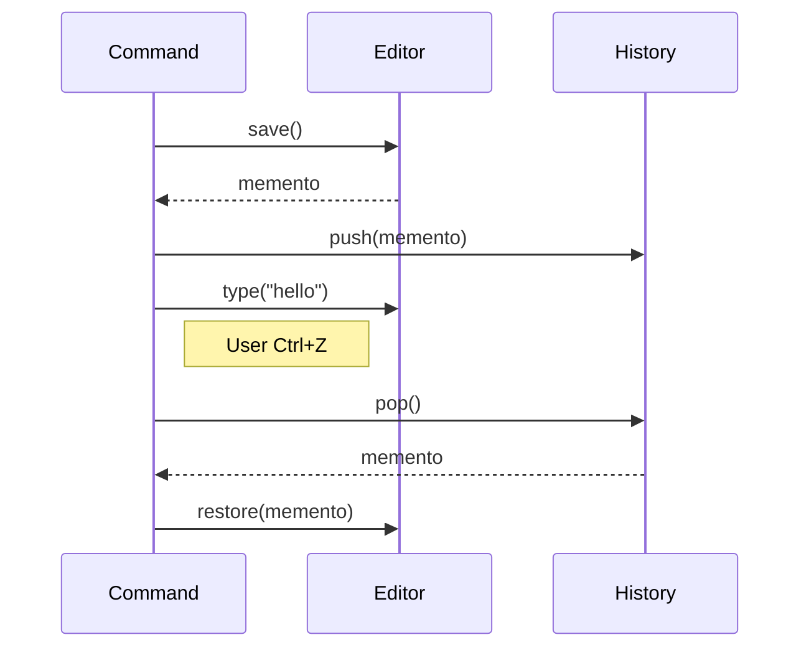
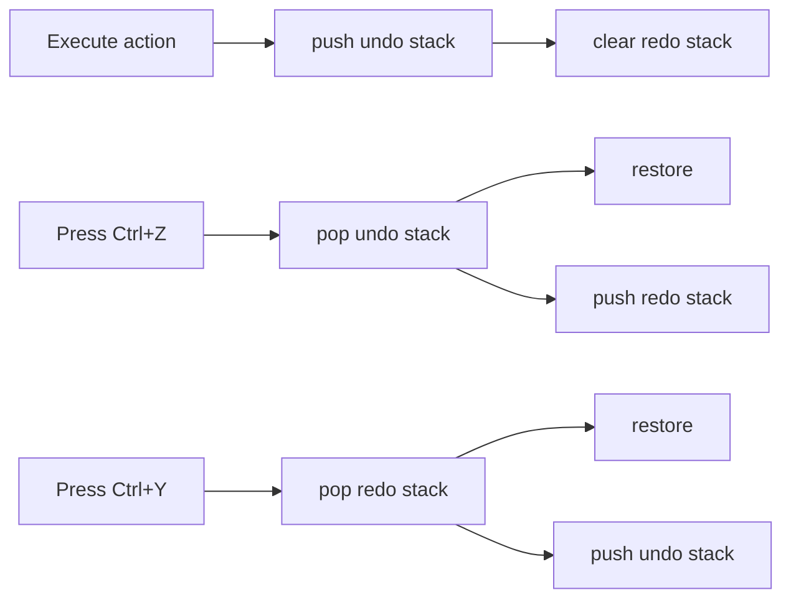

# Memento — Middle Level

> **Source:** [refactoring.guru/design-patterns/memento](https://refactoring.guru/design-patterns/memento)
> **Prerequisite:** [Junior](junior.md)

---

## Table of Contents

1. [Introduction](#introduction)
2. [When to Use Memento](#when-to-use-memento)
3. [When NOT to Use Memento](#when-not-to-use-memento)
4. [Real-World Cases](#real-world-cases)
5. [Code Examples — Production-Grade](#code-examples--production-grade)
6. [Memento + Command for undo/redo](#memento--command-for-undoredo)
7. [Storage Strategies (memory, disk, diff)](#storage-strategies-memory-disk-diff)
8. [Trade-offs](#trade-offs)
9. [Alternatives Comparison](#alternatives-comparison)
10. [Refactoring to Memento](#refactoring-to-memento)
11. [Pros & Cons (Deeper)](#pros--cons-deeper)
12. [Edge Cases](#edge-cases)
13. [Tricky Points](#tricky-points)
14. [Best Practices](#best-practices)
15. [Tasks (Practice)](#tasks-practice)
16. [Summary](#summary)
17. [Related Topics](#related-topics)
18. [Diagrams](#diagrams)

---

## Introduction

> Focus: **When to use it?** and **Why?**

You already know Memento is "snapshot state for later restore." At the middle level the harder questions are:

- **Full snapshot, diff, or hybrid?** Memory vs CPU vs simplicity.
- **In-memory or persistent?** Lifetime determines storage.
- **Coarse or fine grain?** Per keystroke is too fine; per save too coarse.
- **What about external state?** Files, network, services — can't snapshot.
- **Coupling with Command pattern?** Common, but not required.

This document focuses on **decisions and patterns** that turn textbook Memento into something that survives a year of production.

---

## When to Use Memento

Use Memento when **all** of these are true:

1. **You need to restore previous state.** Undo, rollback, time-travel.
2. **The state is non-trivial enough that capturing/restoring needs a defined boundary.** Otherwise just copy fields.
3. **Encapsulation matters.** Caretakers should hold without reading.
4. **The state can be cleanly captured.** No external resources entangled.
5. **History is bounded** (or you accept memory cost).

If most are missing, look elsewhere first.

### Triggers

- "We need Ctrl+Z." → Memento (often paired with Command).
- "Save game / load game." → Memento + persistence.
- "Try a config; rollback if bad." → Memento (checkpoint before, restore on failure).
- "Form auto-save draft." → Memento periodic + persisted.
- "Workflow checkpoint." → Memento at safe points.

---

## When NOT to Use Memento

- **State is one or two simple fields.** Just copy them in a Command.
- **State references external resources.** Snapshotting them is meaningless.
- **State is huge** and snapshots are too expensive — use diffs or events.
- **The Originator's API already exposes its state.** Plain copies suffice.
- **You only ever read the state, never modify.** No restore needed.

### Smell: Memento for everything

Every class has a `save()` and `restore()`. Now the entire system is observable to any "history" service. Memento should be opt-in, not pervasive.

---

## Real-World Cases

### Case 1 — IDE undo/redo with batches

VS Code's edit history groups consecutive typing into one Memento (one Ctrl+Z = one logical step). Cursor position, selection, scroll all snapshotted. Per-document; bounded depth (~1000 by default).

### Case 2 — Database SAVEPOINT

```sql
BEGIN;
INSERT INTO orders ...;
SAVEPOINT before_risky;
UPDATE inventory SET ...;
-- failure
ROLLBACK TO before_risky;
-- only the UPDATE is undone; the INSERT stays
COMMIT;
```

The SAVEPOINT is a Memento managed by the transaction system.

### Case 3 — React useState

```javascript
const [state, setState] = useState({ count: 0, items: [] });
```

Each `setState` produces a new state. React stores the previous state for time-travel debugging. The Memento pattern, framework-managed.

### Case 4 — Game saves

The Witcher 3, Skyrim: state serialized to disk. Player picks a save slot (Memento) to load. The serialization format IS the Memento; the save file system IS the Caretaker.

### Case 5 — Browser history.pushState

```javascript
history.pushState(state, "", "/new-url");
// later
window.onpopstate = e => render(e.state);
```

`state` is a Memento; the browser is the Caretaker.

### Case 6 — Configuration rollback

Linux's `pf-rollback` or similar: apply a network config; if it breaks connectivity, automatic rollback after a timeout.

### Case 7 — Refactoring previews in IDE

IntelliJ's refactor preview shows pending changes; you can revert. Each preview is a Memento.

---

## Code Examples — Production-Grade

### Example A — Editor with bounded history (Java)

```java
package editor;

import java.util.ArrayDeque;
import java.util.Deque;

public final class History {
    private final Deque<EditorMemento> undo = new ArrayDeque<>();
    private final Deque<EditorMemento> redo = new ArrayDeque<>();
    private final int maxSize;

    public History(int maxSize) { this.maxSize = maxSize; }

    public void record(EditorMemento m) {
        undo.push(m);
        if (undo.size() > maxSize) undo.removeLast();
        redo.clear();   // any new action invalidates redo
    }

    public EditorMemento undoStep(EditorMemento current) {
        if (undo.isEmpty()) return null;
        redo.push(current);
        return undo.pop();
    }

    public EditorMemento redoStep(EditorMemento current) {
        if (redo.isEmpty()) return null;
        undo.push(current);
        return redo.pop();
    }
}
```

Bounded; redo stack cleared on new action; symmetric undo/redo.

---

### Example B — Diff-based Memento (Python)

```python
from dataclasses import dataclass
from typing import Any


@dataclass(frozen=True)
class FieldDiff:
    field_name: str
    old_value: Any
    new_value: Any


class Document:
    def __init__(self) -> None:
        self.title: str = ""
        self.body: str = ""
        self.tags: list[str] = []

    def update(self, **changes) -> FieldDiff:
        # Only track one field at a time for simplicity.
        for k, v in changes.items():
            old = getattr(self, k)
            setattr(self, k, v)
            return FieldDiff(field_name=k, old_value=old, new_value=v)

    def revert(self, diff: FieldDiff) -> None:
        setattr(self, diff.field_name, diff.old_value)


doc = Document()
diff = doc.update(title="Memento Pattern")
print(doc.title)        # "Memento Pattern"
doc.revert(diff)
print(doc.title)        # ""
```

Diff stores only what changed — much smaller than full snapshots for large state.

---

### Example C — Persistent Memento (TypeScript)

```typescript
interface DocumentState {
    title: string;
    body: string;
    cursor: number;
}

class DocumentMemento {
    constructor(private readonly state: DocumentState) {}

    serialize(): string { return JSON.stringify(this.state); }
    static deserialize(s: string): DocumentMemento {
        return new DocumentMemento(JSON.parse(s));
    }
    getState(): DocumentState { return this.state; }   // only Document calls
}

class Document {
    private state: DocumentState = { title: "", body: "", cursor: 0 };

    save(): DocumentMemento { return new DocumentMemento({ ...this.state }); }
    restore(m: DocumentMemento): void { this.state = { ...m.getState() }; }
}

// Caretaker persists serialized form.
const doc = new Document();
const m = doc.save();
localStorage.setItem('draft', m.serialize());

// later
const restored = DocumentMemento.deserialize(localStorage.getItem('draft')!);
doc.restore(restored);
```

The Memento survives a page reload. JSON is the wire format; the Caretaker is `localStorage`.

---

### Example D — Memento + Command for undo (Java)

```java
public interface Command {
    void execute();
    void undo();
}

public final class TypeCommand implements Command {
    private final Editor editor;
    private final String text;
    private Memento snapshotBefore;

    public TypeCommand(Editor editor, String text) {
        this.editor = editor;
        this.text = text;
    }

    public void execute() {
        snapshotBefore = editor.save();
        editor.type(text);
    }

    public void undo() {
        editor.restore(snapshotBefore);
    }
}
```

The Command captures a Memento on execute; restores on undo. Clean separation: Command knows the action; Memento knows the state.

---

## Memento + Command for undo/redo

This is the canonical pairing.

```
ExecuteCommand:
    1. snapshot = originator.save()
    2. perform action
    3. push (action, snapshot) to history

UndoCommand:
    1. (action, snapshot) = history.pop()
    2. originator.restore(snapshot)
    3. push to redo stack

RedoCommand:
    1. snapshot, action = redo.pop()
    2. perform action
    3. push to undo stack
```

The Command is "what happened"; the Memento is "what state preceded it." Together: full undo/redo machinery.

---

## Storage Strategies (memory, disk, diff)

### In-memory full snapshot

Simple. Each Memento is a deep copy. Memory = N × |state|. Acceptable for small state, bounded history.

### In-memory diff

Each Memento is a small delta. Memory = N × |delta|. Restore walks deltas in reverse to apply. Common in editors.

### Persistent (disk)

Mementos serialized to disk. Survives restarts. Cost: serialization, I/O. Pattern for save games, drafts.

### Hybrid

Recent state in memory (fast); older state on disk (cheap). Common in long-running editors.

### Snapshot + log

Periodic full snapshots; events between them. Replay events from snapshot to reconstruct. Used in event sourcing, databases.

---

## Trade-offs

| Trade-off | Cost | Benefit |
|---|---|---|
| Full snapshot | Memory per save | Simple, fast restore |
| Diff snapshot | Compute on save and restore | Small memory |
| Persistent | I/O on save | Survives restart |
| Bounded history | Loss of old state | Bounded memory |
| Coarse grain | Larger restore steps | Less storage |
| Fine grain | Many small Mementos | Granular undo |

---

## Alternatives Comparison

| Pattern | Use when |
|---|---|
| **Memento** | Capture full or partial state for restore |
| **Command (with inverse)** | Action has a known inverse — no snapshot needed |
| **Event sourcing** | State is sum of events; replay rebuilds |
| **Snapshot at boundaries** | Transaction begin / end; configuration apply |
| **Persistent data structures** | Immutability gives free history |

---

## Refactoring to Memento

### Symptom
Code that needs to undo an operation but exposes state to do so.

```java
class Editor {
    public String content;   // public so undo can reach
    public int cursor;
}

class History {
    public void undo(Editor e) {
        e.content = previousContent;   // reaches in
        e.cursor = previousCursor;
    }
}
```

### Steps
1. Define a `Memento` class with the relevant fields, package-private.
2. Add `save()` and `restore(m)` to the Originator.
3. Change History to store Mementos opaquely.
4. Make Originator fields private.

### After

```java
class Editor {
    private String content;
    private int cursor;
    public Memento save() { return new Memento(content, cursor); }
    public void restore(Memento m) { content = m.content; cursor = m.cursor; }
}

class History {
    private Deque<Memento> stack = new ArrayDeque<>();
    public void push(Memento m) { stack.push(m); }
    public Memento pop() { return stack.pop(); }
}
```

History never reads Memento fields; encapsulation restored.

---

## Pros & Cons (Deeper)

| Pros | Cons |
|---|---|
| Encapsulation preserved | Snapshot cost can be large |
| Undo/redo machinery clean | History bounded → loses old state |
| Originator can refactor internals | Memento may need to evolve with state schema |
| Pairs naturally with Command | Cross-cutting concerns (resources) leak |
| Persisted Mementos enable save/load | Schema versioning required for persistent forms |

---

## Edge Cases

### 1. Mutable shared references

```java
public Memento save() { return new Memento(this.list); }   // reference, not copy
```

If `list` is mutated later, the Memento sees the change. Either deep-copy or use immutable values.

### 2. Memento referenced from outside

If a Memento leaks where it shouldn't (e.g., logged with sensitive data), encapsulation is broken at runtime. Treat Mementos as confidential.

### 3. State with side-effect-having fields

A Memento that includes "lastModified timestamp" might cause confusion on restore (what does "modified" mean if you went back?). Decide what's part of state and what isn't.

### 4. Concurrent capture

Snapshotting an object being mutated → torn read. Snapshot inside synchronized block, or capture immutable state.

### 5. Schema evolution

Persisted Mementos from v1 must be loadable by v2. Either:
- Versioned Mementos with migration code.
- Forward-compatible schema (new fields optional).

### 6. Resources in state

A Memento with an open file handle restores wrong: the file was closed, the handle is stale. Strip resources before saving; reacquire on restore.

---

## Tricky Points

### Memento vs Snapshot in event sourcing

In event sourcing, state is derived from events. "Snapshots" in event sourcing are periodic Mementos saved alongside events to speed up replay. Different layer; same Memento concept.

### Memento with copy-on-write

Persistent data structures (Clojure's, Scala's) give "free" Mementos: each modification produces a new immutable structure; the old version is the Memento. Memory shared via structural sharing.

### Wide vs narrow Mementos

Wide: snapshot the whole Originator. Narrow: snapshot only the fields a Command will modify. Narrow is smaller; wide is safer (covers fields you didn't expect to change).

For small state: wide. For huge state: narrow per Command.

### Memento and SOLID

- SRP: Memento has one reason to change — Originator's state shape.
- OCP: New Originators come with new Mementos; existing Caretakers unchanged.
- DIP: Caretaker depends on Memento abstraction (treat as opaque).

---

## Best Practices

- **Make Mementos immutable.** Always.
- **Use private/package-private fields** to enforce opacity (when language supports).
- **Cap history.** Always.
- **Pair with Command** for undo/redo.
- **Document state ownership.** What's in the Memento; what isn't.
- **Test save → restore round-trip.** Should yield identical state.
- **For persistent Mementos, version the schema.**

---

## Tasks (Practice)

1. **Editor with undo/redo.** Stack-based; bounded history; redo cleared on new action.
2. **Diff-based Memento.** Save only changed fields; reconstruct on restore.
3. **Persistent draft autosave.** Serialize to disk every minute; restore on startup.
4. **Game save/load.** Multiple slots; metadata (timestamp, level).
5. **Browser-history-style.** `pushState` + `back` + `forward`.
6. **Memento with sensitive data.** Demonstrate why opacity matters.

(Solutions in [tasks.md](tasks.md).)

---

## Summary

At the middle level, Memento is not just "save and restore." It's:

- **Storage strategy:** memory, disk, diff, hybrid.
- **Granularity:** per action, per character, per save.
- **Lifecycle:** when to capture, when to discard.
- **Encapsulation:** opaque outside, transparent inside.
- **Coupling with Command:** commonest pairing for undo/redo.

The win is restorability without breaking encapsulation. The cost is memory and discipline.

---

## Related Topics

- [Command](../02-command/middle.md) — partner for undo/redo
- [Prototype](../../01-creational/04-prototype/middle.md) — clone for creation, similar mechanics
- [Event sourcing](../../../coding-principles/event-sourcing.md)
- [Persistent data structures](../../../coding-principles/persistent-data.md)
- [Snapshot in databases](../../../infra/db-snapshots.md)

---

## Diagrams

### Save → mutate → restore



### Undo + redo stacks



[← Junior](junior.md) · [Senior →](senior.md)
