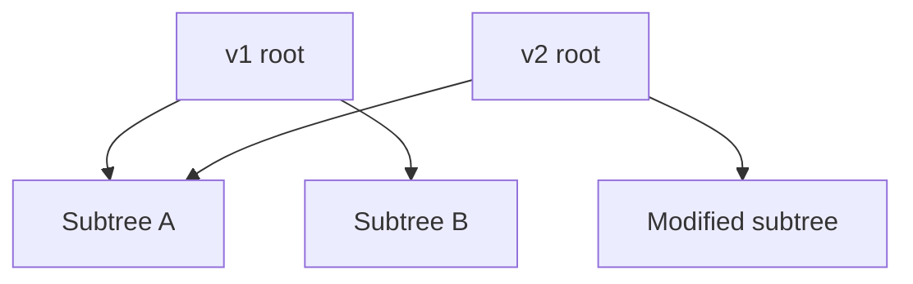
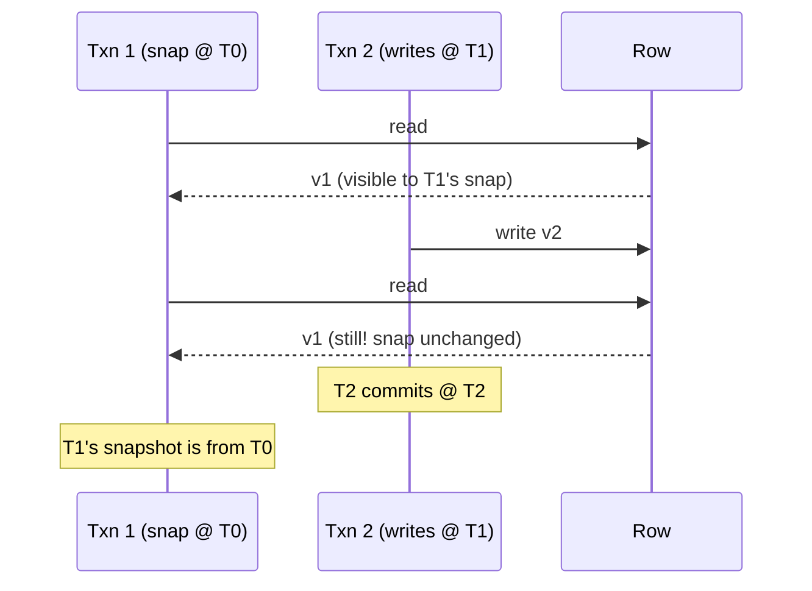

# Memento — Professional Level

> **Source:** [refactoring.guru/design-patterns/memento](https://refactoring.guru/design-patterns/memento)
> **Prerequisite:** [Senior](senior.md)

---

## Table of Contents

1. [Introduction](#introduction)
2. [Persistent Data Structure Internals](#persistent-data-structure-internals)
3. [MVCC Implementation Details](#mvcc-implementation-details)
4. [Snapshot Compression](#snapshot-compression)
5. [Copy-on-Write Performance](#copy-on-write-performance)
6. [Memory Layout & Allocation](#memory-layout--allocation)
7. [Serialization Costs](#serialization-costs)
8. [Snapshot Frequency Tuning](#snapshot-frequency-tuning)
9. [Cross-Language Comparison](#cross-language-comparison)
10. [Microbenchmark Anatomy](#microbenchmark-anatomy)
11. [Diagrams](#diagrams)
12. [Related Topics](#related-topics)

---

## Introduction

A Memento at the professional level is examined for what the runtime makes of it: how persistent data structures share memory, how MVCC databases version rows, how snapshot compression works, and where the throughput costs of high-frequency snapshotting live.

For high-throughput systems — databases, real-time editors, time-travel debuggers — the Memento's representation determines whether the system scales.

---

## Persistent Data Structure Internals

### Hash Array Mapped Trie (HAMT)

Used in Clojure's `PersistentHashMap`, Scala's `HashMap`, Immutable.js's `Map`. Tree where each node has 32 slots indexed by 5-bit chunks of the hash.

```
hash = 0xABCD1234
chunk1 = 0x0A → slot 10 at depth 0
chunk2 = 0xBC → slot 28 at depth 1
...
```

Modify: copy the path from root to the leaf (~log32 N nodes); rest is shared.

```
v1 root → [..., subtree, ...]
                    │
                    ▼
v2 root → [..., subtree', ...]   (only changed branch is new)
```

Memory cost per modification: O(log N). Memory shared: most of the structure.

### Vector trie

Clojure's `PersistentVector`. Wide tree (32-way) of 32-element arrays. Index by chunks of bits. Random access O(log32 N) ≈ O(1) for any practical N.

### CTrie / RRB-tree

More advanced variants for concurrent persistent maps. Used in Scala's TrieMap, certain reactive frameworks.

### Cost summary

| Operation | Persistent map (HAMT) | Mutable map (HashMap) |
|---|---|---|
| Get | O(log32 N) ≈ O(1) | O(1) |
| Set | O(log32 N) | O(1) amortized |
| Memory per copy | O(log N) | O(N) |
| Memento "free"? | Yes | No (deep copy) |

---

## MVCC Implementation Details

### Postgres tuple versions

Each row has hidden columns: `xmin` (transaction that created it), `xmax` (transaction that deleted/updated it). A transaction's snapshot is a list of "active xids" at start. Visibility:

```
visible if: xmin committed AND xmin <= snap.xmax AND (xmax = 0 OR xmax > snap.xmax OR xmax aborted)
```

Writers create new versions; readers see versions matching their snapshot.

### Vacuum

Old tuple versions accumulate. Postgres's autovacuum reclaims them when no transaction needs them anymore. Bloat (unvacuumed dead tuples) is a real operational concern.

### Snapshot isolation level

Postgres's "REPEATABLE READ" gives snapshot isolation: the snapshot is taken at txn start; readers see consistent point-in-time view. Avoids many anomalies; doesn't prevent write skew.

### Cost

Memory per row: a few extra bytes (xmin/xmax). Per-transaction: one snapshot (list of xids). Reads: O(1) check vs snapshot per row examined. Vacuum: background cost.

---

## Snapshot Compression

### When state is large

A 100MB snapshot stored every 10 minutes = 14.4 GB/day. Compression is essential.

### Algorithms

- **gzip** — universal; ~3:1 ratio for text.
- **zstd** — better ratio + speed; common modern choice.
- **lz4** — fast compression; lower ratio.
- **delta encoding** — store differences between consecutive snapshots.

### Snapshot vs delta

Pure snapshots: random access (just read). Delta chains: must apply N deltas to reconstruct. Common approach: full snapshot every K, deltas in between. Restore = nearest snapshot + deltas.

```
full @ 0, delta @ 1, delta @ 2, ..., delta @ 99, full @ 100, ...
```

### Trade-off

- Full: fast restore, more storage.
- Delta: less storage, slower restore.
- Mixed: tunable.

---

## Copy-on-Write Performance

### File system COW (BTRFS, ZFS, APFS)

Snapshots are pointer-cheap. Modify a file: only the changed blocks are new; rest shared. Snapshots = pointer to current root.

### Database COW (LMDB, BoltDB)

LMDB uses COW B-trees. Every transaction starts a new snapshot; writers create a new tree path; readers continue with their root. No locks for readers.

### Cost

- Read amplification: zero (random reads of immutable data).
- Write amplification: copy-on-write means more I/O (full block writes).
- Memory: shared via mmap; OS handles.

### Useful primitive

For application Mementos, COW data structures (e.g., BTree implementations in Java's TreeMap when wrapped immutably) give similar properties.

---

## Memory Layout & Allocation

### Mementos churn allocations

Each Memento allocates. For high-frequency snapshotting (every keystroke), allocation pressure is real.

Mitigations:
- **Pool Mementos.** Reuse instances. Care with concurrency.
- **Persistent data structures.** Modify produces a new value; old is the Memento. Sharing reduces allocation.
- **Off-heap storage.** Mementos in `ByteBuffer` / direct memory; less GC pressure.

### Allocation cost (JVM)

Small object allocation: ~10 ns. For 1M Mementos/sec, ~10ms/sec on allocation alone — visible. Pooling or persistent structures are the answer.

### Cache effects

Sequential access to Mementos benefits from cache prefetching. Random access (e.g., undo to arbitrary point) is cache-cold.

---

## Serialization Costs

For persisted Mementos:

| Format | Speed | Size | Schema-aware |
|---|---|---|---|
| **JSON** | Slow (~10K obj/s) | Large | No |
| **Protobuf** | Fast (~100K obj/s) | Compact | Yes |
| **Avro** | Fast | Compact | Yes (registry) |
| **MessagePack** | Fast | Compact | No (or via schema) |
| **Java Serialization** | Slow | Bloated | No |
| **Kryo** | Very fast | Compact | No |

For high-frequency persistent Mementos (e.g., autosave): pick Protobuf / Kryo. For human-readable / debugging: JSON.

### Compression on top

`zstd` over Protobuf: typical 5:1 on top of Protobuf's already-compact form. Worth it for archival storage.

---

## Snapshot Frequency Tuning

### Trade-off

Too frequent: storage cost; CPU cost.
Too rare: long replay; large memory in active state.

### Heuristic for event-sourced systems

- Aggregates with <1K events: no snapshots needed.
- Aggregates with 1K-100K events: snapshot every ~100-1000 events.
- Aggregates >100K events: snapshot every ~1000-10000.

Tune by measuring: load latency, snapshot storage, snapshot creation cost.

### Auto-tuning

Some systems track load latency; snapshot when it exceeds a threshold. Adaptive snapshotting.

### When NOT to snapshot

- State is small (<1KB).
- Rare loads.
- Storage is expensive (mobile apps).

---

## Cross-Language Comparison

| Language | Persistent Data Structures | Memento Form |
|---|---|---|
| **Clojure** | Native (PersistentMap, etc.) | Free Mementos via immutability |
| **Scala** | Immutable collections | Free Mementos |
| **Java** | Guava ImmutableMap, PCollections, Vavr | Library-based |
| **Kotlin** | `data class` `copy()`; PersistentList (kotlinx.collections.immutable) | Idiomatic |
| **Rust** | `im` crate | Functional style |
| **Python** | `pyrsistent` | Library |
| **JavaScript** | Immutable.js, Immer | Immer popular |
| **C#** | `System.Collections.Immutable` | Built-in |

### Key contrasts

- **Clojure / Scala**: Mementos are basically "the previous value." No copy needed.
- **Imperative languages**: Mementos require explicit copy or library use. More boilerplate.
- **Immer (JS)**: write mutation-style code; library produces immutable output. Best of both.

---

## Microbenchmark Anatomy

### Memento save cost

```java
@Benchmark public Memento save(MementoBench bench) {
    return bench.editor.save();
}
```

For a small state (~100 bytes): <100 ns. For deep copies of large state: ~µs to ms.

### Restore cost

Symmetric. Restoring is usually cheaper than saving (no allocation, just assignment).

### Persistent data structure modify

`map.assoc(k, v)` in Clojure: ~100-200 ns. Compared to mutable `map.put(k, v)`: ~10-50 ns. ~2-10× slower; but you get a Memento for free.

### Snapshot serialization

JSON for 1KB state: ~10 µs.
Protobuf: ~1 µs.
Compression on top adds ~10 µs.

For interactive apps, all negligible. For high-throughput, Protobuf / Kryo + selective compression.

### Pitfalls

- Constant input → JIT folds save/restore.
- Insufficient warmup → measure interpreter, not compiled code.
- DCE → use Blackhole.

---

## Diagrams

### HAMT structural sharing



v2's `Modified` subtree is the only new allocation. `Common1` and `Common2` shared between v1 and v2.

### MVCC visibility



T1 sees v1 throughout, even though T2 wrote v2.

---

## Related Topics

- [Persistent data structures](../../../coding-principles/persistent-data.md)
- [MVCC implementation](../../../infra/mvcc.md)
- [Snapshot compression strategies](../../../performance/snapshot-compression.md)
- [Serialization formats](../../../coding-principles/serialization.md)
- [Event sourcing snapshots](../../../coding-principles/event-sourcing.md)

[← Senior](senior.md) · [Interview →](interview.md)
