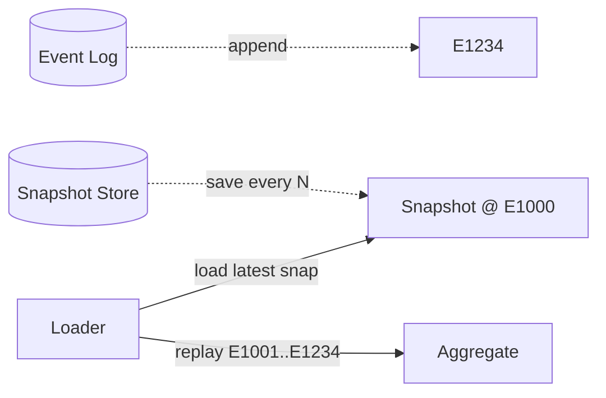
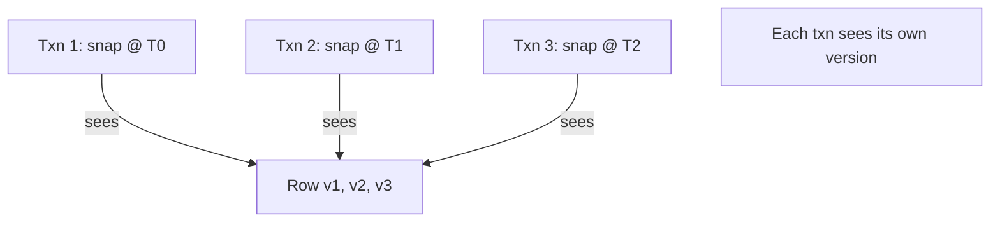

# Memento — Senior Level

> **Source:** [refactoring.guru/design-patterns/memento](https://refactoring.guru/design-patterns/memento)
> **Prerequisite:** [Middle](middle.md)

---

## Table of Contents

1. [Introduction](#introduction)
2. [Memento at Architectural Scale](#memento-at-architectural-scale)
3. [Snapshots in Event Sourcing](#snapshots-in-event-sourcing)
4. [Persistent Data Structures](#persistent-data-structures)
5. [Concurrency: Snapshotting Mutating State](#concurrency-snapshotting-mutating-state)
6. [Schema Evolution of Persisted Mementos](#schema-evolution-of-persisted-mementos)
7. [When Memento Becomes a Problem](#when-memento-becomes-a-problem)
8. [Code Examples — Advanced](#code-examples--advanced)
9. [Real-World Architectures](#real-world-architectures)
10. [Pros & Cons at Scale](#pros--cons-at-scale)
11. [Trade-off Analysis Matrix](#trade-off-analysis-matrix)
12. [Migration Patterns](#migration-patterns)
13. [Diagrams](#diagrams)
14. [Related Topics](#related-topics)

---

## Introduction

> Focus: **At scale, what breaks? What earns its keep?**

In toy code Memento is "save the state in a struct." In production it is "snapshots of aggregates persisted alongside event logs to bound replay time," "MVCC isolation in databases via per-transaction snapshots," "persistent immutable data structures for time-travel debugging." The senior question isn't "do I write Memento?" — it's **"what's snapshotted, where is it stored, how does it evolve, and how do we recover when persisted snapshots can't be loaded?"**

At scale Memento intersects with:

- **Event sourcing** — periodic snapshots accelerate replay.
- **MVCC databases** — every transaction has its own snapshot.
- **Persistent data structures** — every modification is a Memento for free.
- **Browser DevTools** — Redux time-travel is Memento-based.
- **Workflow engines** — checkpoint state for resumable workflows.

These are Memento at architectural scale. The fundamentals apply but operational concerns dominate.

---

## Memento at Architectural Scale

### 1. Event sourcing snapshots

```
events: [E1, E2, ..., E1000, snapshot @ 1000, E1001, E1002]
loading: snapshot + events after snapshot
```

Replaying 100K events takes seconds. With snapshots every 1000 events, worst-case replay is 1000 events. The snapshot IS a Memento; the event log IS partial Mementos.

### 2. MVCC (PostgreSQL, MySQL InnoDB)

Each transaction sees a *snapshot* of the database as of the transaction's start. The DB maintains multiple versions of each row; readers don't block writers. The transaction's snapshot is a Memento managed by the engine.

### 3. Redux DevTools time travel

```javascript
const history = [];
const reducer = (state, action) => {
    const newState = applyAction(state, action);
    history.push({ action, state: newState });
    return newState;
};
```

Each state is a Memento. DevTools lets you scrub through history to inspect or replay. Possible because Redux state is immutable.

### 4. Git commits

Each commit is a tree snapshot (well — a tree of object references). The commit history is a series of Mementos. `git checkout <commit>` restores the working tree to that snapshot.

### 5. VM snapshots

VMware, KVM, AWS EC2 snapshots: capture the entire VM state (memory, disk) at a point. Restore to that exact state. Memento at machine level.

### 6. Workflow checkpoints

Temporal stores workflow state at every step. On crash, replay or resume from the last successful step. The "state" includes activity results — a Memento stitched together from history.

---

## Snapshots in Event Sourcing

### The replay problem

```python
def load_aggregate(id):
    events = event_store.find_all(id)   # 100K events
    aggregate = Aggregate()
    for e in events:
        aggregate.apply(e)
    return aggregate
```

For frequently-loaded aggregates with long histories, this is too slow.

### Snapshots solve it

```python
def load_aggregate(id):
    snap = snapshot_store.find_latest(id)
    if snap:
        agg = Aggregate.from_snapshot(snap)
        events = event_store.find_after(id, snap.sequence)
    else:
        agg = Aggregate()
        events = event_store.find_all(id)
    for e in events:
        agg.apply(e)
    return agg
```

Save a snapshot every N events; load the latest + replay events since.

### Snapshot strategies

- **Synchronous**: snapshot in same transaction as event. Fresh; slows writes.
- **Asynchronous**: separate process snapshots periodically. Eventual; fast writes.
- **On-demand**: snapshot when load detected to be slow. Lazy.

### Snapshot retention

Old snapshots can usually be deleted; only the latest is needed for fast replay. Keep history if storage allows (audit, time travel).

---

## Persistent Data Structures

A persistent data structure (Clojure, Scala, Immutable.js) gives "free" Mementos: every modification produces a new value; the old value remains valid.

```clojure
(def v1 {:a 1 :b 2})
(def v2 (assoc v1 :a 10))
;; v1 still {:a 1 :b 2}
;; v2 is {:a 10 :b 2}
```

### Structural sharing

Memory is shared between v1 and v2. Only the changed parts are new. So 1000 Mementos of a large map don't cost 1000× memory.

### Trade-offs

- **Memory**: shared, but pointer-heavy. Some overhead per Memento.
- **Performance**: lookups are O(log N) instead of O(1) for hash maps.
- **API**: every modification returns a new structure; explicit handling.

For functional languages, this is the default. In imperative languages, libraries like Immutable.js / Im4Java provide it.

---

## Concurrency: Snapshotting Mutating State

### Single-threaded

Trivial. Snapshot is a copy of the state at the moment.

### Multi-threaded with lock

```java
public synchronized Memento save() {
    return new Memento(this.state);
}
```

Snapshot and mutators serialize. Correctness; potential bottleneck.

### Multi-threaded with copy-on-write

State held in an `AtomicReference` to an immutable record. Snapshot = read the reference. Modify = build new record, CAS in.

```java
private final AtomicReference<State> state = new AtomicReference<>(initial);

public Memento save() {
    return new Memento(state.get());   // immutable; safe to read
}

public void update(...) {
    state.updateAndGet(s -> s.with(...));
}
```

Lock-free reads; CAS writes. Snapshots are pointer-cheap.

### Multi-version concurrency control (MVCC)

DB-level. Each transaction's snapshot is a "version" — readers see consistent state without blocking writers. The DB engine manages the Mementos.

---

## Schema Evolution of Persisted Mementos

A Memento serialized in v1 must be loadable in v2. Common challenges:

### Field additions

V2 adds `discount_code`. V1 mementos don't have it. Loader must default it.

```python
@dataclass
class State:
    items: list
    discount_code: str = ""   # default for old data
```

### Field removals

V2 removes `legacy_field`. V1 mementos still have it. Loader must ignore.

JSON: `@JsonIgnoreProperties(ignoreUnknown = true)` (Jackson).

### Field renames

Add new field; deprecate old. After all v1 Mementos are migrated, remove old field. Migration code reads either name.

### Field type changes

`int` → `long`? Usually safe. `String` → `int`? Need parsing logic.

### Major version bumps

`Memento.version` field. Loader branches on version. Migration code updates v1 → v2 → v3.

```python
def load(json):
    data = json.loads(json)
    if data.get("version", 1) == 1:
        data = migrate_v1_to_v2(data)
    return State(**data)
```

---

## When Memento Becomes a Problem

### 1. Memento bloat

Each Memento is 100MB; history depth 50. Memory: 5GB. Either:
- Diff-based Mementos.
- Persistent data structures with structural sharing.
- Compress on save.

### 2. Persisted Memento format breakage

V2 deployment loads v1 Mementos. Crashes. Customers can't load saves. Disaster.

Mitigations: schema versioning, forward-compatible deserializers, automated tests against old serialized data.

### 3. Stale references

Memento captures a `User` reference. User is deleted. Restoring uses a phantom user. Either:
- Capture by value (deep copy).
- Capture stable identifiers (IDs, not refs).

### 4. Concurrent corruption

Snapshotting an object being concurrently mutated → torn read. Synchronize, or snapshot via immutable atomic state.

### 5. Resources in state

Memento contains an `OutputStream`. Restore tries to use it; stream is closed. Strip resources before saving; reacquire on restore.

### 6. Privacy

Memento contains sensitive fields (passwords, tokens). Caretaker logs Mementos for "debugging." Now sensitive data leaks. Mark sensitive fields explicitly; don't log Mementos.

---

## Code Examples — Advanced

### A — Event-sourced aggregate with snapshots (Java)

```java
public final class OrderRepository {
    private final EventStore events;
    private final SnapshotStore snapshots;

    public Order load(String id) {
        Optional<Snapshot> snap = snapshots.findLatest(id);
        Order order;
        long fromSeq;
        if (snap.isPresent()) {
            order = Order.fromSnapshot(snap.get());
            fromSeq = snap.get().sequence() + 1;
        } else {
            order = new Order();
            fromSeq = 0;
        }
        for (Event e : events.findAfter(id, fromSeq)) {
            order.apply(e);
        }
        return order;
    }

    public void save(Order order) {
        events.append(order.id(), order.uncommittedEvents());
        if (order.eventCount() % 1000 == 0) {
            snapshots.save(order.id(), order.snapshot());
        }
    }
}
```

Snapshot every 1000 events. On load, replay only events since the snapshot.

---

### B — Concurrent Memento with CAS (Java)

```java
public final class CounterWithSnapshot {
    private final AtomicReference<State> state = new AtomicReference<>(new State(0, ""));

    public record State(int count, String label) {}
    public record Memento(State snapshot) {}

    public Memento save() { return new Memento(state.get()); }
    public void restore(Memento m) { state.set(m.snapshot()); }

    public void increment() {
        state.updateAndGet(s -> new State(s.count() + 1, s.label()));
    }

    public State current() { return state.get(); }
}
```

Lock-free; immutable state; Mementos are pointer-cheap.

---

### C — Diff-based Memento with patches (Python)

```python
import json
from dataclasses import dataclass
from typing import Any, List


@dataclass(frozen=True)
class Patch:
    path: str
    op: str   # "set", "del"
    old: Any
    new: Any


class Document:
    def __init__(self, initial: dict) -> None:
        self.data = dict(initial)

    def update(self, path: str, value: Any) -> Patch:
        old = self.data.get(path)
        self.data[path] = value
        return Patch(path=path, op="set", old=old, new=value)

    def revert(self, p: Patch) -> None:
        if p.op == "set":
            self.data[p.path] = p.old


doc = Document({"title": "A"})
patches: List[Patch] = []
patches.append(doc.update("title", "B"))
patches.append(doc.update("body", "Hello"))
print(doc.data)   # {'title': 'B', 'body': 'Hello'}

# Undo all in reverse
for p in reversed(patches):
    doc.revert(p)
print(doc.data)   # {'title': 'A'}
```

Each patch is a tiny Memento. Memory cost ≈ size of changed value, not full document.

---

### D — Persisted Memento with versioning (TypeScript)

```typescript
type StateV1 = { count: number };
type StateV2 = { count: number; label: string };

class State implements StateV2 {
    constructor(public count: number, public label: string) {}

    static fromJSON(json: string): State {
        const data: any = JSON.parse(json);
        const version = data.__version ?? 1;
        if (version === 1) {
            return new State(data.count, "");   // migrate
        }
        return new State(data.count, data.label);
    }

    toJSON(): string {
        return JSON.stringify({ __version: 2, count: this.count, label: this.label });
    }
}
```

Schema-versioned Mementos; loader migrates old data.

---

## Real-World Architectures

### Postgres MVCC

Each transaction has a snapshot of all rows. The DB stores multiple versions; VACUUM cleans up old versions. Readers see a consistent point-in-time view; writers don't block.

### Redux + Redux DevTools

State is immutable. Each action produces new state. DevTools captures every state for time-travel. Works because state is structurally shared (Immer / Immutable.js).

### Git

Every commit is a tree snapshot. Trees are content-addressed (Merkle trees). Branches are pointers to commits. `git checkout` restores the tree.

### Temporal workflows

Workflow event history IS the Memento. On worker crash, replay history to rehydrate workflow state. With deterministic workflow code, the result is identical.

---

## Pros & Cons at Scale

| Pros | Cons |
|---|---|
| Time-travel debugging built-in | Memory cost grows with history |
| Event sourcing replay efficient (with snapshots) | Snapshot frequency is a tuning knob |
| MVCC enables non-blocking reads | Complex (multi-version row management) |
| Persistent data structures = free Mementos | Performance trade-off (O(log N) instead of O(1)) |
| Schema evolution is solvable | Requires discipline and tests |
| Compresses well (similar states share data) | Bugs in restore hurt; correctness critical |

---

## Trade-off Analysis Matrix

| Dimension | Full snapshot | Diff-based | Persistent data structure | Event sourcing |
|---|---|---|---|---|
| **Memory per Memento** | High | Low | Shared | Just events |
| **Save cost** | O(state size) | O(diff size) | O(log N) | O(1) (append) |
| **Restore cost** | O(state size) | O(history depth) | O(1) | O(events × replay) |
| **Schema evolution** | Per snapshot | Per diff format | Easier (immutable) | Per event type |
| **Use case** | Small bounded state | Editor-style apps | Functional code | Audit / time travel |

---

## Migration Patterns

### Adding snapshots to event-sourced system

1. Implement `snapshot()` on aggregate.
2. Stand up snapshot store.
3. Save snapshot every N events.
4. Update load logic to use latest snapshot + tail events.
5. Validate parity with full replay.
6. Deploy; observe load times improve.

### Migrating from full snapshots to diffs

1. Add diff-based Memento support alongside full.
2. Migrate Originator to produce diffs by default.
3. Existing full Mementos remain valid.
4. After all loaders updated, deprecate full Mementos.

### Persistent Memento schema upgrade

1. Bump Memento version.
2. Add migration logic in deserializer.
3. Persisted Mementos in v1 → migrated on load.
4. Test with old data files.
5. Eventually re-save migrated data; remove migration code.

---

## Diagrams

### Event sourcing with snapshots



### MVCC snapshots



---

## Related Topics

- Event sourcing
- MVCC
- Persistent data structures
- Database snapshots
- Schema evolution

[← Middle](middle.md) · [Professional →](professional.md)
