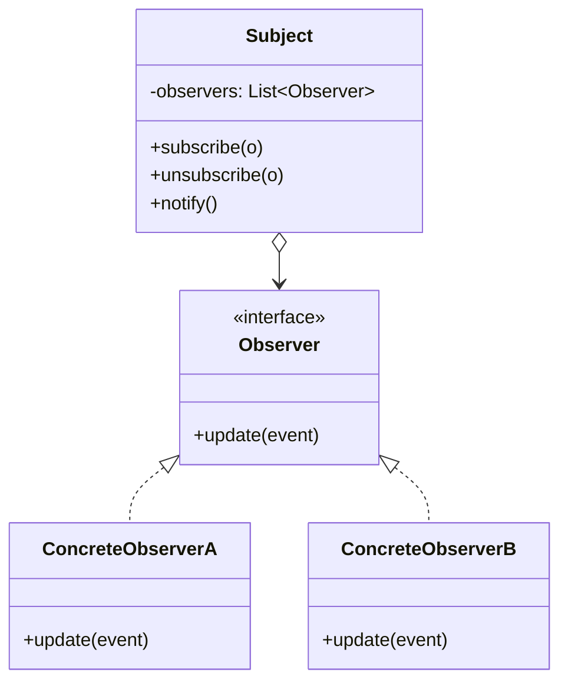
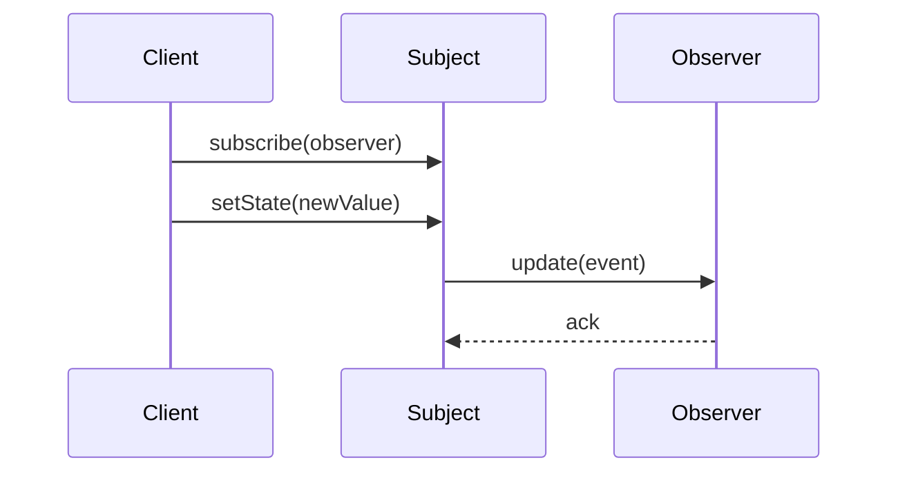

# Observer — Junior Level

> **Source:** [refactoring.guru/design-patterns/observer](https://refactoring.guru/design-patterns/observer)
> **Category:** [Behavioral](../README.md) — *"Concerned with algorithms and the assignment of responsibilities between objects."*

---

## Table of Contents

1. [Introduction](#introduction)
2. [Prerequisites](#prerequisites)
3. [Glossary](#glossary)
4. [Core Concepts](#core-concepts)
5. [Real-World Analogies](#real-world-analogies)
6. [Mental Models](#mental-models)
7. [Pros & Cons](#pros--cons)
8. [Use Cases](#use-cases)
9. [Code Examples](#code-examples)
10. [Coding Patterns](#coding-patterns)
11. [Clean Code](#clean-code)
12. [Best Practices](#best-practices)
13. [Edge Cases & Pitfalls](#edge-cases--pitfalls)
14. [Common Mistakes](#common-mistakes)
15. [Tricky Points](#tricky-points)
16. [Test Yourself](#test-yourself)
17. [Tricky Questions](#tricky-questions)
18. [Cheat Sheet](#cheat-sheet)
19. [Summary](#summary)
20. [What You Can Build](#what-you-can-build)
21. [Further Reading](#further-reading)
22. [Related Topics](#related-topics)
23. [Diagrams & Visual Aids](#diagrams--visual-aids)

---

## Introduction

> Focus: **What is it?** and **How to use it?**

**Observer** is a behavioral design pattern that establishes a **one-to-many** dependency between objects: when the **Subject** changes, all registered **Observers** are notified automatically.

Imagine a YouTube channel. Subscribers don't ping the channel every minute asking "is there a new video?" The channel pushes a notification when something happens. The channel doesn't know its subscribers personally — it just knows "tell everyone in the list." Subscribers come and go without the channel rewriting itself.

In one sentence: *"When this changes, tell everyone who cares."*

Observer is the foundation of event-driven programming. Every UI button click, every database trigger, every reactive stream is built on this idea: separate the *thing that happened* from the *things that need to react*.

---

## Prerequisites

What you should know before reading this:

- **Required:** Basic OOP — interfaces, classes, references.
- **Required:** A list / collection (the Subject keeps observers in one).
- **Helpful:** Some experience with callbacks or events — Observer is the formal name.
- **Helpful:** A taste of *why* tight coupling between modules hurts — Observer is the cure.

---

## Glossary

| Term | Definition |
|------|-----------|
| **Subject** (Publisher) | The object that holds state and notifies observers when it changes. |
| **Observer** (Subscriber) | An object that wants to be notified. Implements an `update()` (or `onEvent()`) method. |
| **Subscribe / Attach** | Register an Observer with the Subject. |
| **Unsubscribe / Detach** | Remove an Observer from the Subject. |
| **Notify** | The Subject's act of calling each observer. |
| **Event** | A piece of data describing what happened (often passed to observers). |
| **Push model** | Subject sends data to observers. |
| **Pull model** | Subject only notifies; observers fetch what they need. |

---

## Core Concepts

### 1. Subject Holds a List of Observers

The Subject doesn't know what each observer does — only that they implement the observer interface.

```java
class Subject {
    private final List<Observer> observers = new ArrayList<>();
    public void subscribe(Observer o) { observers.add(o); }
    public void unsubscribe(Observer o) { observers.remove(o); }
}
```

### 2. Observers Implement a Common Interface

Every observer has the same shape — an `update()` method (or `onChange()`, `onEvent()`).

```java
interface Observer {
    void update(Event e);
}
```

### 3. Subject Notifies on Change

When something happens, the Subject loops through observers and calls their `update`.

```java
private void notifyAll(Event e) {
    for (Observer o : observers) o.update(e);
}
```

### 4. Observers Don't Know Each Other

Each observer reacts independently. They don't coordinate, don't see each other, don't depend on order.

### 5. Loose Coupling

The Subject knows the *interface*, never the concrete classes. Adding a new observer doesn't change the Subject. Open/Closed in action.

---

## Real-World Analogies

| Concept | Analogy |
|---------|--------|
| **Subject** | A radio station broadcasting on a frequency. |
| **Observer** | A radio receiver tuned to the frequency. |
| **Subscribe** | Tuning in. |
| **Unsubscribe** | Switching to another frequency. |
| **Notification** | The audio signal. |

The classical refactoring.guru analogy is **newspaper subscriptions**: the publisher doesn't deliver to a fixed list of names — it ships to whoever's signed up. Subscribers come and go; the publisher's job stays the same.

Another good one is **YouTube notifications**: you click subscribe; the channel sends a notification when a new video drops; you can unsubscribe any time. The channel doesn't care if there are 10 subscribers or 10 million.

---

## Mental Models

**The intuition:** A bell in a town square. When something important happens, you ring it. People in the square turn and look. They don't have to ask "did something happen?" all day. They just react when the bell rings.

**Why this model helps:** It separates *announcing* from *reacting*. The bell doesn't know who's in the square; the people don't know what triggered the bell.

**Visualization:**

```
            ┌──────────┐
            │ Subject  │
            └────┬─────┘
                 │ notify()
       ┌─────────┼─────────┐
       ▼         ▼         ▼
  ┌────────┐ ┌────────┐ ┌────────┐
  │  Obs A │ │  Obs B │ │  Obs C │
  └────────┘ └────────┘ └────────┘
```

One Subject, many Observers, broadcast direction.

---

## Pros & Cons

| Pros | Cons |
|------|------|
| Loose coupling between Subject and Observers | Notification order is usually unspecified |
| Open/Closed: add observers without modifying Subject | Cascading updates can become hard to follow |
| Multiple observers can react in parallel | Memory leaks if observers are not unsubscribed |
| Reusable Subject with different observers | A buggy observer can stall the chain (sync) |
| Foundation for events / reactive streams | Debugging "who fired what" can be tricky |

### When to use:
- A change in one object must propagate to many others
- You don't know which (or how many) other objects must react
- You want to decouple a producer from its consumers
- You're building UI events, log systems, audit trails, or pub/sub infrastructure

### When NOT to use:
- There's exactly one consumer that always exists — direct call is simpler
- Order of notification matters strictly — Observer is unordered by default
- Performance is critical and the observer chain is long — synchronous broadcast adds latency
- The "subscribers" are wildly different in semantics — multiple specific interfaces beats one generic

---

## Use Cases

Real-world places where Observer is commonly applied:

- **UI events** — clicks, key presses, scroll events. The widget is the Subject; handlers are Observers.
- **Domain events** — `OrderPlaced`, `UserRegistered` → email service, analytics, inventory all listen.
- **Logging / audit** — every state change is observed and recorded.
- **Reactive streams** — RxJava, Project Reactor, RxJS implement Observer at their core.
- **Pub/sub messaging** — Kafka, RabbitMQ, Redis Pub/Sub at network scale.
- **Spreadsheet recalc** — change a cell, dependent cells recalculate.
- **Database triggers** — row update, observer fires (audit, replication).
- **Vue / React state** — reactivity systems are Observer-based under the hood.
- **Java's `java.beans.PropertyChangeListener`** — direct Observer API.

---

## Code Examples

### Go

A weather station broadcasting temperature updates.

```go
package main

import "fmt"

// Observer.
type Observer interface {
	Update(temp float64)
}

// Subject.
type WeatherStation struct {
	observers []Observer
	temp      float64
}

func (w *WeatherStation) Subscribe(o Observer)   { w.observers = append(w.observers, o) }
func (w *WeatherStation) Unsubscribe(o Observer) {
	for i, x := range w.observers {
		if x == o {
			w.observers = append(w.observers[:i], w.observers[i+1:]...)
			return
		}
	}
}

func (w *WeatherStation) SetTemp(t float64) {
	w.temp = t
	for _, o := range w.observers {
		o.Update(t)
	}
}

// Concrete observers.
type Display struct{ name string }

func (d *Display) Update(t float64) { fmt.Printf("[%s] new temp: %.1f\n", d.name, t) }

func main() {
	w := &WeatherStation{}
	d1 := &Display{name: "Phone"}
	d2 := &Display{name: "Web"}
	w.Subscribe(d1)
	w.Subscribe(d2)

	w.SetTemp(22.5)
	w.SetTemp(23.0)

	w.Unsubscribe(d1)
	w.SetTemp(24.0)
}
```

**What it does:** When the temperature changes, every subscribed display updates.

**How to run:** `go run main.go`

---

### Java

A simple event bus.

```java
import java.util.*;

interface Listener<E> {
    void on(E event);
}

public final class EventBus<E> {
    private final List<Listener<E>> listeners = new ArrayList<>();

    public void subscribe(Listener<E> l)   { listeners.add(l); }
    public void unsubscribe(Listener<E> l) { listeners.remove(l); }

    public void publish(E event) {
        // Snapshot so observers can subscribe/unsubscribe during dispatch.
        for (Listener<E> l : new ArrayList<>(listeners)) l.on(event);
    }
}

class Demo {
    public static void main(String[] args) {
        EventBus<String> bus = new EventBus<>();
        Listener<String> a = e -> System.out.println("A got " + e);
        Listener<String> b = e -> System.out.println("B got " + e);

        bus.subscribe(a);
        bus.subscribe(b);
        bus.publish("hello");

        bus.unsubscribe(a);
        bus.publish("world");
    }
}
```

**What it does:** A typed event bus. Listeners get notified for every published event.

**How to run:** `javac *.java && java Demo`

---

### Python

A `dataclass`-based subject with lambda observers.

```python
from dataclasses import dataclass, field
from typing import Callable, List


@dataclass
class Subject:
    """Observable temperature reading."""
    _observers: List[Callable[[float], None]] = field(default_factory=list)
    _temp: float = 0.0

    def subscribe(self, fn: Callable[[float], None]) -> None:
        self._observers.append(fn)

    def unsubscribe(self, fn: Callable[[float], None]) -> None:
        self._observers.remove(fn)

    @property
    def temp(self) -> float:
        return self._temp

    @temp.setter
    def temp(self, value: float) -> None:
        self._temp = value
        for o in list(self._observers):
            o(value)


if __name__ == "__main__":
    s = Subject()
    phone = lambda t: print(f"phone: {t}")
    web   = lambda t: print(f"web:   {t}")

    s.subscribe(phone)
    s.subscribe(web)

    s.temp = 22.5
    s.temp = 23.0
    s.unsubscribe(phone)
    s.temp = 24.0
```

**What it does:** Setter triggers notifications; observers are plain functions.

**How to run:** `python3 main.py`

---

## Coding Patterns

### Pattern 1: Push Model

**Intent:** Subject pushes the data to observers.

```java
interface Observer { void onTempChanged(double newTemp); }
```

Pros: Observers don't need access to Subject internals.
Cons: Subject decides what to push; observers can't fetch other state.

**When:** Most events. Default choice.

---

### Pattern 2: Pull Model

**Intent:** Subject only signals "something changed"; observers pull what they need.

```java
interface Observer { void onChanged(Subject s); }
// Observer reads s.getTemp(), s.getHumidity(), ...
```

Pros: Subject doesn't need to know what each observer wants.
Cons: Observer is tightly coupled to Subject's API.

**When:** Observers need different slices of state.

---

### Pattern 3: Typed Events

**Intent:** Each event has its own type; observers subscribe to specific event types.

```java
class OrderPlaced { final String orderId; ... }
class OrderShipped { final String orderId; ... }

bus.subscribe(OrderPlaced.class, e -> sendEmail(e.orderId));
bus.subscribe(OrderShipped.class, e -> updateInventory(e.orderId));
```

**When:** Domain events, message buses, reactive streams.

---

### Pattern 4: Functional Observer

**Intent:** Skip the interface; pass a callback (lambda).

```python
button.on_click(lambda: print("clicked!"))
```

Most modern languages favor this. The "interface" is the function signature.

**When:** Single-method observer, lightweight.

---

## Clean Code

- **Use specific event types, not strings.** `bus.publish(new OrderPlaced(...))` is type-safe; `bus.publish("ORDER_PLACED", data)` is fragile.
- **Snapshot the listener list before iterating.** An observer might subscribe/unsubscribe during dispatch — concurrent modification.
- **Document whether observers are called synchronously or asynchronously.** Big difference in semantics.
- **Don't pass mutable state to observers.** They might mutate it; chaos.
- **Keep observer methods short.** A slow observer stalls the broadcast chain.

---

## Best Practices

- **Always provide unsubscribe.** Observers leak otherwise.
- **Be explicit about ordering.** If callers care, document; or don't promise.
- **Catch exceptions per observer.** One bad observer shouldn't break the rest.
- **Use weak references where appropriate.** Long-lived subjects with short-lived observers (e.g., UI) leak without weak refs.
- **Prefer functional observers** when the language supports it.
- **Type the events.** Strings are tempting but fragile.

---

## Edge Cases & Pitfalls

- **Observer subscribes during notify.** Without snapshotting, you mutate while iterating → `ConcurrentModificationException`.
- **Observer unsubscribes itself in `update`.** Same issue.
- **Cyclic events.** Observer A causes Subject to fire again, which calls A again. Infinite loop.
- **One observer throws.** If you don't catch per-observer, the rest are skipped.
- **Slow observer.** Synchronous notify means the slowest observer dominates total time.
- **Order dependence.** Observers should NOT depend on each other's order. If they must, redesign — Observer doesn't promise order.
- **Memory leaks.** A short-lived observer subscribed to a long-lived Subject is a leak unless explicitly unsubscribed (or held by weak reference).

---

## Common Mistakes

1. **No unsubscribe.** Observers pile up; memory grows.
2. **Iterate without snapshot.** `ConcurrentModificationException` when an observer modifies the list.
3. **Observers depend on each other's order.** Defeats the pattern.
4. **One generic `update()` with a `String` event.** Fragile; type-safe events scale better.
5. **Sync dispatch in performance-critical code.** Blocking is the chain's worst-case sum of all observers.
6. **Mutable shared event objects.** One observer mutates; others see corrupted state.
7. **Forgetting weak references** in UI frameworks. Observers outlive their views; views leak.

---

## Tricky Points

### Sync vs Async

By default, Observer is *synchronous*: `notify()` returns only after every observer has run. For UI events this is usually fine; for heavy work or many observers, async is better.

```java
public void publish(E e) {
    for (Listener<E> l : listeners)
        executor.submit(() -> l.on(e));   // async
}
```

But async opens a new can of worms: ordering, errors, backpressure.

### Observer order

The order in which observers are called is **implementation-defined**. If you're using `ArrayList`, it's insertion order. If you swap to a `Set`, it might not be. **Don't rely on order.**

### Cyclic chains

```
Subject → ObserverA → mutates Subject → notify → ObserverA → mutates Subject → ...
```

Either: detect cycles, or restructure (e.g., batch updates and notify once at the end).

### Garbage-collected observers

If `Subject` holds strong refs to observers, observers can't be GC'd until they unsubscribe. In long-lived subjects (UI, application lifecycle), prefer:
- **Weak references** (`WeakReference<Observer>` in Java).
- **Explicit unsubscribe in lifecycle hooks** (e.g., `onDestroy` in Android).

### Pull model leaks information

In the pull model, observers see the full Subject. They might call methods you didn't intend them to call. Push narrows that surface.

---

## Test Yourself

1. What problem does Observer solve?
2. What's the difference between push and pull models?
3. Why must you snapshot the observer list before iterating?
4. Give 5 real-world examples of Observer.
5. What's a memory leak risk in Observer?
6. Why do typed events beat string events?
7. When would you choose async dispatch over sync?

---

## Tricky Questions

- **Q: If an observer throws an exception during `notify()`, what happens to the rest?**
  A: Without per-observer try/catch, they're skipped. Always catch around each observer; log and continue.
- **Q: What's the difference between Observer and Pub/Sub?**
  A: Pub/Sub is Observer at network/process scale, usually with a broker (Kafka, Redis). The pattern is the same; the implementation handles persistence, routing, and durability.
- **Q: Why does Java's `Observable` have `setChanged()` before `notifyObservers()`?**
  A: Allows multiple state mutations before one notification. Without it, every setter would fire. (Java's `Observable` is deprecated; the pattern is fine, but the API was awkward.)
- **Q: Can an observer be its own subject?**
  A: Yes — chain Observers. A node observes one subject and is itself a subject for downstream observers. This is how reactive streams work.

---

## Cheat Sheet

| Concept | One-liner |
|---|---|
| Intent | Notify many observers when one Subject changes |
| Direction | One Subject → many Observers (broadcast) |
| Hot loop | `for o in observers: o.update(e)` |
| Sibling | Mediator (many-to-many through center), Pub/Sub (Observer over a network) |
| Modern form | RxJava `Observable`, EventEmitter, signals/slots, callbacks |
| Smell to fix | One subject's setter doing 5 hardcoded calls to specific consumers |

---

## Summary

Observer separates "what happened" from "who reacts". The Subject doesn't know its consumers; consumers don't know each other. Adding a new consumer doesn't modify the Subject. The trade-off is loosened control: notification order is unspecified, debugging cascading reactions is harder, and stale subscriptions leak memory.

Three things to remember:
1. **One Subject, many Observers.** Broadcast direction.
2. **Loose coupling.** Subject sees only the Observer interface.
3. **Always provide unsubscribe.** And handle exceptions per observer.

If you find a setter calling 5 specific consumers by name, Observer is asking to be born.

---

## What You Can Build

- A weather station with multiple displays (phone, web, console)
- A typed event bus for domain events
- A logger that fans out to multiple sinks (file, console, syslog)
- A spreadsheet where dependent cells recalc when a source cell changes
- A reactive form: every input change triggers validators

---

## Further Reading

- *Design Patterns: Elements of Reusable Object-Oriented Software* (GoF) — original Observer chapter
- [refactoring.guru — Observer](https://refactoring.guru/design-patterns/observer)
- *Reactive Programming with RxJava* — Ben Christensen
- [The Reactive Manifesto](https://www.reactivemanifesto.org/)

---

## Related Topics

- [Mediator](../04-mediator/junior.md) — many-to-many, central coordinator
- [Chain of Responsibility](../01-chain-of-responsibility/junior.md) — linear, first-handler-wins
- [Command](../02-command/junior.md) — encapsulates the action; can be observed
- [Pub/Sub](../../../infra/pubsub.md) — Observer at distributed scale
- [Reactive streams](../../../infra/reactive.md) — Observer formalized

---

## Diagrams & Visual Aids

### Class diagram



### Sequence: subscribe → change → notify



### Decision flow

```
                ┌──────────────────────┐
                │ Multiple consumers   │
                │ react to one change? │
                └──────────┬───────────┘
                           │ yes
                           ▼
                ┌──────────────────────┐
                │ Producer shouldn't   │
                │ know consumers?      │
                └──────────┬───────────┘
                           │ yes
                           ▼
                ┌──────────────────────┐
                │ Decoupling worth     │
                │ async / leak risk?   │
                └──────────┬───────────┘
                           │ yes
                           ▼
                  ──> Use Observer
```

[← Back to Behavioral Patterns](../README.md) · [Middle →](middle.md)
