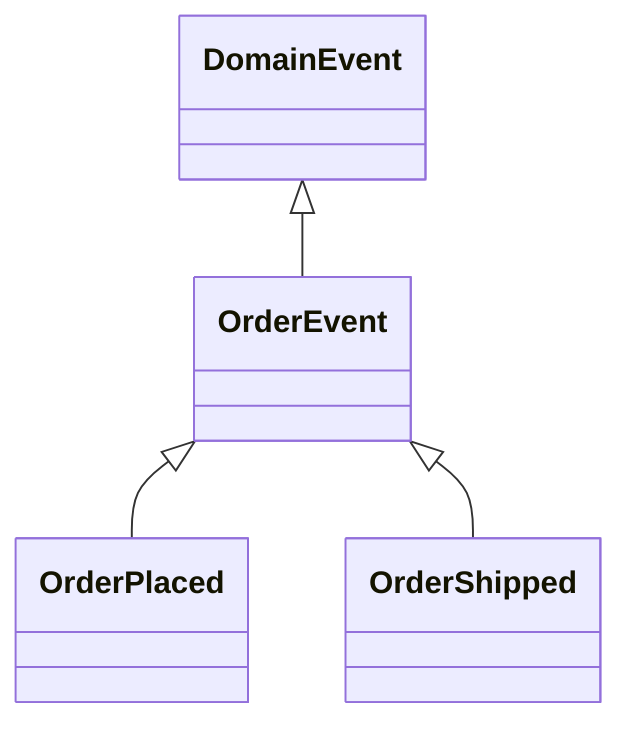
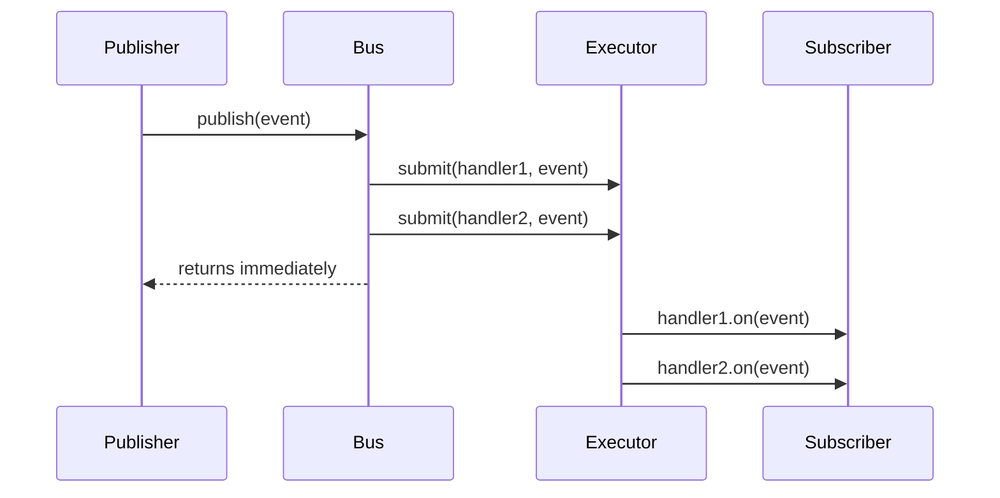

# Observer — Middle Level

> **Source:** [refactoring.guru/design-patterns/observer](https://refactoring.guru/design-patterns/observer)
> **Prerequisite:** [Junior](junior.md)

---

## Table of Contents

1. [Introduction](#introduction)
2. [When to Use Observer](#when-to-use-observer)
3. [When NOT to Use Observer](#when-not-to-use-observer)
4. [Real-World Cases](#real-world-cases)
5. [Code Examples — Production-Grade](#code-examples--production-grade)
6. [Sync vs Async Dispatch](#sync-vs-async-dispatch)
7. [Typed Event Buses](#typed-event-buses)
8. [Trade-offs](#trade-offs)
9. [Alternatives Comparison](#alternatives-comparison)
10. [Refactoring to Observer](#refactoring-to-observer)
11. [Pros & Cons (Deeper)](#pros--cons-deeper)
12. [Edge Cases](#edge-cases)
13. [Tricky Points](#tricky-points)
14. [Best Practices](#best-practices)
15. [Tasks (Practice)](#tasks-practice)
16. [Summary](#summary)
17. [Related Topics](#related-topics)
18. [Diagrams](#diagrams)

---

## Introduction

> Focus: **When to use it?** and **Why?**

You already know Observer is "Subject notifies many Observers." At the middle level the harder questions are:

- **Sync or async?** When does each break down?
- **One bus or many?** Topic-based, type-based, hierarchical?
- **Push or pull?** What gets passed in the notification?
- **How do we prevent leaks?** Weak refs, lifecycle hooks, explicit unsubscribe?
- **What about errors?** One observer's exception shouldn't kill the chain.

This document focuses on **decisions and patterns** that turn textbook Observer into something that survives a year of production.

---

## When to Use Observer

Use Observer when **all** of these are true:

1. **A change in one object must propagate to many.** And the "many" can grow.
2. **The producer shouldn't know its consumers.** Decoupling is the goal.
3. **You don't care strictly about order.** Or you'll handle ordering separately.
4. **Failure of one consumer shouldn't break others.** You can isolate per-observer errors.
5. **Memory and lifecycle are manageable.** You can ensure observers unsubscribe.

If any is missing, look elsewhere first.

### Triggers

- "When a user signs up, send email + analytics + welcome bonus." → Observer (or domain events).
- "Live UI updates when state changes." → Observer (often via reactive frameworks).
- "Audit every state change in this aggregate." → Observer.
- "Multiple services react to OrderPlaced." → Observer (in-process) or Pub/Sub (cross-process).

---

## When NOT to Use Observer

- **Exactly one consumer that always exists.** Direct call is simpler.
- **Strict ordering matters and Observer doesn't promise it.** Use a queue + sequential consumer.
- **Performance-critical path with many observers.** Sync notify is the sum of all observer times.
- **The "subscribers" need very different events.** Multiple specific channels beats one giant Observer.
- **You can't enforce unsubscribe.** Memory leaks accumulate.

### Smell: ad-hoc observer chain

```java
class User {
    void register() {
        save();
        emailService.sendWelcome(this);
        analyticsService.trackSignup(this);
        couponService.giveWelcomeCoupon(this);
        slack.notify("New user: " + this);
    }
}
```

`User.register()` knows about email, analytics, coupons, slack. Refactor to: emit `UserRegistered`; let each service subscribe.

---

## Real-World Cases

### Case 1 — Spring's `ApplicationEventPublisher`

```java
@Service
class OrderService {
    @Autowired ApplicationEventPublisher events;

    void place(Order o) {
        repo.save(o);
        events.publishEvent(new OrderPlaced(o.id()));
    }
}

@Component
class EmailListener {
    @EventListener
    public void on(OrderPlaced e) { sendOrderEmail(e.orderId()); }
}
```

`OrderService` doesn't know who listens. `EmailListener`, `AnalyticsListener`, etc. subscribe via annotation. New listener = new bean.

### Case 2 — Kafka producer / consumer

A producer publishes to a topic; consumers subscribe. Same pattern at network scale: durable, partitioned, replayable. The semantics differ (at-least-once vs exactly-once), but the shape is Observer.

### Case 3 — DOM events

```javascript
button.addEventListener('click', () => console.log('clicked'));
```

`button` is the Subject; the callback is the Observer. The DOM is one of the largest Observer implementations on Earth.

### Case 4 — RxJS / RxJava

```javascript
const obs = fromEvent(input, 'input').pipe(
  debounceTime(300),
  map(e => e.target.value)
);
obs.subscribe(value => search(value));
```

Reactive streams are Observer formalized: subscribe, get notified, compose with operators. Adds backpressure, cancellation, error handling.

### Case 5 — Database triggers

```sql
CREATE TRIGGER audit AFTER UPDATE ON users
FOR EACH ROW INSERT INTO audit_log VALUES (...);
```

The `users` table is the Subject; the trigger is an Observer. Same pattern, different runtime.

### Case 6 — Redux / NgRx state

A central store is the Subject; components subscribe to slices and re-render on change. Observer + immutability + selectors.

### Case 7 — Filesystem watchers

`fs.watch`, inotify, FSEvents, ReadDirectoryChangesW. The filesystem is the Subject; your callback is the Observer. The OS implements the broadcast.

---

## Code Examples — Production-Grade

### Example A — Robust event bus with error isolation (Java)

```java
public final class EventBus {
    private final Map<Class<?>, List<Object>> subscribers = new ConcurrentHashMap<>();
    private final Logger log = LoggerFactory.getLogger(EventBus.class);

    public <E> void subscribe(Class<E> type, Consumer<E> handler) {
        subscribers.computeIfAbsent(type, k -> new CopyOnWriteArrayList<>()).add(handler);
    }

    @SuppressWarnings("unchecked")
    public <E> void publish(E event) {
        List<Object> list = subscribers.getOrDefault(event.getClass(), List.of());
        for (Object o : list) {
            try {
                ((Consumer<E>) o).accept(event);
            } catch (Exception e) {
                log.error("subscriber failed for {}", event.getClass().getSimpleName(), e);
            }
        }
    }
}
```

Key choices:
- `CopyOnWriteArrayList` — safe for iterate-while-subscribe.
- `try/catch` per subscriber — one bad handler doesn't break the chain.
- Typed by event class — no string keys.

---

### Example B — Async event bus with executor (Java)

```java
public final class AsyncEventBus {
    private final ExecutorService executor;
    private final Map<Class<?>, List<Consumer<?>>> subs = new ConcurrentHashMap<>();

    public AsyncEventBus(int threads) {
        this.executor = Executors.newFixedThreadPool(threads);
    }

    public <E> void subscribe(Class<E> type, Consumer<E> handler) {
        subs.computeIfAbsent(type, k -> new CopyOnWriteArrayList<>()).add(handler);
    }

    @SuppressWarnings("unchecked")
    public <E> void publish(E event) {
        for (Consumer<?> c : subs.getOrDefault(event.getClass(), List.of())) {
            executor.submit(() -> {
                try { ((Consumer<E>) c).accept(event); }
                catch (Exception e) { /* log */ }
            });
        }
    }

    public void shutdown() { executor.shutdown(); }
}
```

Trade-off: ordering across subscribers is now non-deterministic, but the publisher is no longer blocked by slow handlers.

---

### Example C — Weak-ref observer (preventing leaks)

```java
public final class WeakObserverList<T> {
    private final List<WeakReference<Consumer<T>>> refs = new CopyOnWriteArrayList<>();

    public void subscribe(Consumer<T> obs) { refs.add(new WeakReference<>(obs)); }

    public void publish(T value) {
        Iterator<WeakReference<Consumer<T>>> it = refs.iterator();
        while (it.hasNext()) {
            WeakReference<Consumer<T>> r = it.next();
            Consumer<T> obs = r.get();
            if (obs == null) {
                refs.remove(r);   // GC'd; remove
            } else {
                try { obs.accept(value); } catch (Exception e) { /* log */ }
            }
        }
    }
}
```

Caveat: callers must hold a strong reference somewhere or the GC will reclaim it immediately.

---

### Example D — Reactive subject (RxJS-style, TypeScript)

```typescript
type Observer<T> = (value: T) => void;
type Unsubscribe = () => void;

class Subject<T> {
    private observers: Set<Observer<T>> = new Set();

    subscribe(obs: Observer<T>): Unsubscribe {
        this.observers.add(obs);
        return () => this.observers.delete(obs);
    }

    next(value: T): void {
        for (const obs of [...this.observers]) {
            try { obs(value); } catch (e) { console.error(e); }
        }
    }
}

const s = new Subject<number>();
const unsub = s.subscribe(v => console.log('A', v));
s.subscribe(v => console.log('B', v));

s.next(1);
unsub();      // A unsubscribed
s.next(2);
```

Subscribe returns an unsubscribe function — RxJS's idiomatic pattern.

---

## Sync vs Async Dispatch

| Aspect | Sync | Async |
|---|---|---|
| **Latency for publisher** | Sum of all observers | Constant (just enqueue) |
| **Order across observers** | Insertion order | Non-deterministic |
| **Failure isolation** | Per-handler try/catch | Per-task; failures may be silent |
| **Backpressure** | Implicit (publisher slows) | Explicit (queue management) |
| **Use case** | UI events, cohesive transactions | Heavy work, network calls, fan-out |

### When to switch to async

- Total observer time exceeds the publisher's latency budget.
- Observers do I/O (DB writes, HTTP calls).
- You can tolerate "fire-and-forget" semantics.
- You have a way to handle errors out-of-band (logging, retries, dead-letter).

### Hybrid: enqueue per observer

```java
public void publish(Event e) {
    for (Listener l : listeners) {
        if (l.isHeavy()) executor.submit(() -> l.on(e));
        else l.on(e);
    }
}
```

A pragmatic compromise.

---

## Typed Event Buses

```java
public final class TypedBus {
    private final Map<Class<?>, List<Consumer<?>>> subs = new ConcurrentHashMap<>();

    public <E> Disposable subscribe(Class<E> type, Consumer<E> h) {
        subs.computeIfAbsent(type, k -> new CopyOnWriteArrayList<>()).add(h);
        return () -> subs.get(type).remove(h);
    }

    @SuppressWarnings("unchecked")
    public <E> void publish(E event) {
        Class<?> c = event.getClass();
        for (Consumer<?> h : subs.getOrDefault(c, List.of())) {
            try { ((Consumer<E>) h).accept(event); } catch (Exception e) { /* log */ }
        }
    }
}
```

Subscribers get the right event type. No casts needed in handlers. Compile-time safety.

### Hierarchical events

```java
class DomainEvent {}
class OrderEvent extends DomainEvent {}
class OrderPlaced extends OrderEvent {}

bus.subscribe(OrderEvent.class, e -> /* every order event */);
bus.subscribe(OrderPlaced.class, e -> /* only placement */);
```

The bus must walk the type hierarchy when publishing — Spring's event publisher does exactly this.

---

## Trade-offs

| Trade-off | Cost | Benefit |
|---|---|---|
| Loose coupling | Harder to trace cascades | Modules independent |
| Sync dispatch | Latency = sum of handlers | Simple, ordered, debuggable |
| Async dispatch | Out-of-order, harder errors | Publisher fast |
| Per-handler error isolation | Slightly more code | Robust chain |
| Weak references | Subtle (need strong ref somewhere) | No leaks |
| Typed events | More classes | Safety, clarity |

---

## Alternatives Comparison

| Pattern | Use when |
|---|---|
| **Observer** | One Subject → many in-process observers; broadcast |
| **Mediator** | Many-to-many; centralized coordinator |
| **Pub/Sub** | Cross-process / cross-service; broker handles persistence |
| **Reactive streams** | Backpressure, composition, async |
| **Direct calls** | One known consumer; no flexibility needed |
| **Chain of Responsibility** | Linear; first handler wins |
| **Event sourcing** | Persist events as the source of truth |

---

## Refactoring to Observer

### Symptom
A method that calls multiple unrelated services.

```java
public void register(User u) {
    repo.save(u);
    email.sendWelcome(u);
    analytics.track(u);
    coupon.give(u);
    slack.notify(u);
}
```

### Steps
1. **Identify the trigger.** "User registered" is one event.
2. **Define an event class.** `UserRegistered(userId, email)`.
3. **Replace each call** with a `bus.publish(...)`.
4. **Add subscribers** in each affected service.
5. **Test:** publish event → all subscribers invoked.

### After

```java
public void register(User u) {
    repo.save(u);
    bus.publish(new UserRegistered(u.id(), u.email()));
}
```

`UserRegistered` listeners (in their own modules) handle email, analytics, coupons. Adding a new reaction = a new listener.

---

## Pros & Cons (Deeper)

| Pros | Cons |
|---|---|
| **Decoupling** — producer doesn't know consumers | Cascade tracing is harder (which observer fired?) |
| **Open/Closed** — add observers without touching subject | Memory leaks if observers don't unsubscribe |
| **Reusability** — one Subject, many displays | Order is unspecified by default |
| **Foundation for events / reactive systems** | Sync dispatch = latency sum |
| **Testable** — observers tested independently | Async dispatch = ordering / error complexity |

---

## Edge Cases

### 1. Concurrent modification during dispatch

```java
public void notify() {
    for (Observer o : observers) o.update();   // observer might unsubscribe → CME
}
```

**Fix:** snapshot the list, or use `CopyOnWriteArrayList`, or iterate by index with explicit synchronization.

### 2. Re-entrant publishes

```java
class Bus {
    public void publish(E e) {
        for (Listener l : listeners) l.on(e);
    }
}

class A implements Listener {
    public void on(E e) { bus.publish(...);  // re-enters
    }
}
```

The pattern can survive this if listeners are snapshot per-publish. But cycles are bugs.

### 3. Observer outlives Subject

The Subject is closed; the Observer still holds a reference and tries to use it. Document Subject lifetime; or hold weak refs from Observer to Subject.

### 4. Subject outlives Observer

The classic memory leak. Subject holds strong ref; Observer (a UI fragment, e.g.) is supposed to be GC'd but isn't. Use weak refs or explicit unsubscribe in lifecycle.

### 5. Slow observer in sync chain

A 5-second handler stalls everything. Either:
- Make it async per handler.
- Cap with timeout: skip and log if too slow.
- Document SLAs ("handlers must complete in <50ms").

---

## Tricky Points

### Subject vs Observable vs Publisher

Different ecosystems use different names. They're the same role:
- **GoF**: Subject
- **RxJava**: Observable
- **Reactive Streams**: Publisher
- **Spring**: ApplicationEventPublisher
- **Java util**: Observable (deprecated)

### Multicast vs unicast

Multicast: one publish, many handlers. Default Observer.
Unicast: one publish, one handler. RxJava's `Single`. Less common in classical Observer.

### Hot vs cold

- **Hot**: Subject emits whether or not anyone is listening. Live events (clicks, sensors).
- **Cold**: Subject emits only on subscribe (each subscriber gets a fresh stream). Database queries reconstructed per subscriber.

This distinction is from RxJava but applies generally.

### Re-subscribe semantics

Does subscribing late give the late subscriber the prior events? If yes, you need to buffer (BehaviorSubject, ReplaySubject). If no, late subscribers miss events.

---

## Best Practices

- **Type your events.** Strings are fragile.
- **Catch per-handler.** One failure shouldn't propagate.
- **Document sync vs async.** Behavior differs.
- **Provide unsubscribe.** Or weak references.
- **Don't pass mutable events.** Make them records / data classes.
- **Snapshot during dispatch.** Allow re-entrant subscribe.
- **Log who fired what** in production for traceability.
- **Cap observer count** if relevant; observability metric.

---

## Tasks (Practice)

1. **Typed bus.** A bus where `subscribe(OrderPlaced.class, h)` and `publish(new OrderPlaced(...))` are type-safe.
2. **Async bus.** Same as #1 but observers run on an executor. Compare latency.
3. **Weak-ref bus.** Subscribers held by weak refs. Verify GC reclaims them.
4. **Hierarchical events.** Subscribe to `OrderEvent` and receive `OrderPlaced`, `OrderShipped`.
5. **Per-handler error isolation.** A failing handler shouldn't break others. Test it.
6. **Unsubscribe via Disposable.** Subscribe returns an object that, when called, unsubscribes.

(Solutions in [tasks.md](tasks.md).)

---

## Summary

At the middle level, Observer is not "subscribe + notify." It's a set of decisions:

- **Sync or async?** Depends on observer cost and ordering needs.
- **Push or pull?** Push when subject controls the data; pull when observers vary.
- **One bus or many?** Hierarchical for type-safety; flat for simplicity.
- **Lifecycle?** Weak refs or explicit unsubscribe; both work.
- **Errors?** Always per-handler isolation.

The wins are decoupling and extensibility. The pitfalls are leaks, cascades, and ordering surprises.

---

## Related Topics

- [Mediator](../04-mediator/middle.md) — for many-to-many
- [Chain of Responsibility](../01-chain-of-responsibility/middle.md) — for first-handler-wins
- [Pub/Sub](../../../infra/pubsub.md) — Observer at network scale
- [Reactive streams](../../../infra/reactive.md) — Observer with backpressure
- [Event sourcing](../../../coding-principles/event-sourcing.md) — events as state

---

## Diagrams

### Hierarchical type bus



When you `publish(new OrderPlaced(...))`, listeners on `OrderPlaced`, `OrderEvent`, AND `DomainEvent` all fire.

### Async dispatch



[← Junior](junior.md) · [Senior →](senior.md)
