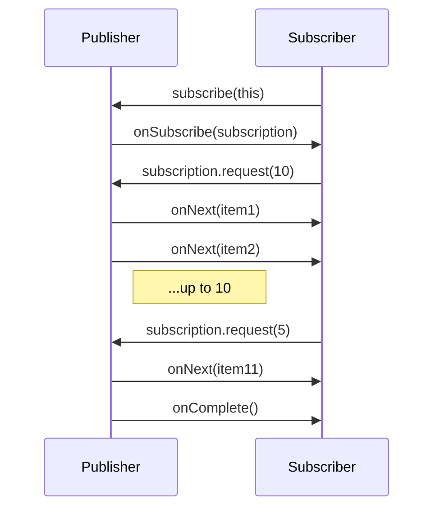
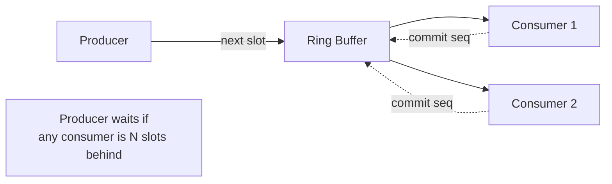

# Observer — Professional Level

> **Source:** [refactoring.guru/design-patterns/observer](https://refactoring.guru/design-patterns/observer)
> **Prerequisite:** [Senior](senior.md)

---

## Table of Contents

1. [Introduction](#introduction)
2. [LMAX Disruptor Internals](#lmax-disruptor-internals)
3. [Reactive Streams Spec](#reactive-streams-spec)
4. [Concurrency Internals — CopyOnWriteArrayList](#concurrency-internals--copyonwritearraylist)
5. [Memory Model and Visibility](#memory-model-and-visibility)
6. [Async Bus Performance](#async-bus-performance)
7. [Backpressure Strategies in Practice](#backpressure-strategies-in-practice)
8. [Kafka Consumer Performance](#kafka-consumer-performance)
9. [Hot vs Cold Observables](#hot-vs-cold-observables)
10. [Cross-Language Comparison](#cross-language-comparison)
11. [Microbenchmark Anatomy](#microbenchmark-anatomy)
12. [Diagrams](#diagrams)
13. [Related Topics](#related-topics)

---

## Introduction

An Observer at the professional level is examined for what the runtime does with it: how lock-free subscriber lists work, how reactive streams enforce backpressure, how the Disruptor achieves million-events-per-second throughput, and where the inevitable performance cliffs are.

For high-throughput systems — trading engines, real-time analytics, telemetry pipelines — the Observer machinery itself is the system's spine. This document quantifies it.

---

## LMAX Disruptor Internals

The LMAX Disruptor is a high-performance Observer-like dispatcher used in financial trading. Key insights:

### Ring buffer instead of queue

A bounded array of slots; producers and consumers track sequences. No allocation on the hot path.

```
[ slot0 | slot1 | slot2 | ... | slotN-1 ]
                  ↑producerSeq
   ↑consumerSeq
```

### Mechanical sympathy

- Power-of-two size → bitmask `idx & (size-1)` instead of modulo.
- Cache-line padding around volatile fields → no false sharing.
- Single-writer principle → producers serialize into the ring; consumers read.
- Multiple consumers track independent sequences; the slowest blocks the producer (backpressure built-in).

### Throughput

LMAX reported 6 million ops/sec on commodity hardware in 2010. Modern Disruptor implementations exceed 100M events/sec for simple events.

### Trade-off

Bounded — producer must block or drop when consumers lag. Designed for known-bounded latency systems, not arbitrary fan-out.

---

## Reactive Streams Spec

The Reactive Streams JVM spec (adopted by Reactor, RxJava 2+, Akka) standardizes async Observer with backpressure. Key contract:

```java
interface Publisher<T> {
    void subscribe(Subscriber<? super T> s);
}

interface Subscriber<T> {
    void onSubscribe(Subscription s);
    void onNext(T t);
    void onError(Throwable t);
    void onComplete();
}

interface Subscription {
    void request(long n);
    void cancel();
}
```

### Backpressure in action

The subscriber requests `n` items: `subscription.request(n)`. The publisher must NOT emit more than `n` until the subscriber requests more.

```java
flux.subscribe(new BaseSubscriber<Integer>() {
    @Override protected void hookOnSubscribe(Subscription s) { s.request(10); }
    @Override protected void hookOnNext(Integer i) {
        process(i);
        request(1);   // ask for one more
    }
});
```

### Why this matters

Without backpressure, a fast publisher and slow subscriber overflow memory. Reactive Streams makes the contract explicit and verifiable (TCK).

### Operators inherit the contract

`map`, `filter`, `flatMap` all propagate backpressure. `flatMap` can introduce concurrency that subverts strict order — designers must understand this.

---

## Concurrency Internals — CopyOnWriteArrayList

Java's go-to subscriber list:

```java
public boolean add(E e) {
    synchronized (lock) {
        Object[] elements = getArray();
        Object[] newElements = Arrays.copyOf(elements, elements.length + 1);
        newElements[elements.length] = e;
        setArray(newElements);
        return true;
    }
}

public Iterator<E> iterator() {
    return new COWIterator<>(getArray(), 0);
}
```

### Reads are lock-free

`getArray()` returns the current snapshot. Iterators are over the snapshot — never see in-flight mutations.

### Writes are O(n)

Each `add` allocates a new array and copies. For large subscriber sets that change often, expensive. For "read-mostly" subscriber lists (typical), perfect.

### Iteration during modification

```java
for (Listener l : listeners) {  // safe; iterator on old snapshot
    if (someCondition) listeners.add(newListener);  // mutates underlying; iterator unaffected
}
```

The iterator never throws `ConcurrentModificationException`. New subscribers added during iteration are not seen by that iteration — they appear in subsequent publishes.

### Memory cost

Doubles memory on each write (old + new array briefly). For thousands of subscribers, careful.

---

## Memory Model and Visibility

```java
class Bus {
    private List<Listener> listeners = new ArrayList<>();   // not volatile
    public synchronized void subscribe(Listener l) { listeners.add(l); }
    public void publish(Event e) {
        for (Listener l : listeners) l.on(e);   // visibility hazard
    }
}
```

### The hazard

Without synchronization on the publish path, the Java Memory Model doesn't guarantee that a subscription added by thread T1 is visible to thread T2 publishing.

### Fix 1: synchronize publish

```java
public synchronized void publish(Event e) { /* ... */ }
```

But now publishes serialize. Slow.

### Fix 2: volatile + immutable list

```java
private volatile List<Listener> listeners = List.of();

public void subscribe(Listener l) {
    synchronized (this) {
        var copy = new ArrayList<>(listeners);
        copy.add(l);
        listeners = List.copyOf(copy);   // publish under volatile write
    }
}

public void publish(Event e) {
    for (Listener l : listeners) l.on(e);   // volatile read → visibility OK
}
```

### Fix 3: CopyOnWriteArrayList

Effectively the same as Fix 2 with library help. Recommended.

---

## Async Bus Performance

### Single-threaded executor (ordering preserved)

```java
ExecutorService exec = Executors.newSingleThreadExecutor();
public void publish(Event e) {
    for (Listener l : listeners) exec.submit(() -> l.on(e));
}
```

Throughput limited to one core's processing. Ordering preserved across handlers and events.

### Fixed thread pool (parallel)

```java
ExecutorService exec = Executors.newFixedThreadPool(N);
```

Parallelism N. Ordering across handlers lost. Per-handler ordering depends on whether the same handler always lands on the same thread (it doesn't, by default).

### Per-handler executor (per-handler ordering)

```java
Map<Listener, ExecutorService> execs = new ConcurrentHashMap<>();

public void subscribe(Listener l) {
    listeners.add(l);
    execs.put(l, Executors.newSingleThreadExecutor());
}

public void publish(Event e) {
    for (Listener l : listeners) execs.get(l).submit(() -> l.on(e));
}
```

Each handler sees events in publish order. Different handlers can interleave. Common pattern.

### Latency vs throughput

Sync: low latency for first observer, total latency = sum.
Async (per-handler): higher latency for any one observer, total latency = max.

Async wins when observer count is high and observers are heavy.

---

## Backpressure Strategies in Practice

### Lossy: drop newest

```java
BlockingQueue<Event> q = new ArrayBlockingQueue<>(1000);
public void publish(Event e) {
    if (!q.offer(e)) {
        droppedCounter.increment();   // metric
        // newest dropped
    }
}
```

When latest matters most (sensors, status updates), often acceptable.

### Lossy: drop oldest

Reverse: keep newest, drop the oldest unprocessed.

```java
if (q.size() == capacity) q.poll();
q.offer(e);
```

For sliding-window analytics.

### Blocking: backpressure publisher

```java
q.put(e);   // blocks if full
```

Publisher slows naturally. Fine for in-process; awkward for external producers.

### Spill to disk

Kafka, Pulsar, NATS Jetstream. Memory bounded; disk durable. The right answer when throughput matters.

### Reactive Streams `request(n)`

Pull-based: subscribers tell publishers their capacity. Operators (Reactor, RxJava) propagate `request` upstream.

---

## Kafka Consumer Performance

### Single-partition consumer

One partition → one consumer thread. Throughput bounded by handler latency.

```java
poll → for each record: handle → commit
```

If handlers do I/O, throughput is `1 / latency`.

### Multi-partition / consumer group

```
Topic partitions: [p0, p1, p2, p3]
Consumer group:    [c0, c1, c2, c3]
Each consumer owns one partition.
```

Throughput scales linearly with partitions. Limit: number of partitions (typically 12-100 per topic).

### Idempotent consumers

Kafka delivers at-least-once. Consumer must handle duplicates. Common: `processed_ids` table or idempotency key.

### Commit strategies

- **Auto-commit**: simple, but can lose events on rebalance.
- **Manual commit per record**: durable, but latency overhead.
- **Manual commit per batch**: balance.

Most production: manual commit at end of batch processing.

### Backpressure

Consumer naturally backpressures: if `poll` is slow, the broker's offset advances slower; producer is unaffected (except topic disk usage).

---

## Hot vs Cold Observables

### Hot

Emits whether or not anyone subscribes. Live events: clicks, sensor readings, market ticks.

```java
PublishSubject<Event> hot = PublishSubject.create();
hot.onNext(e1);   // emitted; no subscriber sees it
hot.subscribe(...);   // subscribes from this point on
```

Late subscribers miss prior events.

### Cold

Emits only when subscribed. Each subscriber gets a fresh stream.

```java
Observable<Integer> cold = Observable.create(emitter -> {
    for (int i = 0; i < 10; i++) emitter.onNext(i);
});
```

Each `subscribe` triggers a fresh emission of 0..9.

### Implications

- **Hot** + many subscribers: same data delivered to all.
- **Cold** + many subscribers: data computed N times. Use `share()` or `publish().refCount()` to convert to hot.

### Replay

Buffered hot:

```java
ReplaySubject<Event> replay = ReplaySubject.create(100);   // buffer last 100
```

Late subscribers get the last 100. Memory cost vs late-arrival semantics.

---

## Cross-Language Comparison

| Language | Primary Observer Mechanism | Notes |
|---|---|---|
| **Java/JVM** | EventBus, Reactor, RxJava | CopyOnWriteArrayList common; reactive-streams TCK |
| **Kotlin** | Coroutines `Flow`, `SharedFlow` | Cold (Flow) and hot (SharedFlow) variants |
| **C#** | `event` keyword, IObservable, Rx.NET | Built-in language feature |
| **Go** | Channels (close + range) | Idiomatic Observer is `chan T`; closed channel signals end |
| **Rust** | `tokio::sync::broadcast`, `crossbeam` | Bounded broadcast channel |
| **Python** | `asyncio.Queue`, blinker, RxPY | Multiple ecosystem options |
| **JavaScript** | EventEmitter, RxJS, Observable proposal | DOM events; pervasive |
| **Swift** | Combine framework, Notifications | Native reactive |

### Key contrasts

- **Channels (Go)** vs callbacks: channels are unidirectional; receiver pulls. Backpressure is implicit (full channel blocks sender).
- **C# `event`** vs reactive: `event` is a multicast delegate; lighter than full reactive but no backpressure.
- **Coroutines `Flow`** vs RxJava: `Flow` integrates with structured concurrency; cancellation is automatic with the coroutine scope.

---

## Microbenchmark Anatomy

### Simple sync bus

```java
@State(Scope.Benchmark)
public class BusBench {
    Bus bus = new Bus();
    @Setup public void setup() {
        for (int i = 0; i < 10; i++) bus.subscribe(e -> {});
    }
    @Benchmark public void publish() { bus.publish(new Event()); }
}
```

Typical numbers (JDK 21, x86):
- Empty observer: ~50 ns total for 10 observers (5 ns each — vtable + tiny body).
- Observer doing trivial work: dominated by the work, not dispatch.

### Async bus with single thread

Same structure, with executor. Throughput limited by the single thread; latency per publish: ~µs (thread handoff).

### Disruptor

~100 ns per event with proper setup. Can saturate a CPU core at 10M events/sec.

### JMH pitfalls

- Forgetting `@State` → benchmarks recreate state each iteration.
- Constant inputs → JIT folds.
- No `Blackhole.consume()` → DCE removes the work.

---

## Diagrams

### Reactive Streams contract



### Disruptor



---

## Related Topics

- [Reactive streams spec](../../../infra/reactive.md)
- [Disruptor architecture](../../../infra/disruptor.md)
- [Kafka consumer tuning](../../../infra/kafka.md)
- [Backpressure patterns](../../../coding-principles/backpressure.md)
- [Memory model — happens-before](../../../performance/jmm.md)

[← Senior](senior.md) · [Interview →](interview.md)
