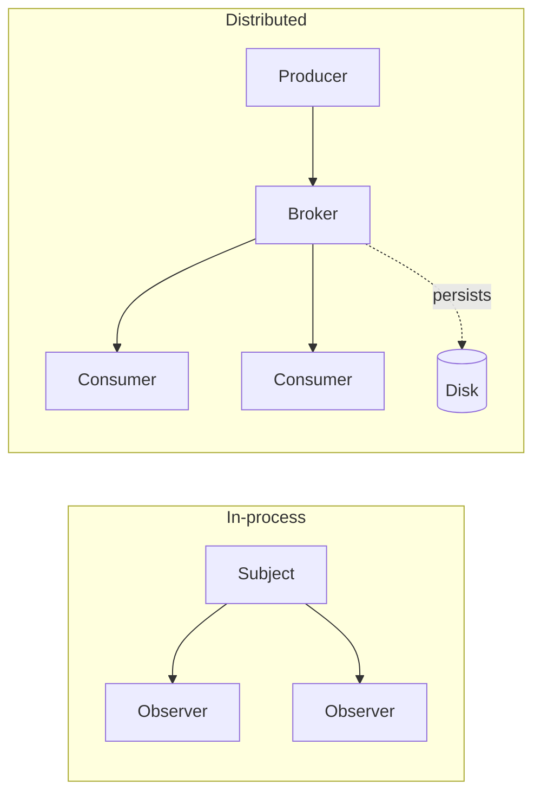
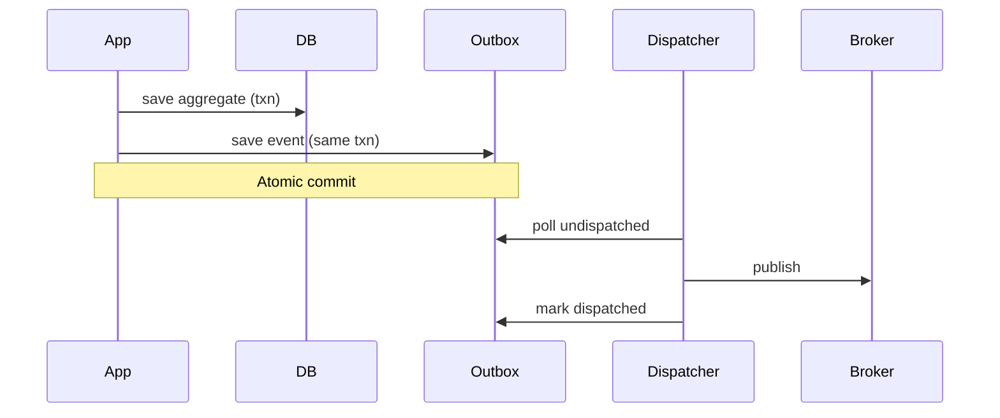

# Observer — Senior Level

> **Source:** [refactoring.guru/design-patterns/observer](https://refactoring.guru/design-patterns/observer)
> **Prerequisite:** [Middle](middle.md)

---

## Table of Contents

1. [Introduction](#introduction)
2. [Observer at Architectural Scale](#observer-at-architectural-scale)
3. [Backpressure and Flow Control](#backpressure-and-flow-control)
4. [Concurrency Deep Dive](#concurrency-deep-dive)
5. [Testability Strategies](#testability-strategies)
6. [When Observer Becomes a Problem](#when-observer-becomes-a-problem)
7. [Code Examples — Advanced](#code-examples--advanced)
8. [Real-World Architectures](#real-world-architectures)
9. [Pros & Cons at Scale](#pros--cons-at-scale)
10. [Trade-off Analysis Matrix](#trade-off-analysis-matrix)
11. [Migration Patterns](#migration-patterns)
12. [Diagrams](#diagrams)
13. [Related Topics](#related-topics)

---

## Introduction

> Focus: **At scale, what breaks? What earns its keep?**

In toy code Observer is "fire a callback." In production it is "every order event is consumed by 12 listeners across 5 services, with at-least-once delivery, retries, dead-letter queues, and audit trails." The senior question isn't "do I write Observer?" — it's **"in-process or distributed? sync or async? at-most-once or at-least-once? how do we trace cascades?"**

At scale Observer intersects with:

- **Domain events / event sourcing** — events as the source of truth.
- **Pub/Sub messaging** — Kafka, NATS, RabbitMQ, Pulsar.
- **Reactive streams** — Reactor, RxJava with backpressure.
- **WebSockets / SSE** — server-to-client live updates.
- **Database CDC** — Debezium streaming row changes as events.

Observer's principles apply but operational concerns dominate.

---

## Observer at Architectural Scale

### 1. Domain events in DDD

```java
class Order {
    private final List<DomainEvent> events = new ArrayList<>();

    public void place() {
        // ... business logic ...
        events.add(new OrderPlaced(this.id, this.total));
    }

    public List<DomainEvent> pullEvents() {
        var copy = List.copyOf(events);
        events.clear();
        return copy;
    }
}
```

Aggregates emit events. The repository / unit-of-work collects and dispatches them after transaction commit. Observer at the persistence boundary.

### 2. Kafka — durable Observer

A topic is the Subject; consumer groups are Observers. Difference: events are persisted, replayable, partitioned. At-least-once by default; idempotent consumers handle duplicates.

```
Producer → Topic → [Consumer Group A, Consumer Group B, ...]
```

Each consumer group reads independently. Same shape as Observer; very different durability.

### 3. WebSockets / SSE for live data

Server is the Subject; clients are Observers. Subscribe over a long-lived connection. Examples: stock tickers, chat, live dashboards.

```javascript
const stream = new EventSource('/orders/stream');
stream.addEventListener('order_placed', e => updateUI(JSON.parse(e.data)));
```

### 4. CDC (Change Data Capture)

The database is the Subject. CDC tools (Debezium, Maxwell) read the WAL and emit row changes as events. Downstream services subscribe. Useful for keeping caches, search indices, and read models in sync.

### 5. Reactive UI frameworks

React's `useState`, Vue's reactivity, Svelte's stores — all Observer underneath. Components subscribe to state slices and re-render on change. The framework hides the subscribe / unsubscribe.

### 6. Distributed tracing

Spans emit lifecycle events (start, end, error). Multiple observers consume: tracer (Zipkin, Jaeger), metrics (Prometheus exporter), logs. One span emission, many sinks.

---

## Backpressure and Flow Control

A fast publisher and slow observer is a recipe for OOM. In-memory queues fill; everything dies.

### Strategies

**1. Drop old events (lossy).**

```
Queue full → drop newest (or oldest). Useful when only the latest matters (sensors).
```

RxJava `onBackpressureLatest`, `onBackpressureDrop`.

**2. Block the publisher.**

```
Queue full → publisher blocks until space. Backpressure as flow control.
```

Kafka producer with `block.on.buffer.full=true`.

**3. Buffer with bounded size + spill.**

```
Queue → memory up to N → disk if exceeded.
```

Apache Kafka, Pulsar, NATS Jetstream all support this for durable observers.

**4. Reactive Streams contract.**

```java
subscriber.request(n);   // I can handle n more events
```

Reactor / RxJava propagate backpressure: subscribers tell publishers their capacity. The publisher only emits what's requested.

### When to add backpressure

Whenever observer rate is bounded but publisher rate is unbounded — sensor streams, file tails, log shippers, CDC. Synchronous Observer chains rarely need it; async ones do.

---

## Concurrency Deep Dive

### Lock-free subscriber list

`CopyOnWriteArrayList` (Java) — every `add` creates a new internal array; reads are lock-free. Tradeoff: writes are O(n). Good when reads (publishes) vastly outnumber writes (subscriptions).

```java
private final List<Listener> listeners = new CopyOnWriteArrayList<>();
```

### Atomic snapshot

```java
public void publish(Event e) {
    Listener[] snapshot = listeners.toArray(new Listener[0]);
    for (Listener l : snapshot) l.on(e);
}
```

Safer than direct iteration if the list is mutated mid-dispatch.

### Reentrant publish

```java
class Bus {
    private final ThreadLocal<Boolean> inDispatch = ThreadLocal.withInitial(() -> false);

    public void publish(Event e) {
        if (inDispatch.get()) {
            // log or queue for after current dispatch
            return;
        }
        inDispatch.set(true);
        try { /* dispatch */ } finally { inDispatch.set(false); }
    }
}
```

Detects re-entrant publishes. Either disallow or queue.

### Memory model

Subscribing thread T1 adds an observer. Publishing thread T2 publishes. Without synchronization, T2 might not see the new observer (visibility). `CopyOnWriteArrayList` provides happens-before guarantees; plain `ArrayList` doesn't.

### Async dispatch + ordering

If you want per-event ordering across observers, use a single executor, single thread per topic. Multiple threads = no ordering.

```java
ExecutorService perTopic = Executors.newSingleThreadExecutor();
```

For ordering only within an observer (across events for that observer), each observer gets its own single-thread executor.

---

## Testability Strategies

### Testing the Subject

```java
@Test void publishesToAllSubscribers() {
    Bus bus = new Bus();
    AtomicInteger count = new AtomicInteger();
    bus.subscribe(e -> count.incrementAndGet());
    bus.subscribe(e -> count.incrementAndGet());

    bus.publish(new Event());
    assertEquals(2, count.get());
}
```

### Testing observer behavior

Each observer is a unit. Test it with synthetic events; assert side effects.

```java
@Test void emailListenerSendsEmailOnOrder() {
    EmailService email = mock(EmailService.class);
    EmailListener l = new EmailListener(email);

    l.on(new OrderPlaced("o1"));

    verify(email).send(argThat(m -> m.subject().contains("o1")));
}
```

### Testing async chains

Use latches or test schedulers.

```java
@Test void asyncDispatchEventuallyDelivers() throws InterruptedException {
    AsyncBus bus = new AsyncBus(1);
    CountDownLatch latch = new CountDownLatch(1);
    bus.subscribe(Event.class, e -> latch.countDown());

    bus.publish(new Event());

    assertTrue(latch.await(1, TimeUnit.SECONDS));
}
```

### TestSubscriber for reactive streams

```java
TestSubscriber<Integer> ts = TestSubscriber.create();
flux.subscribe(ts);
ts.awaitTerminalEvent();
ts.assertNoErrors();
ts.assertValues(1, 2, 3);
```

Reactor's `StepVerifier` is the modern equivalent.

---

## When Observer Becomes a Problem

### 1. Untraceable cascades

A single publish triggers 12 listeners; each may publish more events. After 4 hops, no human can trace what's running.

**Fix:** central event log; correlation IDs propagated; structured tracing (OpenTelemetry).

### 2. Hidden ordering dependencies

Two listeners must run in a specific order; insertion order isn't reliable.

**Fix:** explicit sequencing — chain them, or one listener emits a follow-up event that the next subscribes to.

### 3. Re-entrant cycles

A publishes E → B subscribes, mutates state → state change publishes E → cycle.

**Fix:** detect with thread-local flag (above) or restructure as a state machine.

### 4. Subscribed forever

UI components mounted for the lifetime of the app, never unsubscribed → leak.

**Fix:** lifecycle hooks; weak references; leak detectors (LeakCanary on Android).

### 5. Thundering herd

A high-frequency event with many subscribers — each sync — saturates CPU.

**Fix:** debounce / throttle at the publisher; batch; switch to async.

### 6. Cross-aggregate consistency

Listener updates aggregate B based on aggregate A's event. If listener fails, state is inconsistent.

**Fix:** Outbox pattern — write event + state in same transaction; separate dispatcher reads outbox.

---

## Code Examples — Advanced

### A — Outbox pattern for at-least-once domain events

```java
@Transactional
public void placeOrder(Order o) {
    orderRepo.save(o);
    outboxRepo.save(new OutboxEntry(
        UUID.randomUUID(), "OrderPlaced",
        Json.encode(new OrderPlaced(o.id(), o.total()))
    ));
}

// Separate process:
@Scheduled(fixedDelay = 100)
public void drainOutbox() {
    for (var entry : outboxRepo.findUndispatched(100)) {
        try {
            kafka.send(entry.type(), entry.payload());
            outboxRepo.markDispatched(entry.id());
        } catch (Exception e) { /* will retry */ }
    }
}
```

Atomicity: state and event committed together. Dispatcher is independent and idempotent.

---

### B — Reactive backpressure (Reactor)

```java
Flux<Order> orders = orderSource()      // hot publisher
    .onBackpressureBuffer(1000, dropped -> log.warn("dropped {}", dropped))
    .publishOn(Schedulers.parallel());

orders.subscribe(o -> processSlowly(o));
```

Buffered up to 1000 events; overflow drops oldest with logging. Subscriber works on a parallel scheduler.

---

### C — Kafka consumer as Observer

```java
@KafkaListener(topics = "orders", groupId = "email-svc")
public void on(OrderPlaced event) {
    sendEmail(event.orderId());
}
```

Spring's annotation hides the subscribe loop. Under the hood: poll, dispatch, commit offset. At-least-once; idempotent handler required.

---

### D — Bounded async bus with ring buffer (Disruptor-style)

```java
public final class RingBufferBus<T> {
    private final T[] buffer;
    private final long mask;
    private long writeSeq = 0;
    private final List<Consumer<T>> subscribers = new CopyOnWriteArrayList<>();

    @SuppressWarnings("unchecked")
    public RingBufferBus(int size) {
        if (Integer.bitCount(size) != 1) throw new IllegalArgumentException("power of 2");
        this.buffer = (T[]) new Object[size];
        this.mask = size - 1;
    }

    public synchronized void publish(T event) {
        buffer[(int) (writeSeq & mask)] = event;
        writeSeq++;
        // dispatch to subscribers; each tracks its own read seq
    }
}
```

LMAX Disruptor scales Observer to millions of events/sec. Used in trading and matching engines.

---

## Real-World Architectures

### Stripe — webhook delivery

Customer subscribes a URL. Stripe is Subject; webhook URL is Observer. Persistent retries, signature verification, dead-letter for permanent failures. Observer at ecosystem scale.

### Slack — real-time messaging

WebSocket Subject (Slack server) → Observer (each connected client). Uses pub/sub internally to fan out to many connections.

### GitHub — webhooks for repo events

Push, PR, issue created — events. Subscribers configured per repo. At-least-once semantics; payload signed.

### React fiber — reconciliation

State is the Subject; rendered components are Observers. The framework decides which to re-render based on diffs.

---

## Pros & Cons at Scale

| Pros | Cons |
|---|---|
| Add subscribers without modifying producers | Tracing what fired is harder |
| Cross-cutting concerns (audit, metrics) become subscribers | Cascades can be deep and confusing |
| Naturally distributable (Pub/Sub) | At-least-once delivery requires idempotent handlers |
| Fits domain events / event sourcing cleanly | Outbox pattern needed for consistency |
| Composable via reactive operators | Backpressure must be designed |
| Decouples deploys (subscribers ship independently) | Schema evolution across producers/consumers requires discipline |

---

## Trade-off Analysis Matrix

| Dimension | In-process Observer | In-process async bus | Pub/Sub (Kafka) |
|---|---|---|---|
| **Latency** | µs | ms | ~1-50ms (network) |
| **Durability** | None | None | Persistent |
| **Order** | FIFO per publisher | Per-handler-thread | Per-partition |
| **Failure handling** | Try/catch | Per-task try/catch | Retries + DLQ |
| **Cross-process** | No | No | Yes |
| **Replay** | No | No | Yes (rewind offset) |
| **Operational cost** | Zero | Low | Medium-high |

---

## Migration Patterns

### From direct calls to Observer

1. Identify the trigger (state change).
2. Define the event type.
3. Replace direct calls with `bus.publish(event)`.
4. Add subscribers in each affected service.
5. Test cascade: publish → all subscribers ran.

### From in-process Observer to Pub/Sub

1. Continue publishing in-process events as today.
2. Add a bridge subscriber that publishes to the broker.
3. Stand up new external subscribers consuming from the broker.
4. Decommission in-process subscribers as external ones take over.
5. Or run both during transition; prefer external once stable.

### Schema evolution

- **Add fields**: safe (consumers ignore unknown).
- **Remove fields**: deprecate first; remove after consumers update.
- **Rename**: dual-publish old and new for a transition period.
- **Versioning**: include `version` in payload; consumers branch.

---

## Diagrams

### In-process vs distributed Observer



### Outbox pattern



---

## Related Topics

- [Mediator](../04-mediator/senior.md) — many-to-many
- [Pub/Sub](../../../infra/pubsub.md)
- [Reactive streams](../../../infra/reactive.md)
- [Event sourcing](../../../coding-principles/event-sourcing.md)
- [Outbox pattern](../../../coding-principles/outbox.md)
- [CDC](../../../infra/cdc.md)

[← Middle](middle.md) · [Professional →](professional.md)
