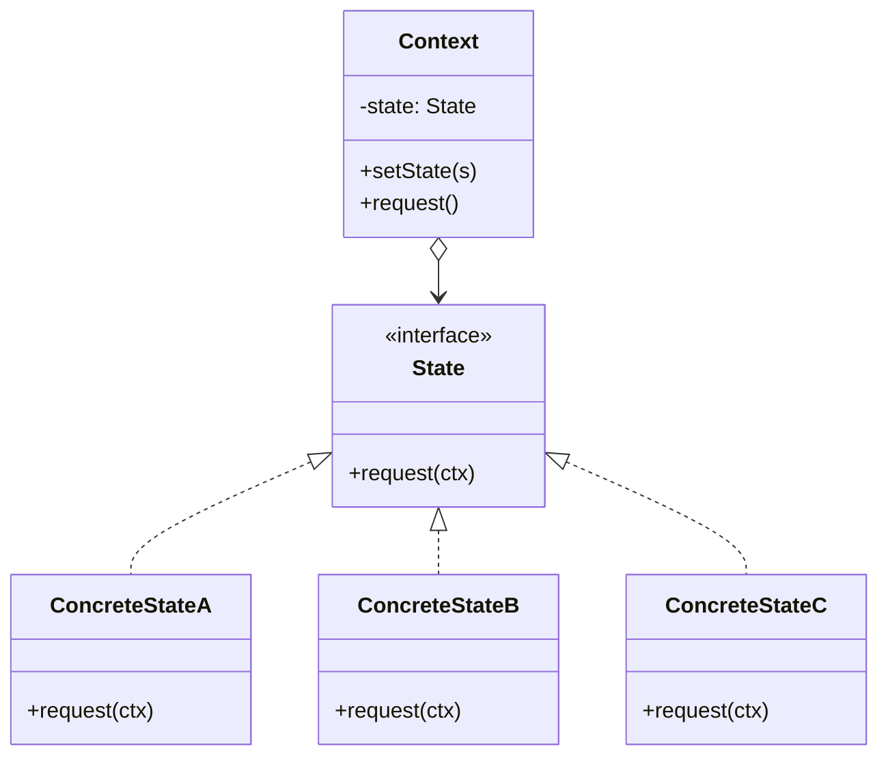
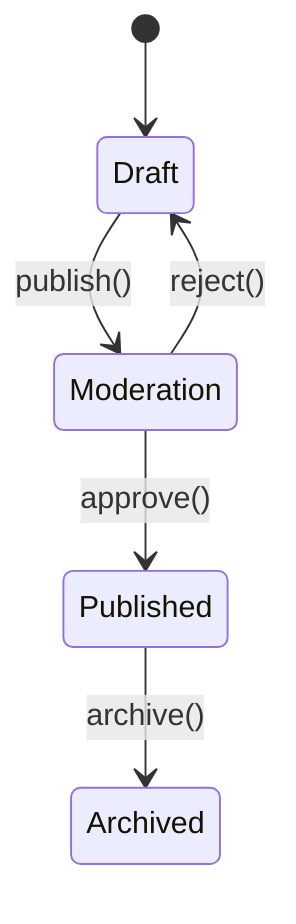

# State — Junior Level

> **Source:** [refactoring.guru/design-patterns/state](https://refactoring.guru/design-patterns/state)
> **Category:** [Behavioral](../README.md) — *"Concerned with algorithms and the assignment of responsibilities between objects."*

---

## Table of Contents

1. [Introduction](#introduction)
2. [Prerequisites](#prerequisites)
3. [Glossary](#glossary)
4. [Core Concepts](#core-concepts)
5. [Real-World Analogies](#real-world-analogies)
6. [Mental Models](#mental-models)
7. [Pros & Cons](#pros--cons)
8. [Use Cases](#use-cases)
9. [Code Examples](#code-examples)
10. [Coding Patterns](#coding-patterns)
11. [Clean Code](#clean-code)
12. [Best Practices](#best-practices)
13. [Edge Cases & Pitfalls](#edge-cases--pitfalls)
14. [Common Mistakes](#common-mistakes)
15. [Tricky Points](#tricky-points)
16. [Test Yourself](#test-yourself)
17. [Tricky Questions](#tricky-questions)
18. [Cheat Sheet](#cheat-sheet)
19. [Summary](#summary)
20. [What You Can Build](#what-you-can-build)
21. [Further Reading](#further-reading)
22. [Related Topics](#related-topics)
23. [Diagrams & Visual Aids](#diagrams--visual-aids)

---

## Introduction

> Focus: **What is it?** and **How to use it?**

**State** is a behavioral design pattern that lets an object change its behavior **when its internal state changes**. It looks as if the object switches its class. Instead of one class with a giant `switch (currentMode)` in every method, you have one class per state, and the object delegates to whichever state it currently holds.

Imagine a vending machine. In the `Idle` state, pressing buttons does nothing. In the `Selecting` state, button presses register. In the `Dispensing` state, the machine ignores selections and releases the product. The same physical machine behaves differently because of its internal mode. Without State, the code is `if (mode == "idle") { ... } else if (mode == "selecting") { ... }` in every method — fragile, repetitive, hard to extend.

In one sentence: *"Replace state-dependent `switch` chains with polymorphic state objects."*

State is the canonical pattern for finite state machines (FSMs): TCP connections, UI workflows, document approval, game characters (idle / running / jumping), wizard forms. Anywhere you find "the object behaves differently depending on its mode," State is asking to be born.

---

## Prerequisites

What you should know before reading this:

- **Required:** Basic OOP — interfaces, classes, polymorphism.
- **Required:** Composition. The Context holds a State object.
- **Helpful:** Some familiarity with finite state machines — State is the OOP version.
- **Helpful:** A taste of *why* `switch (mode)` rots over time — State is the cure.

---

## Glossary

| Term | Definition |
|------|-----------|
| **Context** | The object whose behavior depends on state. Holds a reference to a State object. |
| **State** | The interface (or abstract class) declaring methods that vary per state. |
| **Concrete State** | A specific implementation of State. Encapsulates one mode of behavior. |
| **Transition** | Change from one State to another. Triggered by an event or condition. |
| **Self-transition** | A state transitions to itself (often a no-op or reset). |
| **Initial state** | The state the Context starts in. |
| **Terminal state** | A state with no outgoing transitions. The end of the FSM. |

---

## Core Concepts

### 1. The Context Has a Current State

The Context holds a reference to one State at a time.

```java
class Document {
    private DocumentState state = new Draft();
    public void setState(DocumentState s) { this.state = s; }
    public void publish() { state.publish(this); }
}
```

### 2. Methods Delegate to State

Each method on the Context that varies by state delegates to the State object.

```java
public void publish() { state.publish(this); }
public void approve() { state.approve(this); }
```

### 3. States Encapsulate State-Specific Logic

Each Concrete State implements the methods for its mode. Other states don't know about it.

```java
class Draft implements DocumentState {
    public void publish(Document d) { d.setState(new Moderation()); }
    public void approve(Document d) { /* nothing — drafts can't be approved */ }
}

class Moderation implements DocumentState {
    public void publish(Document d) { /* already in moderation */ }
    public void approve(Document d) { d.setState(new Published()); }
}
```

### 4. State Decides Transitions

Most commonly, the State itself triggers the transition by calling `context.setState(...)`. Less commonly, the Context decides.

### 5. Distinct from Strategy

**Strategy** is picked by the *caller*. The Context's behavior doesn't depend on internal state — the user chose an algorithm. **State** is decided by the *Context's own state*. Behavior emerges from the Context's history, not the caller's choice.

---

## Real-World Analogies

| Concept | Analogy |
|---------|--------|
| **Context** | A traffic light. |
| **State** | The current color (red / yellow / green). |
| **Transition** | A timer fires; light changes. |
| **Concrete State** | "Red" knows what to do when the timer fires (turn green); "green" knows when to turn yellow. |

The classical refactoring.guru analogy is a **vending machine**: same buttons, different responses depending on the machine's mode (idle, accepting coins, selecting, dispensing). The mode is the State.

Another good one is **video player**: play / pause / stopped / buffering. Pressing the play button does different things depending on the current state.

---

## Mental Models

**The intuition:** Picture the Context as a person and States as masks. The person's behavior depends on which mask they're wearing. Putting on a different mask changes everything — voice, gestures, what they say. The person is the same; the mask drives behavior.

**Why this model helps:** It makes the *delegation* explicit. The Context doesn't have the logic; the current State does. Switching states is putting on a new mask.

**Visualization:**

```
         Context
       ┌────────────┐
       │ state ─────┼──► Concrete State A
       │            │       (handles current mode)
       │ method() ──┼─delegates──► state.method()
       └────────────┘
                            ↓ on transition
                       Concrete State B
                       (next mode)
```

The Context "becomes" different by swapping its state.

---

## Pros & Cons

| Pros | Cons |
|------|------|
| Replaces tangled `switch` chains with polymorphism | One class per state — more files |
| New states added without modifying existing ones | Transition logic spread across states |
| Each state's logic isolated and testable | Object identity vs state identity confusion |
| Open/Closed: behavior extensions are local | Sometimes overkill for 2-state machines |
| Maps cleanly to formal FSMs | State explosion if not careful |

### When to use:
- Behavior depends on the object's mode and changes at runtime
- A single class has a `switch (mode)` in many methods
- Transitions are non-trivial (preconditions, side effects, validations)
- You want to model a finite state machine cleanly
- Adding new states is expected over time

### When NOT to use:
- Two states with one boolean field — `if/else` is simpler
- States that share so much logic that polymorphism doesn't help
- Performance-critical code where state dispatch overhead matters
- The "modes" are independent algorithms picked by callers — that's Strategy

---

## Use Cases

Real-world places where State is commonly applied:

- **Document workflows** — Draft → Moderation → Published → Archived.
- **Order lifecycles** — Pending → Paid → Shipped → Delivered.
- **TCP connection** — CLOSED → LISTEN → SYN_RECEIVED → ESTABLISHED → ...
- **Game character behavior** — Idle / Running / Jumping / Falling.
- **Vending machines / ATMs** — finite mode machines.
- **Video / audio players** — Playing / Paused / Stopped / Buffering.
- **Wizard forms** — Step 1 → Step 2 → Step 3 (with branching).
- **Authentication** — Anonymous → Authenticating → Authenticated → Locked.
- **Subscription billing** — Trial → Active → Paused → Cancelled.

---

## Code Examples

### Go

A simple traffic light.

```go
package main

import "fmt"

type Light interface {
	Tick(*TrafficLight)
	Color() string
}

// Concrete States.
type Red struct{}

func (Red) Tick(tl *TrafficLight) { tl.SetState(Green{}) }
func (Red) Color() string         { return "red" }

type Green struct{}

func (Green) Tick(tl *TrafficLight) { tl.SetState(Yellow{}) }
func (Green) Color() string         { return "green" }

type Yellow struct{}

func (Yellow) Tick(tl *TrafficLight) { tl.SetState(Red{}) }
func (Yellow) Color() string         { return "yellow" }

// Context.
type TrafficLight struct {
	state Light
}

func NewTrafficLight() *TrafficLight    { return &TrafficLight{state: Red{}} }
func (tl *TrafficLight) SetState(s Light) { tl.state = s }
func (tl *TrafficLight) Tick()             { tl.state.Tick(tl) }
func (tl *TrafficLight) Color() string    { return tl.state.Color() }

func main() {
	tl := NewTrafficLight()
	for i := 0; i < 6; i++ {
		fmt.Println(tl.Color())
		tl.Tick()
	}
}
```

**What it does:** Each state knows the next state. `Tick()` triggers the transition.

**How to run:** `go run main.go`

---

### Java

A document workflow.

```java
public interface DocumentState {
    void publish(Document doc);
    void approve(Document doc);
    String name();
}

public final class Draft implements DocumentState {
    public void publish(Document doc) { doc.setState(new Moderation()); }
    public void approve(Document doc) { System.out.println("can't approve a draft"); }
    public String name() { return "draft"; }
}

public final class Moderation implements DocumentState {
    public void publish(Document doc) { System.out.println("already in moderation"); }
    public void approve(Document doc) { doc.setState(new Published()); }
    public String name() { return "moderation"; }
}

public final class Published implements DocumentState {
    public void publish(Document doc) { System.out.println("already published"); }
    public void approve(Document doc) { System.out.println("already approved"); }
    public String name() { return "published"; }
}

public final class Document {
    private DocumentState state = new Draft();
    public void setState(DocumentState s) { this.state = s; }
    public void publish() { state.publish(this); }
    public void approve() { state.approve(this); }
    public String state() { return state.name(); }
}

class Demo {
    public static void main(String[] args) {
        Document d = new Document();
        System.out.println(d.state());   // draft
        d.publish();                     // → moderation
        System.out.println(d.state());   // moderation
        d.approve();                     // → published
        System.out.println(d.state());   // published
    }
}
```

**What it does:** Each state implements only the transitions it allows; invalid transitions are ignored or warned.

**How to run:** `javac *.java && java Demo`

---

### Python

A media player.

```python
from typing import Protocol


class State(Protocol):
    def play(self, ctx: "Player") -> None: ...
    def pause(self, ctx: "Player") -> None: ...
    def stop(self, ctx: "Player") -> None: ...
    def name(self) -> str: ...


class Stopped:
    def play(self, ctx: "Player") -> None:
        print("starting playback")
        ctx.set_state(Playing())
    def pause(self, ctx: "Player") -> None:
        print("can't pause when stopped")
    def stop(self, ctx: "Player") -> None:
        print("already stopped")
    def name(self) -> str: return "stopped"


class Playing:
    def play(self, ctx: "Player") -> None: print("already playing")
    def pause(self, ctx: "Player") -> None:
        print("pausing")
        ctx.set_state(Paused())
    def stop(self, ctx: "Player") -> None:
        print("stopping")
        ctx.set_state(Stopped())
    def name(self) -> str: return "playing"


class Paused:
    def play(self, ctx: "Player") -> None:
        print("resuming")
        ctx.set_state(Playing())
    def pause(self, ctx: "Player") -> None: print("already paused")
    def stop(self, ctx: "Player") -> None:
        print("stopping")
        ctx.set_state(Stopped())
    def name(self) -> str: return "paused"


class Player:
    def __init__(self) -> None:
        self._state: State = Stopped()

    def set_state(self, s: State) -> None:
        self._state = s

    def play(self) -> None: self._state.play(self)
    def pause(self) -> None: self._state.pause(self)
    def stop(self) -> None: self._state.stop(self)
    def state(self) -> str: return self._state.name()


if __name__ == "__main__":
    p = Player()
    p.play()    # starting playback
    p.pause()   # pausing
    p.play()    # resuming
    p.stop()    # stopping
```

**What it does:** Each state defines what `play` / `pause` / `stop` mean for that mode.

**How to run:** `python3 main.py`

---

## Coding Patterns

### Pattern 1: State Decides Transitions

**Intent:** Each Concrete State changes the Context's state when its method is called.

```java
class Draft {
    public void publish(Document d) { d.setState(new Moderation()); }
}
```

**Pros:** Encapsulated; each state owns its transitions.
**Cons:** States know about other states (forward dependency).

**When:** Most cases. Standard Concrete State pattern.

---

### Pattern 2: Context Decides Transitions

**Intent:** State methods return a "next state" or "no transition"; Context applies it.

```java
public void publish() {
    DocumentState next = state.publish();
    if (next != null) state = next;
}
```

**Pros:** States don't reference each other.
**Cons:** Context has more logic.

**When:** Many states; reducing coupling between them.

---

### Pattern 3: State as Enum + `switch`

**Intent:** Lightweight FSM without classes.

```java
enum DocumentState {
    DRAFT { public DocumentState publish() { return MODERATION; } },
    MODERATION { public DocumentState publish() { return MODERATION; } };
    public abstract DocumentState publish();
}
```

**When:** Small FSM, no per-state state, language supports method-rich enums (Java).

---

### Pattern 4: Hierarchical State (substates)

**Intent:** Some states share behavior; structure them as parent/child.

```
Active
├── Playing
└── Paused
Stopped
```

**When:** Complex FSMs; reduces duplication.

---

## Clean Code

- **Name states by their mode**, not their implementation. `Idle`, `Playing`, not `State1`, `State2`.
- **One state per file** (in Java) — easier navigation.
- **Document the FSM diagram somewhere.** A picture beats hunting through code.
- **States don't share mutable state.** They share the Context (read-only or via setters).
- **Transitions are explicit.** No hidden side effects in unrelated methods.

---

## Best Practices

- **Make states stateless when possible.** They handle method calls; transitions are pointer swaps.
- **Use a single instance per state class** (singleton) if states are stateless.
- **Validate transitions.** Don't allow `Published → Draft` if it's invalid.
- **Test each state in isolation** with a stub Context.
- **Map your FSM to a diagram.** PlantUML or Mermaid; keep it next to the code.
- **Beware "do nothing" states.** If most methods are no-ops, maybe the FSM has too many states.

---

## Edge Cases & Pitfalls

- **Transition during transition.** State A's method triggers a transition to B; B's constructor runs side effects that... loop? Watch for cycles.
- **Re-entrant calls.** If a State calls back into the Context's method, you may re-enter the same method on a different state. Confusing.
- **Sharing state between states.** Each Concrete State has its own data; the Context has shared data. Don't mix.
- **Forgetting to set initial state.** Null pointer on first method call.
- **Equality of state objects.** If you cache states, ensure equality is reference-based (same object) or carefully implemented.
- **Concurrency.** State transitions in multi-threaded code need synchronization or atomic references.

---

## Common Mistakes

1. **`switch (state)` left in the Context.** That's the antipattern State replaces.
2. **States with mutable state that should be in Context.** Migrating between states loses the data.
3. **Forgetting to handle invalid transitions.** Silent state corruption.
4. **State explosion.** 50 states for a simple workflow — refactor with hierarchy or substates.
5. **Allocating new state objects every transition** when stateless states could be singletons.
6. **Mixing Strategy and State.** Different intents.
7. **State changes that other states don't expect.** Defensive checks ("am I in the right state?") in random methods.

---

## Tricky Points

### State vs Strategy

| | State | Strategy |
|---|---|---|
| **Decides switch** | Object itself or current state | Caller / client |
| **Aware of others** | States may know transitions | Strategies don't know each other |
| **Use case** | State machine | Pluggable algorithm |
| **Caller knows** | Just calls methods; transitions hidden | Picks the strategy explicitly |

### State vs Mediator

State centralizes mode-dependent behavior of *one object*. Mediator centralizes interactions among *many objects*. Different scope.

### State vs Command

Command represents an action; State represents a mode. A Command's behavior depends on data; a State's behavior is the polymorphic dispatch.

### Allocation per transition

Every `setState(new SomeState())` allocates. For high-frequency transitions, use singletons:

```java
public static final SomeState INSTANCE = new SomeState();
context.setState(SomeState.INSTANCE);
```

### Hierarchical / nested states

Some FSMs have substates. "Active" can be subdivided into "Playing" or "Paused"; both are "Active." Implement via inheritance or composition.

---

## Test Yourself

1. What problem does the State pattern solve?
2. Who triggers transitions: the State or the Context?
3. What's the difference between State and Strategy?
4. Give 5 real-world examples of State.
5. Why is allocating a new state per transition wasteful?
6. What happens if you call a method invalid for the current state?

---

## Tricky Questions

- **Q: If states are singletons, can they hold state-specific data?**
  A: Not safely. Per-instance data must live in the Context, not the State. Singleton states must be stateless.
- **Q: What if the FSM has 20 states with subtle differences?**
  A: Look for hierarchy. Common behavior in a base class; specific overrides in concrete states. Or: Strategy + State combo.
- **Q: Is State just a `switch` in disguise?**
  A: Polymorphic dispatch instead of `switch`. Compiler enforces exhaustiveness via interface; refactoring tools work; new states extend without modifying existing.
- **Q: When does Strategy bleed into State?**
  A: When the strategy chosen depends on the object's history or current mode, not on caller intent. Then it's State.

---

## Cheat Sheet

| Concept | One-liner |
|---|---|
| Intent | Object behavior changes with internal state |
| Roles | Context (holds state), State interface, Concrete States |
| Hot loop | `state.method(this)` — Context delegates |
| Sibling | Strategy (caller picks), Mediator (many objects) |
| Modern form | Sealed types / discriminated unions in Kotlin/TS/Rust |
| Smell to fix | `switch (mode)` in many methods |

---

## Summary

State turns mode-dependent behavior into polymorphism. Each Concrete State encapsulates one mode; the Context delegates; transitions swap the state. Adding a new mode = a new class, with no changes to existing code.

Three things to remember:
1. **Context delegates to State.**
2. **Transitions swap the State.**
3. **One class per state.**

If you find yourself writing `if (mode == "x") ...` in five different methods, State is asking to be born.

---

## What You Can Build

- A document workflow with Draft / Moderation / Published / Archived
- A vending machine with Idle / Selecting / Dispensing / OutOfStock
- A media player with Playing / Paused / Stopped / Buffering
- A subscription with Trial / Active / Paused / Cancelled
- A TCP connection state machine
- A game character with Idle / Running / Jumping / Falling

---

## Further Reading

- *Design Patterns: Elements of Reusable Object-Oriented Software* (GoF) — original State chapter
- *Practical UML Statecharts in C/C++* — Miro Samek
- [refactoring.guru — State](https://refactoring.guru/design-patterns/state)
- [XState (statecharts library)](https://xstate.js.org)

---

## Related Topics

- [Strategy](../08-strategy/junior.md) — sibling pattern, different decision-maker
- [Mediator](../04-mediator/junior.md) — coordinates objects, not states
- [Memento](../05-memento/junior.md) — captures state snapshots
- [Command](../02-command/junior.md) — actions vs modes
- [Statecharts / Hierarchical FSMs](../../../coding-principles/statecharts.md)

---

## Diagrams & Visual Aids

### Class diagram



### Document workflow FSM



### Decision flow

```
              ┌─────────────────────────┐
              │ Object's behavior       │
              │ depends on internal mode?│
              └──────────┬──────────────┘
                         │ yes
                         ▼
              ┌─────────────────────────┐
              │ Modes change at runtime?│
              └──────────┬──────────────┘
                         │ yes
                         ▼
              ┌─────────────────────────┐
              │ Many switch (mode)      │
              │ scattered across methods?│
              └──────────┬──────────────┘
                         │ yes
                         ▼
                   ──> Use State
```

[← Back to Behavioral Patterns](../README.md) · [Middle →](middle.md)
