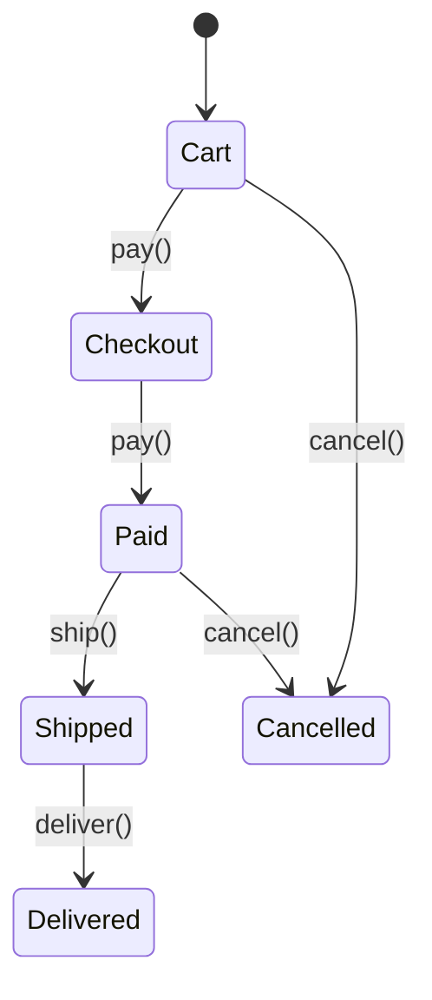
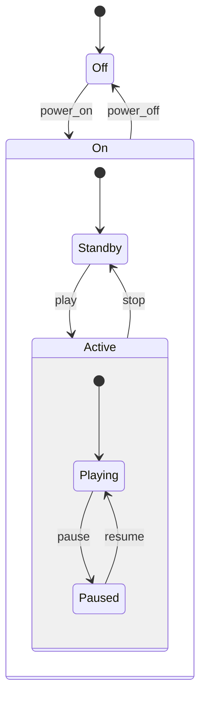

# State — Middle Level

> **Source:** [refactoring.guru/design-patterns/state](https://refactoring.guru/design-patterns/state)
> **Prerequisite:** [Junior](junior.md)

---

## Table of Contents

1. [Introduction](#introduction)
2. [When to Use State](#when-to-use-state)
3. [When NOT to Use State](#when-not-to-use-state)
4. [Real-World Cases](#real-world-cases)
5. [Code Examples — Production-Grade](#code-examples--production-grade)
6. [Transition Tables vs Object Dispatch](#transition-tables-vs-object-dispatch)
7. [Hierarchical State Machines](#hierarchical-state-machines)
8. [Trade-offs](#trade-offs)
9. [Alternatives Comparison](#alternatives-comparison)
10. [Refactoring to State](#refactoring-to-state)
11. [Pros & Cons (Deeper)](#pros--cons-deeper)
12. [Edge Cases](#edge-cases)
13. [Tricky Points](#tricky-points)
14. [Best Practices](#best-practices)
15. [Tasks (Practice)](#tasks-practice)
16. [Summary](#summary)
17. [Related Topics](#related-topics)
18. [Diagrams](#diagrams)

---

## Introduction

> Focus: **When to use it?** and **Why?**

You already know State is "object's behavior depends on its mode." At the middle level the harder questions are:

- **Object dispatch or transition table?** Each has trade-offs.
- **States as classes, enums, or sealed types?** Language-dependent.
- **Where does shared state live?** In the Context, not the States.
- **Hierarchical (substates)?** When states share behavior.
- **Persistence?** How to save / restore the FSM's mode.

This document focuses on **decisions and patterns** that turn textbook State into something that survives a year of production.

---

## When to Use State

Use State when **all** of these are true:

1. **The object has a finite set of modes.** Each with distinct behavior.
2. **Methods have `switch (mode)`-style logic in many places.** State centralizes it.
3. **Transitions are non-trivial.** Validations, side effects, or hooks make Boolean flags painful.
4. **You expect to add more states.** Open/Closed encourages State.
5. **Each state's logic is cohesive.** State methods share data and behavior.

If most are missing, look elsewhere first.

### Triggers

- "If `status == 'active'` repeats in 8 methods." → State.
- "Order goes through Pending → Paid → Shipped → Delivered." → State.
- "Game character behaves differently while jumping vs running." → State.
- "Wizard form has multiple steps with branching." → State.
- "Subscription has trial / active / cancelled / paused." → State.

---

## When NOT to Use State

- **Two states with one boolean.** `if (active) ... else ...` is simpler.
- **States share so much logic that polymorphism doesn't help.** Maybe one method with parameters.
- **Performance-critical code where dispatch overhead matters.** Rare; usually invisible.
- **The "modes" are independent algorithms picked by callers.** That's Strategy.
- **Tiny FSM that won't grow.** Enum + switch is fine.

### Smell: god-state

One Concrete State implements 30 methods, each branching on sub-conditions. That's not a State — that's the whole class wearing a State costume. Refactor: split into substates or simplify the FSM.

---

## Real-World Cases

### Case 1 — TCP connection state machine

`CLOSED → LISTEN → SYN_RECEIVED → ESTABLISHED → ... → CLOSED`

Each state's behavior on `recv`, `send`, `close` is defined by the TCP RFC. State pattern at OS-kernel scale.

### Case 2 — Stripe Payment Intent

```
requires_payment_method → requires_confirmation → processing → succeeded
                                                              ↘ requires_action
                                                              ↘ canceled
```

Each state allows specific operations. Stripe's API documents the FSM transitions.

### Case 3 — Document workflow

Draft → Pending Review → Approved → Published → Archived. Editorial pipelines, content management systems. State pattern with custom validations per transition.

### Case 4 — Order lifecycle

Cart → Checkout → Paid → Shipped → Delivered. Branches: Refunded, Cancelled. Industry standard for e-commerce.

### Case 5 — UI wizards

Multi-step form. Each step is a State; "Next" / "Back" buttons trigger transitions. Some steps may be conditional ("if user is enterprise, show this step").

### Case 6 — Game character AI

Idle → Patrolling → Chasing → Attacking → Fleeing. Each state has its own update logic, animations, and transition triggers.

### Case 7 — Subscription billing

Trial → Active → Past Due → Cancelled. Some transitions auto (trial expires); some manual (user cancels).

---

## Code Examples — Production-Grade

### Example A — Order lifecycle with validation (Java)

```java
public sealed interface OrderState permits Cart, Checkout, Paid, Shipped, Delivered, Cancelled {
    default void pay(Order o) { throw new IllegalStateException("can't pay in " + this.getClass().getSimpleName()); }
    default void ship(Order o) { throw new IllegalStateException("can't ship in " + this.getClass().getSimpleName()); }
    default void deliver(Order o) { throw new IllegalStateException("can't deliver in " + this.getClass().getSimpleName()); }
    default void cancel(Order o) { throw new IllegalStateException("can't cancel in " + this.getClass().getSimpleName()); }
}

public final class Cart implements OrderState {
    public void pay(Order o) { o.setState(new Checkout()); }
    public void cancel(Order o) { o.setState(new Cancelled()); }
}

public final class Checkout implements OrderState {
    public void pay(Order o) { o.setState(new Paid()); }
    public void cancel(Order o) { o.setState(new Cancelled()); }
}

public final class Paid implements OrderState {
    public void ship(Order o) { o.setState(new Shipped()); }
    public void cancel(Order o) { o.setState(new Cancelled()); /* refund logic */ }
}

public final class Shipped implements OrderState {
    public void deliver(Order o) { o.setState(new Delivered()); }
}

public final class Delivered implements OrderState {}
public final class Cancelled implements OrderState {}

public final class Order {
    private OrderState state = new Cart();
    public void setState(OrderState s) { this.state = s; }
    public void pay() { state.pay(this); }
    public void ship() { state.ship(this); }
    public void deliver() { state.deliver(this); }
    public void cancel() { state.cancel(this); }
}
```

Sealed interface (Java 17+): only the listed implementations are allowed. Compile-time exhaustiveness for switches.

---

### Example B — Transition table (Python)

```python
from enum import Enum, auto


class State(Enum):
    DRAFT = auto()
    MODERATION = auto()
    PUBLISHED = auto()
    ARCHIVED = auto()


class Event(Enum):
    PUBLISH = auto()
    APPROVE = auto()
    ARCHIVE = auto()


# transition table: (current_state, event) → next_state
TRANSITIONS: dict[tuple[State, Event], State] = {
    (State.DRAFT, Event.PUBLISH): State.MODERATION,
    (State.MODERATION, Event.APPROVE): State.PUBLISHED,
    (State.PUBLISHED, Event.ARCHIVE): State.ARCHIVED,
}


class Document:
    def __init__(self) -> None:
        self.state = State.DRAFT

    def fire(self, event: Event) -> None:
        key = (self.state, event)
        if key not in TRANSITIONS:
            raise ValueError(f"can't fire {event} in {self.state}")
        self.state = TRANSITIONS[key]


doc = Document()
doc.fire(Event.PUBLISH)
print(doc.state)   # State.MODERATION
doc.fire(Event.APPROVE)
print(doc.state)   # State.PUBLISHED
```

Lightweight; no per-state classes. Good for simple FSMs.

---

### Example C — Singleton state instances (Java)

```java
public final class TrafficLight {
    public static final TrafficLight RED = new TrafficLight("red");
    public static final TrafficLight GREEN = new TrafficLight("green");
    public static final TrafficLight YELLOW = new TrafficLight("yellow");

    private final String color;
    private TrafficLight(String c) { this.color = c; }

    public TrafficLight next() {
        if (this == RED) return GREEN;
        if (this == GREEN) return YELLOW;
        return RED;
    }

    public String color() { return color; }
}
```

States are singletons — no allocation per transition. Useful when the state has no per-instance data.

---

### Example D — FSM with guards and actions (TypeScript)

```typescript
type Event = "request" | "approve" | "reject";
type Status = "draft" | "review" | "approved" | "rejected";

interface Transition {
    from: Status;
    event: Event;
    to: Status;
    guard?: (ctx: Document) => boolean;
    action?: (ctx: Document) => void;
}

const transitions: Transition[] = [
    { from: "draft", event: "request", to: "review" },
    { from: "review", event: "approve", to: "approved", action: ctx => ctx.notify("approved") },
    { from: "review", event: "reject", to: "rejected", action: ctx => ctx.notify("rejected") },
];

class Document {
    status: Status = "draft";
    notify(msg: string) { console.log(`notify: ${msg}`); }

    fire(event: Event): void {
        const t = transitions.find(t =>
            t.from === this.status &&
            t.event === event &&
            (!t.guard || t.guard(this))
        );
        if (!t) throw new Error(`no transition for ${event} in ${this.status}`);
        this.status = t.to;
        if (t.action) t.action(this);
    }
}
```

Transition table with guards (preconditions) and actions (side effects). Common in workflow libraries.

---

## Transition Tables vs Object Dispatch

| Aspect | Object dispatch (Concrete States) | Transition table |
|---|---|---|
| **Class count** | One per state | One enum + one table |
| **Boilerplate** | Higher | Lower |
| **Per-state logic** | Lives in state class | Lives in actions |
| **Compile-time checks** | Yes (with sealed types) | No (table lookup) |
| **Refactor safety** | Strong | Weaker |
| **Use case** | Rich behavior per state | Lightweight FSM |

For complex states with much per-state logic: object dispatch.
For simple FSMs with limited per-state behavior: transition tables.

---

## Hierarchical State Machines

When some states share behavior, hierarchy reduces duplication.

```
On
├── Standby
└── Active
   ├── Playing
   └── Paused
Off
```

In statecharts (UML), substates inherit transitions from their parent. "Off" handles `power_on`; both "Playing" and "Paused" handle `pause` (Playing → Paused; Paused → no-op).

### In code (sealed types)

```java
public sealed interface State permits On, Off {}
public sealed interface On extends State permits Standby, Active {}
public sealed interface Active extends On permits Playing, Paused {}

public final class Playing implements Active { /* ... */ }
public final class Paused implements Active { /* ... */ }
```

Transitions defined on `Active` apply to both Playing and Paused, unless overridden.

### XState / statecharts

Libraries like XState model hierarchical FSMs declaratively:

```javascript
const machine = createMachine({
  id: 'media',
  initial: 'off',
  states: {
    off: { on: { POWER: 'on' } },
    on: {
      initial: 'standby',
      states: {
        standby: { on: { PLAY: 'active.playing' } },
        active: {
          states: { playing: {...}, paused: {...} }
        }
      }
    }
  }
});
```

For complex FSMs, declarative > imperative.

---

## Trade-offs

| Trade-off | Cost | Benefit |
|---|---|---|
| Object per state | More classes | Polymorphic dispatch, refactor-safe |
| Transition table | Less type safety | Lightweight, declarative |
| Hierarchical states | Complexity in design | Reduces duplication |
| Singletons for states | Stateless states required | No allocation per transition |
| Sealed types | Java 17+ requirement | Compile-time exhaustiveness |

---

## Alternatives Comparison

| Pattern | Use when |
|---|---|
| **State** | Object's behavior changes with internal mode |
| **Strategy** | Caller picks an algorithm |
| **Enum + switch** | Tiny FSM, no per-state state |
| **Transition table** | Lightweight FSM, declarative |
| **Statecharts (XState)** | Complex hierarchical FSMs |
| **Workflow engines** | Long-running, persistent FSMs (Temporal) |

---

## Refactoring to State

### Symptom
Many methods with `switch (status)` chains.

```java
class Document {
    private String status = "draft";

    public void publish() {
        if (status.equals("draft")) status = "moderation";
        else if (status.equals("moderation")) System.out.println("already in moderation");
        else if (status.equals("published")) System.out.println("already published");
    }
    public void approve() {
        if (status.equals("moderation")) status = "published";
        else /* ... */
    }
}
```

### Steps
1. Define a `State` interface with the operations.
2. Create a Concrete State class for each status.
3. Move the `case` body into the corresponding state's method.
4. Replace the status field with a state object.
5. Replace `switch` with delegation: `state.publish(this)`.

### After

```java
class Document {
    private DocumentState state = new Draft();
    public void setState(DocumentState s) { this.state = s; }
    public void publish() { state.publish(this); }
    public void approve() { state.approve(this); }
}
```

Each state owns its logic. Adding a new state doesn't modify existing methods.

---

## Pros & Cons (Deeper)

| Pros | Cons |
|---|---|
| Replaces `switch` with polymorphism | One class per state |
| Open/Closed: new states without modifying existing | Transition logic spread across states (or in a table) |
| Each state independently testable | Object identity vs state identity confusion |
| Maps to formal FSMs | Allocation per transition (mitigate with singletons) |
| Sealed types give compile-time exhaustiveness | Some languages lack sealed types |

---

## Edge Cases

### 1. Transition during transition

State A's `publish` calls `setState(new B())`. B's constructor side-effects? Be careful: B's logic may run before A's `publish` returns.

### 2. Re-entrant calls

Method on state A calls a method on the Context that re-enters state A's method. Confusing; usually a design smell. Detect with thread-local flags or restructure.

### 3. Concurrent transitions

Multi-threaded Context. Two threads call methods that transition. Without synchronization, racy state changes. Synchronize the Context's methods, or use an atomic state field.

### 4. State persistence

After process restart, the Context's state must be reconstructible. Either:
- Persist the state name (string / enum); reconstruct the state object.
- Use enum-based states; the value is the persisted form.

### 5. Initial state

The Context must have a valid initial state. Don't allow null. Constructors set it explicitly.

### 6. Forbidden transitions

What does a method do in a state where it's not allowed? Options:
- Throw `IllegalStateException`. Good for bugs.
- Return / log. Good for "user did something invalid; ignore."
- Decide based on whether it's a programmer or user error.

---

## Tricky Points

### State vs Strategy revisited

In State, the Context "becomes" different by changing its state. In Strategy, the Context stays the same; only the strategy varies. Identity vs algorithm.

### Sealed types in modern languages

Java 17+ `sealed`, Kotlin `sealed class`, TypeScript discriminated unions, Rust `enum` with variants. All give compile-time exhaustiveness for state-driven code. Use them.

### Statecharts > flat FSMs

For complex flows (UI wizards, game AI), flat FSMs explode in transitions. Statecharts (UML) add: hierarchy, parallel states, history. Significantly more expressive.

### Persistence challenge

A State pattern using object instances is hard to serialize. The state IS the class. To persist:
- Save the state name as a string.
- Reconstruct on load via a factory.

```java
String stateName = state.getClass().getSimpleName();
// later
DocumentState state = StateFactory.fromName(stateName);
```

Or use enums whose name IS the state.

---

## Best Practices

- **Use sealed types** when the language supports them.
- **States as singletons** when stateless. Cuts allocation.
- **Document the FSM diagram.** Mermaid, PlantUML; keep current.
- **Name states by mode.** `Idle`, `Playing`, not `State1`.
- **Centralize transition rules.** Either in states (canonical) or table (declarative).
- **Don't share mutable data between states.** Move to Context.
- **Test each state's behavior** in isolation.

---

## Tasks (Practice)

1. **Order lifecycle.** Cart → Checkout → Paid → Shipped → Delivered + Cancel branch.
2. **Vending machine.** Idle / Selecting / Dispensing / OutOfStock.
3. **Wizard form.** 3 steps; Next / Back; conditional fourth step.
4. **TCP-lite.** CLOSED / LISTEN / ESTABLISHED / CLOSED.
5. **Transition table.** Same FSM as object dispatch and as table.
6. **Hierarchical states.** Active / Inactive with substates.

(Solutions in [tasks.md](tasks.md).)

---

## Summary

At the middle level, State is not just "polymorphic switch." It's:

- **Object dispatch or transition table** depending on complexity.
- **Sealed types for compile-time exhaustiveness.**
- **Singleton states for performance.**
- **Hierarchy when states share behavior.**
- **Persistence via state names, not state objects.**

The win is replacing tangled conditional logic with an expressive FSM. The cost is design discipline.

---

## Related Topics

- [Strategy](../08-strategy/middle.md) — sibling pattern
- [Memento](../05-memento/middle.md) — state snapshot for restore
- [Mediator](../04-mediator/middle.md) — coordinates multiple objects
- [Statecharts](../../../coding-principles/statecharts.md)
- [Workflow engines](../../../infra/workflows.md)

---

## Diagrams

### Order lifecycle FSM



### Hierarchical states



[← Junior](junior.md) · [Senior →](senior.md)
