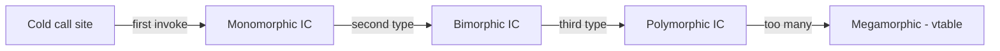
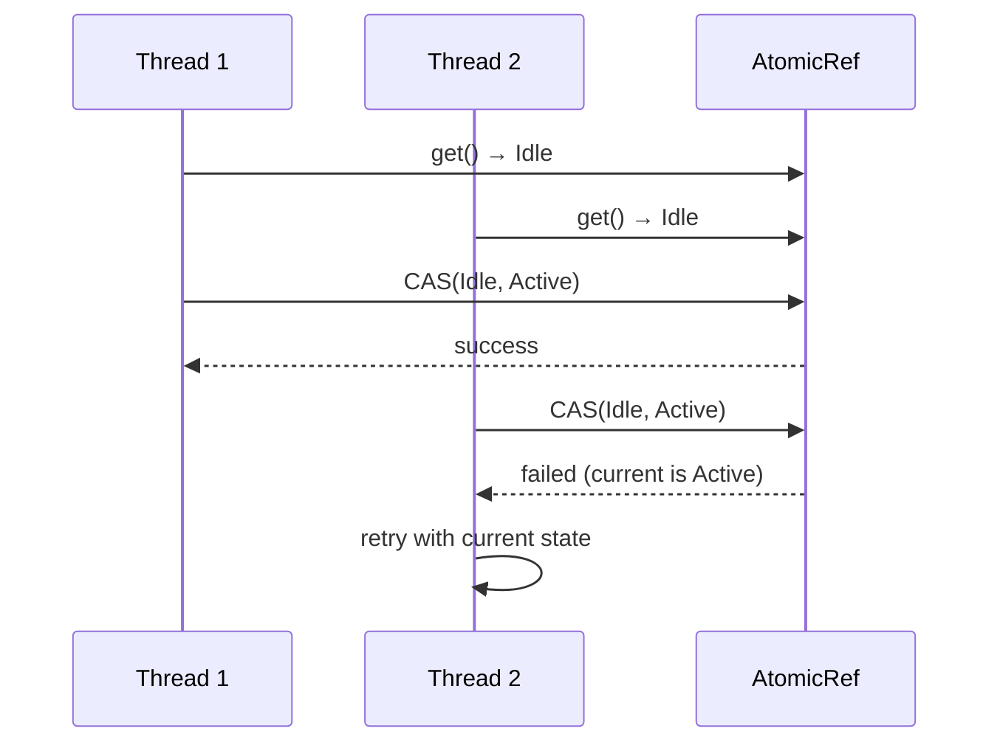

# State — Professional Level

> **Source:** [refactoring.guru/design-patterns/state](https://refactoring.guru/design-patterns/state)
> **Prerequisite:** [Senior](senior.md)

---

## Table of Contents

1. [Introduction](#introduction)
2. [State Pattern JIT and Inlining](#state-pattern-jit-and-inlining)
3. [Sealed Types Compile Optimization](#sealed-types-compile-optimization)
4. [Statechart Engine Internals (XState)](#statechart-engine-internals-xstate)
5. [Workflow Engine State Replay](#workflow-engine-state-replay)
6. [DB-backed FSM at Scale](#db-backed-fsm-at-scale)
7. [Concurrency: CAS-based Transitions](#concurrency-cas-based-transitions)
8. [State Persistence Formats](#state-persistence-formats)
9. [Cross-Language Comparison](#cross-language-comparison)
10. [Microbenchmark Anatomy](#microbenchmark-anatomy)
11. [Diagrams](#diagrams)
12. [Related Topics](#related-topics)

---

## Introduction

A State pattern at the professional level is examined for what the runtime makes of it: how JIT inlines polymorphic state dispatch, how sealed types let the compiler optimize, how statechart engines persist and resume, and where the performance cliffs live in DB-backed and event-sourced FSMs.

For high-throughput systems — payment processors, real-time game servers, large workflow platforms — the State machinery's design determines correctness and scale.

---

## State Pattern JIT and Inlining

### Monomorphic call site

```java
final State state = ... ;   // type fixed
state.handle(this);          // JIT sees one type at this site
```

JIT records the type; builds monomorphic inline cache; inlines `handle` body. Direct call performance.

### Bimorphic / polymorphic

If the call site sees 2-3 types, bimorphic IC. ~1ns per call. Acceptable.

### Megamorphic

If 8+ states pass through the same call site, vtable dispatch. ~2-3ns. JIT can't inline. For tight inner loops this matters; for business code it's invisible.

### Mitigation: type-specialized branches

```java
switch (state) {
    case INSTANCE_OF_A: ((A) state).handle(this); break;
    case INSTANCE_OF_B: ((B) state).handle(this); break;
}
```

Each branch is monomorphic. JIT inlines. Trade-off: dispatcher knows all states.

For typical State pattern usage with 5-10 states: dispatch is fine. Profile only when in a hot path.

---

## Sealed Types Compile Optimization

Java 17+ `sealed`, Kotlin `sealed class`, TypeScript discriminated unions.

```java
public sealed interface State permits Draft, Moderation, Published {}
```

### Compile-time benefits

- **Exhaustiveness**: `switch (state) { case Draft -> ... case Moderation -> ... }` requires all cases.
- **Refactor safety**: adding a new state forces compile errors at all dispatchers.
- **JIT optimization**: knowing the closed set of types enables specialization.

### Pattern matching in switches (Java 21+)

```java
String description = switch (state) {
    case Draft d -> "draft by " + d.author();
    case Moderation m -> "in moderation since " + m.startedAt();
    case Published p -> "published on " + p.date();
};
```

Compile-time exhaustive; readable; fast.

### Trade-off

Sealed types require listing all permitted subtypes in one place. Adding a state means modifying the sealed declaration. For libraries: deliberate; for application code: usually fine.

---

## Statechart Engine Internals (XState)

### Pure interpreters

XState's machines are pure values. The interpreter:

```typescript
const service = interpret(machine).start();
service.send('EVENT');
service.subscribe(state => render(state));
```

Each `send` computes the next state from the machine definition and current state. Functional; testable.

### State value representation

```typescript
{ value: { on: 'active.playing' }, context: {...}, actions: [...] }
```

Hierarchical state encoded as nested objects. Substates accessible via dot notation.

### Persistence

```typescript
const state = service.getSnapshot();
localStorage.setItem('fsm', JSON.stringify(state));

// later
const saved = JSON.parse(localStorage.getItem('fsm')!);
const restored = State.create(saved);
```

State snapshots are JSON-serializable. Resume via `interpret(machine).start(restored)`.

### Performance

Per `send`: ~10-50µs in JS. Acceptable for UI; not for tight loops. For server-side high-throughput, hand-rolled FSM may be faster.

---

## Workflow Engine State Replay

### Temporal — workflow as state machine

```python
@workflow.defn
class OrderWorkflow:
    state: str = "created"

    @workflow.run
    async def run(self, order):
        await workflow.execute_activity(charge, order, ...)
        self.state = "paid"
        await workflow.execute_activity(ship, order, ...)
        self.state = "shipped"
```

The workflow's local state IS its FSM state. Persistence: every `await` checkpoints. On worker crash, replay history; reach the same state.

### Determinism

Workflow code must be deterministic. Random / time / external calls = activities (results recorded). Replay produces same state.

### State explosion in long workflows

Workflows running for months / years accumulate history. Use `continue-as-new` to start a fresh workflow instance with current state. Prevents history bloat.

### Cost

Each transition: durable write to history (~ms). Workflow throughput: ~thousands per node. Scales by partition.

---

## DB-backed FSM at Scale

### Status column with check constraint

```sql
CREATE TABLE orders (
    id UUID PRIMARY KEY,
    status TEXT NOT NULL CHECK (status IN ('cart', 'paid', 'shipped', 'delivered', 'cancelled')),
    version INT NOT NULL DEFAULT 1
);
```

Constraint enforces valid statuses. Code enforces transitions.

### Optimistic update

```sql
UPDATE orders SET status = 'paid', version = version + 1
WHERE id = ? AND status = 'cart' AND version = ?;
```

Atomic check + update. Returns 0 rows on conflict; caller retries.

### Throughput

Single-row update: ~ms. With proper indexing, billions of orders supported.

### Hot row contention

If many transactions update the same row, lock contention. Mitigation: shard by ID; partition tables; or use append-only event log.

### Bulk transitions

Migrating all "pending" orders to "expired" after a timeout:

```sql
UPDATE orders SET status = 'expired'
WHERE status = 'pending' AND created_at < NOW() - INTERVAL '7 days';
```

Single bulk update. For huge tables, batch with `LIMIT` to avoid long locks.

---

## Concurrency: CAS-based Transitions

### Lock-free in-memory FSM

```java
public final class Counter {
    public sealed interface State permits Idle, Active, Done {}
    public record Idle() implements State {}
    public record Active(int count) implements State {}
    public record Done() implements State {}

    private final AtomicReference<State> state = new AtomicReference<>(new Idle());

    public boolean start() {
        return state.compareAndSet(new Idle(), new Active(0));
    }

    public boolean tick() {
        return state.updateAndGet(s -> switch (s) {
            case Active a -> new Active(a.count() + 1);
            default -> s;
        }) instanceof Active;
    }

    public boolean finish() {
        State current = state.get();
        return current instanceof Active && state.compareAndSet(current, new Done());
    }
}
```

Lock-free. CAS for atomic transitions. Failed CAS = concurrent transition; caller retries.

### CAS retry loops

```java
public void increment() {
    while (true) {
        State current = state.get();
        State next = compute(current);
        if (state.compareAndSet(current, next)) return;
    }
}
```

Pattern for any CAS-based update. Retries on conflict; lock-free.

### Cost

CAS: ~10ns when uncontended; up to µs under contention. For typical FSM with low contention: invisible. For hot global state: profile.

---

## State Persistence Formats

For DB-stored FSM state:

| Format | Size | Speed | Schema-aware |
|---|---|---|---|
| **String / enum** | Small | Fast | Yes (CHECK constraint) |
| **Integer code** | Smallest | Fastest | No (less readable) |
| **JSON document** | Larger | Slower | Per query |
| **Protobuf field** | Compact | Fast | Yes (schema) |

For most apps, string status column is best: readable in queries, simple constraints, easy migrations.

For event-sourced: state is computed; persistence is the event log.

---

## Cross-Language Comparison

| Language | Primary State Form | Notes |
|---|---|---|
| **Java** | sealed interface (17+) + records | Compile-time exhaustiveness |
| **Kotlin** | sealed class + when | Idiomatic; pattern matching |
| **C#** | abstract class + pattern matching | Discriminated unions in 9+ |
| **Go** | interface + struct types | No sealed types; convention |
| **Rust** | enum with variants | Exhaustive match by default |
| **TypeScript** | discriminated union | Type narrowing on `kind` |
| **Erlang** | gen_statem | Built-in OTP behavior |
| **Python** | class hierarchy or enum | No native sealed; convention |

### Key contrasts

- **Erlang/OTP gen_statem**: state machines are first-class. Mature, supervised, restartable.
- **Rust enums**: type-safe variant types. Compiler enforces exhaustive matching.
- **TypeScript discriminated unions**: lightweight; works without classes.

---

## Microbenchmark Anatomy

### State pattern dispatch

```java
@Benchmark public void handle(StateBench bench) {
    bench.context.handle();
}
```

Numbers (typical):
- Monomorphic: ~1ns
- Bimorphic: ~1ns
- Polymorphic (5 states): ~2ns
- Megamorphic (10+ states): ~3-4ns

Negligible for business code; visible in tight inner loops.

### CAS transition

CAS uncontended: ~10ns.
CAS under contention (10 threads): ~100ns-1µs.
Lock-based: ~50-200ns uncontended; can grow under contention.

### XState `send`

In JS: ~10-50µs per event. Overhead in machine definition lookup, action evaluation, context updates. Suitable for UI; not tight loops.

### Persistent FSM update (DB)

Single-row UPDATE with index: ~1-10ms.
With network round-trip: 10-50ms.
Throughput per shard: thousands/sec.

### JMH pitfalls

- Constant state → JIT folds.
- DCE removes unused transitions.
- Use Blackhole to consume results.

---

## Diagrams

### Inline cache evolution



### CAS-based FSM transition



---

## Related Topics

- [JIT inlining](../../../performance/jit-internals.md)
- [Sealed types](../../../coding-principles/sealed-types.md)
- [XState statecharts](../../../coding-principles/statecharts.md)
- [Lock-free CAS](../../../performance/lock-free.md)
- [Workflow replay](../../../infra/workflows.md)

[← Senior](senior.md) · [Interview →](interview.md)
