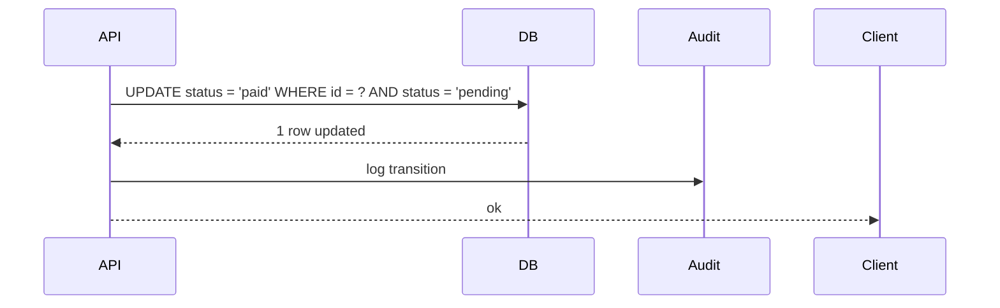
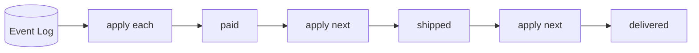

# State — Senior Level

> **Source:** [refactoring.guru/design-patterns/state](https://refactoring.guru/design-patterns/state)
> **Prerequisite:** [Middle](middle.md)

---

## Table of Contents

1. [Introduction](#introduction)
2. [State at Architectural Scale](#state-at-architectural-scale)
3. [Persistent State Machines](#persistent-state-machines)
4. [Statecharts (UML / Harel)](#statecharts-uml--harel)
5. [Concurrency in State Machines](#concurrency-in-state-machines)
6. [When State Becomes a Problem](#when-state-becomes-a-problem)
7. [Code Examples — Advanced](#code-examples--advanced)
8. [Real-World Architectures](#real-world-architectures)
9. [Pros & Cons at Scale](#pros--cons-at-scale)
10. [Trade-off Analysis Matrix](#trade-off-analysis-matrix)
11. [Migration Patterns](#migration-patterns)
12. [Diagrams](#diagrams)
13. [Related Topics](#related-topics)

---

## Introduction

> Focus: **At scale, what breaks? What earns its keep?**

In toy code State is "object's behavior depends on its mode." In production it is "every order in a marketplace lives in an FSM with 12 states, persisted to a DB, replayable for audit, with transitions guarded by domain rules and emitting events for downstream services." The senior question isn't "do I write State?" — it's **"how do I persist FSM state, replay transitions, handle concurrency, and evolve the FSM without breaking past data?"**

At scale State intersects with:

- **Workflow engines** — Temporal, Cadence, AWS Step Functions, Camunda.
- **Statecharts** — XState (JS), SCXML, UML statecharts.
- **Event-sourced aggregates** — state derived from events.
- **Saga orchestrators** — saga is essentially an FSM.
- **Database-backed state machines** — `status` column with strict transition rules.

These are State at architectural scale. The fundamentals apply but operational concerns dominate.

---

## State at Architectural Scale

### 1. Stripe PaymentIntent

```
requires_payment_method → requires_confirmation → processing → succeeded
                                                              ↘ requires_action
                                                              ↘ canceled
```

Stripe's API is a published FSM. Each transition is documented; clients react to current state. Persisted across requests; webhooks notify on transitions.

### 2. Order management at e-commerce scale

```
created → payment_pending → paid → fulfillment → shipped → delivered
            ↓
         payment_failed
```

Each state's allowed actions enforced server-side. Audit trail of every transition. Branches for cancellation, refund, partial fulfillment.

### 3. Workflow engines

Temporal workflows are state machines. Every step persists. Worker crashes? Replay history; resume. Long-running (days, months) without code-level state management.

### 4. UI state with Redux + state machines

```javascript
const machine = createMachine({
  id: 'auth',
  initial: 'unauthenticated',
  states: {
    unauthenticated: { on: { LOGIN: 'authenticating' } },
    authenticating: { on: { SUCCESS: 'authenticated', FAILURE: 'unauthenticated' } },
    authenticated: { on: { LOGOUT: 'unauthenticated' } },
  }
});
```

XState models complex UI flows declaratively. Easier to reason about than scattered `if`s.

### 5. CI/CD pipelines

Pipeline stage = state. queued → running → succeeded / failed / canceled. State per stage; pipeline state aggregates.

### 6. Game state (multiplayer, MMO)

Player character: idle / fighting / dead / respawning. Per-character FSM; thousands concurrent. Networked: state changes broadcast to other clients.

---

## Persistent State Machines

### The challenge

In-memory State pattern is great. But when the Context outlives a process (saved to DB, restarted, distributed across nodes), state must persist.

### Approaches

#### (a) Status column

```sql
CREATE TABLE orders (
    id UUID PRIMARY KEY,
    status TEXT NOT NULL,  -- 'cart' | 'paid' | ...
    ...
);
```

Simplest. State is a string. Loading: query the column; reconstruct State object.

```java
public Order load(String id) {
    String status = jdbc.queryForObject("SELECT status FROM orders WHERE id = ?", String.class, id);
    return new Order(status, ...);
}
```

Trade-off: enforce valid statuses with a CHECK constraint; transitions enforced in code.

#### (b) Event-sourced

State is derived from events:

```
events: [Created, PaymentReceived, Shipped]
→ state: Shipped
```

Every transition emits an event. State is computed by applying events. Audit trail is free.

#### (c) Workflow engine

Outsource entirely. The engine persists state per workflow instance. Code defines the FSM declaratively or imperatively; engine handles state.

### Schema evolution

Adding a new state: existing rows are unaffected (their status is "old"). Removing a state: require all rows to leave it first. Renaming: dual-name during migration.

For event-sourced systems, old events stay valid; new states arise from new events.

---

## Statecharts (UML / Harel)

Flat FSMs explode quickly: 5 states × 5 events = up to 25 transitions to define.

### Statechart features

1. **Hierarchy (substates).** Common transitions inherited.
2. **Parallel states.** Two FSMs running concurrently.
3. **History.** "Return to where we were."
4. **Guards.** Transitions conditional on context.
5. **Actions.** Side effects on entry / exit / transition.

### Hierarchy example

```
On
├── Standby
├── Active
│   ├── Playing
│   └── Paused
```

`power_off` event applies to all of `On` (including substates). Defined once, inherited.

### Parallel example

```
[ AppFSM ]   [ NetworkFSM ]
  Idle         Online
  Working      Offline
```

Both run independently. App can be Working while Network is Offline.

### XState (declarative)

```javascript
const lightMachine = createMachine({
    id: 'light',
    initial: 'green',
    states: {
        green: { after: { 5000: 'yellow' } },
        yellow: { after: { 1000: 'red' } },
        red: {
            after: { 5000: 'green' },
            on: { EMERGENCY: 'flashing' }
        },
        flashing: { on: { CLEAR: 'green' } }
    }
});
```

Declarative; visual; testable. Used in complex UI workflows.

---

## Concurrency in State Machines

### Single-threaded

Trivial. UI thread serializes. Web request: per-request Context.

### Multi-threaded shared Context

Two threads call methods that transition. Without synchronization, both see "old" state, both transition; one wins, the other's effects are lost or duplicated.

```java
public synchronized void publish() { state.publish(this); }
public synchronized void approve() { state.approve(this); }
```

Synchronize per-Context.

### Optimistic locking

For DB-persisted state machines:

```sql
UPDATE orders SET status = 'paid', version = version + 1
WHERE id = ? AND version = ? AND status = 'pending';
```

Check current state in WHERE clause; only update if it matches. Concurrent updates fail; retry.

### Per-context single-threaded executor

Workflow engines do this: each workflow instance runs on one thread at a time. Avoids races; constrains throughput per workflow but linearly scales across workflows.

### Race conditions in transitions

Transition A → B requires:
1. Read current state.
2. Check it's valid for the transition.
3. Apply transition (set new state).

Steps 1-3 must be atomic. Otherwise: read A; another thread transitions to B; we transition to B again. State now wrong.

Fix: synchronization, optimistic locking, or compare-and-swap on state.

---

## When State Becomes a Problem

### 1. State explosion

5 binary flags = 32 possible states. FSM diagram becomes spaghetti.

**Fix:** parallel statecharts (each flag is its own FSM); composite states; or rethink whether all flags really need to be states.

### 2. Hidden transitions

A method modifies state directly without going through a transition. State-pattern integrity broken.

**Fix:** make state field private; require all transitions to go through the FSM API.

### 3. Deep call chains

State A's method calls Context method, which calls another State, which calls back to Context. Mutual recursion. Stack confusing.

**Fix:** flatten; use events instead of method calls.

### 4. State doesn't match reality

The system is in state X, but the data says Y. Caused by bug or partial transition.

**Fix:** validate state on load; reconcile periodically; alert on mismatches.

### 5. Distributed FSMs

Multiple services hold partial state. Truth scattered. Transitions cross services.

**Fix:** Saga orchestrator; one source of truth per FSM. Or workflow engine.

### 6. Inability to evolve

Adding a state requires updating every consumer. Removing breaks history.

**Fix:** versioned states; backward-compatible transitions; long deprecation periods.

---

## Code Examples — Advanced

### A — Persistent FSM with optimistic locking (Java + JDBC)

```java
public final class OrderRepo {
    private final JdbcTemplate jdbc;

    public boolean tryTransition(String id, String fromStatus, String toStatus) {
        int rows = jdbc.update(
            "UPDATE orders SET status = ?, version = version + 1, updated_at = NOW() " +
            "WHERE id = ? AND status = ?",
            toStatus, id, fromStatus
        );
        return rows == 1;
    }
}

public final class Order {
    private final String id;
    private String status;

    public void pay() {
        if (!"pending".equals(status)) throw new IllegalStateException("can't pay in " + status);
        if (!repo.tryTransition(id, "pending", "paid")) {
            throw new ConcurrentModificationException("status changed concurrently");
        }
        this.status = "paid";
    }
}
```

DB enforces the transition. Concurrent attempts fail; caller can retry with fresh state.

---

### B — XState in production (TypeScript)

```typescript
import { createMachine, assign, interpret } from 'xstate';

interface Context {
    retries: number;
    error?: string;
}

const checkoutMachine = createMachine<Context>({
    id: 'checkout',
    initial: 'idle',
    context: { retries: 0 },
    states: {
        idle: { on: { CHECKOUT: 'paying' } },
        paying: {
            invoke: {
                src: 'chargeCard',
                onDone: 'done',
                onError: { target: 'failed', actions: assign({ error: (_, e) => e.data }) }
            }
        },
        failed: {
            on: {
                RETRY: { target: 'paying', actions: assign({ retries: ctx => ctx.retries + 1 }) },
                CANCEL: 'cancelled'
            }
        },
        done: { type: 'final' },
        cancelled: { type: 'final' }
    }
});

const service = interpret(checkoutMachine).start();
service.send('CHECKOUT');
```

Declarative; integrates with React; visualizable.

---

### C — Event-sourced FSM (Python)

```python
from dataclasses import dataclass, field
from typing import List


@dataclass
class Order:
    id: str
    status: str = "cart"
    events: List[dict] = field(default_factory=list)

    def apply(self, event: dict) -> None:
        if event["type"] == "Paid":
            self.status = "paid"
        elif event["type"] == "Shipped":
            self.status = "shipped"
        elif event["type"] == "Delivered":
            self.status = "delivered"
        elif event["type"] == "Cancelled":
            self.status = "cancelled"
        self.events.append(event)

    def pay(self) -> None:
        if self.status != "cart":
            raise RuntimeError(f"can't pay in {self.status}")
        self.apply({"type": "Paid", "order_id": self.id})

    @classmethod
    def from_events(cls, id: str, events: List[dict]) -> "Order":
        order = cls(id=id)
        for e in events:
            order.apply(e)
        return order
```

State derived from events. Loading: replay all events. Audit trail: read events.

---

### D — Hierarchical state with sealed types (Kotlin)

```kotlin
sealed class State {
    sealed class On : State() {
        object Standby : On()
        sealed class Active : On() {
            object Playing : Active()
            object Paused : Active()
        }
    }
    object Off : State()
}

class Player {
    var state: State = State.Off

    fun powerOn() {
        state = when (state) {
            is State.Off -> State.On.Standby
            else -> state
        }
    }

    fun play() {
        state = when (val s = state) {
            State.On.Standby, State.On.Active.Paused -> State.On.Active.Playing
            else -> s
        }
    }

    fun powerOff() {
        // Off transition applies to ALL of On (and substates) by hierarchy
        state = if (state is State.On) State.Off else state
    }
}
```

Sealed hierarchy gives compile-time exhaustiveness. Hierarchical via `is` checks.

---

## Real-World Architectures

### Stripe — payment intents

Documented FSM. Webhook events fire on transitions. Idempotent state changes (paying twice = no-op).

### Uber — trip lifecycle

Requested → Driver Found → En Route → In Progress → Completed. Each transition fires events to downstream services (billing, ratings).

### GitHub — pull request states

Open → Approved / Requested Changes → Merged / Closed. Branches: Draft, Conflict. Each transition gates allowed actions.

### AWS Step Functions

Visual statecharts as a managed service. JSON-defined; visual editor; persistent. Used at scale for ETL, ML pipelines, business workflows.

### Erlang/OTP gen_statem

Behavior in OTP for state machines. Built into the language; supervised; restartable. Mature ecosystem for state-machine-heavy systems.

---

## Pros & Cons at Scale

| Pros | Cons |
|---|---|
| Audit trail per transition | Persistence adds complexity |
| Models domain rules clearly | Schema evolution requires care |
| Workflow engines provide durability | Learning curve for engines |
| Statecharts handle complexity | Visual tools needed for large FSMs |
| Compile-time safety with sealed types | State explosion if not careful |
| Reusable across deploys (with persistence) | Concurrent transitions need locking |

---

## Trade-off Analysis Matrix

| Dimension | In-process State | DB status column | Event sourcing | Workflow engine |
|---|---|---|---|---|
| **Persistence** | None | Simple | Full history | Built-in |
| **Audit trail** | None | None (or log) | Full | Full |
| **Concurrency** | sync block | optimistic locking | append-only | engine-managed |
| **Replay** | No | No | Yes | Yes |
| **Distributed** | No | Limited | Yes | Yes |
| **Operational cost** | Zero | Low | Medium | High |
| **Schema evolution** | Code change | Migration | Event versioning | Workflow versioning |

---

## Migration Patterns

### Adding a new state

1. Add the state class / enum value.
2. Define transitions to/from.
3. Existing data: unaffected (still in old states).
4. Update consumers gradually.

### Removing a state

1. Block transitions TO the deprecated state.
2. Migrate existing data out (transition to a new state).
3. Wait until DB has zero rows in the old state.
4. Remove code.

### Splitting a state

`Active` → `Active_Online` + `Active_Offline`. Migrate by adding a sub-state distinguishing the two. Update transitions.

### From flat FSM to statechart

1. Identify shared behavior (parent state).
2. Refactor to hierarchy.
3. Existing transitions still work; new ones use parent.

### From in-process to workflow engine

1. Define workflow declaration matching current FSM.
2. New flows use workflow engine.
3. Migrate existing flows: load state, hand to engine, continue.
4. Decommission custom code once stable.

---

## Diagrams

### Persistent FSM with audit



### Event-sourced state derivation



---

## Related Topics

- [Workflow engines](../../../infra/workflows.md)
- [Statecharts (XState)](../../../coding-principles/statecharts.md)
- [Saga pattern](../../../coding-principles/saga.md)
- [Event sourcing](../../../coding-principles/event-sourcing.md)
- [Optimistic concurrency](../../../coding-principles/optimistic-locking.md)

[← Middle](middle.md) · [Professional →](professional.md)
